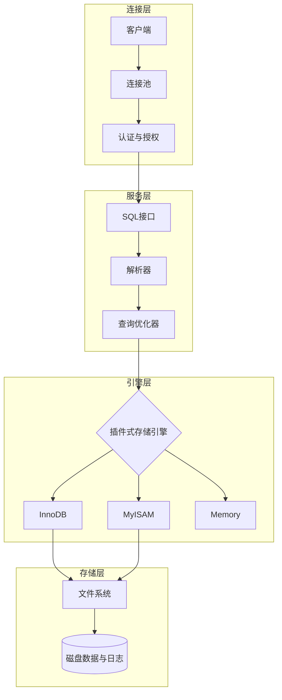

# 数据库原理与应用实践教程 · 完整笔记

> 本笔记结构对应教材目录，涵盖基础篇全部8章内容。

---

# 数据库家族的大地图

数据库主要分为两大派系，就像超市和杂货铺，各有用处：

|**类别**|**代表选手**|**特点**|**比喻**|
|---|---|---|---|
|关系型数据库 (SQL)|MySQL, PostgreSQL, Oracle|结构严谨，像 Excel 表格，数据之间有逻辑关联。|严谨的财务报表|
|非关系型数据库 (NoSQL)|MongoDB, Redis|格式灵活，速度快，适合存文档、缓存或社交网络。|随拿随放的储物盒|

---

# MySQL 入门第一课：揭开数据的面纱

### 1. 什么是数据库？

- **数据库 (DB，Database)：** 数据的集合。你可以把它想象成一个"存放数据的仓库"
    
    - 一堆结构化数据的集合
    - 比如：学生表、成绩表、用户表
- **数据(D, Data)：** 库里存的内容
    
    - 数字、文字、图片、记录等
    - 是 DB 里的最小单位
- **数据库管理系统 (DBMS，Database Management System)：** 管理数据库的软件、工具。比如 MySQL 软件本身，它是那个"仓库管理员"，你不能直接闯进仓库拿东西，必须给管理员发指令。
    
- **数据库系统（DBS，Database System）：** 整个一套完整系统= DB（数据） + DBMS（软件） + 应用程序 + 管理员 + 用户是最大的概念，包含前面所有
    

### 2. MySQL 的核心逻辑：表格思维

MySQL 是**关系型**数据库。它的核心逻辑就是：**万物皆表格**。

在 MySQL 里，数据是这样层层嵌套的：

1. **服务器 (Server)**：运行 MySQL 的机器。
    
2. **数据库 (Database)**：一个项目对应一个库（比如"我的商城"）。
    
3. **表 (Table)**：库里有很多表（比如"用户表"、"商品表"）。
    
4. **行 (Row)**：每一行代表一个具体的数据（比如"用户张三"）。
    
5. **列 (Column/Field)**：每一列代表一个属性（比如"年龄"、"性别"）。
    

---

### 3. 必须掌握的"专业术语"

在正式写代码前，先混个脸熟：

- **主键 (Primary Key)**：每张表必须有一个唯一的标识，就像你的**身份证号**，不能重复。
    
- **SQL (Structured Query Language)**：这是你跟"管理员"（MySQL）沟通的**唯一语言**。
    

---

### 4. 第一组 SQL 指令（CRUD）

几乎所有的数据库操作都逃不出这四个字：**增、删、改、查**。

- **C (Create) 增加**：
    
    ```sql
    INSERT INTO users (name, age) VALUES ('张三', 25);
    ```
    
- **R (Retrieve) 查询**（最常用！）：
    
    ```sql
    SELECT * FROM users WHERE age > 18;
    ```
    
- **U (Update) 修改**：
    
    ```sql
    UPDATE users SET age = 26 WHERE name = '张三';
    ```
    
- **D (Delete) 删除**：
    
    ```sql
    DELETE FROM users WHERE name = '张三';
    ```
    

> **温馨提示：** 删数据的时候千万别忘了写 `WHERE` 条件，否则你可能会体验到什么叫"从删库到跑路"！😅

---

### 5.连接命令

```bash
mysql -u root -p
```

- **`mysql`**：调用 MySQL 客户端程序。
    
- **`-u`**：后面紧跟用户名（User）。`root` 是系统的超级管理员账号。
    
- **`-p`**：代表密码（Password）。
    
    - **注意**：输入回车后，系统会提示 `Enter password:`，此时输入密码是**看不见**的（光标不会动），这是正常的安全保护机制，输完直接回车即可。

---

如果你的数据库不在本地电脑上，而是在远程服务器上，你需要告诉客户端去哪里找它：

```bash
mysql -h 127.0.0.1 -P 3306 -u root -p
```

- **`-h` (Host)**：数据库所在的 IP 地址（本地通常是 `127.0.0.1` 或 `localhost`）。
    
- **`-P` (Port)**：大写的 P，指定端口号。MySQL 默认端口是 `3306`。
    

---

你可以直接把密码写在命令里（注意 `-p` 和密码之间**不能有空格**）：

```bash
mysql -u root -p123456
```

> **安全警告**：极其不建议这样做！因为你的密码会以明文形式留在历史记录里，很容易被别人看到。

### 6. 为什么大家都学 MySQL？

- **免费开源**：不用花钱就能用在你的项目里。
    
- **资料多**：遇到问题，随便一搜就有答案。
    
- **性能稳**：不管是你的个人博客，还是像腾讯、阿里这样的大厂，都在大规模使用。
    

---

---

# 第2章 关系数据库基础

## 2.1 关系数据结构

### 2.1.1 关系（Relation）

关系就是一张二维表。用数学的语言说：给定一组域 $D_1, D_2, \ldots, D_n$，它们的**笛卡尔积**的任意一个子集叫做一个**关系**。

- **元组（Tuple）**：表中的一行，对应现实中的一个实体实例。
- **属性（Attribute）**：表中的一列，对应实体的一个特征。
- **域（Domain）**：属性的取值范围，比如"性别"的域是 `{男, 女}`。
- **度（Degree）**：关系中属性（列）的数目。
- **基数（Cardinality）**：关系中元组（行）的数目。

### 2.1.2 关系模式与关系数据库

- **关系模式**：是关系的"描述"，也就是表结构，记作 `R(A1, A2, ..., An)`。
    - 例如：`Student(学号, 姓名, 年龄, 性别, 专业)`
- **关系**：是关系模式在某一时刻的"值"，也就是表中当前存储的数据。
- **关系数据库**：若干个关系模式的集合。

> **区分**：关系模式是"型"（静态），关系是"值"（动态）。前者定义结构，后者装载数据。

### 2.1.3 关系的完整性约束

|**约束类型**|**说明**|**例子**|
|---|---|---|
|**实体完整性**|主键不能为 NULL，且唯一|`学号` 是主键，不能有两个学生有相同学号|
|**参照完整性**|外键值必须在被参照表中存在，或为 NULL|成绩表里的 `学号` 必须在学生表里存在|
|**用户自定义完整性**|根据业务规则自定义的约束|年龄必须在 0~150 之间|

---

## 2.2 关系代数

关系代数是一种抽象的**查询语言**，用对关系（表）进行运算来表达查询。它是 SQL 的理论基础。

运算符分为两大类：**传统集合运算** 和 **专门的关系运算**。

### 2.2.1 传统的集合运算

这四种运算要求参与运算的两个关系**结构完全相同**（即列数相同，对应列的域相同）。

#### 并（Union）

$$R \cup S$$

将两个关系的元组合并，**去掉重复的元组**。

- 相当于 SQL 中的 `UNION`（去重）。

#### 差（Difference）

$$R - S$$

在 R 中保留那些**不在 S 中**出现的元组。注意：差运算**不可交换**，$R-S \neq S-R$。

- 相当于 SQL 中的 `EXCEPT`（部分数据库支持）。

#### 交（Intersection）

$$R \cap S$$

保留**同时在 R 和 S 中**出现的元组。

- 可以用差运算推导：$R \cap S = R - (R - S)$

#### 广义笛卡尔积（Cartesian Product）

$$R \times S$$

将 R 中每一个元组与 S 中**每一个元组**拼接，结果列数为 R 和 S 列数之和，行数为两者行数之积。

- R 有 3 行，S 有 4 行，则 $R \times S$ 有 12 行。
- 这就是**多表查询不加 WHERE 条件时**产生"笛卡尔积"的数学本质。

---

### 2.2.2 专门的关系运算

这四种运算是关系数据库特有的。

#### 选择（Selection）

$$\sigma_{条件}(R)$$

从关系 R 中挑选**满足条件的行**（横向过滤行）。

- 相当于 SQL 中的 `WHERE` 子句。

**例：** $\sigma_{年龄>20}(Student)$ → 找出年龄大于 20 的所有学生。

#### 投影（Projection）

$$\Pi_{属性列表}(R)$$

从关系 R 中选取**指定的列**（纵向过滤列），并去掉结果中的重复行。

- 相当于 SQL 中的 `SELECT 字段名`。

**例：** $\Pi_{姓名, 专业}(Student)$ → 只显示学生的姓名和专业两列。

#### 连接（Join）

连接是最重要的关系运算，用于**合并两个关系中相关联的元组**。

$$R \bowtie_{R.A \theta S.B} S$$

连接可分为：

|**连接类型**|**说明**|**对应 SQL**|
|---|---|---|
|**等值连接**|连接条件使用 `=`|`FROM R, S WHERE R.a = S.b`|
|**自然连接**|等值连接后去掉重复列，最常用|`NATURAL JOIN` 或显式 `JOIN...ON`|
|**外连接**|保留一侧或两侧无法匹配的元组，用 NULL 填充|`LEFT/RIGHT/FULL OUTER JOIN`|

> **自然连接 vs 等值连接**：自然连接在等值连接基础上会**自动去掉重复的连接列**，更简洁。

#### 除（Division）

$$R \div S$$

除法是最难理解的一种运算。直觉上：在 R 中找出那些**与 S 中所有元组都有关联**的元组。

**经典场景**："查询选修了**全部**课程的学生" → 用选课关系 ÷ 课程关系。

|**运算**|**直觉理解**|**SQL 对应**|
|---|---|---|
|选择 σ|筛行（WHERE）|`WHERE 条件`|
|投影 Π|筛列（SELECT）|`SELECT 列名`|
|连接 ⋈|合并关联的两张表|`JOIN ... ON ...`|
|除 ÷|"全部都满足"类查询|双重 `NOT EXISTS`|

---

## 2.3 完整性约束（SQL实现）

完整性约束在 SQL 层面的实现详见第4章，此处作概念总结：

- **实体完整性** → `PRIMARY KEY` 约束
- **参照完整性** → `FOREIGN KEY ... REFERENCES ...` 约束
- **用户自定义完整性** → `NOT NULL`、`UNIQUE`、`CHECK`、`DEFAULT` 约束

---

---

# 字段类型

### 数值类型

|**类型**|**大小**|**有符号范围 (Signed)**|**无符号范围 (Unsigned)**|**用途建议**|
|---|---|---|---|---|
|**TINYINT**|1 字节|-128 ~ 127|0 ~ 255|小状态值、布尔模拟|
|**INT**|4 字节|-21亿 ~ 21亿|0 ~ 42.9亿|**最常用**，主键 ID|
|**BIGINT**|8 字节|极大范围|0 ~ 极大范围|雪花算法 ID、大数统计|
|**DECIMAL**|依赖定义|极其精确|极其精确|**金钱、财务数据**|
|**FLOAT/DOUBLE**|4/8 字节|很大|很大|科学计算、非精确小数|

### 字符串类型 (String Types)

用于存储文本、段落或二进制数据。

|**类型**|**特点**|**最大长度**|**用途建议**|
|---|---|---|---|
|**CHAR(n)**|定长字符串|255 字符|长度固定的数据（如：邮编、手机号、MD5）|
|**VARCHAR(n)**|**变长字符串**|65535 字节|**最常用**，姓名、地址、标题|
|**TEXT**|长文本数据|64 KB|文章内容、备注、长描述|
|**LONGTEXT**|极大文本|4 GB|超长文章、日志|
|**BLOB**|二进制数据|64 KB|图片、文件（通常建议存路径，不存文件本身）|

_char相对于varchar性能略高但浪费磁盘空间，varchar相对于char性能略低但节约磁盘空间_

### 日期和时间类型 (Date and Time Types)

|**类型**|**格式**|**大小**|**特点**|
|---|---|---|---|
|**DATE**|`YYYY-MM-DD`|3 字节|仅日期（如：生日）|
|**TIME**|`HH:MM:SS`|3 字节|仅时间（如：持续时长）|
|**DATETIME**|`YYYY-MM-DD HH:MM:SS`|8 字节|**最常用**，绝对时间范围广|
|**TIMESTAMP**|`YYYY-MM-DD HH:MM:SS`|4 字节|带时区转换，适合记录修改时间|
|**YEAR**|`YYYY`|1 字节|仅年份|

### 选型 3 大原则 (Tips)

1. **够用就好**：如果年龄不会超过 200 岁，用 `TINYINT UNSIGNED` 就比 `INT` 省空间。
    
2. **尽量避免 NULL**：尽可能给字段设置 `NOT NULL`，并给定默认值。因为 `NULL` 会增加索引开销。
    
3. **金钱用 DECIMAL**：永远不要用 `FLOAT` 或 `DOUBLE` 存钱，因为它们存在舍入误差，`DECIMAL(10, 2)`（总长10位，2位小数）才是专业的。
    

### 实战代码示例 (DDL)

```sql
-- 创建一个学生表，涵盖常用类型
CREATE TABLE students (
    id INT PRIMARY KEY AUTO_INCREMENT,    -- 整数主键，自动增长
    name VARCHAR(50) NOT NULL,            -- 变长字符串，必填
    age TINYINT UNSIGNED,                 -- 无符号小整数
    balance DECIMAL(10, 2) DEFAULT 0.00,  -- 精确小数（存款）
    bio TEXT,                             -- 长文本（简介）
    birthday DATE,                        -- 日期
    created_at TIMESTAMP DEFAULT CURRENT_TIMESTAMP -- 自动生成记录时间
);
```

---

---

# SQL

## 1、SQL通用语法

1. 可以单行或多行书写，以**分号**结尾
2. 可以使用空格/缩进增强可读性
3. SQL语句在windows上不区分大小写，但一般关键字建议使用大写，标识符小写
4. SQL只认英文标点，中文标点直接报错

---

---

## 2、SQL分类

在 MySQL 的世界里，SQL 语句虽然多，但就像乐高积木一样，根据**功能**被分成了四大类（有时加上事务控制是五类）。

### 1. DDL（Data Definition Language 数据定义语言）

**关键词：结构 (Structure） 用来定义数据库对象（数据库、表、字段）**

它是用来**定义或修改数据库、表、索引**的结构。想象成你在设计一个 Excel 表格的表头（比如：这一列叫姓名，那一列叫年龄）。

- **CREATE**：创建数据库或表。
    
- **ALTER**：修改现有的表结构（比如增加一列）。
    
- **DROP**：删除整个表或数据库（**危险操作！**）。
    
- **TRUNCATE**：清空表里的所有内容，但保留表结构。
    

#### DDL--数据库操作

查询 查询所有数据库：show databases; 查询当前数据库：select database(); 创建 create database [if not exists] 数据库名 [default charset 字符集] [collate 排序规则] ==**([...]表示可选参数)**== _字符集不推荐使用utf8，mysql的utf8是阉割版：utfbmb3，最多只支持三个字节，不支持标准utf8的四字节（即utf8mb4），无法存emoji 和生僻字。所以字符集要指定为utf8mb4（默认也是）_ 删除 drop database [if exists] 数据库名; 使用 use 数据库名

**database也可以替换成schema，如：create schema db01**

#### DDL--表操作

_(注意要先选定数据库再操作)_

> _查询操作_ 查询当前数据库所有表 show tables; 查询表结构 desc 表名; 查询指定表的建表语句 show create table 表名;

> _创建操作_ create table 表名( 字段1 字段1类型[comment 字段1注释], 字段2 字段2类型[comment 字段2注释], 字段3 字段3类型[comment 字段3注释], ..... 字段n 字段n类型[comment 字段n注释]**这里不要加逗号** )[comment 表注释];

> _修改操作_ 添加字段 ALTER TABLE 表名 字段名 类型（长度）ADD [COMMENT 注释] [约束]; 修改数据类型 ALTER TABLE 表名 MODIFY 字段名 新数据类型（长度）; 修改字段名和字段类型 ALTER TABLE 表名 CHANGE 旧字段名 新字段名 类型（长度）[COMMENT 注释] [约束]; 删除字段 ALTER TABLE 表名 DROP 字段名; 修改表名 ALTER TABLE 表名 RENAME TO 新表名;

> _删除操作_ 删除表 DROP TABLE [IF EXISTS] 表名; 删除指定表，并重新创建该表 **表的数据清空** TRUNCATE TABLE 表名;

---

### 2. DML（Data Manipulation Language 数据操作语言）

**关键词：增删改 (Data) 用来对数据库表中的数据增删改**

这是小白最常用的部分，用来对表里的**记录**进行操作。想象成你在 Excel 表格里填入具体的员工信息。

- **INSERT**：插入新数据。
    
- **UPDATE**：修改现有数据。
    
- **DELETE**：删除指定的行。
    

> _插入操作（必须按表结构顺序写全所有值)_ 指定列插入 INSERT INTO 表名 (字段1, 字段2, ...) VALUES (值1, 值2, ...); 全量插入 INSERT INTO 表名 VALUES (值1, 值2, ...); 批量插入 INSERT INTO 表名 (字段1, 字段2...) VALUES (值A, 值B...), (值A, 值B...); INSERT INTO 表名 VALUES (值A, 值B...), (值A, 值B...);

> _修改操作_ UPDATE 表名 SET 字段名1=值1, 字段名2=值2, ....[WHERE 条件]; **（若WHERE不存在，表示修改整张表的所有数据）**

> _删除操作_ DELETE FROM 表名 [WHERE 条件]; **（若WHERE不存在，表示删除整张表的所有数据）** **（DELETE语句不能删除某一个字段的值，可以使用UPDATE加上NULL）**

---

### 3. DQL（Data Query Language 数据查询语言）

**关键词：看 (Read) 用来查询数据库中表的记录**

虽然它常被归在 DML 里，但因为它太重要了，通常单独拎出来。它是你从数据库里**提取信息**的唯一手段。

- **SELECT**：字段列表
- **FROM**：表名列表
- **WHERE**：条件列表
- **GROUP BY**：分段字段列表
- **HAVING**：分组后条件列表
- **ORDER BY**：排序字段列表
- **LIMIT**：分页参数

> _基本查询_ 查询多个字段 SELECT 字段1，字段2，字段3...FROM 表名; SELECT * FROM 表名; 设置别名 SELECT 字段1[AS 别名1]，字段2[AS 别名2]...FROM 表名; 去除重复记录 SELECT DISTINCT 字段列表 FROM 表名;

==若定义了别名，就不能再使用原名进行操作==

> _条件查询_ SELECT 字段列表 FROM 表名 WHERE 条件列表;

比较运算符

|**运算符**|**功能描述**|**示例**|
|---|---|---|
|`>`, `>=`, `<`, `<=`|大于、大于等于、小于、小于等于|`age >= 18`|
|`=`, `<>` 或 `!=`|等于、不等于|`name != '张三'`|
|**BETWEEN ... AND ...**|在某个范围之内 (含最小值、最大值，不能倒过来)|`age BETWEEN 15 AND 25`|
|**IN(...)**|在指定的集合/列表中，多选一|`id IN (1, 2, 3)`|
|**LIKE 占位符**|**模糊匹配**：`_` 匹配单个字符，`%` 匹配任意个字符|`name LIKE '张%'` (姓张的人)|
|**IS NULL**|判断字段值是否为空|`email IS NULL`|

逻辑运算符

|**运算符**|**功能描述**|**备选写法**|
|---|---|---|
|**AND**|并且 (所有条件必须同时成立)|`&&`|
|**OR**|或者 (多个条件只要有一个成立即可)|`\|`|
|**NOT**|非，不是|`!`|

> _聚合函数_ **(将一列数据作为一个整体，进行纵向计算)** SELECT 聚合函数(字段列表) FROM 表名;

常见聚合函数 **注意：所有的聚合函数都会忽略 NULL 值**

|**函数**|**功能**|
|---|---|
|**count**|统计数量（行数）|
|**max**|最大值|
|**min**|最小值|
|**avg**|平均值|
|**sum**|求和|

> _分组查询_ SELECT 字段列表 FROM 表名 [WHERE 条件] GROUP BY 分组字段名 [HAVING 分组后过滤条件];

where 与 having 的区别

|**区别点**|**where**|**having**|
|---|---|---|
|**执行时机不同**|**分组之前**进行过滤。不满足条件的不参与分组。|**分组之后**对结果进行过滤。|
|**判断条件不同**|**不能**对聚合函数进行判断。|**可以**对聚合函数进行判断。|

> [!tip]
> 
> 1. **执行顺序**：`where` > `聚合函数` > `having`。
> 2. **查询字段限制**：分组之后，`SELECT` 后面的字段一般只能是 **分组字段** 和 **聚合函数**。查询其他字段通常没有意义，因为一个组里有很多行，数据库不知道你要显示哪一行。

> _排序查询_ SELECT 字段列表 FROM 表名 ORDER BY 字段1 排序方式1，字段2 排序方式2;

- ASC: 升序（默认值）
- DESC:降序 **如果是多字段排序，当第一个字段相同时，才会根据第二个字段进行排序**

> _分页查询_ SELECT 字段列表 FROM 表名 LIMIT 起始索引，查询记录数;

> [!tip]
> 
> - 起始索引从0开始，起始索引=（查询页码-1）* 每页显示记录数
> - 分页查询是数据库的方言，不同的数据库有不同的实现，MYSQL是LIMIT
> - 如果查询的是第一页数据，起始索引可以省略，直接简写为LIMIT 10

#### 1. 编写顺序（你写代码时的样子）

1. **SELECT**（查什么）
2. **FROM**（从哪查）
3. **WHERE**（分组前的过滤条件）
4. **GROUP BY**（如何分组）
5. **HAVING**（分组后的过滤条件）
6. **ORDER BY**（怎么排序）
7. **LIMIT**（取多少条）

#### 2. 执行顺序（MySQL 运行时的样子）

|**步骤**|**指令**|**逻辑描述**|
|---|---|---|
|**1**|**FROM**|先找到那是哪张表。|
|**2**|**WHERE**|按照条件，把不合格的行剔除掉。|
|**3**|**GROUP BY**|将剩下的数据分成一个个小组。|
|**4**|**HAVING**|对分好组后的结果再进行一次筛选。|
|**5**|**SELECT**|**重点！** 到这一步才决定要把哪些列挑出来。|
|**6**|**ORDER BY**|选出来的结果最后排个序。|
|**7**|**LIMIT**|排序完了，切下前面或中间的几段。|

---

### 4. DCL（Data Control Language 数据控制语言）

**关键词：权限 (Permission) 用来创建数据库用户、控制数据库的访问权限**

这是"管理员"干的活，用来定义谁能看、谁能改。

- **GRANT**：授予用户访问权限。
    
- **REVOKE**：撤销用户的权限。
    

> _管理用户_ 查询用户 USE mysql; SELECT * FROM user; 创建用户 CREATE USER '用户名' @ '主机名' IDENTIFIED BY '密码'; 修改用户密码 ALTER USER '用户名' @ '主机名' IDENTIFIED WITH mysql_native_password BY '新密码' 删除用户 DROP USER '用户名' @ '主机名'

> [!tip]
> 
> - 主机名可以使用%通配，表示在任意主机都允许操作
> - 这类sql开发人员操作的比较少，主要是DBA（Database Administrator 数据库管理员使用）

> _权限控制_ 查询权限 SHOW GRANTS FOR '用户名' @ '主机名'; 授予权限 GRANT 权限列表 ON 数据库名.表名 TO '用户名' @ '主机名'; 撤销权限 REVOKE 权限列表 ON 数据库名.表名 FROM '用户名' @ '主机名';

> [!tip]
> 
> - 多个权限之间，使用逗号分隔
> - 授权时，数据库名和表名可以使用 * 进行通配

---

### 5. TCL（事务控制语言）

**关键词：后悔药 (Transaction)**

专门用于维护数据的**一致性**，常用于银行转账等严谨场景。

- **COMMIT**：确认提交（把修改永久存盘）。
    
- **ROLLBACK**：回滚（发现操作错了，瞬间恢复到修改前）。
    
- **SAVEPOINT**：设置保存点（类似游戏的存档点）。
    

---

---

# 函数

_SELECT 函数（参数）_

## 字符串函数

|**函数**|**功能**|**示例**|
|---|---|---|
|**CONCAT(s1, s2...n)**|字符串拼接|`CONCAT('Hello', 'MySQL')` -> `HelloMySQL`|
|**LOWER(str)**|全部转小写|`LOWER('Hello')` -> `hello`|
|**UPPER(str)**|全部转大写|`UPPER('Hello')` -> `HELLO`|
|**LPAD(str，n，pad) **|左填充，用字符串pad对str的左边进行填充，达到n个字符长度|`LPAD('01', 5, '-')` -> `---01`|
|**RPAD(str，n，pad)**|右填充，用字符串pad对str的右边进行填充，达到n个字符长度|`RPAD('01', 5, '-')` -> `01---`|
|**TRIM(str)**|去除左右空格（不去除中间的）|`TRIM(' Hello ')` -> `Hello`|
|**SUBSTRING(str，start，len)**|截取字符串，返回字符串str从start位置起的len个长度的字符串（索引从1开始）|`SUBSTRING('Hello', 1, 3)` -> `Hel`|

## 数值函数

|**函数**|**功能**|**示例**|
|---|---|---|
|**CEIL(x)**|向上取整|`CEIL(1.1)` -> `2`|
|**FLOOR(x)**|向下取整|`FLOOR(1.9)` -> `1`|
|**MOD(x, y)**|取模（求余）|`MOD(7, 4)` -> `3`|
|**RAND()**|获取 0~1 随机数|`RAND()`|
|**ROUND(x, y)**|四舍五入|`ROUND(2.345, 2)` -> `2.35`|

## 日期函数

|**函数**|**功能**|**示例**|
|---|---|---|
|**CURDATE()**|返回当前日期|`2024-05-20`|
|**CURTIME()**|返回当前时间|`13:14:00`|
|**NOW()**|返回当前日期+时间|`2024-05-20 13:14:00`|
|**YEAR(date)**|获取指定date的年份|`YEAR(NOW())`|
|**MONTH(date)**|获取指定date的月份|`MONTH(NOW())`|
|**DAY(date)**|获取指定date的日期|`DAY(NOW())`|
|**DATE_ADD(data，INTERVAL expr type)**|返回一个日期/时间值加上一个时间间隔expr后的时间值|`DATE_ADD(NOW(), INTERVAL 1 YEAR)`|
|**DATEDIFF(d1, d2)**|计算两个日期相差天数|`DATEDIFF('2024-10-01', '2024-01-01')`|

## 流程函数

|**函数**|**功能**|**示例**|
|---|---|---|
|**IF(value, t, f)**|如果 value 为 True，返回 t；否则返回 f|判断及格：`IF(score>=60, '及格', '挂科')`|
|**IFNULL(v1, v2)**|如果 v1 不为 NULL，返回 v1；否则返回 v2|填充空地址：`IFNULL(address, '地址不详')`|
|**CASE WHEN [v1] THEN [r1] ... ELSE [res] END**|如果v1为true，返回res1，...否则返回default默认值。类似于 `if-else`|划分成绩等级（优/良/中/差）|
|**CASE [expr] WHEN [v1] THEN [r1] ... ELSE [res] END**|如果expr的值等于v1，返回res1，...否则返回default默认值。类似于编程里的 `switch`|根据代码显示部门名称|

---

---

# 约束

## 概述

### 1. 概念

约束(Constraints)是作用于表中字段上的规则，用于限制存储在表中的数据，可以在创建表/修改表时添加约束

### 2. 目的

保证数据库中数据的**正确性**、**有效性**和**完整性**。

### 3. 约束分类详解

|**约束名称**|**描述**|**关键字**|
|---|---|---|
|**非空约束**|限制该字段的数据不能为 `null`|`NOT NULL`|
|**唯一约束**|保证该字段的所有数据都是唯一、不重复的|`UNIQUE`|
|**主键约束**|主键是一行数据的唯一标识，要求**非空且唯一**|`PRIMARY KEY（自增：AUTO_INCREMENT）`|
|**默认约束**|保存数据时，如果未指定该字段的值，则采用默认值|`DEFAULT`|
|**检查约束**|保证字段值满足某一个条件（适用于 MySQL 8.0.16 版本之后）|`CHECK`|
|**外键约束**|让两张表的数据之间建立连接，保证数据的一致性和完整性|`FOREIGN KEY`|

---

## 约束演示

```sql
CREATE TABLE users (
    id INT PRIMARY KEY AUTO_INCREMENT,
    name VARCHAR(10) NOT NULL UNIQUE,
    age INT CHECK (age > 0 AND age < 120),
    status CHAR(1) DEFAULT '1',
    gender CHAR(1)
);
```

---

## 外键约束(Foreign Key)

### 概念

外键用来让两张表的数据建立连接。

- **父表（主表）**：被引用的表（如：部门表）。
    
- **子表（从表）**：引入外键的表（如：员工表）。
    

### 语法

_A. 建表时添加_

```sql
CREATE TABLE 表名 (
    字段名 数据类型,
    ...
    CONSTRAINT 外键约束名称 FOREIGN KEY (外键字段名) REFERENCES 主表（主表字段名）
);
```

_B. 后期添加外键：_

```sql
ALTER TABLE 表名 ADD CONSTRAINT 外键约束名称 FOREIGN KEY (外键字段名) REFERENCES 主表 (主表字段名) [ON UPDATE 行为 ON DELETE 行为];
```

|**行为**|**说明**|
|---|---|
|**NO ACTION**|**默认行为**。在父表中删除/更新记录时，首先检查该记录是否有对应外键，如果有则**不允许**删除/更新。（与 RESTRICT 一致）|
|**RESTRICT**|在父表中删除/更新记录时，首先检查该记录是否有对应外键，如果有则**不允许**删除/更新。（与 NO ACTION 一致）|
|**CASCADE**|**级联行为**。在父表中删除/更新记录时，首先检查该记录是否有对应外键，如果有，则**同步删除/更新**子表中的记录。|
|**SET NULL**|在父表中删除记录时，首先检查该记录是否有对应外键，如果有，则**设置子表中该外键值为 null**。（要求子表外键列允许取 null）|
|**SET DEFAULT**|父表有变更时，子表将外键列设置成一个默认值（**注意：InnoDB 存储引擎不支持此行为**）。|

_C. 删除外键：_

```sql
ALTER TABLE 表名 DROP FOREIGN KEY 外键约束名称;
```

---

---

# 数据库安全性

## 4.1 数据安全性概述

数据库安全性是指**保护数据库，防止不合法的使用所造成的数据泄露、更改或破坏**。安全性问题不是数据库系统所独有的，但数据库系统中大量数据集中存放，而且为许多最终用户直接共享，使安全问题更为突出。

### 安全性威胁来源

- **非授权用户**：未经授权的用户对数据库进行访问。
- **越权操作**：合法用户对其无权访问的数据进行操作。
- **数据泄露**：数据在传输或存储过程中被窃取。

## 4.2 数据库安全性控制

数据库系统通常在以下几个层次上提供安全控制机制：

### 4.2.1 用户身份鉴别

最外层的安全保护措施，系统对用户标识进行核实，拒绝不能通过鉴别的用户登录数据库。

- **静态口令**：用户名 + 密码，最常用但安全性较低。
- **动态口令**：每次登录使用不同口令（如短信验证码）。

### 4.2.2 存取控制

存取控制机制主要包括两部分：

1. **定义用户权限**：通过 `GRANT`/`REVOKE` 语句将用户的合法权限存入数据字典。
2. **合法权限检查**：每当用户操作数据库时，系统自动根据数据字典中的权限进行检查。

#### 自主存取控制（DAC）

用户可以按照自己的意愿，将对某些数据对象的存取权限授予其他用户。MySQL 采用的就是这种机制。

```sql
-- 授予权限
GRANT SELECT, INSERT ON 数据库名.表名 TO '用户名'@'主机名';

-- 撤销权限
REVOKE INSERT ON 数据库名.表名 FROM '用户名'@'主机名';

-- 授予所有权限（慎用）
GRANT ALL PRIVILEGES ON *.* TO 'admin'@'%';

-- 刷新权限使之立即生效
FLUSH PRIVILEGES;
```

常用权限说明：

|**权限**|**说明**|
|---|---|
|`SELECT`|查询数据|
|`INSERT`|插入数据|
|`UPDATE`|更新数据|
|`DELETE`|删除数据|
|`CREATE`|创建数据库/表|
|`DROP`|删除数据库/表|
|`INDEX`|创建/删除索引|
|`ALL PRIVILEGES`|所有权限|

#### 强制存取控制（MAC）

系统为数据对象和用户分配"密级"，用户只能访问密级不超过自身级别的数据。常用于军事、政府等高安全需求场景，MySQL 本身不内置此机制。

### 4.2.3 视图机制

通过视图可以把不需要的数据对用户隐藏，从而实现一定程度的安全保护。

- **例如**：创建一个不包含 `salary`（薪资）列的员工视图，对普通员工开放，只有 HR 才能查看原始表。

```sql
-- 对外开放的安全视图（隐藏了薪资字段）
CREATE VIEW v_employee_public AS
SELECT id, name, department, hire_date FROM employee;
```

### 4.2.4 数据加密

对存储或传输的敏感数据（如密码、身份证号）进行加密处理。

```sql
-- MySQL 内置加密函数示例（MD5 已不安全，实际应用中密码加密应在应用层完成）
SELECT MD5('mypassword');

-- AES 对称加密
SELECT AES_ENCRYPT('secret_data', 'encryption_key');
SELECT AES_DECRYPT(AES_ENCRYPT('secret_data', 'encryption_key'), 'encryption_key');
```

---

## 4.3 数据的备份和恢复

### 4.3.1 数据备份

数据备份是防止数据库故障造成数据丢失的重要手段。

#### 备份类型

|**类型**|**说明**|**优点**|**缺点**|
|---|---|---|---|
|**完全备份**|备份所有数据|恢复简单|占用空间大，耗时长|
|**增量备份**|只备份上次备份后变化的数据|占用空间小，速度快|恢复时需要按顺序依次恢复|
|**差异备份**|备份上次完全备份后变化的数据|恢复比增量简单|占用空间比增量大|

#### 使用 mysqldump 进行逻辑备份

```bash
# 备份单个数据库
mysqldump -u root -p 数据库名 > backup.sql

# 备份全部数据库
mysqldump -u root -p --all-databases > all_backup.sql

# 只备份表结构（不含数据）
mysqldump -u root -p -d 数据库名 > structure_only.sql

# 只备份数据（不含建表语句）
mysqldump -u root -p -t 数据库名 > data_only.sql

# InnoDB 引擎推荐：不锁表备份（利用 MVCC 快照）
mysqldump -u root -p --single-transaction 数据库名 > backup.sql
```

### 4.3.2 数据恢复

数据库发生故障后，利用备份文件把数据库恢复到一致性状态。

#### 故障类型与恢复策略

|**故障类型**|**说明**|**恢复方法**|
|---|---|---|
|**事务故障**|事务未完成（如违反约束被中止）|由系统自动回滚，利用 Undo Log|
|**系统故障**|操作系统崩溃、数据库宕机|重启时自动前滚（Redo Log）+ 回滚未提交事务|
|**介质故障**|磁盘损坏、存储故障|需要利用备份文件 + Binlog 恢复|

#### 使用备份文件恢复

```bash
# 方法一：命令行直接恢复
mysql -u root -p 数据库名 < backup.sql

# 方法二：登录 MySQL 后使用 source 命令
mysql> source /path/to/backup.sql;
```

#### 利用 Binlog 进行时间点恢复（Point-in-Time Recovery）

Binlog（二进制日志）记录了所有的 DDL 和 DML 操作，可以精确恢复到某个时间点：

```bash
# 查看 binlog 列表
SHOW BINARY LOGS;

# 将 binlog 转为可读 SQL
mysqlbinlog --start-datetime="2024-01-01 00:00:00" \
            --stop-datetime="2024-01-01 12:00:00" \
            mysql-bin.000001 > recovery.sql

# 执行恢复
mysql -u root -p < recovery.sql
```

> **完整恢复流程（介质故障）**：
> 
> 1. 用最近的完全备份还原数据库（基础数据）
> 2. 用差异备份/增量备份继续恢复（补充变化）
> 3. 用 Binlog 前滚到故障发生前的最后一个一致状态

---

---

# 第5章 关系数据库的规范化理论

规范化理论是数据库设计的理论基础，目标是**消除数据冗余和更新异常**，设计出结构合理的关系模式。

## 5.1 问题的提出

### 不好的设计会带来什么麻烦？

假设我们把学生信息和选课信息放在同一张表中：

|学号|姓名|专业|课程号|课程名|成绩|
|---|---|---|---|---|---|
|S001|张三|计算机|C01|数据库|90|
|S001|张三|计算机|C02|操作系统|85|
|S002|李四|软件工程|C01|数据库|78|

这张表存在以下问题：

|**问题类型**|**说明**|**例子**|
|---|---|---|
|**数据冗余**|相同数据重复存储|"张三/计算机"出现了两次|
|**插入异常**|某些合法数据无法插入|一门新开的课（无人选课）无法插入|
|**删除异常**|删除某数据时意外丢失其他数据|删除李四唯一选课记录，李四信息也消失了|
|**更新异常**|修改一个数据需要改多行|张三转专业，需要修改所有他的记录行|

---

## 5.2 函数依赖

函数依赖是规范化理论的基础概念。

### 5.2.1 函数依赖的定义

设关系模式 R(U) 中，X、Y 是 U 的子集。如果对于关系 R 的任意一个可能的实例，R 中**不可能存在两个元组在 X 上的属性值相同，而在 Y 上的属性值不同**，则称 X **函数决定** Y，或 Y **函数依赖**于 X，记作 $X \rightarrow Y$。

**直觉理解**：知道了 X 的值，就能**唯一确定** Y 的值。

- 例：知道了`学号`，就能唯一确定`姓名`，所以 `学号 → 姓名`。
- 例：知道了`(学号, 课程号)`，才能确定`成绩`，所以 `(学号, 课程号) → 成绩`。

### 5.2.2 函数依赖分类

#### 完全函数依赖 vs 部分函数依赖

对于 $X \rightarrow Y$：

- **完全函数依赖（Full FD）**：X 的任何真子集都不能决定 Y，则称 Y 完全函数依赖于 X，记作 $X \overset{F}{\rightarrow} Y$。
    
    - 例：`(学号, 课程号) →F 成绩`，因为单独的学号或课程号都不能决定成绩。
- **部分函数依赖（Partial FD）**：X 的某个真子集就能决定 Y，记作 $X \overset{P}{\rightarrow} Y$。
    
    - 例：`(学号, 课程号) →P 姓名`，因为单独的`学号`就能决定`姓名`，不需要课程号。

#### 传递函数依赖

如果 $X \rightarrow Y$，$Y \rightarrow Z$，且 $Y \not\rightarrow X$，则称 Z **传递函数依赖**于 X，记作 $X \overset{传递}{\rightarrow} Z$。

- 例：`学号 → 系名`，`系名 → 系主任`，则 `学号 →传递 系主任`。

### 5.2.3 码与主属性

- **候选码（Candidate Key）**：能唯一标识一个元组，且没有多余属性的属性组。
- **主码（Primary Key）**：从候选码中选定一个作为主码（就是主键）。
- **主属性（Prime Attribute）**：包含在任何一个候选码中的属性。
- **非主属性（Non-prime Attribute）**：不包含在任何候选码中的属性。

---

## 5.3 规范化（Normal Forms）

规范化是一个将"不好"的关系模式分解为"好"的关系模式的过程，分解后的模式需要满足一系列范式（Normal Form）的要求。

> **范式层次**：1NF ⊃ 2NF ⊃ 3NF ⊃ BCNF（越高越严格，越靠近右边包含关系越小）

### 5.3.1 第一范式（1NF）

**定义**：关系模式 R 的每个属性都是**不可再分的原子值**。

- 换句话说：表中每一个格子里只能存一个值，不能存"北京/上海"这样的多值或复合值。
- 所有关系型数据库中创建的表，自动满足 1NF（数据库本身的物理结构保证了这一点）。

**不满足 1NF 的例子**（属性可再分）：

|学号|姓名|联系方式（手机/邮箱）|
|---|---|---|
|S001|张三|138xxxx / abc@qq.com|

**改正后（拆分列）**：

|学号|姓名|手机|邮箱|
|---|---|---|---|
|S001|张三|138xxxx|abc@qq.com|

---

### 5.3.2 第二范式（2NF）

**定义**：在 1NF 的基础上，**消除非主属性对候选码的部分函数依赖**。

- 要求：每个非主属性必须**完全依赖**于主码，而不是只依赖于主码的一部分。
- 只有当主码是**复合主码（多个属性组合）** 时，才可能存在部分依赖，单属性主码自动满足 2NF。

**不满足 2NF 的例子**：

关系 `选课(学号, 课程号, 成绩, 姓名, 课程名)`，主码为 `(学号, 课程号)`。

- `成绩` 完全依赖于 `(学号, 课程号)` ✅
- `姓名` 只依赖于 `学号` ❌（部分依赖！）
- `课程名` 只依赖于 `课程号` ❌（部分依赖！）

**分解为 2NF**（去掉部分依赖）：

- `学生(学号, 姓名)`
- `课程(课程号, 课程名)`
- `选课(学号, 课程号, 成绩)`

---

### 5.3.3 第三范式（3NF）

**定义**：在 2NF 的基础上，**消除非主属性对候选码的传递函数依赖**。

**不满足 3NF 的例子**：

关系 `学生(学号, 姓名, 系编号, 系名, 系主任)`，主码为 `学号`。

- `学号 → 系编号`，`系编号 → 系名`，`系编号 → 系主任`
- 因此 `系名`、`系主任` 传递依赖于 `学号` ❌

**分解为 3NF**（去掉传递依赖）：

- `学生(学号, 姓名, 系编号)`
- `系(系编号, 系名, 系主任)`

---

### 5.3.4 其他范式（了解）

- **BCNF（Boyce-Codd 范式）**：比 3NF 更严格。要求所有函数依赖 $X \rightarrow Y$ 中，X 都必须是超码（包含候选码的属性集）。消除了主属性对候选码的部分和传递依赖。
- **4NF**：消除非平凡的多值依赖。
- **5NF**：消除连接依赖。

> 实际工程中，一般将关系模式规范化到 **3NF 或 BCNF** 即可，更高范式的分解代价过大且实际意义有限。

---

## 5.4 范式总结与权衡

|**范式**|**消除的问题**|**核心要求**|
|---|---|---|
|**1NF**|属性不可再分|每格只存原子值|
|**2NF**|部分函数依赖|非主属性完全依赖于主码|
|**3NF**|传递函数依赖|非主属性不传递依赖于主码|
|**BCNF**|主属性的部分/传递依赖|每个决定因素都是超码|

### 规范化案例

将 `选课信息(学号, 姓名, 年龄, 系编号, 系名, 系主任, 课程号, 课程名, 成绩)` 逐步规范到 3NF：

**第一步：已满足 1NF**（所有属性原子）

**第二步：分解到 2NF**（消除部分依赖，主码是学号+课程号）：

- `学生信息(学号, 姓名, 年龄, 系编号, 系名, 系主任)`
- `课程(课程号, 课程名)`
- `选课(学号, 课程号, 成绩)`

**第三步：分解到 3NF**（消除传递依赖，`学号→系编号→系名/系主任`）：

- `学生(学号, 姓名, 年龄, 系编号)`
- `系(系编号, 系名, 系主任)`
- `课程(课程号, 课程名)`
- `选课(学号, 课程号, 成绩)`

### 规范化的优缺点

||**优点**|**缺点**|
|---|---|---|
|**规范化程度高**|消除冗余，避免更新异常|表数增多，查询时需要更多 JOIN，性能下降|
|**规范化程度低**|查询简单，性能好|数据冗余，存在插入/删除/更新异常|

> **工程实践**：在 OLTP（联机事务处理）系统中倾向于高度规范化（3NF），在 OLAP（分析型）系统或需要极致读性能的场景下，可以适当**反规范化**（增加冗余字段）以减少 JOIN 的开销。

---

---

# 第6章 数据库设计

数据库设计是指对于一个给定的应用环境，构造最优的数据库模式，建立数据库及其应用系统，使之能够有效地存储数据，满足各种用户的需求。

## 6.1 数据库设计概述

### 数据库设计的基本步骤

数据库设计一般分为六个阶段：

```
需求分析 → 概念结构设计 → 逻辑结构设计 → 物理结构设计 → 数据库实施 → 数据库运行与维护
```

|**阶段**|**核心任务**|**主要产出**|
|---|---|---|
|**需求分析**|了解用户需求，收集数据和处理需求|数据流图、数据字典|
|**概念结构设计**|将需求抽象为信息结构|E-R 图（概念模型）|
|**逻辑结构设计**|将概念模型转换为 DBMS 支持的数据模型|关系模式（表结构）|
|**物理结构设计**|为逻辑模型选取最合适的物理存储结构|索引策略、分区方案|
|**数据库实施**|建库、建表、导入数据、编写应用程序|可运行的数据库系统|
|**运行与维护**|持续监控、优化、备份|性能报告、维护日志|

---

## 6.2 数据库需求分析

需求分析是数据库设计的**第一步，也是最重要的一步**。需求分析做得不好，后面所有的工作都会白费。

### 6.2.1 数据库需求分析的步骤

1. **调查组织机构情况**：了解部门组成、职责及相互关系。
2. **调查各部门的业务活动**：了解各部门使用的数据和处理的业务。
3. **协助用户明确需求**：帮助用户把隐含的、模糊的需求明确化。
4. **确定系统边界**：明确哪些功能由计算机完成，哪些手工完成。
5. **编写需求说明文档**：形成书面的需求规格说明书。

### 6.2.2 需求调查方法

- **跟班作业**：亲身参与业务工作，直接了解业务活动。
- **开调查会**：通过与用户座谈，征询各方面意见。
- **请专人介绍**：请熟悉业务的关键人员介绍业务流程。
- **询问**：对某些调查点，向有关人员提问询问。
- **查阅记录**：查阅与业务活动相关的记录和规章制度。
- **问卷调查**：设计调查表，大面积收集需求信息。

### 6.2.3 数据流图（DFD）

数据流图（Data Flow Diagram）是描述系统**数据流动和处理过程**的图形工具。

基本符号：

- **矩形**：外部实体（数据的来源或去向）
- **圆形/椭圆**：处理过程（对数据的加工处理）
- **箭头**：数据流（数据的流向）
- **双横线**：数据存储（文件或数据库）

### 6.2.4 数据字典

数据字典（Data Dictionary）是对系统中各种**数据的详细描述**，是需求分析的重要成果，也是后续设计工作的基础。

数据字典通常包含以下条目：

|**条目类型**|**描述**|
|---|---|
|**数据项**|最小的数据单位（如：学号、姓名），包含名称、含义、类型、长度、取值范围|
|**数据结构**|若干数据项的有意义的组合（如：学生信息 = 学号 + 姓名 + 年龄）|
|**数据流**|数据结构在系统内传输的路径|
|**数据存储**|数据结构停留或保存的地方（如：学生档案文件）|
|**处理过程**|对数据流进行操作的业务逻辑描述|

---

## 6.3 数据库结构设计

### 6.3.1 数据库概念设计（ER 图）

概念设计的目标是产生**独立于任何具体 DBMS 的**概念数据模型，最常用的工具是 **E-R 图（实体-联系图）**。

#### E-R 图的基本元素

|**元素**|**图形表示**|**说明**|
|---|---|---|
|**实体（Entity）**|矩形|客观存在且可相互区分的事物，如：学生、课程|
|**属性（Attribute）**|椭圆，连线到实体|实体所具有的特性，如：学号、姓名|
|**联系（Relationship）**|菱形，连线到相关实体|实体之间的关联，如：学生"选修"课程|

#### 实体间的联系类型

|**联系类型**|**含义**|**例子**|
|---|---|---|
|**1:1（一对一）**|一个A实体对应至多一个B实体，反之亦然|一个班级对应一个正班长|
|**1:N（一对多）**|一个A实体对应多个B实体，一个B实体对应一个A实体|一个系有多个学生|
|**M:N（多对多）**|一个A实体对应多个B实体，一个B实体对应多个A实体|学生与课程（一个学生可选多门课，一门课可被多人选）|

#### 概念设计的步骤

1. **抽取实体**：从需求描述中找出名词性的核心对象作为实体候选。
2. **确定属性**：确定每个实体的描述性特征作为属性，选定主码。
3. **确定联系**：分析实体间的业务关系，确定联系类型（1:1 / 1:N / M:N）。
4. **绘制 E-R 图**：将以上信息用标准符号表示出来。
5. **合并优化**：消除冲突（命名冲突、结构冲突），合并局部 E-R 图为全局 E-R 图。

#### E-R 图设计示例（学生选课系统）

```
[学生] ──── 学号(PK), 姓名, 年龄
   |
  M:N（选修，属性：成绩）
   |
[课程] ──── 课程号(PK), 课程名, 学分
   |
  1:N（讲授）
   |
[教师] ──── 教工号(PK), 姓名, 职称
```

---

### 6.3.2 数据库的逻辑设计

逻辑设计的任务是**将 E-R 图转换为关系模式**（即设计表结构）。

#### E-R 图转换为关系模式的规则

**规则 1：每个实体 → 一个关系模式**

实体的属性就是关系的属性，实体的主码就是关系的主码。

- `学生(学号, 姓名, 年龄)` —— 主码：学号
- `课程(课程号, 课程名, 学分)` —— 主码：课程号

**规则 2：1:1 联系的转换**

可以将联系合并到任意一方的实体关系中，在该实体中加入另一方实体的主码作为外键。

- `班级(班级号, 班级名)` 与 `班长(学号, 姓名)` 是 1:1
- 可以在班级表中加 `班长学号` 外键，或在班长表中加 `所在班级号` 外键。

**规则 3：1:N 联系的转换**

将联系合并到 **N 端**的实体关系中，在 N 端加入 1 端的主码作为外键。

- `系(系编号, 系名)` 1:N `学生(学号, 姓名, 系编号)`
- 在学生表（N端）中加入 `系编号` 外键。

**规则 4：M:N 联系 → 独立的关系模式**

M:N 联系必须单独建表，该表包含两端实体的主码（作为联合主码）加上联系的属性。

- `学生` M:N `课程`，联系属性为 `成绩`
- 转换为：`选课(学号, 课程号, 成绩)` —— 联合主码：(学号, 课程号)

#### 逻辑设计完整示例

由上面的学生选课 E-R 图，得到以下关系模式：

```
学生(学号, 姓名, 年龄, 系编号)
    外键：系编号 → 系(系编号)

系(系编号, 系名, 系主任)

课程(课程号, 课程名, 学分, 教工号)
    外键：教工号 → 教师(教工号)

教师(教工号, 姓名, 职称)

选课(学号, 课程号, 成绩)
    外键：学号 → 学生(学号)
    外键：课程号 → 课程(课程号)
```

---

### 6.3.3 数据库的物理设计

物理设计的任务是为逻辑模型选择合适的**物理存储结构和存取方式**，目标是提高数据库的访问效率。

#### 索引的设计策略

物理设计中最重要的工作就是**确定在哪些列上建立索引**。

**适合建索引的字段**：

- 经常出现在 `WHERE` 条件中的字段
- 经常用于 `JOIN` 连接的字段（外键）
- 经常用于 `ORDER BY`、`GROUP BY` 的字段
- 选择性高（值较唯一）的字段

**不适合建索引的字段**：

- 更新极其频繁的字段（维护索引开销大）
- 选择性极低的字段（如性别：索引意义不大）
- 数据量很少的小表（全表扫描反而更快）

#### 存储结构选择

- **行存储（Row Store）**：适合 OLTP（事务型），按行读写，InnoDB 默认。
- **列存储（Column Store）**：适合 OLAP（分析型），聚合查询快。
- **分区（Partitioning）**：将大表按某个规则拆分到多个物理子表，提高大表查询效率。

```sql
-- 按年份范围分区示例
CREATE TABLE orders (
    id INT,
    order_date DATE,
    amount DECIMAL(10,2)
)
PARTITION BY RANGE (YEAR(order_date)) (
    PARTITION p2022 VALUES LESS THAN (2023),
    PARTITION p2023 VALUES LESS THAN (2024),
    PARTITION p2024 VALUES LESS THAN (2025)
);
```

---

## 6.4 本章小结

数据库设计的核心流程：

```
现实世界
    ↓ 需求分析（数据流图、数据字典）
信息世界
    ↓ 概念设计（E-R 图）
数据模型
    ↓ 逻辑设计（关系模式）
    ↓ 规范化（1NF → 2NF → 3NF）
    ↓ 物理设计（索引、分区）
物理数据库
```

**设计质量的评价标准**：

- 数据冗余尽量小
- 更新异常尽量少
- 查询性能满足需求
- 易于维护和扩展

---

---

# 多表查询

## 单表查询和多表查询

这是数据库学习中最重要的一道分水岭。如果说单表查询是在**一张表里翻账本**，那么多表查询就是**跨表找关联**，将支离破碎的数据拼凑成完整的信息。

|**维度**|**单表查询 (Single Table)**|**多表查询 (Multi-Table / Join)**|
|---|---|---|
|**数据源**|只有一个数据来源|两个或多个数据来源|
|**复杂度**|简单，逻辑直接|复杂，需要寻找表与表之间的"连接点"|
|**应用场景**|获取基础信息（如：查某个人的年龄）|获取完整业务逻辑（如：查张三的**部门名称**）|
|**性能**|极快|随着表数量和数据量增加，开销变大|

## 概述

笛卡尔积：在数学中指两个集合A集合和B集合的所有组合情况 **(在多表查询时，需要消除无效的笛卡尔积)**

## 关系

### 1. 一对多(多对一)

- 案例：部门与员工的关系
- 关系：一个部门对应多个员工
- 实现：**在多的一方建立外键，指向少的一方的主键**

### 2.多对多

- 案例：学生与课程的关系
- 关系：一个学生可以选修多门课程，一门课程也可以供多个学生选择
- 实现：**建立第三张中间表，中间表至少包含两个外键，分别关联两方主键**

### 3.一对一

- 案例：用户与用户详情的关系
- 关系：多用于单表拆分，将一张表的基础字段放在一张表中，其他详情字段放在另一张表中，以提升操作效率
- 实现：**在任意一方加入外键，关联另外一方的主键，并且设置外键为唯一的(UNIQUE)**

## 分类

### 1. 连接查询 (Join Queries)

#### A. 内连接 (Inner Join)

- **隐式内连接**：`SELECT 字段列表 FROM 表1，表2 WHERE 连接条件...;`
- **显式内连接**：`SELECT 字段列表 FROM 表1 [INNER] JOIN 表2 ON 条件...;`
- 逻辑：只返回两张表中**完全匹配**的记录（取交集）。

#### B. 外连接 (Outer Join)

- **左外连接**：`SELECT 字段列表 FROM 表1 LEFT [OUTER] JOIN 表2 ON 条件...;`
- **右外连接**：`SELECT 字段列表 FROM 表1 RIGHT [OUTER] JOIN 表2 ON 条件...;`

#### C. 自连接 (Self Join)

- 语法：`SELECT 字段列表 FROM 表A 别名A JOIN 表A 别名B ON 条件...;`
- **自连接查询必须给表起别名**，可以是内连接也可以是外连接。

---

### 2. 联合查询 (Union Queries)

- 语法：`SELECT 字段列表 FROM 表A ... UNION [ALL] SELECT 字段列表 FROM 表B ...;`
- **查询的字段列表数必须保持一致**
- `UNION ALL`：直接合并，保留所有重复记录。
- `UNION`：合并后去重。

---

### 3. 子查询 /嵌套查询(Subquery)

- 语法：`SELECT * FROM 表1 WHERE 字段列表1=（SELECT 字段列表2 FROM 表2）`

根据**返回结果**的不同，子查询可以分为：

|**分类**|**返回结果特征**|**常用操作符**|
|---|---|---|
|**标量子查询**|返回单个值（一行一列）|`=`, `<>`, `>`, `<`|
|**列子查询**|返回一列（多行一列）|`IN`, `ANY`, `SOME`, `ALL`|
|**行子查询**|返回一行（一列多行）|`=`, `<>`, `IN`|
|**表子查询**|返回一个临时表（多行多列）|`IN` (常用于 FROM 之后)|

---

---

# 事务

在数据库的世界里，**事务 (Transaction)** 是确保数据"绝对安全"的终极手段。

简单来说，事务就是**一组操作的集合**，它把所有的命令看作一个不可分割的整体。这组操作要么**全部成功**，要么**全部失败**（就像没发生过一样）。

---

## 1. 为什么要用事务？（经典案例）

银行转账是最直观的例子：

1. A 账户余额 -1000 元。
2. B 账户余额 +1000 元。

如果第一步成功了，执行第二步时突然断电或服务器崩溃，A 的钱没了，B 也没收到钱。事务的作用就是：如果第二步失败，第一步的 -1000 元必须"退回来"。

---

## 2. 事务的操作流程

MySQL 默认是**自动提交**事务的。要使用事务，我们需要手动控制：

### A. 方案一：手动开启

```sql
-- 1. 开启事务
START TRANSACTION;  -- 或者使用 BEGIN;

-- 2. 执行一组 SQL 语句
UPDATE account SET money = money - 1000 WHERE name = '张三';
UPDATE account SET money = money + 1000 WHERE name = '李四';

-- 3. 提交事务
COMMIT;

-- 如果中间出错了，执行回滚
ROLLBACK;
```

### B. 方案二：修改自动提交设置

```sql
SELECT @@autocommit; -- 查看设置（1为自动，0为手动）
SET @@autocommit = 0; -- 设置为手动提交

COMMIT;   -- 提交
ROLLBACK; -- 回滚
```

---

## 3. 事务的四大特性 (ACID)

|**特性**|**英文**|**核心目标**|**描述**|
|---|---|---|---|
|**原子性**|**A**tomicity|操作的完整性|事务是不可分割的最小单位，要么全成功，要么全失败。|
|**一致性**|**C**onsistency|数据的合法性|事务完成时，必须使所有数据都保持一致状态。|
|**隔离性**|**I**solation|并发的安全性|数据库系统提供的隔离机制，保证事务在不受外部并发操作影响的独立环境下运行。|
|**持久性**|**D**urability|存储的稳定性|事务一旦提交，对数据库中数据的改变就是永久性的。|

在 InnoDB 中的实现：

- **原子性**靠 `Undo Log`（回滚日志）来实现。
- **持久性**靠 `Redo Log`（重做日志）来实现。
- **隔离性**靠 `锁机制` 和 `MVCC`（多版本并发控制）来实现。
- **一致性**是最终目的，由前三者共同保障。

---

## 4. 并发事务问题

当多个事务同时操作同一批数据时，可能会产生以下"灵异事件"：

1. **脏读 (Dirty Read)**：一个事务读到了另一个事务**还没提交**的数据。
2. **不可重复读 (Non-Repeatable Read)**：一个事务先后读取同一条记录，但两次读到的**结果不同**（读到了另一个事务提交的数据）。
3. **幻读 (Phantom Read)**：一个事务按条件查询，没查到记录，但插入时发现记录已存在（仿佛出现了幻觉）。

---

## 5. 事务隔离级别

为了解决上面的并发问题，MySQL 提供了四个隔离级别：

|**隔离级别**|**脏读**|**不可重复读**|**幻读**|**性能**|
|---|---|---|---|---|
|**Read Uncommitted**|✅有|✅有|✅有|最高|
|**Read Committed**|❌无|✅有|✅有|中|
|**Repeatable Read** (MySQL默认)|❌无|❌无|✅有|较好|
|**Serializable** (串行化)|❌无|❌无|❌无|最低|

```sql
-- 查看当前系统的隔离级别
SELECT @@transaction_isolation;

-- 设置当前会话的隔离级别
SET SESSION TRANSACTION ISOLATION LEVEL READ COMMITTED;

-- 设置全局隔离级别
SET GLOBAL TRANSACTION ISOLATION LEVEL REPEATABLE READ;
```

---

## 6. 并发控制的实现机制

### 6.1 两段锁协议（2PL，Two-Phase Locking）

两段锁协议是并发控制的经典理论，是实现**可串行化调度**的充分条件。

**定义**：事务必须分两个阶段对数据项加锁和解锁：

- **第一阶段（加锁/扩展阶段）**：事务可以申请加锁，但不能释放任何锁。
- **第二阶段（解锁/收缩阶段）**：事务可以释放锁，但不能再申请任何新锁。

```
事务执行时序：
加锁阶段  ──────────────────►
                              解锁阶段 ──────────────►
时间线：  [锁A] [锁B] [操作A] [操作B] [释放A] [释放B]
              ↑ 封锁点（最后一次加锁的时刻）
```

**2PL 的重要性质**：

- 遵守 2PL 的并发调度，一定是**可串行化的**（等同于某种串行执行顺序的结果）。
- 但 2PL **不能防止死锁**！（两个事务互相等待对方释放锁）

**变体**：

- **严格两段锁（Strict 2PL）**：持有的排他锁必须在事务结束（COMMIT 或 ROLLBACK）后才能释放。InnoDB 实际采用的是这种方式，可以避免级联回滚。
- **强两段锁（Strong Strict 2PL）**：所有锁（包括共享锁）都在事务结束后释放。

> **InnoDB 与 2PL 的关系**：InnoDB 的行锁机制实际上遵循严格 2PL，这也是为什么事务内的锁要等到 COMMIT/ROLLBACK 才会释放，而不是用完就立即解锁。

---

### 6.2 乐观并发控制（OCC）和悲观并发控制（PCC）

这是对并发控制策略的哲学分类。

#### 悲观并发控制（PCC，Pessimistic Concurrency Control）

- **核心思想**：假设冲突经常发生，在操作数据之前就先加锁，防患于未然。
- **实现方式**：就是我们学过的各种锁（行锁、表锁等）。
- **适用场景**：写操作频繁、冲突概率高的场景（如：银行转账、库存扣减）。
- **缺点**：加锁解锁有开销，可能产生死锁，并发度相对较低。

```sql
-- 悲观锁示例：先锁定再操作
BEGIN;
SELECT balance FROM account WHERE id=1 FOR UPDATE; -- 加排他锁
UPDATE account SET balance = balance - 100 WHERE id=1;
COMMIT;
```

#### 乐观并发控制（OCC，Optimistic Concurrency Control）

- **核心思想**：假设冲突很少发生，不提前加锁，在提交时再检查是否有冲突。
- **实现方式**：通常通过**版本号（version）** 或**时间戳**来实现。
- **适用场景**：读多写少、冲突概率低的场景（如：用户资料修改、商品浏览）。
- **三个阶段**：
    1. **读取阶段**：读取数据及其版本号，不加锁。
    2. **执行阶段**：在本地/内存中进行计算和修改。
    3. **提交阶段（验证）**：检查版本号是否变化，若无变化则提交并更新版本号；若有变化则回滚重试。

```sql
-- 乐观锁示例：通过 version 字段实现
-- 读取时记录版本号
SELECT id, balance, version FROM account WHERE id=1;
-- 返回：id=1, balance=1000, version=5

-- 更新时检查版本号是否仍然是5
UPDATE account 
SET balance = balance - 100, version = version + 1
WHERE id=1 AND version=5;

-- 检查影响行数
-- 若 affected_rows = 1，说明没有冲突，更新成功
-- 若 affected_rows = 0，说明版本号已变（被其他事务修改），需要重试
```

||**悲观并发控制（PCC）**|**乐观并发控制（OCC）**|
|---|---|---|
|**假设**|冲突经常发生|冲突很少发生|
|**加锁时机**|操作前加锁|提交时验证，不提前加锁|
|**冲突处理**|等待锁释放|验证失败则回滚重试|
|**适用场景**|写多、冲突频繁|读多写少、冲突少|
|**死锁风险**|有|无|

---

### 6.3 多版本并发控制（MVCC）——理论视角

MVCC（Multi-Version Concurrency Control）是目前主流数据库系统使用的并发控制技术，它结合了乐观控制的思想，通过维护数据的**多个版本**实现读写不阻塞。

**核心思想**：

- 每次修改数据时，不直接覆盖旧值，而是创建一个新版本，同时保留旧版本。
- 读操作读取对应时刻的数据版本（快照），写操作创建新版本。
- 读和写操作在不同版本上进行，互不阻塞。

**MVCC 的优势**：

- **读不阻塞写，写不阻塞读**：大幅提升并发度。
- **无读锁开销**：普通 SELECT 不需要加任何锁。

**MVCC 在 InnoDB 中的具体实现**详见下方"InnoDB 引擎" → "MVCC" 章节。

---

---

# 存储引擎

## MySQL体系结构



### 1. 连接层

负责处理客户端的连接请求、身份验证和权限校验。

### 2. 服务层

MySQL 的"大脑"，包含 SQL 接口、解析器、查询优化器和缓存（8.0 后缓存已废除）。

### 3. 引擎层

MySQL 的核心特色：存储引擎是**基于表的**，不同表可用不同引擎。

### 4. 存储层

将数据和日志（Redo, Undo, Binary log）存储在文件系统上。

---

## 存储引擎简介

存储引擎就是**表的类型**，决定了数据在磁盘上如何存储、索引和更新。

### 三种常用存储引擎对比

|**特性**|**InnoDB**|**MyISAM**|**Memory**|
|---|---|---|---|
|**事务安全**|✅ 支持 (ACID)|❌ 不支持|❌ 不支持|
|**锁机制**|**行级锁**|**表级锁**|**表级锁**|
|**外键**|✅ 支持|❌ 不支持|❌ 不支持|
|**崩溃恢复**|✅ 支持|❌ 不支持|❌ 数据断电即失|
|**适用场景**|绝大多数业务|只读数据、小表报表|临时表、极速缓存|

```sql
-- 查询当前数据库支持哪些存储引擎
SHOW ENGINES;

-- 创建表时指定存储引擎
CREATE TABLE my_table (id INT PRIMARY KEY) ENGINE = InnoDB;

-- 修改现有表的存储引擎
ALTER TABLE my_table ENGINE = MyISAM;
```

---

---

# 索引

## 索引概述

索引（Index）是帮助数据库**高效获取数据**的**数据结构**。

- **本质**：类似于书的目录，有了索引可以快速定位数据（$O(\log n)$），而不用全表扫描（$O(n)$）。
- **优点**：提高检索效率，降低排序成本。
- **缺点**：占用磁盘空间，降低 DML（增删改）效率。

---

## 索引结构

|**索引结构**|**描述**|**存储引擎支持情况**|
|---|---|---|
|**B+Tree 索引**|最常见的索引类型，基于 B+树实现。|**所有引擎均支持**（最常用）|
|**Hash 索引**|基于哈希表实现，只有精确匹配列的查询才有效。|仅 **Memory** 引擎支持|
|**Full-text 索引**|全文索引，通过倒排索引实现，用于查找关键词。|InnoDB(5.6+)、MyISAM|
|**R-Tree 索引**|空间索引，主要用于地理信息数据。|MyISAM、InnoDB|

B+Tree 是 InnoDB 的默认索引结构，非叶子节点只存索引，叶子节点存所有数据，叶子节点之间用双向链表连接，支持范围查询。

---

## 索引分类

### 逻辑分类

|**索引类型**|**关键字**|**特点**|
|---|---|---|
|**主键索引**|`PRIMARY`|唯一且不能为空，一张表只能有一个|
|**唯一索引**|`UNIQUE`|字段值必须唯一，但允许为空|
|**常规索引**|`INDEX`|无限制，单纯为了加速查询|
|**全文索引**|`FULLTEXT`|用于在大文本中查找关键词|

### 物理分类（InnoDB）

- **聚集索引（Clustered Index）**：叶子节点保存整行完整数据。主键索引即聚集索引。
- **二级索引（Secondary Index）**：叶子节点保存主键值，查询时可能需要**回表**。

**回表查询**：通过二级索引找到主键后，再去聚集索引取完整行数据的过程。

**覆盖索引**：查询的所有字段都在二级索引中，无需回表，性能极好（`Extra: Using index`）。

---

## 索引语法

```sql
-- 创建普通索引
CREATE INDEX idx_user_name ON tb_user(name);

-- 创建唯一索引
CREATE UNIQUE INDEX idx_user_phone ON tb_user(phone);

-- 创建联合索引
CREATE INDEX idx_user_pro_age_sta ON tb_user(profession, age, status);

-- 查看索引
SHOW INDEX FROM tb_user;

-- 删除索引
DROP INDEX idx_user_name ON tb_user;
```

---

## SQL性能分析

```sql
-- 查看 SQL 执行频次
SHOW GLOBAL STATUS LIKE 'Com_______';

-- 查看慢查询日志状态
SHOW VARIABLES LIKE 'slow_query_log';

-- 查看执行计划（最核心）
EXPLAIN SELECT * FROM user WHERE id = 1;
```

**EXPLAIN 关键字段**：

- **type**：`ALL`（全表扫描最差）→ `index` → `range` → `ref` → `const`（最好）
- **key**：实际使用的索引，NULL 说明未使用索引
- **rows**：预计扫描行数，越小越好
- **Extra**：`Using index`（覆盖索引，最好）/ `Using filesort`（需优化）/ `Using temporary`（需优化）

---

## 索引使用原则

### 最左前缀法则

联合索引 `(a, b, c)`，查询必须从最左列 `a` 开始，不能跳过中间列，否则索引失效。

```sql
-- 走索引（全部命中）
WHERE profession = 'CS' AND age = 20 AND status = '1'

-- 走索引（部分命中，status 失效）
WHERE profession = 'CS' AND status = '1'

-- 不走索引（丢失最左列）
WHERE age = 20 AND status = '1'
```

### 索引失效场景

1. **违背最左前缀法则**
2. **范围查询右侧列失效**：`WHERE a = 1 AND b > 10 AND c = 1`，c 失效
3. **索引列上做运算**：`WHERE age + 1 = 20`
4. **字符串不加引号**（隐式类型转换）
5. **LIKE 以 % 开头**：`LIKE '%tech'` 失效，`LIKE 'tech%'` 有效
6. **OR 连接中有无索引列**
7. **数据分布影响**：查询结果占比过大时优化器放弃索引

---

## 索引设计原则

1. 针对**高频 WHERE/JOIN/ORDER BY** 字段建索引
2. **区分度越高**，索引效果越好（手机号 > 性别）
3. **优先联合索引**而非多个单列索引，利用覆盖索引
4. 单表索引数量控制在 **5 个以内**
5. 长字符串使用**前缀索引**
6. 避免冗余和重复索引

---

---

# SQL优化

## 插入数据优化

1. **批量插入**：`INSERT INTO tb VALUES (1,'A'),(2,'B'),(3,'C');`
2. **手动提交事务**：多条插入放在同一事务中，减少磁盘 IO
3. **主键顺序插入**：避免页分裂
4. **大数据量导入使用 LOAD DATA**：比 INSERT 快 10-20 倍

```sql
LOAD DATA INFILE '/path/to/file.csv'
INTO TABLE tb
FIELDS TERMINATED BY ','
LINES TERMINATED BY '\n'
IGNORE 1 LINES;
```

## 主键优化

- 使用**自增 ID** 或单调递增 ID，避免页分裂
- 主键**越短越好**（减小二级索引体积）
- **避免修改主键**

## order by / group by 优化

- `ORDER BY` 字段满足最左前缀法则时走索引排序，否则 FileSort
- 混合 `ASC/DESC` 排序会导致索引失效（MySQL 8.0 可建倒序索引）
- `GROUP BY` 同样遵循最左前缀法则

## limit 优化（深度分页）

```sql
-- 慢（扫描前 1000010 行）
SELECT * FROM tb_user ORDER BY id LIMIT 1000000, 10;

-- 快（延迟关联，覆盖索引先拿 ID）
SELECT * FROM tb_user t,
(SELECT id FROM tb_user ORDER BY id LIMIT 1000000, 10) tmp
WHERE t.id = tmp.id;
```

## count 优化

性能排序：`COUNT(*)` ≈ `COUNT(1)` > `COUNT(主键id)` > `COUNT(字段)`

**官方推荐**：永远使用 `COUNT(*)`，MySQL 会自动选择最小索引扫描。

---

---

# 视图

视图是一张**虚拟表**，存储的是 SQL 查询语句，不存储数据本身。

## 基本语法

```sql
-- 创建视图
CREATE [OR REPLACE] VIEW 视图名称 AS SELECT 语句;

-- 查询视图（与普通表相同）
SELECT * FROM 视图名称;

-- 修改视图
ALTER VIEW 视图名称 AS SELECT 语句;

-- 删除视图
DROP VIEW [IF EXISTS] 视图名称;

-- 查看视图定义
SHOW CREATE VIEW 视图名称;
```

## 视图的检查选项

- **CASCADED（默认）**：级联检查，向上递归检查所有父级视图的条件。
- **LOCAL**：本地检查，只检查有 CHECK OPTION 标记的父级视图。

## 视图的更新限制

包含以下结构的视图**不可更新**：聚合函数、DISTINCT、GROUP BY、HAVING、UNION、子查询（引用基表）。

## 视图的作用

1. **简化复杂查询**：封装多表 JOIN 为简单视图
2. **安全性**：对外隐藏敏感字段（如密码、薪资）
3. **逻辑一致性**：基表结构变动时只需修改视图定义

---

---

# 存储过程

存储过程是**事先编译并存储在数据库中的一段 SQL 语句集合**，类似于数据库层面的函数/脚本。

## 基本语法

```sql
DELIMITER $$

CREATE PROCEDURE 存储过程名称([参数列表])
BEGIN
    -- SQL 语句
END$$

DELIMITER ;

-- 调用
CALL p1();

-- 查看
SHOW CREATE PROCEDURE p1;

-- 删除
DROP PROCEDURE IF EXISTS p1;
```

## 系统变量

```sql
-- 查看系统变量
SHOW [GLOBAL | SESSION] VARIABLES LIKE 'auto%';
SELECT @@[GLOBAL | SESSION].变量名;

-- 设置系统变量
SET [GLOBAL | SESSION] 变量名 = 值;
```

## 自定义变量

- **用户变量（@var）**：会话级，不需要声明，不需要类型
- **局部变量（var）**：只能在 BEGIN...END 中，必须 DECLARE 声明并指定类型

```sql
-- 用户变量
SET @my_name = 'test';
SELECT count(*) INTO @user_count FROM tb_user;

-- 局部变量
DECLARE user_count INT DEFAULT 0;
SELECT count(*) INTO user_count FROM tb_user;
```

## 参数类型

|**参数类型**|**外部传值**|**内部修改反馈给外部**|
|---|---|---|
|**IN（默认）**|✅|❌|
|**OUT**|❌|✅|
|**INOUT**|✅|✅|

## 流程控制

### IF 语句

```sql
IF 条件1 THEN
    -- 语句
ELSEIF 条件2 THEN
    -- 语句
ELSE
    -- 语句
END IF;
```

### CASE 语句

```sql
-- 等值匹配
CASE case_value
    WHEN val1 THEN statement1
    ELSE statement_default
END CASE;

-- 范围/复合条件
CASE
    WHEN condition1 THEN statement1
    ELSE statement_default
END CASE;
```

### 循环语句

```sql
-- WHILE（先判断后执行）
WHILE 条件 DO
    -- 循环体
END WHILE;

-- REPEAT（先执行后判断，满足条件退出）
REPEAT
    -- 循环体
    UNTIL 结束条件
END REPEAT;

-- LOOP（死循环，配合 LEAVE/ITERATE）
label: LOOP
    IF 退出条件 THEN LEAVE label; END IF;
    IF 跳过条件 THEN ITERATE label; END IF;
    -- 循环体
END LOOP label;
```

## 游标（Cursor）与条件处理程序（Handler）

游标用于逐行处理 SELECT 结果集，Handler 用于捕获异常（尤其是游标读完触发的 NOT FOUND）。

```sql
DELIMITER $$

CREATE PROCEDURE p_cursor_demo()
BEGIN
    DECLARE v_name VARCHAR(50);
    DECLARE has_data INT DEFAULT 1;
    
    -- 声明游标
    DECLARE user_cursor CURSOR FOR SELECT name FROM users;
    
    -- 声明 Handler：读完数据时将标志位改为 0
    DECLARE CONTINUE HANDLER FOR NOT FOUND SET has_data = 0;
    
    OPEN user_cursor;
    
    loop_label: LOOP
        FETCH user_cursor INTO v_name;
        IF has_data = 0 THEN
            LEAVE loop_label;
        END IF;
        -- 处理逻辑
        SELECT concat('处理: ', v_name);
    END LOOP loop_label;
    
    CLOSE user_cursor;
END$$

DELIMITER ;
```

---

---

# 存储函数

存储函数与存储过程类似，但**必须有返回值**，可以直接嵌入 SQL 语句使用。

||**存储函数**|**存储过程**|
|---|---|---|
|**返回值**|必须有且只有一个|可以无，也可以通过 OUT 返回多个|
|**参数**|只能 IN|支持 IN/OUT/INOUT|
|**调用**|`SELECT 函数名()`|`CALL 过程名()`|

```sql
DELIMITER $$

CREATE FUNCTION func_sum(n INT)
RETURNS INT DETERMINISTIC
BEGIN
    DECLARE total INT DEFAULT 0;
    WHILE n > 0 DO
        SET total = total + n;
        SET n = n - 1;
    END WHILE;
    RETURN total;
END$$

DELIMITER ;

-- 调用
SELECT func_sum(100);  -- 返回 5050

-- 删除
DROP FUNCTION IF EXISTS func_sum;
```

**参数特性说明**（必填其一）：

- `DETERMINISTIC`：相同输入永远相同输出
- `NO SQL`：函数体内无 SQL
- `READS SQL DATA`：含 SELECT 但不修改数据

---

---

# 第7章 数据库编程——JDBC

## 7.1 JDBC 简介

JDBC（Java Database Connectivity）是 Java 提供的一套**标准数据库访问 API**，允许 Java 程序以统一方式连接和操作各种关系型数据库。

- **核心思想**：面向接口编程。Java 定义接口（`java.sql.*`），各数据库厂商提供自己的驱动实现。
- **好处**：更换数据库时，Java 代码改动极小（只改驱动和连接字符串）。

```
Java 程序
    ↓ 调用 JDBC 接口
JDBC API（java.sql.*）
    ↓ 调用驱动
MySQL Driver（mysql-connector-java.jar）
    ↓ 网络连接
MySQL Server
```

## 7.2 JDBC 架构

JDBC 的核心接口：

|**接口/类**|**说明**|
|---|---|
|`DriverManager`|管理驱动，获取数据库连接|
|`Connection`|代表一个数据库连接|
|`Statement`|执行 SQL 语句（存在 SQL 注入风险）|
|`PreparedStatement`|预编译 SQL，防止 SQL 注入，**推荐使用**|
|`ResultSet`|保存查询结果集，通过 `next()` 遍历|

## 7.3 JDBC 基本操作

### 标准步骤

```java
// 1. 注册驱动（MySQL 5 之后可省略，自动加载）
Class.forName("com.mysql.cj.jdbc.Driver");

// 2. 获取连接
String url = "jdbc:mysql://localhost:3306/db_name?useSSL=false&serverTimezone=UTC";
Connection conn = DriverManager.getConnection(url, "root", "123456");

// 3. 创建预编译 SQL 对象（防 SQL 注入）
String sql = "SELECT * FROM users WHERE name = ? AND age > ?";
PreparedStatement pstmt = conn.prepareStatement(sql);
pstmt.setString(1, "张三");  // 设置第1个参数
pstmt.setInt(2, 18);         // 设置第2个参数

// 4. 执行查询
ResultSet rs = pstmt.executeQuery();

// 5. 处理结果集
while (rs.next()) {
    int id = rs.getInt("id");
    String name = rs.getString("name");
    System.out.println(id + " - " + name);
}

// 6. 释放资源（从内到外，逆序关闭）
rs.close();
pstmt.close();
conn.close();
```

### 增删改操作

```java
// INSERT / UPDATE / DELETE 使用 executeUpdate()，返回受影响行数
String sql = "INSERT INTO users (name, age) VALUES (?, ?)";
PreparedStatement pstmt = conn.prepareStatement(sql);
pstmt.setString(1, "李四");
pstmt.setInt(2, 25);
int affectedRows = pstmt.executeUpdate();
System.out.println("影响行数: " + affectedRows);
```

### 事务操作

```java
try {
    // 关闭自动提交，手动开启事务
    conn.setAutoCommit(false);
    
    // 执行多条 SQL
    pstmt1.executeUpdate();
    pstmt2.executeUpdate();
    
    // 提交事务
    conn.commit();
    
} catch (Exception e) {
    // 发生异常，回滚事务
    conn.rollback();
    e.printStackTrace();
} finally {
    // 恢复自动提交
    conn.setAutoCommit(true);
}
```

## 7.4 高级特性

### 批量操作（Batch）

```java
// 批量插入，避免每条 INSERT 单独提交
conn.setAutoCommit(false);  // 关闭自动提交

String sql = "INSERT INTO tb (name) VALUES (?)";
PreparedStatement pstmt = conn.prepareStatement(sql);

for (int i = 0; i < 10000; i++) {
    pstmt.setString(1, "用户" + i);
    pstmt.addBatch();  // 加入批次
    
    if (i % 500 == 0) {  // 每 500 条执行一次
        pstmt.executeBatch();
        pstmt.clearBatch();
    }
}
pstmt.executeBatch();
conn.commit();
```

### 连接池（Connection Pool）

频繁创建和销毁数据库连接开销极大，实际项目中都会使用连接池。常用连接池：

|**连接池**|**说明**|
|---|---|
|**Druid**|阿里巴巴出品，功能最丰富，监控能力强，国内最常用|
|**HikariCP**|Spring Boot 默认，以极致性能著称|
|**C3P0**|老牌连接池，现已较少使用|

```java
// Druid 连接池示例
DruidDataSource dataSource = new DruidDataSource();
dataSource.setUrl("jdbc:mysql://localhost:3306/db_name");
dataSource.setUsername("root");
dataSource.setPassword("123456");
dataSource.setInitialSize(5);   // 初始化连接数
dataSource.setMaxActive(20);    // 最大活跃连接数

// 从连接池获取连接
Connection conn = dataSource.getConnection();
```

### 防 SQL 注入

```java
// ❌ 危险写法（Statement + 字符串拼接）
String name = "' OR '1'='1"; // 恶意输入
String sql = "SELECT * FROM users WHERE name = '" + name + "'";
// 实际执行：SELECT * FROM users WHERE name = '' OR '1'='1'
// 这会返回所有用户！

// ✅ 安全写法（PreparedStatement + 参数占位符）
String sql = "SELECT * FROM users WHERE name = ?";
PreparedStatement pstmt = conn.prepareStatement(sql);
pstmt.setString(1, name);  // 参数会被自动转义，不会被当做 SQL 执行
```

---

---

# 触发器

触发器是绑定在表上的"全自动监控器"，当执行 INSERT/UPDATE/DELETE 时自动触发。

## 语法

```sql
-- 创建
DELIMITER $$
CREATE TRIGGER 触发器名称
{BEFORE | AFTER} {INSERT | UPDATE | DELETE}
ON 表名 FOR EACH ROW
BEGIN
    -- SQL 逻辑（可访问 OLD/NEW）
END$$
DELIMITER ;

-- 查看
SHOW TRIGGERS;

-- 删除
DROP TRIGGER [IF EXISTS] 触发器名;
```

## OLD 与 NEW

|**触发器类型**|**OLD**|**NEW**|
|---|---|---|
|INSERT|NULL|新插入的数据|
|UPDATE|修改前的旧数据|修改后的新数据|
|DELETE|被删除的旧数据|NULL|

## 使用案例

```sql
-- AFTER INSERT：自动写审计日志
DELIMITER $$
CREATE TRIGGER tr_account_insert
AFTER INSERT ON account FOR EACH ROW
BEGIN
    INSERT INTO account_log(account_id, operation, op_time)
    VALUES (NEW.id, 'ADD', NOW());
END$$
DELIMITER ;

-- BEFORE UPDATE：校验薪资不能降低
DELIMITER $$
CREATE TRIGGER tr_salary_check
BEFORE UPDATE ON emp FOR EACH ROW
BEGIN
    IF NEW.salary < OLD.salary THEN
        SIGNAL SQLSTATE '45000'
        SET MESSAGE_TEXT = '新薪资不能低于原薪资';
    END IF;
END$$
DELIMITER ;
```

---

---

# 锁

## 概念及分类

锁是协调多个进程/线程并发访问同一资源的机制，核心目标是保证数据一致性。

- **按操作类型**：读锁（S锁，共享）/ 写锁（X锁，排他）
- **按粒度**：全局锁 / 表级锁 / 行级锁
- **按态度**：乐观锁 / 悲观锁（详见事务章节）

---

## 全局锁

锁定整个数据库实例，使其进入**只读状态**，主要用于**全库逻辑备份**。

```sql
FLUSH TABLES WITH READ LOCK;  -- 加锁
UNLOCK TABLES;                 -- 解锁
```

- **InnoDB 推荐方案**：用 `--single-transaction` 参数，利用 MVCC 快照备份，不需要全局锁。

---

## 表级锁

### 表锁（手动）

```sql
LOCK TABLES 表名 READ;   -- 共享读锁
LOCK TABLES 表名 WRITE;  -- 独占写锁
UNLOCK TABLES;            -- 释放
```

||**读锁（S）**|**写锁（X）**|
|---|---|---|
|当前会话|可读，不能写|可读可写|
|其他会话|可读，写需等待|读写都需等待|

### 元数据锁（MDL，自动）

保护表结构，**系统自动加锁**，防止 DML 与 DDL 冲突。

- DQL/DML → 自动加 **MDL 读锁（SHARED）**，读读兼容
- DDL（ALTER TABLE）→ 自动加 **MDL 写锁（EXCLUSIVE）**，与所有锁互斥

### 意向锁（自动）

InnoDB 加行锁前先在表上加意向锁，使表锁无需逐行检查即可判断冲突。

- `SELECT ... LOCK IN SHARE MODE` → 意向共享锁（IS）
- `INSERT/UPDATE/DELETE` → 意向排他锁（IX）

查看锁状态：

```sql
SELECT OBJECT_NAME, LOCK_TYPE, LOCK_MODE
FROM performance_schema.data_locks;
```

---

## 行级锁（InnoDB）

InnoDB 的行锁加在**索引**上，若查询不命中索引则升级为类似表锁。

### 行锁（Record Lock）

直接锁定某一行记录。

|**SQL**|**行锁类型**|
|---|---|
|`INSERT/UPDATE/DELETE`|排他锁 X（自动）|
|`SELECT ... LOCK IN SHARE MODE`|共享锁 S（手动）|
|`SELECT ... FOR UPDATE`|排他锁 X（手动）|
|普通 `SELECT`|不加锁（MVCC）|

### 间隙锁（Gap Lock）

锁定两条记录之间的间隙，防止插入（防幻读），间隙锁之间**可以共存**。

### 临键锁（Next-Key Lock）

行锁 + 间隙锁的组合，是 InnoDB 在可重复读级别下的默认搜索策略，锁定区间为左开右闭 `(a, b]`。

---

---

# InnoDB引擎

## 逻辑存储结构

由大到小：**表空间 → 段 → 区（1MB）→ 页（16KB，磁盘 IO 最小单位）→ 行**

每行数据包含两个隐藏字段：

- `DB_TRX_ID`：最近修改本行的事务 ID
- `DB_ROLL_PTR`：回滚指针，指向 Undo Log 中的上一版本

---

## 架构

**内存结构**：Buffer Pool（缓冲池）/ Change Buffer（更改缓冲区）/ Adaptive Hash Index（自适应哈希）/ Log Buffer（日志缓冲区）

**磁盘结构**：系统表空间 / 独立表空间（.ibd）/ Redo Log / Undo Log / Doublewrite Buffer

**后台线程**：Master Thread / IO Thread / Purge Thread / Page Cleaner Thread

---

## 事务原理

- **持久性** ← Redo Log（WAL 机制：先写日志，再刷脏页）
- **原子性** ← Undo Log（事务回滚时执行逆向操作）
- **隔离性** ← 锁机制 + MVCC
- **一致性** ← 前三者共同保障

---

## MVCC——多版本并发控制

### 两大读模式

- **当前读**：`SELECT ... FOR UPDATE`、`INSERT/UPDATE/DELETE`，读最新版本，加锁。
- **快照读**：普通 `SELECT`，读历史快照，不加锁。

### 三大核心支柱

1. **隐藏字段**：`DB_TRX_ID`（事务ID）、`DB_ROLL_PTR`（回滚指针）
2. **Undo Log 版本链**：每次修改保留旧版本，通过 `DB_ROLL_PTR` 串联
3. **Read View（读视图）**：快照读时生成的可见性判断工具

### Read View 四个关键字段

- `m_ids`：当前活跃（未提交）的事务 ID 列表
- `min_trx_id`：活跃事务最小 ID
- `max_trx_id`：下一个待分配事务 ID
- `creator_trx_id`：当前事务自己的 ID

### 可见性判断规则（对某版本的 `DB_TRX_ID = trx_id`）

1. `trx_id == creator_trx_id` → **可见**（自己改的）
2. `trx_id < min_trx_id` → **可见**（已提交的旧事务）
3. `trx_id >= max_trx_id` → **不可见**（快照后才开始的事务）
4. `min_trx_id <= trx_id < max_trx_id`：在 `m_ids` 中 → **不可见**；不在 `m_ids` 中 → **可见**

### RC 与 RR 的区别

- **RC（读已提交）**：每次 SELECT 都重新生成 Read View → 可以读到别人最新提交，存在不可重复读。
- **RR（可重复读）**：只在第一次 SELECT 时生成 Read View，整个事务复用 → 实现可重复读，防止大部分幻读。

---

---

# Mysql管理

## 系统数据库介绍

|**数据库**|**角色**|**说明**|
|---|---|---|
|**mysql**|管家|用户、权限、系统配置|
|**information_schema**|档案员（虚拟）|表结构、字段、数据字典|
|**performance_schema**|监控探针|底层 IO、锁等待、线程状态|
|**sys**|仪表盘（视图集合）|慢 SQL、未使用索引、内存占用|

---

## 常用工具

|**工具**|**核心职责**|**典型用法**|
|---|---|---|
|`mysql -e`|脚本中非交互执行 SQL|`mysql -uroot -p db01 -e "SELECT ..."`|
|`mysqladmin`|服务管理与状态探测|`mysqladmin -uroot -p ping`|
|`mysqlshow`|查看库/表/列结构和行数统计|`mysqlshow -uroot -p --count`|
|`mysqlbinlog`|解析二进制日志，用于数据恢复|`mysqlbinlog --start-datetime=... binlog`|
|`mysqldump`|逻辑备份|`mysqldump -uroot -p --single-transaction db > backup.sql`|
|`mysqlimport` / `source`|数据恢复导入|`source /path/backup.sql`|