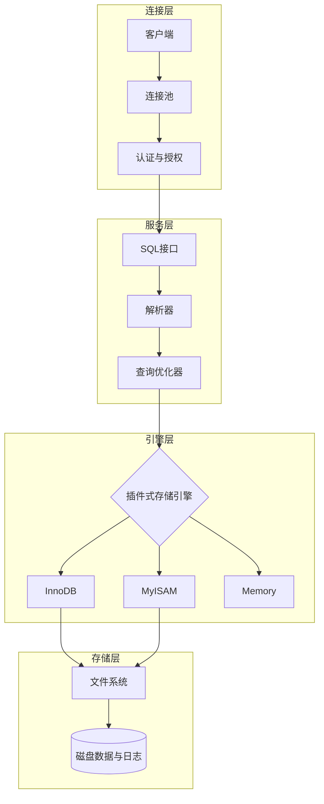
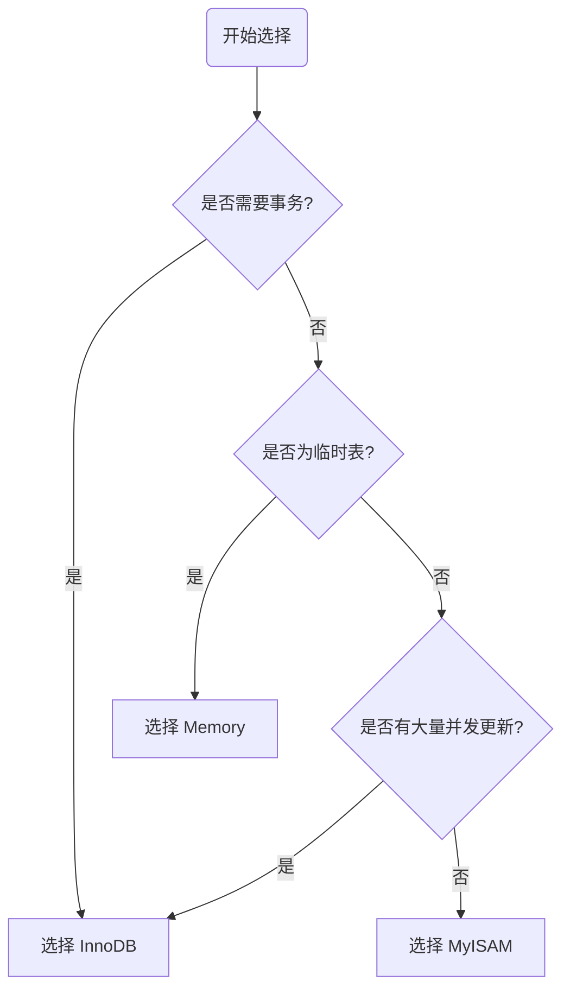

# 数据库家族的大地图

数据库主要分为两大派系，就像超市和杂货铺，各有用处：

| **类别**          | **代表选手**                  | **特点**                     | **比喻**   |
| --------------- | ------------------------- | -------------------------- | -------- |
| 关系型数据库 (SQL)    | MySQL, PostgreSQL, Oracle | 结构严谨，像 Excel 表格，数据之间有逻辑关联。 | 严谨的财务报表  |
| 非关系型数据库 (NoSQL) | MongoDB, Redis            | 格式灵活，速度快，适合存文档、缓存或社交网络。    | 随拿随放的储物盒 |

---

#  MySQL 入门第一课：揭开数据的面纱

### 1. 什么是数据库？

- **数据库 (DB，Database)：** 数据的集合。你可以把它想象成一个“存放数据的仓库”
     - 一堆结构化数据的集合
	- 比如：学生表、成绩表、用户表
	
- **数据(D,  Data)：** 库里存的内容
	- 数字、文字、图片、记录等
	- 是 DB 里的最小单位
    
- **数据库管理系统 (DBMS，Database Management System)：** 管理数据库的软件、工具。比如 MySQL 软件本身，它是那个“仓库管理员”，你不能直接闯进仓库拿东西，必须给管理员发指令。
    - 用来创建、操作、管理 DB
	- 例子：MySQL、Oracle、SQL Server、PostgreSQL
	
- **数据库系统（DBS，Database System）：** 整个一套完整系统= DB（数据） + DBMS（软件） + 应用程序 + 管理员 + 用户是最大的概念，包含前面所有

 
### 2. MySQL 的核心逻辑：表格思维

MySQL 是**关系型**数据库。它的核心逻辑就是：**万物皆表格**。

在 MySQL 里，数据是这样层层嵌套的：

1. **服务器 (Server)**：运行 MySQL 的机器。
    
2. **数据库 (Database)**：一个项目对应一个库（比如“我的商城”）。
    
3. **表 (Table)**：库里有很多表（比如“用户表”、“商品表”）。
    
4. **行 (Row)**：每一行代表一个具体的数据（比如“用户张三”）。
    
5. **列 (Column/Field)**：每一列代表一个属性（比如“年龄”、“性别”）。
    

---

### 3. 必须掌握的“专业术语”

在正式写代码前，先混个脸熟：

- **主键 (Primary Key)**：每张表必须有一个唯一的标识，就像你的**身份证号**，不能重复。
    
- **SQL (Structured Query Language)**：这是你跟“管理员”（MySQL）沟通的**唯一语言**。
    

---

### 4. 第一组 SQL 指令（CRUD）

几乎所有的数据库操作都逃不出这四个字：**增、删、改、查**。

- **C (Create) 增加**：
    
    SQL
    
    ```
    INSERT INTO users (name, age) VALUES ('张三', 25);
    ```
    
- **R (Retrieve) 查询**（最常用！）：
    
    SQL
    
    ```
    SELECT * FROM users WHERE age > 18;
    ```
    
- **U (Update) 修改**：
    
    SQL
    
    ```
    UPDATE users SET age = 26 WHERE name = '张三';
    ```
    
- **D (Delete) 删除**：
    
    SQL
    
    ```
    DELETE FROM users WHERE name = '张三';
    ```
    

> **温馨提示：** 删数据的时候千万别忘了写 `WHERE` 条件，否则你可能会体验到什么叫“从删库到跑路”！😅

---


### 5.连接命令

Bash

```
mysql -u root -p
```


- **`mysql`**：调用 MySQL 客户端程序。
    
- **`-u`**：后面紧跟用户名（User）。`root` 是系统的超级管理员账号。
    
- **`-p`**：代表密码（Password）。
    
    - **注意**：输入回车后，系统会提示 `Enter password:`，此时输入密码是**看不见**的（光标不会动），这是正常的安全保护机制，输完直接回车即可。
        

---


如果你的数据库不在本地电脑上，而是在远程服务器上，你需要告诉客户端去哪里找它：

Bash

```
mysql -h 127.0.0.1 -P 3306 -u root -p
```

- **`-h` (Host)**：数据库所在的 IP 地址（本地通常是 `127.0.0.1` 或 `localhost`）。
    
- **`-P` (Port)**：大写的 P，指定端口号。MySQL 默认端口是 `3306`。
    

---


你可以直接把密码写在命令里（注意 `-p` 和密码之间**不能有空格**）：

Bash

```
mysql -u root -p123456
```

> **安全警告**：极其不建议这样做！因为你的密码会以明文形式留在历史记录里，很容易被别人看到。

### 6. 为什么大家都学 MySQL？

- **免费开源**：不用花钱就能用在你的项目里。
    
- **资料多**：遇到问题，随便一搜就有答案。
    
- **性能稳**：不管是你的个人博客，还是像腾讯、阿里这样的大厂，都在大规模使用。

---
---


# MySQL 字段类型全解 (Cheat Sheet)

### 数值类型

|**类型**|**大小**|**有符号范围 (Signed)**|**无符号范围 (Unsigned)**|**用途建议**|
|---|---|---|---|---|
|**TINYINT**|1 字节|-128 ~ 127|0 ~ 255|小状态值、布尔模拟|
|**INT**|4 字节|-21亿 ~ 21亿|0 ~ 42.9亿|**最常用**，主键 ID|
|**BIGINT**|8 字节|极大范围|0 ~ 极大范围|雪花算法 ID、大数统计|
|**DECIMAL**|依赖定义|极其精确|极其精确|**金钱、财务数据**|
|**FLOAT/DOUBLE**|4/8 字节|很大|很大|科学计算、非精确小数|


### 字符串类型 (String Types)

用于存储文本、段落或二进制数据。

|**类型**|**特点**|**最大长度**|**用途建议**|
|---|---|---|---|
|**CHAR(n)**|定长字符串|255 字符|长度固定的数据（如：邮编、手机号、MD5）|
|**VARCHAR(n)**|**变长字符串**|65535 字节|**最常用**，姓名、地址、标题|
|**TEXT**|长文本数据|64 KB|文章内容、备注、长描述|
|**LONGTEXT**|极大文本|4 GB|超长文章、日志|
|**BLOB**|二进制数据|64 KB|图片、文件（通常建议存路径，不存文件本身）|


### 日期和时间类型 (Date and Time Types)

|**类型**|**格式**|**大小**|**特点**|
|---|---|---|---|
|**DATE**|`YYYY-MM-DD`|3 字节|仅日期（如：生日）|
|**TIME**|`HH:MM:SS`|3 字节|仅时间（如：持续时长）|
|**DATETIME**|`YYYY-MM-DD HH:MM:SS`|8 字节|**最常用**，绝对时间范围广|
|**TIMESTAMP**|`YYYY-MM-DD HH:MM:SS`|4 字节|带时区转换，适合记录修改时间|
|**YEAR**|`YYYY`|1 字节|仅年份|


### 选型 3 大原则 (Tips)

1. **够用就好**：如果年龄不会超过 200 岁，用 `TINYINT UNSIGNED` 就比 `INT` 省空间。
    
2. **尽量避免 NULL**：尽可能给字段设置 `NOT NULL`，并给定默认值。因为 `NULL` 会增加索引开销。
    
3. **金钱用 DECIMAL**：永远不要用 `FLOAT` 或 `DOUBLE` 存钱，因为它们存在舍入误差，`DECIMAL(10, 2)`（总长10位，2位小数）才是专业的。
    


### 🛠️ 实战代码示例 (DDL)


```sql
-- 创建一个学生表，涵盖常用类型
CREATE TABLE students (
    id INT PRIMARY KEY AUTO_INCREMENT,    -- 整数主键，自动增长
    name VARCHAR(50) NOT NULL,            -- 变长字符串，必填
    age TINYINT UNSIGNED,                 -- 无符号小整数
    balance DECIMAL(10, 2) DEFAULT 0.00,  -- 精确小数（存款）
    bio TEXT,                             -- 长文本（简介）
    birthday DATE,                        -- 日期
    created_at TIMESTAMP DEFAULT CURRENT_TIMESTAMP -- 自动生成记录时间
);
```


---
---


# SQL


## 1、SQL通用语法
  1. 可以单行或多行书写，以**分号**结尾
  2. 可以使用空格/缩进增强可读性
  3. SQL语句在windows上不区分大小写，但一般关键字建议使用大写，标识符小写
  4. SQL只认英文标点，中文标点直接报错


---
---


## 2、SQL分类

在 MySQL 的世界里，SQL 语句虽然多，但就像乐高积木一样，根据**功能**被分成了四大类（有时加上事务控制是五类）。


### 1. DDL（Data Definition Language 数据定义语言）

**关键词：结构 (Structure）     用来定义数据库对象（数据库、表、字段）**

它是用来**定义或修改数据库、表、索引**的结构。想象成你在设计一个 Excel 表格的表头（比如：这一列叫姓名，那一列叫年龄）。

- **CREATE**：创建数据库或表。
    
- **ALTER**：修改现有的表结构（比如增加一列）。
    
- **DROP**：删除整个表或数据库（**危险操作！**）。
    
- **TRUNCATE**：清空表里的所有内容，但保留表结构。


#### DDL--数据库操作

 查询
	查询所有数据库：show databases;
	查询当前数据库：select database();
 创建
	 create database [if not exists] 数据库名 [default charset 字符集]  [collate 排序规则]
	  ==**([...]表示可选参数)**==
	 *字符集不推荐使用utf8，mysql的utf8是阉割版：utfbmb3，最多只支持三个字节，不支持标准utf8的四字节（即utf8mb4），无法存emoji 和生僻字。所以字符集要指定为utf8mb4（默认也是）*
 删除
	 drop database [if exists] 数据库名;
 使用
	 use 数据库名


#### DDL--表操作

*(注意要先选定数据库再操作)*

>*查询操作*
  查询当前数据库所有表
	show tables;
  查询表结构
	desc 表名;
  查询指定表的建表语句
	show create table 表名;
     


>*创建操作*
	create table 表名(
		  字段1 字段1类型[comment 字段1注释],
		  字段2 字段2类型[comment 字段2注释],
		  字段3 字段3类型[comment 字段3注释],
		  .....
		  字段n 字段n类型[comment 字段n注释]**这里不要加逗号**
  > )[comment 表注释];


>*修改操作*
  添加字段
	ALTER TABLE 表名 字段名 类型（长度）ADD  [COMMENT 注释]  [约束];
  修改数据类型
	ALTER TABLE 表名 MODIFY 字段名 新数据类型（长度）;
  修改字段名和字段类型
	ALTER TABLE 表名 CHANGE 旧字段名 新字段名 类型（长度）[COMMENT 注释]  [约束];
  删除字段
	 ALTER TABLE 表名 DROP 字段名;
  修改表名
	 ALTER TABLE 表名 RENAME TO 新表名;


  >*删除操作*
  删除表
	DROP TABLE [IF EXISTS] 表名;
  删除指定表，并重新创建该表 **表的数据清空**
	 TRUNCATE TABLE 表名;
  
---

### 2. DML（Data Manipulation Language 数据操作语言）

**关键词：增删改 (Data)   用来对数据库表中的数据增删改**

这是小白最常用的部分，用来对表里的**记录**进行操作。想象成你在 Excel 表格里填入具体的员工信息。

- **INSERT**：插入新数据。
    
- **UPDATE**：修改现有数据。
    
- **DELETE**：删除指定的行。

>*插入操作（必须按表结构顺序写全所有值)*
 指定列插入
	INSERT INTO 表名 (字段1, 字段2, ...) VALUES (值1, 值2, ...);
 全量插入
	INSERT INTO 表名 VALUES (值1, 值2, ...);
 批量插入
	INSERT INTO 表名 (字段1, 字段2...) VALUES (值A, 值B...), (值A, 值B...);
	INSERT INTO 表名  VALUES (值A, 值B...), (值A, 值B...);

>*修改操作*
	UPDATE 表名 SET 字段名1=值1, 字段名2=值2, ....[WHERE 条件];
	 **（若WHERE不存在，表示修改整张表的所有数据）**

>*删除操作*、
	DELETE FROM 表名 [WHERE 条件];
	**（若WHERE不存在，表示删除整张表的所有数据）**
	**（DELETE语句不能删除某一个字段的值，可以使用UPDATE加上NULL）**


---

### 3. DQL（Data Query Language 数据查询语言）

**关键词：看 (Read)   用来查询数据库中表的记录**

虽然它常被归在 DML 里，但因为它太重要了，通常单独拎出来。它是你从数据库里**提取信息**的唯一手段。

- **SELECT**：字段列表
- **FROM**：表名列表
- **WHERE**：条件列表
- **GROUP BY**：分段字段列表
- **HAVING**：分组后条件列表
- **ORDER BY**：排序字段列表
- **LIMIT**：分页参数


>*基本查询*
查询多个字段
	SELECT 字段1，字段2，字段3...FROM 表名;
	SELECT * FROM 表名;
设置别名
	SELECT 字段1[AS 别名1]，字段2[AS 别名2]...FROM 表名;
去除重复记录
	SELECT DISTINCT 字段列表 FROM 表名;


==若定义了别名，就不能再使用原名进行操作==


>*条件查询*
	SELECT 字段列表 FROM 表名 WHERE 条件列表;

 比较运算符

| **运算符**                 | **功能描述**                        | **示例**                  |
| ----------------------- | ------------------------------- | ----------------------- |
| `>`, `>=`, `<`, `<=`    | 大于、大于等于、小于、小于等于                 | `age >= 18`             |
| `=`, `<>` 或 `!=`        | 等于、不等于                          | `name != '张三'`          |
| **BETWEEN ... AND ...** | 在某个范围之内 (含最小值、最大值，不能倒过来)        | `age BETWEEN 15 AND 25` |
| **IN(...)**             | 在指定的集合/列表中，多选一                  | `id IN (1, 2, 3)`       |
| **LIKE 占位符**            | **模糊匹配**：`_` 匹配单个字符，`%` 匹配任意个字符 | `name LIKE '张%'` (姓张的人) |
| **IS NULL**             | 判断字段值是否为空                       | `email IS NULL`         |


逻辑运算符

|**运算符**|**功能描述**|**备选写法**|
|---|---|---|
|**AND**|并且 (所有条件必须同时成立)|`&&`|
|**OR**|或者 (多个条件只要有一个成立即可)|`|
|**NOT**|非，不是|`!`|


>*聚合函数* **(将一列数据作为一个整体，进行纵向计算)**
	SELECT 聚合函数(字段列表) FROM 表名;


常见聚合函数
**注意：所有的聚合函数都会忽略 NULL 值**

|**函数**|**功能**|
|---|---|
|**count**|统计数量（行数）|
|**max**|最大值|
|**min**|最小值|
|**avg**|平均值|
|**sum**|求和|


>*分组查询*
	SELECT 字段列表 FROM 表名 [WHERE 条件] GROUP BY 分组字段名 [HAVING 分组后过滤条件];


 where 与 having 的区别

|**区别点**|**where**|**having**|
|---|---|---|
|**执行时机不同**|**分组之前**进行过滤。不满足条件的不参与分组。|**分组之后**对结果进行过滤。|
|**判断条件不同**|**不能**对聚合函数进行判断。|**可以**对聚合函数进行判断。|

> [!tip] 
> 1. **执行顺序**：`where` > `聚合函数` > `having`。
> 2. **查询字段限制**：分组之后，`SELECT` 后面的字段一般只能是 **分组字段** 和 **聚合函数**。查询其他字段通常没有意义，因为一个组里有很多行，数据库不知道你要显示哪一行。


>*排序查询*
	SELECT 字段列表 FROM 表名 ORDER BY 字段1 排序方式1，字段2 排序方式2;

- ASC: 升序（默认值）
- DESC:降序
**如果是多字段排序，当第一个字段相同时，才会根据第二个字段进行排序**


>*分页查询*
	SELECT 字段列表 FROM 表名 LIMIT 起始索引，查询记录数;

> [!tip] 
> - 起始索引从0开始，起始索引=（查询页码-1）* 每页显示记录数
> - 分页查询是数据库的方言，不同的数据库有不同的实现，MYSQL是LIMIT
> - 如果查询的是第一页数据，起始索引可以省略，直接简写为LIMIT 10
> 


#### 1. 编写顺序（你写代码时的样子）

1. **SELECT**（查什么）
    
2. **FROM**（从哪查）
    
3. **WHERE**（分组前的过滤条件）
    
4. **GROUP BY**（如何分组）
    
5. **HAVING**（分组后的过滤条件）
    
6. **ORDER BY**（怎么排序）
    
7. **LIMIT**（取多少条）


#### 2. 执行顺序（MySQL 运行时的样子）


|**步骤**|**指令**|**逻辑描述**|
|---|---|---|
|**1**|**FROM**|先找到那是哪张表。|
|**2**|**WHERE**|按照条件，把不合格的行剔除掉。|
|**3**|**GROUP BY**|将剩下的数据分成一个个小组。|
|**4**|**HAVING**|对分好组后的结果再进行一次筛选。|
|**5**|**SELECT**|**重点！** 到这一步才决定要把哪些列挑出来。|
|**6**|**ORDER BY**|选出来的结果最后排个序。|
|**7**|**LIMIT**|排序完了，切下前面或中间的几段。|


---


### 4. DCL（Data Control Language 数据控制语言）

**关键词：权限 (Permission)   用来创建数据库用户、控制数据库的访问权限**

这是“管理员”干的活，用来定义谁能看、谁能改。

- **GRANT**：授予用户访问权限。
    
- **REVOKE**：撤销用户的权限。
    


>*管理用户*
   查询用户
	USE mysql;
	SELECT * FROM user;
	**(或者直接找到mysql数据库下的user表查看也可以)**
   创建用户
	CREATE USER '用户名' @ '主机名' IDENTIFIED BY '密码';
   修改用户密码
	ALTER USER '用户名' @ '主机名' IDENTIFIED WITH mysql_native_password BY '新密码'
   删除用户
	DROP USER '用户名' @ '主机名'

> [!tip] 
> - 主机名可以使用%通配，表示在任意主机都允许操作
>   （如创建用户时使用%表示该用户可以在任意一台电脑上访问数据库）
> - 这类sql开发人员操作的比较少，主要是DBA（Database Administrator 数据库管理员使用）


>*权限控制*
   查询权限
	SHOW GRANTS FOR '用户名' @ '主机名';
   授予权限
	GRANT 权限列表 ON 数据库名.表名 TO '用户名' @ '主机名';
   撤销权限
	REVOKE 权限列表 ON 数据库名.表名 FROM '用户名' @ '主机名';

> [!tip] 
> - 多个权限之间，使用逗号分隔
> - 授权时，数据库名和表名可以使用 * 进行通配

---

### 5. TCL（事务控制语言）

**关键词：后悔药 (Transaction)**

专门用于维护数据的**一致性**，常用于银行转账等严谨场景。

- **COMMIT**：确认提交（把修改永久存盘）。
    
- **ROLLBACK**：回滚（发现操作错了，瞬间恢复到修改前）。
    
- **SAVEPOINT**：设置保存点（类似游戏的存档点）。
    

---
---


# 函数

*SELECT 函数（参数）*


## 字符串函数


| **函数**                       | **功能**                                     | **示例**                                     |
| ---------------------------- | ------------------------------------------ | ------------------------------------------ |
| **CONCAT(s1, s2...n)**       | 字符串拼接                                      | `CONCAT('Hello', 'MySQL')` -> `HelloMySQL` |
| **LOWER(str)**               | 全部转小写                                      | `LOWER('Hello')` -> `hello`                |
| **UPPER(str)**               | 全部转大写                                      | `UPPER('Hello')` -> `HELLO`                |
| **LPAD(str，n，pad) **         | 左填充，用字符串pad对str的左边进行填充，达到n个字符长度            | `LPAD('01', 5, '-')` -> `---01`            |
| **RPAD(str，n，pad)**          | 右填充，用字符串pad对str的右边进行填充，达到n个字符长度            | `RPAD('01', 5, '-')` -> `01---`            |
| **TRIM(str)**                | 去除左右空格（不去除中间的）                             | `TRIM(' Hello ')` -> `Hello`               |
| **SUBSTRING(str，start，len)** | 截取字符串，返回字符串str从start位置起的len个长度的字符串（索引从1开始） | `SUBSTRING('Hello', 1, 3)` -> `Hel`        |

## 数值函数

|**函数**|**功能**|**示例**|
|---|---|---|
|**CEIL(x)**|向上取整|`CEIL(1.1)` -> `2`|
|**FLOOR(x)**|向下取整|`FLOOR(1.9)` -> `1`|
|**MOD(x, y)**|取模（求余）|`MOD(7, 4)` -> `3`|
|**RAND()**|获取 0~1 随机数|`RAND()`|
|**ROUND(x, y)**|四舍五入|`ROUND(2.345, 2)` -> `2.35`|
## 日期函数

| **函数**                                | **功能**                      | **示例**                                 |
| ------------------------------------- | --------------------------- | -------------------------------------- |
| **CURDATE()**                         | 返回当前日期                      | `2024-05-20`                           |
| **CURTIME()**                         | 返回当前时间                      | `13:14:00`                             |
| **NOW()**                             | 返回当前日期+时间                   | `2024-05-20 13:14:00`                  |
| **YEAR(date)**                        | 获取指定data的年份                 | `YEAR(NOW())`                          |
| **MONTH(date)**                       | 获取指定data的月份                 | `MONTH(NOW())`                         |
| **DAY(date)**                         | 获取指定data的日期                 | `DAY(NOW())`                           |
| **DATE_ADD(data，INTERVAL expr type)** | 返回一个日期/时间值加上一个时间间隔expr后的时间值 | `DATE_ADD(NOW(), INTERVAL 1 YEAR)`     |
| **DATEDIFF(d1, d2)**                  | 计算两个日期相差天数                  | `DATEDIFF('2024-10-01', '2024-01-01')` |

## 流程函数


| **函数**                                                 | **功能**                                                        | **示例**                           |
| ------------------------------------------------------ | ------------------------------------------------------------- | -------------------------------- |
| **IF(value, t, f)**                                    | 如果 value 为 True，返回 t；否则返回 f                                   | 判断及格：`IF(score>=60, '及格', '挂科')` |
| **IFNULL(v1, v2)**                                     | 如果 v1 不为 NULL，返回 v1；否则返回 v2                                   | 填充空地址：`IFNULL(address, '地址不详')`  |
| **ISNULL(v1)**                                         | 判断 v1是否为 NULL，是则返回 1，否则返回 0                                   | 筛选空值记录                           |
| **COALESCE(v1, v2, ...vn)**                            | 返回参数列表中的第一个非空值                                                | 多级备选方案填充                         |
| **CASE WHEN [v1] THEN [r1] ... ELSE [res] END**        | 如果v1为true，返回res1，...否则返回default默认值。类似于 `if-else`，进行范围或多条件判断   | 划分成绩等级（优/良/中/差）                  |
| **CASE [expr] WHEN [v1] THEN [r1] ... ELSE [res] END** | 如果expr的值等于v1，返回res1，...否则返回default默认值。类似于编程里的 `switch`，进行等值匹配 | 根据代码显示部门名称                       |


---
---


# 约束(Constraints)


## 概述

### 1. 概念

约束是作用于表中字段上的规则，用于限制存储在表中的数据，可以在创建表/修改表时添加约束

### 2. 目的

保证数据库中数据的**正确性**、**有效性**和**完整性**。

### 3. 约束分类详解

| **约束名称** | **描述**                              | **关键字**                          |
| -------- | ----------------------------------- | -------------------------------- |
| **非空约束** | 限制该字段的数据不能为 `null`                  | `NOT NULL`                       |
| **唯一约束** | 保证该字段的所有数据都是唯一、不重复的                 | `UNIQUE`                         |
| **主键约束** | 主键是一行数据的唯一标识，要求**非空且唯一**            | `PRIMARY KEY（自增：AUTO_INCREMENT）` |
| **默认约束** | 保存数据时，如果未指定该字段的值，则采用默认值             | `DEFAULT`                        |
| **检查约束** | 保证字段值满足某一个条件（适用于 MySQL 8.0.16 版本之后） | `CHECK`                          |
| **外键约束** | 让两张表的数据之间建立连接，保证数据的一致性和完整性          | `FOREIGN KEY`                    |

---


## 约束演示
```mysql
CREATE TABLE users (
    id INT PRIMARY KEY AUTO_INCREMENT,   -- 主键，且自动增长
    name VARCHAR(10) NOT NULL UNIQUE,    -- 不准为空，且名字不能重复
    age INT CHECK (age > 0 AND age < 120), -- 检查约束，年龄必须在合理范围内
    status CHAR(1) DEFAULT '1',          -- 默认约束，不传值时默认为 '1'
    gender CHAR(1)                       -- 无约束
);

```


---


## 外键约束(Foreign Key)

### 概念

外键用来让两张表的数据建立连接。

- **父表（主表）**：被引用的表（如：部门表）。
    
- **子表（从表）**：引入外键的表（如：员工表）。

### 语法

*A. 建表时添加*
CREATE TABLE 表名 (
	字段名 数据类型;
	 ...
    CONSTRAINT 外键约束名称 FOREIGN KEY (外键字段名 **要用上面定义好的字段名** ) REFERENCES 主表（主表字段名）
);


*B. 后期添加外键：*
ALTER TABLE 表名 ADD CONSTRAINT 外键约束名称 FOREIGN KEY (外键字段名) REFERENCES 主表 (主表字段名) [ON UPDATE 行为 ON DELETE 行为];


| **行为**          | **说明**                                                                |
| --------------- | --------------------------------------------------------------------- |
| **NO ACTION**   | **默认行为**。在父表中删除/更新记录时，首先检查该记录是否有对应外键，如果有则**不允许**删除/更新。（与 RESTRICT 一致） |
| **RESTRICT**    | 在父表中删除/更新记录时，首先检查该记录是否有对应外键，如果有则**不允许**删除/更新。（与 NO ACTION 一致）         |
| **CASCADE**     | **级联行为**。在父表中删除/更新记录时，首先检查该记录是否有对应外键，如果有，则**同步删除/更新**子表中的记录。          |
| **SET NULL**    | 在父表中删除记录时，首先检查该记录是否有对应外键，如果有，则**设置子表中该外键值为 null**。（要求子表外键列允许取 null）   |
| **SET DEFAULT** | 父表有变更时，子表将外键列设置成一个默认值（**注意：InnoDB 存储引擎不支持此行为**）。                      |


*B. 删除外键：*
ALTER TABLE 表名 DROP FOREIGN KEY 外键约束名称;  **(必须用约束名不是字段名，因为一个字段可以有多个约束)**


# 多表查询

## 单表查询和多表查询

这是数据库学习中最重要的一道分水岭。如果说单表查询是在**一张表里翻账本**，那么多表查询就是**跨表找关联**，将支离破碎的数据拼凑成完整的信息。

---

|**维度**|**单表查询 (Single Table)**|**多表查询 (Multi-Table / Join)**|
|---|---|---|
|**数据源**|只有一个数据来源|两个或多个数据来源|
|**复杂度**|简单，逻辑直接|复杂，需要寻找表与表之间的“连接点”|
|**应用场景**|获取基础信息（如：查某个人的年龄）|获取完整业务逻辑（如：查张三的**部门名称**）|
|**性能**|极快|随着表数量和数据量增加，开销变大|

为了减少数据冗余（相同数据不存两遍），数据库设计遵循**范式**。

- `users` 表只存角色的 ID（数字）。
    
- `roles` 表存角色 ID 对应的真实名称。
    
    要看到“张三 - 管理员”，就必须把两张表连起来。


## 概述

概述：指从多张表中查询数据

笛卡尔积：在数学中指两个集合A集合和B集合的所有组合情况 **(在多表查询时，需要消除无效的笛卡尔积)**
>[!danger]
>如果你查询两张表但不写 `WHERE` 或 `ON` 条件，会发生灾难：
   A 表 10 行，B 表 10 行，结果会产生 $10 \times 10 = 100$ 行。


## 关系

### 1. 一对多(多对一)


- 案例：部门与员工的关系
- 关系：一个部门对应多个员工
- 实现：**在多的一方建立外键，指向少的一方的主键**


### 2.多对多

- 案例：学生与课程的关系
- 关系：一个学生可以选修多门课程，一门课程也可以供多个学生选择
- 实现：**建立第三张中间表，中间表至少包含两个外键，分别关联两方主键**

### 3.一对一

- 案例：用户与用户详情的关系
- 关系：多用于单表拆分，将一张表的基础字段放在一张表中，其他详情字段放在另一张表中，以提升操作效率
- 实现：**在任意一方加入外键，关联另外一方的主键，并且设置外键为唯一的(UNIQUE)**

## 分类

### 1. 连接查询 (Join Queries)

这是最常用的分类，通过两个表之间的关联字段（通常是外键）来合并列。

#### A. 内连接 (Inner Join)


- **隐式内连接**：使用 `WHERE` 指定连接条件。
		SELECT 字段列表 FROM 表1，表2 WHERE 连接条件...;
    
- **显式内连接**：使用 `INNER JOIN ... ON ...`（推荐，语义更清晰）。                  SELECT 字段列表 FROM 表1 [INNER] JOIN 表2 ON 条件...;
    
- 逻辑：只返回两张表中**完全匹配**的记录（取交集）。
    

#### B. 外连接 (Outer Join)

- **左外连接 (Left Join)**：返回左表所有记录，以及右表中符合条件的记录。右表不匹配的显示为 `NULL`。SELECT 字段列表 FROM 表1 LEFT [OUTER] JOIN 表2 ON 条件...;
    
- **右外连接 (Right Join)**：返回右表所有记录，左表不匹配的显示为 `NULL`。SELECT 字段列表 FROM 表1 RIGHT [OUTER] JOIN 表2 ON 条件...;
    

#### C. 自连接 (Self Join)

- 语法：SELECT 字段列表 FROM 表A 别名A JOIN 表A 别名B ON 条件...;**自链接查询必须给表起别名，可以是内链接查询也可以是外链接查询**

- 逻辑：把一张表当成两张甚至多张表来看待。通常用于处理表内部的层级关系（如：员工与领导、菜单与子菜单）。


---

### 2. 联合查询 (Union Queries)

- 语法：SELECT 字段列表 FROM 表A ... UNION [ALL] SELECT 字段列表 FROM 表B ...;**查询的字段列表数必须保持一致**
- 逻辑：将多次查询的结果集合并在一起，形成一个新的结果集（纵向堆叠）。
- 分类：
    
    - `UNION ALL`：直接合并，保留所有重复记录。
        
    - `UNION`：合并后去重。
        

---

### 3. 子查询 /嵌套查询(Subquery)

- 逻辑：在一个查询语句中嵌套另一个查询语句。这是最灵活但也最考验逻辑的部分。
- 语法：SELECT * FROM 表1 WHERE 字段列表1=（SELECT 字段列表2 FROM 表2）

根据**返回结果**的不同，子查询可以分为：

|**分类**|**返回结果特征**|**常用操作符**|
|---|---|---|
|**标量子查询**|返回单个值（一行一列）|`=`, `<>`, `>`, `<`|
|**列子查询**|返回一列（多行一列）|`IN`, `ANY`, `SOME`, `ALL`|
|**行子查询**|返回一行（一列多行）|`=`, `<>`, `IN`|
|**表子查询**|返回一个临时表（多行多列）|`IN` (常用于 FROM 之后)|

|**操作符**|**描述**|
|---|---|
|**IN**|在指定的集合范围之内，多选一|
|**NOT IN**|不在指定的集合范围之内|
|**ANY**|子查询返回列表中，有任意一个满足即可|
|**SOME**|与 ANY 等同，使用 SOME 的地方都可以使用 ANY|
|**ALL**|子查询返回列表的所有值都必须满足|

根据**嵌套位置**的不同，可以分为：

- `WHERE` 之后：作为过滤条件。
    
- `FROM` 之后：作为临时表。
    
- `SELECT` 之后：作为结果字段。
    

---
---


# 事务


在数据库的世界里，**事务 (Transaction)** 是确保数据“绝对安全”的终极手段。

简单来说，事务就是**一组操作的集合**，它把所有的命令看作一个不可分割的整体。这组操作要么**全部成功**，要么**全部失败**（就像没发生过一样）。

---

## 1. 为什么要用事务？（经典案例）

银行转账是最直观的例子：

1. A 账户余额 -1000 元。
    
2. B 账户余额 +1000 元。
    

如果第一步成功了，执行第二步时突然断电或服务器崩溃，A 的钱没了，B 也没收到钱。事务的作用就是：如果第二步失败，第一步的 -1000 元必须“退回来”


---

## 2. 事务的操作流程

MySQL 默认是**自动提交**事务的（执行一条 SQL，就立刻写入磁盘）。要使用事务，我们需要手动控制：

### A. 方案一：手动开启

```sql
-- 1. 开启事务
START TRANSACTION;  -- 或者使用 BEGIN;

-- 2. 执行一组 SQL 语句
UPDATE account SET money = money - 1000 WHERE name = '张三';
UPDATE account SET money = money + 1000 WHERE name = '李四';

-- 3. 提交事务（只有执行了这一步，数据才真正永久改变）
COMMIT;

-- 如果中间出错了，执行回滚（撤销刚才所有操作）
ROLLBACK;
```

### B. 方案二：修改自动提交设置

```sql
SELECT @@autocommit; -- 查看设置（1为自动，0为手动）
SET @@autocommit = 0; -- 设置为手动提交


-- 提交事务（只有执行了这一步，数据才真正永久改变）
COMMIT;

-- 如果中间出错了，执行回滚（撤销刚才所有操作）
ROLLBACK;
```


### 📋回滚的意义

你可能会想：“既然我不点 `COMMIT` 数据就不变，那出错了我不点 `COMMIT` 不就行了吗？为啥非要多此一举写个 `ROLLBACK`？”

其实，**回滚（ROLLBACK）** 的意义主要在于以下三个维度：

---

#### 1. 释放锁资源（性能关键）

这是最实操的原因。当你开启事务并执行 `UPDATE` 或 `DELETE` 时，MySQL 会给这些数据行加上**行锁**。

- **如果你不回滚也不提交**：这些锁会一直被这个连接占用。
    
- **后果**：其他想要修改这些数据的连接会一直处于“等待”状态，直到超时。这会导致数据库连接池爆满，整个系统“卡死”。
    
- **意义**：`ROLLBACK` 会立刻告诉数据库：“这个操作我不要了，赶紧把锁解开让别人用。”
    

---

#### 2. 清理内存缓存（数据一致性）

当你执行 SQL 时，数据其实已经在数据库的 **Buffer Pool（缓冲池）** 中被修改了。

- **如果不回滚**：虽然磁盘上的原始数据没变，但当前这个连接（Session）后续的查询可能会读到这些“脏数据”。
    
- **意义**：`ROLLBACK` 会清除内存中的这些临时改动，将数据状态彻底恢复到事务开始前的样子，确保内存与磁盘的逻辑统一。
    

---

#### 3. 程序逻辑的“终点站”（代码严谨性）

在 Java 或 Python 编写的后端程序中，事务通常是这样写的：


```java
try {
    // 开启事务
    // 执行 SQL 1
    // 执行 SQL 2 (假设这里报错了)
    connection.commit();
} catch (Exception e) {
    // 如果出错了，必须手动调用 rollback
    connection.rollback(); 
}
```

- **意义**：在程序逻辑里，一个事务必须有一个**明确的终点**（要么成功提交，要么失败回滚）。如果你不写 `rollback()`，这个连接回到连接池时可能还带着未完成的事务状态，会导致下一个用到这个连接的业务逻辑出现不可预知的错误。


---

#### 4. 自动提交 vs 手动提交

你说的“数据不会修改”，其实是因为 MySQL 默认开启了 `autocommit`，而你手动开启事务时暂时关闭了它。

- 如果你**掉线了**或者**客户端崩溃了**：MySQL 的后台进程发现连接断开，会自动帮你执行 `ROLLBACK`。
    
- 但作为开发者，我们不能指望“崩溃自救”，**主动回滚**是保证程序健壮性的基本职业素养。
    

---


> [!Abstract] 为什么要回滚？
> 
> 1. **解锁**：释放行级锁，防止系统死锁和阻塞。
>     
> 2. **归位**：把内存中修改过的“脏页”数据复原。
>     
> 3. **闭环**：给程序一个明确的失败反馈，防止连接池污染。
>     

**所以，`ROLLBACK` 不是给数据看的（数据确实没持久化），而是给“资源”和“逻辑”看的。**


---
---


## 3. 事务的四大特性 (ACID)

事务的四大特性通常被称为 **ACID**，这是数据库管理系统（DBMS）为了保证即使在系统崩溃或并发操作时，数据依然能保持准确而设立的四根支柱。

| **特性**  | **英文**          | **核心目标** | **描述**                                |
| ------- | --------------- | -------- | ------------------------------------- |
| **原子性** | **A**tomicity   | 操作的完整性   | 事务是不可分割的最小单位，要么全成功，要么全失败。             |
| **一致性** | **C**onsistency | 数据的合法性   | 事务完成时，必须使所有数据都保持一致状态。                 |
| **隔离性** | **I**solation   | 并发的安全性   | 数据库系统提供的隔离机制，保证事务在不受外部并发操作影响的独立环境下运行。 |
| **持久性** | **D**urability  | 存储的稳定性   | 事务一旦提交，对数据库中数据的改变就是永久性的。              |


你可以把事务想象成一次“**银行转账**”操作，通过这个例子来理解这四个特性：

---

### 1. 原子性 (Atomicity) —— “要么全部，要么零”

- **概念**：事务被视为一个不可分割的最小单位。事务中的所有操作，要么全部成功执行并永久写入数据库，要么全部失败并回滚到事务开始前的状态。
    
- **场景**：转账时，“A账号扣钱”和“B账号加钱”必须同时成功。如果A扣了钱，系统突然宕机导致B没加钱，原子性会强制让A扣掉的钱“退回来”。
    
- **口诀**：**不准半途而废。**
    

---

### 2. 一致性 (Consistency) —— “守恒定律”

- **概念**：事务完成时，必须使数据库从一个一致性状态变换到另一个一致性状态。这意味着数据必须符合所有的预设规则（如余额不能为负数、外键必须对应等）。
    
- **场景**：转账前后，A和B两人的总金额应该是**守恒**的。如果转账前两人共 2000 元，转账后不管成没成功，两人加起来还必须是 2000 元。
    
- **口诀**：**能量守恒，数据合规。**
    

---

### 3. 隔离性 (Isolation) —— “独立空间”

- **概念**：当多个用户并发访问数据库时，数据库为每一个用户开启的事务，不被其他事务的操作所干扰。多个并发事务之间要相互隔离。
    
- **场景**：你正在给朋友转账 1000 元（事务A），此时公司正好给你发 5000 元工资（事务B）。隔离性保证这两个操作在执行时互不干扰，不会因为同时操作你的余额而算错账。
    
- **口诀**：**互不打扰，各做各的。**
    

---

### 4. 持久性 (Durability) —— “落笔生根”

- **概念**：一旦事务提交（Commit），它对数据库中数据的改变就是永久性的。即使随后系统发生崩溃（如断电、磁盘坏道），只要数据已经写入磁盘，就不会丢失。
    
- **场景**：你看到屏幕提示“转账成功”的那一秒，即便银行的服务器立刻烧了，你的钱也已经转过去了，数据不会因为断电而“反悔”。
    
- **口诀**：**提交即永久，雷打不动。**
    

---


### 深入思考：谁是核心？

在 ACID 中，**一致性 (C)** 是最终目的。而 **原子性 (A)**、**隔离性 (I)** 和 **持久性 (D)** 都是数据库为了达到“一致性”而采取的手段。

- **原子性**靠 `Undo Log`（回滚日志）来实现。
    
- **持久性**靠 `Redo Log`（重做日志）来实现。
    
- **隔离性**靠 `锁机制` 和 `MVCC`（多版本并发控制）来实现。

---
---
## 4. 并发事务问题

当多个事务同时操作同一批数据时，可能会产生以下“灵异事件”：

1. **脏读 (Dirty Read)**：一个事务读到了另一个事务**还没提交**的数据。
    
2. **不可重复读 (Non-Repeatable Read)**：一个事务先后读取同一条记录，但两次读到的**结果不同**（读到了另一个事务提交的数据）。
    
3. **幻读 (Phantom Read)**：一个事务按条件查询，没查到记录，但插入时发现记录已存在（仿佛出现了幻觉）。


### 脏读 (Dirty Read)

关键词：读到了“半成品”

- **场景模拟**：
    
    1. **事务A（公司财务）**：准备发奖金，把你的余额从 5000 改成了 10000（**还没点提交**）。
        
    2. **事务B（你）**：这时你刚好查余额，发现是 10000，乐坏了。
        
    3. **事务A（财务）**：突然发现算错了，赶紧点了 **ROLLBACK（回滚）**。
        
    4. **结果**：你的余额回到了 5000，但你刚才读到的 10000 就是“脏数据”。
        

> **本质**：一个事务读到了另一个事务**回滚前**的临时数据。

---

### 不可重复读 (Non-Repeatable Read)

关键词：前后读得不一样（针对 Update）

- **场景模拟**：
    
    1. **事务A（你）**：打算去买个 8000 的相机。先查余额，发现有 10000，心想够了。
        
    2. **事务B（自动扣费）**：就在你盯着屏幕犹豫的一秒内，房租自动扣款 3000 并**提交成功**。
        
    3. **事务A（你）**：你点击“付款”前，系统又确认了一遍余额，发现只剩 7000 了。
        
    4. **结果**：你很纳闷：“我刚才看还是 10000 呢，怎么一眨眼就变了？”
        

> **本质**：同一事务内，同样的查询语句，第二次读到了别人**已经提交修改**过后的数据。

---

### 幻读 (Phantom Read)

关键词：查询时没有，插入时却报错（针对 Insert）

这个最难理解。它通常发生在解决了“不可重复读”之后。

- **场景模拟**：
    
    1. **事务A（管理员）**：想注册一个账号 `admin`。先查一下：`SELECT * FROM users WHERE name='admin'`。结果：**空（没人注册）**。
        
    2. **事务B（路人甲）**：抢先一步注册了 `admin` 并**提交成功**。
        
    3. **事务A（管理员）**：心想既然没人注册，那我就执行 `INSERT INTO users (name) VALUES ('admin')`。
        
    4. **结果**：数据库报错：“主键重复！”。管理员心想：“刚才查明明没有啊，怎么插不进去？见鬼了？”
        

> **本质**：虽然解决了数据被改的问题，但没解决**新数据插入**的问题。

---

### 未commit的数据为什么会被读到?


你可能会想：“既然数据还没最后确认（Commit），它不应该还‘飘’在内存里吗？数据库为什么要把它给别人看呢？”

其实，“脏读”出现的本质原因在于：**数据库为了追求极致的性能，默认关闭了某些“防撞”保护。**

以下是底层发生的过程：

---

#### 1. 数据的“落笔”过程

在数据库底层，当你执行一条 `UPDATE` 语句时，数据并不是直接修改磁盘文件，而是经历了以下路径：

1. **Buffer Pool（内存缓冲池）**：数据库先在内存中把这行数据改了。
    
2. **Undo Log（回滚日志）**：记录下改之前长啥样，万一你要撤销。
    
3. **Redo Log（重做日志）**：记录下你打算怎么改，防止断电。
    

**重点来了：** 在“读未提交（Read Uncommitted）”这个级别下，数据库允许另一个事务直接去 **Buffer Pool（内存）** 里读取那些已经被改掉、但还没打上“已提交”标记的数据。

---

#### 2. 为什么要设计这种“不准”的级别？

你可能会觉得这设计很“蠢”，但它存在的唯一理由是：**快，快到了极致。**

- **没有锁等待**：在读取数据时，它完全不去看这行数据是不是正在被别人改，也不去管什么版本链。
    
- **零开销**：它不需要维护复杂的“快照”或“视图”，看到什么拿什么。
    
- **适用场景**：在一些对准确性要求极低、但对速度要求极高的场景（比如：实时统计某个大屏上的点赞数，多一个少一个没关系，但不能卡顿）。
    

---

#### 3. 为什么更高隔离级别就不会读到？

为了解决这个问题，数据库引入了 **MVCC（多版本并发控制）** 机制。

当隔离级别提高到“读已提交（Read Committed）”或以上时：

- 如果数据还没提交，数据库会根据 **Undo Log** 里的记录，在内存中瞬间为你“还原”出一个修改前的版本。
    
- 你读到的是那个**旧版本**，而别人改的是**新版本**，互不干扰。
    


---

### 为什么会出现这些情况？

出现这些问题的根本原因，是数据库在性能（并发量）与一致性（数据准不准）之间做权衡。

- 如果我们让所有人排队，一个一个来（**串行化 Serializable**），这些问题全都没有，但数据库会慢得像蜗牛。
    
- 为了快，我们允许大家同时操作，这就产生了上述冲突。
    


---
---


## 5. 事务隔离级别

为了解决上面的并发问题，MySQL 提供了四个隔离级别：

|**隔离级别**|**脏读**|**不可重复读**|**幻读**|**性能**|
|---|---|---|---|---|
|**Read Uncommitted**|✅有|✅有|✅有|最高|
|**Read Committed**|❌无|✅有|✅有|中|
|**Repeatable Read** (MySQL默认)|❌无|❌无|✅有|较好|
|**Serializable** (串行化)|❌无|❌无|❌无|最低|

```sql
-- 查看当前系统的隔离级别
SELECT @@transaction_isolation;

-- 设置当前会话（Session）的隔离级别
SET SESSION TRANSACTION ISOLATION LEVEL READ COMMITTED;

-- 设置全局（Global）隔离级别（影响后续新连接）
SET GLOBAL TRANSACTION ISOLATION LEVEL REPEATABLE READ;
```


### 1. Read Uncommitted (读未提交)

- **原理**：基本不加锁。事务 A 改了内存里的数据，事务 B 马上就能看见，管你提交没提交。
    
- **评价**：基本没人用，太危险。
    

### 2. Read Committed (读已提交)

- **原理**：**每次执行语句时**都会生成一个最新的“快照”（Read View）。
    
- **效果**：解决了脏读。如果事务 A 还没提交，事务 B 查不到它的改动。
    
- **缺点**：同一个事务里，如果你查两次，中间别人提交了，你两次结果会不一样（不可重复读）。
    
- **应用**：Oracle 和 SQL Server 的默认级别。
    

### 3. Repeatable Read (可重复读) —— MySQL 默认

- **原理**：**事务开启时的第一条查询语句**会生成一个“快照”，整个事务期间都用这张旧照片。
    
- **效果**：解决了不可重复读。不管别人怎么改并提交，你看到的永远是事务刚开始时的样子。
    
- **黑科技**：MySQL 在这个级别下通过 **Next-Key Locks（间隙锁）** 很大程度上也解决了幻读问题。
    

### 4. Serializable (串行化)

- **原理**：所有的查询都会隐式加锁。如果有人在改，你就得等着；如果你在读，别人想改也得等着。
    
- **效果**：万无一失，完全排队。
    
- **评价**：除非对账等极度严苛的场景，否则不用，因为它会让并发量直接归零。


---
---


# 存储引擎

## MySQL体系结构




### 1. 连接层 (Connectors & Connection Pool)

- **功能**：负责处理客户端的连接请求。
    
- **核心工作**：
    
    - **连接池**：管理连接，避免频繁创建/销毁连接的开销。
        
    - **身份验证**：校验用户名、密码。
        
    - **权限校验**：检查该用户是否有权限操作某个数据库或表。
        

### 2. 服务层 (SQL Interface & Parser & Optimizer)

这是 MySQL 的“大脑”，所有跨存储引擎的功能都在这里实现。

- **SQL Interface**：接收 SQL 命令，返回查询结果。
    
- **Parser (解析器)**：对 SQL 进行词法、语法分析，生成“解析树”（判断你 SQL 写得对不对）。
    
- **Optimizer (查询优化器)**：**最关键的一步**。它会决定使用哪个索引，或者决定表的连接顺序，选出它认为“代价最低”的执行计划。
    
- **Cache (缓存)**：MySQL 8.0 之前有查询缓存，但因为命中率低且维护成本高，8.0 后被彻底废除。
    

### 3. 引擎层 (Pluggable Storage Engines)

MySQL 的核心特色。

- **特点**：存储引擎是基于表的，而不是基于数据库的。
    
- **常用引擎**：
    
    - **InnoDB**：默认引擎。支持**事务 (ACID)**、行级锁、外键。
        
    - **MyISAM**：读取速度快，但不支持事务，只有表级锁。
        
    - **Memory**：数据存在内存中，速度极快，但断电即失。
        

### 4. 存储层 (File System)

- **功能**：将数据和日志（Redo, Undo, Binary log）存储在文件系统之上，并完成与存储引擎的交互。

---
---


## 存储引擎简介


存储引擎是 MySQL 的核心特性，它决定了数据在计算机内部是如何存储、索引以及更新的。在 MySQL 中，存储引擎是基于**表**的，这意味着你可以在同一个数据库中，为不同的表选择不同的引擎。

### 1. 核心定义

存储引擎就是**表的类型**。它处于体系结构中的“执行层”，负责具体的脏活累活：把数据存入磁盘，或者从磁盘把数据读出来。

---

### 2. 三种常用存储引擎对比

目前最常用的是 **InnoDB**，但在特定场景下，其他引擎也有用武之地。

|**特性**|**InnoDB**|**MyISAM**|**Memory**|
|---|---|---|---|
|**事务安全**|✅ 支持 (ACID)|❌ 不支持|❌ 不支持|
|**存储限制**|64 TB|有 (取决于操作系统)|取决于内存大小|
|**锁机制**|**行级锁** (并发性能高)|**表级锁** (并发性能低)|**表级锁**|
|**外键**|✅ 支持|❌ 不支持|❌ 不支持|
|**崩溃恢复**|✅ 支持 (可靠性强)|❌ 不支持|❌ 数据断电即失|
|**适用场景**|绝大多数业务、高并发|只读数据、小表报表|临时表、极速缓存|

---

### 3. 重点引擎详述

#### **InnoDB (MySQL 5.5 之后的默认引擎)**

它是 MySQL 的“功臣”，最显著的特点是支持**事务**和**行级锁**。

- **DML 操作遵循 ACID 模型**：确保数据绝对安全。
    
- **行级锁**：当你在改第一行数据时，别人可以改第二行，互不干扰，极大提升了并发效率。
    
- **磁盘文件**：每张 InnoDB 表在磁盘上通常对应一个 `.ibd` 文件，存储了表结构、数据和索引。
    

#### **MyISAM (曾经的王者)**

在早期的 Web 开发中非常流行，因为它简单、快。

- **不支持事务**：这意味着它不需要维护复杂的版本链和日志，读性能较好。
    
- **表级锁**：如果你在改表里的一条数据，整张表都会被锁住，别人只能排队等，并发能力差。
    
- **磁盘文件**：每张表对应三个文件：`.sdi` (表结构)、`.MYD` (数据)、`.MYI` (索引)。
    

#### **Memory**

数据只存储在内存中，不落磁盘。

- **特点**：访问速度极快。
    
- **致命伤**：一旦数据库重启或者服务器断电，表里的数据会全部丢失（表结构还会保留）。
    

---

### 4. 如何选择与操作

- **选择建议**：
    
    - 除非你有非常明确的理由（如：极小负载的纯查询表），否则一律使用 **InnoDB**。
        
- **常用命令**：
    

```sql
-- 查询当前数据库支持哪些存储引擎
SHOW ENGINES;

-- 创建表时指定存储引擎
CREATE TABLE my_table (
    id INT PRIMARY KEY
) ENGINE = InnoDB;

-- 修改现有表的存储引擎
ALTER TABLE my_table ENGINE = MyISAM;
```

---
---


## 存储引擎特点


### 1. InnoDB：全能型选手（默认引擎）

InnoDB 是 MySQL 5.5 版本之后的**默认存储引擎**。它是一种兼顾了“高可靠性”和“高性能”的通用存储引擎。

####  三大核心特点

- **事务 (Transaction)**：DML 操作完全遵循 **ACID 模型**。它支持提交（Commit）、回滚（Rollback）和崩溃恢复能力，保证了数据的安全性。
    
- **行级锁 (Row-level Locking)**：锁的粒度细化到了每一行，这使得多个连接可以同时修改同一张表的不同数据，极大地提高了多用户并发访问的性能。
    
- **外键 (Foreign Key)**：支持物理外键约束，强制维护数据的逻辑完整性和参照一致性。
    

####  磁盘文件

- **文件格式**：每张表都会对应一个 `表名.ibd` 文件。
    
- **存储内容**：该文件是一个独占的**表空间**，里面包含了表的结构（元数据）、实际数据和索引。
    
- **关键参数**：`innodb_file_per_table`（控制是每张表一个文件，还是所有表共享一个大文件）。
    

---

#### InnoDB 逻辑存储结构（由大到小）

InnoDB 存储数据并不是乱塞的，而是层层嵌套的盒模型：

1. **TableSpace（表空间）**：最高层级，对应磁盘上的 `.ibd` 文件。
    
2. **Segment（段）**：分为数据段、索引段、回滚段等。
    
3. **Extent（区）**：固定的单元大小，通常为 **1M**。一个区由 **64 个连续的页** 组成。
    
4. **Page（页）**：InnoDB 磁盘管理的**最小单位**，默认大小为 **16K**。为了提高磁盘 IO 效率，数据库每次读写至少是一页。
    
5. **Row（行）**：最终数据存放的地方。每一行除了你定义的字段，还包含：
    
    - `Trx id`：最后一次修改本行的事务 ID。
        
    - `Roll pointer`：回滚指针（指向 Undo Log，用于事务回滚）。
        

---

#### 相关的 SQL 实用命令

##### 查看文件存储配置

```sql
-- 查看是否开启了每张表独立表空间（ON 代表每张表都有自己的 .ibd 文件）
SHOW VARIABLES LIKE 'innodb_file_per_table';

-- 查看数据文件的存放路径
SHOW VARIABLES LIKE 'datadir';
```

##### 查看外键与约束

```sql
-- 查看某张表的建表语句，确认是否有 FOREIGN KEY
SHOW CREATE TABLE 表名;

-- 临时关闭外键约束检查（常用于大数据量导入）
SET foreign_key_checks = 0;
SET foreign_key_checks = 1; -- 恢复
```

##### 监控行锁情况


```sql
-- 查看当前数据库行锁的争用状态
SHOW STATUS LIKE 'innodb_row_lock%';
-- 如果 innodb_row_lock_waits 值很大，说明并发冲突严重
```

##### 查看逻辑页大小

```sql
-- 验证图片中提到的 Page 默认大小是否为 16384 字节 (16K)
SHOW GLOBAL STATUS LIKE 'innodb_page_size';
```


```sql
-- 1. 查看当前 InnoDB 存储引擎的变量配置（如缓存池大小、刷盘策略等）
SHOW VARIABLES LIKE 'innodb%';

-- 2. 查看 InnoDB 逻辑存储结构的段、区、页状态（需要权限）
SELECT * FROM information_schema.INNODB_METRICS WHERE NAME LIKE 'buffer%';

-- 3. 查看当前正在运行的事务（排查死锁或长事务）
SELECT * FROM information_schema.INNODB_TRX;

-- 4. 查看行锁的争用情况
SHOW STATUS LIKE 'innodb_row_lock%';
```


---

### 2. MyISAM：读取专家（非事务型）

在早期的读多写少场景下非常流行，但因为它不支持事务且容易损坏，现在已逐渐退居二线。

#### 核心特点：

- **表级锁 (Table-level Locking)**：只要有一个人在写，整张表就不能读，高并发下是灾难。
    
- **不支持事务**：没有回滚功能，服务器宕机时数据容易损坏。
    
- **空间压缩**：支持静态表、动态表和压缩表。压缩表可以极大节省磁盘空间。

#### 文件组成：

- `.sdi`：表结构定义。
    
- `.MYD`：存储具体数据。
    
- `.MYI`：存储索引信息。

```sql
-- 1. 使用 myisampack 工具压缩 MyISAM 表（在操作系统命令行执行而非 SQL）
-- myisampack [options] file_name

-- 2. 检查并修复损坏的 MyISAM 表（这是 InnoDB 不需要的手动维护工作）
CHECK TABLE 表名;
REPAIR TABLE 表名;

-- 3. 查看 MyISAM 表的索引键缓存命中率
SHOW STATUS LIKE 'key%';
```

---

### 3. Memory：速度之王（内存型）

数据全部存放在内存中，适合作为临时中转站。

#### 核心特点：

- **极速响应**：因为不需要 IO 读写磁盘，速度比 InnoDB 快好几个数量级。
    
- **易失性**：一旦 MySQL 服务重启，表中的**数据会清空**，但**表结构（定义）会保留**。
    
- **Hash 索引**：默认使用 Hash 索引，等值查询极快。

#### 文件组成：

- `xxx.sdi`：仅存储表结构信息。数据本身不落盘。


```sql
-- 1. 创建 Memory 表并手动指定 Hash 索引以提升等值查询速度
CREATE TABLE tmp_table (
    id INT,
    name VARCHAR(20),
    INDEX USING HASH (id)
) ENGINE = Memory;

-- 2. 查看内存表允许占用的最大内存限制
SHOW VARIABLES LIKE 'max_heap_table_size';

-- 3. 修改内存表大小限制（全局生效）
SET GLOBAL max_heap_table_size = 1024 * 1024 * 128; -- 设置为 128MB
```

---

### 存储引擎特性对比总表

|**特点**|**InnoDB**|**MyISAM**|**Memory**|
|---|---|---|---|
|**存储限制**|64TB|有|有|
|**事务安全**|✅ 支持|❌ 不支持|❌ 不支持|
|**锁机制**|**行锁**|表锁|表锁|
|**B+tree 索引**|支持|支持|支持|
|**Hash 索引**|❌ 不支持|❌ 不支持|✅ 支持|
|**外键**|✅ 支持|❌ 不支持|❌ 不支持|
|**批量插入速度**|低|**高**|**高**|


---

### 综合管理命令

如果你想快速筛选出当前数据库里所有**非 InnoDB** 的表，并把它们改过来：


```sql
-- 第一步：找出非 InnoDB 表
SELECT TABLE_NAME, ENGINE 
FROM information_schema.TABLES 
WHERE TABLE_SCHEMA = '你的数据库名' AND ENGINE <> 'InnoDB';

-- 第二步：转换引擎（注意：这会触发全表重构，建议在低峰期操作）
ALTER TABLE 表名 ENGINE = InnoDB;
```

---
---

## 存储引擎选择

选择存储引擎时，最核心的原则是：**根据业务特性（读写比、并发量、数据安全性）来选最合适的，而不是选最强大的。**

在实际开发中，虽然 **InnoDB** 几乎统治了 99% 的场景，但在某些特殊业务下，其他引擎确实有出奇制胜的效果。


### 1. 核心引擎对比与选择

#### InnoDB

- **地位**：MySQL 的默认存储引擎。
    
- **核心优势**：支持**事务**、支持**外键**。
    
- **适用场景**：
    
    - 应用对事务的完整性有比较高的要求。
        
    - 在并发条件下要求数据的一致性。
        
    - 数据操作除了插入和查询之外，还包含大量的**更新**、**删除**操作。
        
- **结论**：绝大多数互联网业务场景的首选。
    

#### MyISAM  *多用NoSQL*

- **核心优势**：访问速度快。
    
- **适用场景**：
    
    - 应用以**读操作**和**插入操作**为主。
        
    - 只有很少的更新和删除操作。
        
    - 对事务的完整性、并发性要求不是很高。
        
- **结论**：适合日志记录、简单的报表系统。
    

#### MEMORY  *多用Redis*

- **核心优势**：所有数据保存在内存中，访问速度极快。
    
- **适用场景**：
    
    - 常用于**临时表**及**缓存**。
        
- **缺陷**：
    
    - 对表的大小有限制，太大的表无法缓存。
        
    - 无法保障数据的安全性（断电即失）。
        
- **结论**：适合存储中间状态数据、频繁读取的配置信息。

---

### 2. 不同场景的实战方案

#### 场景 A：互联网业务（如 B2C 商城、社交应用）

- **特点**：大量并发读写、对数据一致性要求极高。
    
- **推荐**：**InnoDB**。
    
- **原因**：支持事务，且行级锁能保证多用户同时下单不卡顿。
    

#### 场景 B：报表分析或日志归档（如 历史订单查询）

- **特点**：数据一旦写入基本不再修改（只读或追加），并发不高，但数据量极大。
    
- **推荐**：**MyISAM** 或 **Archive**。
    
- **原因**：MyISAM 占用的磁盘空间比 InnoDB 小，且在纯查询场景下，索引读取略快。
    

#### 场景 C：临时中转站（如 计算搜索排名、Session 存储）

- **特点**：速度要快，数据生命周期极短，服务器重启数据丢了也没关系。
    
- **推荐**：**Memory**。
    
- **原因**：完全在内存运行，省去了磁盘 IO 的巨大开销。
    

---

### 3. 决策流程图



---

### 4. 管理与维护 SQL 命令

#### 查看当前表的选择情况


```sql
-- 统计当前数据库下各种引擎的表数量
SELECT ENGINE, COUNT(*) 
FROM information_schema.TABLES 
WHERE TABLE_SCHEMA = '你的数据库名' 
GROUP BY ENGINE;
```

#### 确认字段是否支持索引优化

由于不同引擎支持的索引类型不同，选定引擎后要确认：


```sql
-- 查看表支持的索引类型（例如 Memory 支持 Hash）
SHOW INDEX FROM 你的表名;
```

#### 修改引擎时的性能损耗监控

如果你决定在生产环境切换引擎，务必观察进程，防止长事务锁死表：

```sql
-- 切换引擎
ALTER TABLE large_order_table ENGINE = InnoDB;

-- 实时监控切换进度（查看是否有大量线程处于等待状态）
SHOW PROCESSLIST;
```

---

### 5. 最后的忠告

- **默认原则**：除非你非常确定 MyISAM 或 Memory 能带来不可替代的性能提升，否则 **请无脑选择 InnoDB**。
    
- **混合策略**：在一个复杂的系统中，可以主数据库用 InnoDB，而用于统计排名、热度计算的辅助表用 Memory。
    
---
---


# 索引


## 索引概述

### 定义

索引（Index）是帮助数据库**高效获取数据**的**数据结构**。

- **形象理解**：索引就像是一本书的前言**目录**。
    
- **本质逻辑**：如果没有索引，数据库必须进行“全表扫描”，即从第一行开始一行行往下找，直到找到目标（复杂度 $O(n)$）；有了索引，数据库可以利用高级算法（如 B+树）快速定位，而无需遍历全表（复杂度 $O(\log n)$）。
    

---

### 设计意义

设计的初衷只有一个：**快**。具体体现在以下三个方面：

1. **极速查找**：将海量数据的检索速度从“秒级”提升到“毫秒级”，这是大型系统能支撑高并发的基础。
    
2. **优化排序**：数据库在执行 `ORDER BY`（排序）或 `GROUP BY`（分组）时，如果字段上有索引，由于索引本身是有序的，可以直接利用这种顺序，极大减轻 CPU 的计算压力。
    
3. **加速表连接**：在多表关联查询（Join）时，索引可以帮助数据库快速匹配不同表之间的关联行，避免产生笛卡尔积。

### 优点

- **提高检索效率**：大大降低数据库的 IO 成本（最核心的优点）。
    
- **降低排序成本**：索引结构本身是有序的，通过索引列对数据进行排序（`ORDER BY`）或分组（`GROUP BY`），可以降低 CPU 的消耗。
    

### 缺点

- **占用磁盘空间**：索引本身也是一种文件，存储在磁盘上。
    
- **降低 DML 效率**：每次对表进行 `INSERT`、`UPDATE`、`DELETE` 时，数据库不仅要改数据，还要同步更新索引结构。


---
---

## 索引结构

|**索引结构**|**描述**|**存储引擎支持情况**|
|---|---|---|
|**B+Tree 索引**|最常见的索引类型，基于 B+树实现。|**所有引擎均支持**（最常用）|
|**Hash 索引**|基于哈希表实现，只有精确匹配列的查询才有效。|仅 **Memory** 引擎支持|
|**Full-text 索引**|全文索引，通过倒排索引实现，用于查找关键词。|InnoDB(5.6+)、MyISAM|
|**R-Tree 索引**|空间索引，主要用于地理信息数据。|MyISAM、InnoDB|

---

### 1. B-Tree（多路平衡查找树）

B 树是为磁盘存储设计的一种平衡树。

- **结构特点**：
    
    - 每一个节点都包含 **索引键值** 和 **对应的数据记录**。
        
    - 所有叶子节点都在同一层。
        
- **缺点**：
    
    - 由于非叶子节点也存储数据，导致每个节点能存放的指针变少。
        
    - 如果要存海量数据，树的高度会增加，导致磁盘 IO 次数增多，性能下降。
        

---

### 2. B+Tree（MySQL 默认结构）

B+ 树是 B 树的变体，专门针对数据库场景做了优化。

- **核心改进**：
    
    - **非叶子节点只存索引**：不存实际行数据。这样一个 16KB 的页能存上千个索引，树变得极度“矮胖”（3-4 层即可支撑千万级数据）。
        
    - **叶子节点存储所有数据**：数据按顺序排列，并且叶子节点之间用**双向链表**连接。
        
- **优势**：
    
    - **范围查询极快**：只要定位到起点，顺着链表往后扫即可。
        
    - **查询性能稳定**：任何查询都必须走到叶子节点，IO 次数固定。
        

---

### 3. Hash 索引

哈希索引是基于哈希表实现的，类似 Java 中的 HashMap。

- **结构特点**：
    
    - 对索引列计算哈希值，将其映射到对应的槽位上。
        
- **优点**：
    
    - **等值查询效率极高**：通常一次查找就能定位数据（$O(1)$），速度远超 B+ 树。
        
- **致命缺点**：
    
    - **不支持范围查询**：哈希值是无序的，无法进行 `>`、`<` 或 `BETWEEN` 查询。
        
    - **不支持排序**。
        
    - **存在哈希冲突**：冲突多时效率会大幅下降。
        

---

### 三者对比与总结

| **特性**    | **B-Tree**   | **B+Tree**        | **Hash 索引**    |
| --------- | ------------ | ----------------- | -------------- |
| **查询效率**  | 较稳定（取决于节点深度） | **极稳定**（固定深度）     | **极快**（仅限等值查询） |
| **范围查询**  | 较慢（需多次中序遍历）  | **极快**（双向链表横向扫描）  | ❌ 不支持          |
| **磁盘 IO** | 较高（节点存数据，树深） | **极低**（非叶子节点不存数据） | 较低             |
| **排序支持**  | 支持           | **完美支持**          | ❌ 不支持          |


### 为什么 InnoDB 不用 B树和Hash 索引

这是一个非常经典的技术选型问题。简单来说，InnoDB 选择 B+Tree 而弃用 B-Tree 和 Hash，是因为它需要在**磁盘 IO 效率**、**范围查询能力**以及**排序性能**之间找到一个最佳平衡点。

---

#### 1. 为什么不用 B-Tree？（磁盘 IO 与空间利用率）

B-Tree 和 B+Tree 的核心区别在于：**B-Tree 每个节点都存数据，而 B+Tree 只有叶子节点存数据。**

- **B-Tree 的短板：**
    
    - **树太高，IO 多**：由于非叶子节点也存储整行数据，导致每个页（16KB）能存放的索引指针大大减少。数据量大时，树会变高。在数据库中，**树每多一层，查询就多一次磁盘 IO**，性能会急剧下降。
        
    - **范围查询效率低**：在 B-Tree 中，要进行范围查询（如 $ID > 10$），需要不断地进行中序遍历，在父子节点之间来回跳跃，磁盘寻道成本极高。
        
- **B+Tree 的优势：**
    
    - **更“矮胖”**：非叶子节点只存键值和指针。一个 16KB 的页能存上千个索引，通常 3-4 层就能覆盖千万级数据，**IO 次数极少且固定**。
        
    - **天然支持范围查找**：所有数据都在叶子节点，且有双向链表连接。找范围数据只需要在叶子层“横向平移”即可，效率极高。
        

---

#### 2. 为什么不用 Hash 索引？（功能全面性）

虽然 Hash 索引在“等值查询”（如 `where id = 1`）时有着 $O(1)$ 的惊人速度，但它的缺点在数据库通用场景下是致命的：

- **不支持范围查询**：Hash 索引通过哈希算法将值散列，原本连续的数据（如 $1, 2, 3$）经过哈希后可能分布在天南地北。因此，`>`、`<`、`between` 等操作完全无法使用索引。
    
- **无法利用索引排序**：由于哈希值的无序性，数据库无法利用索引来加速 `ORDER BY` 操作。
    
- **不支持部分匹配**：对于联合索引，如果你只用了左边的字段，Hash 索引无法生效。
    
- **哈希冲突问题**：当大量数据哈希值相同时，查询效率会退化成链表遍历。
    

---

#### 3. 总结对比：InnoDB 的权衡

|**特性**|**B-Tree**|**Hash 索引**|**B+Tree (InnoDB 选择)**|
|---|---|---|---|
|**单行查询**|较快|**极快 ($O(1)$)**|快 ($O(\log n)$)|
|**范围查询**|慢（需要多次遍历）|❌ **不支持**|**极快（双向链表）**|
|**磁盘 IO**|较多（树深）|少|**极少（树矮）**|
|**排序与分组**|支持|❌ 不支持|**完美支持**|

---

#### 知识延伸：InnoDB 真的完全不用 Hash 吗？

虽然 InnoDB **不支持手动创建** Hash 索引，但它内部有一个黑科技叫：**自适应哈希索引 (Adaptive Hash Index)**。

当 InnoDB 发现某些索引页被频繁访问（热点数据）时，它会在内存中自动建立一个哈希索引，把 B+Tree 的查询进一步优化为类似 Hash 的 $O(1)$ 查询。

```sql
-- 查看自适应哈希索引是否开启
SHOW VARIABLES LIKE 'innodb_adaptive_hash_index';
```

---
---

## 索引分类

在 MySQL 中，索引可以从**逻辑功能**和**物理存储**两个维度进行分类。理解这些分类对于优化 SQL 查询（比如避免回表）至关重要。

---

### 1. 逻辑分类（按功能划分）

这是我们最常在建表或修改表结构时提到的分类：

|**索引类型**|**关键字**|**特点**|**目的**|
|---|---|---|---|
|**主键索引**|`PRIMARY`|**唯一且不能为空**。一张表只能有一个。|强制数据完整性。|
|**唯一索引**|`UNIQUE`|字段值必须唯一，但**允许为空**。|防止数据重复。|
|**常规索引**|`INDEX`|无限制，单纯为了加速查询。|提高检索速度。|
|**全文索引**|`FULLTEXT`|用于在大文本中查找关键词。|解决 `LIKE '%xxx%'` 的性能问题。|

---

### 2. 物理分类（按存储方式划分）

在 InnoDB 存储引擎中，根据索引与数据的存放关系，分为两类。这是面试中最常考的知识点：

#### 聚集索引 (Clustered Index)

- **定义**：将数据行与索引结构存放在一起。
    
- **特点**：B+Tree 的叶子节点保存的是**整行完整的数据**。
    
- **规则**：
    
    - 如果有主键，主键索引就是聚集索引。
        
    - 如果没主键，找第一个 `UNIQUE` 索引。
        
    - 如果都没，InnoDB 会自动生成一个隐式的 `rowid`。
        

#### 二级索引 / 辅助索引 (Secondary Index)

- **定义**：索引结构与数据行分开存放。
    
- **特点**：B+Tree 的叶子节点保存的是对应的**主键值**。
    
- **回表查询**：如果你通过二级索引查到了数据，但查询的字段不在索引里，MySQL 需要拿到主键值去聚集索引里再查一次，这个过程叫**回表**。
    

---

### 3. 字段个数分类

- **单列索引**：一个索引只包含单个列。
    
- **联合索引 (Composite Index)**：一个索引包含多个列（如 `idx_name_age`）。
    
    - **最左前缀法则**：查询时必须从索引的最左列开始，不能跳过中间列，否则索引失效。
        

---

### 4. 核心 SQL 操作命令


```sql
-- 1. 创建联合索引
CREATE INDEX idx_user_pro_age_sta ON tb_user(profession, age, status);

-- 2. 查看索引的物理类型和逻辑类型
-- 在结果中，Non_unique 为 0 代表唯一索引，Key_name 为 PRIMARY 代表主键
SHOW INDEX FROM tb_user;

-- 3. 查看 SQL 执行计划（查看走了哪个索引，是否回表）
EXPLAIN SELECT * FROM tb_user WHERE profession = '软件工程' AND age = 25;
```

---

### 5. 总结：如何避免“回表”？

为了达到极致性能，我们通常追求**覆盖索引（Covering Index）**。

- **含义**：查询的所有字段都在二级索引的叶子节点中（比如只查主键，或查联合索引包含的字段）。
    
- **优势**：直接在二级索引树上拿到结果，不需要回表，效率极高。
    

>[!tip] 回表查询
>简单来说，**回表查询**就是“走两次索引树”。
>1. **第一次**：你在**二级索引**（非主键索引）中找到了对应记录的主键值。
>2. **第二次**：拿到主键值后，回到**聚集索引**（主键索引）中，根据主键查找出这一行完整的记录。
>3. **发生的逻辑：**
>	当你查询的列没有被二级索引完全覆盖（比如你只给 `name` 建了索引，却查 `SELECT *`），由于 `name` 索引树的叶子节点只存了主键 ID，数据库就不得不“回表”去拿剩下的字段。


---
---


## 索引语法


为了让你在操作时更得心应手，我把索引的语法分为**创建、查看、删除**三个维度进行整理。你可以直接将这些 SQL 命令应用到你的练习中。

---

### 1. 创建索引

创建索引有三种常见方式。通常我们建议在建表后根据查询需求手动添加。

- **常规索引 / 唯一索引 / 全文索引**
```sql
-- 语法：CREATE [UNIQUE|FULLTEXT] INDEX 索引名 ON 表名(字段名,...);
-- 示例：为 name 字段创建普通索引
CREATE INDEX idx_user_name ON tb_user(name);

-- 示例：为 phone 字段创建唯一索引
CREATE UNIQUE INDEX idx_user_phone ON tb_user(phone);
```


- **联合索引（复合索引）**

> **注意**：字段顺序非常重要，会影响“最左前缀法则”的生效。

```sql
-- 示例：为专业、年龄、状态创建联合索引
CREATE INDEX idx_user_pro_age_sta ON tb_user(profession, age, status);
```

---

### 2. 查看索引

在优化慢查询之前，必须先看清楚现有的索引结构。

```sql
-- 语法：SHOW INDEX FROM 表名;
SHOW INDEX FROM tb_user;

-- 进阶技巧：在 Linux 终端或命令行工具中，结尾加 \G 可以垂直显示，更清晰
SHOW INDEX FROM tb_user\G;
```

---

### 3. 删除索引

如果发现某个索引长期不被使用，或者严重拖慢了写入速度，应及时清理。

```sql
-- 语法一：DROP INDEX 索引名 ON 表名;
DROP INDEX idx_user_name ON tb_user;

-- 语法二：使用 ALTER TABLE 命令删除
ALTER TABLE tb_user DROP INDEX idx_user_phone;
```

---

### 索引管理实用 SQL 指南

除了基础增删改查，这几个操作在实际开发中出镜率极高：

#### 修改索引（变相实现）

MySQL 不支持直接 `ALTER` 一个索引。通常的做法是先删除旧的，再创建新的。

```sql
DROP INDEX idx_old ON my_table;
CREATE INDEX idx_new ON my_table(new_column);
```

#### 查看建表语句中的索引

这是查看主键索引（PRIMARY KEY）定义最快的方法。


```sql
SHOW CREATE TABLE tb_user;
```

#### 生产环境注意事项

在数据量很大的表（如千万级）上创建索引时，会产生大量的磁盘 IO 并导致锁表。

```sql
-- MySQL 5.6+ 支持在线 DDL，可以减少对业务的影响
ALTER TABLE tb_user ADD INDEX idx_test(col), ALGORITHM=INPLACE, LOCK=NONE;
```

---
---


## SQL性能分析

在进行 SQL 优化之前，我们必须先找到“病灶”。SQL 性能分析的核心在于通过各种工具定位低效查询并分析其执行原因。

---
### 1. 查看 SQL 执行频次

了解当前数据库是以查询为主，还是以增删为主，从而决定优化的侧重点。

```sql
-- 查看当前数据库的增删改查次数（全局或当前会话）
SHOW GLOBAL STATUS LIKE 'Com_______'; 
-- 七个下划线代表匹配关键字如 Select, Insert, Update, Delete
```

---

### 2. 慢查询日志 (Slow Query Log)

慢查询日志记录了所有执行时间超过指定参数（`long_query_time`）的 SQL 语句。

- **查看状态**：`SHOW VARIABLES LIKE 'slow_query_log';`
    
- **开启方式**：在配置文件 `my.cnf` 或 `my.ini` 中设置：
    
    
    
    ```Ini, TOML
    slow_query_log=1 # 开启
    long_query_time=2 # 设置阈值为2秒
    ```
    
- **分析工具**：可以使用 `mysqldumpslow` 对日志进行分类汇总。
    

---

### 3. profile 详情

`profiles` 可以让你清晰地看到在执行 SQL 时，时间具体消耗在了哪个环节（如 Sending data, Sorting 等）。


```sql
-- 查看当前 MySQL 是否支持 profile
SELECT @@have_profiling;

-- 开启 profiling
SET profiling = 1;

-- 查看所有 SQL 的耗时概况
SHOW PROFILES;

-- 查看指定 query_id 的详细耗时
SHOW PROFILE FOR QUERY [query_id];
```

---

### 4. explain 执行计划（最核心）

`EXPLAIN` 是优化 SQL 的大杀器，它可以模拟优化器执行 SQL。

```sql
-- 语法：EXPLAIN + SQL语句
EXPLAIN SELECT * FROM user WHERE id = 1;
```

#### 执行计划关键字段解析：

|**字段**|**含义**|**状态说明**|
|---|---|---|
|**id**|查询序列号|id 相同执行顺序从上到下；id 不同，越大越先执行。|
|**type**|**连接类型**|**性能由好到差**：`system` > `const` > `eq_ref` > `ref` > `range` > `index` > `ALL`。|
|**key**|**实际用到的索引**|如果为 NULL，说明没用到索引。|
|**rows**|预估扫描行数|扫描行数越少，性能越好。|
|**Extra**|额外信息|**Using index**（覆盖索引，快）；**Using filesort**（文件排序，慢）。|

---

### 5. 性能分析总结建议

- **先看 type**：如果是 `ALL` 或 `index`，说明需要优化索引。
    
- **关注 Extra**：出现 `Using filesort` 或 `Using temporary` 时，通常意味着需要建立联合索引。

---
---


## 索引使用

## 索引设计原则
