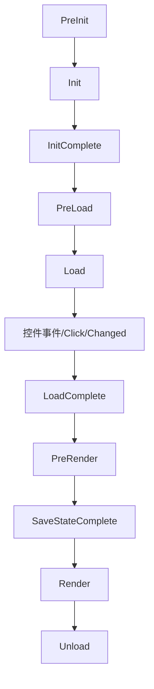

# Web 应用开发全解析：从核心概念到 ASP.NET Core 实战

> [!abstract] 什么是 Web 应用开发？
> 
> Web 应用开发是构建通过浏览器访问、基于 HTTP/HTTPS 协议运行的软件系统的全过程。它不仅是“写代码”，而是一个从**需求分析**到**上线运维**的完整工程。

---

## 一、 核心目标与应用场景

Web 应用的核心是**解决业务问题**，且具备“无需安装、跨平台、数据云端存储”的特性。

|**类别**|**典型场景**|
|---|---|
|**电商类**|用户购物、支付、商家管理商品|
|**管理类 (BMS)**|企业考勤、财务报表、数据统计|
|**社交类**|动态发布、好友互动、实时聊天|
|**工具类**|在线文档（如 Notion）、图片编辑器|

---

## 二、 Web 应用三层架构 (MVC/前后端分离)

这是 Web 开发的灵魂，理解了这三层，就理解了数据的流动。

### 1. 前端层 (The Frontend) - “面子”

- **作用**：负责用户交互、展示数据、接收操作。
    
- **核心技术**：`HTML` (结构)、`CSS` (美化)、`JavaScript` (逻辑)。
    
- **现代框架**：Vue.js, React, Angular。
    

### 2. 后端层 (The Backend) - “大脑”

- **作用**：处理业务逻辑、身份验证、操作数据库、提供数据接口。
    
- **核心工具**：ASP.NET Core (C#)、Spring Boot (Java)、Django (Python)。
    
- **职责**：路由解析、API 开发、安全性控制。
    

### 3. 数据层 (The Database) - “仓库”

- **作用**：持久化存储所有业务数据。
    
- **核心工具**：
    
    - **关系型**：SQL Server (与 .NET 最搭)、MySQL、PostgreSQL。
        
    - **非关系型**：Redis (缓存)、MongoDB (文档)。
        

---

## 三、 标准开发流程 (SDLC)

从 0 到 1 的六个必经阶段：

1. **需求分析**：明确“借书、还书、逾期罚款”等功能逻辑。
    
2. **架构设计**：技术选型 (ASP.NET Core + Vue)、数据库表结构设计。
    
3. **开发实现**：前端编写 UI，后端编写 API 和业务代码。
    
4. **测试环节**：单元测试、集成测试、压力测试。
    
5. **部署上线**：配置 IIS/Nginx 服务器，解析域名。
    
6. **运维迭代**：监控日志、修复 Bug、功能升级。
    

---

## 四、 代码实战：以“用户登录”为例

这个例子展示了 **前端请求 -> 后端处理 -> 数据返回** 的经典闭环。

### 1. 前端实现 (HTML + JS)


```html
<div id="login-box">
    <input type="text" id="username" placeholder="用户名" />
    <input type="password" id="password" placeholder="密码" />
    <button onclick="login()">登录</button>
    <p id="msg"></p>
</div>

<script>
    async function login() {
        const payload = { 
            username: id("username").value, 
            password: id("password").value 
        };
        // 1. 发送请求到后端 API
        const response = await fetch('/api/Login', {
            method: 'POST',
            headers: { 'Content-Type': 'application/json' },
            body: JSON.stringify(payload)
        });
        const result = await response.json();
        // 2. 将结果反馈给用户
        document.getElementById('msg').innerText = result.message;
    }
</script>
```

### 2. 后端实现 (ASP.NET Core)


```c#
[ApiController]
[Route("api/[controller]")]
public class LoginController : ControllerBase
{
    // 模拟数据库
    private readonly Dictionary<string, string> _db = new() { { "admin", "123456" } };

    [HttpPost]
    public IActionResult Post([FromBody] LoginRequest req)
    {
        // 1. 业务逻辑判断
        if (string.IsNullOrEmpty(req.Username)) 
            return Ok(new { code = 0, message = "账号不能为空" });

        // 2. 数据库匹配
        if (_db.ContainsKey(req.Username) && _db[req.Username] == req.Password)
            return Ok(new { code = 1, message = "🎉 登录成功！" });
            
        return Ok(new { code = 0, message = "❌ 账号或密码错误" });
    }
}

public class LoginRequest { public string Username { get; set; } public string Password { get; set; } }
```

---

## 五、 开发模式对比

根据项目需求选择不同的“玩法”：

|**模式**|**描述**|**适用场景**|
|---|---|---|
|**SSR (服务端渲染)**|服务器直接生成 HTML 发给浏览器|SEO 要求高、功能简单的网站|
|**前后端分离 (主流)**|后端只出 API (JSON)，前端渲染页面|复杂交互、移动端/PC端通用后端|
|**微服务**|将大系统拆成多个独立小服务|超大型企业级应用|

---

> [!tip] 总结
> 
> 把 Web 开发想象成开餐馆：**前端**是装修精美的餐厅前台，**后端 (ASP.NET)** 是忙碌工作的厨房逻辑，**数据库**是存放食材的冷库。三者高效协作，才能给用户（食客）提供完美的体验。

---
---


# 关于ASP.NET


简单来说，**ASP.NET** 是由微软开发的一个开源、跨平台的服务器端 Web 应用框架。它不是一种编程语言，而是一个可以让开发者使用 C# 或 F# 等语言来构建动态网页、应用和服务的工作平台。

你可以把它想象成一个功能齐全的“工具箱”，里面备好了处理安全、数据库连接、API 接口和网页渲染的所有零件。

---

## ASP.NET 的核心知识体系

要掌握 ASP.NET，通常需要围绕以下几个核心维度展开：

### 1. 运行环境与版本

- **ASP.NET Core (主流):** 最新的、跨平台的版本。可以在 Windows、macOS 和 Linux 上运行，性能极高，是目前学习的首选。
    
- **ASP.NET Framework (传统):** 早期的版本，仅限 Windows。虽然很多老项目在使用，但新技术已转向 Core。
    
- **.NET Runtime:** 支撑程序运行的底层环境。
    

### 2. 开发语言

ASP.NET 的灵魂是 **C#**。你需要掌握：

- **面向对象编程 (OOP):** 类、接口、继承。
    
- **LINQ:** 像写 SQL 一样在代码里查询数据。
    
- **异步编程 (Async/Await):** 提高服务器在高并发下的响应能力。
    

### 3. Web 开发模式

- **MVC (Model-View-Controller):** 最经典的模式。将数据（模型）、界面（视图）和业务逻辑（控制器）分开，便于维护。
    
- **Web API:** 专门用来写后端接口，只返回数据（通常是 JSON），供手机 App 或前端框架（如 Vue/React）调用。
    
- **Razor Pages:** 一种更简单、以页面为中心的开发模式，适合小型应用。
    
- **Blazor:** 微软的黑科技，允许你用 C# 代替 JavaScript 来写前端交互。
    

### 4. 数据访问 (ORM)

- **Entity Framework Core (EF Core):** 它是 C# 与数据库之间的桥梁。你不需要写复杂的 SQL 语句，直接操作 C# 对象即可实现对数据库的增删改查。
    

### 5. 前端技术栈

虽然 ASP.NET 是后端框架，但你仍需了解：

- **HTML/CSS/JavaScript:** 网页的基础。
    
- **Razor 语法:** 在 HTML 中嵌入 C# 代码的特殊语法（例如 `@Model.Name`）。
    

### 6. 核心中间件与机制

- **依赖注入 (Dependency Injection):** ASP.NET Core 的核心设计思想，让代码更松耦合。
    
- **中间件 (Middleware):** 处理请求的管道，比如身份验证、日志记录、错误处理等。
    
- **身份认证与授权 (Identity):** 解决用户注册、登录、权限控制的现成方案。
    


---
---

# HTML协议

## 1. HTML / HTML5 / XHTML (前端结构的三剑客)

它们本质上是“一家人”，代表了网页标准的进化史。

### **HTML (HyperText Markup Language)**

- **定义：** 超文本标记语言，是网页的骨架。
    
- **历史：** 早期的 HTML 语法比较松散（比如忘记写关闭标签 `</div>` 浏览器也能运行），导致不同浏览器兼容性差。
    

### **XHTML (Extensible HTML)**

- **定义：** 严格版的 HTML。
    
- **特点：** 它要求代码必须符合 XML 的规范。
    
    - 标签必须小写。
        
    - 标签必须闭合（如 `<br />`）。
        
    - 属性必须加引号。
        
- **现状：** 因为太死板、开发效率低，现在基本被 HTML5 取代了。
    

### **HTML5 (当代标准)**

- **定义：** 目前最主流的版本。它不仅仅是标记语言，更是一个技术集合。
    
- **核心升级：**
    
    - **语义化标签：** 引入了 `<header>`, `<footer>`, `<article>`，让搜索引擎更容易读懂网页。
        
    - **多媒体：** 原生支持 `<video>` 和 `<audio>`，不再需要 Flash 插件。
        
    - **强大功能：** 引入了本地存储 (LocalStorage)、画布 (Canvas) 绘图、地理位置 API 等。
        

---

## 2. SSH (后端核心：安全外壳协议)

作为 Java 后端开发者，这是你每天都要打交道的工具。

- 定义： Secure Shell，一种加密的网络传输协议。
    
- 用途： 1. **远程管理服务器：** 你在 Windows 上用终端连接 Linux 服务器（如阿里云、腾讯云）时，走的就是 SSH 协议（默认端口 22）。
    
    2. **安全传输：** 比如通过 SCP 或 SFTP 在服务器间传文件。
    
    3. **Git 操作：** 你在推送代码到 GitHub 或 GitLab 时，通常会配置 SSH Key 免密登录。
    

> **⚠️ 注意：不要搞混两个“SSH”**
> 
> 在 Java 圈子里，老一辈程序员常说的 **"SSH 框架"** 指的是 **Struts2 + Spring + Hibernate**。但在现代开发中，这个组合已经**过时**了，被 **SSM (Spring + SpringMVC + MyBatis)** 取代。现在的面试中，SSH 更多指的就是安全协议。

---

## 3.简单的html页面
<!DOCTYPE html>
<html lang="zh-CN">
<head>
    <meta charset="UTF-8">
    <title>我的成绩页面</title>
    <style>
        table {
            border-collapse: collapse;
            width: 80%;
            margin: 20px auto;
            text-align: center;
        }
        th, td {
            border: 1px solid black;
            padding: 10px;
        }
        caption {
            font-weight: bold;
            font-size: 1.2em;
            margin-bottom: 10px;
        }
    </style>
</head>
<body>

    <table>
        <caption>001 张华</caption>
        
        <thead>
            <tr>
                <th>大学英语</th>
                <th>高等数学</th>
                <th>数据结构</th>
                <th>ASP.NET网络编程</th>
            </tr>
        </thead>
        <tbody>
            <tr>
                <td>85</td>
                <td>89</td>
                <td style="color: red; font-weight: bold;">55</td>
                <td>90</td>
            </tr>
        </tbody>
    </table>

</body>
</html>

## 4.html基本语法

### 1. 基础骨架 (Document Structure)

每个网页都**必须**具备的基本结构：

- `<!DOCTYPE html>`：声明文档类型。
    
- `<html>`：网页根元素。
    
- `<head>`：存放元数据（标题、字符集、CSS 链接）。
    
- `<title>`：网页在浏览器标签栏显示的标题。
    
- `<body>`：网页可见的所有内容。
    

---

### 2. 文本格式 (Text Formatting)

用于处理网页上的文字排版：

- `<h1>` 到 `<h6>`：六级标题（`<h1>` 最大，`<h6>` 最小）。
    
- `<p>`：段落。
    
- `<br>`：强制换行（单标签）。
    
- `<hr>`：水平分隔线（单标签）。
    
- `<strong>` 或 `<b>`：**加粗文本**。
    
- `<em>` 或 `<i>`：_斜体文本_。
    
- `<span>`：用于包裹行内的一小段文字，方便单独设置样式。
    

---

### 3. 列表 (Lists)

展示项目清单时最常用：

- `<ul>`：无序列表（前面带圆点）。
    
- `<ol>`：有序列表（前面带数字 1, 2, 3）。
    
- `<li>`：列表中的每一项（配合 `<ul>` 或 `<ol>` 使用）。
    

---

### 4. 链接与多媒体 (Links & Media)

让网页“动”起来的核心：

- `<a href="链接地址">`：超链接。
    
- ``：插入图片。
    
- `<audio>` / `<video>`：插入音频或视频。
    
- `<iframe>`：在当前页面嵌入另一个网页。
    

---

### 5. 表单与交互 (Forms & Input)

用于收集用户信息：

- `<form>`：表单容器。
    
- `<input type="text">`：单行文本输入框。
    
- `<input type="password">`：密码输入框（自动打码）。
    
- `<input type="checkbox">`：复选框。
    
- `<input type="radio">`：单选框。
    
- `<textarea>`：多行文本框。
    
- `<button>`：按钮。
    
- `<select>` 与 `<option>`：下拉选择框。
    

---

### 6. 表格 (Tables)

展示数据（就是你刚才练习的内容）：

- `<table>`：表格外框。
    
- `<tr>`：行 (Row)。
    
- `<th>`：表头单元格 (Header，文字加粗居中)。
    
- `<td>`：普通单元格 (Data)。
    
- `<caption>`：表格标题。
    

---

### 7. 布局容器 (Layout Containers)

网页排版的“隐形盒子”：

- `<div>`：**最常用的块级容器**，用于划分网页的不同区域。
    
- `<header>` / `<footer>`：页眉 / 页脚（语义化标签）。
    
- `<nav>`：导航栏。
    
- `<section>` / `<article>`：区块 / 文章正文。
    

---

### 💡 小白速记 Tips：

1. **单标签：** 绝大多数标签成对出现，但像 ``、`<br>`、`<hr>`、`<input>` 是没有结束标签的。
    
2. **注释：** 代码里写给自己看的笔记用 ``。
    
3. **属性：** 属性名和属性值之间用 `=`，值必须加双引号 `""`。


# ASP.NET页面事件
## ASP.NET 页面生命周期事件

> [!abstract] 简介
> ASP.NET 页面在服务器上运行并呈现为 HTML 的过程中，会经历一系列有序的事件。理解这些事件对于处理控件初始化、状态维护（ViewState）和业务逻辑触发至关重要。
> 
### 1. 核心事件流程图
在 Obsidian 中建议使用 Mermaid 插件查看（默认支持）：

### 2. 关键生命周期阶段详解
#### 🟢 初始化阶段 (Initialization)
 * **PreInit**:
   * 设置页面主题（Theme）。
   * 动态创建或替换主页（Master Page）。
 * **Init**:
   * 递归初始化所有子控件。
   * **注意**：此时 ViewState 尚未还原。
 * **InitComplete**:
   * 所有控件初始化完成，开始开启视图状态（ViewState）追踪。
#### 🔵 加载阶段 (Loading)
 * **PreLoad**: 处理回发（Postback）数据之前的最后一步。
 * **Load (最常用)**:
   * 此时页面已恢复 ViewState。
   * 使用 IsPostBack 区分首次加载与后续刷新。
> [!example] 典型用法
> ```csharp
> protected void Page_Load(object sender, EventArgs e)
> {
>     if (!IsPostBack)
>     {
>         // 首次进入页面执行：如绑定数据库数据
>     }
> }
> 
> ```
> 
#### 🟠 控件事件处理 (Postback Events)
 * **具体事件触发**: 如按钮点击 Button_Click 或下拉列表改变 SelectedIndexChanged。
 * 这些事件仅在 **回发（Postback）** 时发生，且在 Page_Load 之后执行。
#### 🟡 呈现前处理 (Pre-rendering)
 * **PreRender**:
   * 输出 HTML 前的最后修改机会。
   * 常用于最后调整控件的 Visible 或 Style 属性。
 * **SaveStateComplete**: ViewState 已完全序列化并保存到页面中。
#### 🔴 卸载阶段 (Unloading)
 * **Unload**:
   * 页面处理完毕，资源回收。
   * **禁忌**：不可在此阶段修改控件属性（会引发异常），仅用于关闭数据库连接或文件流。
### 3. 常见开发避坑指南
| 比较项 | Init 事件 | Load 事件 |
|---|---|---|
| **ViewState** | 不可用 | **可用** |
| **控件值** | 初始值 | 用户输入的值 |
| **动态控件** | 建议在此处创建（保证 ID 一致） | 一般用于处理逻辑 |
> [!warning] 重要提示
> 所有的页面事件逻辑在完成后，服务器都会将页面对象**销毁**。这意味着类级别的成员变量无法跨页面刷新保留，除非使用 Session、Cookie 或 ViewState。
> 
### 4. 快速查询：完整触发顺序表
 1. OnPreInit
 2. OnInit
 3. OnInitComplete
 4. OnPreLoad
 5. **OnLoad**
 6. **控件事件** (如 Click)
 7. OnLoadComplete
 8. **OnPreRender**
 9. OnPreRenderComplete
 10. OnSaveStateComplete
 11. Unload


在 ASP.NET Web Forms 开发中，**服务器控件（Server Controls）** 是构建交互式网页的核心组件。它们在服务器端运行，并由 ASP.NET 引擎自动渲染为 HTML 代码。
## ASP.NET 服务器控件详解
> [!tip] 核心特征
> 服务器控件必须包含 runat="server" 属性。它们的对象模型在服务器端运行，能够保留状态（ViewState），并触发服务器端事件。
> 
### 1. 控件分类
| 类别 | 代表控件 | 说明 |
|---|---|---|
| **标准控件** | asp:Button, asp:TextBox, asp:Label | 对应 HTML 基本元素，但具有完整的服务器端事件支持。 |
| **容器控件** | asp:Panel, asp:PlaceHolder | 用于组织页面布局，或在运行时动态添加子控件。 |
| **数据控件** | asp:GridView, asp:Repeater, asp:DataList | 强大的数据绑定组件，用于显示数据库内容（支持分页、排序）。 |
| **验证控件** | asp:RequiredFieldValidator, asp:CompareValidator | 在前端和后端双重验证用户输入，确保数据安全。 |
| **导航控件** | asp:Menu, asp:TreeView, asp:SiteMapPath | 自动生成菜单、面包屑导航。 |
### 2. HTML 控件 vs 服务器控件
| 特性       | HTML 控件 (客户端)          | 服务器控件 (Server Controls)                  |
| -------- | ---------------------- | ---------------------------------------- |
| **声明方式** | <input type="text">    | <asp:TextBox ID="txt1" runat="server" /> |
| **生命周期** | 仅在浏览器运行，无服务器交互         | 参与页面生命周期（Init, Load, Unload 等）           |
| **状态保持** | 页面刷新后数据丢失（除非手动处理）      | 自动通过 **ViewState** 保持输入内容                |
| **编程模型** | 通常通过 JavaScript/DOM 操作 | 在 C# 后置代码中直接通过 ID 访问                     |
### 3. 核心机制：ViewState (视图状态)
这是服务器控件最独特的机制。为了解决 HTTP 协议无状态的问题，ASP.NET 将控件的状态（如文本框里的文字、选中的复选框）加密后存在一个名为 VIEWSTATE 的隐藏域中。
> [!warning] 性能注意
> 如果页面上有大型数据控件（如 GridView 绑定了万条数据），ViewState 会变得非常庞大，导致页面加载变慢。可以通过 EnableViewState="false" 手动关闭不必要的控件状态保持。
> 
### 4. 常用代码示例 
#### 数据绑定示例
在后置代码（.aspx.cs）中，你可以像操作对象一样操作这些控件：
```csharp
// 前端声明：<asp:Label ID="lblMsg" runat="server" />
// 前端声明：<asp:DropDownList ID="ddlCategories" runat="server" />

protected void Page_Load(object sender, EventArgs e)
{
    if (!IsPostBack)
    {
        // 模拟数据源
        List<string> categories = new List<string> { "后端", "前端", "AI" };
        
        // 绑定数据到服务器控件
        ddlCategories.DataSource = categories;
        ddlCategories.DataBind();
        
        lblMsg.Text = "数据绑定成功！";
    }
}

```
#### 验证控件用法
```html
<asp:TextBox ID="txtAge" runat="server" />
<asp:RangeValidator 
    ID="rvAge" 
    runat="server" 
    ControlToValidate="txtAge" 
    MinimumValue="1" 
    MaximumValue="120" 
    Type="Integer" 
    ErrorMessage="请输入有效的年龄 (1-120)" />

```
### 5. 开发建议
 1. **ID 命名规范**：建议使用前缀区分控件类型，如 btnSubmit (Button), txtUserName (TextBox), gvOrders (GridView)。
 2. **AutoPostBack 属性**：有些控件（如 DropDownList）默认改变选项不会刷新页面。如果需要改变后立即执行服务器逻辑，需设置 AutoPostBack="true"。
 3. **不要滥用**：简单的静态展示使用普通 HTML 标签即可，过度使用服务器控件会增加服务器负担。


明白，我会严格去除所有用于装饰的冗余符号（如标题前的 # 占位符、多余的星号等），确保文本结构纯净且符合 Obsidian 的 Markdown 标准。以下是缩小一级标题后的**文本类型控件**笔记：
## ASP.NET 文本类型控件详解
> [!abstract] 概要
> 文本类型控件是 Web Forms 中最基础的交互组件，主要用于展示静态文本或接收用户输入。它们在服务器端都有对应的类模型，支持丰富的属性配置。
> 
### 1. Label 控件 (标签)
用于在页面上显示不希望被用户直接修改的文本。
 * **渲染结果**：通常渲染为 HTML 的 \<span> 标签。
 * **核心属性**：
   * Text: 获取或设置显示的文本内容。
   * AssociatedControlID: 关联其他输入控件，渲染时会变成 \<label for="...">。
```html
<asp:Label ID="lblStatus" runat="server" Text="当前状态：正常" />

```
### 2. Literal 控件 (静态文本)
与 Label 类似，但它更“纯粹”。
 * **渲染结果**：直接输出内容，不产生任何额外的 HTML 标签。
 * **适用场景**：动态向页面注入代码片段、脚本或纯文字，不破坏 CSS 布局。
 * **核心属性**：
   * Mode: 支持 Transform、PassThrough 或 Encode（自动进行 HTML 编码防止 XSS）。
### 3. TextBox 控件 (文本框)
最核心的输入控件。
 * **渲染结果**：根据 TextMode 不同，渲染为 input 或 textarea。
 * **核心属性**：
   * TextMode: 支持 SingleLine、Password、MultiLine 以及 HTML5 类型（Email/Date等）。
   * AutoPostBack: 设置为 true 时，内容改变并失去焦点会立即触发服务器端事件。
   * 
### 4. 关键区别对比

|**特性**|**Label**|**Literal**|**TextBox**|
|---|---|---|---|
|**HTML 渲染**|`<span>`|无外层标签|`input` 或 `textarea`|
|**支持样式**|是|否|是|
|**用户输入**|否|否|是|

### 5. 常用后端逻辑示例
```csharp
protected void btnSubmit_Click(object sender, EventArgs e)
{
    // 获取用户输入
    string userName = txtUserName.Text.Trim();
    
    // Label 修改显示
    lblMessage.Text = "信息已接收";
    
    // Literal 注入 HTML
    litOutput.Text = "<b>处理完成</b>";
}
```

### 6. 开发避坑：只读属性
若在前端通过 JavaScript 修改了 ReadOnly="true" 的 TextBox 的值，回发后 C# 可能读取不到新值。建议使用 HiddenField 配合或通过 Request.Form 集合手动获取。
