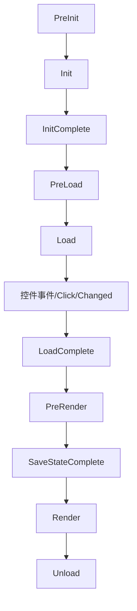

# Web 应用开发全解析：从核心概念到 ASP.NET Core 实战

> [!abstract] 什么是 Web 应用开发？
> 
> Web 应用开发是构建通过浏览器访问、基于 HTTP/HTTPS 协议运行的软件系统的全过程。它不仅是“写代码”，而是一个从**需求分析**到**上线运维**的完整工程。

---

## 一、 核心目标与应用场景

Web 应用的核心是**解决业务问题**，且具备“无需安装、跨平台、数据云端存储”的特性。

|**类别**|**典型场景**|
|---|---|
|**电商类**|用户购物、支付、商家管理商品|
|**管理类 (BMS)**|企业考勤、财务报表、数据统计|
|**社交类**|动态发布、好友互动、实时聊天|
|**工具类**|在线文档（如 Notion）、图片编辑器|

---

## 二、 Web 应用三层架构 (MVC/前后端分离)

这是 Web 开发的灵魂，理解了这三层，就理解了数据的流动。

### 1. 前端层 (The Frontend) - “面子”

- **作用**：负责用户交互、展示数据、接收操作。
    
- **核心技术**：`HTML` (结构)、`CSS` (美化)、`JavaScript` (逻辑)。
    
- **现代框架**：Vue.js, React, Angular。
    

### 2. 后端层 (The Backend) - “大脑”

- **作用**：处理业务逻辑、身份验证、操作数据库、提供数据接口。
    
- **核心工具**：ASP.NET Core (C#)、Spring Boot (Java)、Django (Python)。
    
- **职责**：路由解析、API 开发、安全性控制。
    

### 3. 数据层 (The Database) - “仓库”

- **作用**：持久化存储所有业务数据。
    
- **核心工具**：
    
    - **关系型**：SQL Server (与 .NET 最搭)、MySQL、PostgreSQL。
        
    - **非关系型**：Redis (缓存)、MongoDB (文档)。
        

---

## 三、 标准开发流程 (SDLC)

从 0 到 1 的六个必经阶段：

1. **需求分析**：明确“借书、还书、逾期罚款”等功能逻辑。
    
2. **架构设计**：技术选型 (ASP.NET Core + Vue)、数据库表结构设计。
    
3. **开发实现**：前端编写 UI，后端编写 API 和业务代码。
    
4. **测试环节**：单元测试、集成测试、压力测试。
    
5. **部署上线**：配置 IIS/Nginx 服务器，解析域名。
    
6. **运维迭代**：监控日志、修复 Bug、功能升级。
    

---

## 四、 代码实战：以“用户登录”为例

这个例子展示了 **前端请求 -> 后端处理 -> 数据返回** 的经典闭环。

### 1. 前端实现 (HTML + JS)


```html
<div id="login-box">
    <input type="text" id="username" placeholder="用户名" />
    <input type="password" id="password" placeholder="密码" />
    <button onclick="login()">登录</button>
    <p id="msg"></p>
</div>

<script>
    async function login() {
        const payload = { 
            username: id("username").value, 
            password: id("password").value 
        };
        // 1. 发送请求到后端 API
        const response = await fetch('/api/Login', {
            method: 'POST',
            headers: { 'Content-Type': 'application/json' },
            body: JSON.stringify(payload)
        });
        const result = await response.json();
        // 2. 将结果反馈给用户
        document.getElementById('msg').innerText = result.message;
    }
</script>
```

### 2. 后端实现 (ASP.NET Core)


```c#
[ApiController]
[Route("api/[controller]")]
public class LoginController : ControllerBase
{
    // 模拟数据库
    private readonly Dictionary<string, string> _db = new() { { "admin", "123456" } };

    [HttpPost]
    public IActionResult Post([FromBody] LoginRequest req)
    {
        // 1. 业务逻辑判断
        if (string.IsNullOrEmpty(req.Username)) 
            return Ok(new { code = 0, message = "账号不能为空" });

        // 2. 数据库匹配
        if (_db.ContainsKey(req.Username) && _db[req.Username] == req.Password)
            return Ok(new { code = 1, message = "🎉 登录成功！" });
            
        return Ok(new { code = 0, message = "❌ 账号或密码错误" });
    }
}

public class LoginRequest { public string Username { get; set; } public string Password { get; set; } }
```

---

## 五、 开发模式对比

根据项目需求选择不同的“玩法”：

|**模式**|**描述**|**适用场景**|
|---|---|---|
|**SSR (服务端渲染)**|服务器直接生成 HTML 发给浏览器|SEO 要求高、功能简单的网站|
|**前后端分离 (主流)**|后端只出 API (JSON)，前端渲染页面|复杂交互、移动端/PC端通用后端|
|**微服务**|将大系统拆成多个独立小服务|超大型企业级应用|

---

> [!tip] 总结
> 
> 把 Web 开发想象成开餐馆：**前端**是装修精美的餐厅前台，**后端 (ASP.NET)** 是忙碌工作的厨房逻辑，**数据库**是存放食材的冷库。三者高效协作，才能给用户（食客）提供完美的体验。

---
---


# 关于ASP.NET


简单来说，**ASP.NET** 是由微软开发的一个开源、跨平台的服务器端 Web 应用框架。它不是一种编程语言，而是一个可以让开发者使用 C# 或 F# 等语言来构建动态网页、应用和服务的工作平台。

你可以把它想象成一个功能齐全的“工具箱”，里面备好了处理安全、数据库连接、API 接口和网页渲染的所有零件。

---

## ASP.NET 的核心知识体系

要掌握 ASP.NET，通常需要围绕以下几个核心维度展开：

### 1. 运行环境与版本

- **ASP.NET Core (主流):** 最新的、跨平台的版本。可以在 Windows、macOS 和 Linux 上运行，性能极高，是目前学习的首选。
    
- **ASP.NET Framework (传统):** 早期的版本，仅限 Windows。虽然很多老项目在使用，但新技术已转向 Core。
    
- **.NET Runtime:** 支撑程序运行的底层环境。
    

### 2. 开发语言

ASP.NET 的灵魂是 **C#**。你需要掌握：

- **面向对象编程 (OOP):** 类、接口、继承。
    
- **LINQ:** 像写 SQL 一样在代码里查询数据。
    
- **异步编程 (Async/Await):** 提高服务器在高并发下的响应能力。
    

### 3. Web 开发模式

- **MVC (Model-View-Controller):** 最经典的模式。将数据（模型）、界面（视图）和业务逻辑（控制器）分开，便于维护。
    
- **Web API:** 专门用来写后端接口，只返回数据（通常是 JSON），供手机 App 或前端框架（如 Vue/React）调用。
    
- **Razor Pages:** 一种更简单、以页面为中心的开发模式，适合小型应用。
    
- **Blazor:** 微软的黑科技，允许你用 C# 代替 JavaScript 来写前端交互。
    

### 4. 数据访问 (ORM)

- **Entity Framework Core (EF Core):** 它是 C# 与数据库之间的桥梁。你不需要写复杂的 SQL 语句，直接操作 C# 对象即可实现对数据库的增删改查。
    

### 5. 前端技术栈

虽然 ASP.NET 是后端框架，但你仍需了解：

- **HTML/CSS/JavaScript:** 网页的基础。
    
- **Razor 语法:** 在 HTML 中嵌入 C# 代码的特殊语法（例如 `@Model.Name`）。
    

### 6. 核心中间件与机制

- **依赖注入 (Dependency Injection):** ASP.NET Core 的核心设计思想，让代码更松耦合。
    
- **中间件 (Middleware):** 处理请求的管道，比如身份验证、日志记录、错误处理等。
    
- **身份认证与授权 (Identity):** 解决用户注册、登录、权限控制的现成方案。
    


---
---

# HTML协议

## 1. HTML / HTML5 / XHTML (前端结构的三剑客)

它们本质上是“一家人”，代表了网页标准的进化史。

### **HTML (HyperText Markup Language)**

- **定义：** 超文本标记语言，是网页的骨架。
    
- **历史：** 早期的 HTML 语法比较松散（比如忘记写关闭标签 `</div>` 浏览器也能运行），导致不同浏览器兼容性差。
    

### **XHTML (Extensible HTML)**

- **定义：** 严格版的 HTML。
    
- **特点：** 它要求代码必须符合 XML 的规范。
    
    - 标签必须小写。
        
    - 标签必须闭合（如 `<br />`）。
        
    - 属性必须加引号。
        
- **现状：** 因为太死板、开发效率低，现在基本被 HTML5 取代了。
    

### **HTML5 (当代标准)**

- **定义：** 目前最主流的版本。它不仅仅是标记语言，更是一个技术集合。
    
- **核心升级：**
    
    - **语义化标签：** 引入了 `<header>`, `<footer>`, `<article>`，让搜索引擎更容易读懂网页。
        
    - **多媒体：** 原生支持 `<video>` 和 `<audio>`，不再需要 Flash 插件。
        
    - **强大功能：** 引入了本地存储 (LocalStorage)、画布 (Canvas) 绘图、地理位置 API 等。
        

---

## 2. SSH (后端核心：安全外壳协议)

作为 Java 后端开发者，这是你每天都要打交道的工具。

- 定义： Secure Shell，一种加密的网络传输协议。
    
- 用途： 1. **远程管理服务器：** 你在 Windows 上用终端连接 Linux 服务器（如阿里云、腾讯云）时，走的就是 SSH 协议（默认端口 22）。
    
    2. **安全传输：** 比如通过 SCP 或 SFTP 在服务器间传文件。
    
    3. **Git 操作：** 你在推送代码到 GitHub 或 GitLab 时，通常会配置 SSH Key 免密登录。
    

> **⚠️ 注意：不要搞混两个“SSH”**
> 
> 在 Java 圈子里，老一辈程序员常说的 **"SSH 框架"** 指的是 **Struts2 + Spring + Hibernate**。但在现代开发中，这个组合已经**过时**了，被 **SSM (Spring + SpringMVC + MyBatis)** 取代。现在的面试中，SSH 更多指的就是安全协议。

---

## 3.简单的html页面
<!DOCTYPE html>
<html lang="zh-CN">
<head>
    <meta charset="UTF-8">
    <title>我的成绩页面</title>
    <style>
        table {
            border-collapse: collapse;
            width: 80%;
            margin: 20px auto;
            text-align: center;
        }
        th, td {
            border: 1px solid black;
            padding: 10px;
        }
        caption {
            font-weight: bold;
            font-size: 1.2em;
            margin-bottom: 10px;
        }
    </style>
</head>
<body>

    <table>
        <caption>001 张华</caption>
        
        <thead>
            <tr>
                <th>大学英语</th>
                <th>高等数学</th>
                <th>数据结构</th>
                <th>ASP.NET网络编程</th>
            </tr>
        </thead>
        <tbody>
            <tr>
                <td>85</td>
                <td>89</td>
                <td style="color: red; font-weight: bold;">55</td>
                <td>90</td>
            </tr>
        </tbody>
    </table>

</body>
</html>

## 4.html基本语法

### 1. 基础骨架 (Document Structure)

每个网页都**必须**具备的基本结构：

- `<!DOCTYPE html>`：声明文档类型。
    
- `<html>`：网页根元素。
    
- `<head>`：存放元数据（标题、字符集、CSS 链接）。
    
- `<title>`：网页在浏览器标签栏显示的标题。
    
- `<body>`：网页可见的所有内容。
    

---

### 2. 文本格式 (Text Formatting)

用于处理网页上的文字排版：

- `<h1>` 到 `<h6>`：六级标题（`<h1>` 最大，`<h6>` 最小）。
    
- `<p>`：段落。
    
- `<br>`：强制换行（单标签）。
    
- `<hr>`：水平分隔线（单标签）。
    
- `<strong>` 或 `<b>`：**加粗文本**。
    
- `<em>` 或 `<i>`：_斜体文本_。
    
- `<span>`：用于包裹行内的一小段文字，方便单独设置样式。
    

---

### 3. 列表 (Lists)

展示项目清单时最常用：

- `<ul>`：无序列表（前面带圆点）。
    
- `<ol>`：有序列表（前面带数字 1, 2, 3）。
    
- `<li>`：列表中的每一项（配合 `<ul>` 或 `<ol>` 使用）。
    

---

### 4. 链接与多媒体 (Links & Media)

让网页“动”起来的核心：

- `<a href="链接地址">`：超链接。
    
- ``：插入图片。
    
- `<audio>` / `<video>`：插入音频或视频。
    
- `<iframe>`：在当前页面嵌入另一个网页。
    

---

### 5. 表单与交互 (Forms & Input)

用于收集用户信息：

- `<form>`：表单容器。
    
- `<input type="text">`：单行文本输入框。
    
- `<input type="password">`：密码输入框（自动打码）。
    
- `<input type="checkbox">`：复选框。
    
- `<input type="radio">`：单选框。
    
- `<textarea>`：多行文本框。
    
- `<button>`：按钮。
    
- `<select>` 与 `<option>`：下拉选择框。
    

---

### 6. 表格 (Tables)

展示数据（就是你刚才练习的内容）：

- `<table>`：表格外框。
    
- `<tr>`：行 (Row)。
    
- `<th>`：表头单元格 (Header，文字加粗居中)。
    
- `<td>`：普通单元格 (Data)。
    
- `<caption>`：表格标题。
    

---

### 7. 布局容器 (Layout Containers)

网页排版的“隐形盒子”：

- `<div>`：**最常用的块级容器**，用于划分网页的不同区域。
    
- `<header>` / `<footer>`：页眉 / 页脚（语义化标签）。
    
- `<nav>`：导航栏。
    
- `<section>` / `<article>`：区块 / 文章正文。
    

---

### 💡 小白速记 Tips：

1. **单标签：** 绝大多数标签成对出现，但像 ``、`<br>`、`<hr>`、`<input>` 是没有结束标签的。
    
2. **注释：** 代码里写给自己看的笔记用 ``。
    
3. **属性：** 属性名和属性值之间用 `=`，值必须加双引号 `""`。

---
---


# ASP.NET页面事件


## ASP.NET 页面生命周期事件

> [!abstract] 简介
> ASP.NET 页面在服务器上运行并呈现为 HTML 的过程中，会经历一系列有序的事件。理解这些事件对于处理控件初始化、状态维护（ViewState）和业务逻辑触发至关重要。
> 
### 1. 核心事件流程图
在 Obsidian 中建议使用 Mermaid 插件查看（默认支持）：

### 2. 关键生命周期阶段详解
#### 🟢 初始化阶段 (Initialization)
 * **PreInit**:
   * 设置页面主题（Theme）。
   * 动态创建或替换主页（Master Page）。
 * **Init**:
   * 递归初始化所有子控件。
   * **注意**：此时 ViewState 尚未还原。
 * **InitComplete**:
   * 所有控件初始化完成，开始开启视图状态（ViewState）追踪。
#### 🔵 加载阶段 (Loading)
 * **PreLoad**: 处理回发（Postback）数据之前的最后一步。
 * **Load (最常用)**:
   * 此时页面已恢复 ViewState。
   * 使用 IsPostBack 区分首次加载与后续刷新。
> [!example] 典型用法
> ```csharp
> protected void Page_Load(object sender, EventArgs e)
> {
>     if (!IsPostBack)
>     {
>         // 首次进入页面执行：如绑定数据库数据
>     }
> }
> 
> ```
> 
#### 🟠 控件事件处理 (Postback Events)
 * **具体事件触发**: 如按钮点击 Button_Click 或下拉列表改变 SelectedIndexChanged。
 * 这些事件仅在 **回发（Postback）** 时发生，且在 Page_Load 之后执行。
#### 🟡 呈现前处理 (Pre-rendering)
 * **PreRender**:
   * 输出 HTML 前的最后修改机会。
   * 常用于最后调整控件的 Visible 或 Style 属性。
 * **SaveStateComplete**: ViewState 已完全序列化并保存到页面中。
#### 🔴 卸载阶段 (Unloading)
 * **Unload**:
   * 页面处理完毕，资源回收。
   * **禁忌**：不可在此阶段修改控件属性（会引发异常），仅用于关闭数据库连接或文件流。
### 3. 常见开发避坑指南
| 比较项 | Init 事件 | Load 事件 |
|---|---|---|
| **ViewState** | 不可用 | **可用** |
| **控件值** | 初始值 | 用户输入的值 |
| **动态控件** | 建议在此处创建（保证 ID 一致） | 一般用于处理逻辑 |
> [!warning] 重要提示
> 所有的页面事件逻辑在完成后，服务器都会将页面对象**销毁**。这意味着类级别的成员变量无法跨页面刷新保留，除非使用 Session、Cookie 或 ViewState。
> 
### 4. 快速查询：完整触发顺序表
 1. OnPreInit
 2. OnInit
 3. OnInitComplete
 4. OnPreLoad
 5. **OnLoad**
 6. **控件事件** (如 Click)
 7. OnLoadComplete
 8. **OnPreRender**
 9. OnPreRenderComplete
 10. OnSaveStateComplete
 11. Unload


在 ASP.NET Web Forms 开发中，**服务器控件（Server Controls）** 是构建交互式网页的核心组件。它们在服务器端运行，并由 ASP.NET 引擎自动渲染为 HTML 代码。
## 服务器控件详解
> [!tip] 核心特征
> 服务器控件必须包含 runat="server" 属性。它们的对象模型在服务器端运行，能够保留状态（ViewState），并触发服务器端事件。
> 
### 1. 控件分类
| 类别 | 代表控件 | 说明 |
|---|---|---|
| **标准控件** | asp:Button, asp:TextBox, asp:Label | 对应 HTML 基本元素，但具有完整的服务器端事件支持。 |
| **容器控件** | asp:Panel, asp:PlaceHolder | 用于组织页面布局，或在运行时动态添加子控件。 |
| **数据控件** | asp:GridView, asp:Repeater, asp:DataList | 强大的数据绑定组件，用于显示数据库内容（支持分页、排序）。 |
| **验证控件** | asp:RequiredFieldValidator, asp:CompareValidator | 在前端和后端双重验证用户输入，确保数据安全。 |
| **导航控件** | asp:Menu, asp:TreeView, asp:SiteMapPath | 自动生成菜单、面包屑导航。 |
### 2. HTML 控件 vs 服务器控件
| 特性       | HTML 控件 (客户端)          | 服务器控件 (Server Controls)                  |
| -------- | ---------------------- | ---------------------------------------- |
| **声明方式** | <input type="text">    | <asp:TextBox ID="txt1" runat="server" /> |
| **生命周期** | 仅在浏览器运行，无服务器交互         | 参与页面生命周期（Init, Load, Unload 等）           |
| **状态保持** | 页面刷新后数据丢失（除非手动处理）      | 自动通过 **ViewState** 保持输入内容                |
| **编程模型** | 通常通过 JavaScript/DOM 操作 | 在 C# 后置代码中直接通过 ID 访问                     |
### 3. 核心机制：ViewState (视图状态)
这是服务器控件最独特的机制。为了解决 HTTP 协议无状态的问题，ASP.NET 将控件的状态（如文本框里的文字、选中的复选框）加密后存在一个名为 VIEWSTATE 的隐藏域中。
> [!warning] 性能注意
> 如果页面上有大型数据控件（如 GridView 绑定了万条数据），ViewState 会变得非常庞大，导致页面加载变慢。可以通过 EnableViewState="false" 手动关闭不必要的控件状态保持。
> 
### 4. 常用代码示例 
#### 数据绑定示例
在后置代码（.aspx.cs）中，你可以像操作对象一样操作这些控件：
```csharp
// 前端声明：<asp:Label ID="lblMsg" runat="server" />
// 前端声明：<asp:DropDownList ID="ddlCategories" runat="server" />

protected void Page_Load(object sender, EventArgs e)
{
    if (!IsPostBack)
    {
        // 模拟数据源
        List<string> categories = new List<string> { "后端", "前端", "AI" };
        
        // 绑定数据到服务器控件
        ddlCategories.DataSource = categories;
        ddlCategories.DataBind();
        
        lblMsg.Text = "数据绑定成功！";
    }
}

```
#### 验证控件用法
```html
<asp:TextBox ID="txtAge" runat="server" />
<asp:RangeValidator 
    ID="rvAge" 
    runat="server" 
    ControlToValidate="txtAge" 
    MinimumValue="1" 
    MaximumValue="120" 
    Type="Integer" 
    ErrorMessage="请输入有效的年龄 (1-120)" />

```
### 5. 开发建议
 1. **ID 命名规范**：建议使用前缀区分控件类型，如 btnSubmit (Button), txtUserName (TextBox), gvOrders (GridView)。
 2. **AutoPostBack 属性**：有些控件（如 DropDownList）默认改变选项不会刷新页面。如果需要改变后立即执行服务器逻辑，需设置 AutoPostBack="true"。
 3. **不要滥用**：简单的静态展示使用普通 HTML 标签即可，过度使用服务器控件会增加服务器负担。


## 文本类型控件详解
> [!abstract] 概要
> 文本类型控件是 Web Forms 中最基础的交互组件，主要用于展示静态文本或接收用户输入。它们在服务器端都有对应的类模型，支持丰富的属性配置。
> 
### 1. Label 控件 (标签)
用于在页面上显示不希望被用户直接修改的文本。
 * **渲染结果**：通常渲染为 HTML 的 \<span> 标签。
 * **核心属性**：
   * Text: 获取或设置显示的文本内容。
   * AssociatedControlID: 关联其他输入控件，渲染时会变成 \<label for="...">。
```html
<asp:Label ID="lblStatus" runat="server" Text="当前状态：正常" />

```
### 2. Literal 控件 (静态文本)
与 Label 类似，但它更“纯粹”。
 * **渲染结果**：直接输出内容，不产生任何额外的 HTML 标签。
 * **适用场景**：动态向页面注入代码片段、脚本或纯文字，不破坏 CSS 布局。
 * **核心属性**：
   * Mode: 支持 Transform、PassThrough 或 Encode（自动进行 HTML 编码防止 XSS）。
### 3. TextBox 控件 (文本框)
最核心的输入控件。
 * **渲染结果**：根据 TextMode 不同，渲染为 input 或 textarea。
 * **核心属性**：
   * TextMode: 支持 SingleLine、Password、MultiLine 以及 HTML5 类型（Email/Date等）。
   * AutoPostBack: 设置为 true 时，内容改变并失去焦点会立即触发服务器端事件。
   * 
### 4. 关键区别对比

|**特性**|**Label**|**Literal**|**TextBox**|
|---|---|---|---|
|**HTML 渲染**|`<span>`|无外层标签|`input` 或 `textarea`|
|**支持样式**|是|否|是|
|**用户输入**|否|否|是|

### 5. 常用后端逻辑示例
```csharp
protected void btnSubmit_Click(object sender, EventArgs e)
{
    // 获取用户输入
    string userName = txtUserName.Text.Trim();
    
    // Label 修改显示
    lblMessage.Text = "信息已接收";
    
    // Literal 注入 HTML
    litOutput.Text = "<b>处理完成</b>";
}
```

### 6. 开发避坑：只读属性
若在前端通过 JavaScript 修改了 ReadOnly="true" 的 TextBox 的值，回发后 C# 可能读取不到新值。建议使用 HiddenField 配合或通过 Request.Form 集合手动获取。


---
---


## 按钮类型控件详解
> [!abstract] 概要
> 按钮控件主要用于向服务器提交表单数据或执行特定的后端方法。
> 
在 ASP.NET Web Forms 中，按钮类型控件是触发服务器端逻辑的核心。它们通过回发（Postback）机制将用户操作传回服务器。
> 
### 1. Button 控件 (标准按钮)
最常用的按钮，渲染为标准的 HTML 提交按钮。
 * **渲染结果**：input type="submit"。
 * **主要事件**：Click（最常用）。
 * **核心属性**：
   * Text: 按钮上显示的文字。
   * OnClientClick: 在触发服务器事件前执行的客户端 JavaScript（常用于删除确认）。
```html
<asp:Button ID="btnSave" runat="server" Text="保存" OnClick="btnSave_Click" />

```
### 2. LinkButton 控件 (链接按钮)
外观像超链接，但行为像按钮。
 * **渲染结果**：a 标签，通过 JavaScript 的 __doPostBack 触发提交。
 * **适用场景**：希望在 UI 上保持简洁链接样式，但需要执行服务器逻辑时。
 * **注意**：如果浏览器禁用 JavaScript，此控件将失效。
### 3. ImageButton 控件 (图片按钮)
使用图片作为点击载体的按钮。
 * **渲染结果**：input type="image"。
 * **特殊能力**：在点击事件中，可以获取到用户点击图片的精确坐标（x, y）。
### 4. 关键属性：CausesValidation
这是一个非常重要的性能和逻辑属性。
 * **作用**：指定点击按钮时是否触发页面上的验证控件（如 RequiredFieldValidator）。
 * **场景**：对于“取消”或“返回”按钮，通常应设置 CausesValidation="false"，否则如果页面输入不合法，按钮将无法提交。
### 5. 按钮控件对比
| 特性 | Button | LinkButton | ImageButton |
|---|---|---|---|
| **外观** | 标准按钮 | 超链接 | 图片 |
| **HTML 标签** | input | a | input |
| **是否依赖 JS** | 否 | 是 | 否 |
| **支持坐标获取** | 否 | 否 | 是 |
### 6. 后端逻辑处理示例
```csharp
protected void btnSubmit_Click(object sender, EventArgs e)
{
    // 逻辑处理
    Response.Write("按钮已被点击");
}

```
### 7. 补充：CommandName 与 CommandArgument
当你在 GridView 或 Repeater 等列表控件中使用按钮时，这两个属性非常有用。它们允许你通过同一个事件处理器区分不同的按钮操作（如“删除”或“编辑”），并传递行 ID 等参数。

---
---


在 ASP.NET Web Forms 中，连接类型控件主要用于页面间的跳转或定位。由于它们涉及到 URL 和 HTML 标签的渲染
## 连接类型控件详解
> [!abstract] 概要
> 连接类型控件用于实现网页之间的导航。根据是否需要服务器端参与，分为 HyperLink 和普通的 HTML 链接。
> 
### 1. HyperLink 控件 (超链接)
这是最常用的导航控件。它在服务器端运行，但默认**不触发回发**（Postback）。
 * **渲染结果**：渲染为 HTML 的 a 标签。
 * **核心属性**：
   * MapsUrl: 目标页面的路径（支持绝对路径和相对路径）。
   * Text: 链接显示的文字内容。
   * ImageUrl: 如果设置此属性，链接将显示为图片而非文字。
   * Target: 指定打开链接的窗口（如 _blank 表示新窗口）。
```html
<asp:HyperLink ID="hlHome" runat="server" NavigateUrl="~/Default.aspx" Text="回到首页" />

```
### 2. HyperLink 与 LinkButton 的区别

这是开发中最容易混淆的点：

| 特性 | HyperLink | LinkButton |
|---|---|---|
| **主要用途** | 页面跳转 (Navigation) | 触发服务器事件 (Postback) |
| **外观** | 超链接 | 超链接 |
| **机制** | 客户端直接跳转 URL | 通过 JS 提交表单到服务器 |
| **SEO 友好** | 是 (搜索引擎可爬取链接) | 否 (搜索机器人无法执行 JS) |
### 3. 地址解析机制 (~)
在 MapsUrl 中经常看到 ~ 符号：
 * **符号含义**：代表 Web 应用程序的根目录。
 * **优势**：无论当前页面在哪个文件夹下，使用 ~/ 都能准确指向根目录的文件，避免了因目录深度改变导致的路径失效。
### 4. 动态设置连接 (C#)
虽然 HyperLink 很少需要回发，但你可以在 Page_Load 中动态修改它的指向：
```csharp
protected void Page_Load(object sender, EventArgs e)
{
    if (!IsPostBack)
    {
        // 根据用户权限或逻辑动态修改跳转目标
        hlProfile.NavigateUrl = "UserProfile.aspx?ID=" + CurrentUserID;
        hlProfile.Text = "查看个人主页";
    }
}

```
### 5. 开发建议
 * 如果只是单纯的跳转，请优先使用 **HyperLink**，因为它的性能更高（无需服务器往返处理）。
 * 如果跳转前需要执行逻辑判断（如权限检查或写入数据库），则应使用 **Button** 或 **LinkButton**，并在后端使用 Response.Redirect()。

---
---


## 选择类控件全量指南
> [!abstract] 核心逻辑
> ASP.NET 中的选择控件分为**单体控件**（处理逻辑状态）和**列表控件**（处理数据集合）。它们都依赖于 ViewState 来维持跨页面刷新的状态。
> 
### 1. CheckBox (独立复选框)
**功能介绍**：
用于表示一个布尔状态（开/关）。在 HTML 中渲染为 input type="checkbox"。
**核心属性**：
 * Checked: 获取或设置选中状态（True/False）。
 * Text: 控件显示的描述文字。
 * AutoPostBack: 为 true 时，点击后立即触发 CheckedChanged 事件。
**代码示例**：
```html
<asp:CheckBox ID="chkRememberMe" runat="server" Text="记住我" />

```
```csharp
// 后端读取
if (chkRememberMe.Checked) 
{
    // 执行保存 Cookie 逻辑
}

```
### 2. CheckBoxList (复选框列表)
**功能介绍**：
用于管理一组可多选的项。它是 ListItem 的容器，渲染时通常嵌套在 table 或 span 中。
**核心功能点**：
 * **数据绑定**：通过 DataSource 批量生成选项。
 * **布局控制**：使用 RepeatDirection（水平/垂直）和 RepeatColumns（列数）。
 * **多选处理**：不支持 SelectedValue，必须遍历 Items 集合。
**代码示例**：
```html
<asp:CheckBoxList ID="cblSkills" runat="server" RepeatColumns="2" RepeatLayout="Flow">
    <asp:ListItem Value="C">C#</asp:ListItem>
    <asp:ListItem Value="J">Java</asp:ListItem>
    <asp:ListItem Value="P">Python</asp:ListItem>
</asp:CheckBoxList>

```
```csharp
// 获取所有选中的值
List<string> selectedList = new List<string>();
foreach (ListItem item in cblSkills.Items)
{
    if (item.Selected)
    {
        selectedList.Add(item.Value);
    }
}

```
### 3. RadioButton (独立单选按钮)
**功能介绍**：
用于在手动配置的一组选项中选其一。渲染为 input type="radio"。
**核心功能点**：
 * **分组逻辑**：必须设置相同的 GroupName 才能实现互斥（即点击 A 自动取消 B）。
 * **局限性**：在列表容器（如 GridView）中，其 name 属性会被 ASP.NET 自动修改，导致原生分组失效。
**代码示例**：
```html
<asp:RadioButton ID="rbMale" runat="server" GroupName="GenderGroup" Text="男" />
<asp:RadioButton ID="rbFemale" runat="server" GroupName="GenderGroup" Text="女" />

```
### 4. RadioButtonList (单选按钮列表)
**功能介绍**：
最常用的单选方案。它是一个整体控件，内部项天然互斥，无需设置 GroupName。
**核心功能点**：
 * **单选读取**：直接使用 SelectedValue 获取唯一选中的项。
 * **默认选中**：在绑定后或声明时，可设置某一项的 Selected="true"。
**代码示例**：
```html
<asp:RadioButtonList ID="rblDifficulty" runat="server">
    <asp:ListItem Value="1" Selected="True">简单</asp:ListItem>
    <asp:ListItem Value="2">中等</asp:ListItem>
    <asp:ListItem Value="3">困难</asp:ListItem>
</asp:RadioButtonList>

```
```csharp
// 直接获取结果
string level = rblDifficulty.SelectedValue;

```
### 5. 进阶：统一对比与开发规范
| 维度 | CheckBox | CheckBoxList | RadioButton | RadioButtonList |
|---|---|---|---|---|
| **互斥性** | 无 | 无 | 靠 GroupName 互斥 | 天然互斥 |
| **获取值** | Checked | 遍历 Items | Checked | SelectedValue |
| **HTML 结构** | 单个 input | table 或 span 集合 | 单个 input | table 或 span 集合 |
| **推荐场景** | 记住密码、隐私协议 | 兴趣爱好、权限配置 | 简单的双选 | 问卷单选、状态切换 |
### 6. 开发者避坑指南（必看）
 * **!IsPostBack 陷阱**：
   在 Page_Load 中绑定数据源时，务必包裹在 if (!IsPostBack) 中。否则回发时数据重绑，会导致用户之前的勾选状态被清空。
 * **SelectedIndexChanged 事件**：
   对于列表类控件，如果希望点击即触发后端逻辑，除了写事件方法外，必须设置 AutoPostBack="true"。
 * **验证问题**：
   RadioButtonList 可以被 RequiredFieldValidator 验证是否选择；但 CheckBoxList 必须使用 CustomValidator 编写 C# 逻辑手动检查 Any(li => li.Selected)。
 * **样式控制**：
   若想让列表控件生成的 HTML 更简洁，请设置 RepeatLayout="Flow"，这会去除默认生成的表格标签。

---
---


## ASP.NET 列表选择控件：DropDownList 与 ListBox
> [!abstract] 核心逻辑
> 这两类控件都继承自 ListControl 基类，核心操作对象都是 ListItem。它们通过索引（Index）和值（Value）来管理用户的选择状态。
> 
### 1. DropDownList (下拉列表)
**功能介绍**：
最常用的表单控件。渲染为单选的 select 标签。它在平时只占据一行空间，点击后才弹出选项列表。
**核心功能点**：
 * **单选约束**：天生只能选择一项，适合节省页面空间。
 * **默认选中**：如果开发者不指定，它会自动选中第一个 ListItem。
 * **常用属性**：
   * SelectedIndex: 获取或设置选中项的索引（从 0 开始）。
   * SelectedValue: 获取或设置选中项的 Value 值。
**代码示例**：
```html
<asp:DropDownList ID="ddlCity" runat="server" AutoPostBack="true" OnSelectedIndexChanged="ddlCity_SelectedIndexChanged">
    <asp:ListItem Value="BJ">北京</asp:ListItem>
    <asp:ListItem Value="SH">上海</asp:ListItem>
    <asp:ListItem Value="GZ">广州</asp:ListItem>
</asp:DropDownList>

```
### 2. ListBox (列表框)
**功能介绍**：
渲染为具有 size 属性的 select 标签。它在页面上呈现为一个固定的矩形区域，展示多个选项。
**核心功能点**：
 * **多选模式**：通过设置 SelectionMode="Multiple" 支持 Ctrl/Shift 多选。
 * **可见高度**：通过 Rows 属性控制显示的行数。
 * **操作集合**：常用于权限分配、标签筛选等需要批量操作的场景。
**代码示例**：
```html
<asp:ListBox ID="lbSkills" runat="server" SelectionMode="Multiple" Rows="6">
    <asp:ListItem Value="CS">C#</asp:ListItem>
    <asp:ListItem Value="JV">Java</asp:ListItem>
    <asp:ListItem Value="PY">Python</asp:ListItem>
</asp:ListBox>

```
### 3. 实战代码：数据绑定与结果提取
在实际开发中，这两类控件通常配合数据库使用。
**A. 动态绑定 (C#)**
```csharp
protected void Page_Load(object sender, EventArgs e)
{
    if (!IsPostBack) // 关键：防止回发时重复绑定导致状态丢失
    {
        BindData();
    }
}

private void BindData()
{
    var depts = GetDepartments(); // 模拟获取数据库数据
    ddlDept.DataSource = depts;
    ddlDept.DataTextField = "DeptName"; // 页面显示的名称
    ddlDept.DataValueField = "DeptID";   // 后台逻辑用的 ID
    ddlDept.DataBind();

    // 技巧：添加默认引导项
    ddlDept.Items.Insert(0, new ListItem("--请选择部门--", "0"));
}

```
**B. 获取多选结果 (ListBox 特有)**
```csharp
protected void btnSubmit_Click(object sender, EventArgs e)
{
    string selectedValues = "";
    // ListBox 开启多选后必须遍历 Items
    foreach (ListItem item in lbSkills.Items)
    {
        if (item.Selected)
        {
            selectedValues += item.Value + ",";
        }
    }
    Response.Write("已选： " + selectedValues.TrimEnd(','));
}

```
### 4. 核心差异对比
| 维度 | DropDownList | ListBox |
|---|---|---|
| **选择模式** | 仅限单选 | 可单选/多选 (SelectionMode) |
| **占据空间** | 极小 (一行) | 较大 (由 Rows 决定) |
| **交互方式** | 点击展开后选择 | 直接在列表内点击/拖选 |
| **空值状态** | 默认必选一项 (除非手动加空项) | 可以不选中任何项 |
### 5. 开发者避坑指南
 * **AutoPostBack**：
   如果你希望用户一改选项页面就立刻发生变化（如：联动下拉框），必须设置 AutoPostBack="true"。
 * **!IsPostBack 判断**：
   如果你的 SelectedValue 拿到的永远是第一项的值，通常是因为你在 Page_Load 里没有写 if (!IsPostBack)，导致每次刷新数据都被重置了。
 * **InitialValue 验证**：
   使用 RequiredFieldValidator 验证 DropDownList 时，如果第一项是“--请选择--”，请将验证控件的 InitialValue 设为该项的 Value 值。
 * **ListItem 深度操作**：
   可以通过 Items.FindByValue("BJ").Selected = true 在代码中动态控制哪一项被选中。

---
---

在 ASP.NET Web Forms 中，**Image 图像控件**主要用于在网页上动态或静态地显示图片。与 HTML 的  标签不同，它可以在服务器端通过代码动态更改图片路径、样式和可见性。
## Image 图像控件详解
> [!abstract] 概要
> Image 控件渲染为 HTML 的  标签。它不触发任何服务器端事件（如点击事件），仅用于展示。如果需要点击图片触发逻辑，应使用 **ImageButton**。
> 
### 1. 核心属性
| 属性 | 说明 |
|---|---|
| **ImageUrl** | **最核心属性**。图片的路径，支持相对路径、绝对路径和 ~/ 根目录语法。 |
| **AlternateText** | 当图片无法显示时显示的替代文本（SEO 和无障碍访问必备）。 |
| **ImageAlign** | 图片相对于周围文字的对齐方式（如 Left, Right, Top, Middle）。 |
| **DescriptionUrl** | 提供图片详细说明页面的 URL（辅助功能）。 |
| **GenerateEmptyAlternateText** | 布尔值，如果为 True，且未设置 AlternateText，则渲染为空字符串。 |
### 2. 声明与代码示例
#### 静态声明
在 .aspx 页面中直接指定路径：
```html
<asp:Image ID="imgLogo" runat="server" 
           ImageUrl="~/Images/logo.png" 
           AlternateText="公司Logo" 
           Width="200px" />

```
#### 动态修改 (C#)
在后台代码中根据业务逻辑切换图片：
```csharp
protected void Page_Load(object sender, EventArgs e)
{
    if (!IsPostBack)
    {
        // 根据用户性别显示不同头像
        if (UserGender == "Male")
        {
            imgAvatar.ImageUrl = "~/Images/male_avatar.jpg";
        }
        else
        {
            imgAvatar.ImageUrl = "~/Images/female_avatar.jpg";
        }
    }
}

```
### 3. Image 控件 vs ImageButton 控件
这是开发中最容易产生误区的地方：

| 特性 | Image 控件 | ImageButton 控件 |
|---|---|---|
| **主要功能** | 纯展示 (Display) | 触发提交 (Postback) |
| **HTML 渲染** |  | <input type="image"> |
| **服务器事件** | 无 | 有 (OnClick, OnCommand) |
| **坐标获取** | 不支持 | **支持** (可获取点击图片的 X, Y 坐标) |
### 4. 路径处理：相对路径与 ~ 符号
在设置 ImageUrl 时，建议始终使用 ~ 符号：
 * **~/**：表示 Web 应用程序的根目录。
 * **优点**：即使你的 .aspx 页面从根目录移动到了子文件夹中，~/Images/pic.jpg 依然能正确找到图片，避免了相对路径（如 ../）带来的失效风险。
### 5. 进阶：在数据绑定控件中使用
在 GridView 或 Repeater 中动态展示图片时，通常配合数据绑定表达式：
```html
<asp:GridView ID="gvProducts" runat="server">
    <Columns>
        <asp:TemplateField HeaderText="产品图片">
            <ItemTemplate>
                <asp:Image ID="imgProduct" runat="server" 
                           ImageUrl='<%# Eval("ProductPicUrl", "~/Thumbnails/{0}") %>' />
            </ItemTemplate>
        </asp:TemplateField>
    </Columns>
</asp:GridView>

```
### 6. 开发避坑指南
 1. **图片不显示**：
   * 检查路径是否正确。如果是动态生成的路径，注意反斜杠 \ 和正斜杠 / 的区别（Web 路径应使用 /）。
   * 检查权限。确保服务器上的文件夹允许 IIS 账号读取图片文件。
 2. **样式控制**：
   * 尽量使用 CssClass 来控制图片的边框、圆角等样式，而不是在服务器端设置每一个样式属性，这样更符合前后端分离原则。
 3. **空路径问题**：
   * 如果 ImageUrl 绑定了一个空值，浏览器可能会显示一个破损图标。建议在后台逻辑中进行非空判断，若为空则显示一张默认的“暂无图片”。


---
---

在 ASP.NET Web Forms 中，**Panel** 控件是一个非常实用的**容器控件**。它在页面上渲染为一个 \<div> 标签，主要用于将其他控件组合在一起，以便进行统一的显示控制、布局管理或外观设置。
## Panel 容器控件详解
> [!abstract] 概要
> Panel 控件允许你通过控制容器的属性，一次性改变其中所有子控件的状态（如可见性、启用状态）。它也是实现局部滚动和默认按钮触发的核心组件。
> 
### 1. 核心功能与属性
| 属性 | 说明 |
|---|---|
| **GroupingText** | 在 Panel 周围绘制边框并显示标题（渲染为 HTML 的 fieldset 和 legend）。 |
| **Visible** | 最常用的属性。设置为 false 时，整个 Panel 及其子控件都不会渲染到 HTML 中。 |
| **DefaultButton** | **非常实用**。指定当用户在 Panel 内按回车键时，触发哪个按钮的点击事件。 |
| **ScrollBars** | 控制滚动条的出现（None, Horizontal, Vertical, Both, Auto）。 |
| **HorizontalAlign** | 控制内部内容的水平对齐方式（Left, Center, Right, Justify）。 |
| **Wrap** | 布尔值，决定内容是否在容器边缘自动换行。 |
### 2. 典型使用场景
#### A. 批量控制显示/隐藏 (权限切换)
这是 Panel 最基础的用法。比如在用户登录后展示个人信息面板，未登录时展示登录面板。
```html
<asp:Panel ID="pnlLogin" runat="server">
    用户名：<asp:TextBox ID="txtUser" runat="server" />
    密码：<asp:TextBox ID="txtPwd" runat="server" TextMode="Password" />
    <asp:Button ID="btnLogin" runat="server" Text="登录" />
</asp:Panel>

<asp:Panel ID="pnlUserInfo" runat="server" Visible="false">
    欢迎您，<asp:Label ID="lblUser" runat="server" />
    <asp:LinkButton ID="btnExit" runat="server" Text="退出" />
</asp:Panel>

```
#### B. 设置默认提交按钮 (DefaultButton)
在一个复杂的页面中，用户在搜索框里按回车，你希望触发的是“搜索按钮”而不是“保存按钮”，这时就可以用 Panel 包裹搜索区域。
```html
<asp:Panel ID="pnlSearch" runat="server" DefaultButton="btnSearch">
    <asp:TextBox ID="txtKeywords" runat="server" />
    <asp:Button ID="btnSearch" runat="server" Text="搜索" OnClick="btnSearch_Click" />
</asp:Panel>

```
### 3. 实现局部滚动区域
如果页面空间有限，但需要展示大量内容（如日志或条款），可以设置 Height 和 ScrollBars。
```html
<asp:Panel ID="pnlLog" runat="server" Height="150px" Width="300px" ScrollBars="Vertical" BorderStyle="Solid" BorderWidth="1px">
    <asp:Label ID="lblLongText" runat="server" Text="这里有非常长的内容..." />
</asp:Panel>

```
### 4. 后端动态操作 (C#)
你可以通过代码动态向 Panel 中添加控件，这对于构建不确定数量的 UI 非常有用。
```csharp
protected void btnAdd_Click(object sender, EventArgs e)
{
    // 动态创建一个标签并添加到 Panel 容器中
    Label dynamicLabel = new Label();
    dynamicLabel.Text = "这是动态生成的标签 <br />";
    
    // 将控件添加到 Panel 的 Controls 集合中
    pnlContainer.Controls.Add(dynamicLabel);
}

```
### 5. Panel 与其他容器的对比
| 容器控件 | 渲染标签 | 特点 |
|---|---|---|
| **Panel** | div | 功能最全，支持滚动条、分组标题和默认按钮。 |
| **PlaceHolder** | **无标签** | 纯粹的占位符，不产生任何 HTML 标签，仅用于在代码中动态添加控件。 |
| **ContentPlaceHolder** | 无标签 | 专用于母版页（MasterPage）的区域定义。 |
### 6. 开发建议
 1. **布局解耦**：虽然 Panel 支持设置 BackImageUrl 等外观属性，但现代开发建议尽量通过 CssClass 配合外部 CSS 文件来管理样式，保持代码整洁。
 2. **ClientID 陷阱**：如果你在 JavaScript 中引用 Panel 里的子控件，注意它们的 ID 可能会被加上 Panel 的前缀。建议在子控件上设置 ClientIDMode="Static"（如果你使用的是 .NET 4.0 及以上版本）。
 3. **可见性注意**：Visible="false" 的 Panel 在浏览器源代码中是完全看不到的。如果你需要控件在页面上占据空间但只是隐藏（类似 CSS 的 visibility:hidden），应该通过 Style 属性来控制，而不是使用 Visible。

---
---

在 ASP.NET Web Forms 中，**FileUpload** 控件是处理文件上传的核心组件。它允许用户从本地计算机选择文件并将其发送到服务器。
## FileUpload 文件上传控件详解
> [!abstract] 概要
> FileUpload 控件在 HTML 中渲染为 \<input type="file">。由于安全限制，浏览器不允许脚本自动填写文件路径，必须由用户手动选择。
> 
### 1. 核心属性与方法
| 成员类型 | 名称 | 说明 |
|---|---|---|
| **属性** | HasFile | 布尔值。判断用户是否选择了文件且文件内容不为空。 |
| **属性** | FileName | 获取上传文件的名称（不含客户端路径）。 |
| **属性** | FileBytes | 将文件内容作为字节数组读取（适合直接存入数据库）。 |
| **属性** | PostedFile | 提供对上传文件的底层访问（如获取 ContentType 或 ContentLength）。 |
| **属性** | AllowMultiple | (.NET 4.5+) 是否允许用户一次选择多个文件。 |
| **方法** | SaveAs(path) | 将上传的文件保存到服务器指定的绝对物理路径。 |
### 2. 标准上传流程示例
上传文件通常涉及两个步骤：前端声明控件，后端点击按钮执行保存逻辑。
**前端代码 (.aspx)**
```html
<asp:FileUpload ID="fileUploadCustom" runat="server" />
<asp:Button ID="btnUpload" runat="server" Text="开始上传" OnClick="btnUpload_Click" />
<asp:Label ID="lblStatus" runat="server" />

```
**后端逻辑 (.aspx.cs)**
```csharp
protected void btnUpload_Click(object sender, EventArgs e)
{
    // 1. 判断是否有文件
    if (fileUploadCustom.HasFile)
    {
        try
        {
            // 2. 获取服务器物理路径（使用 Server.MapPath）
            string savePath = Server.MapPath("~/Uploads/");
            
            // 确保目录存在
            if (!System.IO.Directory.Exists(savePath))
            {
                System.IO.Directory.CreateDirectory(savePath);
            }

            // 3. 执行保存
            string fileName = fileUploadCustom.FileName;
            fileUploadCustom.SaveAs(savePath + fileName);

            lblStatus.Text = "文件上传成功：" + fileName;
        }
        catch (Exception ex)
        {
            lblStatus.Text = "错误：" + ex.Message;
        }
    }
    else
    {
        lblStatus.Text = "请先选择一个文件。";
    }
}

```
### 3. 文件上传的安全性限制
#### A. 文件大小限制
ASP.NET 默认限制上传大小为 **4MB**。如果上传大文件，会报错。
 * **修改方法**：在 Web.config 中调整 maxRequestLength（单位为 KB）。
```xml
<configuration>
  <system.web>
    <httpRuntime maxRequestLength="51200" />
  </system.web>
</configuration>

```
#### B. 文件类型过滤
为了防止上传木马（如 .exe 或 .asp），必须在后端检查后缀名。
```csharp
string extension = System.IO.Path.GetExtension(fileUploadCustom.FileName).ToLower();
string[] allowedExtensions = { ".jpg", ".png", ".gif" };
if (!allowedExtensions.Contains(extension))
{
    lblStatus.Text = "不支持的文件格式！";
    return;
}

```
### 4. 关键点：PostedFile 深度控制
通过 PostedFile 属性，你可以获取更多文件元数据：
 * **PostedFile.ContentLength**：获取文件字节数（用于限制大小）。
 * **PostedFile.ContentType**：获取文件的 MIME 类型（如 image/jpeg）。
### 5. 开发者避坑指南
 1. **Server.MapPath 的必要性**：
   SaveAs 方法需要**绝对路径**（如 C:\Web\Uploads\1.jpg）。不要直接传 ~/Uploads/1.jpg，必须通过 Server.MapPath 转换。
 2. **文件名冲突**：
   如果两个用户上传同名文件，后者会覆盖前者。建议在保存时使用 Guid.NewGuid() 或时间戳重命名文件。
 3. **UpdatePanel 冲突**：
   **注意**：FileUpload 控件默认无法在 UpdatePanel（异步局部刷新）中工作。
   * **解决办法**：在 UpdatePanel 的 Triggers 中将上传按钮设置为 PostBackTrigger（全页面回发触发器）。
 4. **HTML 表单声明**：
   ASP.NET 的 \<form runat="server"> 默认会自动处理 enctype="multipart/form-data"，你不需要手动去改 form 标签。
### 6. 多文件上传 (.NET 4.5+)
如果你启用了 AllowMultiple="true"，后端需要通过 PostedFiles 集合遍历处理：
```csharp
foreach (HttpPostedFile file in fileUploadCustom.PostedFiles)
{
    file.SaveAs(Server.MapPath("~/Uploads/") + file.FileName);
}

```

---
---


在 ASP.NET Web Forms 中，**数据验证控件（Validation Controls）** 是一组功能强大的组件，用于在数据提交到服务器之前检查用户输入的正确性。它们最大的优势是**自动生成双重验证逻辑**：既包含前端的 JavaScript 脚本（减少服务器压力），也包含后端的 C# 逻辑（确保安全性）。
## 数据验证控件全量指南
> [!abstract] 核心逻辑
> 验证控件通过 ControlToValidate 属性与输入控件绑定。当用户点击按钮时，所有验证控件会执行检查。如果任一验证未通过，页面 Page.IsValid 将返回 false，并阻止回发。
> 
### 1. 核心验证控件详解
#### RequiredFieldValidator (非空验证)
确保用户必须输入内容。
 * **常用属性**：InitialValue（如果输入值等于此初始值，也视为未通过，常用于下拉框“请选择”项的验证）。
#### CompareValidator (比较验证)
将输入值与另一个控件的值或一个固定常数进行比较。
 * **常见用途**：确认密码（比较两个 TextBox）、日期先后比较。
 * **核心属性**：ControlToCompare（目标控件）、ValueToCompare（固定值）、Operator（比较运算符，如 DataTypeCheck, Equal 等）。
#### RangeValidator (范围验证)
检查输入值是否在指定的最小值和最大值之间。
 * **核心属性**：MinimumValue、MaximumValue、Type（必须指定类型，如 Integer, Double, Date）。
#### RegularExpressionValidator (正则表达式验证)
根据正则表达式检查格式是否正确。
 * **常见用途**：验证邮箱、手机号、身份证号、邮编。
 * **核心属性**：ValidationExpression（正则表达式字符串）。
#### CustomValidator (自定义验证)
当内置逻辑无法满足需求时（如：去数据库检查用户名是否重复），使用此控件。
 * **核心事件**：OnServerValidate（服务器端 C# 逻辑）、ClientValidationFunction（客户端 JS 逻辑）。
### 2. 辅助与显示控件
#### ValidationSummary (验证汇总)
不在控件旁显示错误，而是将页面上所有的错误信息收集起来，在指定位置统一以列表或摘要形式展示。
 * **核心属性**：ShowMessageBox（是否弹出警告框）、ShowSummary（是否在页面显示）。
### 3. 实战代码示例
以下是一个典型的注册表单验证场景：
**前端代码 (.aspx)**
```html
<div>
    用户名：<asp:TextBox ID="txtUser" runat="server" />
    <asp:RequiredFieldValidator ID="rfvUser" runat="server" 
        ControlToValidate="txtUser" ErrorMessage="用户名不能为空！" ForeColor="Red" />
    <br />

    密码：<asp:TextBox ID="txtPwd" runat="server" TextMode="Password" />
    <asp:RequiredFieldValidator ID="rfvPwd" runat="server" 
        ControlToValidate="txtPwd" ErrorMessage="密码必填！" Display="Dynamic" />
    <br />

    确认密码：<asp:TextBox ID="txtConfirm" runat="server" TextMode="Password" />
    <asp:CompareValidator ID="cvPwd" runat="server" 
        ControlToValidate="txtConfirm" ControlToCompare="txtPwd" 
        ErrorMessage="两次密码输入不一致！" />
    <br />

    年龄：<asp:TextBox ID="txtAge" runat="server" />
    <asp:RangeValidator ID="rvAge" runat="server" 
        ControlToValidate="txtAge" MinimumValue="1" MaximumValue="120" 
        Type="Integer" ErrorMessage="年龄必须在1-120之间！" />
    <br />

    <asp:Button ID="btnSubmit" runat="server" Text="注册" OnClick="btnSubmit_Click" />
</div>

```
**后端逻辑 (.aspx.cs)**
```csharp
protected void btnSubmit_Click(object sender, EventArgs e)
{
    // 即使前端有校验，后端也必须判断 Page.IsValid
    if (Page.IsValid)
    {
        // 执行数据库存入逻辑
        Response.Write("验证通过，正在处理...");
    }
}

```
### 4. 核心属性对比与用法
| 属性 | 说明 |
|---|---|
| **ControlToValidate** | 指定要验证的控件 ID。 |
| **ErrorMessage** | 验证失败时显示的文本，也会出现在 ValidationSummary 中。 |
| **Display** | Static（占用空间）、Dynamic（不占空间，报错才出现）、None（不显示）。 |
| **ValidationGroup** | **非常重要**。将验证控件和按钮分组。只有属于同一组的按钮点击时，才会触发该组的验证（解决页面多个表单冲突）。 |
### 5. 开发者避坑指南
 1. **Page.IsValid 的必要性**：
   永远不要假设前端拦截了所有错误。某些黑客可以绕过 JS 提交数据，因此在 btn_Click 事件的第一行必须检查 if (Page.IsValid)。
 2. **ValidationGroup 冲突**：
   如果页面上有“登录”和“搜索”两个区域，点击搜索时如果不希望触发登录框的“必填验证”，请分别为它们设置不同的 ValidationGroup。
 3. **CausesValidation 属性**：
   对于“取消”或“返回”按钮，务必设置 CausesValidation="false"，否则由于其他输入框没填，取消按钮也无法提交跳转。
 4. **前端脚本库问题**：
   在较新版本的 .NET 中，验证控件依赖 jQuery。如果报错“WebForms UnobtrusiveValidationMode 需要名为 jquery 的 ScriptResourceMapping”，请在 Web.config 中添加：
   ```xml
   <appSettings>
     <add key="ValidationSettings:UnobtrusiveValidationMode" value="None" />
   </appSettings>
   
   ```

---
---


在 ASP.NET Web Forms 中，**导航控件（Navigation Controls）** 用于在网站中创建统一的菜单、路径导航和侧边栏。它们通常配合 **站点地图（Site Map）** 使用，能够根据网站结构自动生成导航界面。
## 导航控件全量指南
> [!abstract] 核心逻辑
> 导航控件通常不直接写死数据，而是通过 SiteMapDataSource 控件读取项目根目录下的 Web.sitemap 文件。这样当你修改网站结构时，所有页面的导航栏会自动同步更新。
> 
### 1. 核心导航控件详解
#### Menu (菜单控件)
用于创建复杂的层级菜单（类似顶部导航栏或下拉菜单）。
 * **功能**：支持静态显示和动态悬停显示。
 * **渲染结果**：默认渲染为 table 或 list 结构。
 * **核心属性**：
   * Orientation: 菜单方向（Horizontal 或 Vertical）。
   * StaticDisplayLevels: 始终显示的层级数。
   * MaximumDynamicDisplayLevels: 鼠标悬停时弹出的最大层级数。
#### SiteMapPath (站点地图路径/面包屑)
显示当前页面在网站结构中的位置（例如：首页 > 产品中心 > 手机）。
 * **功能**：**唯一不需要** SiteMapDataSource 的导航控件，它直接自动查找 Web.sitemap。
 * **渲染结果**：一系列超链接和分隔符。
 * **核心属性**：PathSeparator（分隔符，默认是 ">"）。
#### TreeView (树状视图)
以树形折叠结构展示层级数据。
 * **功能**：支持展开/折叠，适合管理后台的侧边栏。
 * **核心属性**：ShowLines（是否显示连接线）、ExpandDepth（默认展开层级）。
### 2. 核心配置文件：Web.sitemap
要让导航控件工作，必须在项目根目录新建一个 **站点地图** 文件。
**文件示例 (Web.sitemap)**
```xml
<?xml version="1.0" encoding="utf-8" ?>
<siteMap xmlns="http://schemas.microsoft.com/AspNet/SiteMap-File-1.0" >
  <siteMapNode url="~/Default.aspx" title="首页" description="返回首页">
    <siteMapNode url="~/Products.aspx" title="产品中心" description="我们的产品">
      <siteMapNode url="~/Software.aspx" title="软件开发" />
      <siteMapNode url="~/Hardware.aspx" title="硬件设备" />
    </siteMapNode>
    <siteMapNode url="~/About.aspx" title="关于我们" />
  </siteMapNode>
</siteMap>

```
### 3. 实战代码示例
**前端代码 (.aspx)**
```html
<asp:SiteMapDataSource ID="SiteMapData" runat="server" />

<nav>
    <asp:SiteMapPath ID="smpCurrent" runat="server" PathSeparator=" / " />
</nav>

<hr />

<asp:Menu ID="mainMenu" runat="server" DataSourceID="SiteMapData" 
          Orientation="Horizontal" StaticDisplayLevels="2">
</asp:Menu>

<hr />

<asp:TreeView ID="tvNav" runat="server" DataSourceID="SiteMapData" ShowLines="true">
</asp:TreeView>

```
### 4. 导航控件功能对比
| 控件名称 | 渲染效果 | 核心用途 | 数据源需求 |
|---|---|---|---|
| **SiteMapPath** | 水平文本链接 | 告诉用户“我在哪” | 不需要 (自动读取) |
| **Menu** | 弹出式下拉菜单 | 网站主导航栏 | 需要 SiteMapDataSource |
| **TreeView** | 可折叠的垂直树 | 侧边栏、目录索引 | 需要 SiteMapDataSource |
### 5. 开发者避坑指南
 1. **Web.sitemap 约束**：
   * 站点地图必须只有一个根节点（通常是“首页”）。
   * url 属性必须唯一，不能有两个节点指向同一个页面。
 2. **URL 路径问题**：
   * 建议在 Web.sitemap 中使用 ~/ 语法，确保在子文件夹下的页面也能正确跳转。
 3. **安全过滤 (Roles)**：
   * 如果开启了成员资格管理，可以在 Web.sitemap 节点中设置 roles="Admin"，这样非管理员用户在导航栏中就看不见该菜单项。
 4. **CSS 样式覆盖**：
   * Menu 控件默认会生成很多内联样式，这会让自定义 CSS 很难生效。建议设置 IncludeStyleBlock="false" 并在 CSS 中手动定义样式。
 5. **动态更新**：
   * 导航控件是基于 Web.sitemap 的静态结构的。如果你的菜单是存储在数据库里的（动态生成的），请不要使用 SiteMapDataSource，而是直接将 DataSet 或 List 绑定给 Menu 或 TreeView 的 DataSource。
