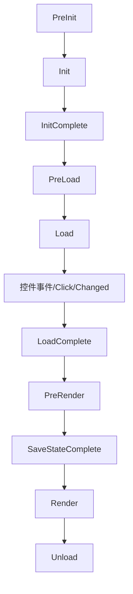

# Web 应用开发全解析：从核心概念到 ASP.NET Core 实战

> [!abstract] 什么是 Web 应用开发？
> 
> Web 应用开发是构建通过浏览器访问、基于 HTTP/HTTPS 协议运行的软件系统的全过程。它不仅是“写代码”，而是一个从**需求分析**到**上线运维**的完整工程。

---

## 一、 核心目标与应用场景

Web 应用的核心是**解决业务问题**，且具备“无需安装、跨平台、数据云端存储”的特性。

|**类别**|**典型场景**|
|---|---|
|**电商类**|用户购物、支付、商家管理商品|
|**管理类 (BMS)**|企业考勤、财务报表、数据统计|
|**社交类**|动态发布、好友互动、实时聊天|
|**工具类**|在线文档（如 Notion）、图片编辑器|

---

## 二、 Web 应用三层架构 (MVC/前后端分离)

这是 Web 开发的灵魂，理解了这三层，就理解了数据的流动。

### 1. 前端层 (The Frontend) - “面子”

- **作用**：负责用户交互、展示数据、接收操作。
    
- **核心技术**：`HTML` (结构)、`CSS` (美化)、`JavaScript` (逻辑)。
    
- **现代框架**：Vue.js, React, Angular。
    

### 2. 后端层 (The Backend) - “大脑”

- **作用**：处理业务逻辑、身份验证、操作数据库、提供数据接口。
    
- **核心工具**：ASP.NET Core (C#)、Spring Boot (Java)、Django (Python)。
    
- **职责**：路由解析、API 开发、安全性控制。
    

### 3. 数据层 (The Database) - “仓库”

- **作用**：持久化存储所有业务数据。
    
- **核心工具**：
    
    - **关系型**：SQL Server (与 .NET 最搭)、MySQL、PostgreSQL。
        
    - **非关系型**：Redis (缓存)、MongoDB (文档)。
        

---

## 三、 标准开发流程 (SDLC)

从 0 到 1 的六个必经阶段：

1. **需求分析**：明确“借书、还书、逾期罚款”等功能逻辑。
    
2. **架构设计**：技术选型 (ASP.NET Core + Vue)、数据库表结构设计。
    
3. **开发实现**：前端编写 UI，后端编写 API 和业务代码。
    
4. **测试环节**：单元测试、集成测试、压力测试。
    
5. **部署上线**：配置 IIS/Nginx 服务器，解析域名。
    
6. **运维迭代**：监控日志、修复 Bug、功能升级。
    

---

## 四、 代码实战：以“用户登录”为例

这个例子展示了 **前端请求 -> 后端处理 -> 数据返回** 的经典闭环。

### 1. 前端实现 (HTML + JS)


```html
<div id="login-box">
    <input type="text" id="username" placeholder="用户名" />
    <input type="password" id="password" placeholder="密码" />
    <button onclick="login()">登录</button>
    <p id="msg"></p>
</div>

<script>
    async function login() {
        const payload = { 
            username: id("username").value, 
            password: id("password").value 
        };
        // 1. 发送请求到后端 API
        const response = await fetch('/api/Login', {
            method: 'POST',
            headers: { 'Content-Type': 'application/json' },
            body: JSON.stringify(payload)
        });
        const result = await response.json();
        // 2. 将结果反馈给用户
        document.getElementById('msg').innerText = result.message;
    }
</script>
```

### 2. 后端实现 (ASP.NET Core)


```c#
[ApiController]
[Route("api/[controller]")]
public class LoginController : ControllerBase
{
    // 模拟数据库
    private readonly Dictionary<string, string> _db = new() { { "admin", "123456" } };

    [HttpPost]
    public IActionResult Post([FromBody] LoginRequest req)
    {
        // 1. 业务逻辑判断
        if (string.IsNullOrEmpty(req.Username)) 
            return Ok(new { code = 0, message = "账号不能为空" });

        // 2. 数据库匹配
        if (_db.ContainsKey(req.Username) && _db[req.Username] == req.Password)
            return Ok(new { code = 1, message = "🎉 登录成功！" });
            
        return Ok(new { code = 0, message = "❌ 账号或密码错误" });
    }
}

public class LoginRequest { public string Username { get; set; } public string Password { get; set; } }
```

---

## 五、 开发模式对比

根据项目需求选择不同的“玩法”：

|**模式**|**描述**|**适用场景**|
|---|---|---|
|**SSR (服务端渲染)**|服务器直接生成 HTML 发给浏览器|SEO 要求高、功能简单的网站|
|**前后端分离 (主流)**|后端只出 API (JSON)，前端渲染页面|复杂交互、移动端/PC端通用后端|
|**微服务**|将大系统拆成多个独立小服务|超大型企业级应用|

---

> [!tip] 总结
> 
> 把 Web 开发想象成开餐馆：**前端**是装修精美的餐厅前台，**后端 (ASP.NET)** 是忙碌工作的厨房逻辑，**数据库**是存放食材的冷库。三者高效协作，才能给用户（食客）提供完美的体验。

---
---


# 关于ASP.NET


简单来说，**ASP.NET** 是由微软开发的一个开源、跨平台的服务器端 Web 应用框架。它不是一种编程语言，而是一个可以让开发者使用 C# 或 F# 等语言来构建动态网页、应用和服务的工作平台。

你可以把它想象成一个功能齐全的“工具箱”，里面备好了处理安全、数据库连接、API 接口和网页渲染的所有零件。

---

## ASP.NET 的核心知识体系

要掌握 ASP.NET，通常需要围绕以下几个核心维度展开：

### 1. 运行环境与版本

- **ASP.NET Core (主流):** 最新的、跨平台的版本。可以在 Windows、macOS 和 Linux 上运行，性能极高，是目前学习的首选。
    
- **ASP.NET Framework (传统):** 早期的版本，仅限 Windows。虽然很多老项目在使用，但新技术已转向 Core。
    
- **.NET Runtime:** 支撑程序运行的底层环境。
    

### 2. 开发语言

ASP.NET 的灵魂是 **C#**。你需要掌握：

- **面向对象编程 (OOP):** 类、接口、继承。
    
- **LINQ:** 像写 SQL 一样在代码里查询数据。
    
- **异步编程 (Async/Await):** 提高服务器在高并发下的响应能力。
    

### 3. Web 开发模式

- **MVC (Model-View-Controller):** 最经典的模式。将数据（模型）、界面（视图）和业务逻辑（控制器）分开，便于维护。
    
- **Web API:** 专门用来写后端接口，只返回数据（通常是 JSON），供手机 App 或前端框架（如 Vue/React）调用。
    
- **Razor Pages:** 一种更简单、以页面为中心的开发模式，适合小型应用。
    
- **Blazor:** 微软的黑科技，允许你用 C# 代替 JavaScript 来写前端交互。
    

### 4. 数据访问 (ORM)

- **Entity Framework Core (EF Core):** 它是 C# 与数据库之间的桥梁。你不需要写复杂的 SQL 语句，直接操作 C# 对象即可实现对数据库的增删改查。
    

### 5. 前端技术栈

虽然 ASP.NET 是后端框架，但你仍需了解：

- **HTML/CSS/JavaScript:** 网页的基础。
    
- **Razor 语法:** 在 HTML 中嵌入 C# 代码的特殊语法（例如 `@Model.Name`）。
    

### 6. 核心中间件与机制

- **依赖注入 (Dependency Injection):** ASP.NET Core 的核心设计思想，让代码更松耦合。
    
- **中间件 (Middleware):** 处理请求的管道，比如身份验证、日志记录、错误处理等。
    
- **身份认证与授权 (Identity):** 解决用户注册、登录、权限控制的现成方案。
    


---
---

# HTTP和HTTPS

简单来说，**HTTPS 就是穿了防弹衣（加密）的 HTTP**。
## 🔒 HTTP vs HTTPS：核心差异
| 特性 | HTTP | HTTPS |
|---|---|---|
| **全称** | 超文本传输协议 | 安全超文本传输协议 |
| **安全性** | **明文传输**（裸奔），容易被窃听或篡改 | **加密传输**，数据经过身份验证和加密 |
| **端口** | 80 | 443 |
| **资源消耗** | 较低 | 略高（因为需要加解密计算） |
| **证书** | 不需要 | 需要向 CA 机构申请 **SSL/TLS 证书** |
## 🛡️ HTTPS 的“三大保镖”
HTTPS 并不是一个新的协议，而是 **HTTP + SSL/TLS** 层。它解决了 HTTP 的三个致命缺陷：
 1. **机密性 (Encryption)**：
   * 即使黑客在 WiFi 路由器或路由器节点截获了数据，看到的也是乱码。
 2. **完整性 (Integrity)**：
   * 防止数据在传输过程中被中间人（如运营商广告）偷偷修改。
 3. **身份认证 (Authentication)**：
   * 通过数字证书证明你访问的确实是“某官网”，而不是钓鱼网站。
## 🤝 握手过程：它们是如何“对暗号”的？
当你的浏览器访问一个 HTTPS 网站时，会发生著名的 **TLS 握手**：
 1. **客户端说**：“你好，我想加密通话，这是我支持的加密方式。”
 2. **服务器说**：“你好，这是我的 **数字证书（包含公钥）**，请检查。”
 3. **客户端检查**：确认证书合法后，生成一个随机的“会话密钥”，用服务器的公钥锁住，发给服务器。
 4. **服务器解锁**：用自己的私钥解开包裹，拿到会话密钥。
 5. **开始通话**：从此以后，双方都用这个只有彼此知道的“会话密钥”来加密所有网页内容。


---
---

# HTML

## 1. HTML / HTML5 / XHTML (前端结构的三剑客)

它们本质上是“一家人”，代表了网页标准的进化史。

### **HTML (HyperText Markup Language)**

- **定义：** 超文本标记语言，是网页的骨架。
    
- **历史：** 早期的 HTML 语法比较松散（比如忘记写关闭标签 `</div>` 浏览器也能运行），导致不同浏览器兼容性差。
    

### **XHTML (Extensible HTML)**

- **定义：** 严格版的 HTML。
    
- **特点：** 它要求代码必须符合 XML 的规范。
    
    - 标签必须小写。
        
    - 标签必须闭合（如 `<br />`）。
        
    - 属性必须加引号。
        
- **现状：** 因为太死板、开发效率低，现在基本被 HTML5 取代了。
    

### **HTML5 (当代标准)**

- **定义：** 目前最主流的版本。它不仅仅是标记语言，更是一个技术集合。
    
- **核心升级：**
    
    - **语义化标签：** 引入了 `<header>`, `<footer>`, `<article>`，让搜索引擎更容易读懂网页。
        
    - **多媒体：** 原生支持 `<video>` 和 `<audio>`，不再需要 Flash 插件。
        
    - **强大功能：** 引入了本地存储 (LocalStorage)、画布 (Canvas) 绘图、地理位置 API 等。
        

---

## 2. SSH (后端核心：安全外壳协议)

作为 Java 后端开发者，这是你每天都要打交道的工具。

- 定义： Secure Shell，一种加密的网络传输协议。
    
- 用途： 1. **远程管理服务器：** 你在 Windows 上用终端连接 Linux 服务器（如阿里云、腾讯云）时，走的就是 SSH 协议（默认端口 22）。
    
    2. **安全传输：** 比如通过 SCP 或 SFTP 在服务器间传文件。
    
    3. **Git 操作：** 你在推送代码到 GitHub 或 GitLab 时，通常会配置 SSH Key 免密登录。
    

> **⚠️ 注意：不要搞混两个“SSH”**
> 
> 在 Java 圈子里，老一辈程序员常说的 **"SSH 框架"** 指的是 **Struts2 + Spring + Hibernate**。但在现代开发中，这个组合已经**过时**了，被 **SSM (Spring + SpringMVC + MyBatis)** 取代。现在的面试中，SSH 更多指的就是安全协议。

---

## 3.简单的html页面
<!DOCTYPE html>
<html lang="zh-CN">
<head>
    <meta charset="UTF-8">
    <title>我的成绩页面</title>
    <style>
        table {
            border-collapse: collapse;
            width: 80%;
            margin: 20px auto;
            text-align: center;
        }
        th, td {
            border: 1px solid black;
            padding: 10px;
        }
        caption {
            font-weight: bold;
            font-size: 1.2em;
            margin-bottom: 10px;
        }
    </style>
</head>
<body>

    <table>
        <caption>001 张华</caption>
        
        <thead>
            <tr>
                <th>大学英语</th>
                <th>高等数学</th>
                <th>数据结构</th>
                <th>ASP.NET网络编程</th>
            </tr>
        </thead>
        <tbody>
            <tr>
                <td>85</td>
                <td>89</td>
                <td style="color: red; font-weight: bold;">55</td>
                <td>90</td>
            </tr>
        </tbody>
    </table>

</body>
</html>

## 4.html基本语法

### 1. 基础骨架 (Document Structure)

每个网页都**必须**具备的基本结构：

- `<!DOCTYPE html>`：声明文档类型。
    
- `<html>`：网页根元素。
    
- `<head>`：存放元数据（标题、字符集、CSS 链接）。
    
- `<title>`：网页在浏览器标签栏显示的标题。
    
- `<body>`：网页可见的所有内容。
    

---

### 2. 文本格式 (Text Formatting)

用于处理网页上的文字排版：

- `<h1>` 到 `<h6>`：六级标题（`<h1>` 最大，`<h6>` 最小）。
    
- `<p>`：段落。
    
- `<br>`：强制换行（单标签）。
    
- `<hr>`：水平分隔线（单标签）。
    
- `<strong>` 或 `<b>`：**加粗文本**。
    
- `<em>` 或 `<i>`：_斜体文本_。
    
- `<span>`：用于包裹行内的一小段文字，方便单独设置样式。
    

---

### 3. 列表 (Lists)

展示项目清单时最常用：

- `<ul>`：无序列表（前面带圆点）。
    
- `<ol>`：有序列表（前面带数字 1, 2, 3）。
    
- `<li>`：列表中的每一项（配合 `<ul>` 或 `<ol>` 使用）。
    

---

### 4. 链接与多媒体 (Links & Media)

让网页“动”起来的核心：

- `<a href="链接地址">`：超链接。
    
- ``：插入图片。
    
- `<audio>` / `<video>`：插入音频或视频。
    
- `<iframe>`：在当前页面嵌入另一个网页。
    

---

### 5. 表单与交互 (Forms & Input)

用于收集用户信息：

- `<form>`：表单容器。
    
- `<input type="text">`：单行文本输入框。
    
- `<input type="password">`：密码输入框（自动打码）。
    
- `<input type="checkbox">`：复选框。
    
- `<input type="radio">`：单选框。
    
- `<textarea>`：多行文本框。
    
- `<button>`：按钮。
    
- `<select>` 与 `<option>`：下拉选择框。
    

---

### 6. 表格 (Tables)

展示数据（就是你刚才练习的内容）：

- `<table>`：表格外框。
    
- `<tr>`：行 (Row)。
    
- `<th>`：表头单元格 (Header，文字加粗居中)。
    
- `<td>`：普通单元格 (Data)。
    
- `<caption>`：表格标题。
    

---

### 7. 布局容器 (Layout Containers)

网页排版的“隐形盒子”：

- `<div>`：**最常用的块级容器**，用于划分网页的不同区域。
    
- `<header>` / `<footer>`：页眉 / 页脚（语义化标签）。
    
- `<nav>`：导航栏。
    
- `<section>` / `<article>`：区块 / 文章正文。
    

---

### 💡 小白速记 Tips：

1. **单标签：** 绝大多数标签成对出现，但像 ``、`<br>`、`<hr>`、`<input>` 是没有结束标签的。
    
2. **注释：** 代码里写给自己看的笔记用 ``。
    
3. **属性：** 属性名和属性值之间用 `=`，值必须加双引号 `""`。

---
---


# ASP.NET页面事件


## ASP.NET 页面生命周期事件

> [!abstract] 简介
> ASP.NET 页面在服务器上运行并呈现为 HTML 的过程中，会经历一系列有序的事件。理解这些事件对于处理控件初始化、状态维护（ViewState）和业务逻辑触发至关重要。
> 
### 1. 核心事件流程图


### 2. 关键生命周期阶段详解
#### 🟢 初始化阶段 (Initialization)
 * **PreInit**:
   * 设置页面主题（Theme）。
   * 动态创建或替换主页（Master Page）。
 * **Init**:
   * 递归初始化所有子控件。
   * **注意**：此时 ViewState 尚未还原。
 * **InitComplete**:
   * 所有控件初始化完成，开始开启视图状态（ViewState）追踪。
#### 🔵 加载阶段 (Loading)
 * **PreLoad**: 处理回发（Postback）数据之前的最后一步。
 * **Load (最常用)**:
   * 此时页面已恢复 ViewState。
   * 使用 IsPostBack 区分首次加载与后续刷新。
> [!example] 典型用法
> ```csharp
> protected void Page_Load(object sender, EventArgs e)
> {
>     if (!IsPostBack)
>     {
>         // 首次进入页面执行：如绑定数据库数据
>     }
> }
> 
> ```
> 
#### 🟠 控件事件处理 (Postback Events)
 * **具体事件触发**: 如按钮点击 Button_Click 或下拉列表改变 SelectedIndexChanged。
 * 这些事件仅在 **回发（Postback）** 时发生，且在 Page_Load 之后执行。
#### 🟡 呈现前处理 (Pre-rendering)
 * **PreRender**:
   * 输出 HTML 前的最后修改机会。
   * 常用于最后调整控件的 Visible 或 Style 属性。
 * **SaveStateComplete**: ViewState 已完全序列化并保存到页面中。
#### 🔴 卸载阶段 (Unloading)
 * **Unload**:
   * 页面处理完毕，资源回收。
   * **禁忌**：不可在此阶段修改控件属性（会引发异常），仅用于关闭数据库连接或文件流。
### 3. 常见开发避坑指南
| 比较项 | Init 事件 | Load 事件 |
|---|---|---|
| **ViewState** | 不可用 | **可用** |
| **控件值** | 初始值 | 用户输入的值 |
| **动态控件** | 建议在此处创建（保证 ID 一致） | 一般用于处理逻辑 |
> [!warning] 重要提示
> 所有的页面事件逻辑在完成后，服务器都会将页面对象**销毁**。这意味着类级别的成员变量无法跨页面刷新保留，除非使用 Session、Cookie 或 ViewState。
> 
### 4. 快速查询：完整触发顺序表
 1. OnPreInit
 2. OnInit
 3. OnInitComplete
 4. OnPreLoad
 5. **OnLoad**
 6. **控件事件** (如 Click)
 7. OnLoadComplete
 8. **OnPreRender**
 9. OnPreRenderComplete
 10. OnSaveStateComplete
 11. Unload


---
---


在 ASP.NET Web Forms 开发中，**服务器控件（Server Controls）** 是构建交互式网页的核心组件。它们在服务器端运行，并由 ASP.NET 引擎自动渲染为 HTML 代码。
## 服务器控件详解
> [!tip] 核心特征
> 服务器控件必须包含 runat="server" 属性。它们的对象模型在服务器端运行，能够保留状态（ViewState），并触发服务器端事件。
> 
### 1. 控件分类
| 类别 | 代表控件 | 说明 |
|---|---|---|
| **标准控件** | asp:Button, asp:TextBox, asp:Label | 对应 HTML 基本元素，但具有完整的服务器端事件支持。 |
| **容器控件** | asp:Panel, asp:PlaceHolder | 用于组织页面布局，或在运行时动态添加子控件。 |
| **数据控件** | asp:GridView, asp:Repeater, asp:DataList | 强大的数据绑定组件，用于显示数据库内容（支持分页、排序）。 |
| **验证控件** | asp:RequiredFieldValidator, asp:CompareValidator | 在前端和后端双重验证用户输入，确保数据安全。 |
| **导航控件** | asp:Menu, asp:TreeView, asp:SiteMapPath | 自动生成菜单、面包屑导航。 |
### 2. HTML 控件 vs 服务器控件
| 特性       | HTML 控件 (客户端)          | 服务器控件 (Server Controls)                  |
| -------- | ---------------------- | ---------------------------------------- |
| **声明方式** | \<input type="text">   | <asp:TextBox ID="txt1" runat="server" /> |
| **生命周期** | 仅在浏览器运行，无服务器交互         | 参与页面生命周期（Init, Load, Unload 等）           |
| **状态保持** | 页面刷新后数据丢失（除非手动处理）      | 自动通过 **ViewState** 保持输入内容                |
| **编程模型** | 通常通过 JavaScript/DOM 操作 | 在 C# 后置代码中直接通过 ID 访问                     |
### 3. 核心机制：ViewState (视图状态)
这是服务器控件最独特的机制。为了解决 HTTP 协议无状态的问题，ASP.NET 将控件的状态（如文本框里的文字、选中的复选框）加密后存在一个名为 VIEWSTATE 的隐藏域中。
> [!warning] 性能注意
> 如果页面上有大型数据控件（如 GridView 绑定了万条数据），ViewState 会变得非常庞大，导致页面加载变慢。可以通过 EnableViewState="false" 手动关闭不必要的控件状态保持。
> 
### 4. 常用代码示例 
#### 数据绑定示例
在后置代码（.aspx.cs）中，你可以像操作对象一样操作这些控件：
```csharp
// 前端声明：<asp:Label ID="lblMsg" runat="server" />
// 前端声明：<asp:DropDownList ID="ddlCategories" runat="server" />

protected void Page_Load(object sender, EventArgs e)
{
    if (!IsPostBack)
    {
        // 模拟数据源
        List<string> categories = new List<string> { "后端", "前端", "AI" };
        
        // 绑定数据到服务器控件
        ddlCategories.DataSource = categories;
        ddlCategories.DataBind();
        
        lblMsg.Text = "数据绑定成功！";
    }
}

```
#### 验证控件用法
```html
<asp:TextBox ID="txtAge" runat="server" />
<asp:RangeValidator 
    ID="rvAge" 
    runat="server" 
    ControlToValidate="txtAge" 
    MinimumValue="1" 
    MaximumValue="120" 
    Type="Integer" 
    ErrorMessage="请输入有效的年龄 (1-120)" />

```
### 5. 开发建议
 1. **ID 命名规范**：建议使用前缀区分控件类型，如 btnSubmit (Button), txtUserName (TextBox), gvOrders (GridView)。
 2. **AutoPostBack 属性**：有些控件（如 DropDownList）默认改变选项不会刷新页面。如果需要改变后立即执行服务器逻辑，需设置 AutoPostBack="true"。
 3. **不要滥用**：简单的静态展示使用普通 HTML 标签即可，过度使用服务器控件会增加服务器负担。


## 文本类型控件详解
> [!abstract] 概要
> 文本类型控件是 Web Forms 中最基础的交互组件，主要用于展示静态文本或接收用户输入。它们在服务器端都有对应的类模型，支持丰富的属性配置。
> 
### 1. Label 控件 (标签)
用于在页面上显示不希望被用户直接修改的文本。
 * **渲染结果**：通常渲染为 HTML 的 \<span> 标签。
 * **核心属性**：
   * Text: 获取或设置显示的文本内容。
   * AssociatedControlID: 关联其他输入控件，渲染时会变成 \<label for="...">。
```html
<asp:Label ID="lblStatus" runat="server" Text="当前状态：正常" />

```
### 2. Literal 控件 (静态文本)
与 Label 类似，但它更“纯粹”。
 * **渲染结果**：直接输出内容，不产生任何额外的 HTML 标签。
 * **适用场景**：动态向页面注入代码片段、脚本或纯文字，不破坏 CSS 布局。
 * **核心属性**：
   * Mode: 支持 Transform、PassThrough 或 Encode（自动进行 HTML 编码防止 XSS）。
### 3. TextBox 控件 (文本框)
最核心的输入控件。
 * **渲染结果**：根据 TextMode 不同，渲染为 input 或 textarea。
 * **核心属性**：
   * TextMode: 支持 SingleLine、Password、MultiLine 以及 HTML5 类型（Email/Date等）。
   * AutoPostBack: 设置为 true 时，内容改变并失去焦点会立即触发服务器端事件。
   * 
### 4. 关键区别对比

|**特性**|**Label**|**Literal**|**TextBox**|
|---|---|---|---|
|**HTML 渲染**|`<span>`|无外层标签|`input` 或 `textarea`|
|**支持样式**|是|否|是|
|**用户输入**|否|否|是|

### 5. 常用后端逻辑示例
```csharp
protected void btnSubmit_Click(object sender, EventArgs e)
{
    // 获取用户输入
    string userName = txtUserName.Text.Trim();
    
    // Label 修改显示
    lblMessage.Text = "信息已接收";
    
    // Literal 注入 HTML
    litOutput.Text = "<b>处理完成</b>";
}
```

### 6. 开发避坑：只读属性
若在前端通过 JavaScript 修改了 ReadOnly="true" 的 TextBox 的值，回发后 C# 可能读取不到新值。建议使用 HiddenField 配合或通过 Request.Form 集合手动获取。


---
---


## 按钮类型控件详解
> [!abstract] 概要
> 按钮控件主要用于向服务器提交表单数据或执行特定的后端方法。
> 
在 ASP.NET Web Forms 中，按钮类型控件是触发服务器端逻辑的核心。它们通过回发（Postback）机制将用户操作传回服务器。
> 
### 1. Button 控件 (标准按钮)
最常用的按钮，渲染为标准的 HTML 提交按钮。
 * **渲染结果**：input type="submit"。
 * **主要事件**：Click（最常用）。
 * **核心属性**：
   * Text: 按钮上显示的文字。
   * OnClientClick: 在触发服务器事件前执行的客户端 JavaScript（常用于删除确认）。
```html
<asp:Button ID="btnSave" runat="server" Text="保存" OnClick="btnSave_Click" />

```
### 2. LinkButton 控件 (链接按钮)
外观像超链接，但行为像按钮。
 * **渲染结果**：a 标签，通过 JavaScript 的 __doPostBack 触发提交。
 * **适用场景**：希望在 UI 上保持简洁链接样式，但需要执行服务器逻辑时。
 * **注意**：如果浏览器禁用 JavaScript，此控件将失效。
### 3. ImageButton 控件 (图片按钮)
使用图片作为点击载体的按钮。
 * **渲染结果**：input type="image"。
 * **特殊能力**：在点击事件中，可以获取到用户点击图片的精确坐标（x, y）。
### 4. 关键属性：CausesValidation
这是一个非常重要的性能和逻辑属性。
 * **作用**：指定点击按钮时是否触发页面上的验证控件（如 RequiredFieldValidator）。
 * **场景**：对于“取消”或“返回”按钮，通常应设置 CausesValidation="false"，否则如果页面输入不合法，按钮将无法提交。
### 5. 按钮控件对比
| 特性 | Button | LinkButton | ImageButton |
|---|---|---|---|
| **外观** | 标准按钮 | 超链接 | 图片 |
| **HTML 标签** | input | a | input |
| **是否依赖 JS** | 否 | 是 | 否 |
| **支持坐标获取** | 否 | 否 | 是 |
### 6. 后端逻辑处理示例
```csharp
protected void btnSubmit_Click(object sender, EventArgs e)
{
    // 逻辑处理
    Response.Write("按钮已被点击");
}

```
### 7. 补充：CommandName 与 CommandArgument
当你在 GridView 或 Repeater 等列表控件中使用按钮时，这两个属性非常有用。它们允许你通过同一个事件处理器区分不同的按钮操作（如“删除”或“编辑”），并传递行 ID 等参数。

---
---


在 ASP.NET Web Forms 中，连接类型控件主要用于页面间的跳转或定位。由于它们涉及到 URL 和 HTML 标签的渲染
## 连接类型控件详解
> [!abstract] 概要
> 连接类型控件用于实现网页之间的导航。根据是否需要服务器端参与，分为 HyperLink 和普通的 HTML 链接。
> 
### 1. HyperLink 控件 (超链接)
这是最常用的导航控件。它在服务器端运行，但默认**不触发回发**（Postback）。
 * **渲染结果**：渲染为 HTML 的 a 标签。
 * **核心属性**：
   * MapsUrl: 目标页面的路径（支持绝对路径和相对路径）。
   * Text: 链接显示的文字内容。
   * ImageUrl: 如果设置此属性，链接将显示为图片而非文字。
   * Target: 指定打开链接的窗口（如 _blank 表示新窗口）。
```html
<asp:HyperLink ID="hlHome" runat="server" NavigateUrl="~/Default.aspx" Text="回到首页" />

```
### 2. HyperLink 与 LinkButton 的区别

这是开发中最容易混淆的点：

| 特性 | HyperLink | LinkButton |
|---|---|---|
| **主要用途** | 页面跳转 (Navigation) | 触发服务器事件 (Postback) |
| **外观** | 超链接 | 超链接 |
| **机制** | 客户端直接跳转 URL | 通过 JS 提交表单到服务器 |
| **SEO 友好** | 是 (搜索引擎可爬取链接) | 否 (搜索机器人无法执行 JS) |
### 3. 地址解析机制 (~)
在 MapsUrl 中经常看到 ~ 符号：
 * **符号含义**：代表 Web 应用程序的根目录。
 * **优势**：无论当前页面在哪个文件夹下，使用 ~/ 都能准确指向根目录的文件，避免了因目录深度改变导致的路径失效。
### 4. 动态设置连接 (C#)
虽然 HyperLink 很少需要回发，但你可以在 Page_Load 中动态修改它的指向：
```csharp
protected void Page_Load(object sender, EventArgs e)
{
    if (!IsPostBack)
    {
        // 根据用户权限或逻辑动态修改跳转目标
        hlProfile.NavigateUrl = "UserProfile.aspx?ID=" + CurrentUserID;
        hlProfile.Text = "查看个人主页";
    }
}

```
### 5. 开发建议
 * 如果只是单纯的跳转，请优先使用 **HyperLink**，因为它的性能更高（无需服务器往返处理）。
 * 如果跳转前需要执行逻辑判断（如权限检查或写入数据库），则应使用 **Button** 或 **LinkButton**，并在后端使用 Response.Redirect()。

---
---


## 选择型控件全量指南
> [!abstract] 核心逻辑
> ASP.NET 中的选择控件分为**单体控件**（处理逻辑状态）和**列表控件**（处理数据集合）。它们都依赖于 ViewState 来维持跨页面刷新的状态。
> 
### 1. CheckBox (独立复选框)
**功能介绍**：
用于表示一个布尔状态（开/关）。在 HTML 中渲染为 input type="checkbox"。
**核心属性**：
 * Checked: 获取或设置选中状态（True/False）。
 * Text: 控件显示的描述文字。
 * AutoPostBack: 为 true 时，点击后立即触发 CheckedChanged 事件。
**代码示例**：
```html
<asp:CheckBox ID="chkRememberMe" runat="server" Text="记住我" />

```
```csharp
// 后端读取
if (chkRememberMe.Checked) 
{
    // 执行保存 Cookie 逻辑
}

```
### 2. CheckBoxList (复选框列表)
**功能介绍**：
用于管理一组可多选的项。它是 ListItem 的容器，渲染时通常嵌套在 table 或 span 中。
**核心功能点**：
 * **数据绑定**：通过 DataSource 批量生成选项。
 * **布局控制**：使用 RepeatDirection（水平/垂直）和 RepeatColumns（列数）。
 * **多选处理**：不支持 SelectedValue，必须遍历 Items 集合。
**代码示例**：
```html
<asp:CheckBoxList ID="cblSkills" runat="server" RepeatColumns="2" RepeatLayout="Flow">
    <asp:ListItem Value="C">C#</asp:ListItem>
    <asp:ListItem Value="J">Java</asp:ListItem>
    <asp:ListItem Value="P">Python</asp:ListItem>
</asp:CheckBoxList>

```
```csharp
// 获取所有选中的值
List<string> selectedList = new List<string>();
foreach (ListItem item in cblSkills.Items)
{
    if (item.Selected)
    {
        selectedList.Add(item.Value);
    }
}

```
### 3. RadioButton (独立单选按钮)
**功能介绍**：
用于在手动配置的一组选项中选其一。渲染为 input type="radio"。
**核心功能点**：
 * **分组逻辑**：必须设置相同的 GroupName 才能实现互斥（即点击 A 自动取消 B）。
 * **局限性**：在列表容器（如 GridView）中，其 name 属性会被 ASP.NET 自动修改，导致原生分组失效。
**代码示例**：
```html
<asp:RadioButton ID="rbMale" runat="server" GroupName="GenderGroup" Text="男" />
<asp:RadioButton ID="rbFemale" runat="server" GroupName="GenderGroup" Text="女" />

```
### 4. RadioButtonList (单选按钮列表)
**功能介绍**：
最常用的单选方案。它是一个整体控件，内部项天然互斥，无需设置 GroupName。
**核心功能点**：
 * **单选读取**：直接使用 SelectedValue 获取唯一选中的项。
 * **默认选中**：在绑定后或声明时，可设置某一项的 Selected="true"。
**代码示例**：
```html
<asp:RadioButtonList ID="rblDifficulty" runat="server">
    <asp:ListItem Value="1" Selected="True">简单</asp:ListItem>
    <asp:ListItem Value="2">中等</asp:ListItem>
    <asp:ListItem Value="3">困难</asp:ListItem>
</asp:RadioButtonList>

```
```csharp
// 直接获取结果
string level = rblDifficulty.SelectedValue;

```
### 5. 进阶：统一对比与开发规范
| 维度 | CheckBox | CheckBoxList | RadioButton | RadioButtonList |
|---|---|---|---|---|
| **互斥性** | 无 | 无 | 靠 GroupName 互斥 | 天然互斥 |
| **获取值** | Checked | 遍历 Items | Checked | SelectedValue |
| **HTML 结构** | 单个 input | table 或 span 集合 | 单个 input | table 或 span 集合 |
| **推荐场景** | 记住密码、隐私协议 | 兴趣爱好、权限配置 | 简单的双选 | 问卷单选、状态切换 |
### 6. 开发者避坑指南（必看）
 * **!IsPostBack 陷阱**：
   在 Page_Load 中绑定数据源时，务必包裹在 if (!IsPostBack) 中。否则回发时数据重绑，会导致用户之前的勾选状态被清空。
 * **SelectedIndexChanged 事件**：
   对于列表类控件，如果希望点击即触发后端逻辑，除了写事件方法外，必须设置 AutoPostBack="true"。
 * **验证问题**：
   RadioButtonList 可以被 RequiredFieldValidator 验证是否选择；但 CheckBoxList 必须使用 CustomValidator 编写 C# 逻辑手动检查 Any(li => li.Selected)。
 * **样式控制**：
   若想让列表控件生成的 HTML 更简洁，请设置 RepeatLayout="Flow"，这会去除默认生成的表格标签。

---
---


## 列表选择控件：DropDownList 与 ListBox
> [!abstract] 核心逻辑
> 这两类控件都继承自 ListControl 基类，核心操作对象都是 ListItem。它们通过索引（Index）和值（Value）来管理用户的选择状态。
> 
### 1. DropDownList (下拉列表)
**功能介绍**：
最常用的表单控件。渲染为单选的 select 标签。它在平时只占据一行空间，点击后才弹出选项列表。
**核心功能点**：
 * **单选约束**：天生只能选择一项，适合节省页面空间。
 * **默认选中**：如果开发者不指定，它会自动选中第一个 ListItem。
 * **常用属性**：
   * SelectedIndex: 获取或设置选中项的索引（从 0 开始）。
   * SelectedValue: 获取或设置选中项的 Value 值。
**代码示例**：
```html
<asp:DropDownList ID="ddlCity" runat="server" AutoPostBack="true" OnSelectedIndexChanged="ddlCity_SelectedIndexChanged">
    <asp:ListItem Value="BJ">北京</asp:ListItem>
    <asp:ListItem Value="SH">上海</asp:ListItem>
    <asp:ListItem Value="GZ">广州</asp:ListItem>
</asp:DropDownList>

```
### 2. ListBox (列表框)
**功能介绍**：
渲染为具有 size 属性的 select 标签。它在页面上呈现为一个固定的矩形区域，展示多个选项。
**核心功能点**：
 * **多选模式**：通过设置 SelectionMode="Multiple" 支持 Ctrl/Shift 多选。
 * **可见高度**：通过 Rows 属性控制显示的行数。
 * **操作集合**：常用于权限分配、标签筛选等需要批量操作的场景。
**代码示例**：
```html
<asp:ListBox ID="lbSkills" runat="server" SelectionMode="Multiple" Rows="6">
    <asp:ListItem Value="CS">C#</asp:ListItem>
    <asp:ListItem Value="JV">Java</asp:ListItem>
    <asp:ListItem Value="PY">Python</asp:ListItem>
</asp:ListBox>

```
### 3. 实战代码：数据绑定与结果提取
在实际开发中，这两类控件通常配合数据库使用。
**A. 动态绑定 (C#)**
```csharp
protected void Page_Load(object sender, EventArgs e)
{
    if (!IsPostBack) // 关键：防止回发时重复绑定导致状态丢失
    {
        BindData();
    }
}

private void BindData()
{
    var depts = GetDepartments(); // 模拟获取数据库数据
    ddlDept.DataSource = depts;
    ddlDept.DataTextField = "DeptName"; // 页面显示的名称
    ddlDept.DataValueField = "DeptID";   // 后台逻辑用的 ID
    ddlDept.DataBind();

    // 技巧：添加默认引导项
    ddlDept.Items.Insert(0, new ListItem("--请选择部门--", "0"));
}

```
**B. 获取多选结果 (ListBox 特有)**
```csharp
protected void btnSubmit_Click(object sender, EventArgs e)
{
    string selectedValues = "";
    // ListBox 开启多选后必须遍历 Items
    foreach (ListItem item in lbSkills.Items)
    {
        if (item.Selected)
        {
            selectedValues += item.Value + ",";
        }
    }
    Response.Write("已选： " + selectedValues.TrimEnd(','));
}

```
### 4. 核心差异对比
| 维度 | DropDownList | ListBox |
|---|---|---|
| **选择模式** | 仅限单选 | 可单选/多选 (SelectionMode) |
| **占据空间** | 极小 (一行) | 较大 (由 Rows 决定) |
| **交互方式** | 点击展开后选择 | 直接在列表内点击/拖选 |
| **空值状态** | 默认必选一项 (除非手动加空项) | 可以不选中任何项 |
### 5. 开发者避坑指南
 * **AutoPostBack**：
   如果你希望用户一改选项页面就立刻发生变化（如：联动下拉框），必须设置 AutoPostBack="true"。
 * **!IsPostBack 判断**：
   如果你的 SelectedValue 拿到的永远是第一项的值，通常是因为你在 Page_Load 里没有写 if (!IsPostBack)，导致每次刷新数据都被重置了。
 * **InitialValue 验证**：
   使用 RequiredFieldValidator 验证 DropDownList 时，如果第一项是“--请选择--”，请将验证控件的 InitialValue 设为该项的 Value 值。
 * **ListItem 深度操作**：
   可以通过 Items.FindByValue("BJ").Selected = true 在代码中动态控制哪一项被选中。

---
---

在 ASP.NET Web Forms 中，**Image 图像控件**主要用于在网页上动态或静态地显示图片。与 HTML 的  标签不同，它可以在服务器端通过代码动态更改图片路径、样式和可见性。
## Image 图像控件详解
> [!abstract] 概要
> Image 控件渲染为 HTML 的  标签。它不触发任何服务器端事件（如点击事件），仅用于展示。如果需要点击图片触发逻辑，应使用 **ImageButton**。
> 
### 1. 核心属性
| 属性 | 说明 |
|---|---|
| **ImageUrl** | **最核心属性**。图片的路径，支持相对路径、绝对路径和 ~/ 根目录语法。 |
| **AlternateText** | 当图片无法显示时显示的替代文本（SEO 和无障碍访问必备）。 |
| **ImageAlign** | 图片相对于周围文字的对齐方式（如 Left, Right, Top, Middle）。 |
| **DescriptionUrl** | 提供图片详细说明页面的 URL（辅助功能）。 |
| **GenerateEmptyAlternateText** | 布尔值，如果为 True，且未设置 AlternateText，则渲染为空字符串。 |
### 2. 声明与代码示例
#### 静态声明
在 .aspx 页面中直接指定路径：
```html
<asp:Image ID="imgLogo" runat="server" 
           ImageUrl="~/Images/logo.png" 
           AlternateText="公司Logo" 
           Width="200px" />

```
#### 动态修改 (C#)
在后台代码中根据业务逻辑切换图片：
```csharp
protected void Page_Load(object sender, EventArgs e)
{
    if (!IsPostBack)
    {
        // 根据用户性别显示不同头像
        if (UserGender == "Male")
        {
            imgAvatar.ImageUrl = "~/Images/male_avatar.jpg";
        }
        else
        {
            imgAvatar.ImageUrl = "~/Images/female_avatar.jpg";
        }
    }
}

```
### 3. Image 控件 vs ImageButton 控件
这是开发中最容易产生误区的地方：

| 特性 | Image 控件 | ImageButton 控件 |
|---|---|---|
| **主要功能** | 纯展示 (Display) | 触发提交 (Postback) |
| **HTML 渲染** |  | <input type="image"> |
| **服务器事件** | 无 | 有 (OnClick, OnCommand) |
| **坐标获取** | 不支持 | **支持** (可获取点击图片的 X, Y 坐标) |
### 4. 路径处理：相对路径与 ~ 符号
在设置 ImageUrl 时，建议始终使用 ~ 符号：
 * **~/**：表示 Web 应用程序的根目录。
 * **优点**：即使你的 .aspx 页面从根目录移动到了子文件夹中，~/Images/pic.jpg 依然能正确找到图片，避免了相对路径（如 ../）带来的失效风险。
### 5. 进阶：在数据绑定控件中使用
在 GridView 或 Repeater 中动态展示图片时，通常配合数据绑定表达式：
```html
<asp:GridView ID="gvProducts" runat="server">
    <Columns>
        <asp:TemplateField HeaderText="产品图片">
            <ItemTemplate>
                <asp:Image ID="imgProduct" runat="server" 
                           ImageUrl='<%# Eval("ProductPicUrl", "~/Thumbnails/{0}") %>' />
            </ItemTemplate>
        </asp:TemplateField>
    </Columns>
</asp:GridView>

```
### 6. 开发避坑指南
 1. **图片不显示**：
   * 检查路径是否正确。如果是动态生成的路径，注意反斜杠 \ 和正斜杠 / 的区别（Web 路径应使用 /）。
   * 检查权限。确保服务器上的文件夹允许 IIS 账号读取图片文件。
 2. **样式控制**：
   * 尽量使用 CssClass 来控制图片的边框、圆角等样式，而不是在服务器端设置每一个样式属性，这样更符合前后端分离原则。
 3. **空路径问题**：
   * 如果 ImageUrl 绑定了一个空值，浏览器可能会显示一个破损图标。建议在后台逻辑中进行非空判断，若为空则显示一张默认的“暂无图片”。


---
---

在 ASP.NET Web Forms 中，**Panel** 控件是一个非常实用的**容器控件**。它在页面上渲染为一个 \<div> 标签，主要用于将其他控件组合在一起，以便进行统一的显示控制、布局管理或外观设置。
## Panel 容器控件详解
> [!abstract] 概要
> Panel 控件允许你通过控制容器的属性，一次性改变其中所有子控件的状态（如可见性、启用状态）。它也是实现局部滚动和默认按钮触发的核心组件。
> 
### 1. 核心功能与属性
| 属性 | 说明 |
|---|---|
| **GroupingText** | 在 Panel 周围绘制边框并显示标题（渲染为 HTML 的 fieldset 和 legend）。 |
| **Visible** | 最常用的属性。设置为 false 时，整个 Panel 及其子控件都不会渲染到 HTML 中。 |
| **DefaultButton** | **非常实用**。指定当用户在 Panel 内按回车键时，触发哪个按钮的点击事件。 |
| **ScrollBars** | 控制滚动条的出现（None, Horizontal, Vertical, Both, Auto）。 |
| **HorizontalAlign** | 控制内部内容的水平对齐方式（Left, Center, Right, Justify）。 |
| **Wrap** | 布尔值，决定内容是否在容器边缘自动换行。 |
### 2. 典型使用场景
#### A. 批量控制显示/隐藏 (权限切换)
这是 Panel 最基础的用法。比如在用户登录后展示个人信息面板，未登录时展示登录面板。
```html
<asp:Panel ID="pnlLogin" runat="server">
    用户名：<asp:TextBox ID="txtUser" runat="server" />
    密码：<asp:TextBox ID="txtPwd" runat="server" TextMode="Password" />
    <asp:Button ID="btnLogin" runat="server" Text="登录" />
</asp:Panel>

<asp:Panel ID="pnlUserInfo" runat="server" Visible="false">
    欢迎您，<asp:Label ID="lblUser" runat="server" />
    <asp:LinkButton ID="btnExit" runat="server" Text="退出" />
</asp:Panel>

```
#### B. 设置默认提交按钮 (DefaultButton)
在一个复杂的页面中，用户在搜索框里按回车，你希望触发的是“搜索按钮”而不是“保存按钮”，这时就可以用 Panel 包裹搜索区域。
```html
<asp:Panel ID="pnlSearch" runat="server" DefaultButton="btnSearch">
    <asp:TextBox ID="txtKeywords" runat="server" />
    <asp:Button ID="btnSearch" runat="server" Text="搜索" OnClick="btnSearch_Click" />
</asp:Panel>

```
### 3. 实现局部滚动区域
如果页面空间有限，但需要展示大量内容（如日志或条款），可以设置 Height 和 ScrollBars。
```html
<asp:Panel ID="pnlLog" runat="server" Height="150px" Width="300px" ScrollBars="Vertical" BorderStyle="Solid" BorderWidth="1px">
    <asp:Label ID="lblLongText" runat="server" Text="这里有非常长的内容..." />
</asp:Panel>

```
### 4. 后端动态操作 (C#)
你可以通过代码动态向 Panel 中添加控件，这对于构建不确定数量的 UI 非常有用。
```csharp
protected void btnAdd_Click(object sender, EventArgs e)
{
    // 动态创建一个标签并添加到 Panel 容器中
    Label dynamicLabel = new Label();
    dynamicLabel.Text = "这是动态生成的标签 <br />";
    
    // 将控件添加到 Panel 的 Controls 集合中
    pnlContainer.Controls.Add(dynamicLabel);
}

```
### 5. Panel 与其他容器的对比
| 容器控件 | 渲染标签 | 特点 |
|---|---|---|
| **Panel** | div | 功能最全，支持滚动条、分组标题和默认按钮。 |
| **PlaceHolder** | **无标签** | 纯粹的占位符，不产生任何 HTML 标签，仅用于在代码中动态添加控件。 |
| **ContentPlaceHolder** | 无标签 | 专用于母版页（MasterPage）的区域定义。 |
### 6. 开发建议
 1. **布局解耦**：虽然 Panel 支持设置 BackImageUrl 等外观属性，但现代开发建议尽量通过 CssClass 配合外部 CSS 文件来管理样式，保持代码整洁。
 2. **ClientID 陷阱**：如果你在 JavaScript 中引用 Panel 里的子控件，注意它们的 ID 可能会被加上 Panel 的前缀。建议在子控件上设置 ClientIDMode="Static"（如果你使用的是 .NET 4.0 及以上版本）。
 3. **可见性注意**：Visible="false" 的 Panel 在浏览器源代码中是完全看不到的。如果你需要控件在页面上占据空间但只是隐藏（类似 CSS 的 visibility:hidden），应该通过 Style 属性来控制，而不是使用 Visible。

---
---

在 ASP.NET Web Forms 中，**FileUpload** 控件是处理文件上传的核心组件。它允许用户从本地计算机选择文件并将其发送到服务器。
## FileUpload 文件上传控件详解
> [!abstract] 概要
> FileUpload 控件在 HTML 中渲染为 \<input type="file">。由于安全限制，浏览器不允许脚本自动填写文件路径，必须由用户手动选择。
> 
### 1. 核心属性与方法
| 成员类型 | 名称 | 说明 |
|---|---|---|
| **属性** | HasFile | 布尔值。判断用户是否选择了文件且文件内容不为空。 |
| **属性** | FileName | 获取上传文件的名称（不含客户端路径）。 |
| **属性** | FileBytes | 将文件内容作为字节数组读取（适合直接存入数据库）。 |
| **属性** | PostedFile | 提供对上传文件的底层访问（如获取 ContentType 或 ContentLength）。 |
| **属性** | AllowMultiple | (.NET 4.5+) 是否允许用户一次选择多个文件。 |
| **方法** | SaveAs(path) | 将上传的文件保存到服务器指定的绝对物理路径。 |
### 2. 标准上传流程示例
上传文件通常涉及两个步骤：前端声明控件，后端点击按钮执行保存逻辑。
**前端代码 (.aspx)**
```html
<asp:FileUpload ID="fileUploadCustom" runat="server" />
<asp:Button ID="btnUpload" runat="server" Text="开始上传" OnClick="btnUpload_Click" />
<asp:Label ID="lblStatus" runat="server" />

```
**后端逻辑 (.aspx.cs)**
```csharp
protected void btnUpload_Click(object sender, EventArgs e)
{
    // 1. 判断是否有文件
    if (fileUploadCustom.HasFile)
    {
        try
        {
            // 2. 获取服务器物理路径（使用 Server.MapPath）
            string savePath = Server.MapPath("~/Uploads/");
            
            // 确保目录存在
            if (!System.IO.Directory.Exists(savePath))
            {
                System.IO.Directory.CreateDirectory(savePath);
            }

            // 3. 执行保存
            string fileName = fileUploadCustom.FileName;
            fileUploadCustom.SaveAs(savePath + fileName);

            lblStatus.Text = "文件上传成功：" + fileName;
        }
        catch (Exception ex)
        {
            lblStatus.Text = "错误：" + ex.Message;
        }
    }
    else
    {
        lblStatus.Text = "请先选择一个文件。";
    }
}

```
### 3. 文件上传的安全性限制
#### A. 文件大小限制
ASP.NET 默认限制上传大小为 **4MB**。如果上传大文件，会报错。
 * **修改方法**：在 Web.config 中调整 maxRequestLength（单位为 KB）。
```xml
<configuration>
  <system.web>
    <httpRuntime maxRequestLength="51200" />
  </system.web>
</configuration>

```
#### B. 文件类型过滤
为了防止上传木马（如 .exe 或 .asp），必须在后端检查后缀名。
```csharp
string extension = System.IO.Path.GetExtension(fileUploadCustom.FileName).ToLower();
string[] allowedExtensions = { ".jpg", ".png", ".gif" };
if (!allowedExtensions.Contains(extension))
{
    lblStatus.Text = "不支持的文件格式！";
    return;
}

```
### 4. 关键点：PostedFile 深度控制
通过 PostedFile 属性，你可以获取更多文件元数据：
 * **PostedFile.ContentLength**：获取文件字节数（用于限制大小）。
 * **PostedFile.ContentType**：获取文件的 MIME 类型（如 image/jpeg）。
### 5. 开发者避坑指南
 1. **Server.MapPath 的必要性**：
   SaveAs 方法需要**绝对路径**（如 C:\Web\Uploads\1.jpg）。不要直接传 ~/Uploads/1.jpg，必须通过 Server.MapPath 转换。
 2. **文件名冲突**：
   如果两个用户上传同名文件，后者会覆盖前者。建议在保存时使用 Guid.NewGuid() 或时间戳重命名文件。
 3. **UpdatePanel 冲突**：
   **注意**：FileUpload 控件默认无法在 UpdatePanel（异步局部刷新）中工作。
   * **解决办法**：在 UpdatePanel 的 Triggers 中将上传按钮设置为 PostBackTrigger（全页面回发触发器）。
 4. **HTML 表单声明**：
   ASP.NET 的 \<form runat="server"> 默认会自动处理 enctype="multipart/form-data"，你不需要手动去改 form 标签。
### 6. 多文件上传 (.NET 4.5+)
如果你启用了 AllowMultiple="true"，后端需要通过 PostedFiles 集合遍历处理：
```csharp
foreach (HttpPostedFile file in fileUploadCustom.PostedFiles)
{
    file.SaveAs(Server.MapPath("~/Uploads/") + file.FileName);
}

```

---
---


在 ASP.NET Web Forms 中，**数据验证控件（Validation Controls）** 是一组功能强大的组件，用于在数据提交到服务器之前检查用户输入的正确性。它们最大的优势是**自动生成双重验证逻辑**：既包含前端的 JavaScript 脚本（减少服务器压力），也包含后端的 C# 逻辑（确保安全性）。
## 数据验证控件全量指南
> [!abstract] 核心逻辑
> 验证控件通过 ControlToValidate 属性与输入控件绑定。当用户点击按钮时，所有验证控件会执行检查。如果任一验证未通过，页面 Page.IsValid 将返回 false，并阻止回发。
> 
### 1. 核心验证控件详解
#### RequiredFieldValidator (非空验证)
确保用户必须输入内容。
 * **常用属性**：InitialValue（如果输入值等于此初始值，也视为未通过，常用于下拉框“请选择”项的验证）。
#### CompareValidator (比较验证)
将输入值与另一个控件的值或一个固定常数进行比较。
 * **常见用途**：确认密码（比较两个 TextBox）、日期先后比较。
 * **核心属性**：ControlToCompare（目标控件）、ValueToCompare（固定值）、Operator（比较运算符，如 DataTypeCheck, Equal 等）。
#### RangeValidator (范围验证)
检查输入值是否在指定的最小值和最大值之间。
 * **核心属性**：MinimumValue、MaximumValue、Type（必须指定类型，如 Integer, Double, Date）。
#### RegularExpressionValidator (正则表达式验证)
根据正则表达式检查格式是否正确。
 * **常见用途**：验证邮箱、手机号、身份证号、邮编。
 * **核心属性**：ValidationExpression（正则表达式字符串）。
#### CustomValidator (自定义验证)
当内置逻辑无法满足需求时（如：去数据库检查用户名是否重复），使用此控件。
 * **核心事件**：OnServerValidate（服务器端 C# 逻辑）、ClientValidationFunction（客户端 JS 逻辑）。
### 2. 辅助与显示控件
#### ValidationSummary (验证汇总)
不在控件旁显示错误，而是将页面上所有的错误信息收集起来，在指定位置统一以列表或摘要形式展示。
 * **核心属性**：ShowMessageBox（是否弹出警告框）、ShowSummary（是否在页面显示）。
### 3. 实战代码示例
以下是一个典型的注册表单验证场景：
**前端代码 (.aspx)**
```html
<div>
    用户名：<asp:TextBox ID="txtUser" runat="server" />
    <asp:RequiredFieldValidator ID="rfvUser" runat="server" 
        ControlToValidate="txtUser" ErrorMessage="用户名不能为空！" ForeColor="Red" />
    <br />

    密码：<asp:TextBox ID="txtPwd" runat="server" TextMode="Password" />
    <asp:RequiredFieldValidator ID="rfvPwd" runat="server" 
        ControlToValidate="txtPwd" ErrorMessage="密码必填！" Display="Dynamic" />
    <br />

    确认密码：<asp:TextBox ID="txtConfirm" runat="server" TextMode="Password" />
    <asp:CompareValidator ID="cvPwd" runat="server" 
        ControlToValidate="txtConfirm" ControlToCompare="txtPwd" 
        ErrorMessage="两次密码输入不一致！" />
    <br />

    年龄：<asp:TextBox ID="txtAge" runat="server" />
    <asp:RangeValidator ID="rvAge" runat="server" 
        ControlToValidate="txtAge" MinimumValue="1" MaximumValue="120" 
        Type="Integer" ErrorMessage="年龄必须在1-120之间！" />
    <br />

    <asp:Button ID="btnSubmit" runat="server" Text="注册" OnClick="btnSubmit_Click" />
</div>

```
**后端逻辑 (.aspx.cs)**
```csharp
protected void btnSubmit_Click(object sender, EventArgs e)
{
    // 即使前端有校验，后端也必须判断 Page.IsValid
    if (Page.IsValid)
    {
        // 执行数据库存入逻辑
        Response.Write("验证通过，正在处理...");
    }
}

```
### 4. 核心属性对比与用法
| 属性 | 说明 |
|---|---|
| **ControlToValidate** | 指定要验证的控件 ID。 |
| **ErrorMessage** | 验证失败时显示的文本，也会出现在 ValidationSummary 中。 |
| **Display** | Static（占用空间）、Dynamic（不占空间，报错才出现）、None（不显示）。 |
| **ValidationGroup** | **非常重要**。将验证控件和按钮分组。只有属于同一组的按钮点击时，才会触发该组的验证（解决页面多个表单冲突）。 |
### 5. 开发者避坑指南
 1. **Page.IsValid 的必要性**：
   永远不要假设前端拦截了所有错误。某些黑客可以绕过 JS 提交数据，因此在 btn_Click 事件的第一行必须检查 if (Page.IsValid)。
 2. **ValidationGroup 冲突**：
   如果页面上有“登录”和“搜索”两个区域，点击搜索时如果不希望触发登录框的“必填验证”，请分别为它们设置不同的 ValidationGroup。
 3. **CausesValidation 属性**：
   对于“取消”或“返回”按钮，务必设置 CausesValidation="false"，否则由于其他输入框没填，取消按钮也无法提交跳转。
 4. **前端脚本库问题**：
   在较新版本的 .NET 中，验证控件依赖 jQuery。如果报错“WebForms UnobtrusiveValidationMode 需要名为 jquery 的 ScriptResourceMapping”，请在 Web.config 中添加：
   ```xml
   <appSettings>
     <add key="ValidationSettings:UnobtrusiveValidationMode" value="None" />
   </appSettings>
   
   ```

---
---


在 ASP.NET Web Forms 中，**导航控件（Navigation Controls）** 用于在网站中创建统一的菜单、路径导航和侧边栏。它们通常配合 **站点地图（Site Map）** 使用，能够根据网站结构自动生成导航界面。
## 导航控件全量指南
> [!abstract] 核心逻辑
> 导航控件通常不直接写死数据，而是通过 SiteMapDataSource 控件读取项目根目录下的 Web.sitemap 文件。这样当你修改网站结构时，所有页面的导航栏会自动同步更新。
> 
### 1. 核心导航控件详解
#### Menu (菜单控件)
用于创建复杂的层级菜单（类似顶部导航栏或下拉菜单）。
 * **功能**：支持静态显示和动态悬停显示。
 * **渲染结果**：默认渲染为 table 或 list 结构。
 * **核心属性**：
   * Orientation: 菜单方向（Horizontal 或 Vertical）。
   * StaticDisplayLevels: 始终显示的层级数。
   * MaximumDynamicDisplayLevels: 鼠标悬停时弹出的最大层级数。
#### SiteMapPath (站点地图路径/面包屑)
显示当前页面在网站结构中的位置（例如：首页 > 产品中心 > 手机）。
 * **功能**：**唯一不需要** SiteMapDataSource 的导航控件，它直接自动查找 Web.sitemap。
 * **渲染结果**：一系列超链接和分隔符。
 * **核心属性**：PathSeparator（分隔符，默认是 ">"）。
#### TreeView (树状视图)
以树形折叠结构展示层级数据。
 * **功能**：支持展开/折叠，适合管理后台的侧边栏。
 * **核心属性**：ShowLines（是否显示连接线）、ExpandDepth（默认展开层级）。
### 2. 核心配置文件：Web.sitemap
要让导航控件工作，必须在项目根目录新建一个 **站点地图** 文件。
**文件示例 (Web.sitemap)**
```xml
<?xml version="1.0" encoding="utf-8" ?>
<siteMap xmlns="http://schemas.microsoft.com/AspNet/SiteMap-File-1.0" >
  <siteMapNode url="~/Default.aspx" title="首页" description="返回首页">
    <siteMapNode url="~/Products.aspx" title="产品中心" description="我们的产品">
      <siteMapNode url="~/Software.aspx" title="软件开发" />
      <siteMapNode url="~/Hardware.aspx" title="硬件设备" />
    </siteMapNode>
    <siteMapNode url="~/About.aspx" title="关于我们" />
  </siteMapNode>
</siteMap>

```
### 3. 实战代码示例
**前端代码 (.aspx)**
```html
<asp:SiteMapDataSource ID="SiteMapData" runat="server" />

<nav>
    <asp:SiteMapPath ID="smpCurrent" runat="server" PathSeparator=" / " />
</nav>

<hr />

<asp:Menu ID="mainMenu" runat="server" DataSourceID="SiteMapData" 
          Orientation="Horizontal" StaticDisplayLevels="2">
</asp:Menu>

<hr />

<asp:TreeView ID="tvNav" runat="server" DataSourceID="SiteMapData" ShowLines="true">
</asp:TreeView>

```
### 4. 导航控件功能对比
| 控件名称 | 渲染效果 | 核心用途 | 数据源需求 |
|---|---|---|---|
| **SiteMapPath** | 水平文本链接 | 告诉用户“我在哪” | 不需要 (自动读取) |
| **Menu** | 弹出式下拉菜单 | 网站主导航栏 | 需要 SiteMapDataSource |
| **TreeView** | 可折叠的垂直树 | 侧边栏、目录索引 | 需要 SiteMapDataSource |
### 5. 开发者避坑指南
 1. **Web.sitemap 约束**：
   * 站点地图必须只有一个根节点（通常是“首页”）。
   * url 属性必须唯一，不能有两个节点指向同一个页面。
 2. **URL 路径问题**：
   * 建议在 Web.sitemap 中使用 ~/ 语法，确保在子文件夹下的页面也能正确跳转。
 3. **安全过滤 (Roles)**：
   * 如果开启了成员资格管理，可以在 Web.sitemap 节点中设置 roles="Admin"，这样非管理员用户在导航栏中就看不见该菜单项。
 4. **CSS 样式覆盖**：
   * Menu 控件默认会生成很多内联样式，这会让自定义 CSS 很难生效。建议设置 IncludeStyleBlock="false" 并在 CSS 中手动定义样式。
 5. **动态更新**：
   * 导航控件是基于 Web.sitemap 的静态结构的。如果你的菜单是存储在数据库里的（动态生成的），请不要使用 SiteMapDataSource，而是直接将 DataSet 或 List 绑定给 Menu 或 TreeView 的 DataSource。


---
---

# ASP.NET内置对象


在 ASP.NET Web Forms 中，**Response 对象**（由 System.Web.HttpResponse 类定义）是服务器与客户端沟通的桥梁。它的核心作用是将服务器处理后的结果（数据、文件、状态码等）封装成 HTTP 响应包，并发送回用户的浏览器。
## ASP.NET Response 对象深度解析
> [!abstract] 核心机制
> 当你在后端代码中调用 Response 时，你实际上是在操作 HTTP 协议的 **响应头（Headers）** 和 **响应体（Body）**。
> 
### 1. 核心常用方法
| 方法 | 功能说明 |
|---|---|
| **Write()** | 向 HTTP 响应输出流写入字符串（最基础的输出）。 |
| **Redirect()** | 强制浏览器跳转到新的 URL（发送 302 状态码）。 |
| **End()** | 停止处理当前页面的脚本，并立即发送当前缓冲区的内容。 |
| **Clear()** | 清空缓冲区中的所有 HTML 输出。 |
| **BinaryWrite()** | 将二进制字节数组写入输出流（常用于输出图片、PDF）。 |
| **Flush()** | 强制将缓冲区的内容立即发送到客户端。 |
### 2. 核心关键属性
| 属性 | 说明 |
|---|---|
| **ContentType** | 设置响应的 MIME 类型。默认是 text/html，下载文件时常用 application/octet-stream。 |
| **Cookies** | 获取服务器发送给客户端的 Cookie 集合。 |
| **IsClientConnected** | 获取客户端是否仍连接在服务器上（常用于长连接或大数据传输判断）。 |
| **Charset** | 设置输出流的字符集（如 "utf-8"）。 |
| **Status / StatusCode** | 设置返回给浏览器的 HTTP 状态代码（如 200, 404, 500）。 |
### 3. 实战代码示例
#### A. 基础输出与跳转
```csharp
protected void btnAction_Click(object sender, EventArgs e)
{
    // 向页面直接输出文字
    Response.Write("正在验证身份...");
    
    // 逻辑处理后跳转
    if (userIsAdmin) {
        Response.Redirect("~/Admin/Dashboard.aspx");
    }
}

```
#### B. 文件下载实现
这是 Response 对象最经典的用法之一，通过修改响应头让浏览器弹出下载框。
```csharp
protected void btnDownload_Click(object sender, EventArgs e)
{
    string filePath = Server.MapPath("~/Files/report.pdf");
    string fileName = "2026年度报告.pdf";

    Response.Clear();
    // 设置响应类型
    Response.ContentType = "application/pdf";
    // 添加响应头，指定文件名（需进行 URL 编码防止中文乱码）
    Response.AddHeader("Content-Disposition", "attachment;filename=" + HttpUtility.UrlEncode(fileName));
    
    // 写入文件内容
    Response.WriteFile(filePath);
    // 结束响应，防止将 ASP.NET 自动生成的 HTML 也发出去
    Response.End();
}

```
### 4. 深度知识点：Redirect 与 Transfer 的区别

| 特性 | Response.Redirect | Server.Transfer |
|---|---|---|
| **机制** | **两次请求**：服务器告知客户端“去新地址”，客户端重发请求。 | **一次请求**：服务器内部直接切换处理页面。 |
| **浏览器 URL** | **会变**，显示新页面的地址。 | **不变**，保持原始请求地址。 |
| **作用域** | 可以跳转到**外部网站**（如 Google）。 | 只能跳转到**本站点**内的页面。 |
| **数据传递** | 只能通过 QueryString 或 Session。 | 可以通过 Context.Handler 访问前一页的控件数据。 |
### 5. 关于 Cookie 的操作
Response 对象负责**发送** Cookie 到客户端。
```csharp
// 1. 创建 Cookie
HttpCookie userCookie = new HttpCookie("UserSettings");
userCookie["Color"] = "Blue";
userCookie["Font"] = "Arial";

// 2. 设置过期时间（1天后过期）
userCookie.Expires = DateTime.Now.AddDays(1);

// 3. 通过 Response 发送给浏览器
Response.Cookies.Add(userCookie);

```
### 6. 开发避坑指南
 1. **Response.End() 的副作用**：
   在 .NET 4.5 以后，Response.End() 会抛出 ThreadAbortException 异常。如果在 try-catch 块中使用，注意捕获。在某些场景下可以用 HttpContext.Current.ApplicationInstance.CompleteRequest() 代替。
 2. **Redirect 后的代码执行**：
   调用 Response.Redirect 后，默认会尝试停止当前页面的执行。如果你不希望立即停止，可以使用重载版本 Response.Redirect(url, false)。
 3. **乱码问题**：
   如果输出的内容在浏览器里是乱码，请检查 Response.ContentEncoding 是否设置为 System.Text.Encoding.UTF8。
 4. **缓冲区 (Buffer)**：
   默认情况下，Response.BufferOutput 是开启的。这意味着页面内容会全部生成后再发送。对于超大数据流，可以关闭缓冲或定时调用 Response.Flush()。

---
---


在 ASP.NET Web Forms 中，**Request 对象**（由 System.Web.HttpRequest 类定义）负责接收客户端发送的所有数据。当用户在浏览器中输入 URL、点击链接或提交表单时，这些信息都会被封装在 Request 对象中传给服务器。
## ASP.NET Request 对象深度解析
> [!abstract] 核心机制
> 如果说 Response 是服务器的“嘴”，那么 Request 就是服务器的“耳朵”。它读取 HTTP 请求包中的**请求行、请求头和请求体**。
> 
### 1. 核心常用属性
| 属性 | 功能说明 |
|---|---|
| **QueryString** | 获取 URL 中问号后的参数集合（GET 方式）。 |
| **Form** | 获取表单提交的数据集合（POST 方式）。 |
| **Cookies** | 获取客户端发送随请求发送过来的 Cookie 集合。 |
| **Url / RawUrl** | 获取当前请求的完整 URL 或原始路径。 |
| **UserHostAddress** | 获取客户端的 IP 地址。 |
| **HttpMethod** | 获取请求方式（GET, POST, PUT, DELETE 等）。 |
| **Files** | 获取客户端上传的文件集合。 |
| **Headers** | 获取所有的 HTTP 请求头信息（如 User-Agent, Referer）。 |
### 2. 核心获取数据的方法：GET vs POST
这是 Web 开发中最基础的操作，Request 对象提供了不同的集合来区分它们。
#### A. 获取 URL 参数 (GET)
适用于搜索、分页或查看详情。
 * **URL 示例**：Product.aspx?id=1024&type=phone
```csharp
string productId = Request.QueryString["id"];
string category = Request.QueryString["type"];

```
#### B. 获取表单数据 (POST)
适用于登录、注册或提交敏感信息。
```csharp
// 假设 HTML 中有 <input name="username" />
string userName = Request.Form["username"];

```
#### C. 通用获取方式 (Params)
Request.Params["name"] 会依次在 QueryString、Form、Cookies 和 ServerVariables 中查找。虽然方便，但出于性能和安全考虑，建议**明确来源**。
### 3. 获取客户端环境信息
通过 Request 对象，你可以了解访问者的背景：
```csharp
// 获取用户浏览器类型
string browser = Request.Browser.Browser; 

// 获取请求的来源页面（防盗链常用）
string fromUrl = Request.UrlReferrer != null ? Request.UrlReferrer.ToString() : "直接访问";

// 判断是否为本地请求
bool isLocal = Request.IsLocal;

```
### 4. 深度知识点：MapPath 与物理路径
在处理文件（如读取配置文件或保存上传图片）时，我们需要将虚拟路径转换为服务器上的真实物理路径。
```csharp
// 将虚拟路径 "~/uploads/1.jpg" 转换为 "C:\inetpub\wwwroot\uploads\1.jpg"
string physicalPath = Request.MapPath("~/uploads/test.txt");

```
*注：通常在 Page 中直接使用 Server.MapPath，其实底层调用的也是 Request 的方法。*
### 5. 关于 Cookie 的读取
与 Response 负责“写”不同，Request 负责“读”。
```csharp
if (Request.Cookies["UserSettings"] != null)
{
    string themeColor = Request.Cookies["UserSettings"]["Color"];
    // 使用读取到的配置
}

```
### 6. 开发者避坑指南
 1. **空引用检查**：
   在获取 QueryString 或 Form 数据时，如果参数不存在，返回的是 null。直接进行 ToString() 操作会报错，务必先判空或使用 string.IsNullOrEmpty()。
 2. **安全风险（XSS）**：
   Request 接收到的数据是**不可信**的。在将获取到的数据重新显示到页面或存入数据库前，务必进行 HTML 编码（HttpUtility.HtmlEncode）或防注入处理。
 3. **编码问题**：
   如果获取到的中文是乱码，请检查 Web.config 中的 requestEncoding 配置，确保与前端发送的编码（通常为 UTF-8）一致。
 4. **验证请求 (ValidateRequest)**：
   ASP.NET 默认开启请求验证，如果用户在输入框输入 \<html> 等脚本，服务器会抛出“检测到潜在危险的 Request.Form 值”的异常。如果确实需要接收 HTML（如富文本编辑器），需在 .aspx 指令中设置 ValidateRequest="false"。

---
---

## Response和Request对比

简单来说，**Request（请求）** 是客户端（浏览器）发给服务器的“信件”，而 **Response（响应）** 是服务器给客户端回的“回信”。
在 Web 开发中，它们就像一场对话：**Request 是提问，Response 是回答。**
### 1. 核心区别对照表
| 维度 | Request (HttpRequest) | Response (HttpResponse) |
|---|---|---|
| **动作方向** | **客户端 → 服务器** | **服务器 → 客户端** |
| **打个比方** | 顾客点的菜谱（我要什么） | 厨师端上的菜（我给你什么） |
| **包含内容** | 你的 IP、浏览器类型、填写的表单数据、URL 参数。 | 网页 HTML 源码、图片数据、重定向指令、状态码。 |
| **主要任务** | **读取**数据：服务器看你想干嘛。 | **写入**数据：服务器把结果发给你。 |
### 2. 深度拆解：它们到底在干什么？
#### Request：服务器的“耳朵”
当你在后端写代码时，你用 Request 来**获取**信息：
 * **我想知道你是谁？** -> Request.UserHostAddress (获取你的 IP)
 * **你在地址栏传了什么参数？** -> Request.QueryString["id"]
 * **你在表单里填了什么？** -> Request.Form["username"]
 * **你之前留下的 Cookie 是什么？** -> Request.Cookies["name"]
#### Response：服务器的“嘴巴”
处理完逻辑后，你用 Response 来**告诉**浏览器该做什么：
 * **我想给你显示文字：** -> Response.Write("登录成功！")
 * **我想让你跳转到别的页面：** -> Response.Redirect("Default.aspx")
 * **我想给你发一个 Cookie：** -> Response.Cookies.Add(newCookie)
 * **我想给你发一个文件下载：** -> Response.WriteFile("report.pdf")
### 3. 一个完整的交互例子
假设你在做一个**登录页面**：
 1. **用户操作**：用户在浏览器输入账号密码，点击“登录”。
 2. **Request 发生**：浏览器把账号密码打包成一个 **Request** 发送给服务器。
 3. **服务器处理**：
   * 通过 Request.Form["User"] **拿到**账号。
   * 去数据库比对密码。
 4. **Response 发生**：
   * 如果密码对了，服务器调用 Response.Redirect("Home.aspx")。
   * 浏览器收到这个 **Response**，发现是个跳转指令，于是自动跳到了首页。
### 4. 开发者必记的“口诀”
 * **Request 找数据**：只要是想从用户那里拿东西（URL 里的、表单里的、浏览器信息），就找 Request。
 * **Response 发指令**：只要是想给用户展示东西（写字、跳网页、改状态码），就找 Response。
> [!tip] 状态码小知识
> 所有的“状态码”（比如你常见的 **404 Not Found** 或 **200 OK**）其实都是由 **Response** 返回给浏览器的。404 意味着服务器通过 Response 告诉浏览器：“你请求的东西我这儿真没有”。
> 
理解了这个，你就理解了 Web 开发的一半！你现在的项目里，是不是正在纠结怎么把一个页面的 ID 传到另一个页面去？那个通常就是通过 Request.QueryString 来实现的。


---
---


在 ASP.NET Web Forms 中，**Server 对象**（由 System.Web.HttpServerUtility 类定义）是一个极其重要的工具类。它封装了服务器端的实用方法，主要用于处理 URL 编码、路径映射、页面跳转以及与 COM 组件的交互。
## ASP.NET Server 对象深度解析
> [!abstract] 概要
> Server 对象是当前 Web 应用程序运行环境的抽象。它不像 Request 或 Response 专注于 HTTP 数据流，而是专注于“服务器内部”的处理逻辑。
> 
### 1. 核心常用方法
| 方法 | 功能说明 |
|---|---|
| **MapPath()** | **最高频使用**。将虚拟路径（如 ~/）转换为物理磁盘路径。 |
| **HtmlEncode()** | 将字符串转换为 HTML 编码格式，防止脚本注入（XSS）。 |
| **HtmlDecode()** | 将 HTML 编码的字符串还原为原始字符。 |
| **UrlEncode()** | 对 URL 进行编码，确保特殊字符（如空格、中文）在传输中不报错。 |
| **Transfer()** | 在服务器内部终止当前页执行，直接切换并处理新页面。 |
| **Execute()** | 执行另一个页面并捕获其输出结果，执行完后返回原页面继续执行。 |
| **GetLastError()** | 获取前一个页面或当前请求中发生的最后一个异常。 |
| **ClearError()** | 清除当前的异常记录。 |
### 2. 深度实战：核心功能代码示例
#### A. 路径映射 (MapPath)
在保存上传文件或读取本地配置文件时，你必须知道它在硬盘上的绝对位置。
```csharp
// 获取根目录下 Uploads 文件夹的绝对路径
string physicalPath = Server.MapPath("~/Uploads/");
// 输出示例: C:\inetpub\wwwroot\MySite\Uploads\

```
#### B. 数据安全 (HtmlEncode)
防止用户在留言板输入 <script>alert('hack')</script>。
```csharp
string rawInput = Request.Form["comment"];
// 将 < 转换为 &lt; 确保它作为文本显示而非脚本执行
string safeOutput = Server.HtmlEncode(rawInput);
lblComment.Text = safeOutput;

```
#### C. 页面间跳转 (Transfer vs Execute)
```csharp
// 场景1：Server.Transfer
// 浏览器地址栏不变，一次请求，效率高，但只能跳转到站内
Server.Transfer("Success.aspx");

// 场景2：Server.Execute
// 执行 Info.aspx 的内容并将其嵌入到当前位置，然后接着执行后面的代码
Server.Execute("Info.aspx");
Response.Write("这是在执行完 Info.aspx 后显示的内容");

```
### 3. 错误处理机制
当页面发生未处理的异常时，可以在 Page_Error 或 Global.asax 中使用 Server 对象捕捉：
```csharp
protected void Page_Error(object sender, EventArgs e)
{
    // 获取异常详情
    Exception ex = Server.GetLastError();
    
    // 记录日志逻辑...
    
    // 清除错误，防止显示黄色报错页面
    Server.ClearError();
    Response.Write("抱歉，系统忙，请稍后再试。");
}

```
### 4. 关键点对比：Server.Transfer 与 Response.Redirect
这是开发中必须区分的两种跳转：

| 特性 | Response.Redirect | Server.Transfer |
|---|---|---|
| **跳转位置** | 浏览器（客户端） | 服务器（内部） |
| **请求次数** | 2 次 | 1 次 |
| **浏览器 URL** | 变为新地址 | **保持原地址不变** |
| **跳转范围** | 任何网站（如百度） | 仅限本站点内部 |
| **性能** | 略低（需要往返） | 略高 |
### 5. 开发者避坑指南
 1. **MapPath 的路径前缀**：
   ~ 代表根目录。一定要习惯使用 ~/path，而不是 ../path。因为 ../ 会根据当前页面的深度变化，容易导致文件找不到。
 2. **UrlEncode 的应用场景**：
   当你通过 Response.Redirect 传中文字符串时，必须先用 Server.UrlEncode 包装，否则在某些浏览器中会接收到乱码。
 3. **HTML 编码的选择**：
   在 ASP.NET 4.5+ 中，使用 <%: 变量 %> 这种语法会自动调用 Server.HtmlEncode。如果你是在代码中使用 Response.Write，请务必手动编码。
 4. **COM 组件释放**：
   虽然现在用得少了，但如果你通过 Server.CreateObject 创建了 COM 对象（如旧版 Excel 操作），记得手动释放资源，防止内存泄漏。

---
---


# ASP.NET状态管理对象


在 ASP.NET Web Forms 中，**ViewState（视图状态）** 是一种极其重要的**页面级**状态管理机制。它解决了 HTTP 协议“无状态”的问题，使得页面在经过服务器往返（Postback）后，依然能够“记住”控件的属性值（如 TextBox 里的文字、Label 的颜色等）。
## ASP.NET ViewState 深度解析
> [!abstract] 核心原理
> ViewState 并不是存在服务器内存里的，而是被序列化成一个**隐藏的 Base64 编码字符串**，存放在 HTML 源代码的一个名为 __VIEWSTATE 的表单域中。它随页面一起发给浏览器，又随表单提交一起传回服务器。__
> 
### 1. ViewState 的工作流程
 1. **初次请求**：服务器生成页面，将控件的状态序列化并放入 __VIEWSTATE 隐藏域，发给浏览器。
 2. **用户操作**：用户点击按钮触发回发（Postback）。
 3. **恢复状态**：服务器接收请求，首先读取 __VIEWSTATE 里的数据，反序列化后还原控件的所有属性。
 4. **执行逻辑**：执行按钮点击等事件代码。
 5. **更新视图**：服务器将最新的状态再次序列化，发回浏览器。
### 2. 基础用法：存取自定义数据
除了自动保存控件属性，你也可以手动用它存取一些临时的、页面范围内的数据。
**代码示例 (C#)**
```csharp
// 存储数据
ViewState["CurrentPage"] = 1;
ViewState["SearchKeyword"] = "ASP.NET";

// 读取数据（注意需要进行类型转换和判空）
if (ViewState["CurrentPage"] != null)
{
    int page = (int)ViewState["CurrentPage"];
}

```
### 3. ViewState 的优缺点对比
| 维度 | 说明 |
|---|---|
| **优点：简单易用** | 自动管理控件状态，无需编写复杂的代码。 |
| **优点：无服务器压力** | 数据存在客户端浏览器中，不占用服务器内存（对比 Session）。 |
| **优点：安全性** | 支持哈希校验和加密，防止在传输过程中被篡改。 |
| **缺点：页面肥大** | 如果控件很多（如大型 GridView），生成的 Base64 字符串会非常长，增加带宽消耗。 |
| **缺点：性能损耗** | 每次回发都需要进行序列化和反序列化操作。 |
### 4. 关键配置：性能优化
由于 ViewState 会增加页面体积，在不需要它的地方应该将其关闭。
#### A. 关闭 ViewState
 * **单个控件关闭**：EnableViewState="false"。
 * **整个页面关闭**：在 .aspx 顶部的指令中设置 EnableViewState="false"。
> [!tip] 哪些情况可以关闭？
>  1. 只读的控件（内容永远不变）。
>  2. 每次页面加载（Page_Load）都会从数据库重新绑定数据的控件。
>  3. 不需要跨页面刷新保持状态的控件。
> 
#### B. 加密与安全
为了防止用户解码查看 ViewState 里的敏感信息，可以在 Web.config 中开启加密：
```xml
<pages viewStateEncryptionMode="Always" />

```
### 5. ViewState 与其他状态管理对象的区别
| 对象 | 作用域 | 存储位置 | 适合存储的内容 |
|---|---|---|---|
| **ViewState** | **当前页面** | 客户端（隐藏域） | 控件状态、页面私有变量 |
| **Session** | **当前用户会话** | 服务器内存 | 用户登录信息、购物车 |
| **Cookie** | **长期/跨会话** | 客户端硬盘/内存 | 记住用户名、偏好设置 |
| **Application** | **全局所有用户** | 服务器内存 | 网站访问计数、全局配置 |
### 6. 开发者避坑指南
 1. **Base64 并不是加密**：默认情况下，ViewState 只是编码，任何人拿到字符串都能通过 Base64 解码看到明文。**严禁在 ViewState 中存储密码、工资等敏感信息**。
 2. **数据类型限制**：存入 ViewState 的自定义对象必须是**可序列化的**（在类定义上加 [Serializable] 特性）。
 3. **不要滥用**：如果在页面放了一个展示 1000 条数据的 GridView 且开启了 ViewState，页面源代码可能会多出几百 KB 的乱码文字，导致手机端访问极慢。
 4. **IsPostBack 判断**：结合 if (!IsPostBack) 使用。如果每次加载页面都手动给控件赋值，ViewState 存储的旧值就会被覆盖，失去了“记住状态”的意义。


---
---


在 ASP.NET Web Forms 中，**HiddenField** 控件是一个非常实用的辅助控件。它在 HTML 中渲染为 <input type="hidden" />，主要用于在页面上存储那些**不需要显示给用户看，但需要在服务器端处理的数据**。
## ASP.NET HiddenField 控件深度解析
> [!abstract] 核心逻辑
> HiddenField 是轻量级的状态管理工具。它不占用页面空间，但数据会随表单一起提交到服务器。它与 ViewState 的区别在于：HiddenField 的值在客户端可以通过 JavaScript 轻松读取和修改。
> 
### 1. 核心属性与事件
| 成员类型 | 名称 | 说明 |
|---|---|---|
| **属性** | **Value** | **最核心属性**。存储的字符串内容。 |
| **属性** | **ID** | 控件的唯一标识符。 |
| **事件** | **ValueChanged** | 当隐藏域的值在两次回发（Postback）之间发生改变时触发。 |
### 2. 典型使用场景
#### A. 存储数据库 ID 或 索引
在编辑数据时，你可能需要记住当前正在修改哪一条记录的 ID，但不希望用户看到或修改这个 ID。
```html
<asp:HiddenField ID="hfUserID" runat="server" Value="1024" />

```
#### B. 前后端交互的“桥梁”
JavaScript 无法直接操作 ViewState，但可以轻松操作 HiddenField。你可以用 JS 把某些计算结果填入隐藏域，然后在后端读取。
**前端 (HTML + JS):**
```html
<asp:HiddenField ID="hfClientTime" runat="server" />
<script>
    // 使用 JS 获取客户端时间并存入隐藏域
    document.getElementById('<%= hfClientTime.ClientID %>').value = new Date().toLocaleTimeString();
</script>

```
**后端 (C#):**
```csharp
protected void btnSubmit_Click(object sender, EventArgs e)
{
    // 后端轻松拿到 JS 写入的数据
    string clientTime = hfClientTime.Value;
}

```
### 3. HiddenField vs ViewState
| 特性 | HiddenField | ViewState |
|---|---|---|
| **存储内容** | 仅限简单的字符串 | 复杂的对象（序列化后） |
| **JS 访问** | **支持**。非常方便 JS 读写 | **不支持**。Base64 编码且有校验 |
| **安全性** | **低**。用户查看源码即可见明文 | **高**。内容编码，可加密校验 |
| **主要用途** | 简单参数传递、JS 交互 | 保持控件状态、复杂数据存储 |
### 4. 进阶：ValueChanged 事件
由于 HiddenField 不会自动触发回发，ValueChanged 事件只有在页面因为其他按钮点击而刷新时，且值发生改变时才会运行。
```csharp
protected void hfStatus_ValueChanged(object sender, EventArgs e)
{
    // 当隐藏域的值被修改后，在下一次提交时触发
    lblMsg.Text = "状态已更新为：" + hfStatus.Value;
}

```
### 5. 开发者避坑指南
 1. **严禁存储敏感信息**：
   HiddenField 的内容在浏览器“查看源代码”中是**完全可见**的。永远不要在这里存储密码、余额、权限等级等数据，因为用户可以手动修改 HTML 来篡改这些值。
 2. **ID 引用问题**：
   在 JavaScript 中使用 document.getElementById 时，由于 ASP.NET 会自动给 ID 加前缀（如 ctl00_MainContent_hfID），建议使用 <%= hfID.ClientID %> 来获取准确的 ID。
 3. **空值判断**：
   从 HiddenField 读取数据时，建议先进行判空处理，防止在逻辑计算中出现异常。
 4. **与 HTML 控件的区别**：
   虽然 <input type="hidden"> 也能用，但 asp:HiddenField 具有服务器端事件和更好的视图状态集成，建议优先使用服务器控件版本。
希望这个整理能帮你把 ASP.NET 的基础控件知识点串联起来！目前你已经掌握了大部分核心控件，你是在准备学校的期末项目，还是在准备暑期的实习面试呢？


---
---

在 ASP.NET Web Forms 中，**Cookie** 是一种存储在**客户端浏览器**中的小型文本文件。它是实现跨页面、跨会话（Session）持久化存储用户数据的核心手段。
## ASP.NET Cookie 状态管理深度解析
> [!abstract] 核心原理
> Cookie 遵循“服务器发送，浏览器保存，下次请求携带”的原则。它是 HTTP 协议的一部分，存储在客户端的内存或硬盘中，大小限制通常为 **4KB**。
> 
### 1. Cookie 的生命周期
 * **会话 Cookie (Session Cookie)**：不设置过期时间。浏览器关闭后，Cookie 立即消失。
 * **持久 Cookie (Persistent Cookie)**：设置了 Expires 属性。即使关闭浏览器或重启电脑，在有效期内依然存在。
### 2. 实战代码：写入与读取
#### A. 写入 Cookie (通过 Response)
服务器通过响应头告知浏览器：“请帮我存下这个数据”。
```csharp
// 创建 Cookie 对象
HttpCookie userCookie = new HttpCookie("UserInfo");

// 方式 1：存入单值
userCookie.Value = "GeminiUser";

// 方式 2：存入多值（子键）
userCookie["ID"] = "1024";
userCookie["LastLogin"] = DateTime.Now.ToString();

// 重要：设置有效期（例如 7 天后过期）
userCookie.Expires = DateTime.Now.AddDays(7);

// 发送到客户端
Response.Cookies.Add(userCookie);

```
#### B. 读取 Cookie (通过 Request)
当浏览器再次访问时，会自动在请求头中携带该站点的 Cookie。
```csharp
if (Request.Cookies["UserInfo"] != null)
{
    // 获取单值
    string name = Request.Cookies["UserInfo"].Value;
    
    // 获取子键值
    string userId = Request.Cookies["UserInfo"]["ID"];
    
    lblWelcome.Text = $"欢迎回来，{name} (ID: {userId})";
}

```
#### C. 修改与删除
 * **修改**：重新创建一个同名的 Cookie 并 Add 即可覆盖。
 * **删除**：将过期时间设置为过去的时间。
```csharp
HttpCookie delCookie = new HttpCookie("UserInfo");
delCookie.Expires = DateTime.Now.AddDays(-1); // 设为昨天
Response.Cookies.Add(delCookie);

```
### 3. Cookie 的关键属性
| 属性 | 说明 |
|---|---|
| **Expires** | 到期时间。不设置则为会话 Cookie。 |
| **HttpOnly** | **安全关键**。设为 true 时，客户端脚本（JS）无法读取该 Cookie，有效防止 XSS 攻击。 |
| **Secure** | 设为 true 时，仅在 HTTPS 连接下传输。 |
| **Domain** | 限制 Cookie 所属的域名（实现子域名共享）。 |
| **Path** | 限制 Cookie 在哪个虚拟路径下有效。 |
### 4. Cookie 与 Session 的区别
这是 Web 开发中最容易混淆的两个概念：
| 特性 | Cookie | Session |
|---|---|---|
| **存储位置** | **客户端**（浏览器） | **服务器端**（内存/数据库） |
| **安全性** | 较低（用户可见、可修改） | 较高（用户不可见） |
| **数据类型** | 仅限**字符串** | 任何对象（Object） |
| **性能影响** | 增加请求头大小，消耗带宽 | 占用服务器内存，用户多时压力大 |
| **存储上限** | 每个域名约 20-50 个，每个 4KB | 取决于服务器资源 |
### 5. 开发者避坑指南
 1. **敏感数据警告**：
   永远不要在 Cookie 中存储密码、银行卡号或明文的权限级别。黑客可以轻易修改本地 Cookie。
 2. **中文乱码**：
   Cookie 默认不支持中文。写入时建议使用 HttpUtility.UrlEncode("中文") 编码，读取时使用 HttpUtility.UrlDecode 解码。
 3. **用户禁用风险**：
   极少数用户可能会在浏览器设置中禁用 Cookie。如果你的系统强依赖 Cookie，记得做好容错判断。
 4. **数量限制**：
   不要尝试在 Cookie 中存储大量数据（如整个查询结果），这会导致 HTTP 请求头过大，造成页面加载缓慢。
### 6. 应用场景建议
 * **记住用户名**：适合用 Cookie。
 * **自动登录（Token）**：适合用持久 Cookie 存储加密令牌。
 * **购物车**：
   * 未登录时：可以用 Cookie 临时存储。
   * 已登录时：建议存入数据库或 Session。
看你整理得这么全，这一块的“状态管理”在面试中可是必考题哦。如果你在写登录逻辑，这几个对象的配合使用非常关键。需要我帮你梳理一下完整的“登录-验证-跳转”流程中这些对象的协作关系吗？


---
---


在 ASP.NET Web Forms 中，**Session（会话）** 是最常用且功能最强大的状态管理机制。它解决了 Cookie 不够安全、ViewState 无法跨页面的痛点。
## ASP.NET Session 会话状态深度解析
> [!abstract] 核心逻辑
> Session 就像服务器为每个访问者开辟的一个“私人储物柜”。虽然数据存在**服务器内存**中，但服务器会给浏览器发一个唯一的 **SessionID**（通常存放在 Cookie 中）。浏览器下次来时带着这个 ID，服务器就能准确地从柜子里拿出属于该用户的数据。
> 
### 1. Session 的基本操作 (C#)
Session 像一个可以存放任何类型对象（Object）的字典。
#### A. 存入数据
```csharp
// 可以存字符串
Session["UserName"] = "张三";
// 也可以存复杂的对象（如 List、DataTable、自定义类）
Session["UserCart"] = myCartList; 

```
#### B. 读取数据
读取时必须进行**判空**和**类型转换**，因为 Session 存储的是 Object 类型。
```csharp
if (Session["UserName"] != null)
{
    string name = Session["UserName"].ToString();
}

```
#### C. 销毁数据
```csharp
Session.Remove("UserName"); // 删除某一项
Session.Clear();            // 清空所有内容，但保留 Session 会话
Session.Abandon();          // 彻底销毁当前会话（常用于退出登录）

```
### 2. Session 的核心配置 (Web.config)
Session 的行为可以在 Web.config 中全局控制：
 * **超时设置**：默认 **20 分钟** 无操作则失效。
   ```xml
   <sessionState timeout="30"></sessionState> ```
   
   ```
 * **存储模式 (mode)**：
   * InProc (默认)：存在服务器内存。速度最快，但重启服务器或重启 IIS 进程会导致数据丢失。
   * StateServer：存在独立的 Windows 服务中。重启 IIS 页面不会丢失 Session。
   * SQLServer：存在数据库中。最稳定，适合多台服务器负载均衡，但速度略慢。
### 3. Session 与 Cookie 的联姻
虽然 Session 存在服务器，但它离不开 Cookie。
 1. 用户第一次访问，服务器生成 ASP.NET_SessionId。
 2. 服务器通过 **Response** 把这个 ID 写进浏览器的 Cookie。
 3. 用户第二次访问，浏览器通过 **Request** 带着这个 ID 回来。
 4. 服务器根据 ID 找到内存里的数据。
> [!warning] 如果用户禁用了 Cookie 怎么办？
> 可以在 Web.config 设置 cookieless="true"，此时 SessionID 会自动拼接到 URL 后面（例如：default.aspx?sid=xxx）。
> 
### 4. 开发者避坑指南
 1. **内存溢出风险**：
   不要把几百 MB 的 DataTable 塞进 Session。如果同时有 1000 个用户在线，服务器内存会瞬间被撑爆。
 2. **多服务器同步问题**：
   如果你以后使用两台服务器做负载均衡，必须改用 StateServer 或 SQLServer 模式，否则用户在 A 服务器登录，请求跳到 B 服务器时会发现 Session 没了。
 3. **序列化要求**：
   如果你不使用默认的 InProc 模式（比如用 SQLServer 模式），存入 Session 的对象所属的类必须标记为 [Serializable]。
 4. **性能损耗**：
   即便一个页面不需要 Session，ASP.NET 默认也会尝试锁定它。如果某个页面完全不涉及状态（如纯展示页），可以在指令中设置 EnableSessionState="False" 来提高性能。

---
---

在 ASP.NET Web Forms 的状态管理家族中，**Application 对象**（由 System.Web.HttpApplicationState 类定义）处于最高层级。它是**全局性**的，意味着全网站的所有用户共享同一个 Application 对象。
## ASP.NET Application 全局状态详解
> [!abstract] 核心逻辑
> 如果说 Session 是每个人的“私人储物柜”，那么 Application 就是大厅里的“公共告示板”。从网站启动那一刻起，它就存在于服务器内存中，直到网站关闭或服务器重启。
> 
### 1. 核心特征
 * **作用域**：整个 Web 应用程序（所有用户、所有页面）。
 * **生命周期**：随网站启动（Start）而生，随网站关闭（End）而灭。
 * **存储位置**：服务器内存。
 * **数据类型**：支持存储任何 Object。
### 2. 常用操作与代码示例
#### A. 存取全局数据
由于数据是共享的，存取方式非常直接。
```csharp
// 存储全局信息
Application["SiteName"] = "我的路面病害检测系统";

// 读取数据（需判空和类型转换）
if (Application["SiteName"] != null)
{
    string name = Application["SiteName"].ToString();
}

```
#### B. 解决并发冲突（Lock/Unlock）
这是 Application 与 Session 最大的不同。因为多个用户可能同时修改同一个全局变量，为了防止数据写乱，必须使用**锁定机制**。
```csharp
Application.Lock(); // 锁定，防止其他用户同时修改
int count = (int)Application["VisitCount"];
Application["VisitCount"] = count + 1;
Application.UnLock(); // 解放，允许其他用户访问

```
### 3. 典型应用场景：统计在线人数
通常配合项目根目录下的 Global.asax 文件使用。
**Global.asax.cs 逻辑：**
```csharp
protected void Application_Start(object sender, EventArgs e)
{
    // 网站启动时，初始化在线人数为 0
    Application["OnlineUsers"] = 0;
}

protected void Session_Start(object sender, EventArgs e)
{
    // 有新用户进入（Session开启）
    Application.Lock();
    Application["OnlineUsers"] = (int)Application["OnlineUsers"] + 1;
    Application.UnLock();
}

protected void Session_End(object sender, EventArgs e)
{
    // 用户离开（Session超时或关闭）
    Application.Lock();
    Application["OnlineUsers"] = (int)Application["OnlineUsers"] - 1;
    Application.UnLock();
}

```
### 4. 开发者避坑指南
 1. **内存开销**：
   既然是全局共享，千万不要把大量数据（如整个数据库表）塞进 Application。这会永久占用服务器内存，导致其他进程变慢。
 2. **死锁风险**：
   调用 Application.Lock() 后务必记得 Application.UnLock()。如果代码中间报错导致没解锁，整个网站的该功能都会瘫痪。建议使用 try...finally 块确保解锁。
 3. **数据易失性**：
   Application 存在内存里。一旦你修改了 Web.config、更新了 DLL 或重启了 IIS，所有数据都会被**清空**。重要的持久化数据请存入数据库。
 4. **替代方案 (Cache)**：
   如果你是为了提高性能而缓存数据，ASP.NET 提供了更专业的 **Cache 对象**。它支持设置滑动过期时间（比如 5 分钟没用就自动清理），比 Application 更智能。

---
---


## 状态管理对象对照大表
| 状态管理对象 | 存储位置 | 生命周期（存活多久） | 安全性 | 存储容量 | 存储类型 | 典型应用场景 |
|---|---|---|---|---|---|---|
| **ViewState** | **客户端** (页面隐藏域 __VIEWSTATE) | **页面级**：仅在当前页面回发（Postback）时有效。 | 中：Base64编码，可防篡改但默认不加密。 | 较小：过大会影响页面加载速度。 | 可序列化的对象 (Object) | 保持 TextBox 或 GridView 的显示状态。 |
| **HiddenField** | **客户端** (HTML 隐藏域 <input type="hidden">) | **页面级**：仅在当前页面有效，适合与 JavaScript 交互。 | **极低**：用户查看网页源码即可见明文。 | 较小：仅限简单字符串。 | 仅限字符串 (String) | 存储数据库 ID 或 JavaScript 计算结果。 |
| **Cookie** | **客户端** (浏览器内存或用户硬盘) | **自定义**：可设置为“会话级”或“持久级”（如保存30天）。 | **低**：用户可手动修改或禁用。 | **极小**：单个域名下通常限制 **4KB**。 | 仅限字符串 (String) | “记住用户名”、保存用户偏好设置。 |
| **Session** | **服务器端** (内存/状态服务/数据库) | **用户级**：默认 **20分钟** 无操作后过期（会话超时）。 | **高**：数据存在服务器，客户端仅持有一个 SessionID。 | 较大：理论受限服务器内存。 | 任意对象 (Object) | **用户登录状态**、购物车。 |
| **Application** | **服务器端** (内存) | **全局级**：从网站启动到网站关闭（或服务器重启）。 | **高**：全站共享，用户不可见。 | 较大：理论受限服务器内存。 | 任意对象 (Object) | 统计**在线人数**、全局配置信息。 |
### 核心选择建议：我该用哪个？
 1. **如果你只想让当前页面刷新后记住点东西：**
   * 简单的文字/ID \rightarrow **HiddenField** (方便 JS 操作) 或 **ViewState** (方便服务器端操作)。
 2. **如果你想让用户换个页面还能认出他：**
   * 敏感的登录信息 \rightarrow **Session**。
   * 非敏感、想长期保存的（如下次来自动填名） \rightarrow **Cookie**。
 3. **如果你想统计整个网站的情况：**
   * 所有人都能看到的公共数据 \rightarrow **Application**。
### 开发者必记的三大“雷区”
 * **容量雷区**：不要往 **ViewState** 和 **Cookie** 里塞大数据，否则网页会变极慢。
 * **安全雷区**：**Cookie** 和 **HiddenField** 是暴露在外的，千万别存密码、金额等关键数据。
 * **内存雷区**：**Session** 和 **Application** 存得越多，服务器内存占用越高。如果用户量巨大，记得改用数据库存储模式。


---
---

# 主题、母版


在 ASP.NET Web Forms 的开发中，**“主题（Theme）”** 是实现网站界面统一风格（换肤）的核心技术。它允许你将样式表（CSS）、图像和控件属性设置（Skin）打包在一起，从而实现“一键换肤”或全站视觉效果的标准化。
## ASP.NET 主题（Theme）深度解析
> [!abstract] 核心定义
> 主题是存放在项目根目录 App_Themes 文件夹下的资源集合。它由三部分组成：**外观文件（.skin）**、**样式表（.css）** 和 **辅助图像**。
> 
### 1. 主题的组成部分
#### A. 外观文件 (.skin) —— 核心特色
这是主题最独特的地方。它允许你预设服务器控件的属性。
 * **Default Skin（默认外观）**：不设 SkinID，自动应用到该主题下所有同类控件。
 * **Named Skin（命名外观）**：设置 SkinID，只有指定了该 ID 的控件才会应用。
**示例 (MyTheme.skin):**
```html
<%-- 默认外观：所有按钮背景都变蓝 --%>
<asp:Button runat="server" BackColor="Blue" ForeColor="White" />

<%-- 命名外观：只有特殊的按钮会变红 --%>
<asp:Button runat="server" SkinID="WarningButton" BackColor="Red" />

```
#### B. 级联样式表 (.css)
放置在主题文件夹下的 CSS 文件会自动被引用到应用了该主题的页面中，无需手动在 <head> 中写 </link> 标签。
### 2. 主题的分类
| 类型 | 应用范围 | 优先级 |
|---|---|---|
| **页面主题 (Theme)** | 控件属性优先于主题设置。 | 主题设置会**覆盖**页面上控件手动写的属性。 |
| **样式表主题 (StyleSheetTheme)** | 控件属性优先于主题设置。 | 控件手动写的属性会**覆盖**主题设置（更灵活）。 |
### 3. 如何应用主题？
#### A. 单个页面应用
在 .aspx 顶部的指令中声明：
```html
<%@ Page Language="C#" Theme="BlueTheme" %>

```
#### B. 全局应用 (Web.config)
在配置文件中设置，全站所有页面自动应用：
```xml
<configuration>
  <system.web>
    <pages theme="BlueTheme" />
  </system.web>
</configuration>

```
#### C. 动态切换主题 (C#)
如果你想让用户点击按钮来“换肤”，必须在页面的 PreInit 事件中设置，因为主题必须在控件初始化之前加载。
```csharp
protected void Page_PreInit(object sender, EventArgs e)
{
    // 从 Session 或 Cookie 中读取用户选择的主题名
    Page.Theme = "UserSelectedTheme";
}

```
### 4. 主题 vs 纯 CSS 的区别
| 特性 | ASP.NET 主题 (.skin) | 纯 CSS (.css) |
|---|---|---|
| **控制对象** | **服务器控件属性**（如 Button.Text, GridView.PageSize）。 | **HTML 元素样式**（如颜色、边距、字体）。 |
| **逻辑性** | 可以设置非视觉属性（如 EmptyDataText）。 | 只能设置视觉表现。 |
| **解析位置** | 服务器端解析。 | 浏览器端解析。 |
### 5. 开发者避坑指南
 1. **路径问题**：主题内的图片路径是相对于 .skin 或 .css 文件的。建议使用相对路径，确保在不同页面下都能正常显示。
 2. **SkinID 冲突**：同一个 .skin 文件中，不能有两个相同 SkinID 的同类控件定义。
 3. **性能考量**：虽然主题很方便，但过度使用复杂的 .skin 文件会略微增加服务器解析页面的负担。对于纯视觉样式，优先使用 CSS。
 4. **与母版页（Master Page）配合**：主题通常与母版页结合使用，母版页负责结构，主题负责皮肤，这是构建大型 ASP.NET 站点的标准做法。
### 总结
学习了“状态管理”保证了网站的**逻辑一致性**，而学习“主题”则保证了网站的**视觉一致性**。在你现在的路面检测项目中，如果你想为“管理员后台”和“学生采集端”设计两套完全不同的色调，使用 **Theme** 将是最专业的做法。


---
---


在 ASP.NET Web Forms 中，**母版页（Master Page）** 是一项极其重要的技术。它解决了网站开发中“代码重复”和“风格不统一”的问题。
如果把你的网站比作一本杂志，**母版页**就是杂志的页眉、页脚和侧边栏（每页都一样），而**内容页**则是每篇文章的具体内容。
## ASP.NET 母版页（Master Page）深度解析
> [!abstract] 核心逻辑
> 母版页（扩展名为 .master）定义了页面的通用结构；内容页（扩展名为 .aspx）只存放独特的内容。在运行时，ASP.NET 会将两者合并成一个完整的 HTML 页面发给浏览器。
> 
### 1. 母版页的核心组件
#### A. ContentPlaceHolder (占位符)
这是母版页中**预留给内容页**的“坑”。
 * 在母版页中：定义哪里可以被修改。
 * 在内容页中：通过 Content 控件填充这些“坑”。
#### B. 指令区别
 * 母版页顶部使用：<%@ Master ... %>
 * 内容页顶部引用：<%@ Page MasterPageFile="~/Site.Master" ... %>
### 2. 实战代码结构
#### 母版页 (Site.Master)
```html
<%@ Master Language="C#" AutoEventWireup="true" CodeBehind="Site.master.cs" Inherits="MyProject.Site" %>
<!DOCTYPE html>
<html>
<head runat="server">
    <title>我的系统</title>
    <%-- 这里的坑用于放每页特有的 CSS 或 JS --%>
    <asp:ContentPlaceHolder ID="head" runat="server"></asp:ContentPlaceHolder>
</head>
<body>
    <form id="form1" runat="server">
        <header> <h1>路面检测系统导航栏</h1> </header>
        
        <main>
            <%-- 最核心的坑：主体内容 --%>
            <asp:ContentPlaceHolder ID="MainContent" runat="server">
            </asp:ContentPlaceHolder>
        </main>

        <footer> 版权所有 © 2026 </footer>
    </form>
</body>
</html>

```
#### 内容页 (Default.aspx)
注意：内容页里**禁止**出现 <html>, <head>, </body> 或 </form> 标签，因为它会被嵌套进母版页。

```html
<%@ Page Title="首页" Language="C#" MasterPageFile="~/Site.Master" AutoEventWireup="true" %>

<asp:Content ID="Content1" ContentPlaceHolderID="MainContent" runat="server">
    <h2>欢迎来到首页</h2>
    <p>这里是具体的路面数据展示区域...</p>
</asp:Content>

```
### 3. 母版页与内容页的交互
这是一个进阶难点：**如何在内容页修改母版页的东西？**
 1. **修改标题**：在内容页的 @Page 指令中设置 Title="新标题"。
 2. **访问母版页控件**：
   在内容页后台代码中：
   ```csharp
   Label lbl = (Label)Master.FindControl("lblSiteName");
   lbl.Text = "新的站点名称";
   
   ```
 3. **强类型引用**：在内容页添加 <%@ MasterType VirtualPath="~/Site.Master" %> 指令后，可以直接通过 Master.属性名 访问母版页定义的公共属性。
### 4. 母版页的优点
| 优点 | 说明 |
|---|---|
| **易于维护** | 修改一处（母版），全站导航、版权信息同步更新。 |
| **代码整洁** | 内容页只需关注业务逻辑，代码量大幅减少。 |
| **层级支持** | 支持**嵌套母版**（母版套母版），适合大型复杂项目。 |
| **SEO 友好** | 统一管理 Meta 标签和标题结构。 |
### 5. 开发者避坑指南
 1. **ID 变化陷阱**：
   由于控件被嵌套在母版页中，生成的 HTML 客户端 ID 会变长（如 ctl00_MainContent_txtUser）。在写 JavaScript 时，务必使用 <%= txtUser.ClientID %>。
 2. **路径纠偏**：
   在母版页引用图片或 CSS 时，尽量使用 runat="server" 加上 ~/ 路径（如 ），否则当内容页在不同文件夹下时，相对路径会失效。
 3. **控件命名冲突**：
   虽然母版页和内容页 ID 可以相同，但为了代码可读性，建议区分命名。
 4. **事件执行顺序**：
   执行顺序是：**内容页 Init → 母版页 Init → 母版页 Load → 内容页 Load**。如果逻辑有依赖，注意先后顺序。
### 总结
到这里，你已经构建起了一个完整 ASP.NET 站点的“骨架”与“肌肉”：
 * **母版页**：定结构（骨架）。
 * **主题（Theme）**：换皮肤（颜值）。
 * **状态管理**：存数据（记忆）。
 * **Response/Request**：搞通讯（感官）。


---
----


# 数据绑定和数据控件


在 ASP.NET Web Forms 中，**数据绑定（Data Binding）** 是将数据源（如数据库、XML、集合）中的信息与页面控件（如 GridView、DropDownList）自动关联的技术。它极大地减少了手动编写 HTML 代码来展示数据的繁琐过程。
## ASP.NET 数据绑定核心体系
> [!abstract] 核心逻辑
> 数据绑定分为**单值绑定**和**多值（集合）绑定**。其操作流程通常是：指定数据源（DataSource） \rightarrow 关联字段（DataField） \rightarrow 执行绑定（DataBind）。
> 
### 1. 简单数据绑定表达式
主要用于在 HTML 模板中直接输出变量。
 * **<%# ... %> 语法**：这是数据绑定的专用语法。
 * **常用方法**：
   * Eval("FieldName")：**只读**绑定，性能略低但使用简单。
   * Bind("FieldName")：**双向**绑定，支持读取和回写（常用于编辑状态）。
**代码示例**：
```html
<span>当前用户：<%# UserName %></span>
<asp:Label ID="lblPrice" runat="server" Text='<%# Eval("Price", "{0:C}") %>' />

```
### 2. 集合类控件绑定 (重点)
这是你在开发“路面检测系统”展示列表时最常用的方式。
#### A. 后端手动绑定 (C#)
这种方式最灵活，适合逻辑复杂的场景。
```csharp
protected void Page_Load(object sender, EventArgs e)
{
    if (!IsPostBack)
    {
        // 1. 获取数据源（模拟从数据库读取）
        List<string> roadTypes = new List<string> { "裂缝", "坑洼", "车辙" };
        
        // 2. 指定数据源
        ddlRoadType.DataSource = roadTypes;
        
        // 3. 执行绑定（必须调用此方法，否则不显示）
        ddlRoadType.DataBind();
    }
}

```
#### B. 数据源控件绑定 (声明式)
通过 SqlDataSource 或 ObjectDataSource 控件，可以实现**零代码**绑定。
```html
<asp:SqlDataSource ID="SqlData1" runat="server" 
    ConnectionString="<%$ ConnectionStrings:MyDb %>"
    SelectCommand="SELECT * FROM [RoadDamage]">
</asp:SqlDataSource>

<asp:GridView ID="gvDamage" runat="server" DataSourceID="SqlData1">
</asp:GridView>

```


### 3. 常用数据绑定控件对比

|**控件名称**|**灵活性**|**自动功能**|**渲染结果**|
|---|---|---|---|
|**GridView**|低|**极强**（自动分页、排序、编辑）|`<table>`|
|**Repeater**|**极高**|无（需手动写 HTML 模板）|自定义（最干净）|
|**DropDownList**|中|自动生成选项|`<select>`|
|**ListView**|高|强（支持布局模板和分页）|自定义|

### 4. 数据绑定生命周期与 DataBind()

​这是一个关键点：<%# %> 表达式在页面加载时**不会自动执行**。

- ​如果是**页面级**绑定：必须在后端调用 Page.DataBind();。
- ​如果是**控件级**绑定：必须调用 myControl.DataBind();。

>[!warning] 避坑指南：!IsPostBack
> 务必将 DataBind() 放在 if (!IsPostBack) 中。否则，每次页面回发都会重新绑定数据，导致你无法获取用户在控件中新输入的值。

  

### ​5. 进阶：Eval 的格式化

​在展示路面损坏程度或日期时，经常需要格式化输出：

```html
<%-- 格式化为百分比 --%>
<asp:Label Text='<%# Eval("Severity", "{0:P}") %>' runat="server" />

<%-- 格式化日期 --%>
<asp:Label Text='<%# Eval("DetectTime", "{0:yyyy-MM-dd}") %>' runat="server" />

```


---
---


## ASP.NET数据控件


在 ASP.NET Web Forms 中，**数据控件（Data Controls）** 是数据绑定技术的具体实现载体。它们负责将数据源（如数据库、List 集合）以特定的 UI 形式渲染到浏览器上。
我们可以将数据控件分为两大类：**数据源控件**（背后的搬运工）和**数据绑定控件**（前面的展示员）。
### 一、 数据源控件（Data Source Controls）
这类控件在页面上不可见，主要负责连接数据库并执行 SQL 语句。
 * **SqlDataSource**：最常用。直接连接 SQL Server、MySQL 等数据库，支持 Select, Update, Insert, Delete 命令。
 * **ObjectDataSource**：**最推荐用于企业级开发**。它不直接连数据库，而是连接你写的“业务逻辑类（BLL）”，符合三层架构思想。
 * **EntityDataSource**：配合 ADO.NET Entity Framework 使用。
 * **SiteMapDataSource**：专门用于配合导航控件（如 Menu）读取 .sitemap 文件。
### 二、 数据展示控件（Data Bound Controls）
#### 1. GridView（全能表格）
最强大的控件，支持自动分页、排序、编辑和删除。
 * **优点**：开发极其快速，功能内置。
 * **缺点**：生成的 HTML 是 </table> 结构，比较臃肿，样式自定义较难。
 **场景**：后台管理系统的列表页面。
#### 2. Repeater（纯净迭代器）
**最灵活**的控件。它没有任何预设样式，完全靠你写 HTML 模板。
 * **核心模板**：</ItemTemplate>（循环体）、</HeaderTemplate>（表头）、</SeparatorTemplate>（分隔符）。
 **优点**：生成的 HTML 非常干净，性能最高。
 * **场景**：需要精美 CSS 布局的前端展示页。
#### 3. ListView（新一代展示王）
结合了 GridView 的强大功能和 Repeater 的灵活性。它支持 LayoutTemplate，可以自由定义它是用 <div> 还是 </table> 布局。
 * **场景**：既需要分页功能，又需要自定义布局的复杂页面。
#### 4. DetailsView / FormView（单条记录查看）
用于显示或编辑**单条**数据。
 * **DetailsView**：类似 GridView 的垂直版本。
 * **FormView**：完全基于模板，适合做“添加新用户”或“查看详情”页面。
### 三、 核心代码实战：Repeater 绑定路面病害数据
假设你在“路面检测项目”中要展示一个损坏清单：
**前端 (.aspx)**
```html
<asp:Repeater ID="rptDamage" runat="server">
    <HeaderTemplate>
        <ul class="damage-list">
    </HeaderTemplate>
    <ItemTemplate>
        <li>
            <strong>类型：</strong><%# Eval("DamageType") %> 
            <strong>严重程度：</strong><%# Eval("Severity") %>
            <small>检测时间：<%# Eval("CheckTime", "{0:yyyy-MM-dd}") %></small>
        </li>
    </ItemTemplate>
    <FooterTemplate>
        </ul>
    </FooterTemplate>
</asp:Repeater>

```
**后端 (.aspx.cs)**
```csharp
protected void Page_Load(object sender, EventArgs e)
{
    if (!IsPostBack)
    {
        BindData();
    }
}

private void BindData()
{
    // 模拟数据源，实际开发中来自数据库
    var data = new[] {
        new { DamageType = "纵向裂缝", Severity = "中度", CheckTime = DateTime.Now },
        new { DamageType = "坑洞", Severity = "重度", CheckTime = DateTime.Now.AddDays(-1) }
    };
    
    rptDamage.DataSource = data;
    rptDamage.DataBind();
}

```
### 四、 开发者避坑指南
 1. **GridView 性能隐患**：
   GridView 默认会将所有数据存入 **ViewState**。如果你的表格有几百行，页面体积会瞬间暴增。
   * **优化**：如果数据只是展示，请设置 EnableViewState="false"。
 2. **ID 乱码问题**：
   在 GridView 等控件内部的子控件，ID 会被 ASP.NET 重新命名（如 ctl00_gv_btnEdit）。
   * **对策**：在 JavaScript 中使用 CommandArgument 传递参数，或者使用类名选择器。
 3. **DataBind() 调用时机**：
   切记！只要修改了 DataSource，必须手动调用一次 DataBind()，否则页面不会更新。
 4. **Eval vs Bind**：
   * Eval：单向。数据库 \rightarrow 页面（只读）。
   * Bind：双向。数据库 \leftrightarrow 页面（用于编辑/新增）。
---
---


## 1. ListControl 类（抽象基类）

`ListControl` 是所有列表式控件（如 `DropDownList`, `ListBox`, `CheckBoxList`, `RadioButtonList`）的 **共同祖先**。它定义了处理列表项的核心逻辑。

- **核心属性**：
    
    - `Items`：包含所有选项的集合（`ListItemCollection`）。
        
    - `DataTextField`：绑定到数据源中用于**显示**的字段。
        
    - `DataValueField`：绑定到数据源中作为**隐藏值**的字段。
        
    - `SelectedIndex`：当前选中项的索引。
        
- **应用场景**：用于简单的单选或多选表单录入，不涉及复杂的 HTML 布局。
    

---

## 2. GridView 类（全能表格）

`GridView` 是 ASP.NET 中功能最丰富的数据控件。它将数据渲染为标准的 HTML `<table>`。

- **核心特性**：
    
    - **高度自动化**：内置支持分页、排序、自动生成编辑/删除按钮。
        
    - **列类型丰富**：支持 `BoundField`（普通文本）、`CheckBoxField`、`CommandField`（按钮）以及最强大的 `TemplateField`（自定义模版）。
        
- **优点**：开发效率极高，几乎不需要写代码就能实现增删改查。
    
- **缺点**：产生的 HTML 代码较为臃肿，且强依赖于 `ViewState`。
    
- **适用场景**：后台管理系统、标准的表格报表。
    

---

## 3. DataList 类（模版列表）

`DataList` 介于 `GridView` 和 `Repeater` 之间。它通过模版展示数据，但比 `Repeater` 多了一些内置样式和布局控制。

- **布局能力**：支持 `RepeatColumns`（设置每行显示几个元素）和 `RepeatDirection`（水平或垂直排列）。
    
- **核心模版**：
    
    - `<ItemTemplate>`：定义单项外观。
        
    - `<AlternatingItemTemplate>`：定义交替项外观（实现隔行换色）。
        
- **缺点**：不支持内置分页（需手动实现），且渲染结果依然会包裹一层 `<table>`。
    
- **适用场景**：商品展示列表、图片墙（需要一行多列排列的场景）。
    

---

## 4. ListView 类（现代展示王）

`ListView` 是在 .NET 3.5 引入的“集大成者”。它结合了 `Repeater` 的完全自定义能力和 `GridView` 的功能性。

- **核心模版体系**：
    
    - `<LayoutTemplate>`：**最关键**，定义外层容器（可以是 `div`, `ul`, `table` 等任意 HTML）。
        
    - `<ItemTemplate>`：定义数据项的具体内容。
        
- **核心特性**：
    
    - **零冗余**：它不会强制生成任何额外的 HTML 标签，布局完全由你控制。
        
    - **配合 DataPager**：通过关联 `DataPager` 控件，可以实现极其灵活的分页交互。
        
- **适用场景**：现代化的 Web 页面、响应式布局（配合 Bootstrap）、对 HTML 规范度要求极高的前端页面。
    

---

## 总结对比表

|**控件**|**继承关系**|**布局灵活性**|**内置功能（分页/编辑）**|**渲染出的 HTML**|
|---|---|---|---|---|
|**ListControl**|基类|极低|基本没有|`<select>` 或 `<table>`|
|**GridView**|DataBoundControl|低|**极强** (全自动)|固定的 `<table>`|
|**DataList**|BaseDataList|中|一般 (需写代码)|固定的 `<table>`|
|**ListView**|DataBoundControl|**极高**|强 (配合 DataPager)|**完全自定义**|

### 💡 选型建议：

- 如果要做**后台表格**：首选 **GridView**，省时省力。
    
- 如果要做**一行多列的商品瀑布流**：首选 **DataList**。
    
- 如果要做**需要美工高度定制的响应式页面**：首选 **ListView**。
    

---
---


# 第二章 ASP.NET 网站文件、jQuery 和 Bootstrap

---

## 2.1 .html 文件和 XHTML5

### 2.1.1 .html 文件结构

一个标准的 HTML5 / XHTML5 文件由以下部分构成：

```html
<!DOCTYPE html>
<html xmlns="http://www.w3.org/1999/xhtml">
<head>
    <meta charset="utf-8" />
    <title>页面标题</title>
    <link rel="stylesheet" href="styles.css" />
</head>
<body>
    <!-- 页面内容 -->
    <h1>Hello World</h1>
</body>
</html>
```

**关键点：**

- `<!DOCTYPE html>`：声明文档类型为 HTML5，必须位于第一行
- `<html>`：根元素，XHTML5 需加 `xmlns` 属性
- `<head>`：头部，包含元信息、标题、样式、脚本引用等（不显示在页面中）
- `<body>`：主体，所有可见内容写在这里
- XHTML5 要求所有标签**小写**、必须**正确闭合**、属性值必须用**引号**括起

---

### 2.1.2 常用的 XHTML5 元素

#### 文本与标题

|元素|说明|
|---|---|
|`<h1>`~`<h6>`|标题，h1 最大 h6 最小|
|`<p>`|段落|
|`<span>`|行内容器，用于局部样式|
|`<div>`|块级容器，用于布局|
|`<br />`|换行（自闭合）|
|`<hr />`|水平分割线（自闭合）|
|`<strong>`|加粗（语义化）|
|`<em>`|斜体（语义化）|

#### 链接与图片

```html
<!-- 超链接 -->
<a href="https://www.example.com" target="_blank">访问示例</a>

<!-- 图片（XHTML5 必须有 alt 属性和自闭合斜杠）-->

```

#### 列表

```html
<!-- 无序列表 -->
<ul>
    <li>苹果</li>
    <li>香蕉</li>
</ul>

<!-- 有序列表 -->
<ol>
    <li>第一步</li>
    <li>第二步</li>
</ol>
```

#### 表格

```html
<table border="1">
    <thead>
        <tr>
            <th>姓名</th>
            <th>年龄</th>
        </tr>
    </thead>
    <tbody>
        <tr>
            <td>张三</td>
            <td>20</td>
        </tr>
    </tbody>
</table>
```

#### 表单

```html
<form action="process.aspx" method="post">
    <label for="name">姓名：</label>
    <input type="text" id="name" name="name" />

    <input type="password" name="pwd" placeholder="请输入密码" />
    <input type="radio"   name="gender" value="M" /> 男
    <input type="checkbox" name="hobby" value="music" /> 音乐
    <select name="city">
        <option value="bj">北京</option>
        <option value="sh">上海</option>
    </select>
    <textarea name="remark" rows="4" cols="40"></textarea>
    <input type="submit" value="提交" />
</form>
```

#### HTML5 语义化元素

```html
<header>   <!-- 页头 -->
<nav>      <!-- 导航 -->
<main>     <!-- 主内容 -->
<section>  <!-- 内容区块 -->
<article>  <!-- 独立文章 -->
<aside>    <!-- 侧边栏 -->
<footer>   <!-- 页脚 -->
```

### 实例 2-1：认识常用的 XHTML5 元素

综合使用标题、段落、图片、链接、列表、表单等元素，构建一个完整的静态 HTML 页面，熟悉各元素的语法规范。

---

## 2.2 .aspx 文件

ASP.NET WebForms 的页面文件扩展名为 `.aspx`，它是在 HTML 基础上加入了**服务器端控件**和**代码逻辑**的动态页面。

### 2.2.1 单文件页模型（Single-File Page Model）

HTML 标记和 C# 代码写在**同一个 `.aspx` 文件**中，代码块用 `<script runat="server">` 包裹。

```aspx
<%@ Page Language="C#" %>
<html>
<head runat="server">
    <title>单文件页示例</title>
</head>
<body>
    <form id="form1" runat="server">
        <asp:Label ID="lblMsg" runat="server" Text=""></asp:Label>
        <asp:Button ID="btnClick" runat="server" Text="点击" OnClick="btnClick_Click" />
    </form>

    <script runat="server">
        protected void btnClick_Click(object sender, EventArgs e)
        {
            lblMsg.Text = "Hello, ASP.NET!";
        }
    </script>
</body>
</html>
```

**特点：** 简单直观，适合小型页面，但代码和界面混合不利于维护。

### 实例 2-2：熟悉单文件页模型

创建一个按钮，点击后在 Label 中显示问候语，理解服务器控件事件的触发机制。

---

### 2.2.2 代码隐藏页模型（Code-Behind Page Model）

将 HTML/控件标记（`.aspx`）和 C# 逻辑代码（`.aspx.cs`）**分离**到两个文件，是 ASP.NET 项目的主流方式。

**`.aspx` 文件（界面）：**

```aspx
<%@ Page Language="C#" AutoEventWireup="true"
         CodeBehind="Default.aspx.cs"
         Inherits="MyApp.Default" %>
<html>
<head runat="server"><title>示例</title></head>
<body>
    <form id="form1" runat="server">
        <asp:TextBox ID="txtName" runat="server"></asp:TextBox>
        <asp:Button  ID="btnOK"   runat="server" Text="确定"
                     OnClick="btnOK_Click" />
        <asp:Label   ID="lblResult" runat="server"></asp:Label>
    </form>
</body>
</html>
```

**`.aspx.cs` 文件（逻辑）：**

```csharp
using System;
using System.Web.UI;

namespace MyApp
{
    public partial class Default : Page
    {
        protected void Page_Load(object sender, EventArgs e)
        {
            if (!IsPostBack)
            {
                // 页面首次加载时执行
            }
        }

        protected void btnOK_Click(object sender, EventArgs e)
        {
            lblResult.Text = "你好，" + txtName.Text;
        }
    }
}
```

**优点：** 界面与逻辑分离，结构清晰，便于团队协作和维护。

### 实例 2-3：熟悉代码隐藏页模型

创建一个包含文本框和按钮的页面，在 `.aspx.cs` 中处理按钮点击事件，体验界面与逻辑分离的开发模式。

---

## 2.3 .css 文件和 CSS 常识

### 2.3.1 定义 CSS3 样式

CSS（层叠样式表）控制页面的外观，CSS3 是最新版本，新增了圆角、阴影、动画等特性。

#### 选择器

```css
/* 元素选择器 */
p { color: red; }

/* 类选择器 */
.highlight { background-color: yellow; }

/* ID 选择器 */
#header { font-size: 24px; }

/* 组合选择器 */
h1, h2, h3 { font-family: Arial, sans-serif; }

/* 后代选择器 */
div p { margin: 10px; }

/* 伪类选择器 */
a:hover { color: blue; text-decoration: none; }
```

#### 常用属性

```css
/* 文字 */
font-family: "微软雅黑", Arial, sans-serif;
font-size: 16px;
font-weight: bold;
color: #333333;
text-align: center;
line-height: 1.5;

/* 盒模型 */
width: 300px;
height: 200px;
padding: 10px 20px;    /* 内边距 上下10 左右20 */
margin: 0 auto;        /* 外边距 居中 */
border: 1px solid #ccc;
border-radius: 8px;    /* CSS3 圆角 */
box-shadow: 2px 2px 5px rgba(0,0,0,0.3); /* CSS3 阴影 */

/* 背景 */
background-color: #f5f5f5;
background-image: url("bg.png");

/* 定位 */
position: relative;   /* / absolute / fixed */
top: 10px;
left: 20px;

/* 弹性布局 CSS3 */
display: flex;
justify-content: center;
align-items: center;
```

---

### 2.3.2 CSS3 样式位置

CSS 样式有三种引入方式，优先级由高到低：

|方式|位置|语法|优先级|
|---|---|---|---|
|内联样式|标签的 `style` 属性|`<p style="color:red">`|最高|
|内部样式表|`<head>` 中的 `<style>` 标签|`<style> p{color:red} </style>`|中|
|外部样式表|独立的 `.css` 文件|`<link rel="stylesheet" href="style.css">`|最低但最推荐|

### 实例 2-4：运用页面样式

在 `<head>` 中使用 `<style>` 标签定义内部样式，设置页面字体、颜色、布局等，观察效果。

### 实例 2-5：运用外部样式表

创建独立的 `style.css` 文件，在 `.aspx` 页面通过 `<link>` 引入，体验样式与内容分离的优势。

---

## 2.4 .js 文件和 JavaScript 常识

### 2.4.1 JavaScript 代码位置

JavaScript 有三种位置可以编写：

#### 位置一：`<head>` 中

```html
<head>
    <script type="text/javascript">
        function sayHello() {
            alert("Hello!");
        }
    </script>
</head>
```

#### 位置二：`<body>` 中（推荐放在 `</body>` 前）

```html
<body>
    <button onclick="showMsg()">点我</button>

    <script type="text/javascript">
        function showMsg() {
            document.getElementById("msg").innerHTML = "已点击";
        }
    </script>
</body>
```

#### 位置三：独立的 `.js` 文件（最佳实践）

```html
<head>
    <script src="scripts/myScript.js"></script>
</head>
```

### 实例 2-6：熟悉 `<head>` 元素中的 JavaScript 代码

在 `<head>` 中定义函数，在按钮的 `onclick` 事件中调用，理解函数定义与调用的顺序。

### 实例 2-7：熟悉 `<body>` 元素中的 JavaScript 代码

将脚本放在 `</body>` 前，页面 DOM 元素已加载完毕再执行，避免找不到元素的错误。

### 实例 2-8：运用独立的 `.js` 文件

将 JavaScript 提取到单独的 `.js` 文件，通过 `<script src="">` 引入，实现代码复用。

---

### 2.4.2 JavaScript 运用实例

#### JavaScript 基础语法

```javascript
// 变量
var x = 10;
let y = "hello";   // ES6，块级作用域
const PI = 3.14;   // 常量

// 函数
function add(a, b) {
    return a + b;
}

// 箭头函数（ES6）
const multiply = (a, b) => a * b;

// 条件
if (x > 5) {
    console.log("大于5");
} else {
    console.log("不大于5");
}

// 循环
for (let i = 0; i < 5; i++) {
    console.log(i);
}

// DOM 操作
document.getElementById("myDiv").innerHTML = "新内容";
document.getElementById("myDiv").style.color = "red";
```

### 实例 2-9：实现图片动态变化效果

```javascript
// 鼠标悬停切换图片
function changeImg(src) {
    document.getElementById("imgBanner").src = src;
}

// 也可用 setInterval 实现轮播
let index = 0;
const imgs = ["img1.jpg", "img2.jpg", "img3.jpg"];

setInterval(function () {
    index = (index + 1) % imgs.length;
    document.getElementById("imgBanner").src = imgs[index];
}, 2000);
```

### 实例 2-10：实现一个简易时钟

```javascript
function showTime() {
    let now = new Date();
    let h = now.getHours().toString().padStart(2, '0');
    let m = now.getMinutes().toString().padStart(2, '0');
    let s = now.getSeconds().toString().padStart(2, '0');
    document.getElementById("clock").innerHTML = h + ":" + m + ":" + s;
}

// 每秒更新一次
setInterval(showTime, 1000);
window.onload = showTime; // 页面加载时立即执行一次
```

---

## 2.5 jQuery

jQuery 是一个快速、简洁的 JavaScript 库，封装了大量 DOM 操作、事件处理、动画和 AJAX 功能。

### 引入 jQuery

```html
<!-- 使用 CDN -->
<script src="https://code.jquery.com/jquery-3.6.0.min.js"></script>

<!-- 或使用本地文件 -->
<script src="Scripts/jquery-3.6.0.min.js"></script>
```

### 2.5.1 jQuery 基础语法

```javascript
// 基本语法：$(selector).action()
// $ 是 jQuery 的别名

// 文档就绪函数（DOM 加载完后执行）
$(document).ready(function () {
    // 代码写在这里
});
// 简写形式
$(function () {
    // 代码写在这里
});
```

#### 选择器

```javascript
$("#myId")        // ID 选择器
$(".myClass")     // 类选择器
$("p")            // 元素选择器
$("div.box")      // 组合：class=box 的 div
$("ul li:first")  // 伪类：第一个 li
$("[name='user']")// 属性选择器
```

#### DOM 操作

```javascript
// 获取/设置内容
$("#div1").html("<b>新内容</b>");   // 设置 HTML
$("#div1").text("纯文本");          // 设置纯文本
$("#input1").val("默认值");          // 设置表单值

// 获取/设置属性
$("img").attr("src", "new.jpg");
$("a").attr("href");               // 读取属性

// 样式操作
$("p").css("color", "red");
$("p").addClass("highlight");
$("p").removeClass("highlight");
$("p").toggleClass("active");

// 显示/隐藏
$("#div1").show();
$("#div1").hide();
$("#div1").toggle();
$("#div1").fadeIn(500);
$("#div1").fadeOut(500);
```

#### 事件

```javascript
// 点击事件
$("button").click(function () {
    alert("按钮被点击了");
});

// 鼠标悬停
$("div").hover(
    function () { $(this).css("background", "yellow"); },  // 进入
    function () { $(this).css("background", "white"); }    // 离开
);

// 键盘事件
$("input").keyup(function () {
    console.log($(this).val());
});
```

### 2.5.2 jQuery 运用实例

### 实例 2-11：利用 jQuery 管理 XHTML 元素

```javascript
$(function () {
    // 点击按钮，动态添加列表项
    $("#btnAdd").click(function () {
        let text = $("#txtItem").val();
        if (text !== "") {
            $("ul").append("<li>" + text + "</li>");
            $("#txtItem").val(""); // 清空输入框
        }
    });

    // 点击列表项，删除该项
    $(document).on("click", "li", function () {
        $(this).remove();
    });
});
```

### 实例 2-12：利用 jQuery 实现时间数据来源于服务器端的时钟

```javascript
// 前端每秒向服务器请求当前时间（使用 jQuery AJAX）
function updateClock() {
    $.ajax({
        url: "GetTime.aspx",   // 服务器端处理页面
        type: "GET",
        success: function (data) {
            $("#clock").text(data);
        }
    });
}

setInterval(updateClock, 1000);
```

服务器端 `GetTime.aspx.cs`：

```csharp
protected void Page_Load(object sender, EventArgs e)
{
    Response.Clear();
    Response.Write(DateTime.Now.ToString("HH:mm:ss"));
    Response.End();
}
```

---

## 2.6 .xml 文件和 XML 常识

XML（可扩展标记语言）用于存储和传输结构化数据，格式严格，自描述性强。

### XML 语法规则

```xml
<?xml version="1.0" encoding="utf-8"?>
<breakfast_menu>
    <food category="主食">
        <name>豆浆油条</name>
        <price>5.00</price>
        <description>传统早餐搭配</description>
    </food>
    <food category="饮品">
        <name>牛奶</name>
        <price>3.00</price>
        <description>新鲜全脂牛奶</description>
    </food>
</breakfast_menu>
```

**XML 规则：**

- 必须有且仅有一个根元素
- 所有标签必须正确闭合
- 标签名区分大小写
- 属性值必须加引号
- 特殊字符需转义：`&amp;` `&lt;` `&gt;` `&quot;`

### 实例 2-13：表达一个 XML 格式的早餐菜单

按照上述格式，用 XML 文件表达多种早餐食品的名称、价格、分类等信息，并在 ASP.NET 中读取展示。

---

## 2.7 Web.config

`Web.config` 是 ASP.NET 项目的**配置文件**（XML 格式），存储应用程序级别的配置信息。

```xml
<?xml version="1.0" encoding="utf-8"?>
<configuration>

    <!-- 连接字符串 -->
    <connectionStrings>
        <add name="MyDB"
             connectionString="Data Source=...;Initial Catalog=MyDB;Integrated Security=True"
             providerName="System.Data.SqlClient"/>
    </connectionStrings>

    <!-- 应用程序设置 -->
    <appSettings>
        <add key="SiteName" value="我的网站" />
        <add key="MaxUploadSize" value="10240" />
    </appSettings>

    <system.web>
        <!-- 编译配置 -->
        <compilation debug="true" targetFramework="4.8" />

        <!-- 身份验证 -->
        <authentication mode="Forms">
            <forms loginUrl="~/Login.aspx" timeout="30" />
        </authentication>

        <!-- 全球化（语言/编码） -->
        <globalization culture="zh-CN" uiCulture="zh-CN" />
    </system.web>

</configuration>
```

**在 C# 中读取配置：**

```csharp
// 读取 appSettings
string siteName = System.Web.Configuration.WebConfigurationManager
                        .AppSettings["SiteName"];

// 读取 connectionStrings
string connStr = System.Web.Configuration.WebConfigurationManager
                        .ConnectionStrings["MyDB"].ConnectionString;
```

---

## 2.8 Global.asax

`Global.asax` 是 ASP.NET 的**全局应用程序文件**，处理应用程序级别和会话级别的事件。

```csharp
public class Global : System.Web.HttpApplication
{
    // 应用程序首次启动时触发（只执行一次）
    void Application_Start(object sender, EventArgs e)
    {
        Application["OnlineCount"] = 0; // 初始化在线人数
    }

    // 每个新会话开始时触发
    void Session_Start(object sender, EventArgs e)
    {
        Application.Lock();
        Application["OnlineCount"] = (int)Application["OnlineCount"] + 1;
        Application.UnLock();
    }

    // 每个会话结束时触发
    void Session_End(object sender, EventArgs e)
    {
        Application.Lock();
        Application["OnlineCount"] = (int)Application["OnlineCount"] - 1;
        Application.UnLock();
    }

    // 应用程序关闭时触发
    void Application_End(object sender, EventArgs e) { }

    // 发生未处理错误时触发
    void Application_Error(object sender, EventArgs e)
    {
        Exception ex = Server.GetLastError();
        // 记录日志或跳转错误页
    }
}
```

**常用事件一览：**

|事件|触发时机|
|---|---|
|`Application_Start`|应用启动（仅一次）|
|`Application_End`|应用关闭|
|`Application_Error`|未处理的错误|
|`Session_Start`|新会话开始|
|`Session_End`|会话超时或主动结束|
|`Application_BeginRequest`|每次 HTTP 请求开始|
|`Application_EndRequest`|每次 HTTP 请求结束|

---

## 2.9 Bootstrap

Bootstrap 是 Twitter 开发的开源前端框架，提供响应式布局、预设样式和 UI 组件，极大简化前端开发。

### 引入 Bootstrap

```html
<head>
    <!-- Bootstrap CSS -->
    <link rel="stylesheet"
          href="https://stackpath.bootstrapcdn.com/bootstrap/4.5.2/css/bootstrap.min.css" />
</head>
<body>
    <!-- ... -->

    <!-- Bootstrap JS（需先引入 jQuery） -->
    <script src="Scripts/jquery-3.6.0.min.js"></script>
    <script src="https://stackpath.bootstrapcdn.com/bootstrap/4.5.2/js/bootstrap.bundle.min.js"></script>
</body>
```

### 网格系统（Grid System）

Bootstrap 将页面分为 **12 列**，通过 `.col-` 类实现响应式布局：

```html
<div class="container">
    <div class="row">
        <div class="col-md-4">左侧（4列宽）</div>
        <div class="col-md-8">右侧（8列宽）</div>
    </div>
</div>
```

|类前缀|适用屏幕|
|---|---|
|`col-`|全部屏幕（< 576px）|
|`col-sm-`|≥ 576px|
|`col-md-`|≥ 768px|
|`col-lg-`|≥ 992px|
|`col-xl-`|≥ 1200px|

### 常用组件

```html
<!-- 按钮 -->
<button class="btn btn-primary">主要按钮</button>
<button class="btn btn-danger btn-sm">小红按钮</button>

<!-- 导航栏 -->
<nav class="navbar navbar-expand-lg navbar-dark bg-dark">
    <a class="navbar-brand" href="#">Logo</a>
</nav>

<!-- 卡片 -->
<div class="card" style="width: 18rem;">
    
    <div class="card-body">
        <h5 class="card-title">标题</h5>
        <p class="card-text">内容描述。</p>
    </div>
</div>

<!-- 警告框 -->
<div class="alert alert-success">操作成功！</div>
<div class="alert alert-danger">发生错误！</div>

<!-- 徽章 -->
<span class="badge badge-primary">New</span>
```

### 实例 2-14：利用 Bootstrap 设计表单

```html
<div class="container mt-4">
    <h2>用户注册</h2>
    <form>
        <div class="form-group">
            <label for="email">邮箱地址</label>
            <input type="email" class="form-control" id="email"
                   placeholder="请输入邮箱" />
        </div>
        <div class="form-group">
            <label for="password">密码</label>
            <input type="password" class="form-control" id="password"
                   placeholder="请输入密码" />
        </div>
        <div class="form-group form-check">
            <input type="checkbox" class="form-check-input" id="agree" />
            <label class="form-check-label" for="agree">我同意服务条款</label>
        </div>
        <button type="submit" class="btn btn-primary btn-block">注册</button>
    </form>
</div>
```

---

## 2.10 小结

|文件类型|作用|
|---|---|
|`.html` / `.aspx`|页面结构与内容|
|`.css`|页面样式|
|`.js`|客户端交互逻辑|
|`.xml`|数据存储与传输|
|`Web.config`|应用程序配置|
|`Global.asax`|全局事件处理|

**关键点回顾：**

- XHTML5 比 HTML 更严格，所有标签必须小写且正确闭合
- `.aspx` 有单文件和代码隐藏两种模型，推荐代码隐藏
- CSS 三种引入方式中，外部样式表最利于维护
- jQuery 用 `$` 符号简化 DOM 操作，`$(document).ready()` 是入口
- Bootstrap 基于 12 列网格，通过 `col-md-*` 实现响应式布局
- `Web.config` 集中管理连接字符串和应用配置
- `Global.asax` 处理应用程序和会话的生命周期事件

---

## 2.11 习题

1. XHTML5 与 HTML4 的主要区别是什么？
2. 单文件页模型和代码隐藏页模型各有什么优缺点？
3. CSS 三种引入方式的优先级顺序是什么？
4. jQuery 的 `$(document).ready()` 与 `window.onload` 有何区别？
5. Bootstrap 的网格系统是如何工作的？如何实现一个左1/3右2/3的两栏布局？
6. `Web.config` 中 `<appSettings>` 和 `<connectionStrings>` 分别用于存储什么信息？


---
---


# 第三章 C# 和 ASP.NET 的结合

---

## 3.1 C# 概述

C#（读作 "C Sharp"）是微软为 .NET 平台开发的**强类型、面向对象**的编程语言，是 ASP.NET Web 开发的首选语言。

**主要特点：**

- 完全面向对象（封装、继承、多态）
- 强类型，编译时检查类型错误
- 支持泛型、LINQ、async/await 等现代特性
- 与 .NET Framework / .NET Core 深度集成
- 语法类似 Java 和 C++，易于学习

---

## 3.2 .NET Framework 命名空间

命名空间（Namespace）用于**组织和管理类**，避免类名冲突，类似文件系统中的文件夹。

### 常用命名空间

|命名空间|说明|
|---|---|
|`System`|基础类型（int, string, DateTime 等）|
|`System.Collections.Generic`|泛型集合（List, Dictionary 等）|
|`System.IO`|文件和流操作|
|`System.Web`|ASP.NET Web 应用核心|
|`System.Web.UI`|页面和控件|
|`System.Web.UI.WebControls`|服务器控件|
|`System.Data`|数据访问基础（DataSet, DataTable）|
|`System.Data.SqlClient`|SQL Server 数据访问|
|`System.Linq`|LINQ 查询|
|`System.Text`|文本处理（StringBuilder）|

### 引用命名空间

```csharp
// 在代码文件顶部 using 引入
using System;
using System.Collections.Generic;
using System.Web.UI;

// 或在 .aspx 页面指令中
<%@ Import Namespace="System.IO" %>
```

### 自定义命名空间

```csharp
namespace MyApp.Models
{
    public class Student
    {
        public string Name { get; set; }
        public int Age  { get; set; }
    }
}
```

---

## 3.3 编程规范

### 3.3.1 程序注释

良好的注释是代码可维护性的基础。

```csharp
// 单行注释

/* 多行注释
   第二行
   第三行 */

/// <summary>
/// XML 文档注释（用于生成 API 文档，出现在 IntelliSense 中）
/// </summary>
/// <param name="x">第一个参数</param>
/// <param name="y">第二个参数</param>
/// <returns>两数之和</returns>
public int Add(int x, int y)
{
    return x + y;
}
```

---

### 3.3.2 命名规则

|类型|规范|示例|
|---|---|---|
|类名|PascalCase|`StudentInfo`, `OrderDetail`|
|方法名|PascalCase|`GetStudentById`, `SaveData`|
|属性名|PascalCase|`FirstName`, `TotalPrice`|
|局部变量|camelCase|`studentName`, `totalCount`|
|参数名|camelCase|`userId`, `maxCount`|
|私有字段|`_` + camelCase|`_name`, `_connectionString`|
|常量|全大写 + 下划线|`MAX_SIZE`, `PI_VALUE`|
|接口|`I` + PascalCase|`IRepository`, `IService`|

**其他规范：**

- 一个文件只定义一个类
- 花括号独占一行（Allman 风格）
- 方法不超过 30 行，单一职责
- 避免魔法数字，使用具名常量

---

## 3.4 常量与变量

### 3.4.1 常量声明

常量在声明时必须初始化，之后不可更改。

```csharp
// const：编译时常量（值在编译时确定）
const int MAX_SCORE = 100;
const double TAX_RATE = 0.13;
const string APP_NAME = "MyWebApp";

// readonly：运行时常量（可在构造函数中赋值）
readonly DateTime CreatedAt = DateTime.Now;
```

---

### 3.4.2 变量声明

```csharp
// 显式类型声明
int age = 20;
double price = 9.99;
string name = "张三";
bool isActive = true;
char grade = 'A';
decimal salary = 5000.00m;  // m 后缀表示 decimal

// 隐式类型（var，编译器推断类型）
var count = 10;          // 推断为 int
var message = "Hello";   // 推断为 string
var list = new List<int>();

// 可空类型（Nullable）
int? nullableInt = null;   // ? 表示可为 null
if (nullableInt.HasValue)
{
    Console.WriteLine(nullableInt.Value);
}
// 合并运算符
int result = nullableInt ?? 0; // 为 null 时取 0
```

---

### 3.4.3 修饰符

#### 访问修饰符

|修饰符|可访问范围|
|---|---|
|`public`|任何地方|
|`private`|仅当前类内部（默认）|
|`protected`|当前类及其子类|
|`internal`|同一程序集内|
|`protected internal`|同一程序集 或 子类|

#### 其他修饰符

```csharp
static   // 静态，属于类本身而非实例
abstract // 抽象，必须在子类中实现
virtual  // 虚方法，可在子类中重写
override // 重写父类的虚方法/抽象方法
sealed   // 密封，阻止继承或重写
readonly // 只读，只能在声明或构造函数中赋值
```

---

### 3.4.4 局部变量作用范围

```csharp
public void Example()
{
    int x = 10;              // x 的作用域：整个 Example 方法

    if (x > 5)
    {
        int y = 20;          // y 的作用域：if 块内部
        Console.WriteLine(y);
    }
    // Console.WriteLine(y); // 错误！y 已超出作用域

    for (int i = 0; i < 3; i++)
    {
        int temp = i * 2;    // temp 的作用域：每次循环迭代
    }
    // i 和 temp 在此处不可访问
}
```

**规则：** 变量的作用域从声明处开始，到包含它的最近一对 `{}` 结束。

---

## 3.5 数据类型

C# 是强类型语言，数据类型分为**值类型**和**引用类型**。

### 3.5.1 值类型

值类型存储在**栈（Stack）**上，赋值时复制值本身。

#### 整数类型

|类型|大小|范围|别名|
|---|---|---|---|
|`byte`|1字节|0 ~ 255|`System.Byte`|
|`short`|2字节|-32768 ~ 32767|`System.Int16`|
|`int`|4字节|-2¹ ~ 2³¹-1|`System.Int32`|
|`long`|8字节|-2⁶³ ~ 2⁶³-1|`System.Int64`|

#### 浮点类型

|类型|精度|适用场景|
|---|---|---|
|`float`|7位有效数字|图形计算（后缀 `f`）|
|`double`|15-16位有效数字|一般浮点计算（默认）|
|`decimal`|28-29位有效数字|财务金融计算（后缀 `m`）|

#### 其他值类型

```csharp
bool   flag = true;    // true / false
char   c    = 'A';     // Unicode 字符（单引号）
```

#### 枚举类型（enum）

枚举是一组命名的整型常量。

```csharp
enum Weekday
{
    Monday = 1,
    Tuesday,    // 自动为 2
    Wednesday,
    Thursday,
    Friday,
    Saturday,
    Sunday
}

// 使用
Weekday today = Weekday.Friday;
Console.WriteLine((int)today);   // 输出 5
Console.WriteLine(today.ToString()); // 输出 "Friday"
```

### 实例 3-1：运用枚举类型变量

```csharp
enum Season { Spring = 1, Summer, Autumn, Winter }

protected void Page_Load(object sender, EventArgs e)
{
    Season current = Season.Summer;
    switch (current)
    {
        case Season.Spring: lblResult.Text = "春天"; break;
        case Season.Summer: lblResult.Text = "夏天"; break;
        case Season.Autumn: lblResult.Text = "秋天"; break;
        case Season.Winter: lblResult.Text = "冬天"; break;
    }
}
```

---

### 3.5.2 引用类型

引用类型存储在**堆（Heap）**上，变量保存的是对象的内存地址（引用），赋值时复制引用。

#### string（字符串）

```csharp
// 字符串是不可变的引用类型
string s1 = "Hello";
string s2 = s1;     // s2 和 s1 指向同一对象
s1 = "World";       // s1 重新指向新对象，s2 不变

// 字符串常用方法
string str = "  Hello, World!  ";
str.Length             // 长度：15
str.ToUpper()          // "  HELLO, WORLD!  "
str.ToLower()          // "  hello, world!  "
str.Trim()             // "Hello, World!"
str.TrimStart()        // "Hello, World!  "
str.TrimEnd()          // "  Hello, World!"
str.Replace("World", "C#")    // "  Hello, C#!  "
str.Contains("Hello")         // true
str.StartsWith("  Hello")     // true
str.Substring(2, 5)           // "Hello"
str.Split(',')                // ["  Hello", " World!  "]
str.IndexOf("World")          // 8

// 字符串拼接
string result = "Name: " + name + ", Age: " + age;
// 推荐：字符串插值（C# 6+）
string result2 = $"Name: {name}, Age: {age}";
// 大量拼接推荐 StringBuilder
var sb = new System.Text.StringBuilder();
sb.Append("Part1");
sb.AppendLine("Part2");
string final = sb.ToString();

// 字符串转换
int n = int.Parse("123");
int n2 = Convert.ToInt32("456");
bool ok = int.TryParse("abc", out int val); // ok=false，安全转换
string s = 100.ToString();
```

#### 数组

```csharp
// 一维数组
int[] scores = new int[5];            // 声明并分配空间
int[] scores2 = { 90, 85, 92, 78, 88 }; // 初始化赋值
scores[0] = 100;                      // 赋值
Console.WriteLine(scores.Length);     // 5

// 遍历
foreach (int score in scores2)
    Console.WriteLine(score);

// 二维数组
int[,] matrix = new int[3, 4];
int[,] matrix2 = { {1,2,3,4}, {5,6,7,8}, {9,10,11,12} };
Console.WriteLine(matrix2[1, 2]); // 7

// 常用数组操作
Array.Sort(scores2);     // 排序
Array.Reverse(scores2);  // 反转
int max = scores2.Max(); // 需 using System.Linq
```

---

### 3.5.3 装箱和拆箱

装箱（Boxing）和拆箱（Unboxing）是值类型与引用类型（object）之间的转换。

```csharp
// 装箱（Boxing）：值类型 → object（隐式）
int i = 42;
object obj = i;   // 装箱，在堆上创建 int 对象

// 拆箱（Unboxing）：object → 值类型（显式，需强制转换）
int j = (int)obj; // 拆箱，必须与原类型一致

// 注意：装拆箱有性能开销，频繁使用会降低性能
// 解决方案：使用泛型 List<int> 代替 ArrayList
```

|操作|方向|性能|
|---|---|---|
|装箱|值类型 → object|有开销（堆分配）|
|拆箱|object → 值类型|有开销（类型检查）|

---

## 3.6 运算符

### 算术运算符

```csharp
int a = 10, b = 3;
Console.WriteLine(a + b);  // 13  加
Console.WriteLine(a - b);  // 7   减
Console.WriteLine(a * b);  // 30  乘
Console.WriteLine(a / b);  // 3   除（整除）
Console.WriteLine(a % b);  // 1   取余
Console.WriteLine(a++);    // 10  后置自增（先用后加）
Console.WriteLine(++a);    // 12  前置自增（先加后用）
```

### 比较运算符

```csharp
a == b   // 等于 → false
a != b   // 不等于 → true
a > b    // 大于 → true
a < b    // 小于 → false
a >= b   // 大于等于 → true
a <= b   // 小于等于 → false
```

### 逻辑运算符

```csharp
true && false  // 与（AND）→ false，短路求值
true || false  // 或（OR）→ true，短路求值
!true          // 非（NOT）→ false
```

### 赋值运算符

```csharp
a += 5;   // a = a + 5
a -= 3;   // a = a - 3
a *= 2;   // a = a * 2
a /= 4;   // a = a / 4
a %= 3;   // a = a % 3
```

### 三元运算符

```csharp
int max = (a > b) ? a : b; // 如果 a > b，取 a，否则取 b
string status = age >= 18 ? "成年" : "未成年";
```

### 空合并运算符（C# 专有）

```csharp
string name = null;
string displayName = name ?? "匿名用户"; // name 为 null 时取右值

// 空条件运算符（?.）
int? length = name?.Length; // name 为 null 时不抛异常，返回 null
```

---

## 3.7 流程控制

### 3.7.1 选择结构

#### if-else

```csharp
int score = 85;

if (score >= 90)
{
    lblGrade.Text = "优秀";
}
else if (score >= 80)
{
    lblGrade.Text = "良好";
}
else if (score >= 60)
{
    lblGrade.Text = "及格";
}
else
{
    lblGrade.Text = "不及格";
}
```

#### switch

```csharp
switch (day)
{
    case 1:
        lblDay.Text = "星期一";
        break;
    case 2:
        lblDay.Text = "星期二";
        break;
    // ...
    case 6:
    case 7:
        lblDay.Text = "周末";  // 多个 case 共用逻辑
        break;
    default:
        lblDay.Text = "未知";
        break;
}
```

### 实例 3-2：运用 switch 语句

根据输入的数字（1-7）显示对应的星期名称，体会 switch 相对 if-else 的简洁性。

---

### 3.7.2 循环结构

#### while 循环

```csharp
int i = 1, sum = 0;
while (i <= 100)
{
    sum += i;
    i++;
}
// sum = 5050
```

### 实例 3-3：运用 while 语句

用 while 循环计算 1 到 100 的整数之和并显示在页面上。

#### for 循环

```csharp
// 基本 for
for (int i = 0; i < 10; i++)
{
    Console.WriteLine(i);
}

// 嵌套 for（打印乘法表）
for (int i = 1; i <= 9; i++)
{
    for (int j = 1; j <= i; j++)
    {
        Console.Write($"{j}×{i}={i*j}\t");
    }
    Console.WriteLine();
}
```

### 实例 3-4：运用 for 语句

用 for 循环输出 1~9 的九九乘法表，显示在 ASP.NET 页面中。

#### foreach 循环

```csharp
string[] fruits = { "苹果", "香蕉", "橙子" };

foreach (string fruit in fruits)
{
    Console.WriteLine(fruit);
}

// 配合 List<T>
List<int> numbers = new List<int> { 1, 2, 3, 4, 5 };
foreach (int num in numbers)
{
    Console.WriteLine(num * num);
}
```

### 实例 3-5：运用 foreach 语句

遍历字符串数组，将每个元素以列表形式展示在 ASP.NET 页面。

#### 循环控制关键字

```csharp
// break：立即退出循环
for (int i = 0; i < 10; i++)
{
    if (i == 5) break; // 退出整个 for 循环
    Console.WriteLine(i); // 输出 0,1,2,3,4
}

// continue：跳过当前迭代
for (int i = 0; i < 10; i++)
{
    if (i % 2 == 0) continue; // 跳过偶数
    Console.WriteLine(i); // 输出 1,3,5,7,9
}
```

---

### 3.7.3 异常处理

异常处理用于捕获和处理程序运行时可能出现的错误，保证程序的健壮性。

```csharp
try
{
    // 可能抛出异常的代码
    int x = int.Parse(txtInput.Text);
    int result = 100 / x;
    lblResult.Text = result.ToString();
}
catch (FormatException ex)
{
    // 捕获格式异常（如输入"abc"）
    lblError.Text = "输入格式错误：" + ex.Message;
}
catch (DivideByZeroException ex)
{
    // 捕获除零异常
    lblError.Text = "不能除以零：" + ex.Message;
}
catch (Exception ex)
{
    // 捕获所有其他异常（放在最后）
    lblError.Text = "发生错误：" + ex.Message;
}
finally
{
    // 无论是否发生异常，都会执行（常用于释放资源）
    // 例如关闭数据库连接
    lblStatus.Text = "处理完成";
}
```

### 实例 3-6：运用 throw 语句

手动抛出异常，用于业务逻辑验证：

```csharp
public void SetAge(int age)
{
    if (age < 0 || age > 150)
    {
        throw new ArgumentOutOfRangeException("age", "年龄必须在 0~150 之间");
    }
    this._age = age;
}

// 调用处
try
{
    SetAge(-5);
}
catch (ArgumentOutOfRangeException ex)
{
    lblError.Text = ex.Message;
}
```

### 实例 3-7：运用 try…catch…finally 结构

```csharp
SqlConnection conn = null;
try
{
    conn = new SqlConnection(connString);
    conn.Open();
    // 执行数据库操作
    SqlCommand cmd = new SqlCommand("SELECT COUNT(*) FROM Students", conn);
    int count = (int)cmd.ExecuteScalar();
    lblResult.Text = $"共有 {count} 名学生";
}
catch (SqlException ex)
{
    lblError.Text = "数据库错误：" + ex.Message;
}
finally
{
    // 无论是否出错，确保连接被关闭
    if (conn != null && conn.State == ConnectionState.Open)
    {
        conn.Close();
    }
}
```

---

## 3.8 自定义 ASP.NET 类

### 3.8.1 类的常识

类是面向对象的核心，是对象的模板。

```csharp
// 类的基本结构
public class Account
{
    // 字段（私有）
    private decimal _balance;
    private string  _owner;

    // 属性（公开）
    // 方法
    // 构造函数
    // 事件
}
```

---

### 3.8.2 属性（Property）

属性是对字段的封装，提供受控的读/写访问。

```csharp
public class Account
{
    private decimal _balance;
    private string  _owner;

    // 完整属性
    public decimal Balance
    {
        get { return _balance; }
        set
        {
            if (value < 0)
                throw new ArgumentException("余额不能为负数");
            _balance = value;
        }
    }

    // 只读属性
    public string Owner
    {
        get { return _owner; }
    }
}
```

### 实例 3-8：定义 Account 类的属性

为 Account 类添加 `Balance`（余额）和 `Owner`（账户持有人）属性，并在 ASP.NET 页面中实例化并显示属性值。

---

### 3.8.3 构造函数（Constructor）

构造函数在创建对象时自动调用，用于初始化对象状态。

```csharp
public class Account
{
    private decimal _balance;
    private string  _owner;

    // 无参构造函数
    public Account()
    {
        _balance = 0;
        _owner   = "未命名账户";
    }

    // 带参构造函数
    public Account(string owner, decimal initialBalance)
    {
        _owner   = owner;
        _balance = initialBalance;
    }
}

// 使用
Account acc1 = new Account();
Account acc2 = new Account("张三", 1000.00m);
```

### 实例 3-9：定义 Account 类的构造函数

创建无参和有参两个构造函数，演示通过不同方式实例化 Account 对象并显示初始状态。

---

### 3.8.4 方法（Method）

方法封装了类的行为逻辑。

```csharp
public class Account
{
    private decimal _balance;

    // 存款方法
    public void Deposit(decimal amount)
    {
        if (amount <= 0)
            throw new ArgumentException("存款金额必须大于 0");
        _balance += amount;
    }

    // 取款方法（带返回值）
    public bool Withdraw(decimal amount)
    {
        if (amount <= 0 || amount > _balance)
            return false;
        _balance -= amount;
        return true;
    }

    // 查询余额
    public decimal GetBalance() => _balance;
}
```

### 实例 3-10：定义 Account 类的存款和取款方法

实现 `Deposit()` 和 `Withdraw()` 方法，在 ASP.NET 页面上通过按钮触发存取款操作并更新余额显示。

### 实例 3-11：结合 Account 类和 ASP.NET 页面

```csharp
// Default.aspx.cs
public partial class Default : Page
{
    // 使用 Session 保存账户对象，跨回发保持状态
    private Account CurrentAccount
    {
        get
        {
            if (Session["account"] == null)
                Session["account"] = new Account("测试用户", 1000m);
            return (Account)Session["account"];
        }
    }

    protected void btnDeposit_Click(object sender, EventArgs e)
    {
        decimal amount = decimal.Parse(txtAmount.Text);
        CurrentAccount.Deposit(amount);
        lblBalance.Text = CurrentAccount.GetBalance().ToString("C");
    }

    protected void btnWithdraw_Click(object sender, EventArgs e)
    {
        decimal amount = decimal.Parse(txtAmount.Text);
        bool success = CurrentAccount.Withdraw(amount);
        lblMsg.Text = success ? "取款成功" : "余额不足";
        lblBalance.Text = CurrentAccount.GetBalance().ToString("C");
    }
}
```

---

### 3.8.5 事件（Event）

事件是一种特殊的委托机制，允许一个类通知其他类某件事已发生。

```csharp
public class AccountEvent
{
    private decimal _balance;

    // 1. 定义事件委托
    public delegate void InsufficientFundsHandler(object sender, EventArgs e);

    // 2. 声明事件
    public event InsufficientFundsHandler InsufficientFunds;

    // 3. 在方法中触发事件
    public bool Withdraw(decimal amount)
    {
        if (amount > _balance)
        {
            // 触发事件（先检查是否有订阅者）
            InsufficientFunds?.Invoke(this, EventArgs.Empty);
            return false;
        }
        _balance -= amount;
        return true;
    }
}
```

### 实例 3-12：在 AccountEvent 类中增加账户金额不足事件并运用事件

```csharp
// 在页面中订阅事件
protected void Page_Load(object sender, EventArgs e)
{
    AccountEvent acc = new AccountEvent();
    // 订阅事件（+=）
    acc.InsufficientFunds += Acc_InsufficientFunds;
    acc.Withdraw(9999); // 触发事件
}

// 事件处理方法
private void Acc_InsufficientFunds(object sender, EventArgs e)
{
    lblMsg.Text = "警告：账户余额不足！";
}
```

---

### 3.8.6 继承（Inheritance）

继承使子类拥有父类的成员，实现代码复用和扩展。

```csharp
// 父类（基类）
public class Animal
{
    public string Name { get; set; }

    public Animal(string name)
    {
        Name = name;
    }

    public virtual string Speak()
    {
        return $"{Name} 发出了声音";
    }
}

// 子类（派生类）：使用 : 继承
public class Dog : Animal
{
    public string Breed { get; set; }

    public Dog(string name, string breed) : base(name)  // 调用父类构造函数
    {
        Breed = breed;
    }

    // override 重写父类虚方法
    public override string Speak()
    {
        return $"{Name}（{Breed}）：汪汪汪！";
    }

    // 子类新增方法
    public string Fetch()
    {
        return $"{Name} 去捡球了！";
    }
}

// 使用
Dog dog = new Dog("旺财", "柴犬");
Console.WriteLine(dog.Speak());   // 旺财（柴犬）：汪汪汪！
Console.WriteLine(dog.Fetch());   // 旺财去捡球了！

// 多态：父类引用指向子类对象
Animal a = new Dog("小黑", "拉布拉多");
Console.WriteLine(a.Speak()); // 调用的是 Dog 的 Speak（多态）
```

### 实例 3-13：实现继承类

创建 `SavingsAccount`（储蓄账户）继承自 `Account`，新增 `InterestRate`（利率）属性和 `AddInterest()`（加息）方法，并重写 `ToString()` 方法。

---

## 3.9 ASP.NET 页面调试

Visual Studio 提供了强大的调试工具：

**常用调试手段：**

- **断点（Breakpoint）**：在代码行左侧点击设置断点，程序运行到此处暂停
- **F5**：启动调试模式运行
- **F10**：逐过程（Step Over），不进入函数内部
- **F11**：逐语句（Step Into），进入函数内部
- **Shift+F11**：跳出当前函数
- **监视窗口（Watch）**：在调试时查看变量的实时值
- **即时窗口（Immediate）**：调试时执行表达式
- **调用堆栈（Call Stack）**：查看函数调用链

**在代码中输出调试信息：**

```csharp
// 写入 Visual Studio 输出窗口
System.Diagnostics.Debug.WriteLine($"当前值：{variable}");
System.Diagnostics.Trace.WriteLine("日志信息");

// 页面内显示（开发阶段）
Response.Write($"<p>DEBUG: {variable}</p>");
```

---

## 3.10 C# 其他重要特性

### 3.10.1 自动属性（Auto-Implemented Property）

简化属性的写法，编译器自动生成后台字段。

```csharp
// 传统写法
private string _name;
public string Name
{
    get { return _name; }
    set { _name = value; }
}

// 自动属性（等价）
public string Name { get; set; }

// 只读自动属性
public int Age { get; private set; }

// 带默认值（C# 6+）
public string Country { get; set; } = "中国";
```

---

### 3.10.2 隐含类型局部变量（var）

`var` 让编译器根据右侧表达式**推断变量类型**，类型在编译时确定（不是动态类型）。

```csharp
var i      = 10;                     // int
var s      = "hello";                // string
var list   = new List<string>();     // List<string>
var dict   = new Dictionary<string, int>(); // Dictionary<string, int>

// LINQ 中 var 几乎必须使用（匿名类型）
var result = from s in students
             select new { s.Name, s.Score };
```

---

### 3.10.3 匿名类型（Anonymous Type）

无需事先定义类，在使用时临时创建类型，常与 LINQ 配合。

```csharp
// 创建匿名类型对象
var person = new { Name = "张三", Age = 20, Score = 95.5 };

Console.WriteLine(person.Name);  // "张三"
Console.WriteLine(person.Age);   // 20

// LINQ 投影中常用
var students = db.Students
    .Select(s => new { s.Name, s.Score })
    .ToList();

foreach (var stu in students)
    Console.WriteLine($"{stu.Name}: {stu.Score}");
```

---

### 3.10.4 对象与集合初始化器

```csharp
// 对象初始化器（Object Initializer）
var student = new Student
{
    Name    = "李四",
    Age     = 21,
    Score   = 88.5,
    Country = "中国"
};

// 集合初始化器（Collection Initializer）
var list = new List<string> { "苹果", "香蕉", "橙子" };

var dict = new Dictionary<string, int>
{
    { "语文", 90 },
    { "数学", 85 },
    { "英语", 92 }
};
```

---

### 3.10.5 扩展方法（Extension Method）

扩展方法允许在不修改原有类的情况下，为其添加新方法。

```csharp
// 定义扩展方法：必须在静态类中，第一个参数以 this 修饰
public static class StringExtensions
{
    // 为 string 类添加 IsNullOrEmpty 的扩展
    public static bool IsEmpty(this string str)
    {
        return string.IsNullOrEmpty(str);
    }

    // 为 string 类添加截断方法
    public static string Truncate(this string str, int maxLength)
    {
        if (str == null || str.Length <= maxLength) return str;
        return str.Substring(0, maxLength) + "...";
    }
}

// 像调用实例方法一样调用
string s = "Hello, World!";
bool empty = s.IsEmpty();              // false
string truncated = s.Truncate(5);      // "Hello..."
```

---

### 3.10.6 Lambda 表达式

Lambda 是匿名方法的简化写法，广泛用于 LINQ、事件处理等场景。

```csharp
// 基本语法：(参数) => 表达式 或 (参数) => { 语句块 }

// 无参
Action greet = () => Console.WriteLine("Hello!");

// 单参（括号可省略）
Action<string> print = name => Console.WriteLine($"Hi, {name}!");

// 多参
Func<int, int, int> add = (x, y) => x + y;
Console.WriteLine(add(3, 4)); // 7

// 语句块 Lambda
Func<int, string> classify = score =>
{
    if (score >= 90) return "优秀";
    if (score >= 60) return "及格";
    return "不及格";
};

// LINQ 中的 Lambda（最常见用法）
var list = new List<int> { 1, 2, 3, 4, 5, 6, 7, 8, 9, 10 };

var evens  = list.Where(x => x % 2 == 0).ToList();      // 偶数
var squares = list.Select(x => x * x).ToList();           // 平方
var sum    = list.Where(x => x > 5).Sum(x => x);         // 大于5的求和

// 与事件处理结合
btnSubmit.Click += (sender, e) =>
{
    lblMsg.Text = "表单已提交";
};
```

---

## 3.11 小结

|知识点|核心要点|
|---|---|
|数据类型|值类型存栈，引用类型存堆；装拆箱有性能开销|
|流程控制|if-else / switch 选择；for / while / foreach 循环；try-catch-finally 异常|
|面向对象|封装（属性）、继承（:）、多态（virtual/override）|
|C# 新特性|var 推断类型、Lambda 简化代码、自动属性减少冗余|

**关键点回顾：**

- `const` 编译时常量，`readonly` 运行时常量
- `string` 是不可变的，大量拼接用 `StringBuilder`
- 异常处理中 `finally` 块一定会执行，适合释放资源
- 继承用 `:` 语法，`base` 调用父类成员，`override` 重写虚方法
- Lambda `=>` 是匿名函数，配合 LINQ 使用极为强大
- `var` 是静态类型推断，不是 JavaScript 的动态类型

---

## 3.12 习题

1. 值类型和引用类型的本质区别是什么？举例说明装箱和拆箱。
2. `const` 和 `readonly` 有什么区别？
3. 编写一个 `try-catch-finally` 结构，处理用户输入非数字时的异常。
4. 定义一个 `Rectangle` 类，包含长和宽属性、计算面积和周长的方法，并在页面中使用。
5. 什么是继承？`virtual` 和 `override` 在多态中分别起什么作用？
6. 用 Lambda 表达式改写以下代码：
    
    ```csharp
    List<int> nums = new List<int> { 3, 1, 4, 1, 5, 9, 2, 6 };// 找出所有大于4的数，按降序排列
    ```
    
7. 解释自动属性和完整属性的区别，并说明何时需要使用完整属性。