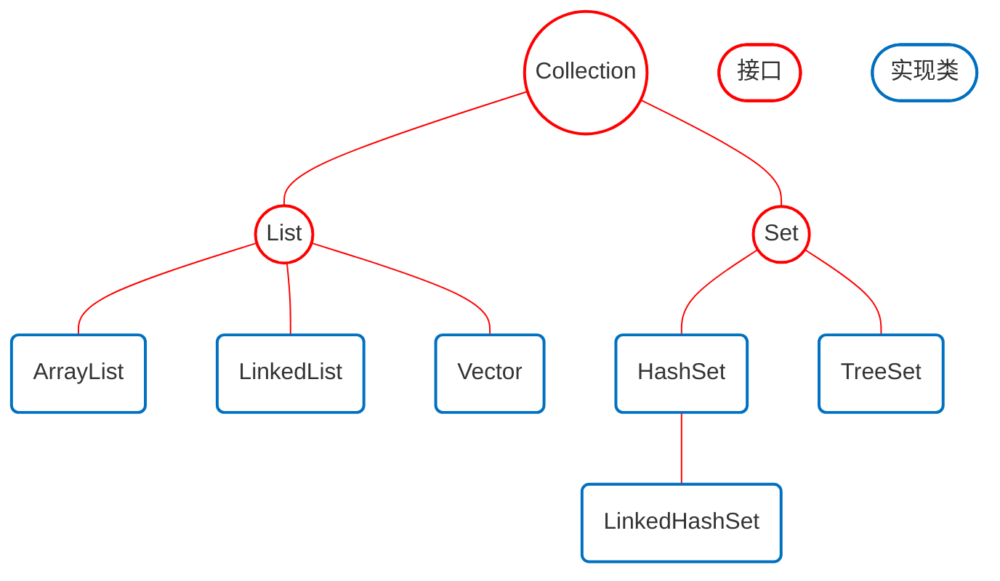
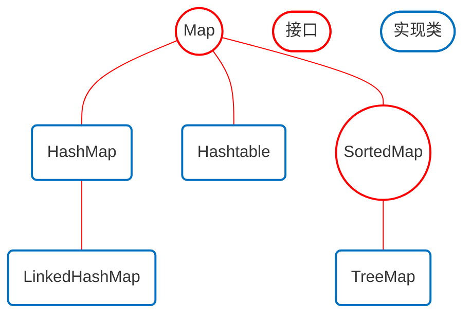
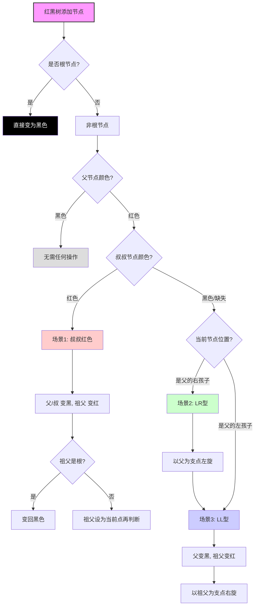
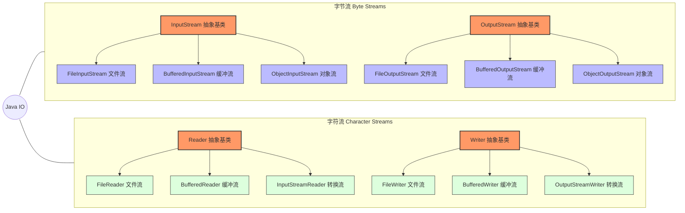

[阿里巴巴Java开发手册](https://developer.aliyun.com/ebook/386/read?spm=a2c6h.26392459.ebook-detail.2.63392867CQCErU)
# 命名

① 变量 / 方法：**小驼峰 camelCase**
	String userName;
	 int userAge; 
	 void getUserInfo() {}

② 类 / 接口：**大驼峰 PascalCase**
	class UserInfo {} 
	interface UserService {}

③ 常量：**大写蛇形**
	MAX;
	MAX_COUNT;
	

④**串式 (kebab-case)**
	单词全小写，用连字符连接。因连字符`-`会与减号冲突，不能用于大多数编程语言的变量名，但常用于URL或HTML属性
	 <div user-profile>
	 ....
	 </div>

---
---


# 快捷键

按F2可以快速对文件重命名

命令行里按上下键可以快速使用刚刚的命令

psvm或main快速输出public static void main

sout快速输出System.out.println

写Javabean类时，Alt + Insert *选择Constructor可以生成无参或有参构造函数，选择 Getter and Setter即可一键生成私有变量的get/set方法*

“数组名.fori ” 可以快速打出for循环遍历数组元素

“数组名.forr ” 可以快速打出for循环反向遍历数组元素

“数组名.for ” 可以快速打出“增强for循环”循环遍历数组元素

“数字.fori ”可以快速打出for循环遍历从0到这个数

字符串要用“名字.length().fori”，“名字.charAT(i)”可获取字符串的内容

集合可以直接“名字.fori”，不用加.size

若用到一个方法名但还没定义它，可以先点击这个名字（会标红），然后alt加回车，自动定义方法

shift+F6统一修改变量名
shift+HOME选到行首
shift+END选到行尾
ctrl+/行注释
ctrl+shift+/块注释
ctrl+d快速复制一行
ctrl+p光标置于方法参数括号中，可浏览到需要哪些参数
ctrl+B选中方法名，快速切换到定义此方法处
ctrl+shift+U小写变大写
Home光标快速移动到行首
End光标快速移动到行尾
ctrl+Home移动到文件开头
ctrl+End移动到文件末尾
ctrl+alt+win+M自动抽取方法（将一段代码总结成方法）
ctrl+alt+L格式化代码
ctrl+alt+V光标放在这一行，快速给方法返回值赋值（自动命名）
ctrl+alt+T选中代码块后，可进行"代码包围"，快速用if/else，try/catch，while，for等
ctrl+alt+左方向键，光标回到上一个地方
按住alt加上鼠标左键向下拖动可批量修改（比如统一修改变量名）

---
---


# IDEA项目结构


### 一、核心逻辑层级（Project / Module / Package）

IDEA 里最关键的三层关系：

1. **Project（项目 / 工程）**
    
    - 整个项目的根容器，对应一个文件夹。
    - 管理全局配置、SDK、项目级库、模块列表JetBrains。
    
2. **Module（模块）**
    
    - 项目下的独立功能单元，可单独编译、运行、测试。
    - 一个 Project 可以包含多个 Module（多模块项目），也可以只有一个默认 Module。
    - 每个 Module 有自己的 `.iml` 配置文件。
    
3. **Package（包）**
    
    - 代码的逻辑分组，对应磁盘上的目录结构（如 `com.example.demo`）。
    
4. **Class（类 / 文件）**
    
    - 具体的 `.java`、`.kt`、`.properties` 等文件。
    

---

### 二、标准目录结构（Java/Maven/Gradle 通用）

一个典型的 IDEA 项目目录如下：

your-project/                # 项目根目录（Project）
├── .idea/                   # IDEA 自动生成的配置目录（勿手动改）
│   ├── modules.xml          # 模块列表与配置
│   ├── workspace.xml        # 工作区布局、运行配置
│   ├── libraries/           # 项目级库配置
│   └── misc.xml             # 杂项设置（编码、代码风格等）
├── module-name/             # 模块目录（多模块项目会有多个）
│   ├── .iml                 # 模块专属配置文件
│   ├── src/                 # 源代码根目录
│   │   ├── main/            # 生产代码（业务逻辑）
│   │   │   ├── java/        # Java/Kotlin 源码（按包结构存放）
│   │   │   ├── resources/   # 配置文件、静态资源（properties、XML、图片等）
│   │   │   └── webapp/      # Web 项目专用（WEB-INF、html、js 等）
│   │   └── test/            # 测试代码（JUnit、单元测试）
│   │       ├── java/        # 测试源码
│   │       └── resources/   # 测试专用资源
│   ├── lib/                 # 手动引入的第三方 Jar 包（非 Maven/Gradle 时）
│   ├── out/                 # IDEA 默认编译输出目录（.class 文件）
│   │   ├── production/      # 生产代码编译结果
│   │   └── test/            # 测试代码编译结果
│   └── target/              # Maven/Gradle 构建输出目录（替代 out）
├── pom.xml                   # Maven 项目配置文件（依赖、构建脚本）
├── build.gradle              # Gradle 项目配置文件
├── settings.gradle           # Gradle 多模块配置
├── .gitignore                # Git 忽略文件（通常忽略 .idea、out、target）
└── README.md                 # 项目说明文档

---

### 三、关键目录 / 文件详解

#### 1. 配置类（IDE 自动维护）

- **`.idea/`**：项目级配置，包含 SDK、模块、代码风格、运行配置等，**建议加入版本控制**（方便团队共享）JetBrains。
- **`*.iml`**：模块级配置，每个 Module 一个，记录该模块的源码路径、依赖、输出目录等。

#### 2. 源码与资源（核心开发目录）

- **`src/main/java`**：业务代码入口，按包名创建子目录（如 `com/company/project`）。
- **`src/main/resources`**：非代码资源，Spring Boot 的 `application.properties`、MyBatis 的 mapper.xml 都放这里JetBrains。
- **`src/test/java`**：单元测试代码，与 main 目录结构一一对应。

#### 3. 编译输出（自动生成，可忽略）

- **`out/`**：IDEA 原生编译输出，存放 `.class` 文件。
- **`target/`**：Maven/Gradle 构建输出，包含编译结果、打包后的 Jar/War 等。
- **`build/`**：Gradle 专用输出目录，功能类似 target。

#### 4. 构建与依赖

- **`pom.xml` / `build.gradle`**：构建脚本，管理项目依赖、插件、打包规则。
- **`lib/`**：手动管理 Jar 包时使用，Maven/Gradle 项目一般不用。

---

### 四、多模块项目结构（进阶）

大型项目通常拆分为多个 Module，结构示例：


```
my-project/
├── .idea/
├── pom.xml                # 父项目（管理公共依赖、版本）
├── module-common/         # 公共工具模块（工具类、枚举、配置）
├── module-api/            # API 接口模块（Controller、对外接口）
├── module-service/        # 业务逻辑模块（Service、DAO）
└── module-web/            # Web 启动模块（含 main 方法、启动类）
```

每个 Module 都有自己的 `src`、`.iml`，可独立编译、依赖其他 Module。

---

### 五、快速查看与修改项目结构

- 打开：`File → Project Structure`（快捷键 `Ctrl+Alt+Shift+S`）
- 可配置：
    
    - **Project SDK**：指定 JDK 版本。
    - **Modules**：添加 / 删除模块、设置源码 / 资源 / 输出路径。
    - **Libraries**：管理项目 / 模块 / 全局依赖库。
    - **Artifacts**：配置打包方式（Jar/War）。
    

---

### 六、常见规范与建议

1. **源码分离**：`main` 放业务代码，`test` 放测试代码，不混放。
2. **资源分类**：配置文件放 `resources`，静态资源（图片、JS）Web 项目放 `webapp`。
3. **忽略文件**：`.gitignore` 必须包含 `.idea`、`out`、`target`、`build`、`*.iml`（可选）。
4. **多模块拆分**：按业务域 / 功能拆分 Module，降低耦合、便于复用。

---
---


# 逻辑运算符

```java
&：与
|：或
！：非
^:异或


#1. 按位与（位运算，最常考计算机基础）

  `&` 会把两个数字按二进制位一位一位做运算：

  - 对应位 **都为 1 → 结果是 1**
  - 否则 → 结果是 0

   例子：

  3 的二进制：011

  5 的二进制：101

  3 & 5 = 001 → 1


#2. 逻辑与（不短路）

  `&` 也可以当逻辑与用，和 `&&` 很像，但关键区别：

  - `&&`：左边为 false，右边不执行（短路）
  - `&`：左边为 false，右边照样执行（不短路）
  
  
  
  
byte a=200;  //1100 1000
byte b=10;   //0000 1010
System.out.println(a&b);  //0000 1000，十进制为8

  
  
  
----------------------------------------  

#1. 按位或（位运算）

  规则：对应位只要有一个是 1，结果就是 1**

  0 | 0 = 0

  0 | 1 = 1

  1 | 0 = 1

  1 | 1 = 1

  例子：

  3 二进制：011

  5 二进制：101

  3 | 5 = 111 → 7


#2. 逻辑或（不短路）

  `|` 两边都是布尔时：只要一个 true，结果就是 true**

  但重点：

  - `||`：左边 true → **右边不执行**（短路）
  - `|`：左边 true → **右边照样执行**（不短路）


-----------------------------------------


&&：短路与（和&结果一样）
||：短路非（和|结果一样）
额外具有短路功能，表示当左边的表达式能确定最终结果，右边便不会再进行

int a=10;
int b=10;
bollean result= ++a<10 && ++b<10;
System.out.println(result);//false
System.out.println(a);//11
System.out.println(b);//10


-----------------------------------------


<<：向左移动，低位补0，每移动一位相当于乘2
>>：向右移动，高位补0或1（数值位补0，但符号位要看之前是0还是1），每移动一位相当于除以2
>>>：无符号向右移动，高位只补0


```

---
---


# 关于随机数

生成随机数范围的秘诀：*比如7~15*    **注意随机数的范围首位默认从0开始，我们填的参数是控制末尾的**
	1、让这个范围首尾都减去一个值，使得范围从0开始  *减去7，即0~8*
	2、尾巴加1   *8+1=9*
	3、最终的结果再加上第一步减去的值   *9+7=16，即参数填16*


> 以后如果我们要在一堆没有什么规律的数据中随机抽取，可以先把这些数据放在数组当中，在随机抽取一个索引


---
---


# Java有无指针


1、Java没有指针

Java **不能**：

- 写 `int *p = &a;`
- 做指针运算 `p++`、`p+1`
- 直接操作内存地址


**Java 没有指针。**


 2、 但 Java 到处都是 “指针思想”

比如：

```java
int[] arr = new int[5];
```

- `arr` 存的**不是数组本身**，是**数组对象的地址**
- 这就是**引用（reference）**，本质是**受控制的指针**

再比如对象：

```java
Student stu = new Student();
```

- `stu` 也是指向堆内存的**指针（引用）**


 3、 和 C 指针的区别

- C 指针：可以加减、乱指、越界、操作任意地址 → **危险但自由**
- Java 引用：只能指向对象 / 数组，不能算地址、不能改地址 → **安全但不自由**

4、最简记忆

- **C：有指针，能玩地址，能出事**
- **Java：没有指针语法，但有引用（安全指针），不能玩地址**


---
---


# 键盘录入

在 Java 中，最常用的键盘录入方式是使用 `java.util.Scanner` 类。它就像是一个“翻译官”，负责把用户从键盘敲下的字符转换成程序能理解的数字、字符串等数据。

---

### 1. 键盘录入的标准步骤

实现键盘录入只需要简单的“三部曲”：

1. **导包**：在类定义之前引入 Scanner 类。
    
2. **创建对象**：实例化一个扫描器对象。
    
3. **接收数据**：调用对应的方法获取用户输入。
    


```java
// 1. 导包
import java.util.Scanner;

public class ScannerDemo {
    public static void main(String[] args) {
        // 2. 创建扫描器对象 (System.in 代表标准输入流，即键盘)
        Scanner sc = new Scanner(System.in);

        System.out.println("请输入您的年龄：");

        // 3. 接收数据
        int age = sc.nextInt(); 

        System.out.println("您的年龄是：" + age);
    }
}
```

---

### 2. 常用接收方法一览

根据你想获取的数据类型，`Scanner` 提供了不同的“捕捉”工具：

|**方法**|**说明**|
|---|---|
|`nextInt()`|接收一个**整数**（遇到空格、回车、制表符就停止）|
|`nextDouble()`|接收一个**小数**（遇到空格、回车、制表符就停止））|
|`next()`|接收一个**字符串**（遇到空格、回车、制表符就停止）|
|`nextLine()`|接收**整行字符串**（可以包含空格，直到按回车为止）|

---

### 3. 内存与原理简析

当你运行 `Scanner` 时，程序会在 **栈内存** 中创建一个 `sc` 引用，指向 **堆内存** 中的 Scanner 对象。这个对象会监听 `System.in`（系统输入流）。

- **阻塞效果**：当程序执行到 `sc.nextInt()` 时，它会“卡”在那里，等待用户在控制台输入内容并按下回车。
    
- **缓冲区**：用户输入的内容其实先进入了一个“缓冲区”。Scanner 会根据你调用的方法，从缓冲区中取走它想要的数据。
    

---

### 4. 两个容易踩的“坑”

#### ① `nextInt()` 后面接 `nextLine()` 的“跳过”现象

这是初学者最容易崩溃的地方。

- **现象**：如果你先输入一个数字（按回车），再想输入一行字符串，你会发现程序直接结束了，没让你写字符串。
    
- **原因**：`nextInt()` 只取走了数字，把那个“回车换行符”留在了缓冲区。`nextLine()` 看到回车以为你已经输完了，直接带走了一个空字符串。
    
- **解决**：要么全部用 `next()`，要么在 `nextInt()` 之后多写一行 `sc.nextLine()` 把多余的回车“吃掉”。
    

#### ② 记得“关门”

虽然小程序不关也没事，但在规范的项目中，Scanner 使用完毕后建议调用 `sc.close()` 释放资源，防止内存泄漏。

---
---


# 数据类型


基本数据类型：数据值存储在自己空间中  *栈内存*
		特点：赋值给其他变量，也是赋的真实的值
```java
int a=10;
int b=a;
```


引用数据类型：数据值存储在其他空间中，自己空间中存储的是地址值  *堆内存*
		特点：赋值给其他变量，赋的地址值
```java
int[] arr1={1,2,3};
int[] arr2=arr1;
```

---
---


# 数据的默认值

### 数组元素

不管在哪，只要 `new` 出来，元素就有默认值：


```java
int[] arr = new int[5]; // 全部 0
boolean[] b = new boolean[3]; // 全部 false
String[] str = new String[2]; // 全部 null
```


### 类的成员变量（字段）

直接写在类里、不在方法里的变量：


```java
public class Test {
    int a;         // 默认 0
    double d;      // 默认 0.0
    boolean flag;  // 默认 false
    String s;      // 默认 null
}
```

*与C语言不同，这些不用赋值就能直接用、直接比较。*


---
---
# switch语句

## 旧版：传统 `switch` (冒号 + break)

旧版的特点是**繁琐**，且容易因为漏写 `break` 导致“逻辑连环撞”。

- **单句逻辑**：每个 `case` 后面跟一句代码，必须加 `break`。
    
- **多句逻辑**：直接在冒号后换行写，最后加 `break`。

```java
int week = 2;
switch (week) {
    case 1:
        System.out.println("周一：埋头苦干"); // 单句
        break;
    case 2:
        // 多句逻辑：直接写，不需要大括号（虽然写了也不报错）
        System.out.println("周二：方案评审");
        System.out.println("还要写周报...");
        break;
    case 3: case 4: case 5: // 多值匹配只能这样堆叠
        System.out.println("周中：持续输出");
        break;
    default:
        System.out.println("周末：放假！");
        break;
}
```

---

## 新版：`switch` 表达式 (JDK 12+ 箭头语法)

新版的特点是**简洁**，它把 `switch` 从一个“语句”变成了可以返回值的“表达式”。

- **单句逻辑**：使用 `->`，不需要写 `break`。
    
- **多句逻辑**：必须使用 **`{ }`** 代码块，且如果要返回值，必须用 **`yield`**。


```java
int day = 2;
// 直接将 switch 的结果赋值给变量
String task = switch (day) {
    case 1 -> "周一：开会"; // 单句，自动返回结果
    case 2 -> {
        // 多句逻辑：必须进大括号
        System.out.println("正在打代码...");
        System.out.println("正在修Bug...");
        yield "周二：程序员的日常"; // 使用 yield 返回结果，替代 break
    }
    case 3, 4, 5 -> "周中：平稳运行"; // 多个值用逗号隔开，超爽
    default -> "未知日期";
};//这里在需要switch返回值的时候要有分号，没有返回值可以不写分号

System.out.println(task);
```

---

## 核心总结

1. **关于大括号 `{}`**：
    
    - **旧版**：多句代码不需要大括号，靠 `break` 结束。
        
    - **新版**：多句代码**必须**加大括号，否则编译器分不清哪里是下一项。
        
2. **关于返回值**：
    
    - **旧版**：不能返回值。
        
    - **新版**：可以返回值。在大括号内返回值时，必须用 `yield`；如果是单行，`->` 后面直接写值即可。
        
3. **乱搞警告**：
    
    - 你不能在一个 `switch` 里既写 `:` 又写 `->`，Java 会直接给你甩个编译错误。


---
---


# 面向对象


## 一、类和对象
- 类（设计图）：是对象共同特征的描述
- 对象：真实存在的具体东西

*如何定义类*
```java
public class 类名{
	1.成员变量（代表属性，一般是名词）
	2.成员方法（代表行为，一般是动词）
	3.构造器
	4.代码块
	5.内部类
}
```
*如何得到类的对象*
```java
类名 对象名=new 类名（）;
```
*如何得到类的对象*
- 访问属性：对象名.成员变量
- 访问行为：对象名.方法名（...）

> [!tip]
> 用来描述一类事物的类，专业叫做：Javabean类，不写main方法
> - *三点要求*
>- **类是 public**
>- **有无参构造器**
>- **字段 private，提供 public 的 getXxx () /setXxx ()**


---
---


## 二、封装
### 1. 核心定义

封装是指将对象的**属性（状态）和行为（方法）结合成一个独立的单位（类），并尽可能地隐藏**对象的内部细节，只保留有限的对外接口与外部进行交互。

---

### 2. 为什么要封装？（痛点分析）

想象一下，如果一个人的 `age` 属性是公开的，任何人都可以直接把它改成 `-500` 岁，这显然不符合逻辑。

- **安全性：** 防止外部成员随意修改内部数据。
    
- **解耦：** 外部不需要知道内部逻辑。只要接口不变，内部逻辑怎么改都行。
    
- **简单化：** 调用者只需要知道方法的作用，不需要研究它是怎么实现的。
    

---

### 3. 如何实现封装？

在 Java 中，实现封装通常遵循“三部曲”：

#### 第一步：私有化属性

使用 `private` 关键字修饰成员变量，使其在类外部不可直接访问。

#### 第二步：提供公共的 Getter/Setter 方法

通过 `public` 方法来控制属性的读取和修改，并在 Setter 中加入**逻辑判断**。

#### 第三步：隐藏实现逻辑

将复杂的计算或校验逻辑写在私有方法中，只暴露一个简单的公共方法给用户。


### 4. 封装的四个访问修饰符

封装的程度由访问权限控制符决定，我们可以根据需要选择“围墙”的高度：

|**修饰符**|**同类**|**同包**|**子类**|**整个项目**|
|---|---|---|---|---|
|**private**|✅|❌|❌|❌|
|**default** (默认)|✅|✅|❌|❌|
|**protected**|✅|✅|✅|❌|
|**public**|✅|✅|✅|✅|


---
---


## 三、this关键字

既然提到了封装，那 **`this`** 关键字就是那个在暗中穿针引线的“指路人”。

在 Java 中，`this` 是一个**引用变量**，它指向**当前对象本身**。简单来说，谁调用了这个方法，`this` 就代表谁。（*本质：当前对象的地址*）

---

### 1. `this` 的三大核心用法

#### ① 区分同名的成员变量与局部变量（最常用）

当你的方法参数名和类属性名“撞衫”时，Java 会优先采用就近原则（局部变量）。此时必须用 `this` 来点名成员变量。


```java
public class User {
    private String name;

    public void setName(String name) {
        // name = name;      // 这里的两个 name 都是参数，赋值无效
        this.name = name;    // this.name 指向类里的属性，右边的 name 是参数
    }
}
```

#### ② 调用本类中的其他构造器

如果你有多个构造方法，想让一个构造器去“搭便车”调用另一个，可以用 `this()`。

> **注意：** `this()` 必须写在构造方法的第一行。


```java
public class Student {
    private String name;
    private int age;

    public Student() {
        this("无名氏", 18); // 调用下面那个带两个参数的构造器
    }

    public Student(String name, int age) {
        this.name = name;
        this.age = age;
    }
}
```

#### ③ 代表当前对象进行传递

你可以把 `this` 当作参数传递给其他方法，或者在方法中返回 `this`（这常用于**链式编程**，比如 StringBuilder）。

---

### 2. 形象化理解

我们可以把类（Class）想象成一张**建筑图纸**，而对象（Object）是根据图纸盖出来的**多栋房子**。

- 当你在图纸上写“把这栋房子的墙刷红”时，程序并不知道具体是哪一栋。
    
- **`this`** 就像是房子的**内部定位系统**。当你在 1 号房里操作时，`this` 就指向 1 号房；在 2 号房里，它就指向 2 号房。
    

---

### 3. 使用注意点（避坑指南）

- **不能在 `static` 方法中使用：** 静态方法属于类，而不属于某个具体的对象。既然没有对象，自然也就没有 `this`。
    
- **不能在构造器中循环调用：** 比如 A 调用 B，B 又调用 A，这会导致编译错误。
    

---

### 4. 总结对比

|**特性**|**说明**|
|---|---|
|**本质**|指向当前实例的引用|
|**作用域**|只能在非静态方法、构造器中使用|
|**主要目的**|解决命名冲突、实现构造器复用、链式调用|

---
---


## 四、构造方法
### 作用：
- 创建对象的时候，由虚拟机自动调用，给成员变量进行初始化
### 分类
- 无参构造方法：初始化对象时，成员变量的数据均采用默认值
- 有参构造方法：初始化对象时，同时可以为对象赋值
### 注意事项：
- 任何类定义出来，默认自带无参构造器
- **一旦定义有参构造器。无参构造器便消失**，此时需要手动写无参构造器
- 建议在任何时候都写上空参和带上全部参数的构造方法


---
---


## 五、标准Javabean类

在 Java 开发中，**JavaBean** 是一种特殊的类，它遵循特定的编写规范。你可以把它想象成一个“标准的数据集装箱”，专门用来封装数据并在层与层之间传递。

一个标准的 JavaBean（也常被称为 POJO - Plain Old Java Object）必须满足以下 **4 个核心条件**：

### 1. 编写规范

- **类修饰符：** 必须是 `public`。
    
- **成员变量：** 必须使用 `private` 私有化（体现封装思想）。
    
- **构造器：** 必须提供一个 **无参构造器**（很多框架如 Spring, MyBatis 反射时需要它）和**全参构造器**
    
- **Getter/Setter：** 为每个私有属性提供公共的 `get` 和 `set` 方法。
    

---

### 2. 标准代码模板

这是一个符合标准的 `User` 类 JavaBean：

```java
public class User {
    // 1. 私有化成员变量
    private String username;
    private int age;

    // 2. 无参数构造器 (必须有)
    public User() {
    }

    // 3. 全参数构造器 (可选，但通常建议加上)
    public User(String username, int age) {
        this.username = username;
        this.age = age;
    }

    // 4. 公共的 Getter 和 Setter
    public String getUsername() {
        return username;
    }

    public void setUsername(String username) {
        this.username = username;
    }

    public int getAge() {
        return age;
    }

    public void setAge(int age) {
        this.age = age;
    }
}
```

---

### 3. 为什么要遵守这个标准？

如果每个程序员都按自己的喜好写类，工具和框架就没法玩了。遵守标准的好处在于：

1. **框架兼容性：** 像 Hibernate、MyBatis、Spring 这种主流框架，都是通过反射调用**无参构造**和 **Setter/Getter** 来填充数据的。
    
2. **代码可维护性：** 任何开发者看到这样的类，就知道它是用来存数据的，直接调用 `get/set` 即可，不需要猜测逻辑。
    
3. **内省机制：** Java 语言自带的 `Introspector` 可以自动发现这些属性，方便在 GUI 或 Web 插件中展示。
    

---

### 4. 进阶技巧：效率神器

在实际开发中，手动写几十个 `get/set` 非常痛苦。我们通常有三种处理方式：

- **IDE 快捷键：** 在 IntelliJ IDEA 中，按 `Alt + Insert` 然后选择 `Getter and Setter` 即可一键生成。(*选择Constructor可以生成无参或有参构造函数*)
    
- **Lombok 插件：** 只需要在类名上加一个 `@Data` 注解，编译时会自动帮你写好所有构造器和方法。
    
- **Record (Java 14+)：** 如果你使用的是较新版本的 Java，可以用 `record` 关键字，它一行代码就能搞定类似 JavaBean 的功能（虽然它是不可变的）。
    

---

### 5. 常见误区

> **“JavaBean 必须实现 Serializable 接口吗？”**
> 
> 严格的 Sun 公司规范中建议实现 `Serializable`（序列化接口），以便对象能在网络上传输或保存到硬盘。但在现代开发中，如果你的对象只是在内存里跑，不涉及网络传输，不写也没问题。不过，为了保险起见，**建议养成实现该接口的习惯。**

---
---

## 六、对象内存图

理解对象内存图是掌握 Java 的底层逻辑、尤其是理解“引用”和“深浅拷贝”的关键。在 Java 中，内存主要分为三个核心区域：**栈（Stack）**、**堆（Heap）** 和 **方法区（Method Area）**。

我们通过一个简单的代码实例来拆解内存的变化过程。

---

### 1. 核心内存区域角色

|**区域**|**存储内容**|**特点**|
|---|---|---|
|**栈 (Stack)**|局部变量（如 `int a`, `User u`）|运行速度快，方法执行完自动释放。|
|**堆 (Heap)**|所有的**对象实例**（如 `new User()`）|存储实际数据，通过地址值访问，由 GC（垃圾回收）管理。|
|**方法区 (Method Area)**|类信息（.class文件）、常量、静态变量|整个程序共享，加载类时初始化。|

---

### 2. 对象创建的内存演变（案例）

假设我们有如下代码：


```java
public class Test {
    public static void main(String[] args) {
        Student s1 = new Student(); 
        s1.name = "张三";
        s1.age = 18;
        s1.study();
    }
}
```

#### 第一步：类加载（方法区）

JVM 启动，将 `Test.class` 和 `Student.class` 加载进**方法区**。此时方法区记录了 `Student` 类有哪些属性（name, age）和哪些方法（study）。

#### 第二步：声明变量（栈）

`main` 方法开始执行，在**栈**内存中为 `s1` 开辟空间。此时 `s1` 只是一个空的引用。

#### 第三步：创建对象（堆）

执行 `new Student()`：

1. 在**堆**内存中开辟一块空间。
    
2. 为该空间分配一个唯一的**十六进制地址值**（例如 `0x1122`）。
    
3. 初始化属性为默认值（String 为 `null`，int 为 `0`）。
    
4. 将地址值 `0x1122` 赋值给栈中的变量 `s1`。
    

#### 第四步：属性赋值（初始化）与方法调用

- `s1.name = "张三"`：程序通过 `s1` 存储的地址找到堆中的对象，修改其数据。
    
- `s1.study()`：通过对象内部持有的“方法区地址”，去方法区找到 `study` 方法的代码并执行。
    

---

### 3. 两个变量指向同一个对象


```java
Student s1 = new Student();
Student s2 = s1; // 关键一步：传递的是地址值
s2.name = "李四";
System.out.println(s1.name); // 输出：李四
```

在这种情况下，**栈**中会有两个引用 `s1` 和 `s2`，但它们存储的**地址值完全相同**，都指向**堆**中同一个对象。修改其中一个，另一个也会跟着变。

---

### 4. 关键结论

1. **栈管运行，堆管存储。**
    
2. **变量赋值本质是地址拷贝。** 如果你把一个对象赋值给另一个变量，你只是复制了一把“房门钥匙”，而不是盖了一栋新房子。
    
3. **垃圾回收：** 当栈中没有任何引用指向堆中的某个地址时，该对象就变成了“孤儿”，会被 JVM 的垃圾回收器择机清理。
    

---
---

# 字符串

## 一、API

在 Java 的世界里，**API（Application Programming Interface，应用程序编程接口）** 简单来说就是一套“规则说明书”或“功能字典”。

作为开发者，你不需要知道某个功能底层是怎么用 0 和 1 堆出来的，你只需要知道**调用哪个类、哪个方法、传什么参数**就能实现功能。

---

### 1. 广义与狭义的 API

- **广义的 API**：指的是软件系统之间的桥梁。比如你调用微信支付的接口、调用高德地图的定位，这些都是 API。
    
- **狭义的 Java API**：指的是 JDK 中内置的**类库**（Scanner, String, Math, ArrayList 等）。它们是 Oracle 已经写好的代码，你直接拿来用即可。
    

---

### 2. 如何使用 Java API？

使用 API 的核心逻辑就像查字典：

1. **确定需求**：比如我想生成一个随机数。
    
2. **查找类名**：搜索得知 `Random` 类可以实现。
    
3. **看包名**：在 `java.util` 包下，需要 `import`。
    
4. **看构造器**：怎么创建这个对象？`new Random()`。
    
5. **看方法名**：调用哪个方法？`nextInt(int bound)`。
    

---

### 3. Java 常用核心 API 概览

Java 拥有极其庞大的标准库，初学者最先接触的通常是以下几个包：

|**包名**|**功能描述**|**核心类举例**|
|---|---|---|
|**`java.lang`**|核心基础类（**自动导入**）|`String`, `Object`, `Math`, `System`|
|**`java.util`**|工具类、集合框架|`Scanner`, `ArrayList`, `Random`, `Arrays`|
|**`java.io`**|输入输出流，操作文件|`File`, `InputStream`, `OutputStream`|
|**`java.net`**|网络编程|`Socket`, `URL`|
|**`java.time`**|日期和时间（Java 8+）|`LocalDate`, `LocalDateTime`|

---

### 4. 学会看 API 文档（核心技能）

[Java API文档链接](https://www.matools.com/api/java8)

API 文档是每个 Java 程序员的“保命手册”。当你打开一个类的文档时，重点看这三块：

1. **类描述**：这个类是干嘛的？（比如 `String` 是不可变的字符序列）。
    
2. **构造方法摘要**：怎么把这个对象 `new` 出来？
    
3. **方法摘要**：
    
    - **方法名**：叫什么？
        
    - **参数列表**：要传什么？
        
    - **返回值类型**：执行完给我什么？
        

---

### 5. 举个例子：`Math` 类

`Math` 类的 API 设计非常特殊，它的方法全是 `static`（静态）的。


```java
// 不需要 new，直接类名点方法名调用
double result = Math.pow(2, 3); // 2的3次方
int randomNum = (int)(Math.random() * 100); // 0-100随机数
```

---

### 6. 给初学者的建议

不要试图**背诵** API。Java 的类多达几千个，没人能全部记住。

- **常用的**（如 String, ArrayList）写多了自然就熟了。
    
- **不常用的**（如正则表达式、复杂的文件操作）现用现查。

---
---


## 二、String

在 Java 中，**`String`** 是使用频率最高的类，没有之一。它虽然看起来像基本数据类型，但本质上是一个**引用数据类型**，而且藏着很多设计上的精妙之处。

---

### 1. `String` 的核心特性：不可变性 (Immutability)

这是 Java String 最重要的特性：**一旦创建，其内容就不可更改。**


```java
String s = "Hello";
s = "World"; 
```

当你执行上面的代码时，并不是把 "Hello" 变成了 "World"，而是在内存中**新建**了一个 "World" 对象，并将 `s` 指向了新的地址。原来的 "Hello" 依然静静地待在内存里（直到被回收）。

> **为什么要不可变？**
> 
> - **安全：** 字符串常作为参数传递（如数据库连接、网络地址），不可变保证了数据不会中途被恶意篡改。
>     
> - **缓存：** 因为不可变，多个变量可以共享同一个字符串常量，节省内存。
>     

---

### 2. 创建 String 对象的两种方式

创建 `String` 主要分为**直接赋值**和 **`new` 构造方法**两种途径：

#### ① 直接赋值（推荐）


```java
String name = "小明";
```

这是最常用的方式。它的特点是代码简洁，且能够高效利用内存。

#### ② 使用 `new` 关键字（多种构造方法）

通过 `new` 可以根据不同的数据源创建对象：

- **`public String()`**：创建一个空白字符串，不含任何内容。
    
- **`public String(String original)`**：根据传入的字符串再创建一个新的字符串对象。
    
- **`public String(char[] chs)`**：根据**字符数组**创建。常用于需要修改字符串内容的场景（因为 String 不可变，通常先转为数组修改后再转回 String）。
    
- **`public String(byte[] bytes)`**：根据**字节数组**创建。这是网络传输或读取文件时的核心方法，因为数据在网络中是以字节流传输的。
    

---


### 3. 字符串常量池 (String Constant Pool)


为了提高性能，JVM 在堆内存中专门开辟了一块区域叫**字符串常量池**。

这是理解 `String` 的难点。不同的创建方式，在内存中的表现完全不同：

#### 情况 A：直接赋值的复用机制

当使用双引号直接赋值时，系统会检查该字符串在串池是否存在

- **不存在**：在串池中创建新的字符串对象。
    
- **存在**：直接**复用**已有的地址。
    
- **结果**：`String s1 = "abc"; String s2 = "abc";` 此时 `s1 == s2` 为 `true`。
    

#### 情况 B：使用 `new` 的独立空间

每使用一次 `new` 关键字，都会在**堆内存**中开辟一块全新的空间：

- 即使内容相同，每一个通过 `new` 创建出来的对象都有自己独立的内存地址。
    
- **结果**：`String s1 = new String(chs); String s2 = new String(chs);` 此时 `s1 == s2` 为 `false`，因为它们的地址值分别是 `0x0022` 和 `0x0033`


> [!tip] 这种设计的核心初衷是**性能优化**。
>- **串池**存在的意义是为了减少相同字符串频繁创建带来的内存开销。
>- **`char[]` 和 `byte[]` 构造器**存在的意义是为了灵活转换。比如你想修改一个字符串，String 本身改不了，你得先把它变成 `char[]`（如 `{'a','b','c'}` 改为 `{'Q','b','c'}`），再通过 `new String(chs)` 包装回去。


---

### 4. String的比较

在 Java 中，字符串的比较是一个经典的“陷阱”，我们可以将字符串比较分为**地址比较**和**内容比较**两种情况。

 核心区别：`==` vs `equals`

- **`==`（比较地址值）**：对于引用数据类型，它判断的是两个变量是否指向内存中的**同一个对象**。
    
- **`equals()`（比较内容）**：String 类重写了这个方法，它会逐个字符地比较字符串的**具体内容**是否完全相同。


---

#### ①不同创建方式下的比较结果

##### 情况 A：直接赋值（串池复用）


```java
String s1 = "abc";
String s2 = "abc";
```

- **内存表现**：当使用双引号直接赋值时，系统会检查串池。因为 `"abc"` 已存在，`s2` 会复用 `s1` 的地址。
    
- **比较结果**：`s1 == s2` 结果为 `true`，因为它们的地址完全一致。
    

##### 情况 B：使用 `new` 关键字（独立空间）

```java
char[] chs = {'a', 'b', 'c'};
String s1 = new String(chs);
String s2 = new String(chs);
```

- **内存表现**：每执行一次 `new`，都会在堆内存中开辟一个新的空间。即便内容都是 `"abc"`，它们的地址值（如 `0x0022` 和 `0x0033`）是不同的。
    
- **比较结果**：
    
    - `s1 == s2` 结果为 **`false`**（地址不同）。
        
    - `s1.equals(s2)` 结果为 **`true`**（内容相同）。
        

---

####  ②常见的比较方法 API

在实际开发中，除了基础的 `equals`，还有几个常用的比较接口：

- **`equals(Object anObject)`**：最常用。逐个字符比较**内容**，区分大小写。例如 `"Java".equals("java")` 结果为 `false`。
    
- **`equalsIgnoreCase(String s)`**：比较内容，但**忽略大小写**。例如 `"Java".equalsIgnoreCase("java")` 结果为 `true`。
    
- **`compareTo(String another)`**：按照字典顺序（Unicode码值）比较，返回两个字符串的差值，常用于**排序逻辑**。
---

####  ③ 最佳实践：避免空指针异常

在进行字符串比较时，为了防止 `null` 对象调用方法导致程序崩溃，建议将**确定不为 null 的常量**写在前面：

```java
String input = null;

// 不推荐：如果 input 为 null，会报 NullPointerException
if (input.equals("admin")) { ... } 

// 推荐：即使 input 为 null，代码也能正常运行并返回 false
if ("admin".equals(input)) { ... }
```


---


####  ④ 空字符串 `""` vs `null` 

> [!attention]
> String str="";  或 String s = new String();//空字符串。长度为0
> String str=" ";  //中间有空格，非空字符串，长度为1

| **特性**   | **空字符串 ""**              | **null**                                   |
| -------- | ------------------------ | ------------------------------------------ |
| **内存状态** | **分配了内存**。在堆内存中有一个真实的对象。 | **未分配内存**。变量不指向任何对象。                       |
| **长度**   | `s.length()` 结果为 **0**。  | 调用方法会报 **`NullPointerException`** (空指针异常)。 |
| **比喻**   | 像一个**空钱包**（钱包在，但没钱）。     | 像**根本没有钱包**。                               |

---


### 5.String类的常用方法


> **📌 核心提醒**：`String` 对象内容不可变。所有修改方法（如 `replace`, `toUpperCase`）都会返回一个**全新的字符串对象**，而不会改变原字符串。

####  获取信息类

用于提取字符串的状态或特定字符。

| **方法签名**                    | **作用**                  | **示例**                             |
| --------------------------- | ----------------------- | ---------------------------------- |
| `int length()`              | 获取字符串长度（字符数）            | `"abc".length()` → `3`             |
| `char charAt(int i)`        | 获取指定索引处的字符              | `"abc".charAt(1)` → `'b'`          |
| `int indexOf(String s)`     | 返回子串第一次出现的索引，找不到返回 `-1` | `"abcabc".indexOf("bc")` → `1`     |
| `int lastIndexOf(String s)` | 返回子串最后一次出现的索引           | `"abcabc".lastIndexOf("bc")` → `4` |
| `boolean isEmpty()`         | 判断是否为空串 `""`            | `"".isEmpty()` → `true`            |

---

####  判断与比较类

**注意**：内容比较务必使用 `equals` 系列方法，严禁使用 `==`（那是比地址）。

>[!tip]
>==字符串比较用:字符串1.equals(字符串2)==
>==一维数组比较用：Arrays.equals(数组1，数组2)==
>==多维数组比较用：Arrays.deepEquals(数组1，数组2)==

| **方法签名**                             | **作用**                | **示例**                                   |
| ------------------------------------ | --------------------- | ---------------------------------------- |
| `boolean equals(Object o)`           | 比较内容是否完全相同（**区分大小写**） | `"abc".equals("Abc")` → `false`          |
| `boolean equalsIgnoreCase(String s)` | 比较内容（**忽略大小写**）       | `"abc".equalsIgnoreCase("Abc")` → `true` |
| `boolean contains(CharSequence s)`   | 判断是否包含子串              | `"abc".contains("bc")` → `true`          |
| `boolean startsWith(String p)`       | 判断是否以指定前缀开头           | `"abc".startsWith("ab")` → `true`        |
| `boolean endsWith(String s)`         | 判断是否以指定后缀结尾           | `"abc".endsWith("bc")` → `true`          |

---

#### 截取与拼接类

**注意**：由于 `String` 的不可变性，这些方法本质上是在堆内存中创建新对象。*必须将所截取/修改的字符串（即调用方法后的返回值）赋值给新的String对象，否则输出原字符串不会变化*


|**方法签名**|**作用**|**示例**|
|---|---|---|
|`String substring(int begin)`|从 `beginIndex` 截取到末尾|`"abcde".substring(2)` → `"cde"`|
|`String substring(int b, int e)`|截取 `[begin, end)` 区间（**左闭右开**）|`"abcde".substring(1, 3)` → `"bc"`|
|`String concat(String s)`|拼接字符串（等价于 `+`）|`"a".concat("b")` → `"ab"`|
|`String replace(old, new)`|替换所有匹配的子串|`"abc".replace("b", "x")` → `"axc"`|

---

#### 转换与处理类

常用于数据清洗和格式转换。

|**方法签名**|**作用**|**示例**|
|---|---|---|
|`char[] toCharArray()`|转换为字符数组|`"abc".toCharArray()` → `{'a','b','c'}`|
|`byte[] getBytes()`|转换为字节数组（常用于网络传输）|`"abc".getBytes()` → `{97, 98, 99}`|
|`String toLowerCase()`|全转小写|`"AbC".toLowerCase()` → `"abc"`|
|`String toUpperCase()`|全转大写|`"AbC".toUpperCase()` → `"ABC"`|
|`String trim()`|去除首尾空白字符（空格、制表符等）|`" abc ".trim()` → `"abc"`|
|`String[] split(String reg)`|按正则表达式分割成数组|`"a,b,c".split(",")` → `{"a","b","c"}`|

---

#### 静态工具与正则

|**方法签名**|**作用**|**示例**|
|---|---|---|
|`static String valueOf(...)`|将基本类型或对象转为字符串|`String.valueOf(123)` → `"123"`|
|`boolean matches(String reg)`|用正则匹配整个字符串|`"123".matches("\\d+")` → `true`|


---
---


## 三、StringBuilder


### 1.为什么要用StringBuilder

`String` 对象具有**不可变性**，每次拼接（如 `s += "a"`）本质上都会在堆内存中创建新的对象并抛弃旧对象，这在循环中会导致极其严重的性能开销。

**`StringBuilder` 的优势：**

- **可变性**：它像一个可以自动扩容的容器，在原有内存空间上进行操作。
    
- **性能极高**：增删改操作不会产生多余的垃圾对象。
    
- **链式编程**：支持连续调用方法（如 `sb.append("A").append("B")`）。
    

---

### 2.构造方法 

根据开发场景选择合适的初始化方式：

|**构造方法**|**说明**|
|---|---|
|`public StringBuilder()`|创建一个空白的可变字符串对象，默认初始容量为 16 个字符。|
|`public StringBuilder(String str)`|根据传入的字符串内容，创建一个可变字符串对象。|

---

### 3.常用核心方法

`StringBuilder` 的方法设计目标是高效地“增、删、改、查”。

| **方法签名**              | **作用**                               | **示例**                                                                                                                                |
| --------------------- | ------------------------------------ | ------------------------------------------------------------------------------------------------------------------------------------- |
| `append(anyType val)` | **添加**任意类型数据到末尾，并返回自身                | `sb.append("java").append(17)`                                                                                                        |
| `insert()`            | 在指定索引添加元素，**如果连续在同一个下标插入元素，原内容整体后移** | `sb.insert(0,"1")`                      `sb.insert(0,"2")`                        `sb.insert(0,"3")`                         →`"321"` |
| `reverse()`           | **反转**容器内的内容                         | `sb.append("abc").reverse()` → `"cba"`                                                                                                |
| `length()`            | 返回字符序列的**长度**                        | `sb.length()`                                                                                                                         |
| `toString()`          | 将 `StringBuilder` **转换回 `String`**   | `String s = sb.toString()`                                                                                                            |
|                       |                                      |                                                                                                                                       |

---

### 4.常见应用场景

#### 循环拼接字符串

这是 `StringBuilder` 最经典的使用场景。


```java
StringBuilder sb = new StringBuilder();
for (int i = 0; i < 1000; i++) {
    sb.append(i); // 始终在同一个对象上操作，速度极快
}
String result = sb.toString();
```

#### 字符串反转判断（如回文检查）


```java
String str = "上海自来水来自海上";
String result = new StringBuilder(str).reverse().toString();
System.out.println(str.equals(result)); // true
```


### 4.StringBuilder对比String

| **特性**   | **String**    | **StringBuilder** |
| -------- | ------------- | ----------------- |
| **可变性**  | **不可变**       | **可变**            |
| **性能**   | 频繁拼接时极低       | 频繁拼接时极高           |
| **存储位置** | 涉及字符串常量池      | 堆内存               |
| **建议使用** | 定义少量常量、作为参数传递 | 需要频繁增删改字符串内容时     |


>在以下场景中，toString()转换是必须的或更方便的：
>**使用 String 的特有 API**：`StringBuilder` 专注于增删改，它没有 `startsWith()`、`matches()`（正则匹配）或 `split()` 等复杂的检索和转换方法。
  **作为参数传递**：大多数 Java 方法（如 `System.out.println` 除外，它能自动处理对象）或你自定义的方法，通常接收的是 `String` 类型而不是 `StringBuilder`。
  **打印结果**：如果你想一次性看清容器里的内容，调用 `toString()` 把它变成一个整体的字符串是最直观的。


---
---


## 四、StringJoiner


在 Java 中，**`StringJoiner`** 是 Java 8 引入的一个非常实用的类，专门用于处理那种“需要带分隔符、前缀和后缀”的字符串拼接场景。


### 1.为什么要用 StringJoiner？

在处理诸如 `[1, 2, 3]` 或 `a,b,c` 这种格式时，如果用 `StringBuilder` 拼接，你必须手动判断是否是最后一个元素，以避免多出一个分隔符。`StringJoiner` 自动解决了这个问题。

**优势：**

- **代码简洁**：自动处理第一个/最后一个元素的分隔符。
    
- **语义清晰**：一眼就能看出拼接的规则（分隔符、开头、结尾）。
    

---

### 2.构造方法

`StringJoiner` 提供了两个常用的构造器：

1. **`public StringJoiner(CharSequence delimiter)`**
    
    - 仅指定**分隔符**。
        
    - 示例：`new StringJoiner(",")` $\rightarrow$ 结果如 `a,b,c`。
        
2. **`public StringJoiner(CharSequence delimiter, CharSequence prefix, CharSequence suffix)`**
    
    - 指定**分隔符、前缀和后缀**。
        
    - 示例：`new StringJoiner(",", "[", "]")` $\rightarrow$ 结果如 `[a,b,c]`。
        

---

### 3.常用核心方法

|**方法签名**|**作用**|**示例**|
|---|---|---|
|**`add(CharSequence newElement)`**|**添加**元素并自动补充分隔符|`sj.add("aaa").add("bbb")`|
|**`length()`**|返回当前结果的**长度**|`sj.length()`|
|**`toString()`**|转换为最终的 **String**|`sj.toString()`|

---

### 4. 代码实战对比


❌ 传统 StringBuilder 方式（较繁琐）

```java
StringBuilder sb = new StringBuilder();
int[] arr = {1, 2, 3};
sb.append("[");
for (int i = 0; i < arr.length; i++) {
    sb.append(arr[i]);
    if (i != arr.length - 1) { // 必须手动判断
        sb.append(", ");
    }
}
sb.append("]");
```


 ✅ 使用 StringJoiner 方式（极简）


```java
StringJoiner sj = new StringJoiner(", ", "[", "]");
sj.add("1").add("2").add("3"); 
System.out.println(sj.toString()); // 直接输出 [1, 2, 3]
```

---
---


## 五、三者比对


|**维度**|**String**|**StringBuilder**|**StringJoiner**|
|---|---|---|---|
|**可变性**|**不可变**|**可变**|**可变**（基于 StringBuilder 封装）|
|**内存表现**|频繁操作产生大量垃圾对象|在原有空间操作，效率极高|针对分隔符场景优化，效率极高|
|**主要功能**|基础存储、比较、查找|灵活拼接、反转、原地修改|带分隔符/前缀/后缀的格式化拼接|
|**Java 版本**|JDK 1.0 (最古老)|JDK 1.5|JDK 1.8 (最现代)|


#### `String` 与 `StringBuilder` 的互补关系

- **`String` 负责“稳”**：由于不可变，它在多线程安全、常量池复用和作为参数传递时表现极其稳定。
    
- **`StringBuilder` 负责“快”**：它像是一个字符串的“加工厂”。当你需要在一个循环里拼上千次字符串时，必须先通过 `new StringBuilder()` 开启加工厂，加工完毕后再调用 `toString()` 产出最终的 `String`。
    

####  `StringJoiner` 对 `StringBuilder` 的功能增强

- **`StringJoiner`** 本质上是专门针对“列表格式化”设计的高级工具。
    
- 如果你想拼成 `a,b,c` 这种格式，用 `StringBuilder` 你得手动写 `if` 逻辑去判断哪里不该加逗号；而 `StringJoiner` 内部自动帮你处理了这些繁琐的边界逻辑。


---
---


## 六、字符串的一些底层原理


### 1. 字符串存储的内存原理（串池机制）

Java 为了节省内存并提高性能，在堆内存中专门开辟了一块**串池（String Table）区域。**

- **直接赋值（字面量）**：当你写 `String s = "abc";` 时，系统会先检查串池。
    
    - **不存在**：在串池中创建一个新的字符串对象。
        
    - **存在**：直接**复用**该地址。
        
- **使用 `new` 关键字**：每调用一次 `new String()`，都会在堆内存（非串池区域）开辟一块**全新的独立空间**。即便内容完全相同，它们的地址值（如 `0x0022` 与 `0x0033`）也是不同的。
    

---

### 2. `==` 号比较的到底是什么？

在字符串底层逻辑中，`==` 号的含义取决于数据类型：

- **基本数据类型**：比较的是具体的**数值**。
    
- **引用数据类型（如 String）**：比较的是**内存地址值**。
		因为 `new` 出来的对象地址各不相同，所以即使内容一样，用 `==` 比较的结果通常也是 `false`。


---

### 3. 字符串拼接的底层原理


- 如果没有变量参与，都是字符串直接相加，**编译**之后就是拼接之后的结果
- 如果有变量参与，会创建新的字符串，浪费内存


```java
public class Test3 { 
	public static void main(String[] args) { 
	  String s1 = "abc"; 
	  String s2 = "ab";
	  String s3 = s2 + "c"; 
	  System.out.println(s1 == s3); 
	} 
}
```

这段代码的运行结果是 **false**，因为：

- `s1` 是字符串常量，存储在字符串常量池中。
- `s3` 是通过变量 `s2` 与字符串 `"c"` 拼接生成的，运行时在堆上创建新对象。
- `==` 比较的是对象的引用地址，因此结果为 `false`。


```java
public class Test3 { 
	public static void main(String[] args) { 
	  String s1 = "abc"; 
	  String s2 = "a"+"b"+"c";
	  System.out.println(s1 == s2); 
	} 
}
```

这段代码的运行结果是 **true**，因为：

- **编译期常量折叠**
    `"a" + "b" + "c"` 中的操作数均为**字符串字面量**，属于编译期常量。Java 编译器会在编译阶段直接将其拼接为 `"abc"`，而非在运行时执行拼接操作。
- **常量池复用**
    `s1 = "abc"` 会在字符串常量池中创建 `"abc"` 对象；`s2` 对应的编译结果也是 `"abc"`，会直接复用常量池中已有的对象地址。
- **引用比较结果**
    `==` 比较的是对象的内存地址，由于 `s1` 和 `s2` 指向常量池中同一个 `"abc"` 对象，因此结果为 `true`。


---

### 4. StringBuilder 提高效率的原理

为了解决拼接低效的问题，`StringBuilder` 采用了“**原地修改**”的策略：
*(所有要拼接的内容都会往StringBuilder中放，不会创建很多无用空间，节约内存)*
- **原理图逻辑**：它内部维护了一个可以自动扩容的字符数组（通常是 `char[]`）。
    
- **操作过程**：所有的 `append` 操作都在**同一个数组对象**上进行，不需要像 `String` 那样每次都创建新对象。只有当你最终需要一个不可变的字符串时，才调用 `toString()` 封装一次。


---

### 5. StringBuilder的源码分析

- 默认创建一个长度为16的字节数组
- 添加的内容长度小于16，直接存
- 添加的内容大于16会扩容（原来的容量 * 2 + 2）
- 如果扩容之后还不够，以实际长度为准


```java
public class Test4 { 
	public static void main(String[] args) { 
	  StringBuilder sb = new StringBuilder(); 
	  System.out.println(sb.capacity());   //容量：最多装多少
	  System.out.println(sb.length());     //长度：已经装了多少   
	  sb.append("abc");  
	  System.out.println(sb.capacity());//16 
	  System.out.println(sb.length());//3
	} 
}
```


```java
public class Test4 { 
	public static void main(String[] args) { 
	  StringBuilder sb = new StringBuilder(); 
	  System.out.println(sb.capacity());   //容量：最多装多少
	  System.out.println(sb.length());     //长度：已经装了多少   
	  sb.append("abcdefghijklmnopqrstuvwxyz");  
	  System.out.println(sb.capacity());//34  (16*2+2) 
	  System.out.println(sb.length());//26
	} 
}
```


```java
public class Test4 { 
	public static void main(String[] args) { 
	  StringBuilder sb = new StringBuilder(); 
	  System.out.println(sb.capacity());   //容量：最多装多少
	  System.out.println(sb.length());     //长度：已经装了多少   
	  sb.append("abcdefghijklmnopqrstuvwxyz0123456789");  
	  System.out.println(sb.capacity());//36
	  System.out.println(sb.length());//36
	} 
}
```


---
---


## 七、String和char[ ]的关系

### 1. 本质属性对比

- **`String` 类**：底层虽然封装了字符数组，但它被设计为一个对象，拥有丰富的 API 方法（如 `substring`, `equals` 等）。
   
- **`char[]` 数组**：是一个容器，它没有复杂的逻辑功能，仅用于存储一连串字符。
   

---

### 2. 可变性 (关键区别)

这是两者在底层原理上最核心的差异：

- **`String` 是不可变的**：一旦创建，内容无法修改。如果你想把 `"abc"` 改成 `"Qbc"`，系统必须创建一个全新的字符串对象。
    
- **`char[]` 是可变的**：可以直接通过索引修改某个位置的字符。
    
    - **示例**：`chs[0] = 'Q';` 这种操作在数组中是原位修改，不会产生新对象。
        

---

### 3. 内存与存储原理

- **String 的串池机制**：直接赋值的字符串会进入**串池 (String Table)** 以实现复用。
    
- **数组的独立性**：字符数组每次 `new` 出来都在堆内存中占据独立空间，不存在复用逻辑。
    

---

### 4. 两者的转换关系

在实际开发中，我们经常需要在两者之间转换，图片资料中也给出了明确的构造方式：

#### ① 将字符数组转为 String

当你完成了一系列字符修改逻辑，需要将其包装成对象时使用：

```java
char[] chs = {'a', 'b', 'c'};
String s = new String(chs); // 根据字符数组内容创建新的字符串对象
```

#### ② 将 String 转为字符数组

当你需要修改字符串中的某个特定字符时，必须先转换：

```java
String s = "abc";
char[] chs = s.toCharArray(); // 调用 API 转换为数组
chs[0] = 'Q'; // 原位修改
```

---

### 5. 总结建议

|**特性**|**String 类**|**字符数组 (char[])**|
|---|---|---|
|**功能性**|**强**：拥有大量处理文本的方法|**弱**：仅支持基本的索引存取|
|**灵活性**|**低**：内容不可变|**高**：内容可随意修改|
|**内存开销**|频繁修改会产生大量垃圾对象|修改时内存开销极小|
|**适用场景**|存储、传递文本，进行逻辑判断|字符级别的底层修改、加密算法处理|

---
---


# 集合

在 Java 开发中，如果你需要存储的对象数量不确定，或者需要更复杂的存储结构（比如自动去重、按键值对存储），单靠数组是不够的。这时就需要用到 **集合（Collections）**。

Java 集合框架主要由两个顶层接口派生：**`Collection`**（单列集合）和 **`Map`**（双列集合）。

---

## 集合与数组的区别


|**特性**|**数组 (Array)**|**集合 (Collection)**|
|---|---|---|
|**长度**|**固定**，创建后不可变|**可变**，根据数据自动扩容|
|**存储类型**|既能存基本类型，也能存引用类型|**只能存引用类型**（基本类型会触发自动装箱）|
|**API 支持**|几乎没有 API，操作繁琐|拥有极其丰富的内置方法（增删改查、排序等）|

---

## 为什么集合不能存基本数据类型？

集合的底层设计是面向对象的，它存储的是对象的**地址值**。

- 如果你想存 `int`，集合会自动将其转为 `Integer`（包装类）。
    
- 这与 `String` 的底层原理 有点类似——虽然你操作的是值，但底层实际上是复杂的对象逻辑。
    

---
---


## ArrayList


### 1. 核心特点


`ArrayList` 是 `List` 接口的典型实现，具备以下三个关键特征：

1. **有索引**：可以通过下标精确操作元素。
    
2. **有序**：存储和取出的顺序是一致的。
    
3. **可重复**：允许存储完全相同的元素。
    

---

### 2. 常用 API 方法

与 `String` 不同，`ArrayList` 的长度是可变的，你可以随时进行增删改查。

```java
// 创建集合对象（泛型限定存储类型）
ArrayList<String> list = new ArrayList<>();
```

| **方法签名**                          | **作用**         | **备注**              |
| --------------------------------- | -------------- | ------------------- |
| **`boolean add(E e)`**            | 将元素添加到集合**末尾** | 返回 `boolean` 表示是否成功 |
| **`boolean add(int index, E e)`** | 在指定位置**插入**元素  | 原位置及后续元素后移          |
| **`E remove(int index)`**         | **删除**指定索引处的元素 | 返回被删除的元素            |
| **`boolean remove(Object o)`**    | **删除**指定的元素内容  | 返回 `boolean`        |
| **`E set(int index, E e)`**       | **修改**指定索引处的元素 | 返回被修改前的旧元素          |
| **`E get(int index)`**            | **获取**指定索引处的元素 | 常用方法                |
| **`int size()`**                  | 获取集合中元素的**个数** | 类似于数组的 `length`     |


---


### 3.底层原理简述

1. **初始化**：当你创建一个 `ArrayList` 时，底层其实是一个 `Object[]` 数组。
    
2. **自动扩容**：当数组空间不足时，它会创建一个更大的新数组（通常是原容量的 **1.5 倍**），并将旧数据拷贝过去。
    
3. **查询效率**：由于底层是数组，通过索引（地址计算）定位元素的速度极快。
    

---
---


# 面向对象进阶


## Javabean类、测试类、工具类

在 Java 开发中，为了让代码结构清晰、易于维护，我们通常会将类按照功能划分为不同的角色。这三种类是最基础的“三剑客”。

---

### 1. JavaBean 类（实体类）

**JavaBean** 是用来描述客观事物的类。它不包含复杂的业务逻辑，只负责存储数据。

- **标准特征**：
    
    1. **私有化成员变量**：使用 `private` 修饰属性（如 `private String name;`）。
        
    2. **空参构造方法**：必须提供（手动写出或不写由系统默认提供）。
        
    3. **Getter/Setter 方法**：为每个私有属性提供对应的公共访问点。
        
- **作用**：封装数据，作为信息载体在方法间传递。
    
- **内存逻辑**：当你 `new` 一个 JavaBean 时，它在堆内存中占据空间，存储具体的数据。
    

---

### 2. 工具类（Util 类）

**工具类** 不是用来描述事物的，而是用来**提供通用功能**的。

- **标准特征**：
    
    1. **方法全静态**：方法全部使用 `static` 修饰（如 `public static int getMax(...)`）。
        
    2. **私有化构造方法**：为了不让外界创建它的对象（因为没必要），通常会写一个 `private` 的空参构造。
        
    3. **类名见名知意**：通常以 `Util` 或 `Utils` 结尾（如 `ArrayUtil`）。
        
- **调用方式**：直接通过 `类名.方法名()` 调用，不需要也不应该 `new` 对象。
    
- **示例**：`Math` 类就是一个标准的工具类。
    

---

### 3. 测试类（Test 类）

**测试类** 是程序的入口，用来验证我们写的代码是否正确。

- **标准特征**：
    
    1. **包含 main 方法**：它是程序的执行起点（`public static void main(String[] args)`）。
        
    2. **逻辑核心**：在 `main` 方法中创建 JavaBean 对象，或调用工具类的方法。
        
- **作用**：相当于“指挥中心”，负责创建对象、调用方法、查看结果。
    

---

###  三者协作流程图

在实际开发中，它们的配合关系如下：

1. **JavaBean** 定义“数据长什么样”（如：`Student` 类有姓名、年龄）。
    
2. **工具类** 定义“通用的加工逻辑”（如：`StudentUtil` 负责计算学生平均分）。
    
3. **测试类** 负责“运行”：
    
    - `new` 出几个 `Student` 对象。
        
    - 把这些对象丢给 `StudentUtil` 处理。
        
    - 在控制台打印最终结果。
        

---
---


## static

在 Java 中，**`static`** 是一个极其重要的关键字，主要用于**内存管理**。它修饰的成员（变量或方法）属于**类本身**，而不是属于类的某个特定对象。

---

### 1. 静态变量和静态方法

**静态变量（Static Variable）**：
- **特点**：
	- 被所有对象共享，无论创建多少个对象，静态变量在内存中只有一份
	- 不属于对象，属于类
	- 优先于对象存在，随着类的加载而创建，随着类的卸载而销毁
- **调用方式**：
	- 类名调用（推荐）
	- 对象名调用


**静态方法（Static Method）**：
- **特点**：
	- 多用在测试类和工具类中
	- Javabean类很少会用
- **调用方式**：
	- 类名调用（推荐）
	- 对象名调用

> [!attention]
> - 静态方法只能访问静态变量和静态方法
> - 非静态方法可以访问静态变量和静态方法，也可以访问非静态的成员变量和成员方法
> - 静态方法中没有this关键字


---


### 2、重新认识main方法


在 Java 中，`main` 方法的声明格式是极其严苛的，必须写成 `public static void main(String[] args)`。这几个单词每一个都承载着 JVM（Java 虚拟机）启动程序时的重要规则。

---


#### `public` (访问权限修饰符)

- **作用**：确保该方法对 **JVM** 是完全可见的。
    
- **为什么这么写**：JVM 在启动程序时，需要从外部调用这个入口。如果设为 `private` 或其他权限，JVM 就无法访问它，程序也就跑不起来。
    

#### `static` (静态关键字)

- **作用**：表明该方法属于 **类**，而不属于某个具体的对象。
    
- **为什么这么写**：JVM 在调用 `main` 方法时，并不想（也无法预知如何）先 `new` 一个对象。有了 `static`，JVM 就可以直接通过 `类名.main()` 来启动程序，而不需要占用额外的内存去创建实例。
    

#### `void` (返回值类型)

- **作用**：表示该方法执行结束后 **不返回任何数据**。
    
- **为什么这么写**：`main` 方法是程序的终点。当 `main` 执行完毕，整个 Java 程序就结束了。返回值给 JVM 是没有意义的，因此规定为 `void`。
    

#### `main` (方法名)

- **作用**：这是 Java 规定的 **特定入口名称**。
    
- **为什么这么写**：这是一种约定俗成的“暗号”。JVM 只认这个名字。如果你写成 `Main`（大写）或者 `mian`，虽然语法没错，但 JVM 会报错说找不到程序入口。
    

####  `String[] args` (形式参数)

- **作用**：一个字符串数组，用于接收 **命令行参数**。
    
- **为什么这么写**：它允许你在启动程序时传递数据。比如在终端执行 `java HelloWorld hello 123`，那么 `args[0]` 就是 `"hello"`，`args[1]` 就是 `"123"`。即便你不用它，这个参数也必须写在括号里。


>[!danger]
>==注意类不能声明为static，因为类不存在“属于某个对象的说法”，它本身就是全局的、唯一的==
>==只有一种情况特殊，叫做静态内部类==


---
---


## 继承


在 Java 中，**继承（Inheritance）** 是面向对象编程（OOP）的三大特征之一。它允许一个类（子类）继承另一个类（父类）的属性和方法，从而实现代码的复用和层级管理。

继承不仅是为了少写代码，更是为了实现 **多态** 的前提。如果没有继承，Java 里的很多高级设计模式都无法实现。

---

### 1. 核心概念：父类与子类

继承描述的是一种 **"is-a"**（是一个）的关系。例如：猫“是一个”动物，学生“是一个”人。

- **父类（SuperClass/BaseClass）**：也叫基类。存放多个子类中共同的、重复的内容。
    
- **子类（SubClass/DerivedClass）**：也叫派生类。继承父类的成员，并可以添加自己特有的功能。
    

---

### 2. 语法格式

使用关键字 **`extends`** 来建立继承关系。


```java
// 父类
public class Animal {
    public void eat() {
        System.out.println("在吃东西...");
    }
}

// 子类继承父类
public class Cat extends Animal {
    public void catchMouse() {
        System.out.println("在抓老鼠...");
    }
}
```

---

### 3. 继承的规则与特点

#### ① 子类能继承什么？

- **构造方法**：**不能继承**。子类必须有自己的构造方法，但在子类构造方法的第一行，默认会隐藏调用父类的无参构造 `super()`，对于子类的有参构造，参数表里要写父类的参数和自己的参数，还要在super（）里面添加父类参数。*（父类的无参构造其实就是用来默认初始化父类的成员变量）*

- **成员变量**：子类可以继承父类的非私有成员变量并调用。对于 `private` 变量，子类虽然继承但不能直接访问，通常需要通过父类的 `getter/setter` 访问。
   
- **成员方法**：子类可以继承父类的非私有成员方法。


#### ② Java 继承的限制

- **单继承（不支持多继承）**：Java 只允许一个类有一个直接父类（一个儿子只能有一个亲爹）。
   
- **多层继承**：支持 A 继承 B，B 继承 C。此时 A 拥有 B 和 C 的所有非私有成员。
   
- **所有类的祖先**：如果一个类没有写 `extends`，它默认继承 **`Object`** 类。
   

---

### 4. 成员访问特点：就近原则

当子类中出现和父类重名的成员时，Java 遵循**就近原则**：

1. 先在子类局部范围找。
    
2. 找不到，去子类成员范围找。
    
3. 再找不到，去父类成员范围找。
    
4. 如果都找不到，直接报错。


> **提示**：如果想在子类中强制访问父类的成员，可以使用 **`super`** 关键字（类似于 `this`，但指向父类）。

---

### 5. 继承的优缺点

|**优点**|**缺点**|
|---|---|
|**代码复用**：减少重复代码的编写。|**耦合性增强**：父类一变，子类不得不变。|
|**易于维护**：修改父类，所有子类同步更新。|破坏了封装性（子类能看到父类的部分内部实现）。|

---
---


## 方法重写


**方法重写（Override）** 是子类对父类允许访问的方法进行“改良”的过程。

当子类发现从父类继承过来的方法逻辑不满足自己的需求时，它可以写一个方法名、参数列表完全一样的方法，覆盖掉父类原有的逻辑。

---

### 1. 核心定义

- **发生前提**：必须存在继承关系（子类重写父类）。
    
- **外貌相同**：方法名、形参列表必须与父类一致。
    
- **本质逻辑**：子类方法覆盖了父类在**虚方法表**中的地址，从而执行子类自己的逻辑。
    

---

### 2. 重写的约束条件

为了确保程序的稳定性，Java 对重写有一套严格的“两小一大”规则：

1. **方法名 & 参数列表**：必须完全一致。
    
2. **权限修饰符**：子类的权限必须 **$\ge$** 父类的权限。（例：父类是 `protected`，子类必须是 `protected` 或 `public`）。
    
3. **返回值类型**：子类的返回值类型必须 **$\le$** 父类的返回值类型。（通常写成一模一样的）。
    
4. **`@Override` 注解**：建议在方法上方加上这个注解。它能让编译器帮你检查语法，防止你因为写错单词而变成“新方法”而不是“重写”。
    
>[!attention]
>`@Override` 不是语法强制要求，它的作用只有两个：
>- 告诉编译器：**我要重写父类 / 接口的方法**，如果方法签名不匹配，直接报错。
>- 给人看：明确这是重写的方法，增强可读性。
>
哪怕不写 `@Override`，只要方法签名（方法名、参数列表、返回值）和父类 / 接口完全一致，JVM 就会认定这是重写。


---


### 3. 重写 vs 重载 (Overload)

这是 Java 初学者最容易混淆的两个概念：

|**特性**|**重写 (Override)**|**重载 (Overload)**|
|---|---|---|
|**位置**|必须在子类中|可以在同一个类中|
|**方法名**|相同|相同|
|**参数列表**|**必须相同**|**必须不同**（个数、类型、顺序）|
|**关系**|继承关系|无关|
|**目的**|逻辑改良/覆盖|功能的多样化支持|

---

### 5. 哪些方法不能被重写？

回顾**虚方法表**，只有进表的方法才能重写：

- **`private` 方法**：不可见，谈不上重写。
    
- **`static` 方法**：属于类，不进虚方法表。
    
- **`final` 方法**：被标记为最终版本，严禁改动。
    


---
---


## 虚方法表


在 Java 的继承体系中，**虚方法表（Virtual Method Table，简称 vtable）** 是实现“多态”和“方法重写”的核心幕后功臣。

简单来说，它是为了**提高程序运行效率**而设计的一种“快速查找表”。

---

### 1. 为什么需要虚方法表？

当子类继承父类并重写了方法时，JVM 在运行时需要决定到底调用哪个类的方法。

- 如果每次调用都去一层层往上找父类，效率会非常低。
    
- 于是，JVM 在**类加载**的时候，为每个类都生成了一张表，把这个类能调用的所有方法地址都列出来。
    

### 2. 虚方法表的原理

- **哪些方法会进入表？**
    
    只有非 `private`、非 `static`、非 `final` 的方法才会进入虚方法表（因为只有这些方法能被重写）。
    
- **表的结构**：
    
    1. **继承父类**：子类的虚方法表会先拷贝一份父类的虚方法表。
        
    2. **重写替换**：如果子类重写了父类的某个方法，子类表中的该方法地址就会被**覆盖**为子类自己的方法地址。
        
    3. **新增方法**：子类自己特有的新方法会按顺序添加到表的末尾。
        

---

### 3. 图解查找过程

假设有一个 `Animal` 类和继承它的 `Dog` 类：

1. **Animal 的虚方法表**：
    
    - `1. toString()` -> 指向 Object 类的地址
        
    - `2. eat()` -> 指向 Animal 自己的地址
        
2. **Dog 的虚方法表（重写了 eat）**：
    
    - `1. toString()` -> 指向 Object 类的地址（拷贝自父类）
        
    - `2. eat()` -> **指向 Dog 自己的地址**（覆盖了父类地址）
        
    - `3. bark()` -> 指向 Dog 自己的地址（新增）
        

当你在代码里写 `Animal animal=new Dog();  animal.eat()` 时，虚拟机直接去 **Dog 的虚方法表第 2 项** 取地址，瞬间就能找到要执行的代码，不需要反复查找。

---

### 4. 核心特点总结

|**特性**|**详细描述**|
|---|---|
|**创建时机**|类加载（Loading）阶段。|
|**存储位置**|存储在方法区（Method Area）中。|
|**目的**|实现**动态绑定**，通过预先索引提高多态调用的性能。|
|**逻辑原则**|子类如果没重写，就用父类的地址；重写了，就换成自己的地址。|


> [!tip]
> 💡 深度思考：为什么 static 方法不在表里？
> 
> 因为 `static` 方法是属于类的，它在编译时就已经确定了调用对象（类名直接调用），不存在多态，所以不需要通过虚方法表来动态查找。这也是为什么 **静态方法不能被重写** 的底层原因。


---


### 5.重温子类能继承父类什么样的成员方法


#### 1. 能进入“虚方法表”的方法（完全继承且支持多态）

这是继承最核心的部分。只要满足以下**三个条件**，方法就会进入虚方法表，子类可以继承并进行**方法重写（Override）**：

- **非 private**：必须是外部或子类可见的。
    
- **非 static**：必须是属于对象的，而不是属于类的。
    
- **非 final**：没有被禁止修改。
    

> **结论**：这类方法子类可以**直接用**，也可以**改了用**（重写）。

---

#### 2. 不能进入“虚方法表”的方法（名义继承或无法继承）

这类方法子类虽然有时能看到，但它们**不具备多态性**：

- **private 方法**：
    
    - **结果**：**不能继承**。
        
    - **原因**：由于是私有的，子类根本看不见。即使你在子类写了一个一模一样的方法，那也只是一个“新方法”，而不是重写。
        
- **static 方法**：
    
    - **结果**：**可以继承，但不能重写**。
        
    - **原因**：静态方法是属于类的。你在子类里可以通过 `子类名.静态方法()` 调用父类的静态方法。但如果你在子类写个一样的，那叫“隐藏”，不叫“重写”。
        
- **final 方法**：
    
    - **结果**：**可以继承，但严禁重写**。
        
    - **原因**：父类说“这个方法是最终版，不许动”。子类可以直接拿来用，但不能改。


---
---


## 多态


**多态（Polymorphism）** 是面向对象编程的灵魂。简单来说，多态是指**同一个行为，具有多个不同表现形式或形态的能力**。

在 Java 中，多态通常表现为：**父类引用指向子类对象**。

> 例如：`Animal a = new Dog();`（虽然 `a` 的类型是动物，但它实际表现出的是狗的行为）。

---

### 1. 多态的前提条件

要实现多态，必须满足以下三点：

1. **有继承/实现关系**。
    
2. **有方法重写**（如果没有重写，多态就没有意义）。
    
3. **父类引用指向子类对象**（如 `Parent p = new Child();`）。
    

---

### 2. 多态调用成员的特点

记住一句话：**成员变量看左边，成员方法看左边也看右边。**

#### ① 成员变量：编译看左边，运行看左边

- **编译时**：参考父类，如果父类没有该变量，报错。
    
- **运行时**：实际获取的是**父类**的变量值。
    
- _原因_：Java 的成员变量不支持多态（不入虚方法表）。
    

#### ② 成员方法：编译看左边，运行看右边

- **编译时**：参考父类，如果父类没有该方法，报错。
    
- **运行时**：实际执行的是**子类**重写后的逻辑。
    
- _原因_：**虚方法表**机制。运行时 JVM 会根据对象的实际类型去查找对应的重写方法。
    


```java
Animal a = new Dog();  //就是自动类型转换
System.out.println(a.name); // 假设父子都有 name，这里打印的是父类的 name
a.eat();                    // 假设子类重写了 eat，这里运行的是子类的 eat
```

---

### 3. 多态的优劣分析

#### 优势：极高的扩展性

- **解耦**：定义方法时使用父类作为参数，该方法就可以接收所有的子类对象。
    
- **示例**：

	```java
    // 这个方法可以给狗喂食，也可以给猫喂食，只要它们是 Animal 的子类
    public void feed(Animal a) {
        a.eat(); 
    }
    ```


    如果没有多态，你需要为每种动物写一个 `feedDog`、`feedCat`，代码冗余且难以维护。


#### 劣势：无法直接调用子类特有功能

- 由于编译看左边，如果你用 `Animal` 类型的变量指向 `Dog` 对象，你就**不能**直接调用 `Dog` 特有的 `bark()` 方法。
    
- **解决方案**：需要进行**强转（向下转型）**。
    

    
    ```java
    if (a instanceof Dog) {
        Dog d = (Dog) a;
        d.bark(); // 现在可以叫了
    }
    
     if (a instanceof Dog d) { //新特性：如果是Dog类型，直接强转
        d.bark(); // 现在可以叫了
    }
    ```
    


---
---

## 包


在 Java 中，**包（Package）** 的本质就是**文件夹**。它是用来管理类文件、解决命名冲突并提供访问控制的一种机制。

你可以把 Java 项目想象成一个巨大的图书馆，而“包”就是分类书架。

---

### 1. 包的主要作用

- **区分同名类**：不同的包下可以存在同名的类。比如 `java.util.Date` 和 `java.sql.Date`。
    
- **逻辑分类**：将功能相似的类放在一起。比如所有的工具类放在 `util` 包，所有的实体类放在 `bean` 包。
    
- **访问控制**：包也是一种权限边界，某些方法可以设定为“仅限同包访问”。
    

---

### 2. 包的定义规范

在 Java 文件的 **第一行** 非注释代码，必须使用 `package` 关键字声明它属于哪个包。

- **命名规则**：全部小写，通常使用公司域名的反写。
    
- **格式**：`package 公司域名反写.项目名.模块名;`

> **例子**：`package com.google.search.util;`


---

### 3. 如何使用其他包里的类（导包）

如果你想在一个类中使用另一个包里的类，有三种方式：

#### ① 使用全类名/全限定名 **(类真正的名字)** （不推荐）

每次用到都要写完整路径，代码非常臃肿。


```java
com.google.util.Student s = new com.google.util.Student();
```

#### ② 使用 import 关键字（最常用）

在 `package` 语句之下，`class` 定义之上进行导入。

```java
import java.util.ArrayList;

ArrayList<String> list = new ArrayList<>();
```

#### ③ 特殊情况：无需导包

- **同包下的类**：直接使用即可。
    
- **java.lang 包**：Java 最核心的包（包含 `String`, `System` 等），默认已加载，不需要导包。

#### ④ 导包冲突

如果你同时需要用两个不同包里的 `Date` 类，只能 `import` 其中一个，另一个必须写全类名（如 `java.sql.Date`）。


---

### 4. 常见的系统内置包

|**包名**|**存放内容**|
|---|---|
|**`java.lang`**|核心类（String, Object, Math），自动导入。|
|**`java.util`**|工具类、集合框架（ArrayList, Scanner）。|
|**`java.io`**|输入输出流（处理文件读写）。|
|**`java.net`**|网络编程相关的类。|

---

### 5. 注意事项与避坑

1. **星号通配符**：`import java.util.*;` 表示导入该包下所有的类。虽然方便，但在大型项目中可能会有命名冲突，通常建议按需导入。
    
2. **目录层级**：代码里的包名必须和磁盘上的文件夹层级完全对应，否则编译报错。


---
---


## final


在 Java 中，**`final`** 关键字的意思是“**最终的、不可改变的**”。它就像一把锁，可以锁定类、方法和变量，防止它们被修改或重写。


---

### 1. 修饰变量：值不能变

这是 `final` 最常用的场景。被修饰的变量变成了**常量**。

- **基本类型**：变量存储的**数据值**不能改变。
    
- **引用类型**：变量存储的**地址值**不能改变，但对象内部的内容是可以改变的。
    
- **赋值时机**：`final` 变量必须在创建时或构造方法结束前完成初始化。


```java
final int AGE = 18;
// AGE = 20; // ❌ 报错，常量不可修改

final Student S = new Student("张三");
S.setName("李四"); // ✅ 可以，对象的内容可以变
// S = new Student("王五"); // ❌ 报错，S 锁定了堆内存中的地址，不能指向新对象
```

---

### 2. 修饰方法：不能被重写

如果你不希望子类破坏父类某个方法的逻辑，可以用 `final` 锁定它。

- **效果**：子类可以继承并使用这个方法，但不能在子类中写一个一模一样的方法来覆盖（Override）它。
    
- **典型案例**：`Object` 类中的 `getClass()` 方法就是 `final` 的，保证所有对象获取类信息的方式都一致。
    

---

### 3. 修饰类：不能被继承

如果一个类被声明为 `final`，它就是“太监类”，不能有任何子类。

- **效果**：该类所有的成员方法默认为 `final`（因为根本没机会被重写）。
    
- **典型案例**：Java 中的 **`String`**、**`System`**、**`Math`** 都是 `final` 类。
    
- **目的**：为了安全和性能。例如，`String` 的不可变性是 Java 安全机制的基石。
    

---


### 4. final 和 static 经常一起出现

在开发工具类或定义全局配置时，我们经常看到 `public static final`。

- `public`：所有人都能看。
    
- `static`：属于类，内存中只有一份，直接类名调用。
    
- `final`：数值固定，谁也别想改。
    

> **例子**：`Math.PI` 就是一个 `public static final double PI = 3.14159265358979323846;`


---
---


## 权限修饰符

在 Java 中，权限修饰符是用来控制“谁能看到并使用这些代码”的门卫。Java 提供了四种访问权限，它们的作用范围从小到大依次排列。

我们可以通过一个“家族资产”的比喻来轻松理解：

---

### 1. 四种修饰符的权限对比

| **修饰符**                | **同一个类中** | **同一个包中** | **不同包的子类 (继承)** | **所有的类 (完全公开)** |
| ---------------------- | --------- | --------- | --------------- | --------------- |
| **`private`** (私有的)    | ✅         | ❌         | ❌               | ❌               |
| **`default`** (默认的)    | ✅         | ✅         | ❌               | ❌               |
| **`protected`** (受保护的) | ✅         | ✅         | ✅               | ❌               |
| **`public`** (公共的)     | ✅         | ✅         | ✅               | ✅               |

> **注意**：`default` 并不是一个关键字，而是指当你什么都不写时的状态（也叫包私有权限 package-private）。

---

### 2. 形象化理解（家族比喻）

- **`private`（个人隐私）**：
    
    只有你自己知道。比如你的银行卡密码。除了在你自己这个类里，外面谁也动不了。
    
- **`default`（家庭共有）**：
    
    只要是在你家（同一个包）里的成员都能用，但隔壁邻居（外包）绝对拿不到。
    
- **`protected`（家族遗产）**：
    
    除了家里人用，即使你的后辈（子类）搬到了别的城市（不同的包），他们依然有权继承并使用这份资产。
    
- **`public`（公共设施）**：
    
    就像公园里的长椅，项目里的任何地方、任何人都可以直接使用。
    

---

### 3. 使用场景建议

在实际开发中，我们遵循“高内聚、低耦合”的原则，权限给得越小越好：

1. **成员变量**：绝大多数情况下使用 **`private`**。配合 `public` 的 Getter/Setter 方法来暴露数据，这叫**封装**。
    
2. **构造方法**：通常用 **`public`** 以便别人创建对象。但在“工具类”或“单例模式”中会设为 **`private`**。
    
3. **成员方法**：
    
    - 如果该方法是供外部调用的功能，用 **`public`**。
        
    - 如果该方法只是为了辅助类内部的其他逻辑，用 **`private`**。
        
4. **类**：外部类通常只有 `public` 和 `default` 两种。
    

---
---


## 代码块


在 Java 中，**代码块**（Code Block）是指用大括号 `{ }` 括起来的一段代码。根据它们出现的位置和修饰符的不同，主要分为以下三类。

理解它们的关键在于掌握它们的**执行时机**。

---

### 1. 局部代码块（Local Block）

- **位置**：定义在方法内部。
    
- **作用**：**限定变量的生命周期**。
    
- **特点**：代码块执行完，内部定义的变量会立即从内存中消失，从而节省空间。
    
- **现状**：在现代开发中已很少使用，因为现在的内存足够大，且过度使用会降低代码可读性。


```java
public void method() {
    {
        int a = 10;
        System.out.println(a);
    } // 变量 a 在这里就“死”了
    // System.out.println(a); // ❌ 报错，找不到 a
}
```

---

### 2. 构造代码块（Instance Initializer Block）*(淘汰)*

- **位置**：类中，方法外。
    
- **执行时机**：**每次创建对象（new）时都会执行**，且优先于构造方法执行。
    
- **作用**：提取构造方法中重复的代码。
    
- **现状**：不够灵活。现在更多倾向于在构造方法中调用专门的初始化方法。


```java
public class Student {
    {
        System.out.println("构造代码块：对象创建了！");
    }
    
    public Student() {
        System.out.println("构造方法执行了");
    }
}
```

---

### 3. 静态代码块（Static Block）*(重点)*

- **位置**：类中，方法外，必须加 **`static`** 关键字。
    
- **执行时机**：**随着类的加载而执行，且只执行一次**。
    
- **作用**：用于对**类**进行初始化，通常用来加载配置文件、初始化静态资源（如 JDBC 驱动）。
    
- **重要性**：**非常重要**。在大型项目（如数据库连接池、Spring 框架）中到处可见。
    

---

### 代码演示：


```java
public class Demo {
    static { System.out.println("1. 静态代码块"); }
    { System.out.println("2. 构造代码块"); }
    public Demo() { System.out.println("3. 构造方法"); }

    public static void main(String[] args) {
        new Demo();
        System.out.println("--- 分割线 ---");
        new Demo();
    }
}
```

**输出结果：**

> 1. 静态代码块
>     
> 2. 构造代码块
>     
> 3. 构造方法
>     
>     --- 分割线 ---
>     
> 4. 构造代码块
>     
> 5. 构造方法
>     
>     _(注意：静态代码块在第二次 new 时没有再出现了)_
>     


---
---


## 抽象类


在 Java 中，**抽象（Abstract）** 的本质就是“**只声明，不实现**”。它通常用于定义一个模版，规定子类“必须做什么”，但“具体怎么做”由子类自己决定。

将共性的行为（方法）抽取到父类之后，由于每一个子类执行的内容是不一样的，所以，在父类中不能确定具体的方法体，该方法就可以定义为**抽象方法**。如果一个类中存在抽象方法，那么该类就必须定义为**抽象类**

---


### 1. 定义格式

抽象类使用 `abstract` 关键字修饰类。不能被实例化（不能 `new`），只能作为父类被继承。但也可以作为父类的引用指向子类对象

```java
public abstract class 类名 {
    // 抽象类可以包含：成员变量、构造方法、成员方法、抽象方法
}
```


抽象方法没有方法体（没有大括号 `{ }`），直接以分号结尾。

```java
权限修饰符 abstract 返回值类型 方法名(参数列表);
```

---


### 2. 子类继承抽象类后的重写要求

当一个普通子类继承抽象类时，它面临“二选一”的抉择：

#### 方案 A：重写所有抽象方法（最常用）

子类必须实现父类中**所有**的抽象方法，否则子类自己也得变成抽象类。

代码示例：

```java
// 父类：抽象类
abstract class Animal {
    // 抽象方法：规定了动物必须吃，但没说吃什么
    public abstract void eat();
}

// 子类：普通类
class Cat extends Animal {
    // 强制重写：实现具体的逻辑
    @Override
    public void eat() {
        System.out.println("猫吃鱼");
    }
}
```

#### 方案 B：子类也声明为抽象类

如果子类不想实现父类的抽象方法，那么子类也必须标注为 `abstract`。这种情况通常用于进一步细化模版，而不进行具体实现。

---


### 3. 核心注意事项

- **构造方法的作用**：虽然抽象类不能 `new`，但它**必须有构造方法**。这是为了供子类创建对象时，通过 `super()` 初始化父类成员。
    
- **抽象类不一定有抽象方法**：你可以定义一个没有抽象方法的抽象类，目的仅仅是不让别人 `new` 这个类的对象，**但有抽象方法的类一定是抽象类**。
    
- **禁止组合**：`abstract` 不能和 `private`、`static`、`final` 同时使用。
    
    - 比如 `private abstract`：父类私有了，子类看不见，怎么重写？逻辑自相矛盾。
        

---


### 4. 为什么需要抽象类？

很多初学者都会有这个疑问：“既然我能在子类里直接写方法，为什么非要在父类挂个虚名（抽象方法），然后逼着子类去重写呢？”

这其实是从“实现功能”向“架构设计”转变的关键。抽象类的意义不在于让程序“能跑”，而在于以下三个核心价值：

---

#### ① 强制性的“契约”与“标准”

如果没有抽象类，父类和子类之间只有“情分”，没有“本分”。

- **不使用抽象类**：如果你带一个团队，规定每个动物类都要有 `eat()` 方法。新来的同事可能写成了 `eating()`，另一个写成了 `food()`。编译器不会报错，但当你调用时就乱套了。
    
- **使用抽象类**：父类定死 `abstract void eat()`。谁不写 `eat()`，代码直接编译失败。
    

> **意义**：它保证了所有子类在结构上的一致性，这种一致性是**多态**的基础。

---

#### ② 解耦：面向抽象编程

这是最核心的理由。**如果不定义抽象方法，你就无法在父类引用上统一调用子类的功能。**

想象你在写一个“动物喂食系统”：

*如果没有抽象方法：*


```java
public void feed(Animal a) {
	// a.eat(); 
    // 报错！Animal 类里没有 eat 方法，虽然子类里有，但编译器在这一行只认 Animal
   
    
    // 你不得不进行恶心的判断和强转
    if(a instanceof Dog) { ((Dog)a).eat(); }
    else if(a instanceof Cat) { ((Cat)a).eat(); }
}
```

*有了抽象方法：*


```java
public void feed(Animal a) {
    a.eat(); // 丝滑！利用多态，编译器知道 Animal 肯定有 eat，运行时自动找子类的实现
}
```

---

#### ③ 代码复用：模版设计模式（Template Pattern）

抽象类可以实现“一半实现，一半抽象”。父类可以先把通用的逻辑写好，把不确定的逻辑留给子类。

例子：写一个“冲泡饮料”的模版


```java
public abstract class SettleDrink {
    // 这是一套标准流程
    public final void make() { // 用 final 锁定流程，不准子类乱改步骤
        boilWater();
        brew();        // 这个步骤每种饮料不同，设为抽象
        pourInCup();
    }

    private void boilWater() { System.out.println("烧开水"); }
    private void pourInCup() { System.out.println("倒入杯子"); }

    public abstract void brew(); // 子类去实现：是泡咖啡还是泡茶
}
```

> **意义**：父类控制了**流程**（算法骨架），子类只负责**具体实现**。这比你在每个子类里重复写烧水、倒杯子的逻辑要高级得多。

---

#### ④ 深度总结

如果你只是写一个小程序，确实“直接在子类写方法”更省事。但如果你在写一个框架或大型系统：

- **子类独有方法**：就像是手机的**个性化手机壳**，只有你自己知道怎么用。
    
- **抽象方法**：就像是手机的**充电接口标准**。不管你是华为还是苹果，必须长这样，只有这样，充电头（外部系统）才能通用。

---
---


## 接口


如果说抽象类是子类“亲生父亲”给出的模版，那么**接口（Interface）**
更像是给类贴上的“功能标签”或“扩展插件”。

在 Java 中，接口是一种比抽象类更纯粹的引用数据类型，它完全解开了继承的束缚，专注于**行为的抽象**。

---

### 1. 接口的定义与实现

使用 `interface` 关键字定义，在类中使用 `implements` 关键字实现。

- **定义格式**：

    ```java
    public interface 接口名 {
        // 1. 成员变量（默认都是：public static final）
        // 2. 抽象方法（默认都是：public abstract）
    }
    ```

- **实现格式**：

    ```java
    public class 类名 implements 接口名1, 接口名2 {
        // 必须重写接口中所有的抽象方法
    }
    ```

> [!attention]
> 当一个方法的参数是接口时，可以传递接口所有实现类的对象，这种方式称为==接口多态==

---

### 2. 接口成员的特点

在接口中写代码，很多关键字是可以省略的，因为系统会默认加上：

- **成员变量**：默认加上 `public static final`。这意味着接口里的变量全是**常量**。

- **构造方法**：没有

- **成员方法**：默认加上 `public abstract`。这意味着接口里的方法默认全都没有方法体。


---

### 3. 接口和类的关系
#### ① 类和类的关系：继承（extends）

> **规则：只能单继承，不能多继承，但可以多层继承。**

- **单继承**：一个儿子只能有一个亲爹。Java 这样规定是为了避免“多继承带来的混乱”（比如两个爹都有同名方法，儿子不知道听谁的）。
    
- **多层继承**：虽然只能有一个亲爹，但可以有爷爷、曾爷爷。子类可以拥有祖祖辈辈传下来的所有非私有成员。
    
    - _例子_：`狗` 继承 `犬科`，`犬科` 继承 `哺乳动物`。
        

---

#### ② 类和接口的关系：实现（implements）

> **规则：可以单实现，也可以多实现，还能边继承边实现。**

- **多实现**：一个类可以同时拥有多种“技能”。
    
    - _例子_：`手机类` 可以实现 `拍照接口`、`上网接口`、`打游戏接口`。
        
- **边继承边实现**：这是最常见的结构。
    
    - _格式_：`class 子类 extends 父类 implements 接口1, 接口2 { ... }`
        
    - _注意_：**必须先继承，后实现**。就像一个人先有了血缘身份（儿子），再去学习各种技能（运动员、钢琴家）。
        

---

#### ③ 接口和接口的关系：继承（extends）

> **规则：可以单继承，也可以多继承。**

这是最容易被忽略的一点：**接口之间不是“实现”关系，而是“继承”关系。** 接口的子类要么重写接口中所有的抽象方法。要么是抽象类

- **多继承**：接口的继承非常强大，一个子接口可以同时继承多个父接口，把它们的功能“汇总”在一起。
    
    - _为什么接口能多继承而类不行？_ 因为接口里都是没写逻辑的“抽象方法”，即便两个父接口有同名方法，子接口也只是拿到一个“名字”而已，不会产生逻辑冲突。
        
    - _例子_：`全能运动员接口` 可以同时 extends `跑步接口`、`游泳接口`、`射击接口`。


---

### 3. 接口的核心特点：为什么它比抽象类更灵活？

#### ① 解决“单继承”的局限

Java 规定一个类只能有一个父类，但一个类可以**同时实现多个接口**。

> **例子**：一个“学生”类，可以继承“人”这个父类，同时实现“英语特长生”、“长跑运动员”、“志愿者”这三个接口。

#### ② 它是“功能的集合”，而不是“身份的归属”

继承关注的是“**你是什么**”（Is-a），而接口关注的是“**你能做什么**”（Has-a / Can-do）。

- **抽象类**：猫、狗都是动物（Animal）。
    
- **接口**：猫会游泳（Swim接口），运动员会游泳（Swim接口）。猫和运动员没有亲缘关系，但他们都有“游泳”的能力。
    

---

### 4. 接口在不同版本间的进化（冷知识） 

随着 Java 的发展，接口不再仅仅是“全抽象”的了：

1. **JDK 8 以前**：接口只能有抽象方法。
    
2. **JDK 8**：允许定义 **`default` 默认方法**（可以有方法体，子类不用强制重写）和 **`static` 静态方法**。

	`default默认方法`
	 - 格式：public default 返回值类型 方法名（参数列表）{ }
	 
	 - 注意：
		 1、默认方法不是抽象方法，所以不强制被重写，但是如果被重写，重写的时候要去掉default关键字
		 2、public可以省略，default不能省略
		 3、如果实现了多个接口，多个接口存在相同名字的默认方法，子类就必须对该方法进行重写

	 - 意义：方便接口升级。如果在旧接口加一个抽象方法，所有实现类都会报错；但加一个 `default` 方法，大家都能直接用，不会报错。

	 `static默认方法`
	  - 格式：public static 返回值类型 方法名（参数列表）{ }
	  - 注意：
		 1、静态方法只能通过接口名调用，不能通过类名或者对象名调用
		 2、public可以省略，static不能省略
 

3. **JDK 9**：允许定义 **`private` 私有方法**（用于在接口内部抽取重复逻辑）。 

	- 格式1：private 返回值类型 方法名（参数列表）{ }
	    格式2：private static 返回值类型 方法名（参数列表）{ }
	    
	 - 注意：
		 普通的私有方法（格式1）给默认方法服务的，静态的私有方法（格式2）给静态方法服务的
	      


---

### 5. 接口 vs 抽象类：怎么选？

| **维度**   | **抽象类 (Abstract Class)** | **接口 (Interface)**  |     |
| -------- | ------------------------ | ------------------- | --- |
| **设计维度** | 对**事物本身**的抽象（共性属性+行为）    | 对**行为/能力**的抽象（只有行为） |     |
| **继承数量** | **单继承**（一个类只能有一个父类）      | **多实现**（一个类能实现多个接口） |     |
| **成员变量** | 可以有各种类型的变量               | 只能是静态常量             |     |
| **构造方法** | 有（供子类初始化使用）              | **没有**              |     |
| **关系总结** | `is-a`（猫是一个动物）           | `like-a`（猫像一个游泳运动员） |     |

>[!attention]
>特别地，当一个**抽象类（Abstract Class）** 实现接口时，它可以像普通类一样重写方法；还可以选择不重写接口的抽象方法，留给子类去实现；甚至可以将这些方法声明为自己的抽象方法（无override），留给子类去实现。
>
>|维度|**普通类实现接口**|**抽象类实现接口**|
|---|---|---|
|强制性|必须实现所有抽象方法|可以不实现，留给后代|
|目的|获得某种功能，立即投入使用|建立一个半成品模版，精简子类代码|
|层级角色|最终执行者|中间管理者（承上启下）|


---
---

## 适配器模式


**适配器设计模式（Adapter Design Pattern）** 是 Java 中非常实用的一种设计模式，它的核心作用是：**把一个类的接口转换成客户期待的另一个接口**。

简单来说，它就像是一个“电压转换器”：你的手机充电头需要 5V 电压，但墙上的插座提供的是 220V。适配器就负责在这两者之间做一个转换。

---

### 1. 为什么需要适配器？

在开发中，我们经常遇到这样的尴尬：

- 你有一个现有的类（现有的插座），它的功能很棒。
    
- 但它的方法名、参数列表和你正在用的接口（充电头）不匹配。
    
- 你不能去改这个类（可能是第三方库），也不能改你的接口。
    
- **解决办法**：写一个适配器类，把它们“粘”在一起。
    

---

### 2. 适配器的三种常见形式

在 Java 中，适配器有三种主要实现方式：

#### ① 类的适配器模式（通过继承）

适配器类继承现有的类，同时实现目标的接口。

- 缺点：Java 是单继承的，这会占用掉继承名额。


#### ② 对象的适配器模式（通过组合 - 推荐）

适配器类内部持有现有类的一个对象，通过调用这个对象的方法来完成任务。

- 优点：更灵活，符合“组合优于继承”的原则。


#### ③ 接口适配器模式（解决接口方法过多的烦恼）

这是你在学习接口时最常碰到的。当一个接口里有 10 个方法，但你只想用其中 1 个 时，直接 `implements` 就要重写 10 个，太累了。

- 做法：定义一个抽象类作为“中转站”，空实现接口里的所有方法。你的类再继承这个抽象类，只重写你需要的那一个。


---

### 3. 代码示例：接口适配器（最常用）

假设我们有一个“全能运动员”接口，有 5 个比赛项目：


```java
// 1. 庞大的接口
interface Sports {
    void run();
    void swim();
    void jump();
    void shoot();
    void throwBall();
}

// 2. 抽象适配器类：空实现所有方法
abstract class SportsAdapter implements Sports {
    @Override public void run() {}
    @Override public void swim() {}
    @Override public void jump() {}
    @Override public void shoot() {}
    @Override public void throwBall() {}
}

// 3. 你的类：只需要实现“游泳”
class MySwimmer extends SportsAdapter {
    @Override
    public void swim() {
        System.out.println("我只想安静地游个泳...");
    }
}
```

---

### 4. 适配器模式的优缺点

|**优点**|**缺点**|
|---|---|
|**复用性**：让原本不兼容的类可以一起工作。|**复杂性**：引入了额外的类，看代码时可能需要绕个弯。|
|**扩展性**：符合开闭原则，不需要修改原有代码。|**过多使用**：如果系统里到处是适配器，说明系统设计本身可能已经乱套了。|

---
---


## 内部类


在 Java 中，**内部类（Inner Class）** 就是定义在另一个类内部的类。它体现了“寄生”和“封装”的思想。

为什么要这么设计？主要是因为：某些类只为它的外部类服务（比如“心脏”类只为“人”类服务），将其隐藏在内部可以使代码结构更紧凑。

==内部类可以直接访问外部类的成员，包括私有==
==外部类要访问内部类的成员，必须创建对象==

根据定义的位置和修饰符，内部类分为以下 4 种：

---

### 1. 成员内部类 (Member Inner Class)

它是最普通的内部类，就像类的成员变量一样，定义在方法外。

- **特点**：
    1. 写在成员位置的，属于外部类的成员，可以直接访问外部类的所有成员（包括 `private`）。
    2. 成员内部类可以被一些修饰符所修饰，比如：private，默认，protected，public，static *（特别地看作静态内部类）* 等
    3. 在成员内部类里面，JDK16开始才可以定义静态变量
    4. 必须先创建外部类对象，才能创建内部类对象。
    5. ==成员内部类对象里藏了一个外部类对象的引用==
      
- **创建格式**：
    `方式一：外部类.内部类 对象名 = new 外部类().new 内部类();`
	`方式二：在外部类中编写方法，对外提供内部类的对象（多用于内部类被private修饰）`


```java
public class Outer {
    private int a = 10; // 外部类的成员变量

    class Inner {
        private int a = 20; // 内部类的成员变量

        public void show() {
            int a = 30; // show 方法的局部变量

            // 1. 访问外部类的成员变量 (10)
            // 格式：外部类名.this.变量名
            System.out.println(Outer.this.a); 

            // 2. 访问内部类的成员变量 (20)
            // 格式：this.变量名
            System.out.println(this.a); 

            // 3. 访问方法内的局部变量 (30)
            // 遵循“就近原则”，直接写变量名
            System.out.println(a); 
        }
    }
}
```

---

### 2. 静态内部类 (Static Inner Class)

用 `static` 修饰的内部类。

- **特点**：
    
    1. 只能直接访问外部类的静态成员和静态方法。
    2. 不需要外部类对象，直接通过外部类名即可创建。
    3. 调用非静态方法的格式：先创建对象，用对象调用
    4. 调用静态方法的格式：外部类.内部类.方法名（）
    
- **创建格式**：
    
    `外部类.内部类 对象名 = new 外部类.内部类();`
    
- **适用场景**：当内部类不需要使用外部类的实例变量时，首选静态内部类，因为它更省内存。
    

---

### 3. 局部内部类 (Local Inner Class)

定义在方法内部的类（类似于局部变量）。

- **特点**：
    
    1. 方法体外完全无法访问，方法体内无法直接访问，要在方法内部创建对象并使用。
    2. 不能被任何修饰符所修饰（因为局部变量就不能被修饰符修饰）
    3. 可以直接访问外部类的成员，也可以访问方法内的局部变量
    4. 生命周期随方法调用结束而结束。
    
- **现状**：实际开发中几乎见不到，已被后续的“匿名内部类”取代。


---

### 4. 匿名内部类 (Anonymous Inner Class) —— **最重要！**


#### 1.定义

这是 Java 开发（尤其是 Android 和 GUI）中使用频率最高的内部类。它没有名字，通常在“需要临时实现一个接口或重写一个抽象类”时使用。

- **特点**：
	1. 是一个继承了父类或实现了接口的、隐藏名字的***子类对象***或者***接口的实现类对象*** 。
	2. 他的实现格式包含三部分：继承或实现，方法重写，创建对象
 
- **创建格式**：
		`new 类名或者接口名（）{ 重写方法  }；`

- **适用场景**：当方法的参数是接口或者类时，以接口为例，可以传递这个接口的实现类对象，如果实现类只要使用一次，就可以用匿名内部类简化代码
  

#### 2.代码拆解

```java
// 假设有一个游泳接口
interface Swim {
    void swimming();
}

// 匿名内部类的写法
Swim s = new Swim() {
    @Override
    public void swimming() {
        System.out.println("我在水里划呀划...");
    }
}; // 这里的分号不能丢
```

**【关键点拨】：**

1. `s`是一个接口类型的变量，是一个「能游泳的对象」的引用
2. **`new Swim()`**：这不是在 new 接口（接口不能被 new），而是在告诉 JVM：“我要创建一个实现了 `Swim` 接口的子类对象。”
3. **`{ ... }`**：这部分就是子类的类体，里面写具体的实现逻辑。

4. **整个表达式**：返回的是一个**子类对象**，所以你可以把它赋给一个 `Swim` 类型的引用 `s`。


---

#### 3. 匿名内部类的 4 种用法

##### ① 直接赋值给变量

就像上面的例子，方便后续多次调用。

##### ② 作为参数传递（最常用）

在 GUI 编程（点击事件）或多线程中极其常见：

```java
// 开启一个线程，不需要专门写个 MyThread 类
new Thread(new Runnable() {
    @Override
    public void run() {
        System.out.println("新线程在跑...");
    }
}).start();  //分号不要忘了
```

##### ③ 作为返回值

在方法内部临时构造并返回。

##### ④ 链式调用（只用一次）


```java
new Swim() {
    @Override
    public void swimming() {
        System.out.println("自由泳");
    }
}.swimming(); // 创建完直接调用方法，由于没名，调用完对象就变垃圾了
```

---
---


# GUI

## 介绍

**GUI** 是 **Graphical User Interface**（图形用户界面）的缩写。简单来说，它就是我们平时用的“窗口化”软件——有按钮、输入框、菜单和图标，可以通过鼠标点击或触摸来操作，而不是像黑乎乎的命令行（CLI）那样全靠敲代码。

---

### 1. Java GUI 的三大门派

#### ① AWT (Abstract Window Toolkit) - 第一代
* **地位**：Java 最早的 GUI 库（JDK 1.0）。
* **特点**：它是“重量级”组件。它直接调用操作系统（Windows/Mac/Linux）本地的绘图函数。
* **缺点**：外观受操作系统限制，在不同系统上长得不一样（不跨平台一致）；组件种类少，功能简陋。

#### ② Swing - 第二代（主流经典）
* **地位**：基于 AWT 开发的增强版（JDK 1.2 引入）。
* **特点**：它是“轻量级”组件。它不是调用系统组件，而是由 Java 自己在画布上一笔一笔画出来的。
* **优点**：
    * **跨平台一致性**：在任何系统上看起来都一样。
    * **插拔外观（Pluggable Look and Feel）**：一行代码就能让界面变成 Windows 风格或 Mac 风格。
    * **组件丰富**：提供了表格（JTable）、树形结构（JTree）等高级组件。


#### ③ JavaFX - 第三代（现代版）
* **地位**：Java 官方用来取代 Swing 的现代化工具。
* **特点**：支持 **CSS 样式表**美化界面，支持 **FXML**（类似 HTML）解耦界面和逻辑，支持动画和 3D。
* **现状**：虽然功能最强，但因为目前桌面开发（尤其是 Java 桌面开发）需求减少，且它不再内置在 JDK 中（需额外下载），学习成本略高。

---

### 2. Java GUI 的核心三大件
无论你用哪一代，写 GUI 代码都离不开这三个概念：

1.  **容器（Container）**：用来装东西的盒子。
    * 底层容器：`JFrame`（窗口）、`JDialog`（弹窗）。
    * 中间容器：`JPanel`（面板，用来给组件分组）。
2.  **组件（Component）**：界面上的零件。
    * 如：`JButton`（按钮）、`JTextField`（文本框）、`JLabel`（标签）。
3.  **布局管理器（Layout Manager）**：决定零件怎么摆。
    * `FlowLayout`：像流沙一样从左往右排。
    * `BorderLayout`：分东南西北中五个区域。
    * `GridLayout`：像 Excel 里的格子一样排。


---

### 3. 为什么学习 Java GUI？
虽然现在大家更倾向于用 Web（浏览器）或手机 App，但学习 Java GUI（尤其是 Swing）对初学者有极大好处：
* **直观理解“事件驱动”模型**：比如点击按钮触发操作，这能让你深刻理解**匿名内部类**和 **Lambda 表达式**。
* **多线程练习**：界面渲染和后台计算必须分块，是练习线程安全（如 `SwingUtilities.invokeLater`）的最佳场景。
* **独立小工具**：快速写个解密工具、文件重命名工具，Java GUI 非常方便


---
---


## Swing

**Swing** 是 Java 历史上最经典的 GUI（图形用户界面）工具包。它是 AWT 的升级版，也是 Java 程序员进入可视化编程世界的必经之路。

如果把 AWT 比作“毛坯房”，那么 Swing 就是自带精装修、甚至可以随心所欲更换墙纸的“现代公寓”。

---

### 1. Swing 的核心特性：为什么它比 AWT 强？

- **轻量级组件（Lightweight）**：
    
    AWT 组件是直接向操作系统“借”的（比如 Windows 的按钮）。而 Swing 组件是用 Java 自己在画布上“画”出来的。
    
    - 好处：不依赖系统平台，在任何电脑上长得都一样。
        
- **J 开头的命名规则**：
    
    为了区分，Swing 所有的组件都在 AWT 名字前加了一个 **`J`**。比如 `Button` 变成了 `JButton`，`Frame` 变成了 `JFrame`。
    
- **可插拔的外观（L&F, Look and Feel）**：
    
    这是 Swing 的杀手锏。你可以在 Windows 系统上运行出 Mac 风格的界面，或者 Linux 风格，甚至是你自定义的酷炫皮肤。
    
- **MVC 设计模式**：
    
    Swing 的高级组件（如表格 `JTable`）采用了数据与界面分离的设计。你只需要修改数据模型（Model），界面（View）就会自动更新。
    

---

### 2. Swing 的五层“套娃”结构

写 Swing 程序就像在搭积木，层层嵌套：

1. **顶层容器 (Top-Level Container)**：
    
    一切的起点。通常是 `JFrame`（大窗口）或 `JDialog`（对话框）。
    
2. **内容面板 (Content Pane)**：
    
    窗口自带的一个隐形大盒子。我们添加的所有按钮、文字，其实是放在这个面板上的。
    
3. **布局管理器 (Layout Manager)**：
    
    决定盒子里的积木怎么摆（之前我们聊过的 BorderLayout、GridLayout 等）。
    
4. **中间容器 (Intermediate Container)**：
    
    比如 `JPanel`、`JScrollPane`（带滚动条的面板）。用来把零件分组。
    
5. **原子组件 (Atomic Components)**：
    
    最基本的零件。如 `JButton`、`JLabel`、`JTextField`。
    

---

### 3. 常用组件大合集

|**组件分类**|**组件名**|**作用**|
|---|---|---|
|**基础按钮**|`JButton`|普通按钮|
|**文本输入**|`JTextField` / `JPasswordField`|单行文本框 / 密码框（遮掩显示）|
|**选择器**|`JCheckBox` / `JRadioButton`|多选框 / 单选框|
|**展示类**|`JLabel`|显示文字或图标|
|**高级列表**|`JComboBox` / `JList`|下拉列表 / 列表项|
|**容器类**|`JPanel`|最常用的盒子，用于辅助布局|

---

### 4. Swing 程序的标准开发流程

一个标准的 Swing 程序通常遵循以下“四步走”：

```java
import javax.swing.*;
import java.awt.*;

public class SwingDemo {
    public static void main(String[] args) {
        // 1. 初始化窗口
        JFrame frame = new JFrame("Swing 演示器");
        frame.setSize(400, 300);
        frame.setLocationRelativeTo(null); // 居中显示
        frame.setDefaultCloseOperation(JFrame.EXIT_ON_CLOSE); // 点叉就退出程序

        // 2. 设置布局
        frame.setLayout(new FlowLayout());

        // 3. 添加组件并绑定事件
        JButton btn = new JButton("发送消息");
        JTextField input = new JTextField(15);
        
        btn.addActionListener(e -> {
            String text = input.getText();
            JOptionPane.showMessageDialog(frame, "你输入了：" + text); // 弹窗工具
        });

        frame.add(input);
        frame.add(btn);

        // 4. 最后一步：一定要设置可见，否则窗口在后台运行你看不到
        frame.setVisible(true);
    }
}
```

---

### 5. Swing 开发的“潜规则”：线程安全

这是很多新手会忽略的**重要细节**。

Swing 不是线程安全的。Java 官方建议：所有对界面的修改操作，都应该放在 **事件调度线程 (EDT)** 中执行，防止界面假死或渲染冲突。

**推荐写法：**

```java
SwingUtilities.invokeLater(() -> {
    // 在这里创建和显示你的 GUI
});
```

---

### 6. 现状分析：现在还要学 Swing 吗？

- **如果你想做企业级大型桌面软件**：现在的首选可能是 Electron (JavaScript) 或 C# (.NET)。
    
- **如果你想深耕 Java 桌面端**：JavaFX 是更好的选择。
    
- **但是**：Swing 是理解 **GUI 原理、事件监听、多态应用、内部类** 极其优秀的教科书。很多公司内部使用的报表工具、自动化测试工具依然在使用 Swing，因为它简单、稳定。

---
---


## 布局管理器


在 Java GUI（尤其是 Swing）中，**布局管理器（Layout Manager）** 是一个非常重要的概念。

---

### 为什么需要布局管理器？

在普通的绘图软件里，我们习惯用“坐标”来定位。但在开发软件时，如果用固定坐标（绝对布局），会遇到两个大问题：

1. **窗口缩放**：当你拉大窗口时，按钮还在原来的位置，右边会留下一大片空白，非常丑。
    
2. **平台差异**：同一个按钮，在 Windows 上和 Mac 上的默认字体、大小可能不同，用固定坐标可能会导致文字显示不全。
    

布局管理器的作用就是：自动计算组件的大小和位置。它像一个“大管家”，你把组件交给他，他负责按规矩摆放。

---

### 常见的五种布局管理器

#### 1. 流式布局 (FlowLayout) —— 最简单

像流沙一样，组件从左往右排列，一行排不下了就自动换到下一行。

- **特点**：保留组件的“原始大小”（Preferred Size）。
    
- **适用场景**：放一排按钮。
    
- **默认值**：`JPanel` 的默认布局。
    

#### 2. 边界布局 (BorderLayout) —— 最常用 *默认布局*

把容器分为五个区域：东 (East)、南 (South)、西 (West)、北 (North)、中 (Center)。

- **特点**：
    
    - 北和南横向拉伸；东和西纵向拉伸；中间区域占据剩余所有空间（不指定位置直接 add 的组件，默认全部丢进 CENTER）。
        
    - 每个区域只能放一个组件（想放多个，得先放个 JPanel 进去）。
        
- **默认值**：`JFrame` 的内容面板默认布局。
    

#### 3. 网格布局 (GridLayout) —— 最整齐

把容器分成均匀的“矩形网格”，所有的格子大小完全一样。

- **特点**：组件会填满整个格子。
    
- **适用场景**：计算器的数字按钮、棋盘。
    

#### 4. 卡片布局 (CardLayout) —— 切换专用

像一叠扑克牌，每次只能看到最上面的一张。

- **特点**：通过代码切换显示哪一张。
    
- **适用场景**：软件的“下一步、下一步”安装界面，或者侧边栏点击切换页面。
    

#### 5. 网格袋布局 (GridBagLayout) —— 最强大但也最复杂

它是 GridLayout 的加强版。可以让某个组件跨越多个行或列，也可以设置不同的拉伸权重。

- **现状**：代码写起来非常痛苦，现在大多配合 IDE 的可视化设计器使用。


#### 6.绝对布局（null）

- **特点**：完全手动设坐标，想放哪就放哪

>[!attention]
>==值得注意的是，默认布局格式 (BorderLayout)只对最后一个 add 进去的组件有约束，会把它强制放在centre区域，先前add进去的组件如果通过setBounds方法设置了x和y的位置，会正确显示在对应的位置==

---

### 布局管理器的组合使用（嵌套）

这是 GUI 开发的“大招”。你可以在一个 `BorderLayout` 的 `Center` 区域放一个 `JPanel`，然后把这个 `JPanel` 设置为 `GridLayout`。


```java
JFrame frame = new JFrame();
frame.setLayout(new BorderLayout()); // 设置外层为边界布局

// 北部放个标题
frame.add(new JLabel("用户注册"), BorderLayout.NORTH);

// 中间放个面板，面板内部用网格布局
JPanel panel = new JPanel(new GridLayout(2, 2)); 
panel.add(new JLabel("用户名:"));
panel.add(new JTextField());
panel.add(new JLabel("密码:"));
panel.add(new JPasswordField());

frame.add(panel, BorderLayout.CENTER); // 把面板塞进中间
```

   

---
---


## 事件

在 Java GUI 中，**“事件（Event）”** 是程序与用户交互的灵魂。如果没有事件，你的界面只是一张死气沉沉的图片；有了事件，当你点击按钮、移动鼠标或按下键盘时，程序才会给出反馈。

Java 采用的是 **“委派事件模型” (Delegation Event Model)**，理解这个模型只需要搞清楚三个核心角色：

---

### 1. 事件机制的三大要素

你可以把这套机制想象成一个“报警系统”：

- **事件源 (Event Source)**：**“谁触发了？”**
    
    即发生事件的 GUI 组件。比如：按钮 (`JButton`)、文本框 (`JTextField`)、窗口 (`JFrame`)。
    
- **事件对象 (Event Object)**：**“发生了什么？”**
    
    当动作发生时，系统会自动创建一个封装了事件信息的对象。比如：`ActionEvent`（点击）、`KeyEvent`（按键）、`MouseEvent`（鼠标滑动）。它包含了点击的位置、时间、哪个按键被按下等。
    
- **事件监听器 (Event Listener)**：**“怎么处理？”**
    
    这是一个接口。你需要在里面写好逻辑，一旦事件发生，系统就会自动调用这个接口里的方法。
    

---

### 2. 常见的事件类型与监听器

| **动作**         | **事件类**       | **对应的监听器接口**     | **常用方法**                            |
| -------------- | ------------- | ---------------- | ----------------------------------- |
| **点击按钮/回车**    | `ActionEvent` | `ActionListener` | `actionPerformed()`                 |
| **鼠标点击/进入/离开** | `MouseEvent`  | `MouseListener`  | `mouseClicked()`, `mouseEntered()`  |
| **键盘按键按下/释放**  | `KeyEvent`    | `KeyListener`    | `keyPressed()`, `keyReleased()`     |
| **窗口打开/关闭/激活** | `WindowEvent` | `WindowListener` | `windowClosing()`, `windowOpened()` |

---

### 3. 事件绑定的三种“姿势”

要把监听器装到按钮上，开发者通常有三种进化路线：

#### 方案一：实现类（最笨，不推荐）

写一个专门的类来实现接口。代码太散，没人用。

#### 方案二：匿名内部类（最经典）


```java
JButton btn = new JButton("点我");
btn.addActionListener(new ActionListener() {
    @Override
    public void actionPerformed(ActionEvent e) {
        System.out.println("按钮被点击了！");
    }
});
```

#### 方案三：Lambda 表达式（最现代/简洁）

既然 `ActionListener` 只有一个方法，我们可以写得极其优雅：

```java
btn.addActionListener(e -> System.out.println("Lambda 收到点击！"));
```

---

### 4. 适配器类 (Event Adapter) —— 解决接口臃肿


像 `WindowListener` 有 7 个方法，但你可能只想监听“窗口关闭”。如果直接实现接口，你得写 6 个空方法。

Java 提供了 **`WindowAdapter`**：

```java
frame.addWindowListener(new WindowAdapter() {
    @Override
    public void windowClosing(WindowEvent e) {
        System.out.println("正在保存数据并退出...");
        System.exit(0);
    }
});
```

> **逻辑**：`WindowAdapter` 已经帮你把 7 个方法都空实现了，你只需要重写你要的那一个。

---

### 5. 运行原理：它是怎么“动”起来的？

1. 你运行程序，**事件调度线程 (Event Dispatch Thread, EDT)** 启动。
    
2. 当你点击按钮时，操作系统捕捉到硬件信号，丢给 JVM。
    
3. JVM 创建一个 `ActionEvent` 对象，并找到这个按钮绑定的所有 `ActionListener`。
    
4. EDT 依次执行监听器里的 `actionPerformed` 代码。
    

**⚠️ 避坑指南**：不要在事件处理的方法里写耗时很长的逻辑（比如下载大文件），这会卡死 EDT 线程，导致你的整个界面“失去响应”变成白板。


---
---


## 监听器

在 Swing 中，监听器本质上是“回调机制”：你预先写好一段代码，告诉按钮或窗口：“当某件事发生时，请执行这段代码。”

这三种监听器覆盖了用户最常用的交互方式：

>[!attention]
>==这里的addActionListener、addMouseListener、addKeyListener方法参数都是接口（或者说实现类对象），他们的方法体都会各自去调用实现类对象重写ActionListener、MouseListener、KeyListener接口的方法==

---

### 1. 行为监听 (ActionListener) —— 最常用

这是最基础、最通用的监听器。它不关心你是用鼠标点的按钮，还是在按钮获得焦点时按了空格键，它只关心“动作是否发生了”

- **监听对象**：通常是 `JButton`（按钮）、`JTextField`（回车键）、`JMenuItem`（菜单项）。
    
- **核心方法**：只有一个 `actionPerformed(ActionEvent e)`。
    
- **特点**：简单、直接。如果你只需要知道按钮被按下了，用它就够了。

```java
JButton btn = new JButton("提交");
// 使用 Lambda 简化
btn.addActionListener(e -> {
    System.out.println("触发了动作事件！");
});
```

---

### 2. 鼠标监听 (MouseListener) —— 最详细

当你需要更精细的操作（比如悬停变色、右键菜单、双击）时，就需要鼠标监听。

- **核心方法**：它有 5 个方法，记录了鼠标生命的各个瞬间：
    
    1. `mouseClicked`：鼠标**点击**（按下并抬起）。
        
    2. `mousePressed`：鼠标**按下**。
        
    3. `mouseReleased`：鼠标**抬起**。
        
    4. `mouseEntered`：鼠标**进入**组件范围（可做悬停特效）。
        
    5. `mouseExited`：鼠标**离开**组件范围。
        
- **适配器提示**：因为有 5 个方法，直接实现接口很累，通常使用 **`MouseAdapter`**，只重写你关心的那个。
 
    ```java
    btn.addMouseListener(new MouseAdapter() {
        @Override
        public void mouseEntered(MouseEvent e) {
            btn.setBackground(Color.YELLOW); // 鼠标移入变黄
        }
    });
    ```


---

### 3. 键盘监听 (KeyListener) —— 快捷键必备

用于捕获键盘的每一个动作。常用于游戏控制、搜索框联想或快捷键绑定。

- **核心方法**：
    
    1. `keyTyped（不常用）`：键入某个字符（通常用于输入文本，不响应 Ctrl/Shift 等功能键）
        
    2. `keyPressed`：**按下**某个键（响应所有键，包括方向键、F1-F12）
        
    3. `keyReleased`：**抬起**某个键
        
- **关键技巧**：通过 `KeyEvent` 对象可以判断具体是哪个键。

    ```java
    inputField.addKeyListener(new KeyAdapter() {
        @Override
        public void keyPressed(KeyEvent e) {
            int code = e.getKeyCode(); // 获取键码
            if (code == KeyEvent.VK_ENTER) {
                System.out.println("用户按下了回车键！");
            } else if (code == KeyEvent.VK_UP) {
                System.out.println("向上移动");
            }
        }
    });
    ```

---

### 4.  三者对比总结

|**监听器**|**关注点**|**优势**|**劣势**|
|---|---|---|---|
|**ActionListener**|结果（动作发生了）|极简，一个方法搞定|无法区分操作细节|
|**MouseListener**|物理动作（轨迹/状态）|能实现复杂的 UI 特效|方法多，需要适配器|
|**KeyListener**|物理按键（编码/状态）|实现快捷键、游戏逻辑|需处理焦点问题（组件必须获得焦点才能监听到）|

---

> [!tip]
**键盘监听**有一个陷阱：如果你的窗口里有很多按钮，键盘监听器通常需要绑定在**当前获得焦点**的组件上，或者直接绑定在窗口 `JFrame` 上。如果按钮没被选中，你狂敲键盘也是没反应的。


---
---


## Java Swing 拼图游戏：界面刷新核心逻辑


### 1. 核心代码块


```java
// 1. 清空：删除当前内容面板上的所有旧拼图组件
this.getContentPane().removeAll();

// [中间逻辑]：重新调用绘制拼图的方法，如 initImage();

// 2. 刷新：强制 Swing 重新渲染界面，显示新拼图
this.getContentPane().repaint();
```


*把程序想象成打印机*

|**动作**|**对应代码**|**实际发生的物理行为**|
|---|---|---|
|**数据更新**|`initImage()`|准备好了一份新的拼图布局数据。|
|**清理旧图**|`removeAll()`|**把打印机里已经印好的旧试卷扯掉。** 如果不扯掉，新内容会印在旧内容上面，导致重叠错乱。|
|**执行打印**|`repaint()`|**按下打印键。** Swing 是“懒加载”的，不喊它重绘，它不会主动把内存里的新布局画在屏幕上。|

---

### 2. 深度原理解析

#### 2.1 为什么不能直接“覆盖”？

> [!CAUTION] **常见误区**
> 
> 很多初学者认为：我只要重新运行一遍 `initImage()`（里面有 `new JLabel` 并 `add` 的逻辑），新图片就会覆盖旧图片。

**真相是：**

- Java Swing 是**面向组件**的。每一个拼图块都是一个独立的 `JLabel` 对象。

- 如果你不调用 `removeAll()`，旧的 `JLabel` 会一直堆在窗口里。

- 当你第二次调用 `initImage()` 时，你只是在旧的 16 张图上面，**又叠了 16 张新图**。

- **后果**：界面会变得极其卡顿，且由于组件重叠，点击事件可能会失效或发生错乱。

- `removeAll()` 就是把旧图删掉，`repaint()` 就是把新图贴上去


### 3. 拼图游戏中的标准执行流

在你的 `KeyListener`（按键监听）或 `ActionListener`（按钮监听）中，逻辑应该是这样的：

1. **逻辑层**：修改二维数组中拼图的位置（打乱数据）。
    
2. **清理层**：执行 `this.getContentPane().removeAll();`。
    
3. **重建层**：执行 `initImage();`（根据最新的二维数组数据，创建新的 `JLabel` 并添加）。
    
4. **渲染层**：执行 `this.getContentPane().repaint();`。
   

---
---


# 常见API

## Math

在 Java 开发中，`Math` 类就像是一个**全能计算器**。它是 `java.lang` 包下的一个工具类，所有的变量和方法都是 `static` 的，这意味着你不需要 `new Math()`，直接用类名调用即可。


|**方法名**|**说明**|**示例**|
|---|---|---|
|**`abs(a)`**|返回参数的**绝对值**|`Math.abs(-10)` → `10`|
|**`pow(a, b)`**|返回 $a$ 的 $b$ **次幂**|`Math.pow(2, 3)` → `8.0`|
|**`sqrt(a)`**|返回参数的**算术平方根**|`Math.sqrt(16)` → `4.0`|
|**`cbrt(a)`**|返回参数的**立方根**|`Math.cbrt(27)` → `3.0`|

| **方法名**        | **说明**        | **示例**                    |
| -------------- | ------------- | ------------------------- |
| **`ceil(a)`**  | **向上取整**（往大取） | `Math.ceil(3.2)` → `4.0`  |
| **`floor(a)`** | **向下取整**（往小取） | `Math.floor(3.8)` → `3.0` |
| **`round(a)`** | **四舍五入**      | `Math.round(3.5)` → `4`   |

| **方法名**     | **说明**                             | **示例**                  |
| ----------- | ---------------------------------- | ----------------------- |
| `max(a, b)` | 返回两个值中的较大者                         | `Math.ceil(3,2)` → `3`  |
| `min(a, b)` | 返回两个值中的较小者                         | `Math.floor(3,2)` → `2` |
| `random()`  | 返回带正号的 `double` 值，范围是 $[0.0, 1.0)$ |                         |

---
---

## System

`System` 类是 Java 中一个非常特殊的“工具人”。它位于 `java.lang` 包下，代表了当前运行 Java 程序的系统环境。它的所有成员都是静态的（`static`），所以不能（也无法）`new System()`

### 1. 核心方法速查表

| **方法名**                   | **返回值** | **功能描述**        | **拼图游戏/开发场景**     |
| ------------------------- | ------- | --------------- | ----------------- |
| **`currentTimeMillis()`** | `long`  | 返回当前时间（毫秒值）     | **计算游戏用时**、测试代码性能 |
| **`arraycopy(...)`**      | `void`  | **数组拷贝**（效率极高）  | 打乱数组、数组扩容         |
| **`exit(int status)`**    | `void`  | **终止虚拟机**（关闭程序） | 菜单里的“退出游戏”功能      |
| **`gc()`**                | `void`  | 建议 JVM 进行垃圾回收   | 内存清理（一般不手动调用）     |

### 2. 重点方法深度解析

#### 2.1 currentTimeMillis()：时间戳

它返回的是从 1970 年 1 月 1 日 00:00:00 到现在的总毫秒数。

- **实战：计算程序运行时间**


```java
long start = System.currentTimeMillis();
// 执行一段逻辑（如打乱 10000 次拼图）
long end = System.currentTimeMillis();
System.out.println("耗时：" + (end - start) + "ms");
```

#### 2.2 arraycopy()：高效复制

虽然 `for` 循环也能复制数组，但 `System.arraycopy` 是底层由 C++ 实现的，速度最快。

- **参数格式**： `System.arraycopy(源数组, 源起始位, 目标数组, 目标起始位, 长度);`


```java
int[] src = {1, 2, 3, 4, 5};
int[] dest = new int[5];
System.arraycopy(src, 0, dest, 0, 5);
```

>[!tip]
>- 如果两个数组都是基本数据类型，那么类型必须保持一致
>- 如果都是引用数据类型，子类型可以赋值给父类类型

#### 2.3 exit()：安全退出

- `System.exit(0)`：正常退出。
    
- `System.exit(非0)`：异常退出（通常用于报错时关闭）。
    

> **注意**：在 Swing 游戏开发中，点击窗口右上角的叉号退出，底层其实就是通过事件监听调用了类似的功能。

---

### 3. 三大标准流

`System` 类还持有了三个重要的静态成员变量，你其实天天都在用：

1. **`System.out`**：标准输出流（控制台打印）。
    
2. **`System.in`**：标准输入流（配合 `Scanner` 获取键盘输入）。
    
3. **`System.err`**：标准错误输出流（打印出来的文字通常是红色的）。

---
---


## Runtime


`Runtime` 类在 Java 中代表了 **Java 虚拟机的运行环境**。每个 Java 应用程序都有一个 `Runtime` 类实例，允许应用程序与其运行的环境进行交互。

与 `System` 不同，`Runtime` 使用了**单例设计模式**，你不能直接 `new`，必须通过 `Runtime.getRuntime()` 获取实例。

---


### 1. 核心方法速查表

|**方法名**|**返回值**|**功能描述**|
|---|---|---|
|**`getRuntime()`**|`Runtime`|静态方法，获取当前虚拟机的 Runtime 实例。|
|**`exit(int status)`**|`void`|终止当前运行的虚拟机（底层被 `System.exit` 调用）。|
|**`exec(String command)`**|`Process`|**执行操作系统命令**（如打开记事本、计算器）。|
|**`availableProcessors()`**|`int`|返回 JVM 可以使用的**处理器核心数**。|
|**`totalMemory()`**|`long`|返回 JVM 中的**内存总量**（以字节为单位）。|
|**`freeMemory()`**|`long`|返回 JVM 中的**空闲内存量**。|
|**`maxMemory()`**|`long`|返回 JVM 试图使用的**最大内存量**。|

---

### 2. 重点功能深度解析

#### 2.1 获取内存信息（单位换算）

由于返回的是字节（Byte），通常需要除以 `1024` 两次来换算成 **MB**。

```java
Runtime r = Runtime.getRuntime();

System.out.println("核心数：" + r.availableProcessors());
System.out.println("最大内存：" + r.maxMemory() / 1024 / 1024 + "MB");
System.out.println("已获取总内存：" + r.totalMemory() / 1024 / 1024 + "MB");
System.out.println("剩余空闲内存：" + r.freeMemory() / 1024 / 1024 + "MB");
```

#### 2.2 exec()：调用外部程序

可以用来启动电脑上的其他软件。

```java
Runtime r = Runtime.getRuntime();
// 打开计算器 (Windows 环境)
r.exec("calc");
// 打开特定路径的文件/程序
// r.exec("D:\\xxx\\qq.exe"); 
```

---

### 3. Runtime 与 System 的关系

- **联系**：`System.exit()` 内部其实就是调用的 `Runtime.getRuntime().exit()`。
    
- **区别**：
    
    - `System` 主要是提供了一些**静态便利方法**。
        
    - `Runtime` 侧重于 **JVM 本身的运行状态**（内存、处理器核心、外部进程管理）。
        

---

### 4. 总结对比

|**特性**|**Runtime**|**System**|
|---|---|---|
|**设计模式**|单例模式 (Singleton)|工具类（全静态）|
|**获取方式**|`Runtime.getRuntime()`|直接类名调用|
|**主要职责**|JVM 内存管理、执行系统命令|系统属性、标准输入输出、数组拷贝|

---
---

## Object 

### 1. 核心方法速查表

`Object` 是所有类的顶级父类，Java 中所有的类都直接或间接地继承自它。

| **方法名**                  | **返回值**    | **功能描述**                        |
| ------------------------ | ---------- | ------------------------------- |
| **`toString()`**         | `String`   | 返回对象的字符串表示（默认：类名@十六进制地址值）。      |
| **`equals(Object obj)`** | `boolean`  | 比较两个对象是否“相等”（默认比较地址值）。          |
| **`getClass()`**         | `Class<?>` | 返回对象的字节码文件对象（反射核心）。             |
| **`hashCode()`**         | `int`      | 返回对象的哈希码值（逻辑地址的整数表现）。           |
| **`clone()`**            | `Object`   | 创建并返回此对象的一个副本（需实现 `Cloneable`）。 |
| **`finalize()`**         | `void`     | 垃圾回收前由 JVM 调用（已过时，不建议使用）。       |
|                          |            |                                 |

---

### 2. 重点方法深度解析


#### 1. toString() —— 对象的“名片”

- **默认行为**：返回 `类名@十六进制地址值`。这是 `Object` 类的默认实现，对于开发者观察对象数据几乎没有帮助。
    
- **核心作用**：提供对象的字符串表示形式。当你直接打印对象（如 `System.out.println(obj)`）或将对象与字符串拼接时，Java 会自动调用该方法。
    
- **重写逻辑**：通常建议在自定义类中重写此方法，返回该对象所有**成员变量的具体数值**，以便于程序调试。
    

---

#### 2. equals(Object obj) —— 逻辑相等判断

- **默认行为**：底层使用 `==` 运算符。对于引用类型，比较的是**内存地址**是否相同（即是否为同一个对象实体）。
    
- **核心作用**：判断两个对象在“业务逻辑”上是否相等。例如：两个学生对象，只要学号相同，我们就认为他们是同一个人，即便他们在内存中的地址不同。
    
- **重写套路**：
    
    1. 检查是否为同一个地址（`this == obj`）。
        
    2. 检查 `obj` 是否为 `null` 或类类型是否一致。
        
    3. 强转为当前类型，逐个比较关键属性的值。
        

---

#### 3. clone() —— 对象克隆

克隆是指以现有对象为模板，在堆内存中创建一个属性完全一致的**独立副本**。

##### ① 必备前提

1. **实现接口**：类必须实现 `Cloneable` 接口（这是一个标记接口，用于授权 JVM 进行克隆）。
    
2. **重写方法**：将 `clone()` 的访问权限修饰符改为 `public`。
    

##### ② 浅克隆 (Shallow Clone)

- **Object 默认实现**：只拷贝对象本身和其中的基本数据类型值，不同地址。
    
- **局限性**：如果对象中包含其他引用类型（如数组、另一个类），克隆后的新旧对象将**共享**这些引用类型的地址。修改其中一个，另一个也会跟着变。
    

##### ③ 深克隆 (Deep Clone)    *一定程度上可理解为递归式的浅克隆*

- **实现方式**：在 `clone()` 方法内部，手动对引用类型的属性再次调用其 `clone()` 方法，或者利用序列化技术。
    
- **效果**：对象内部的所有层次都会被重新创建，实现完全的物理隔离。
---


#### 4. 细谈浅克隆和深克隆

为了看清**浅克隆**和**深克隆**在内存中的本质区别，我们以一个具体的“人（Person）持有地址（Address）”为例。

##### 1. 准备工作：公共的 Address 类

假设这是我们要克隆的对象内部持有的引用类型。


```java
class Address implements Cloneable {
    String city;

    public Address(String city) { this.city = city; }

    @Override
    protected Object clone() throws CloneNotSupportedException {
        return super.clone();
    }
}
```

---

##### 2. 浅克隆 (Shallow Clone) 示例

在浅克隆中，我们只调用 `super.clone()`。

```java
class Person implements Cloneable {
    String name;
    Address address; // 引用类型

    public Person(String name, Address address) {
        this.name = name;
        this.address = address;
    }

    @Override
    public Object clone() throws CloneNotSupportedException {
        // 核心：直接返回父类的克隆结果，不处理内部引用
        return super.clone();
    }
}
```

**测试效果：**

```java
Address addr = new Address("北京");
Person p1 = new Person("张三", addr);
Person p2 = (Person) p1.clone(); // 浅克隆

// 修改 p2 的地址
p2.address.city = "上海";

System.out.println(p1.address.city); // 输出：上海（p1被连累修改了！）
```

---

##### 3. 深克隆 (Deep Clone) 示例

在深克隆中，我们需要手动克隆内部的每一个引用对象。

```java
class Person implements Cloneable {
    String name;
    Address address;

    public Person(String name, Address address) {
        this.name = name;
        this.address = address;
    }

    @Override
    public Object clone() throws CloneNotSupportedException {
        // 1. 先克隆出 Person 对象主体
        Person newPerson = (Person) super.clone();
        // 2. 核心：手动克隆内部的引用对象，并重新赋值
        newPerson.address = (Address) this.address.clone();
        return newPerson;
    }
}
```

>[!attention]
>- 1、(Person) super.clone()，设被克隆体为P1，克隆体为P2，此时他们各自有独立的地址，name属性为String类型，即也是独立的地址，即name1和name2是不同地址，但address属性是类的对象，是共享的，即都用的是address1的地址
>- 2、Person newPerson = (Person) super.clone()，即newPerson就是克隆体P2的引用，**P1和P2的city还是共享同一个地址**
>- 3、 (Address) this.address.clone()，address1被克隆，设克隆体为address3，此时他们各自有独立的地址，city属性为String类型，即也是独立的地址，即city1和city3是不同地址
>- 4、newPerson.address =(Address) this.address.clone()，即address就是克隆体address3的引用，而P1用的是address1的地址，P2用的是address3的地址，而city1和city3是不同地址，**P1和P2的city此时不继续共享同一个地址**


**测试效果：**

```java
Address addr = new Address("北京");
Person p1 = new Person("张三", addr);
Person p2 = (Person) p1.clone(); // 深克隆

// 修改 p2 的地址
p2.address.city = "上海";

System.out.println(p1.address.city); // 输出：北京（p1不受影响，它是独立的！）
```


---
---

## Objects


`Objects` 类（注意带 **s**）是在 Java 7 引入的一个**工具类**。它位于 `java.util` 包下，类中的**所有方法都是静态的（static）**。

它的核心存在意义是：为了更安全地处理 `null` 情况。它对 `Object` 类的一些原始方法（如 `equals`, `toString`）进行了包装，防止程序在运行时因为对象为 `null` 而抛出 `NullPointerException` (NPE)。

---

### 1. 核心方法速查表

| **方法名**                          | **返回值**   | **功能描述**                  |
| -------------------------------- | --------- | ------------------------- |
| **`equals(a, b)`**               | `boolean` | **先做非空判断**，再比较两个对象是否相等    |
| **`isNull(obj)`**                | `boolean` | 判断对象是否为 `null`。           |
| **`nonNull(obj)`**               | `boolean` | 判断对象是否不为 `null`。          |
| **`requireNonNull(obj)`**        | `T`       | 检查对象是否为空，为空则抛出异常（用于参数校验）。 |
| **`toString(obj, nullDefault)`** | `String`  | 将对象转为字符串，**若对象为空则返回默认值**。 |

---

### 2. 重点方法深度解析

#### 2.1 equals(Object a, Object b) —— 告别空指针

这是 `Objects` 中最常用的方法。

- **普通对比**：`a.equals(b)`，如果 `a` 为 `null`，直接报 `NullPointerException`。
    
- **使用 Objects**：`Objects.equals(a, b)`。
    
    - 内部逻辑：先判断 `a == b`（包含同为 null 的情况），再判断 `a != null` 后再调用 `a.equals(b)`。
        
    - **优点**：即便 `a` 是 `null`，代码也不会崩溃。
        

#### 2.2 isNull(obj) 与 nonNull(obj)

这两个方法本质上就是 `obj == null` 和 `obj != null` 的封装。

- **意义**：在 Lambda 表达式和 Stream 流中通过方法引用使代码更具可读性。
    
- **示例**：`list.stream().filter(Objects::nonNull)...`
    

#### 2.3 requireNonNull(T obj)

用于在方法开头校验参数。

```java
public void setAddress(Address addr) {
    // 如果 addr 是空，立刻抛出异常并提示原因，而不是等到后面报错
    this.address = Objects.requireNonNull(addr, "地址不能为空！");
}
```

---

### 3. Object 与 Objects 的区别

|**特性**|**Object (基类)**|**Objects (工具类)**|
|---|---|---|
|**位置**|`java.lang`|`java.util`|
|**性质**|对象的顶级父类，非静态方法多。|专门操作对象的工具类，全静态方法。|
|**安全性**|调用方法（如 `equals`）前需手动判空。|**自带防空逻辑**，更健壮。|
|**使用建议**|供子类继承和重写。|供开发者直接调用处理业务逻辑。|

---

### 4. 总结

`Objects` 就像是给 `Object` 的常用方法套上了一层**防弹衣**。在现代 Java 开发中，凡是涉及两个对象比较或者属性判空，**首选 `Objects` 类的方法**。

---
---


## BigInteger 


### 1. 为什么需要 BigInteger？

在 Java 中，基本数据类型的最大范围有限：

- **`long`** 的最大值是 $2^{63}-1$（约 $9.22 \times 10^{18}$）。
    
- 一旦超过这个范围，就会发生**溢出**。
    

**`BigInteger`** 位于 `java.math` 包下，它可以表示**任意大小**的整数。只要你的内存足够，它就能存下。

---

### 2. 常用构造方法

| **构造方式**                                     | **说明**                       | **示例**                          |
| -------------------------------------------- | ---------------------------- | ------------------------------- |
| `public BigInteger(int num,Random rnd)`      | 获取随机大整数，范围：[0~2的num次方-1]     |                                 |
| `public BigInteger(String val)`              | 获取指定的大整数，字符串中必须是整数           |                                 |
| `public BigInteger(String val，int radix)`    | 获取指定进制的大整数，字符串中必须是整数，且要和进制吻合 |                                 |
| `public static BigInteger valueof(long val)` | 静态方法，获取指定的大整数，但取值只能在long范围内  |                                 |
| 常量引用                                         | 快速获取常用数字                     | `BigInteger.ZERO`, `ONE`, `TEN` |


---

### 3. 核心算术运算

由于 `BigInteger` 是对象而非基本类型，你不能使用 `+ - * /` 运算符，必须调用其方法。


> [!tip] `BigInteger` 对象和 `String` 一样，是**不可变**的。比如当你执行 `a.add(b)` 时，并没有修改 `a` 本身的值，而是产生并返回了一个全新的 BigInteger 对象，**但并不是所有方法都在返回时创建新对象**


| **方法名**                                                  | **说明**                        |
| -------------------------------------------------------- | ----------------------------- |
| `public BigInteger add(BigInteger val)`                  | 加法                            |
| `public BigInteger subtract(BigInteger val)`             | 减法                            |
| `public BigInteger multiply(BigInteger val)`             | 乘法                            |
| `public BigInteger divide(BigInteger val)`               | 除法，获取商                        |
| `public BigInteger[] divideAndRemainder(BigInteger val)` | 除法，获取商和余数，res[0] 是商，res[1]是余数 |
| `public BigInteger pow(int exponent)`                    | 次幂                            |
| `public boolean equals(Object x)`                        | 比较是否相同，**不创建新对象**             |
| `public BigInteger max/min(BigInteger val)`              | 返回较大值/较小值，**不创建新对象**          |
| `public int intValue(BigInteger val)`                    | 转为int类型整数，超出范围数据有误，**不创建新对象** |

---
---

## BigDecimal


### 1. 为什么需要 BigInteger？

`BigDecimal` 位于 `java.math` 包下，专门用于解决浮点数（`double` 或 `float`）在运算时出现的**精度丢失**问题。它在涉及金钱、科学计算等对精度要求极高的场景中是必不可少的。

### 2. 常用构造方法

| **构造方式**                                       | **说明**                             | **示例**                          |
| ---------------------------------------------- | ---------------------------------- | ------------------------------- |
| `public BigDecimal(double val)`                | **不建议使用**，由于 double 精度问题，结果具有不可预知性 | `new BigDecimal(0.1)`           |
| `public BigDecimal(String val)`                | **最常用、最推荐**，能保证结果与字符串完全一致          | `new BigDecimal("0.1")`         |
| `public static BigDecimal valueOf(double val)` | **静态方法**，内部会将 double 转为字符串再构造，结果可靠 | `BigDecimal.valueOf(0.1)`       |
| **常量引用**                                       | **快速获取常用数字**，避免重复创建对象              | `BigDecimal.ZERO`, `ONE`, `TEN` |

### 3. 核心算数运算

| **方法名**                                      | **说明**                            |
| -------------------------------------------- | --------------------------------- |
| `public BigDecimal add(BigDecimal val)`      | 加法                                |
| `public BigDecimal subtract(BigDecimal val)` | 减法                                |
| `public BigDecimal multiply(BigDecimal val)` | 乘法                                |
| `public BigDecimal divide(BigDecimal val)`   | 除法（若除不尽会报 ArithmeticException 异常） |
| `public BigDecimal divide(val, 精度, 舍入模式)`    | 除法，指定保留小数位数和舍入规则                  |
| `public BigDecimal setScale(精度, 舍入模式)`       | 格式化，设置保留几位小数                      |
| `public int compareTo(BigDecimal val)`       | 比较大小，返回 1(大于)、0(等于)、-1(小于)        |
| `public double doubleValue()`                | 转为double类型                        |

---

### 🔍 常见的舍入模式 (RoundingMode)

|**模式**|**说明**|
|---|---|
|**`UP`**|远离零的方向舍入（进位）|
|**`DOWN`**|靠近零的方向舍入（直接截断）|
|**`CEILING`**|向正无穷大方向舍入|
|**`FLOOR`**|向负无穷大方向舍入|
|**`HALF_UP`**|**四舍五入**（最常用）|

---
---

## 正则表达式


正则表达式（简写为 Regex）是一种强大的文本处理工具。它通过特定的“规则字符串”来检索、替换或校验符合某种模式的文本。

**作用一：检验字符串是否满足规则**
**作用二：在一段文本中查找满足要求的内容（爬虫）**

### 1. 字符类（Character Classes）

匹配**单个字符**（若想匹配两个字符用两次规则即可 ，如【abc】【abc】）

| **符号**             | **说明**                  | **示例**                       |
| ------------------ | ----------------------- | ---------------------------- |
| **`[abc]`**        | 只能是 a、b 或 c             | `[abc]` 匹配 "a" (√), "d" (×)  |
| **`[^abc]`**       | 除了 a、b、c 之外的任何字符        | `[^abc]` 匹配 "z" (√), "a" (×) |
| **`[a-zA-Z]`**     | a 到 z 或 A 到 Z 的任何字符（范围） | `[a-z]` 匹配所有小写字母             |
| **`[a-d[m-p]]`**   | 并集：a 到 d 或 m 到 p        | 等同于 `[a-dm-p]`               |
| **`[a-z&&[def]]`** | 交集：d、e 或 f**（不能写单个的&）** | 必须同时满足两个条件                   |

---

### 2. 预定义字符（元字符）

匹配**单个字符**

`\`表示转义字符，，会改变后面跟着的字符的原本含义
在 Java 中使用这些符号时，通常需要**加双反斜杠**进行转义（如 `\\d`），第一个`\`是为了把`\d`中的`\`转义成普通字否则直接写`\d`会把`d`转义

要想打印`.`也要使用`\\.`而不是`\.`，因为写 `\.`Java 编译器会报错，因为它不认识 `\.` 这种转义字符（Java 只认识 `\n`, `\t`, `\"` 等）

因此可把java中的`\\`抽象理解为`\`去使用

| **符号**   | **说明**  | **等价于**          |
| -------- | ------- | ---------------- |
| **`.`**  | 匹配任意字符  | 除换行符(\n)外的任何字符   |
| **`\d`** | 匹配数字    | `[0-9]`          |
| **`\D`** | 匹配非数字   | `[^0-9]`         |
| **`\s`** | 匹配空白字符  | `[\t\n\x0B\f\r]` |
| **`\S`** | 匹配非空白字符 | `[^\s]`          |
| **`\w`** | 匹配单词字符  | `[a-zA-Z_0-9]`   |
| **`\W`** | 匹配非单词字符 | `[^\w]`          |

---

### 3. 数量词（Quantifiers）

可匹配**多个字符**

控制前面的规则重复出现的次数。

|**符号**|**说明**|**示例**|
|---|---|---|
|**`X?`**|X 出现 0 次或 1 次|`a?` 匹配 "" 或 "a"|
|**`X*`**|X 出现 0 次或多次|`a*` 匹配 "aaaa..."|
|**`X+`**|X 出现 1 次或多次|`a+` 匹配至少一个 a|
|**`X{n}`**|X 正好出现 n 次|`\d{11}` 匹配 11 位手机号|
|**`X{n,}`**|X 至少出现 n 次|`\w{6,}` 至少 6 个字符|
|**`X{n,m}`**|X 出现 n 到 m 次|`\d{3,5}` 匹配 3 到 5 位数字|

---

###  4. 常见正则示例

1. **验证用户名**（字母开头，数字字母下划线组成，6-18位）：
    
    `^[a-zA-Z]\w{5,17}$`
    
2. **验证身份证号**（18位）：
    
    `^[1-9]\d{5}(18|19|20)\d{2}(0[1-9]|1[0-2])(0[1-9]|[12]\d|3[01])\d{3}[\dxX]$`
    
3. **验证邮箱**：
    
    `^\w+([-+.]\w+)*@\w+([-.]\w+)*\.\w+([-.]\w+)*$`


>[!attention]
>[\u4E00-\u9FA5] 表示常用中文汉字
>[\u4e00-\u9fff]  表示全部中日韩统一汉字，范围更广
> **注意实际书写中要用双`\\`**


>[!tip]
>- `()`核心作用是 “分组”
>
>
>- 竖线 `|` 表示“或”,它的优先级很低，默认覆盖到最近的括号边界或字符串边界
>
>- `^`表示从头开始匹配，`$`表示匹配到末尾，一般可以去掉，matches（）默认就是从头比到末尾
>
>- `(?i)`表示从此处开始忽略大小写，如a(?i)bc只忽略 "bc" 的大小写（匹配 "abc", "aBC"）
>
>- 编写正则三步走：
>	- 按照正确的数据进行拆分
>	- 找每一部分的规律，编写对应的正则表达式
>	- 把每一部分拼接在一起
>
>- 正则表达式虽然强大，但过于复杂的正则会降低代码可读性。建议配合注释使用，或将其定义为常量
>
>- **IDEA的插件可以快速生成常用的正则表达式，定义String类型的变量，如String regex=""，光标放在""之间，右击点击Any Rule即可**


---
---

### 5. 正则表达式用法


#### 5.1 字符串快速校验

（eg：public boolean matches(String regex)判断是否与正则表达式匹配）

```java
String regex = "1[3-9]\\d{9}"; // 简单的手机号验证规则
String phone = "13812345678";
boolean isMatch = phone.matches(regex); // 返回 true
```

#### 5.2 Pattern 和 Matcher（进阶用法）

在一段文本中查找满足要求的内容（爬虫）


在 Java 中，如果你想更高级地操作正则表达式（比如**多次匹配、提取特定内容、替换字符串**），仅仅用 `String.matches()` 是不够的。这时就需要 **`Pattern`** 和 **`Matcher`** 这对“黄金搭档”，它们都位于 `java.util.regex` 包下。

---

#####  Pattern 与 Matcher 的角色分工

我们可以把它们的关系比作“模具”与“工人”：

- **`Pattern`（模具/规则，其对象可表示正则表达式）**：它是正则表达式的编译表示。你把正则字符串交给它，它会将其优化并保存在内存中。它没有状态，可以被多个线程安全使用。
    
- **`Matcher`（工人/匹配引擎，其对象可表示文本匹配器，查找满足满足规则的字符串）**：它是通过 `Pattern` 创建出来的。它负责拿着模具去对字符串进行实际的匹配、查找和提取。它是有状态的，记录着上一次查到了哪里。
    

###### Pattern 类（创建规则）

| **方法名**                                               | **说明**                          |
| ----------------------------------------------------- | ------------------------------- |
| `public static Pattern compile(String regex)`**静态方法** | **编译规则（创建正则表达式）**，获取 Pattern 对象 |
| `public Matcher matcher(CharSequence input)`          | **创建匹配器**，关联目标字符串               |
| `public static boolean matches(regex, input)`         | **快速校验**（一次性使用，底层仍是调 Matcher）   |

######  Matcher 类（执行任务）

| **方法名**               | **参数说明**                                                           | **返回值类型**              |
| --------------------- | ------------------------------------------------------------------ | ---------------------- |
| **`find()`**          | **无参数**。它会自动根据当前“指针”位置向后扫描。                                        | `boolean` (找到返回 true)  |
| **`matches()`**       | **无参数**。它尝试将整个目标字符串与模式进行匹配。                                        | `boolean` (全匹配返回 true) |
| **`group()`**         | **无参数**。默认获取上一次匹配成功的**完整子串**。                                      | `String`               |
| **`group(int i)`**    | **`int i`**：指定捕获组的索引。`0` 代表全匹配，`1` 代表第1对括号的内容，`2` 代表第2对括号的内容，以此类推。 | `String`               |
| **`start() / end()`** | **无参数**（或传入 `int group`）。返回当前匹配子串在原串中的位置。                          | `int`                  |
| **`replaceAll(...)`** | 第一个参数放要替换的字符串，第二个参数放要替换成的内容                                        | `String` (替换后的新串)      |
| `split(...)`          | 参数放代表切割的字符串（即遇到这字符串进行切割，只保留其前后的内容）                                 | `String数组` (切割后的新串)    |


>[!tip]
>find（）方法底层会记录找到的满足规则的字串的**起始索引和结束索引+1**，而group（）方法底层会根据find（）方法记录的索引进行字符串的截取，即subString（起始索引，结束索引），**包头不包尾**。实际开发常用`while(m.find())` 来遍历所有结果。
#### 代码示例

假设我们要从一堆乱七八糟的文本中提取出所有的电话号码：

```java
import java.util.regex.Matcher;
import java.util.regex.Pattern;

public class RegexDemo {
    public static void main(String[] args) {
        String data = "我的联系方式是：13812345678，老王的电话是：15988889999";
        
        // 1. 获取正则表达式的编译对象（模具）
        Pattern p = Pattern.compile("1[3-9]\\d{9}");
        
        // 2. 获取匹配器对象（工人），并关联文本
        Matcher m = p.matcher(data);
        
        // 3. 循环查找并打印
        // find() 就像在文档里点“查找下一个”按钮
        while (m.find()) {
            // group() 拿到当前按钮选中的那块内容
            System.out.println("提取到号码: " + m.group());
        }
    }
}
```

---

####  核心细节注意点

1. **`matches()` vs `find()`**：
    
    - `matches()` 是看**整张脸**长得像不像（全匹配）。
        
    - `find()` 是看**脸上**有没有个痦子（子串匹配）。
        
    - _避坑_：如果你先调了 `find()`，再调 `matches()`，可能会因为 Matcher 的指针移动导致结果不符合预期。
        
2. **`group(0)` 的含义**：
    
    - `group()` 默认等同于 `group(0)`，代表**整个匹配到的内容**。
        
    - `group(1)`、`group(2)` 代表提取正则中第 1、2 对小括号里的内容。
        
3. **性能优化**：
    
    - 如果你要在循环里用正则，请**务必**在循环外使用 `Pattern.compile()`因为编译正则是一个耗时操作，重复编译会浪费大量性能。
---


### 6. 断言

正则表达式中的**断言（Assertions）**，简单来说就是“只匹配位置，不匹配字符”。它就像是一个“哨兵”，负责检查某个位置的前后是否符合特定条件，但它本身不会“吃掉”任何字符。

断言分为**先行断言**和**后行断言**，每种又分为**肯定**和**否定**。

---

#### 正则断言速查表

|**类型**|**语法**|**名称**|**含义（直白解释）**|
|---|---|---|---|
|**正向先行断言**|`(?=exp)`|Positive Lookahead|后面**必须**跟着 exp|
|**负向先行断言**|`(?!exp)`|Negative Lookahead|后面**不能**跟着 exp|
|**正向后行断言**|`(?<=exp)`|Positive Lookbehind|前面**必须**是 exp|
|**负向后行断言**|`(?<!exp)`|Negative Lookbehind|前面**不能**是 exp|

---

#### 详细场景解析

##### 1. 正向先行断言 `(?=exp)`

**场景：** 找到后面跟着“元”的数字，但不要那个“元”字。

- **正则：** `\d+(?=元)`
    
- **文本：** `300元` -> 匹配结果：`300`
    
- **原理：** 引擎匹配到 300 后，往后看一眼，发现是“元”，检查通过，返回 300。
    

##### 2. 负向先行断言 `(?!exp)`

**场景：** 密码必须包含数字，且不能以数字开头。

- **正则：** `^(?![0-9])[a-zA-Z0-9]{6,12}$`
    
- **含义：** 在字符串开头 `^` 处往后看，不能是数字。
    

##### 3. 后行断言 `(?<=exp)` 与 `(?<!exp)`

**场景：** 提取美元符号后面的金额。

- **正则：** `(?<=\$)\d+`
    
- **文本：** `$100` -> 匹配结果：`100`
    
- **注意：** 在 Java 中，后行断言的长度通常必须是**固定**的（不能用 `*` 或 `+`），比如 `(?<=\d+)` 在某些老版本引擎中会报错。
    

---

#### 代码示例：密码强度校验

断言最经典的用法就是“多个条件同时满足”。比如：密码长度 8-16 位，必须包含大写字母、小写字母和数字。

```java
// (?=.*[A-Z]) 表示从当前位置往后看，必须能找到一个大写字母
// (?=.*[a-z]) 表示必须能找到一个小写字母
// (?=.*\\d)   表示必须能找到一个数字
String regex = "^(?=.*[A-Z])(?=.*[a-z])(?=.*\\d).{8,16}$";

System.out.println("Aa123456".matches(regex)); // true
System.out.println("12345678".matches(regex)); // false (没字母)
```

---

#### 核心总结：断言的“三不”原则

1. **不占宽度**：匹配完后，指针还在原来的位置，不会跳过断言里的内容。
    
2. **不进结果**：`group()` 拿到的结果里不包含断言部分的内容。
    
3. **不回头（先行）/不前看（后行）**：
    
    - **先行 (Lookahead)**：从当前位置**向右**看。
        
    - **后行 (Lookbehind)**：从当前位置**向左**看。
        

#### 避坑指南

很多初学者会混淆 `[ ]` 和 `( )`：

- `[^0-9]` 是**字符类**：匹配一个“不是数字的字符”（会占位）。
    
- `(?![0-9])` 是**断言**：在这个位置往后看不是数字（不占位）。
---

### 7.贪婪爬取和非贪婪爬取

在正则表达式中，贪婪（Greedy）和非贪婪（Non-greedy / Lazy，也称惰性）爬取决定了匹配器在面对有歧义的匹配要求时，是选择“尽可能多”还是“尽可能少”地获取字符。


####  贪婪 vs 非贪婪爬取对比表

|**特性**|**贪婪爬取 (Greedy)**|**非贪婪爬取 (Lazy)**|
|---|---|---|
|**匹配原则**|**尽可能多**地匹配字符|**尽可能少**地匹配字符|
|**Java 默认行为**|**是**（默认就是贪婪的）|否（需要额外符号开启）|
|**语法标识**|直接使用数量词，如 `+`, `*`, `{n,m}`|在数量词后加 `?`，如 `+?`, `*?`, `{n,m}?`|
|**匹配逻辑**|先吞掉所有字符，再往回吐（回溯）|只要满足最小需求，立刻停止匹配|

---

####  实例演示

假设我们有一段文本：`abbbbbc`

我们要匹配以 `a` 开头，以 `c` 结尾的中间部分。

##### 1. 贪婪模式 (默认)

- **正则**：`ab+`
    
- **匹配结果**：`abbbbb`
    
- **逻辑**：它会盯着 `b` 一直吞，直到发现后面没有 `b` 为止。
    

##### 2. 非贪婪模式

- **正则**：`ab+?`
    
- **匹配结果**：`ab`
    
- **逻辑**：它发现 `+` 要求至少 1 个 `b`。拿到第一个 `b` 后，它发现已经满足条件了，于是立刻“收工”。
    

---

#### 经典实战场景：提取 HTML 标签

这是贪婪和非贪婪最常被拿来对比的例子。

**目标文本**：`<td>Java基础</td><td>Regex进阶</td>`

##### ❌ 贪婪爬取（默认）：`<.+>`

- **结果**：`<td>Java基础</td><td>Regex进阶</td>`
    
- **原因**：`.+` 会一直匹配，直到最后一个 `>`。它把中间所有的 `</td><td>` 全都吞进去了，认为这是一个大标签。
    

##### ✅ 非贪婪爬取：`<.+?>`

- **结果**：
    
    1. `<td>`
        
    2. `</td>`
        
    3. `<td>`
        
    4. `</td>`
        
- **原因**：每当遇到第一个 `>` 时，它就认为匹配结束了，从而实现了一个个提取标签。
    

---

#### 常用非贪婪符号汇总

|**贪婪写法**|**非贪婪写法**|**含义**|
|---|---|---|
|`*`|`*?`|匹配 0 次或多次，但尽可能少|
|`+`|`+?`|匹配 1 次或多次，但尽可能少|
|`?`|`??`|匹配 0 次或 1 次，但尽可能少（优先匹配0次）|
|`{n,}`|`{n,}?`|至少匹配 n 次，但尽可能少|
|`{n,m}`|`{n,m}?`|匹配 n 到 m 次，但尽可能少|


在进行网页爬虫、日志解析或处理类似 `""`（双引号包围）的内容时，**非贪婪爬取 `*?` 或 `+?` 往往才是你真正想要的**。


---


### 8. 捕获分组和非捕获分组

#### 捕获分组（占用组号）

**规则1：组号从1开始**
**规则2：以左括号为基准，最左边是第一组，以此类推**

后续还要使用本组的数据
	正则内部使用：\\\组号
	正则外部使用：$组号
- **内部引用 (`\\1`)**：用于匹配重复词。
    
    - 正则：`(abc)\\1` -> 匹配 `abcabc`。
        
- **外部引用 (`$1`)**：用于字符串替换。
    
    - 代码：`"123-456".replaceAll("(\\d+)-(\\d+)", "$2-$1")` -> 变成 `456-123`。


#### 非捕获分组（不占用组号）


| **类型**  | **符号**       | **程序员大白话**                          | **匹配结果** |
| ------- | ------------ | ----------------------------------- | -------- |
| **基础型** | **`(?:正则)`** | **“别记这个数”**。单纯为了分组，*最常用*            | **全都要**  |
| **断言型** | **`(?=正则)`** | **“后面得是这个”**。检查后面合不合法，合法就拿走前面，不吃后面。 | **只要前面** |
| **断言型** | **`(?!正则)`** | **“后面千万别是这个”**。反向检查，不合法才拿走前面。       | **只要前面** |


假设我们要处理字符串：`Java11`

狭义非捕获：`Java(?:8|11|17)`

- **逻辑**：我要找 Java，还要找它后面的版本号，但我不需要单独提取版本号。
    
- **结果**：得到 `Java11`。
    
- **特点**：它像个**吃货**，把 `Java` 和 `11` 全都吃进肚子里了。
    

 正向断言：`Java(?=8|11|17)`

- **逻辑**：我要找 Java，但我只找那些版本号是 8/11/17 的 Java。
    
- **结果**：得到 `Java`。
    
- **特点**：它像个**哨兵**，看到后面是 `11` 就放行，但它**不吃** `11`，只抓 `Java`。
---
---


## Date


在 Java 中，`Date` 类（主要指 `java.util.Date`）现在很多方法都已经过时（Deprecated）了，但在处理老代码或简单的日期获取时依然会用到。

### 常用方法说明表

|**方法名**|**说明**|**示例**|
|---|---|---|
|`public Date()`|**空参构造**，获取当前系统的日期和时间|`new Date()`|
|`public Date(long date)`|**带参构造**，把毫秒值转成 Date 对象|`new Date(0L)`|
|`public long getTime()`|**获取毫秒值**，从1970年1月1日 00:00:00至今的毫秒数|`date.getTime()`|
|`public void setTime(long time)`|**设置毫秒值**，修改 Date 对象代表的时间|`date.setTime(1000L)`|
|`public boolean after(Date when)`|**判断之后**，测试此日期是否在指定日期之后|`d1.after(d2)`|
|`public boolean before(Date when)`|**判断之前**，测试此日期是否在指定日期之前|`d1.before(d2)`|

---

### 关于时间的两个核心概念

1. **时间原点**：`1970年1月1日 00:00:00`（中国是在 08:00:00，因为有时差）。
    
2. **毫秒值**：Java 中时间计算的基石。1秒 = 1000毫秒。

---
---

## SimpleDataFormat

`SimpleDateFormat` 是 Java 提供的一个用来**格式化**（Date 转 String）和**解析**（String 转 Date）日期的类。它最大的特点就是可以根据我们定义的模式（Pattern）来灵活展示时间。


###  常用方法说明表

|**方法名**|**说明**|**示例**|
|---|---|---|
|`public SimpleDateFormat()`|**空参构造**，使用默认格式（如：26-4-16 下午5:30）|`new SimpleDateFormat()`|
|`public SimpleDateFormat(String pattern)`|**带参构造**，指定日期展示的模板|`new SimpleDateFormat("yyyy-MM-dd")`|
|`public final String format(Date date)`|**格式化**：把 Date 对象变成好看的字符串|`sdf.format(new Date())`|
|`public Date parse(String source)`|**解析**：把字符串变成 Date 对象|`sdf.parse("2026-05-20")`|

---

### 常用模式字母（Pattern Characters）

要写好模板，必须记住这几个字母的含义。**注意区分大小写！**

|**字母**|**含义**|**示例（以当前时间为例）**|
|---|---|---|
|**`y`**|年|`yyyy` -> 2026|
|**`M`**|月|`MM` -> 04（10月就是10）|
|**`d`**|日|`dd` -> 16|
|**`H`**|时（24小时制）|`HH` -> 17|
|**`h`**|时（12小时制）|`hh` -> 05|
|**`m`**|分|`mm` -> 30|
|**`s`**|秒|`ss` -> 45|
|**`E`**|星期几|`E` -> 星期四|
|**`a`**|上下午标识|`a` -> 下午|

---

### 核心用法示例

#### 1. 格式化（Date -> String）


```java
// 需求：展示为 2026年04月16日 17:30:00 星期四
SimpleDateFormat sdf = new SimpleDateFormat("yyyy年MM月dd日 HH:mm:ss E");
String result = sdf.format(new Date());
System.out.println(result);
```

#### 2. 解析（String -> Date）

**关键点**：解析时的模板必须和字符串的格式**一模一样**，否则会报 `ParseException`。

```java
String str = "2026-11-11 11:11:11";
// 模板必须对应：yyyy-MM-dd HH:mm:ss
SimpleDateFormat sdf = new SimpleDateFormat("yyyy-MM-dd HH:mm:ss");
Date date = sdf.parse(str); 
```

---
---


## Calendar


`Calendar` 类是 Java 提供的**日历类**，它主要解决了 `Date` 类在进行日期字段操作（比如“加一个月”、“获取星期几”）时的不足。

需要注意：`Calendar` 是一个**抽象类**，不能直接 `new`。我们通常使用它的静态方法 `getInstance()` 来获取子类对象。


### 常用方法说明表

| **方法名**                                  | **说明**                                                  | **示例**                                 |
| ---------------------------------------- | ------------------------------------------------------- | -------------------------------------- |
| `public static Calendar getInstance()`   | **获取对象**，根据当前时区和语言环境获取日历（包括纪元、年、月、日、时、分、秒、星期等都放到一个数组当中） | `Calendar c = Calendar.getInstance();` |
| `public final Date getTime()`            | **转为 Date 对象**，日历对象 -> 日期对象                             | `Date d = c.getTime()`                 |
| `public final void setTime(Date date)`   | **从 Date 转换**，日期对象 -> 日历对象                              | `c.setTime(new Date())`                |
| `public int get(int field)`              | **获取字段值**，获取年、月、日、时、分、秒等                                | `c.get(Calendar.YEAR)`                 |
| `public void set(int field, int value)`  | **设置字段值**，修改某个时间分量                                      | `c.set(Calendar.MONTH, 0)`             |
| `public void add(int field, int amount)` | **增减时间**，根据规则为给定的字段添加/减去时间                              | `c.add(Calendar.DATE, -1)`             |

---

### 核心字段参数（Field）

在使用 `get`、`set`、`add` 方法时，需要传入指定的字段常量：

|**常量名**|**含义**|**注意事项**|
|---|---|---|
|**`Calendar.YEAR`**|年|-|
|**`Calendar.MONTH`**|月|**从 0 开始**（0代表1月，11代表12月）|
|**`Calendar.DATE`**|日|也可以用 `DAY_OF_MONTH`|
|**`Calendar.HOUR_OF_DAY`**|时|24小时制|
|**`Calendar.MINUTE`**|分|-|
|**`Calendar.SECOND`**|秒|-|
|**`Calendar.DAY_OF_WEEK`**|星期|**周日是 1**，周一是 2...周六是 7|

---

###  核心代码练习

#### 1. 获取信息

```java
Calendar c = Calendar.getInstance();
int year = c.get(Calendar.YEAR);
int month = c.get(Calendar.MONTH) + 1; // 记得 +1
int date = c.get(Calendar.DATE);
System.out.println(year + "年" + month + "月" + date + "日");
```

#### 2. 修改与加减（非常实用）


```java
// 需求：计算 100 天以后是哪一天？
Calendar c = Calendar.getInstance();
c.add(Calendar.DAY_OF_YEAR, 100); 

// 需求：把时间设置为 2026年1月1日
c.set(2026, 0, 1); // 月份 0 代表 1月
```

---

>[!tip]
>- **月份偏移**： Java 设计者在设计这个类时，月份是从 `0` 到 `11` 的。如果你直接设置 `12`，它会自动进位到下一年的 `1` 月。
>- **星期偏移**： 在国际惯例中，**周日是一个星期的第一天**。所以如果你拿到的 `DAY_OF_WEEK` 是 `1`，那代表今天其实是星期天。
>- **可变性（Mutable）**： `Calendar` 对象本身是可以被修改的。这意味着如果你把日历对象传给一个方法，方法内部改了时间，原对象的时间也就变了。
>- ==上述这些在JDK8之后有大幅度改动==

---
---

## JDK8时间类API

**之前的Date、SimpleDateFormat、 Calendar属于JDK7的老旧API，在JDK8之后有更便捷更安全的API**


#### 01. 时间点与时区（对应旧 Date）

- **ZoneId**: 时区信息
    
- **Instant**: 时间戳（精确到纳秒）
    
- **ZonedDateTime**: 带时区的时间
    

#### 02. 格式化与解析（对应旧 SimpleDateFormat）

- **DateTimeFormatter**: 用于日期时间的格式化展示与字符串解析
    

#### 03. 日历信息（对应旧 Calendar）

- **LocalDate**: 包含年、月、日
    
- **LocalTime**: 包含时、分、秒
    
- **LocalDateTime**: 包含年、月、日、时、分、秒
    

#### 04. 时间间隔工具类

- **Duration**: 计算时间间隔（以**秒、纳秒**为单位）
    
- **Period**: 计算时间间隔（以**年、月、日**为单位）
    
- **ChronoUnit**: 时间间隔计算的通用工具（支持**所有单位**）
    

---

核心改进点补充：

JDK 8 的这些新类都是 **不可变的（Immutable）** 且 **线程安全** 的。如果你正在写新项目，强烈建议直接使用这些 API，而不再使用老旧的 `Date` 或 `Calendar`。

| **维度**         | **旧版 (Date/Calendar)** | **新版 (java.time)** | **状态**  |
| -------------- | ---------------------- | ------------------ | ------- |
| **月份 (Month)** | **0 ~ 11** (1月是0)      | **1 ~ 12** (1月是1)  | **已修正** |
| **星期 (Week)**  | **1 ~ 7** (周日是1)       | **1 ~ 7** (周一是1)   | **已修正** |
| **可变性**        | 可变的（不安全）               | 不可变的（线程安全）         | **已优化** |

---
---

## ZoneID

`ZoneId` 是 JDK 8 引入的处理**时区**的核心类。它取代了老旧且难用的 `TimeZone` 类，是处理全球化时间的基础。

### ZoneId 类常用 API

| **方法名**                                   | **说明**             | **示例**                       |
| ----------------------------------------- | ------------------ | ---------------------------- |
| **`static systemDefault()`**              | 获取系统默认的时区          | `ZoneId.systemDefault()`     |
| **`static ZoneID getAvailableZoneIds()`** | 获取 Java 支持的所有时区 ID | 返回一个 `Set<String>`           |
| **`static ZoneID of(String zoneId)`**     | 根据指定的 ID 字符串获取时区对象 | `ZoneId.of("Asia/Shanghai")` |

---

###  核心用法示例

#### 1. 获取所有支持的时区

Java 支持几百个时区，你可以通过以下代码查看：

```java
Set<String> zoneIds = ZoneId.getAvailableZoneIds();
System.out.println(zoneIds.size()); // 数量通常在 600 个左右
```

#### 2. 获取当前系统时区

```java
ZoneId zone = ZoneId.systemDefault();
System.out.println(zone); // 输出示例：Asia/Shanghai
```

#### 3. 手动指定时区

如果你的程序需要处理跨国业务（比如纽约时间），可以直接指定：


```java
ZoneId zone = ZoneId.of("America/New_York");
```

---

###  为什么需要 ZoneId？

在旧的 `Date` 系统中，时间是不带时区的（它是基于 UTC 的绝对毫秒值），这导致在不同地区的服务器上运行程序时，时间显示经常乱套。

`ZoneId` 的引入让我们可以精确控制时间在哪个地方展示。它是配合 `Instant`（时间戳）生成 `ZonedDateTime`（带时区的时间）的关键钥匙：

$$\text{Instant} + \text{ZoneId} = \text{ZonedDateTime}$$

---

### 小贴士

- **ID 格式**：时区 ID 通常遵循“区域/城市”的格式，例如 `Asia/Shanghai`、`Europe/London`。
    
- **大小写敏感**：在使用 `ZoneId.of()` 时，字符串必须完全正确，否则会抛出 `ZoneRulesException`。

---
---

## Instant

`Instant` 类代表的是时间线上的一个**瞬时点**，本质上是一个精确到**纳秒**的时间戳。它取代了旧的 `java.util.Date`，是 JDK 8 时间体系中与“绝对时间”挂钩的核心类。

### Instant 类常用 API

| **方法名**                                  | **说明**                          | **示例**                                        |
| ---------------------------------------- | ------------------------------- | --------------------------------------------- |
| **`static Instant now()`**               | 获取当前时间的 Instant 对象（默认 UTC 标准时间） | `Instant.now()`                               |
| **`static Instant ofEpochMilli(long)`**  | 根据毫秒值获取 Instant 对象              | `Instant.ofEpochMilli(0L)`                    |
| **`static Instant ofEpochSecond(long)`** | 根据秒值（及纳秒偏移）获取 Instant 对象        | `Instant.ofEpochSecond(100L)`                 |
| **`ZonedDateTime atZone(ZoneId)`**       | 指定时区，返回 `ZonedDateTime` 对象      | `instant.atZone(ZoneId.of ("Asia/Shanghai"))` |
| **`blolean isBefore(Instant)`**          | 判断当前瞬时点是否在指定时间之前                | `i1.isBefore(i2)`                             |
| **`boolean isAfter(Instant)`**           | 判断当前瞬时点是否在指定时间之后                | `i1.isAfter(i2)`                              |
| **`Instant plusXxx / minusXxx`**         | 增加或减少时间（返回新对象，原对象不变）            | `instant.plusSeconds(10)`                     |

---

### 核心特性解析

#### 1. 默认时区是 UTC

当你调用 `Instant.now()` 时，你会发现它打印的时间比中国北京时间（东八区）**慢了 8 小时**。

- **原因**：`Instant` 默认使用格林威治标准时间（UTC）。
    
- **解决**：如果你想看到本地时间，需要结合 `ZoneId` 转换。
    

#### 2. 纳秒级精度

旧的 `Date` 只能精确到毫秒，而 `Instant` 内部维护了两个字段：

- `seconds`: 从时间原点开始的秒数。
    
- `nanos`: 纳秒部分的偏移量（$0$ 到 $999,999,999$ 之间）。
    

---

### 常用代码演示

#### 获取当前时间及偏移


```java
Instant now = Instant.now();
System.out.println(now); // 2026-04-16T10:30:00Z (示例，比北京时间慢8小时)

// 增加 8 小时偏移来查看
OffsetDateTime bjTime = now.atOffset(ZoneOffset.ofHours(8));
System.out.println(bjTime);
```

#### 时间点对比与计算


```java
Instant i1 = Instant.now();
// 执行一段代码...
Instant i2 = Instant.now();

if (i1.isBefore(i2)) {
    System.out.println("数据已更新");
}

// 增减操作（Instant 是不可变的，必须接收返回值）
Instant future = i1.plusSeconds(3600); 
```

---

### 为什么它比 Date 好？

1. **不可变性**：`Date` 是可变的，在多线程下不安全；`Instant` 每次操作都会返回一个全新的对象，保证了线程安全。
    
2. **更精准**：支持纳秒，满足高频交易或精密科学计算的需求。
    
3. **语义清晰**：它专门负责代表“时间点”，而 `LocalDate` 负责代表“日历日期”，职责分离更明确。

---
---

## ZonedDateTime

`ZonedDateTime` 是 JDK 8 时间体系中最完整的类，它包含了 **本地日期、本地时间 以及 具体的时区信息**。你可以把它看作是 `LocalDateTime` 与 `ZoneId` 的结合体。

### ZonedDateTime 类常用 API

|**返回类型**|**方法名**|**说明**|
|---|---|---|
|`static ZonedDateTime`|**`now()`**|获取系统默认时区的当前日期时间|
|`static ZonedDateTime`|**`now(ZoneId zone)`**|获取指定时区的当前日期时间|
|`static ZonedDateTime`|**`of(int y, int m, int d, int h, int min, int s, int n, ZoneId zone)`**|通过指定的年月日时分秒及纳秒和时区创建对象|
|`static ZonedDateTime`|**`ofInstant(Instant instant, ZoneId zone)`**|将瞬时点（时间戳）根据时区转为带时区的时间|
|`int`|**`getYear() / getMonthValue() / getDayOfMonth()`**|获取年、月、日等具体字段值|
|`ZonedDateTime`|**`plusXxx(long amount)` / `minusXxx(long amount)`**|增减指定的时间分量（返回新对象）|
|`ZonedDateTime`|**`withXxx(int newValue)`**|直接修改某个时间分量（如修改年份）并返回新对象|
|`Instant`|**`toInstant()`**|将当前对象转换回 `Instant`（时间戳）|

---

### 核心特性与用法

#### 1. 与 LocalDateTime 的区别

- **`LocalDateTime`**：只表示 `2026-04-16 18:30`，它不知道这个时间是北京的还是纽约的。
    
- **`ZonedDateTime`**：表示 `2026-04-16T18:30+08:00[Asia/Shanghai]`，明确了地理位置和相对于 UTC 的偏移量。
    

#### 2. 时区转换（非常实用）

假设你在北京时间，想知道现在的纽约时间：

```java
// 1. 获取当前北京时间
ZonedDateTime bjTime = ZonedDateTime.now();

// 2. 转换成纽约时间（只需要调用 withZoneSameInstant 方法）
ZonedDateTime nyTime = bjTime.withZoneSameInstant(ZoneId.of("America/New_York"));

System.out.println("北京时间: " + bjTime);
System.out.println("纽约时间: " + nyTime);
```

#### 3. 对象的转换逻辑

`ZonedDateTime` 是一个“多面手”，它可以轻松拆解为其他日期对象：

- `toLocalDate()`: 提取出年月日。
    
- `toLocalTime()`: 提取出时分秒。
    
- `toLocalDateTime()`: 提取出不带时区的日期时间。
    

---

### 为什么选它？

在处理跨国业务、航天航空、或者需要记录特定地理位置发生的事件时，`ZonedDateTime` 是唯一能完整记录所有维度信息的类。

---

### 关键公式

如果你感到混淆，请记住这个逻辑：

$$ZonedDateTime = LocalDate + LocalTime + ZoneId$$

---
---


## DateTimeFormatter


`DateTimeFormatter` 是 JDK 8 引入的“增强版”，它彻底解决了 `SimpleDateFormat` 的痛点（比如线程不安全、不支持纳秒等）。如果你已经熟悉旧版，只需要记住它的“新姿势”即可。


### DateTimeFormatter 类常用 API

|**返回类型**|**方法名**|**说明**|
|---|---|---|
|`static DateTimeFormatter`|**`ofPattern(String pattern)`**|**获取格式化器**，指定日期展示的模板|
|`String`|**`format(TemporalAccessor t)`**|**格式化**：把日期对象（如 `LocalDateTime`）变成字符串|
|`TemporalAccessor`|**`parse(CharSequence text)`**|**解析**：把字符串变成日期对象（通常配合日期类的 `parse` 使用）|

---

### 它与 SimpleDateFormat 的核心区别

|**特性**|**SimpleDateFormat (旧)**|**DateTimeFormatter (新)**|
|---|---|---|
|**线程安全**|**不安全**（多线程共用会报错/乱序）|**线程安全**（不可变对象，放心全局使用）|
|**支持类型**|仅支持 `java.util.Date`|支持 `LocalDate`, `LocalDateTime`, `Instant` 等所有新类|
|**性能**|较慢|更快|
|**纳秒支持**|不支持|支持|

---

### 现代化的代码写法

在 JDK 8 之后，我们很少直接调用格式化器的 `parse`，而是更习惯通过日期类（如 `LocalDateTime`）自己的静态方法来解析。

#### 1. 格式化（对象 -> 字符串）


```java
DateTimeFormatter dtf = DateTimeFormatter.ofPattern("yyyy-MM-dd HH:mm:ss");
LocalDateTime now = LocalDateTime.now();

// 两种写法效果一样，推荐第一种
String result1 = dtf.format(now);
String result2 = now.format(dtf); 
```

#### 2. 解析（字符串 -> 对象）


```java
String timeStr = "2026-05-20 13:14:00";
DateTimeFormatter dtf = DateTimeFormatter.ofPattern("yyyy-MM-dd HH:mm:ss");

// 直接调用日期类的 parse，并传入格式化器
LocalDateTime parseTime = LocalDateTime.parse(timeStr, dtf);
```

---

### 为什么它更强大？

除了自定义模板（`ofPattern`），它还内置了很多标准格式常量，例如：

- `DateTimeFormatter.ISO_LOCAL_DATE` (直接格式化为 `2026-04-16`)
    
- `DateTimeFormatter.BASIC_ISO_DATE` (格式化为 `20260416`)


---
---

## LocalDate、LocalTime、LocalDateTime

这两张图片展示了 JDK 8 引入的三个核心本地日期时间类：`LocalDate`、`LocalTime` 和 `LocalDateTime`。它们最大的特点是不带时区，专门处理本地、人类可读的日期和时间。

---

###  本地日期时间类 (XXX) 核心 API 总结表

这三个类在方法设计上具有极高的**规律性**。下表中的 **`XXX`** 代表 `LocalDate`、`LocalTime` 或 `LocalDateTime` 其中的任意一个。


| **返回类型**     | **方法名**              | **说明**           | **示例**                     |
| ------------ | -------------------- | ---------------- | -------------------------- |
| `static XXX` | `now()`              | 获取当前系统时间的对象      | `LocalDateTime.now()`      |
| `static XXX` | `of(...)`            | 获取指定时间的对象        | `LocalDate.of(2026, 1, 1)` |
| `int / long` | `get` 开头的方法          | 获取年、月、日、时、分等信息   | `date.getYear()`           |
| `boolean`    | `isBefore / isAfter` | 比较两个对象的先后关系      | `d1.isBefore(d2)`          |
| `XXX`        | `with` 开头的方法         | 修改时间系列的方法（返回新对象） | `date.withYear(2027)`      |
| `XXX`        | `minus` 开头的方法        | 减少时间系列的方法（返回新对象） | `date.minusDays(1)`        |
| `XXX`        | `plus` 开头的方法         | 增加时间系列的方法（返回新对象） | `date.plusMonths(1)`       |


---

###  三个类的具体职责

你可以把它们看作是一个**拆解与组合**的关系）：

1. **`LocalDate`**（日期类）：
    
    - **只包含**：年、月、日。
        
    - **示例**：`2026-04-16`。
        
    - **`of` 方法示例**：`LocalDate.of(2026, 4, 16)`。
        
2. **`LocalTime`**（时间类）：
    
    - **只包含**：时、分、秒、纳秒。
        
    - **示例**：`18:30:15`。
        
    - **`of` 方法示例**：`LocalTime.of(18, 30, 15)`。
        
3. **`LocalDateTime`**（日期时间类）：
    
    - **包含**：年、月、日、时、分、秒、纳秒（前两者的合体）。
        
    - **示例**：`2026-04-16T18:30:15`。
        
    - **`of` 方法示例**：`LocalDateTime.of(2026, 4, 16, 18, 30, 15)`。
        

---

### 精华：组合与拆解方法

`LocalDateTime` 扮演着“集大成者”的角色，它提供了专门的方法与另外两个类互转：

#### 从 `LocalDateTime` 中拆解

|**返回类型**|**方法名**|**说明**|
|---|---|---|
|`LocalDate`|**`toLocalDate()`**|将 `LocalDateTime` 转换成一个 `LocalDate` 对象（只取日期）|
|`LocalTime`|**`toLocalTime()`**|将 `LocalDateTime` 转换成一个 `LocalTime` 对象（只取时间）|

---
---

## Duration、Period、ChronoUnit


JDK 8 引入了专门用于计算“时间差”的类，解决了以前需要手动通过毫秒值相减再换算的麻烦。

---

### Duration、Period、ChronoUnit 

#### 1. Duration 类（用于计算：时、分、秒、纳秒）

主要用于计算两个“时间戳”或“本地时间”之间的间隔。

|**返回类型**|**方法名**|**说明**|**示例**|
|---|---|---|---|
|`static Duration`|**`between(start, end)`**|计算两个时间对象之间的间隔|`Duration.between(time1, time2)`|
|`long`|**`toDays() / toHours()`**|将间隔转为天数、小时数|`d.toHours()`|
|`long`|**`toMinutes() / toSeconds()`**|将间隔转为分钟、秒数|`d.toSeconds()`|
|`long`|**`toNanos()`**|将间隔转为纳秒数|`d.toNanos()`|

#### 2. Period 类（用于计算：年、月、日）

主要用于计算两个“日期”之间的间隔。

|**返回类型**|**方法名**|**说明**|**示例**|
|---|---|---|---|
|`static Period`|**`between(start, end)`**|计算两个日期对象之间的间隔|`Period.between(date1, date2)`|
|`int`|**`getYears()`**|获取间隔中的整年数|`p.getYears()`|
|`int`|**`getMonths()`**|获取间隔中的整月数|`p.getMonths()`|
|`int`|**`getDays()`**|获取间隔中的天数|`p.getDays()`|
|`long`|**`toTotalMonths()`**|获取间隔的总月数|`p.toTotalMonths()`|

#### 3. ChronoUnit 工具类（全能型，计算任意单位）

这是一个枚举类，可以非常直观地计算两个时间点之间**指定单位**的差距。

|**返回类型**|**方法名**|**说明**|**示例**|
|---|---|---|---|
|`long`|**`between(start, end)`**|计算两个时间点之间相差多少个指定单位|`ChronoUnit.DAYS.between(d1, d2)`|

---

### 核心区别与选择

1. **Duration**：侧重于**绝对时间**的流逝（秒、纳秒）。比如计算代码跑了多久，或者两个 `LocalTime` 差多少秒。
    
2. **Period**：侧重于**日历时间**（年、月、日）。比如计算你出生到现在是多少年零几个月。
    
    - _注意_：`Period` 的 `getDays()` 拿的是日期的**差值部分**，不是总天数。
        
3. **ChronoUnit**：最强大的工具。如果你想直接知道两个日期之间**总共相差多少天**，或者**总共相差多少小时**，用它最方便。
    

---

### 典型场景对比

```java
LocalDate start = LocalDate.of(2023, 1, 1);
LocalDate end = LocalDate.of(2026, 4, 16);

// 使用 Period：结果是 "3年3个月15天" (各个字段是独立的)
Period p = Period.between(start, end);

// 使用 ChronoUnit：结果是 "1201天" (直接算出总和)
long days = ChronoUnit.DAYS.between(start, end);
```

**一句话总结：**

算“经过了多久”用 **Duration**；算“离现在几年几月”用 **Period**；算“总共差多少天/周/月”用 **ChronoUnit**。

---
---

## 包装类


在 Java 中，**包装类（Wrapper Classes）** 是为了让基本数据类型（如 `int`, `double`）也能拥有“对象”的特性。有了包装类，基本类型就可以调用方法、存入集合（如 `ArrayList`），并在泛型中使用。


---

### 基本类型与包装类对应表

|**基本类型**|**包装类**|**初始值**|
|---|---|---|
|`byte`|`Byte`|`null`|
|`short`|`Short`|`null`|
|**`int`**|**`Integer`**|`null`|
|**`long`**|**`Long`**|`null`|
|`float`|`Float`|`null`|
|`double`|`Double`|`null`|
|**`char`**|**`Character`**|`null`|
|**`boolean`**|**`Boolean`**|`null`|

---

### Integer 类常用 API 总结

由于 `Integer` 是最常用的包装类，这里以它为例展示核心方法。

| **返回类型**         | **方法名**                     | **说明**                   | **示例**                            |
| ---------------- | --------------------------- | ------------------------ | --------------------------------- |
|                  | `public Integer(int value)` | 根据传递的整数创建对象              |                                   |
|                  | `public Integer(String s)`  | 根据传递的字符串创建对象             |                                   |
| `int`            | **`intValue()`**            | 将对象中的值取出来转回基本类型          | `inObj.intValue()`                |
| `static Integer` | **`valueOf(int i)`**        | 将基本类型 `int` 转换为包装类对象     | `Integer.valueOf(100)`            |
| `static Integer` | **`valueOf(String s)`**     | 将字符串转换为包装类对象             | `Integer.valueOf("123")`          |
| `static String`  | **`toBinaryString(int i)`** | 将整数转为二进制字符串形式            | `Integer.toBinaryString(10)`      |
| `static String`  | `toOctaString(int i)`       | 将整数转为八进制字符串形式            | `Integer.toHexString(255)`        |
| `static String`  | **`toHexString(int i)`**    | 将整数转为十六进制字符串形式           | `Integer.toHexString(255)`        |
| `static int`     | **`parseInt(String s)`**    | **最常用**：将字符串转成基本类型 `int` | `int i = Integer.parseInt("123")` |

---

### 核心特性：自动装箱与拆箱

这是 JDK 5 引入的最重要的改进，让基本类型和包装类可以自动转换。

1. **自动装箱**：Java 自动把基本类型变成对象。
    
    - `Integer i = 10;` （底层调用 `Integer.valueOf(10)`）
        
2. **自动拆箱**：Java 自动把对象变成基本类型。
    
    - `int n = i;` （底层调用 `i.intValue()`）
        

---

### 包装类的一个“著名大坑”：整数型常量池

在使用 `==` 比较包装类对象时，要格外小心：

```java
Integer a = 127;
Integer b = 127;
System.out.println(a == b); // true

Integer c = 128;
Integer d = 128;
System.out.println(c == d); // false！
```

- **原理**：为了效率，Java 内部对 `-128` 到 `127` 之间的 `Integer` 对象做了缓存。在这个范围内的数会复用同一个对象，超出这个范围则会 `new` 新对象。
    
- **铁律**：包装类对象的比较，**请务必使用 `equals()` 方法**。
    

---

### 总结

- 包装类主要用于**集合、泛型**以及**基本类型与字符串之间的转换**。
    
- 所有的包装类都是**不可变（Immutable）**的。
    
- 转换字符串时，推荐使用 `Integer.parseInt()` 或 `Double.parseDouble()`

---
---


## Arrays

`Arrays` 类是 Java 提供的一个专门用于操作数组（如排序、查找、填充等）的工具类。它位于 `java.util` 包下，其内部方法全部是静态（`static`）的。


### Arrays 类常用 API 总结表

| **方法名**                                                 | **说明**                                  | **示例**                                  |
| ------------------------------------------------------- | --------------------------------------- | --------------------------------------- |
| `static String toString(type[] a)`                      | **数组转字符串**：把数组内容拼接成字符串，方便打印查看           | `Arrays.toString(arr)`                  |
| `static void sort(type[] a)`                            | **默认排序**：对数组进行升序排序（底层为优化后的快速排序）         | `Arrays.sort(arr)`                      |
| `static void sort(T[] a, Comparator c)`                 | **自定义排序**：通过比较器 `Comparator` 指定特殊的排序规则  | `Arrays.sort(arr, (o1, o2) -> o2 - o1)` |
| `static type[] copyOf(type[] original, int newLength)`  | **拷贝数组**：从头开始拷贝，可指定新数组的长度（常用于扩容）        | `Arrays.copyOf(arr, 10)`                |
| `static type[] copyOfRange(type[] a, int from, int to)` | **范围拷贝**：拷贝指定范围的元素（包含头 `from`，不含尾 `to`） | `Arrays.copyOfRange(arr, 2, 5)`         |
| `static int binarySearch(type[] a, type key)`           | **二分查找**：获取元素索引（注意：**数组必须先有序**）         | `Arrays.binarySearch(arr, 10)`          |
| `static void fill(type[] a, type val)`                  | **填充数组**：用指定的值覆盖数组中的所有元素                | `Arrays.fill(arr, 0)`                   |
| `static boolean equals(type[] a, type[] a2)`            | **内容比较**：判断两个数组的长度和对应位置的元素是否都相等         | `Arrays.equals(arr1, arr2)`             |


---

### 核心重点解析

#### 1. 二分查找的“前置条件”

在使用 `binarySearch` 之前，**必须保证数组是有序的**。

- 如果元素存在，返回索引。
    
- 如果元素不存在，返回 `-(插入点 + 1)`。
    

#### 2. 自定义排序（Comparator）

如果你想让数组**降序**排列，或者按照对象的某个属性排序，就需要用到 `Comparator` 接口。

- **口诀**：`o1 - o2` 是升序，`o2 - o1` 是降序。
    
- **注意**：这种方式只能对**引用数据类型**（如 `Integer`, `String`）进行排序，基本类型（如 `int`）如果想降序，建议手动反转或转成包装类。


```java
Integer[] arr = {5, 2, 8, 1};
Arrays.sort(arr, (o1, o2) -> o2 - o1); // 降序：8, 5, 2, 1
```

#### 3. 数组扩容

`Arrays.copyOf` 常用于数组动态扩容：

```java
int[] oldArr = {1, 2, 3};
// 扩容到长度为10，原数据保留，新位默认为0
int[] newArr = Arrays.copyOf(oldArr, 10); 
```


# lambda表达式

Lambda 表达式是 JDK 8 引入的最核心特性之一，它的本质是 **“匿名内部类” 的精简写法**。它允许我们将“行为”（即函数）作为参数传递，让代码从繁琐的“面向对象”转向简洁的“函数式编程”。

---

### Lambda 表达式标准格式

Lambda 表达式由三部分组成：**参数、箭头、代码体**。

$$(\text{形式参数}) \rightarrow \{ \text{代码块} \}$$

- **`()`**：接口中抽象方法的参数列表。
    
- **`->`**：新引入的语法符号，代表“传递”或“要去执行”的动作。
    
- **`{}`**：方法体，即具体的逻辑实现。
    

---

### Lambda 表达式核心原则

在使用 Lambda 之前，必须满足一个前提：**必须是针对“函数式接口”进行操作。**

|**概念**|**说明**|**示例**|
|---|---|---|
|**函数式接口**|**有且仅有一个抽象方法**的接口|`Runnable`, `Comparator`|
|**`@FunctionalInterface`**|一个注解，用于检测接口是否为函数式接口|放在接口定义上方|

---

### Lambda 表达式省略规则（极简写法的秘密）

**这是 Lambda 最迷人的地方，在代码语义清晰的情况下，很多东西都可以不写：**

- 参数类型可以省略不写。
- 如果只有一个参数，参数类型可以省略，同时 () 也可以省略。
- 如果 Lambda 表达式的方法体只有一行，大括号，分号，return 可以省略不写，需要同时省略。

---

### 代码实战对比

#### 1. 以前的写法（匿名内部类）


```java
Arrays.sort(arr, new Comparator<Integer>() {
    @Override
    public int compare(Integer o1, Integer o2) {
        return o2 - o1; // 降序
    }
});
```

#### 2. Lambda 标准写法


```java
Arrays.sort(arr, (Integer o1, Integer o2) -> {
    return o2 - o1;
});
```

#### 3. Lambda 终极省略写法

```java
Arrays.sort(arr, (o1, o2) -> o2 - o1);
```

---

### Lambda 的本质是什么？

虽然它看起来像是一个“函数”，但 Java 底层仍然是把它看作一个**对象**。

- 匿名内部类编译后会产生一个真实的 `.class` 文件。
    
- Lambda 表达式编译后不会产生单独的 `.class` 文件，它是通过 `invokedynamic` 指令在运行时动态生成的。
    

---
---

# 集合进阶——Collection系列


## 集合体系结构图


### ① Collection (单列集合)

每个元素只包含一个值。它有两个核心子接口：

- **List（存取有序、可重复、有索引）**：
    
    - **`ArrayList`**：底层是数组，查询快，增删相对慢。最常用的集合。
     
    - **`LinkedList`**：底层是双向链表，增删快，查询慢。
    
    - `Vector`：底层是数组，线程安全，但增删查询速度都较慢。**（淘汰）**
     
- **Set（存取无序、不可重复、无索引）**：
    
    - **`HashSet`**：去重速度极快。
       
    - **`TreeSet`**：可以对元素进行自动排序。





### ② Map (双列集合)

每个元素包含一对键值（Key-Value），Key 不允许重复，Value 可以重复。

- **`HashMap`**：最常用的 Map，存储无序。
    
- **`TreeMap`**：按 Key 的顺序进行排序。
    





---
---


## Collection


`Collection` 是 Java 单列集合体系的**祖宗接口**。这意味着无论你使用的是 `ArrayList`、`LinkedList` 还是 `HashSet`，它们都继承了 `Collection` 中定义的核心功能。

---


### Collection 常用 API 总结表

| **方法名**                        | **说明**                       | **示例**                                           |
| ------------------------------ | ---------------------------- | ------------------------------------------------ |
| `boolean add(E e)`             | **添加**：把给定的对象添加到当前集合中        | `coll.add("hello")`                              |
| `void clear()`                 | **清空**：清空集合中所有的元素            | `coll.clear()`                                   |
| `boolean remove(E e)`          | **删除**：把给定的对象在当前集合中删除        | `coll.remove("hello")`                           |
| `boolean contains(Object obj)` | **判断包含**：判断当前集合中是否包含给定的对象    | `coll.contains("hello")`                         |
| `boolean isEmpty()`            | **判断为空**：判断当前集合是否为空          | `coll.isEmpty()`                                 |
| `int size()`                   | **获取长度**：返回集合中元素的个数          | `coll.size()`                                    |
| `Object[] toArray()`           | **转数组**：无参，把集合中的元素全部存储到数组中   | `Object[] arr = coll.toArray()`                  |
| `T[] toArray(T[] a)`           | **转数组**：有参泛型，把集合中的元素全部存储到数组中 | `String[] strArr = list.toArray(new String[0]);` |

---

### 深度解析与注意事项

#### 1. 关于 `add` 方法的返回值

- 对于 `List` 系列（如 `ArrayList`）：`add` 永远返回 `true`，因为 `List` 允许重复。
    
- 对于 `Set` 系列（如 `HashSet`）：如果要添加的元素已经存在，`add` 会返回 `false`，表示添加失败。
    

#### 2. 关于 `remove` 和 `contains` 的底层原理

这两个方法在执行时，底层都会调用元素的 **`equals()`** 方法进行比较。

- **注意**：如果你在集合里存储的是自定义的类（比如 `Student`），请务必在类中**重写 `equals` 方法**，否则集合将无法正确判断两个对象是否“相等”。
    

#### 3. 为什么没有 `get(int index)`？

你在 `Collection` 的 API 中找不到通过索引获取元素的方法。

- **原因**：`Collection` 是 `List`（有索引）和 `Set`（无索引）的共同父接口。为了兼顾两者的特性，顶层接口不能定义只有部分实现类才支持的功能。

#### 4. 关于`toArray`

在 Java 集合框架中，`toArray()` 方法是连接 **集合（Collection）** 与 **数组（Array）** 的桥梁。虽然看起来简单，但它有两种不同的重载形式，且隐藏着一些性能和类型的细节。

---

##### 1. `Object[] toArray()` (无参版)

这是最简单的方法，但它有一定的局限性。

- **返回类型**：永远返回 `Object[]` 数组。
    
- **局限性**：即使你的集合是 `List<String>`，返回的也是 `Object[]`。你不能直接把结果强转为 `String[]`，否则会抛出 `ClassCastException`。
    
- **适用场景**：当你不在乎数组的具体类型，只需要遍历处理元素时。

```java
List<String> list = new ArrayList<>();
list.add("Java");
Object[] array = list.toArray(); // 返回 Object 类型
```

---

##### 2. `<T> T[] toArray(T[] a)` (带参数版)

这是开发中**最常用**的形式，因为它能保持泛型类型。

- **特点**：你可以指定返回数组的具体类型。
    
- **工作机制**：
    
    1. 如果传入的数组空间**足够**（`a.length >= list.size()`），集合元素会直接填充进这个数组，并返回它。
        
    2. 如果传入的数组空间**不足**，系统会根据传入数组的类型，自动通过反射创建一个**新数组**并返回。
        

---

##### 3. 最优写法：`list.toArray(new T[0])`

在 JDK 6 之后，官方推荐传入一个**长度为 0** 的空数组，例如：

```java
List<String> list = Arrays.asList("A", "B", "C");

// 推荐写法：传入长度为 0 的数组
String[] array = list.toArray(new String[0]);
```

**为什么传 0 长度的数组更好？**

- **性能优越**：早期的 JVM 可能在传入匹配大小的数组时更快，但现代 JVM（特别是 HotSpot）在处理 `toArray(new T[0])` 时做了高度优化，它比提前计算 `new T[list.size()]` 还要快。*空数组作为“模板”，让 list 自动创建正确长度的数组*

- **代码简洁**：不需要手动计算 `list.size()`。


---

##### 4. Java 11 的新写法：`toArray(IntFunction)`

从 Java 11 开始，引入了一个更优雅的重载方法，允许使用**方法引用**：


```java
// Java 11+ 更加现代的写法
String[] array = list.toArray(String[]::new);
```

这种写法底层依然是高效的，且语法上更加清晰，避免了 `new String[0]` 的繁琐感。

---

##### 深度对比总结

|**方法**|**返回类型**|**是否需要强转**|**性能/推荐度**|
|---|---|---|---|
|**`toArray()`**|`Object[]`|是（且强转易报错）|不推荐（除非只需 Object）|
|**`toArray(T[] a)`**|`T[]`|否|**最常用**（兼容老版本）|
|**`toArray(String[]::new)`**|`T[]`|否|**Java 11+ 首选**|

---

##### 核心避坑点

1. **基本类型坑**：`toArray` 只能用于对象数组。如果你有一个 `List<Integer>`，调用 `toArray()` 得到的是 `Integer[]` 而不是 `int[]`。如果非要转成 `int[]`，建议使用 Java 8 的 Stream 流：
    
    `int[] arr = list.stream().mapToInt(Integer::intValue).toArray();`
    
2. **强转失败**：千万不要写 `String[] s = (String[]) list.toArray();`，这在编译时没问题，运行时必崩。


---
---

### 遍历 Collection 的三种通用方式

针对 `Collection` 系列集合，由于其中的 `Set` 系列没有索引，我们不能使用传统的 `for` 循环（通过 `i` 下标）来遍历。Java 提供了三种通用的遍历方式。


|**遍历方式**|**返回类型 方法名/语法**|**说明**|**示例**|
|---|---|---|---|
|**迭代器遍历**|`Iterator<E> iterator()`|**最基础**：通过 `hasNext()` 和 `next()` 手动控制指针移动|`Iterator<String> it = list.iterator();`|
|**增强 for**|`for (E element : coll)`|**最常用**：底层是迭代器，代码最简洁，专门用于遍历数组和集合|`for (String s : coll) { ... }`|
|**Lambda 表达式**|`void forEach(Consumer action)`|**最现代**：JDK 8 之后的新方式，利用函数式编程简化逻辑|`coll.forEach(s -> System.out.println(s));`|


### 迭代器


迭代器（Iterator）是 Java 集合体系专用的遍历方式，它最大的特点是**不依赖索引**，因此它是所有 `Collection` 集合（包括 `List` 和 `Set`）通用的遍历手段。
==可以理解为它指向的不是元素而是缝隙==

---

#### 迭代器（Iterator）常用 API 总结表

| **返回类型 方法名**             | **说明**                                        | **示例**                                   |
| ------------------------ | --------------------------------------------- | ---------------------------------------- |
| `Iterator<E> iterator()` | **获取迭代器**：`Collection` 接口的方法，返回一个指向集合开头的迭代器对象 | `Iterator<String> it = list.iterator();` |
| `boolean hasNext()`      | **判断**：检查当前位置的后面是否有元素                         | `while(it.hasNext()) { ... }`            |
| `E next()`               | **获取并移动**：取出当前指向的元素，并将指针（偏移量）移向下一个位置          | `String s = it.next();`                  |
| `void remove()`          | **删除**：删除迭代器最近一次返回的元素（遍历时删除的唯一安全方式）           | `it.remove();`                           |

---

#### 迭代器的工作原理（指针逻辑）

迭代器在工作时，可以形象地理解为一个**移动的指针**：

1. **初始化**：调用 `iterator()` 后，指针指向集合的第一个元素**之前**。
    
2. **判断 (`hasNext`)**：询问指针后面还有没有元素。
    
3. **取值与移动 (`next`)**：
    
    - 第一步：越过当前元素。
        
    - 第二步：返回越过的那个元素。
        
4. **循环**：重复上述过程，直到 `hasNext()` 返回 `false`，表示指针已到达集合末尾。
    

---

#### 迭代器遍历的注意点

1. **越界异常**：如果 `hasNext()` 已经返回 `false`，你强行再调用 `next()`，会抛出 `NoSuchElementException` 异常。
2. **指针不复位**：迭代器的指针不会主动复位，要想再次遍历可以再次调用`iterator()`获取一个新的迭代器对象
    
3. **多次调用 `next()`**：在一个循环体内，原则上只能调用**一次** `next()`。如果调用多次，会导致指针跳跃过快，漏掉元素或报错。
    
4. **并发修改异常 (`ConcurrentModificationException`)**：
    
    - **错误写法**：在迭代器遍历过程中，使用**集合对象**的方法增删元素（如 `list.remove()`）。
        
    - **正确写法**：如果需要删除，必须使用**迭代器对象**的方法（如 `it.remove()`）。
        

---

#### 标准代码示例

```java
Collection<String> coll = new ArrayList<>();
coll.add("Java");
coll.add("MySQL");
coll.add("Spring");

// 1. 获取迭代器对象
Iterator<String> it = coll.iterator();

// 2. 利用循环判断获取
while (it.hasNext()) {
    String s = it.next();
    System.out.println(s);
    
    // 3. 安全删除示例
    if ("MySQL".equals(s)) {
        it.remove(); 
    }
}
```

#### 总结

迭代器就像是集合的“领路人”，它虽然写起来比增强 `for` 繁琐一点，但它是唯一能在遍历时**安全执行删除操作**的工具。在 `Set` 系列集合这种没有下标的场景下，它更是底层的核心基石。


---
---

### 增强for循环


因为增强 for 的本质就是**迭代器的“马甲”**。它是 Java 提供的一个语法糖，专门用来简化迭代器的写法。

---

#### 增强 for 常用 API 总结表

|**语法格式**|**说明**|**示例**|
|---|---|---|
|`for (元素类型 变量名 : 数组或集合)`|**遍历执行**：自动获取每一个元素并赋值给临时变量，直到遍历结束|`for (String s : list) { ... }`|

---

#### 增强 for 的底层原理

当你写下增强 for 时，Java 编译器在底层会自动将其转换成**迭代器**的形式（如果是数组，则转为普通 for）。

**你写的代码：**

```java
for (String s : coll) {
    System.out.println(s);
}
```

**编译器眼里的代码：**


```java
Iterator<String> it = coll.iterator();
while (it.hasNext()) {
    String s = it.next(); // 自动帮你做了 next()
    System.out.println(s);
}
```

---

#### 增强 for 的两个“绝对禁区”

虽然它写起来很爽，但有两个坑你必须避开：

##### 1. 它是“只读”的，无法修改集合本身

在循环体里修改那个临时变量 `s`，**不会影响**集合里的原数据。

- **原因**：`s` 只是 `next()` 返回的一个副本，你给副本重新赋值，原件还在集合里躺着呢。
    

##### 2. 不能在遍历时增删元素

因为它底层是迭代器，如果你在循环里用 `coll.remove()`，同样会抛出 **`ConcurrentModificationException`**。

- **尴尬点**：增强 for 隐藏了迭代器对象，所以你连 `it.remove()` 都调不到。
    
- **结论**：**如果需要边删边改，必须滚回去用迭代器。**
    

---
---

### forEach （lambda遍历）


既然我们已经聊过了“全自动收割机”般的增强 for 循环，那么 **`forEach`** 就可以看作是 Java 8 之后的一种声明式委派”,它利用了Lambda 表达式，让遍历代码变得极度简洁。


---

#### Collection.forEach 常用 API 总结表

|**返回类型 方法名**|**参数类型**|**说明**|**示例**|
|---|---|---|---|
|`void forEach(Consumer<? super T> action)`|**函数式接口**|对集合中的每个元素执行给定的操作，直到所有元素都处理完毕|`coll.forEach(s -> System.out.println(s));`|

---

#### forEach 的底层逻辑

`forEach` 并不是在你的代码层面进行 `for` 循环，而是集合内部自己遍历。

1. **本质**：它底层其实还是**增强 for 循环**（也就意味着它是迭代器的封装）。
    
2. **动作**：它循环遍历得到集合中的每一个元素，并把这个元素交给你的 **Lambda 表达式**（即 `Consumer` 接口的 `accept` 方法）去处理。`accept` 方法的形参`s`，依次表示集合中的每一个元素


```java
coll.forEach(new Consumer<String> ()) {
   @Override
   public void accept(String s){
	   System.out.println(s)
   }
}
```

---

#### Lambda 遍历的三种境界

随着你对 Lambda 熟练度的提高，`forEach` 可以越写越短：

|**境界**|**写法示例**|**备注**|
|---|---|---|
|**标准 Lambda**|`coll.forEach((String s) -> { System.out.println(s); });`|参数类型、大括号都在|
|**精简 Lambda**|`coll.forEach(s -> System.out.println(s));`|省略类型、小括号和大括号|
|**方法引用**|`coll.forEach(System.out::println);`|**终极写法**：直接把 println 方法指给它|

---

#### forEach 的局限性

和增强 for 循环一样，`forEach` 也有同样的“脾气”：

- **无法中途停止**：你不能在 `forEach` 里写 `break` 或 `continue`。如果你想在遍历到某个元素时跳出循环，只能用传统的 `for`。
    
- **并发修改限制**：在 `forEach` 的代码块里，你依然不能通过 `coll.remove()` 来删减集合元素，否则会报 `ConcurrentModificationException`。
    
- **外部变量限制**：在 Lambda 内部访问外部变量时，该变量必须是 **final**（或事实上的 final），你不能在里面给外部变量重新赋值。
    

---

#### 总结与建议

- **什么时候用 `forEach`？**
    
    当你只需要对每个元素做一件简单的事情（比如打印、发消息、存入另一个集合），且**不需要中断**循环时，它是首选，因为可读性最高。
    
- **对比：**
    
    - **迭代器**：最底层，能边删边改。
        
    - **增强 for**：中间层，代码整洁，适合普通遍历。
        
    - **forEach**：最高层，函数式风格，适合链式操作和极简打印。
        


---
---


## List

既然我们已经掌握了祖宗接口 `Collection` 的遍历神技，现在咱们正式进入它的嫡长子——**`List` 集合**的大门。

`List` 系列集合最核心的特征可以概括为三个词：**有索引、有序、可重复**。

---

### List 系列集合常用 API 总结表

由于 `List` 相比 `Collection` 多了**“索引”**这个维度，所以它新增了一系列针对下标操作的方法。

| **方法名**                          | **说明**                        | **示例**                      |
| -------------------------------- | ----------------------------- | --------------------------- |
| `void add(int index, E element)` | **插入**：在指定索引处插入元素，原位置及之后的元素后移 | `list.add(0, "Java")`       |
| `E remove(int index)`            | **删除**：删除并返回指定索引处的元素          | `String s = list.remove(1)` |
| `E set(int index, E element)`    | **修改**：修改指定索引处的元素，返回被替换的旧元素   | `list.set(0, "JDK17")`      |
| `E get(int index)`               | **获取**：返回指定索引处的元素             | `String s = list.get(2)`    |

>[!tip] remove 的重载陷阱
>这是 `List` 中最容易让人抓狂的一个小细节。如果你存的是 `Integer` 集合，调用 `remove` 时要特别小心：*Collection和List都有remove方法*
>- `list.remove(1)`：默认会把 `1` 当成**索引**，删掉下标为 1 的元素。
>- `list.remove(Integer.valueOf(1))`：这才会去删掉集合里**数值**为 1 的那个对象。

---

### List 的三大核心特征

1. **有序**：这里的“序”是指**存储和取出的顺序一致**。你先存“张三”再存“李四”，取出来一定还是先“张三”后“李四”。
    
2. **有索引**：每个元素都有自己的编号（从 0 开始）。这让我们可以像操作数组一样，极其精准地定位某一个数据。
    
3. **可重复**：它不关心你存了几个相同的东西。你可以存 10 个“Hello”，它会老老实实给你开 10 个格子。
    

---

### List 集合的五种遍历方式

因为有了索引，`List` 比普通的 `Collection` 多了两种遍历姿势：

1. **普通 for 循环**：利用 `size()` 和 `get(int index)`，这是 List 特有的。
    
2. **迭代器 (Iterator)**：通用的“缝隙刀片”模式。
    
3. **列表迭代器 (ListIterator)**：`List` 专属增强版迭代器，支持**逆向遍历**。
    
4. **增强 for**：全自动收割机。
    
5. **Lambda (forEach)**：极简函数式。
    

---
### 列表迭代器（ListIterator）


它是 `List` 接口特有的迭代器。如果说普通迭代器是只能单向行驶的“老式火车”，那么 `ListIterator` 就是可以随时挂倒挡、甚至在行驶中原地变魔术的“特种车辆”。


#### ListIterator 常用 API 总结表

|**返回类型 方法名**|**说明**|**示例**|
|---|---|---|
|`ListIterator<E> listIterator()`|**获取对象**：List 接口独有，获取列表迭代器|`list.listIterator()`|
|`boolean hasPrevious()`|**判断向前**：检查当前指针**左边**是否还有元素|`it.hasPrevious()`|
|`E previous()`|**后退并获取**：指针左移一格，并返回跨过的元素|`it.previous()`|
|`void add(E e)`|**添加**：在当前指针位置**插入**一个元素|`it.add("新元素")`|
|`void set(E e)`|**修改**：用新元素**替换**上一次 next 或 previous 返回的元素|`it.set("修改值")`|


#### ListIterator 的三大“神技”

##### 1. 双向遍历（倒车功能）

普通迭代器只能从头走到尾，回不了头。`ListIterator` 允许你通过 `hasPrevious()` 和 `previous()` 实现**逆向遍历**。

- **注意**：如果要直接逆向遍历，必须先让指针通过 `next()` 走到最末尾，否则在起点位置左边是没人的。
    

##### 2. 遍历的同时添加元素

我们在讲“迭代器注意点”时说过，遍历时用集合的 `add` 会报错。但 `ListIterator` 提供了自己的 `add(E e)` 方法。

- **效果**：它会在当前指针指向的缝隙处插入元素，且**不会**触发并发修改异常（ConcurrentModificationException）。
    

##### 3. 实时修改元素

通过 `set(E e)` 方法，你可以一边看，一边把刚才看过的那个元素给改了。这在普通迭代器里是做不到的。


#### 代码实战演练

```java
List<String> list = new ArrayList<>();
list.add("Apple");
list.add("Banana");
list.add("Cherry");

ListIterator<String> it = list.listIterator();

while (it.hasNext()) {
    String s = it.next();
    if ("Banana".equals(s)) {
        // 发现香蕉，在它后面插一个橙子
        it.add("Orange"); 
        // 把香蕉改成大香蕉
        it.set("Big Banana"); 
    }
}

// 此时列表：[Apple, Big Banana, Orange, Cherry]
```


#### 为什么我们平时很少见它？

虽然 `ListIterator` 功能强大，但在实际开发中出镜率并不高，原因有三：

1. **场景少**：大部分业务只需要从头到尾扫一遍（增强 for 就够了）。
    
2. **太复杂**：它的指针逻辑比普通迭代器更绕，容易把自己绕晕。
    
3. **List 限制**：它只能用在 `List` 上，不能用于 `Set` 或 `Map`（因为它们没索引/无序，没法定义“前一个”）。
    

#### 总结建议

- 如果只是单纯**看数据**：用增强 for 或 Lambda `forEach`。
    
- 如果需要**边看边删**：用普通 `Iterator`。
    
- 如果需要**边看边加、边看边改**，或者需要**倒着走**：请祭出 `ListIterator`。


---
---

## ArrayList底层原理


既然你对 **`ArrayList`** 的扩容机制感兴趣，那我们就直接“解剖”源码，看看它在底层到底是怎么一步步从空变大，又是如何计算那个神奇的 **1.5 倍**的。

---

### ArrayList 扩容流程四部曲

我们可以把扩容分为四个关键阶段：**初始、检查、计算、搬家**。

#### 1. 初始阶段 (Initial)

- **JDK 8+ 的优化**：当你 `new ArrayList()` 时，底层并没有立刻创建长度为 10 的数组，而是赋值了一个**空数组 `{}`**。
    
- **目的**：节省内存。如果你创建了集合但不存数据，它就不占空间。
    

#### 2. 检查阶段 (Check)

- 每次你调用 `add(E e)` 时，ArrayList 都会先调用一个内部方法 `ensureCapacityInternal(size + 1)`。
    
- **逻辑**：它会算一下，“如果我再塞进这 1 个元素，现在的床位（数组长度）够不够？”。
    

#### 3. 计算阶段 (Calculate)

如果不够了，就会触发核心方法 `grow(int minCapacity)`。

- **计算新容量**：
    
    $$newCapacity = oldCapacity + (oldCapacity >> 1)$$
    
- **重点**：`>> 1` 是位运算，相当于**除以 2**。
    
- **结果**：旧容量 + 旧容量的一半 = **1.5 倍**。
    

#### 4. 搬家阶段 (Copy)

算出新容量后，ArrayList 会利用 `Arrays.copyOf` 方法：

1. 创建一个长度为 $newCapacity$ 的**新数组**。
    
2. 将旧数组的所有元素**拷贝**（System.arraycopy）到新数组。
    
3. 将 ArrayList 内部引用的地址**指向**新数组。
    

---

### 扩容过程实例跟踪

假设我们不断向集合添加数据：

|**当前动作**|**数组状态**|**扩容动作**|**数组长度 (capacity)**|
|---|---|---|---|
|`new ArrayList()`|`[]` (空)|无|0|
|添加第 1 个|`[1]`|**首次扩容**：直接设为默认值|**10**|
|添加第 10 个|`[1..10]`|无（刚好满）|10|
|添加第 11 个|`[1..11, 0, 0, 0, 0]`|**1.5 倍扩容**：10 + 10/2 = 15|**15**|
|添加第 16 个|`[1..16, ...]`|**1.5 倍扩容**：15 + 15/2 = 22|**22**|

---

### 深度思考：为什么要选 1.5 倍？

为什么不是 2 倍（像 `Vector` 那样），也不是 1.1 倍？

- **2 倍的问题**：扩容太快，容易浪费空间。且在某些内存分配算法下，2 倍扩容会导致之前释放的内存空间永远无法被重复利用。
    
- **1.1 倍的问题**：扩容太频繁。每次扩容都要搬家（拷贝数组），这是非常耗时的 $O(n)$ 操作。
    
- **1.5 倍的平衡点**：在**空间利用率**和**搬家次数**之间取得了一个非常优雅的平衡。
    

---

### 如何避免频繁扩容？

频繁扩容是 `ArrayList` 性能的“杀手”。如果你知道要存 100 个数据，却让它从 10 慢慢扩容到 100，它中间会经历：10 -> 15 -> 22 -> 33 -> 49 -> 73 -> 109，**一共搬了 6 次家！**

**优化方案：**

```java
// 一步到位，直接给 100 个床位，一次家都不用搬
ArrayList<String> list = new ArrayList<>(100); 
```

---

### 总结

ArrayList 的扩容就是：**不够了就打 1.5 倍的申请，搬进大房子，顺便把旧家具全搬过去。**

这个底层的“搬家”过程是用 C++ 编写的系统级拷贝（`System.arraycopy`），所以虽然是搬家，但速度其实已经快到飞起。

---
---


## LinkedList底层原理

既然我们已经聊透了 `ArrayList` 那个不断搬家的“大排座”模式，现在来看它的老对手——**`LinkedList`**。

如果说 `ArrayList` 是**数组**，那么 `LinkedList` 就是**链表**。它不追求内存的连续性，而是靠元素之间“手拉手”来维持顺序。

---

### LinkedList 特有 API（双端队列功能）

由于链表在操作“头”和“尾”时效率极高，它额外提供了一些专门操作首尾的方法，这让它经常被作**栈（Stack）** 或**队列（Queue）** 使用。

| **方法名**              | **说明**               | **等效操作**  |
| -------------------- | -------------------- | --------- |
| `void addFirst(E e)` | 在该列表**开头**插入指定的元素    | `push(e)` |
| `void addLast(E e)`  | 将指定的元素追加到此列表的**末尾**  | `add(e)`  |
| `E getFirst()`       | 返回此列表中的**第一个**元素     | -         |
| `E getLast()`        | 返回此列表中的**最后一个**元素    | -         |
| `E removeFirst()`    | 从此列表中移除并返回**第一个**元素  | `pop()`   |
| `E removeLast()`     | 从此列表中移除并返回**最后一个**元素 | -         |

---

### LinkedList 核心特征表

|**维度**|**详情**|
|---|---|
|**底层数据结构**|**双向链表** (Doubly Linked List)|
|**内存分布**|**不连续**（每个节点散落在内存各处）|
|**存储成本**|**较高**（除了存数据，还得存前后节点的地址指针）|
|**线程安全性**|**线程不安全**|

---

### 底层结构：双向链表

`LinkedList` 的每一个格子被称为一个 **Node（节点）**。

- 每个 Node 包含三部分：**[ 前一个节点的地址 | 真正的数据 | 后一个节点的地址 ]**。
    
- 因为是**双向**的，你可以从头往后找，也可以从后往前找。
    

---

### 性能表现：与 ArrayList 刚好相反

由于结构的不同，`LinkedList` 的优缺点非常极端：

- **增删：极快 ($O(1)$)**
    
    - 在头部或尾部添加/删除元素，只需要改动一下指针的指向即可，**不需要挪动任何其他元素**，更没有扩容搬家的说法。
        
- **查询：极慢 ($O(n)$)**
    
    - 它没有索引。如果你想找第 100 个元素，它必须从第 1 个开始，顺着链条一个一个数过去（虽然它会判断索引离头近还是离尾近，从而决定从哪端开始数，但依然很慢）。
        

---

### ArrayList vs LinkedList 终极选择指南

这是面试和实际开发中最常被问到的：**到底用哪个？**

1. **首选 `ArrayList`**：
    
    - 绝大多数业务场景都是“改动少，查询多”。
        
    - 即便有增删，只要是在末尾操作，`ArrayList` 依然很快。
        
    - 由于内存连续，它对 CPU 缓存非常友好。
        
2. **次选 `LinkedList`**：
    
    - 你的应用中包含大量的**首尾插入、删除**操作（比如做一个消息队列，或者撤销功能用的栈）。
        
    - 你完全不在乎随机访问的性能（即很少用 `get(i)`）。
        

---

### 避坑提醒：不要用普通 for 循环遍历 LinkedList


```java
// ！！！极其低效的写法 ！！！
for (int i = 0; i < linkedList.size(); i++) {
    System.out.println(linkedList.get(i));
}
```

**原因**：由于没有索引，每次执行 `get(i)`，链表都要从头数一次。遍历 $n$ 个元素，时间复杂度会飙升到 $O(n^2)$。

**正确姿势**：请务必使用 **迭代器** 或 **增强 for**，它们会顺着指针走，效率是 $O(n)$。

---
---


## Iterator底层原理


既然你已经理解了“缝隙刀片”这个模型，那我们就直接进入 **Iterator（迭代器）** 的源码层面，看看 Java 程序员是怎么用代码实现这个“刀片”逻辑的。

在 Java 中，迭代器并不是一个独立的类，而是集合内部的一个**内部类**。我们以最常用的 `ArrayList` 为例，拆解它的迭代器实现。

---

### Iterator 核心成员变量

在 `ArrayList` 的内部类 `Itr` 中，主要靠这三个变量来控制：

|**变量名**|**作用**|**对应“缝隙”模型**|
|---|---|---|
|**`int cursor`**|下一次调用 `next()` 要**跨过**的元素索引|指向即将要切的那个缝隙|
|**`int lastRet`**|上一次调用 `next()` **跨过**的元素索引|指向刚被切过的那个木块|
|**`int expectedModCount`**|记录迭代器创建时集合的**修改次数**|用于检查是否有非法增删（报错根源）|

---

### 核心方法底层逻辑

#### 1. `hasNext()`：看一眼

它的代码非常简单，简直一秒看懂：

```java
public boolean hasNext() {
    // 只要游标没到集合的总长度，就说明后面还有人
    return cursor != size;
}
```

#### 2. `next()`：跳过去 + 抓回来

这是最精彩的部分，它完成了“位移”和“取值”两个动作：

```java
public E next() {
    checkForComodification(); // 校验：集合有没有被偷偷改过
    int i = cursor;           // 暂存当前位置
    if (i >= size) throw new NoSuchElementException();
    
    Object[] elementData = ArrayList.this.elementData;
    cursor = i + 1;           // 【位移】游标向后移动一格
    return (E) elementData[lastRet = i]; // 【取值】记录刚跨过的位置并返回数据
}
```

- **总结**：`next()` 执行完后，`cursor` 永远比 `lastRet` 大 1。
    

#### 3. `remove()`：善后处理

为什么迭代器的 `remove` 不报错？因为它在删除后会**修正指针**：

- 它调用集合的 `remove(lastRet)` 删掉刚才跨过的元素。
    
- **关键点**：它会把 `cursor` 往回拨一个位置（`cursor = lastRet`），并同步 `expectedModCount`。
    
- 这就避免了指针“踩空”，也骗过了安全检查。
    

---

### 那个著名的报错：`ConcurrentModificationException`

为什么遍历时用 `list.remove()` 会报错？

1. **集合有个计数器**：`modCount`，只要增删，它就自增。
    
2. **迭代器有个快照**：`expectedModCount`，创建时等于当时的 `modCount`。
    
3. **每次 `next()` 都要查岗**：它会执行 `if (modCount != expectedModCount) throw ...`。
    
4. **原因**：如果你用 `list.remove()`，集合的 `modCount` 变了，但迭代器里的快照没变。迭代器发现“有人动过我的奶酪”，为了防止遍历逻辑混乱，直接“自杀”报错。
    

---

### 总结

- **Iterator 并不是复制了一个新集合**，它只是在原集合上开了一个“观察窗”。
    
- **指针逻辑**：`cursor` 永远在问“下一个是谁”，`lastRet` 永远在记“上一个是哪个”。
    
- **安全机制**：通过对比修改次数，保证了遍历时数据的稳定性。
    

理解了这些，你不仅掌握了 Iterator，还顺便理解了 Java 面试中最核心的并发修改异常原理。

---
---

## 泛型

在 Java 集合体系中，你一定经常看到 `<E>`、`<T>` 或者 `ArrayList<String>`。这些尖括号里的内容就是**泛型（Generics）**。

简单来说，泛型就是“标签”。它允许你在编写代码时，不指定具体的类型，而是先用一个“占位符”顶替，等真正使用的时候再贴上具体的类型标签。

---

### 泛型（Generics）核心概念表

|**术语**|**核心作用**|**形象比喻**|
|---|---|---|
|**泛型**|限制集合或方法处理的数据类型|垃圾桶上的“厨余垃圾”标识|
|**泛型类**|定义类时，类名后面带 `<T>`|一个万能的“包装盒”，能装任何指定的东西|
|**泛型方法**|定义方法时，在返回值前带 `<T>`|一台万能的“加工机”，塞什么料出什么活|
|**泛型接口**|定义接口时带 `<T>`|一张通用的“合同模版”|

---

### 1. 泛型类 (Generic Class)

当你希望一个类可以处理多种不同类型的数据，但又不希望使用 `Object`（因为 `Object` 拿出来要强转，很麻烦且不安全）时，就用泛型类。

- **格式**：`public class 类名<T> { ... }`
    
- **示例**：

```java
    // T 是 Type 的缩写，代表某种未知的类型
    public class Box<T> {
        private T data;
        public void set(T data) { this.data = data; }
        public T get() { return data; }
    }
    
    // 使用时指定类型
    Box<String> nameBox = new Box<>(); // 以后这个盒子只能装字符串
    
```

---

### 2. 泛型方法 (Generic Method)

泛型方法是指**在方法定义时**声明泛型，这个泛型只在当前方法内部有效。它独立于类，即使类不是泛型类，方法也可以是泛型的。

- **格式**：`修饰符 <T> 返回值类型 方法名(T 参数名) { ... }`
    
- **示例**：

 ```java
    public class Utils {
        // <T> 放在返回值前，表示这是一个泛型方法
        public <T> void show(T t) {
            System.out.println("数据是：" + t);
        }
    }
 ```

- **优点**：调用时不用指定类型，Java 编译器会根据你传进去的参数自动推导类型。


---

### 3. 泛型接口 (Generic Interface)

和泛型类类似，接口也可以定义泛型。

- **格式**：`public interface 接口名<T> { ... }`
    
- **两种实现方式**：
    
    1. **实现时直接指定类型**：`public class MyImpl implements MyInterface<String> { ... }`
        
    2. **实现时延续泛型**：`public class MyImpl<T> implements MyInterface<T> { ... }`
        

---

### 为什么要用泛型？（不用的痛点）

在没有泛型（JDK 1.5 之前）的年代：

1. **麻烦**：从集合里取数据全是 `Object`，必须强转：`String s = (String)list.get(0);`
    
2. **危险**：如果不小心往 `String` 集合里塞了个 `Integer`，运行到强转时会报 `ClassCastException` 错误。
    

**有了泛型后**：

- **安全**：把报错从“运行时”提前到了“编译时”。如果你类型写错了，代码会直接飘红。
    
- **自动**：取出数据时，编译器会自动帮你处理好类型，不需要再手动强转。
    

---

### 常见的泛型字母含义

虽然可以用任何字母，但约定俗成的规矩如下：

- **T** (Type)：表示一个具体的 Java 类型。
    
- **E** (Element)：通常在集合中使用，表示元素。
    
- **K / V** (Key / Value)：表示键值对。
    
- **?**：表示不确定的通配符（进阶内容）。

---


### 泛型不具备继承性


很多人直觉上认为，既然 `Integer` 是 `Number` 的子类，那么 `List<Integer>` 理所当然也是 `List<Number>` 的子类。**这是错误的！**

```java
// 假设 A 同学创建了一个专门装 Integer 的列表
List<Integer> intList = new ArrayList<>();
intList.add(100);

// 假设 Java 允许泛型继承（实际上不行！）
List<Number> numList = intList; 

// B 同学拿到了 numList，他看到泛型是 Number，于是：
numList.add(1.1); // 合法操作！Double 也是 Number 嘛
```

**此时，灾难发生了：** A 同学完全不知道 B 同学干了什么，他依然坚信 `intList` 里全是整数。 当他执行 `Integer i = intList.get(1);` 时，程序会因为试图把 `1.1`（Double）强转成 `Integer` 而**瞬间崩溃**。


- **结论**：泛型不具备继承性。`List<Number>` 和 `List<Integer>` 是两种完全不同的类型，它们之间**没有继承关系**，不能互相赋值。
    
- **原因**：为了保证类型安全。如果允许这种赋值，那以后你甚至可以通过 `List<Object>` 往 `List<String>` 里加个 `Integer`，这就乱套了。


虽然**装载这些数据的“容器类型”不具备继承性**，但是数据能继承
```java
List<Number> list = new ArrayList<> ();
list.add(new Integer(10)); // 完美运行：数据具备继承性
list.add(new Double(1.1));  // 完美运行：数据具备继承性
```


---

### 通配符 (Wildcards) `?`

为了处理那种“我不确定是什么类型，但我想让它更通用”的情况，Java 引入了通配符 `?`。

|**符号**|**名称**|**含义**|
|---|---|---|
|**`?`**|**无界通配符**|表示任意类型。|
|**`<? extends T>`**|**上限通配符**|表示类型必须是 **T 或 T 的子类**。|
|**`<? super T>`**|**下限通配符**|表示类型必须是 **T 或 T 的父类**。|

---

#### 上限通配符 `<? extends T>`

- **场景**：只能接收 T 及其子类。
    
- **作用**：主要用于**从集合中读取数据**。你可以确信取出来的东西一定是 T（或者是 T 的子类，可以向上转型为 T）。
    
- **局限**：不能往里写数据（除了 `null`），因为编译器不知道你具体存的是哪个子类。

```java
// 只能接收 Number 及其子类 (Integer, Double 等)
public void show(ArrayList<? extends Number> list) {
    Number n = list.get(0); // 安全，取出来的肯定是数字
    // list.add(10);        // 错误！万一 list 原本是 ArrayList<Double> 呢？
}
```


>[!attention]
>只有在**基本数据类型**层面，Java 才支持自动转型（隐式转换）
>```java
>int a = 10;
>double b = a; // ✅ 完全没问题，int 自动提升为 double
>```
>这是因为基本类型是按值存储的，只是数值的拷贝，没有类型安全的风险。
>
>但泛型里，**包装类**的关系完全不一样！
>`Integer` 和 `Double` 都是 `Number` 的子类，但它们之间是平级的兄弟关系，没有继承关系
>```java
>Integer i = 10; 
>Double d = i; // ❌ 编译报错！类型不兼容
>```
>哪怕是 `int` 能自动转 `double`，包装类 `Integer` 和 `Double` 之间也没有任何自动转换


---

#### 下限通配符 `<? super T>`

- **场景**：只能接收 T 及其父类。
    
- **作用**：主要用于**往集合中存数据**。
    
- **局限**：取数据时只能用 `Object` 接收，因为不确定具体是哪个父类。
  
```java
// 只能接收 Integer 及其父类 (Number, Object)
public void addData(ArrayList<? super Integer> list) {
    list.add(10);           // 安全，不管父类是谁，都能装下 Integer
    // Integer i = list.get(0); // 错误！取出来的可能是 Object
}
```

---
---

## 红黑树


红黑树本质上是一种**自平衡的二叉查找树**。如果你觉得普通的二叉查找树（BST）太容易退化成一根瘦长的“竹竿”（链表），那么红黑树就是给树加了“自动平衡器”。

---

### 红黑树的五大“铁律”
红黑树之所以能保持平衡，全靠这五条近乎苛刻的规则。只要违反了其中任何一条，它就会通过“旋转”或“变色”来强行恢复。
 1. **节点非红即黑**：没别的颜色。
 2. **根节点必须是黑色**：老祖宗必须稳重。
 3. **叶子节点（NIL节点）都是黑色**：这里的叶子指最末端的空节点。
 4. **红色节点不能相连**：红色节点的两个子节点必须是黑色（即不能出现连续的红）。
 5. **黑高一致**：从任一节点到其每个叶子的所有路径，必须包含相同数量的黑色节点。

---

### 为什么有了二叉树，还需要红黑树？
 1. **二叉查找树（BST）的尴尬**：
   如果你按顺序插入 1, 2, 3, 4, 5，普通的二叉树会变成一条直线。这时候查找 5 需要找 5 次，效率退化成 O(n)。
 2. **红黑树的优势**：
   由于“黑高一致”和“红不相连”的限制，红黑树确保了最长路径不会超过最短路径的两倍。这意味着它在最坏情况下的查找效率依然能稳定在 **O(\log n)**。


---


### 红黑树如何保持平衡？（变身三招）
当你在红黑树里 add 一个元素（默认新节点是**红色**）导致规则被破坏时，它会使出这三个招式：
 * **变色**：把红变黑，或者黑变红。
 * **左旋**：以某个节点为支点，逆时针旋转。
 * **右旋**：以某个节点为支点，顺时针旋转。




### 性能对比：红黑树 vs AVL 树
这是很多人的盲区。AVL 树（平衡二叉树）也是平衡的，为什么 Java 集合（如 TreeMap）偏爱红黑树？

| 特性       | AVL 树             | 红黑树               |
| -------- | ----------------- | ----------------- |
| **平衡程度** | 极度平衡（高度差 \le 1）   | 相对平衡（高度差 \le 2 倍） |
| **查询效率** | 极快（因为更矮）          | 快                 |
| **增删效率** | 慢（因为要频繁旋转来保持严苛平衡） | **更快**（旋转次数少，变色多） |
| **结论**   | 适合查询极多、增删极少的场景    | **全能选手**，性能最均衡    |


---


### 在 Java 集合中的地位
 * **TreeSet / TreeMap**：全程使用红黑树，保证了元素的有序性和 O(\log n) 的增删改查。
 * **HashMap**：在 JDK 8 之后，当链表长度超过 **8** 且数组长度超过 **64** 时，链表会进化为**红黑树**，防止哈希冲突导致的性能雪崩。


---


### 总结
红黑树就像是一个**自带“自我修复”功能的整理狂**。虽然它的逻辑极其复杂（源码能看晕很多人），但它为 Java 集合提供了极其稳定的性能保障：
 * **查得快**（比链表快得多）。
 * **增删稳**（比 AVL 树更高效）。


---
---

## Set

既然我们已经深入探讨了 `List` 那个有序、有索引、甚至有点“死板”的世界，现在欢迎来到 **`Set` 集合**的领地。

如果说 `List` 是一个**带编号的储物柜**，那么 `Set` 更像是一个**高标准的俱乐部**：它最大的特点就是**无序**（存取顺序可能不一致）、**无索引**，以及最硬核的——**元素不可重复**。

---

### Set 系列集合常用 API 总结表

由于 `Set` 接口继承自 `Collection`，且它没有索引，所以它**没有**像 `List` 那样新增特有的方法。它更强调的是“唯一性”。

|**返回类型 方法名**|**说明**|**示例**|
|---|---|---|
|`boolean add(E e)`|**添加**：如果集合中已存在该元素，则添加失败返回 `false`|`set.add("A")`|
|`Iterator<E> iterator()`|**获取迭代器**：因为没索引，这是最基础的遍历方式|`set.iterator()`|
|`int size()`|**大小**：返回集合中不重复元素的个数|`set.size()`|

---

### Set 家族的三大干将

虽然它们都叫 `Set`，但内部性格迥异：

|**实现类**|**底层结构**|**特点**|**适用场景**|
|---|---|---|---|
|**`HashSet`**|**哈希表** (数组+链表+红黑树)|**无序**、唯一、性能最高|最常用，单纯为了去重|
|**`LinkedHashSet`**|**哈希表+双向链表**|**有序**（存取顺序一致）、唯一|需要去重，但又要保证存取顺序|
|**`TreeSet`**|**红黑树** (自平衡二叉排序树)|**可排序**、唯一|需要对存入的元素进行大小排序|

---

### Set 的遍历方式

因为没有索引，所以 `Set` 失去了普通 `for` 循环（带 `i` 的那种）的资格。

1. **迭代器 (Iterator)**：最原始的刀片。
    
2. **增强 for**：最常用的全自动收割机。
    
3. **Lambda (forEach)**：最现代的函数式写法。


```java
Set<String> set = new HashSet<>();
set.add("Java");
set.add("MySQL");

// 方式一：增强for
for (String s : set) {
    System.out.println(s);
}

// 方式二：forEach
set.forEach(System.out::println);
```

---

### 总结建议

- **如果你只需要去重**：无脑选 `HashSet`，速度最快。
    
- **如果你去重且要保证存取顺序**：选 `LinkedHashSet`。
    
- **如果你要去重且要按大小排序**：选 `TreeSet`。

---
---


## HashSet底层原理

既然聊到了 **HashSet**，我们就进入了 Java 集合框架中最巧妙的设计之一。HashSet 并不是从零开始实现的，它的核心逻辑其实全盘委派给了 **HashMap**。

如果要用一句话总结它的原理，那就是：**利用哈希表（Hash Table）来确保唯一性，利用 HashMap 的 Key 来存储元素。**

---

### 什么是哈希（Hash）？

在聊底层之前，先理解“哈希”这个动作：

- **哈希函数**：它像是一台“绞肉机”，你丢进去一个任意大小的对象（String、Student 等），它通过特定算法（`hashCode()` 方法）吐出一个**整数（哈希值）**。
    
- **核心特性**：
    
    1. **确定性**：同一个对象，哈希值一定相同。
        
    2. **碰撞性**：不同的对象，哈希值**可能**相同（这就是哈希冲突）。
        

---

### HashSet 的底层结构

在 JDK 8 以后，HashSet（实际上是 HashMap）的底层结构是：**数组 + 链表 + 红黑树**。

1. **默认数组长度**：16（`DEFAULT_INITIAL_CAPACITY`）。
    
2. **加载因子**：0.75（`DEFAULT_LOAD_FACTOR`）。
    
    - 这意味着当数组用到 $16 \times 0.75 = 12$ 个位置时，就会触发扩容（扩容为原来的 2 倍）。
        

---

### 元素的“入住”全流程（HashSet.add()）

当你执行 `set.add("Java")` 时，底层发生了以下精彩的“三步走”：

#### 第一步：计算落点（Index）

程序根据对象的 `hashCode()` 经过二次哈希运算，计算出该元素在数组中的位置。

- 计算公式大致为：$index = (n - 1) \& hash$（$n$ 为数组长度）。
    

#### 第二步：查岗（哈希冲突处理）

- 如果计算出的位置是**空**的：直接把元素存进去。
    
- 如果该位置**已经有元素**（哈希冲突）：
    
    1. 调用 `equals()` 方法比较内容。
        
    2. **内容相同**：认定为重复，**丢弃新元素**，`add` 返回 `false`。
        
    3. **内容不同**：JDK8以前，新元素插入数组，；老元素挂在新元素下面。JDK8以后，新元素挂在老元素下面
    

#### 第三步：进化（树化）

- 如果同一个位置的链表长度达到 **8**，且数组总长度达到 **64**，为了防止查询变慢，这个链表会自动转化为**红黑树**。
    

---

### 为什么必须重写 hashCode 和 equals？

这是初学者最容易掉的坑。如果你自定义了一个 `Student` 类而不重写这两个方法：

1. **默认 hashCode**：使用的是 Object 类的实现，通常是根据**内存地址**计算的。两个属性一模一样的学生，地址不同，哈希值就不同。
    
2. **后果**：由于哈希值不同，它们会被分配到数组的不同位置，`HashSet` 根本没机会调用 `equals` 去对比，导致**去重失败**。
    

**结论：**

- `hashCode()` 决定了你在哪个“坑位”。
    
- `equals()` 决定了在同一个“坑位”里你们是不是同一个人。
    

---

### HashSet 常用面试点总结

- **是否有序？** 无序。因为哈希值是分散的，存取的顺序完全由哈希算法决定。
    
- **是否允许 Null？** 允许，但只能存一个 `null`（放在数组索引为 0 的位置）。
    
- **性能如何？** 增删改查的时间复杂度接近 **$O(1)$**，是非常高效的集合。

---
---


## LinkedHashSet底层原理

如果你理解了 `HashSet`，那么理解 **`LinkedHashSet`** 只需要掌握一句话：**它是在 `HashSet` 的基础上，多加了一根“双向链表”来记录元素的存储顺序。**

它是 `HashSet` 的子类，既拥有 `HashSet` 极速的去重能力，又解决了 `HashSet` 存取无序的痛点。

---

### LinkedHashSet 核心特征表

|**维度**|**详情**|
|---|---|
|**底层结构**|**哈希表**（数组+链表+红黑树） + **双向链表**|
|**元素特点**|**有序**（存取顺序一致）、**唯一**（不可重复）|
|**性能**|略低于 `HashSet`（因为要维护双向链表），但依然是 $O(1)$ 级别|

---

### 底层原理：双重结构的精妙配合

`LinkedHashSet` 的底层依然是靠 `LinkedHashMap` 实现的。它通过两种结构共同维护数据：

1. **哈希表（Hash Table）**：
    
    - 负责“去重”和“快速定位”
        
    - 通过 `hashCode` 计算索引，确保集合里没有重复元素
        
2. **双向链表（Doubly Linked List）**：
    
    - 负责“记录顺序”
        
    - 每一个入场的元素，除了要待在哈希表的某个“坑位”里，还会被这根双向链表串起来。
        
    - 链表记录了谁是前一个进来的，谁是后一个进来的。
        

---

### 存取过程示意

当你按顺序添加 `A -> B -> C` 时：

- **在 HashSet 中**：它们分布在数组的不同位置（比如索引 2, 5, 8），你遍历时可能出来的顺序是 `B -> A -> C`（完全看哈希值）。
    
- **在 LinkedHashSet 中**：
    
    1. 它们依然分布在索引 2, 5, 8。
        
    2. 但同时，程序会生成一根线：`Head -> A -> B -> C -> Tail`。
        
    3. 当你遍历时，它不按数组索引走，而是**顺着这根双向链表走**，所以出来的顺序一定是 `A -> B -> C`。
        

---

### 代码对比：HashSet vs LinkedHashSet

```java
// HashSet: 结果往往是乱序的
Set<String> hashSet = new HashSet<>();
hashSet.add("Java");
hashSet.add("C++");
hashSet.add("Python");
// 输出可能：[Python, Java, C++]

// LinkedHashSet: 结果一定和添加顺序一致
Set<String> linkedSet = new LinkedHashSet<>();
linkedSet.add("Java");
linkedSet.add("C++");
linkedSet.add("Python");
// 输出必为：[Java, C++, Python]
```

---

### 性能代价（Trade-off）

虽然 `LinkedHashSet` 很好用，但天下没有免费的午餐：

- **内存开销**：每个节点都要多存两个指针（`before` 和 `after`），更吃内存。
    
- **插入效率**：每次 `add` 时，除了计算哈希，还要调整双向链表的指针。
    

**使用建议**：

- 如果你的业务**不在乎顺序**，只管去重：请用 `HashSet`。
    
- 如果你的业务**需要去重且必须按存入顺序展示**（例如：展示最近访问过的 10 个唯一城市）：`LinkedHashSet` 是唯一选择。
    

---

### 总结

`LinkedHashSet` 就是一个“记性很好”的哈希表。它在哈希表的每一个节点上都安装了“前驱”和“后继”的挂钩，把所有元素拉成了一队。


---
---


## TreeSet

`TreeSet` 的核心魅力在于：**无论你以什么顺序把元素塞进去，它取出来的时候永远是有序的。** 这种自平衡的排序能力，全靠它内部的两套“规则手册”。

---

### TreeSet 的核心特质

|**维度**|**说明**|
|---|---|
|**底层结构**|**红黑树**（通过 `TreeMap` 的 Key 实现）|
|**排序规则**|元素必须是可比较的，否则会抛出 `ClassCastException`|
|**去重逻辑**|不看 `hashCode` 和 `equals`，而是看**比较器的返回结果是否为 0**|

---

### 两种排序方式

#### 1. 自然排序 (Comparable)：内在的“生死契约”

当你实现 `Comparable<T>` 时，你是在为这个类定义**唯一且默认**的排序行为。

##### 逻辑深度：三元判定法

`compareTo(T o)` 的返回值不仅仅是正负数，它直接决定了红黑树的**生长方向**：

- **返回负数（< 0）**：当前元素比目标小，往左子树钻。
    
- **返回正数（> 0）**：当前元素比目标大，往右子树钻。
    
- **返回零（== 0）**：**关键点！** 即使这两个对象的内存地址不同（不是同一个对象），`TreeSet` 也会认为它们是重复的，从而**拒绝存入**。
    

##### 深度陷阱：排序逻辑与 Equals 的一致性

Java 官方强烈建议：`(x.compareTo(y) == 0) == (x.equals(y))`。

如果这两个不一致，会出现诡异的 Bug。比如你用 `equals` 判断两个学生是同一个人，但 `compareTo` 却返回了非零值，那么 `TreeSet` 就会存入两个“相同的”学生。

---

#### 2. 比较器排序 (Comparator)：灵活的“外部法官”

如果你不想改源码，或者同一个类在不同场景下有不同的排队方式（比如：一会儿按年龄排，一会儿按成绩排），就必须用 `Comparator`。

##### 逻辑深度：多级条件嵌套

在实际开发中，单一的比较条件（如只看年龄）往往会导致数据丢失。你需要写出**健壮的嵌套逻辑**。

**深度示例：按学生成绩降序，成绩相同按年龄升序，年龄相同按姓名首字母排**

```java
TreeSet<Student> ts = new TreeSet<>(new Comparator<Student>() {
    @Override
    public int compare(Student s1, Student s2) {
        // 1. 主要条件：成绩降序
        int result = s2.getScore() - s1.getScore();
        // 2. 次要条件：如果成绩一样，看年龄升序
        if (result == 0) {
            result = s1.getAge() - s2.getAge();
        }
        // 3. 终极保底：如果年龄也一样，看姓名（防止被去重）
        if (result == 0) {
            result = s1.getName().compareTo(s2.getName());
        }
        return result;
    }
});
```

_如果不写第 3 步保底，两个同分同龄但名字不同的学生，就会有一个被无情地“去重”掉。_

---

#### 3. 两种方式的底层博弈

在 `TreeMap`（TreeSet 的底层）的源码中，它是这样决定使用哪种规则的：

```java
// 简化版的底层逻辑
Comparator<? super K> cpr = comparator;
if (cpr != null) {
    // 如果你传入了比较器，它就全程用 compare(k1, k2)
    do { ... } while (...);
} else {
    // 如果没有比较器，它会强转 Key 为 Comparable，执行 compareTo(k2)
    Comparable<? super K> k = (Comparable<? super K>) key;
    do { ... } while (...);
}
```

---

#### 总结对比


如果你同时使用了这两种方式，**比较器排序（方式二）的优先级更高**。

|**方式**|**耦合度**|**灵活性**|**结论**|
|---|---|---|---|
|**自然排序**|高（改动源码）|低（规则固定）|适用于默认、通用的排序逻辑|
|**比较器排序**|低（不改源码）|高（随时更换）|推荐使用，尤其是需要多种排序方案时|

|**维度**|**自然排序 (Comparable)**|**比较器排序 (Comparator)**|
|---|---|---|
|**位置**|在定义类的源码内部实现|在创建集合对象时外部传入|
|**绑定关系**|**强耦合**：一旦写死，所有 TreeSet 都按这个走|**解耦**：每个 TreeSet 都可以有自己的脾气|
|**维护性**|适合“一劳永逸”的简单排序|适合业务多变、逻辑复杂的排序|
|**去重依据**|依赖 `compareTo` 返回 0|依赖 `compare` 返回 0|

---


### 两种排序方式使用场景

#### 场景一：自然排序 (Comparable) —— 默认的“主权”逻辑

**适用场景：** 当一个对象**天生就具备某种排序属性**，且在全系统中这个规则几乎不会改变时。

**业务模型：** 存储学生信息，默认永远按**学号（ID）**从小到大排列。

```java
// 1. 让类实现 Comparable 接口
public class Student implements Comparable<Student> {
    private int id;
    private String name;

    public Student(int id, String name) {
        this.id = id;
        this.name = name;
    }

    // 2. 重写 compareTo 方法定义“天生”规则
    @Override
    public int compareTo(Student o) {
        // 按照 ID 升序
        return this.id - o.id; 
    }

    @Override
    public String toString() {
        return "Student{id=" + id + ", name='" + name + "'}";
    }
}

// 使用时：
TreeSet<Student> ts = new TreeSet<>();
ts.add(new Student(102, "张三"));
ts.add(new Student(101, "李四"));
// 结果会自动排好：101, 102
```

---

#### 场景二：比较器排序 (Comparator) —— 临时的“策略”逻辑

**适用场景：**

1. **多维度需求**：同一个类，在不同页面要按不同规则排（比如：一会儿按价格排，一会儿按销量排）。
    
2. **三方类限制**：你用的是 Java 自带的 `String` 或别人写的类，你没法修改它的源码去实现 `Comparable`。
    
    **业务模型：** 在一个搜索页面，要求字符串按**长度**排序，长度一样再按**字母序**。

```java
// 在创建 TreeSet 的构造器中直接传入比较器（推荐使用 Lambda 写法）
TreeSet<String> ts = new TreeSet<>((s1, s2) -> {
    // 1. 主要条件：长度升序
    int result = s1.length() - s2.length();
    // 2. 次要条件：长度一样时，调用 String 原有的字典序（防止同长度的被去重）
    return result == 0 ? s1.compareTo(s2) : result;
});

ts.add("python");
ts.add("java");
ts.add("c");
ts.add("php");

// 结果：[c, php, java, python]
```

---

#### 实战选型指南

你可以根据以下思维导图的逻辑来决定：

1. **如果你能改源码，且该类有且仅有一种排序逻辑：**
    
    - **选自然排序**。这叫“约定优于配置”，让对象自带排队基因，代码最干净。
        
2. **如果出现以下情况，必须选比较器排序：**
    
    - **不能改源码**（如排序 `String`, `Integer`, `LocalDateTime`）。
        
    - **排序规则多变**（同一个 `Student`，在 A 页面按成绩排，B 页面按年龄排）。
        
    - **需要极简代码**（使用 `Comparator.comparing(...).thenComparing(...)` 链式调用）。
        

---

#### 进阶技巧：Comparator 的链式写法

在现代 Java 开发中，我们很少再写那种繁琐的 `if-else` 了，推荐你掌握这种写法：

```java
// 语义极其明确：先按成绩降序，成绩一样按年龄升序
TreeSet<Student> ts = new TreeSet<>(
    Comparator.comparingInt(Student::getScore).reversed()
              .thenComparingInt(Student::getAge)
);
```


---

### TreeSet 的“去重陷阱”

这是 `TreeSet` 和 `HashSet` 最大的区别：

- **`HashSet`**：根据 `hashCode()` 和 `equals()` 判断重复。
    
- **`TreeSet`**：**只根据 `compareTo` 或 `compare` 的返回值是否为 0** 来判断重复。
    

> **举个例子**：
> 
> 如果你的 `compareTo` 只写了 `return 0;`，那么无论你往 `TreeSet` 里加多少个不同的对象，最后集合里都**只会剩下一个**。


---
---

## Collection系列集合使用时如何选择


为了让你在面对 `Collection` 家族时能像专家一样瞬间做出决定，我们可以把这个选择过程简化为一个“三步决策法”。

---

### Collection 集合选择“三步走”

#### 第一步：看唯一性 (Unique?)

首先问自己：**我的数据允许重复吗？**

- **允许（List）**：进入 List 分支。
    
- **不允许（Set）**：进入 Set 分支。
    

#### 第二步：看List分支（增删 vs 查询）

如果你选了 **List**，根据操作频率决定：

- **查询多、结尾增删多**：选 **`ArrayList`**。
    
    - _原理_：底层是动态数组，内存连续，CPU 缓存命中率高。
        
- **首尾操作多、中间增删多**：选 **`LinkedList`**。
    
    - _原理_：底层是双向链表，指针改向即可，无需挪动数据。
        

#### 第三步：看Set分支（顺序 vs 排序）

如果你选了 **Set**，根据对顺序的要求决定：

- **没要求，只要快**：选 **`HashSet`**。
    
    - _核心_：去重最快（$O(1)$），但存取顺序随机。
        
- **要保证存取顺序**：选 **`LinkedHashSet`**。
    
    - _核心_：去重的同时，用双向链表记录了你存入的先后顺序。
        
- **要按大小排序**：选 **`TreeSet`**。
    
    - _核心_：底层红黑树，会自动根据你定义的规则排好队。
        

---

### 场景模拟：换个角度看选择

|**业务场景描述**|**推荐集合**|**核心理由**|
|---|---|---|
|**存储电商网站的所有商品评论**|`ArrayList`|评论很多，主要是展示（读），且允许内容重复。|
|**实现一个消息队列的缓冲区**|`LinkedList`|需要频繁在头部取、尾部塞，链表效率极高。|
|**存储全校学生的唯一学号**|`HashSet`|学号不能重复，且不需要特定的展示顺序。|
|**记录用户的历史搜索记录（去重且按时间展示）**|`LinkedHashSet`|不能重复搜索词，且必须按用户搜索的先后顺序显示。|
|**展示游戏排行榜的前 10 名**|`TreeSet`|需要自动根据分数从高到低排序，且分数/人名组合是唯一的。|

---

### 进阶：如果你还是拿不定主意...

**记住这套“万能公式”：**

1. **90% 的情况**：直接用 **`ArrayList`**。它是 Java 集合中使用频率最高的“王者”。
    
2. **去重需求**：直接用 **`HashSet`**。
    
3. **排序需求**：直接用 **`TreeSet`**。
    

---

### 注意事项（避坑指南）

- **线程安全**：以上提到的所有集合都是**线程不安全**的。如果在多线程环境下使用，需要考虑 `Collections.synchronizedList` 或者 `CopyOnWriteArrayList` 等。
    
- **性能陷阱**：不要在 `LinkedList` 中使用普通 `for` 循环遍历，那会演变成 $O(n^2)$ 的灾难。
    
- **内存消耗**：`LinkedList` 和 `TreeSet` 的内存占用比 `ArrayList` 和 `HashSet` 高得多，数据量极大时要慎重。
    

单列集合 `Collection` 的选型你已经通关了。你现在是想把这套逻辑应用到代码里试试，还是准备去开启**双列集合 `Map`**（Key-Value 键值对）的新地图？

---
----


# 集合进阶——Map系列


## Map

如果说 `Collection` 存的是一个个“单身汉”**，那么 `Map` 存的就是一对对**“两口子”**。它是一种**双列集合，每个元素包含两个部分：**键（Key）** 和 **值（Value）**。

---

### Map 集合的核心规则

1. **键值对 (Entry)**：`Map` 接口内部定义的一个静态内部接口，每个元素是一个 `Map.Entry` 对象，形式为 `Key=Value`。
    
2. **键（Key）唯一**：这是 Map 的命脉。如果你往同一个 Key 里存入新的 Value，旧的 Value 会被**覆盖**（并返回旧值）。
    
3. **值（Value）可重复**：就像不同的人可以叫同一个名字。
    
4. **一对一映射**：一个 Key 只能指向一个 Value。

>[!tip]
>有4个`Entry`
>- `java.util.Map.Entry`：**接口**（公共规范）
>- `TreeMap.Entry`：**具体内部类**（TreeMap 自己的实现）

---


### 💡 关于Entry


在 Java 的世界里，`Entry` 并不是一个孤立的存在。虽然我们最常用的是 `Map.Entry`，但实际上为了适配不同的场景（如排序、并发、不同的底层结构），Java 定义了多种 `Entry` 的实现。

我们可以从**接口定义**和**底层实现**两个维度来梳理。

---

#### 1. 核心接口：Map.Entry<K, V>

这是所有键值对的“祖宗”，定义在 `java.util.Map` 接口内部。它规定了键值对必须拥有的基本行为：`getKey()`、`getValue()`、`setValue()`。

---

#### 2. 标准库提供的通用实现

Java 在 `AbstractMap` 类中提供了两个可以直接拿来用的工具类，方便开发者自定义 Map 或者进行数据传递：

|**实现类**|**特点**|**场景**|
|---|---|---|
|**`SimpleEntry`**|**可变**。允许通过 `setValue` 修改值。|临时存储一对数据，或者在自定义 Map 逻辑时使用。|
|**`SimpleImmutableEntry`**|**不可变**。调用 `setValue` 会抛出异常。|保证线程安全或数据不被篡改的场景。|

---

#### 3. 各大集合内部的“打工人”实现

这是你最常接触到，但平时“看不见”的实现。每种 Map 为了优化性能，都定制了自己的 `Entry`：

##### ① HashMap.Node (及其子类)

- **`Node<K,V>`**：`HashMap` 的基本节点。除了 Key/Value，还维护了 `hash` 值和指向下一个节点的 `next` 指针。
    
- **`TreeNode<K,V>`**：当链表转红黑树时，`Node` 会变成 `TreeNode`。它多了 `parent`、`left`、`right`、`prev` 等属性来维护树结构。
    

##### ② LinkedHashMap.Entry

- 它是 `HashMap.Node` 的子类。
    
- **特殊点**：多了 `before` 和 `after` 两个指针。正是这两个指针，串联起了所有元素的**存取顺序**。
    

##### ③ TreeMap.Entry

- 这是 `TreeMap` 内部实现的红黑树节点。
    
- **特殊点**：它不存储哈希值，而是存储 `color`（红/黑）以及树的父子节点引用。
    

---

#### 4. 并发包中的 Entry (ConcurrentHashMap)

在 `java.util.concurrent` 包中，为了保证多线程安全，`Entry` 的实现更加复杂：

- **`ForwardingNode`**：这是一个特殊的节点，只在 `ConcurrentHashMap` **扩容**时出现。它告诉其他线程：“这个桶正在搬家，请去新表查找”。
    
- **`ReservationNode`**：占位符节点，在使用 `computeIfAbsent` 等方法时，先占住坑位防止其他线程写入。
    

---

#### 5. 外部框架或特殊用途

- **`DefaultMapEntry` (Commons Collections)**：Apache 工具库提供的增强版。
    
- **`BatchEntry`**：在某些数据库框架（如 MyBatis）或缓存中间件中，用于批量处理键值对。
    

---

#### 总结

你可以把 Java 里的 `Entry` 理解为不同规格的“快递盒”：

1. **`Map.Entry`** 是快递盒的**国家标准**（尺寸、封条怎么贴）。
    
2. **`SimpleEntry`** 是**通用纸盒**（谁都能用）。
    
3. **`Node` / `TreeMap.Entry`** 是**顺丰/京东的专用盒**（为了自家运输效率，加了防震泡沫、定位器等私有属性）。


---

### Map 家族三大主力

|**实现类**|**底层结构**|**特点**|**适用场景**|
|---|---|---|---|
|**`HashMap`**|哈希表（数组+链表+红黑树）|**无序**、唯一、性能极高。|**最常用**，只要是存键值对首选它。|
|**`LinkedHashMap`**|哈希表 + 双向链表|**有序**（存取顺序一致）。|需要保证遍历顺序和存入顺序一致。|
|**`TreeMap`**|红黑树|**可排序**（根据 Key 的大小排序）。|需要对键进行升序/降序排列。|

---

### Map 常用 API

| **方法名**                               | **说明**                                  |
| ------------------------------------- | --------------------------------------- |
| `V put(K key, V value)`               | **添加/修改**：Key 不存在则添加并返回null，存在则修改并返回旧值。 |
| `V get(Object key)`                   | **查询**：根据 Key 获取对应的 Value。              |
| `V remove(Object key)`                | **删除**：根据 Key 删除整对元素。                   |
| `boolean containsValue(Object value)` | **判断**：检查 Map 中是否包含某个值。                 |
| `boolean containsKey(Object key)`     | **判断**：检查 Map 中是否包含某个键。                 |
| `void clear()`                        | **清空**：删除所有键值对。                         |
| `int size()`                          | **长度**：返回键值对的数量。                        |
| `boolean isEmpty()`                   | **判断**：检查 Map 中是否为空                     |


>[!tip]
>`get` 是 **Map 接口**的方法，而 `getKey` 和 `getValue` 是 **Entry 接口**的方法。

---

### Map的三种遍历方式

Map 的遍历不像 List 那样可以直接用索引 `i`，因为它底层的存储结构是散散落落的。Java 为我们提供了三种主要的遍历方式，分别对应不同的使用场景。

---

#### 1. 方式一：键找值 (keySet)

这种方式最符合直觉：先把所有的“钥匙”（Key）拿出来，然后拿着钥匙去开锁找“柜子里的东西”（Value）。

- **逻辑**：通过 `map.keySet()` 得到一个包含所有 Key 的 `Set` 集合。
    
- **代码**：

    ```java
    Map<String, String> map = new HashMap<>();
    map.put("郭靖", "黄蓉");
    map.put("杨过", "小龙女");
    
    // 1. 获取所有的 Key
    Set<String> keys = map.keySet();
    // 2. 遍历 Key，通过 get(key) 获取 Value
    for (String key : keys) {
        String value = map.get(key);
        System.out.println(key + " 的 CP 是 " + value);
    }
    ```
    
- **适用场景**：当你**只需要用到 Key**，或者逻辑上更倾向于从 Key 出发时。
    
- **缺点**：效率相对较低，因为每次 `get(key)` 都要在底层重新计算一次哈希地址。
    

---

#### 2. 方式二：键值对 (entrySet) —— 最推荐

这是性能最好的方式。它直接把“夫妻俩”打包成一个整体（`Entry` 对象）丢给你。

- **逻辑**：通过 `map.entrySet()` 获取一个包含**所有** `Entry` 对象的 `Set`。每个 `Entry` 里都同时存着 Key 和 Value。
    
- **代码**：

    ```java
    // 直接获取所有的“键值对”对象，必须把他们统一放在Set集合才行
    //不能是Map.Entry<String, String> entries = map.entrySet();
    //Map.Entry<String, String>只能指一个键值对对象
    Set<Map.Entry<String, String>> entries = map.entrySet();
    
    for (Map.Entry<String, String> entry : entries) {
        String key = entry.getKey();
        String value = entry.getValue();
        System.out.println(key + " <---> " + value);
    }
    ```
    
- **适用场景**：**同时需要 Key 和 Value** 的所有场景。它是大批量数据处理时的首选，因为它省去了二次查找的过程。
    

---

#### 3. 方式三：Lambda 表达式 (forEach)

这是 JDK 8 之后最优雅、最现代的写法，代码极其简洁。

- **逻辑**：底层其实还是通过 `entrySet` 遍历，但在代码层面被封装成了函数式接口。
    
- **代码**：

    ```java
    map.forEach((key, value) -> {
        System.out.println(key + " 关联了 " + value);
    });
    ```
    
- **适用场景**：追求代码简洁，不需要在遍历过程中进行复杂的增删操作。


---

### 小贴士

如果你在遍历过程中需要**删除**元素，请务必使用**迭代器 (Iterator)** 或者 `removeIf` 方法，直接用增强 for 循环调用 `map.remove()` 会抛出著名的 `ConcurrentModificationException` 异常。


---
---

## HashMap底层原理

既然要“详细”，那我们就不仅看表面，还要深入到它的**内存布局、哈希扰动、寻址算法**以及**JDK 8 的红黑树进化逻辑**。

我们可以把 `HashMap` 想象成一个管理极其科学的**自动化仓库**。

---

### 1. 核心底层：仓库的“货架”与“箱子”

在内存里，`HashMap` 的本质是一个 **Node 数组**（在源码里叫 `table`）。

- **Node (节点)**：这是实现 `Map.Entry` 的最小单元。
    
    - `hash`：缓存的哈希值（避免重复计算）。
        
    - `key` & `value`：你存的数据。
        
    - `next`：指向下一个兄弟，负责在冲突时排队。
        

---

### 2. 存入数据的“精密计算”流程

当你执行 `map.put("Java", 100)` 时，后台经历了三道工序：

#### 第一道：哈希扰动（为了分得更散）

仅仅拿到 `key.hashCode()` 是不够的，因为高位信息容易丢失。

- **源码逻辑**：`(h = key.hashCode()) ^ (h >>> 16)`。
    
- **目的**：让哈希值的高 16 位和低 16 位进行异或运算。这样即使数组长度很小，高位特征也能参与到寻址中，**极大减少哈希碰撞**。
    

#### 第二道：路由寻址（确定在哪一栏）

- **计算公式**：$i = (n - 1) \& hash$（$n$ 是当前数组长度）。
    
- **数学巧思**：因为 $n$ 永远是 $2$ 的幂（如 16, 32），$(n-1)$ 的二进制全是 1（如 15 是 `1111`）。位运算 `&` 的效率远高于取模 `%`。
    

#### 第三道：解决冲突（排队还是进化）

1. **直接入住**：目标位置（桶）是空的。
    
2. **覆盖更新**：Key 的 `hash` 相同且 `equals` 返回 `true`。
    
3. **链表排队**：发生碰撞，新节点挂在链表末尾（JDK 8 尾插法）。
    
4. **树化变形**：如果链表长度 **$\ge 8$** 且数组总长 **$\ge 64$**，链表会变成**红黑树**。
    

---

### 3. 扩容机制：它如何“动态生长”？

`HashMap` 不会等装满了才扩容，它有一个**“警戒线”**：

- **加载因子 (Load Factor)**：默认 **0.75**。
    
- **扩容阈值**：$16 \times 0.75 = 12$。当元素个数达到 12 时，数组长度翻倍（16 -> 32）。
    

**JDK 8 的扩容神操作：**

老数组里的数据搬新家时，不需要重新算哈希。

- 它会根据 `(hash & oldCap)` 是 0 还是 1，把原链表拆成两条：一条留在**原位置**，一条搬到**原位置 + 老数组长度**的位置。
    
- 这种逻辑既保持了顺序，又极大地提升了重新分布的效率。
    

---

### 4. 为什么是 8 变成红黑树，6 变成链表？

这是一个经典的概率统计问题：

- **为什么是 8？** 根据泊松分布，在负载因子为 0.75 时，同一个桶冲突 8 次的概率是 $0.00000006$，极难发生。所以 8 是为了**保底**，防止有人恶意构造相同哈希值攻击服务器。
    
- **为什么退化是 6？** 为了留出缓冲。如果也是 8，那么一个元素在 8 附近频繁增删，就会导致红黑树和链表频繁转换，浪费性能。
    

---

### 5. HashMap 的“阿喀琉斯之踵”

它是线程不安全的，主要的“死穴”有：

1. **多线程 Put 覆盖**：两个线程同时判断某个位置为空，同时写入，导致其中一个被覆盖。
    
2. **Size 不准**：多个线程同时 `++size`，由于没有同步锁，计数会偏小。
    


---
---

## LinkedHashMap底层原理

如果你理解了 `HashMap` 的底层原理，那么理解 **`LinkedHashMap`** 只需要在脑海中给 `HashMap` 的每一个数据节点多加两根线：一根指向**前一个**存入的元素，一根指向**后一个**存入的元素。

它是 `HashMap` 的子类，核心秘诀在于：**哈希表 + 双向链表**。

---

### 1. 底层结构：多出来的“双向链表”

在 `HashMap` 中，数据节点（Node）是散落在数组和链表/红黑树里的，它们之间没有“先后”关系。

而在 `LinkedHashMap` 中，它重写了存储节点，定义了一个内部类 `Entry`，继承自 `HashMap.Node`。

**它比普通的 Node 多了两个属性：**

- `before`: 指向排在它前面的那个 Entry。
    
- `after`: 指向排在它后面的那个 Entry。
    

---

### 2. 核心特性：有序性

这是 `LinkedHashMap` 最著名的卖点。它支持两种顺序：

1. **插入顺序 (Insertion Order)**：默认模式。你先存 `A` 再存 `B`，遍历的时候一定是先出 `A` 再出 `B`。
    
2. **访问顺序 (Access Order)**：可选模式。如果你设置了此模式，每当你 `get` 或 `put` 一个已存在的 Key，这个元素会被自动挪到双向链表的**末尾**。
    
    - _用途_：这是实现 **LRU（最近最少使用）算法** 的神器。
        

---

### 3. 为什么需要它？（场景对比）

- **HashMap**：速度最快，但如果你想按顺序打印用户输入的配置项，它会让你抓狂（顺序是乱的）。
    
- **TreeMap**：可以排序，但它是按 Key 的大小（字母序或数字序）排，无法记录你“存入”的先后顺序。
    
- **LinkedHashMap**：完美兼顾。它既有哈希表的 $O(1)$ 查询速度，又能像 List 一样记住你操作数据的先后逻辑。
    

---

### 4. 源码小细节：如何维持顺序？

在 `HashMap` 的源码里，预留了一些“空方法”（钩子函数）：

- `afterNodeAccess(Node e)`
    
- `afterNodeInsertion(boolean evict)`
    
- `afterNodeRemoval(Node e)`
    

`HashMap` 自己不实现这些方法，但 `LinkedHashMap` 重写了它们。每当你执行 `put`、`get` 或 `remove` 时，`LinkedHashMap` 就会通过这些钩子偷偷地调整那根**双向链表**的指针。


---
---


## TreeMap底层原理


如果说 `HashMap` 是依靠哈希算法的“概率学”专家，那么 **`TreeMap`** 就是一个依靠严格逻辑的“管理大师”。它的底层完全摒弃了数组，而是采用了一棵**红黑树（Red-Black Tree）**。

我们可以从以下四个维度深度拆解它的底层逻辑：

---

### 1. 核心存储单元：Entry 节点

在 `TreeMap` 的源码中，每一个键值对都被封装成一个静态内部类 `Entry<K,V>`。与 `HashMap` 的 Node 不同，它充满了“树”的基因：

```java
static final class Entry<K,V> implements Map.Entry<K,V> {
    K key;
    V value;
    Entry<K,V> left;    // 左子节点指针
    Entry<K,V> right;   // 右子节点指针
    Entry<K,V> parent;  // 父节点指针（方便回溯平衡）
    boolean color = BLACK; // 节点的颜色（红色或黑色）
}
```

---

### 2. 排序的基石：比较器逻辑

`TreeMap` 的所有操作（插入、删除、查找）都依赖于 Key 的大小比较，而不是 `hashCode`。

- **寻找插入位置**：从根节点开始，将新 Key 与当前节点比较。
    
    - 如果 `compare` 结果 < 0，往左走。
        
    - 如果 `compare` 结果 > 0，往右走。
        
    - 如果 `compare` 结果 == 0，说明 Key 重复，**直接覆盖 Value**。
        
- **去重标准**：它是唯一一个不看 `equals()` 的 Map 实现类。**只要 `compare` 返回 0，它就认为 Key 相等。**
    

---

### 3. 底层机制：红黑树的“自平衡”

为了防止二叉树退化成“链表”（导致查询效率从 $O(\log n)$ 降到 $O(n)$），`TreeMap` 必须遵守红黑树的五大核心规则：

1. **节点非黑即红**。
    
2. **根节点永远是黑色**。
    
3. **叶子节点（NIL）是黑色**。
    
4. **红色节点不能相邻**（红节点的子节点必须是黑的）。
    
5. **从任一节点到其叶子的所有路径包含相同数量的黑节点**（黑高平衡）。
    

**当插入新节点破坏平衡时，`TreeMap` 会触发两招“自愈”动作：**

- **左旋/右旋**：通过改变节点间的父子关系，调整树的高度。
    
- **变色**：通过翻转红黑颜色，满足规则 4 和 5。
    

---

### 4. 核心操作的源码逻辑：`put(K, V)`

当你执行 `map.put(key, value)` 时，底层经历了三个阶段：

1. **根节点初始化**：如果树是空的，直接创建黑色根节点。
    
2. **二分查找**：如果有根节点，通过 `Comparator` 或 `Comparable` 不断向下寻找合适的位置。
    
3. **修复平衡 (`fixAfterInsertion`)**：新节点默认是**红色**插入。插入后，源码会立即调用平衡修复方法，通过旋转和变色，确保这棵树依然符合红黑树的定义。
    

---
---


## Map三大核心结构总结


要给 `Map` 的三大核心结构做总结，我们可以从**底层实现、数据顺序、性能表现**这三个维度进行深度复盘。

如果把 `Map` 比作一个存储系统，这三者分别代表了**极速响应、记忆顺序**和**逻辑归类**。

---

### Map 三大实现类核心对比表

这是最直观的总结，建议直接收藏：

|**维度**|**HashMap**|**LinkedHashMap**|**TreeMap**|
|---|---|---|---|
|**底层结构**|**数组 + 链表 + 红黑树**|**HashMap 结构 + 双向链表**|**红黑树 (自平衡二叉树)**|
|**元素顺序**|**无序** (随机存储)|**存取有序** (记录存入先后)|**大小有序** (按 Key 比较排序)|
|**查询效率**|**$O(1)$** (极快)|**$O(1)$** (略慢于 HashMap)|**$O(\log n)$** (平衡稳定)|
|**Key 能否为 Null**|**允许** (仅限一个)|**允许** (仅限一个)|**不允许** (需调用比较器)|
|**判断重复逻辑**|`hashCode()` + `equals()`|`hashCode()` + `equals()`|`compareTo()` 或 `compare()`|

---

### 1. HashMap：追求效率的“散列专家”

它是最常用的实现类，一切设计都为了**快**。

- **本质**：利用哈希算法将 Key 分摊到不同的桶位，实现近乎瞬时的存取。
    
- **适用场景**：只要不需要考虑顺序，**首选 HashMap**。
    
- **注意点**：它是线程不安全的，且遍历时的顺序是不可预知的。
    

---

### 2. LinkedHashMap：重感情的“记忆专家”

它是 HashMap 的子类，在享受哈希表快感的同时，多了一份“情怀”。

- **本质**：在 HashMap 节点的基础上增加了一对 `before` 和 `after` 指针，串联起了一条**双向链表**。
    
- **适用场景**：需要保证**“怎么存进去，就怎么取出来”**的场景，如购物车列表、历史浏览记录。
    
- **隐藏技能**：可以开启“访问顺序”模式，轻松实现 **LRU（最近最少使用）** 缓存算法。
    

---

### 3. TreeMap：讲规矩的“管理大师”

它不看哈希值，只看 Key 之间的大小逻辑。

- **本质**：一棵严格的红黑树，每个节点都要根据比较结果找到自己的位置。
    
- **适用场景**：需要对键进行**自然排序或自定义排序**，或者需要进行**范围查询**（如查找 Key 在 10 到 100 之间的所有值）。
    
- **注意点**：因为涉及到频繁的树平衡和节点比较，它的写入性能是三者中最弱的。
    

---

### 总结性的“选型口诀”

> **无序快存用 HashMap，** > **存取有序 Linked 抓。** > **大小排序 TreeMap 找，** > **多线程下并发刷（ConcurrentHashMap）。**

这三大结构构成了 Java 处理键值对数据的基石。从 `HashMap` 的哈希扰动，到 `LinkedHashMap` 的双向指针，再到 `TreeMap` 的红黑树旋转，你会发现 Java 集合的设计核心其实就在平衡两件事：**时间复杂度和空间复杂度**。

---
---

## 可变参数

在 Java 中，**可变参数（Varargs）** 是一项非常实用的语法糖。它允许你在调用方法时传入**任意数量**的参数（甚至可以不传），而不需要手动创建数组。

你可以把它看作是一个“可以自动打包成数组的参数”。

---

### 1. 基本语法

使用三个点 `...` 来定义可变参数。

```java
public static void sum(int... numbers) {
    // 在方法内部，numbers 实际上就是一个 int[] 数组
    int total = 0;
    for (int num : numbers) {
        total += num;
    }
    System.out.println("总和是: " + total);
}
```

**多种调用方式：**

- `sum(1, 2, 3);` // 传入 3 个参数
    
- `sum(10, 20);` // 传入 2 个参数
    
- `sum();` // 不传参数，此时 numbers 是一个长度为 0 的空数组
    
- `sum(new int[]{1, 2, 3});` // 也可以直接传入一个现成的数组
    

---

### 2. 使用规则（极其重要）

为了避免解析歧义，Java 对可变参数有两条死规定：

1. **只能有一个可变参数**：一个方法里不能定义两个 `...`。
    
2. **必须是最后一个参数**：如果方法有多个参数，可变参数必须放在参数列表的**末尾**。
    

**❌ 错误示例：**

```java
// 错误！可变参数必须在最后
public void test(int... nums, String name) { } 

// 错误！不能有多个可变参数
public void test(String... s1, int... i1) { } 
```

**✅ 正确示例：**

```java
public void test(String name, double price, int... nums) { }
```

---

### 3. 底层原理：揭开语法糖的面具

可变参数的本质就是**数组**。

当编译器看到 `int... numbers` 时，它会自动将其编译为 `int[] numbers`。而当你调用 `sum(1, 2, 3)` 时，编译器会默默地帮你写成 `sum(new int[]{1, 2, 3})`。

---

### 4. 常见应用场景

你在 Java 开发中其实经常见到它：

- **`printf` 方法**：`System.out.printf("%s score is %d", "Tom", 95);` 后面可以跟无数个对应占位符的参数。
    
- **工具类方法**：比如 `List.of(1, 2, 3, 4)` 或 `Arrays.asList(T... a)`，让你能快速创建集合。
    
- **日志记录**：`logger.info("User {} added to group {}", userId, groupId);`
    

---

### 5. 可变参数 vs 数组参数

|**特性**|**可变参数 (int...)**|**数组参数 (int[])**|
|---|---|---|
|**调用简便性**|直接传元素，极其优雅|必须手动 `new int[]{...}`|
|**空参数处理**|可以不传参数，自动生成空数组|必须传数组名或 `null`|
|**位置限制**|只能放在最后|可以在任何位置|
|**数量限制**|只能有一个|可以定义多个数组参数|

---
---

## Collections


`Collection` 是集合界的“大当家”（接口），而 **`Collections`**（复数）则是集合界的“瑞士军刀”——它是一个**工具类**，专门用来对集合进行排序、搜索、修改和保护。

---

### 1. 核心功能分类

`Collections` 提供的全部是**静态方法**，主要可以分为以下四大类：

#### ① 排序与翻转 (Ordering)

这是最常用的功能，省去了我们写复杂循环的麻烦。

- **`reverse(List list)`**：反转集合中元素的顺序。
    
- **`shuffle(List list)`**：随机打乱集合顺序（洗牌算法）。
    
- **`sort(List list)`**：自然排序（升序）。
    
- **`sort(List list, Comparator c)`**：根据指定的比较器进行排序。
    
- **`swap(List list, int i, int j)`**：交换指定位置的两个元素。
    

#### ② 查找与替换 (Search & Modify)

- **`max(Collection coll)` / `min(Collection coll)`**：根据自然顺序返回最大/最小元素。
    
- **`binarySearch(List list, T key)`**：二分查找（前提是 List 必须有序）。
    
- **`fill(List list, T obj)`**：用一个固定对象替换集合中的所有元素。
    
- **`replaceAll(List list, T oldVal, T newVal)`**：新瓶换旧酒，批量替换。
    

#### ③ 线程安全化 (Synchronization) —— 重点

普通的 `ArrayList` 或 `HashMap` 是线程不安全的。`Collections` 提供了一系列装饰方法，可以将它们转为线程安全的容器：

- **`synchronizedList(List list)`**
    
- **`synchronizedMap(Map map)`**
    
- **`synchronizedSet(Set set)`**
    

> **注意**：虽然这能保证安全，但在高并发场景下，性能不如 `java.util.concurrent` 包下的专用容器（如 `ConcurrentHashMap`）。

#### ④ 不可变集合 (Unmodifiable)

如果你不希望别人修改你的集合（比如某些配置信息），可以用这些方法进行“只读”封装：

- **`unmodifiableList(List list)`**
    
- **`unmodifiableMap(Map map)`**
    

> 一旦尝试调用 `add()` 或 `remove()`，程序会直接抛出 `UnsupportedOperationException`。

---

### 2. 代码示例：可变参数与 Collections 的联动

还记得你刚才问的**可变参数**吗？`Collections` 里的 `addAll` 完美利用了这一特性。

```java
ArrayList<String> list = new ArrayList<>();

// 使用 Collections 一次性添加多个元素（这就是可变参数的应用）
Collections.addAll(list, "Java", "Python", "C++", "Go");

// 洗牌：打乱顺序
Collections.shuffle(list);

// 排序：升序
Collections.sort(list);

System.out.println(list);
```

---

### 3. 常见坑点：Collection vs Collections

|**区别**|**Collection (接口)**|**Collections (工具类)**|
|---|---|---|
|**本质**|集合框架的根接口（List, Set 的父接口）|操作集合的辅助类（不可实例化）|
|**作用**|定义了集合的基本行为（add, remove 等）|提供排序、查找、线程安全转换等算法|
|**位置**|`java.util.Collection`|`java.util.Collections`|

---
---


## 不可变集合

说到不可变集合（Immutable Collections），这就是给集合加了一层“只读锁”。在 Java 中，这主要意味着该集合一旦创建，其内部的元素、顺序和大小就再也无法更改了。

我们可以从 **“老派做法”**、**“现代做法”** 以及 **“为什么要这么做”** 三个层面来拆解。

---

### 1. 老派做法：`Collections.unmodifiableXXX`

在 Java 9 之前，我们通常使用 `Collections` 工具类将一个普通集合包装成不可变集合。

```java
List<String> list = new ArrayList<>();
list.add("Java");
// 包装成不可变列表
List<String> unmodifiableList = Collections.unmodifiableList(list);
```

- **本质**：这是一种**视图（View）**。它只是在原集合外面套了一个“禁止修改”的壳。
    
- **后门风险**：如果你修改了原集合 `list`，那么 `unmodifiableList` 的内容也会跟着变。
    

---

### 2. 现代做法：`List.of()` 系列 (Java 9+)

在现代 Java 开发中（Java 9 及更高版本），创建不可变集合的“现代做法”主要是指使用接口内置的 **静态工厂方法**。这些方法彻底告别了过去复杂的包装逻辑，提供了更简洁的语法和更高的内存效率。

---

#### 1. 核心方法：`of()` 系列

自 Java 9 起，`List`、`Set` 和 `Map` 接口都增加了 `of()` 静态方法。

- **List**: `List<String> list = List.of("A", "B", "C");`
    
- **Set**: `Set<Integer> set = Set.of(1, 2, 3);`
    
- **Map**:
    
    - 少量键值对（最多 10 个）：`Map<String, Integer> map = Map.of("Key1", 1, "Key2", 2);`
        
    - 大量键值对：使用 `Map.ofEntries()` 结合 `Map.entry()`。
        

---

#### 2. 现代做法的四大硬性规则

这些由 `of()` 方法创建的集合与我们平时用的 `ArrayList` 或 `HashMap` 有本质区别：

- **绝对不可变**：尝试调用 `add()`、`remove()`、`set()` 或 `clear()` 会直接抛出 `UnsupportedOperationException`。
    
- **禁止 Null 元素**：如果你尝试向 `List.of()` 或 `Set.of()` 中传入 `null`，或者向 `Map.of()` 传入 `null` 键或值，会立即抛出 `NullPointerException`。
    
- **Set/Map 的去重校验**：
    
    - 在 `Set.of(1, 1)` 中传入重复元素，会在创建时直接报错。
        
    - 在 `Map.of("K1", 1, "K1", 2)` 中传入重复键，同样会报错。
        
- **元素顺序不确定**：`Set.of()` 和 `Map.of()` 的迭代顺序是随机的，每次运行程序甚至可能不同，这是为了防止程序员依赖特定的内部排序。
    

---

#### 3. 进阶写法：`copyOf()` 方法 (Java 10+)

如果你已经有一个现成的可变集合，想把它变成不可变的，Java 10 引入了更安全的方法：

```java
List<String> mutableList = new ArrayList<>();
mutableList.add("Java");

// 创建一个快照，与原集合彻底断绝关系
List<String> immutableList = List.copyOf(mutableList);
```

- **区别于 `Collections.unmodifiableList`**：`copyOf` 会创建一个新的集合副本。如果原来的 `mutableList` 改变了，`immutableList` **不会**跟着变。这才是真正的防御性编程。
    

---

#### 4. 为什么现代做法更优？（底层优势）

##### ① 极简的内存占用

普通的 `ArrayList` 需要维护一个数组、一个 `size` 变量和一个 `modCount` 变量。

而 `List.of()` 返回的是专门优化的内部类（如 `List12` 处理 1-2 个元素，`ListN` 处理更多），它们没有多余的扩容逻辑，占用的内存极小。

##### ② 线程安全无锁化

由于集合状态永远不会改变，多个线程可以同时读取而不需要加锁（Lock-Free），极大地提升了高并发下的性能。

---

#### 5. 什么时候该用现代做法？

- **定义常量**：比如 `private static final Set<String> ALLOWED_EXTS = Set.of("jpg", "png", "gif");`
    
- **返回方法结果**：如果你不希望调用者修改你返回的数据，直接返回 `List.of(...)`。
    
- **单元测试**：快速构造测试数据。
    


---

### 3. 为什么需要不可变集合？

|**优势**|**说明**|
|---|---|
|**线程安全**|既然不能改，多个线程同时读就永远不会出问题，不需要加锁。|
|**防御性编程**|比如你写一个接口返回配置信息，用不可变集合可以防止调用者偷偷改掉你的配置。|
|**作为 Key 的稳定性**|在 `HashMap` 中，如果 Key 所在的集合变了，哈希值就找不到了。不可变集合是做 Key 的绝佳选择。|
|**性能**|减少了维护扩容逻辑、并发锁的开销，垃圾回收（GC）也更友好。|

---

### 4. 深度总结：不可变集合的“不可变”到底指什么？

这是一个常见的误区，一定要分清：**集合的不可变 $\neq$ 元素的不可变**。

- **集合不可变**：你不能 `add()`、`remove()` 或 `clear()`。
    
- **元素可能变**：如果集合里存的是一个普通的 `User` 对象，你虽然不能把这个对象从集合里踢走，但你依然可以通过 `list.get(0).setName("New Name")` 修改这个对象内部的属性。
    

---

### 小贴士

如果你正在使用 **Guava** 等第三方库，它们提供的 `ImmutableList`、`ImmutableSet` 功能更强大（比如支持 `copyOf` 等操作）。但在现代 Java 开发中，自带的 `List.of()` 已经能解决 90% 的问题了。


---
---


# Stream流


在 Java 8 引入的所有特性中，**Stream 流**无疑是最具革命性的。如果说之前的集合操作是“搬砖”（一步步手动处理），那么 Stream 就是一套“自动化流水线”。

---

## 什么是 Stream 流？

Stream 是对集合（Collection）功能的增强。它不是一种数据结构，不负责存储数据，而是负责**对数据进行计算和转换**。

- **流水线设计**：数据像水流一样经过一系列“中间操作”（如过滤、映射），最后通过“终端操作”（如收集、打印）得出结果。
    
- **不改变源数据**：Stream 操作会产生一个新的结果，而不会修改原始集合。
    
- **延迟执行**：只有当执行“终端操作”时，前面的中间操作才会真正运行，这极大地优化了性能。
    

---

## Stream 流的核心三部曲

理解 Stream 的操作流程，只需要记住这个公式：

**数据源 $\rightarrow$ 中间操作 (Intermediate) $\rightarrow$ 终端操作 (Terminal)**

|**阶段**|**常用方法**|**特点**|
|---|---|---|
|**数据源**|`list.stream()` / `Arrays.stream()`|开启流|
|**中间操作**|`filter` (过滤), `map` (映射), `sorted` (排序), `limit` (截断)|返回的是**新流**，可以链式调用|
|**终端操作**|`forEach` (遍历), `collect` (转集合), `count` (计数), `reduce` (归约)|流被**消耗**，之后不能再使用|

---

### 快速上手示例

假设我们要从一组姓名中，找出长度大于 3 的名字，并转为大写存入新列表：

```java
List<String> names = List.of("Tom", "Jerry", "Spike", "Tyke");

List<String> result = names.stream()            // 1. 获取流
    .filter(s -> s.length() > 3)                // 2. 过滤长度
    .map(String::toUpperCase)                   // 3. 转换大写
    .collect(Collectors.toList());              // 4. 收集结果

System.out.println(result); // [JERRY, SPIKE, TYKE]
```

Stream 让代码从“怎么做”（命令式）变成了“做什么”（声明式），可读性瞬间拉满。

---
---


## 获取 Stream 流的常见方法

要开启流水线，首先需要获取这股“水流”。

### 1. 从单列集合获取 (最常用)

`Collection` 接口提供了 `stream()` 方法，因此所有的 `List` 和 `Set` 都可以直接调用。

- **串行流**：`list.stream()`
    
- **并行流**：`list.parallelStream()`（利用多核 CPU 提高处理速度）
    

### 2. 从数组获取

使用 `Arrays.stream(T[] array)` 工具方法。


```java
String[] arr = {"Java", "Stream", "API"};
Stream<String> stream = Arrays.stream(arr);
```

### 3. 从双列集合获取

双列集合本身没有 `stream()` 方法，需要先转换成 Set 视图。

- **获取 Key 流**：`map.keySet().stream()`
    
- **获取 Value 流**：`map.values().stream()`
    
- **获取键值对流**：`map.entrySet().stream()`
    

### 4. 使用 `Stream.of()`

直接将零散的数据打包成流。

```java
Stream<Integer> stream = Stream.of(1, 2, 3, 4, 5);
```

>[!attention]
>*假如传递的不是零散数据是数组*
>- **引用类型数组**：如果你传入 `String[]` 或 `Integer[]`，`Stream.of()` 会把数组拆开，流中的每一个元素就是数组里的成员。
>- **基本类型数组**：如果你传入 `int[]`、`double[]` 或 `long[]`，`Stream.of()` 会把**整个数组当成一个对象**放入流中。
>
>*它是“只读”且“一次性”的*
>- **不可修改源**：虽然 `Stream.of(1, 2, 3)` 看起来像是在操作这些数字，但它并没有背后的容器。你不能像 List 那样去增删它
>- **不能重复消费**：所有的 Stream（包括 `Stream.of` 创建的）一旦执行了“终端操作”（如 `collect`, `forEach`），这个流就被关闭了。再次使用会抛出 `IllegalStateException`。


### 5. 从数值范围获取 (数值流)

处理基本类型时，为了避免装箱/拆箱的性能开销，Java 提供了 `IntStream`, `LongStream`, `DoubleStream`。

```java
// 生成 1 到 100 的整数流（含头含尾）
IntStream intStream = IntStream.rangeClosed(1, 100);
```

---
---


## Stream流的常见中间方法


这些方法就像流水线上的加工机器，**返回的永远是一个新的 Stream 流**。

### 1. `filter(Predicate predicate)`：滤网

- **功能**：根据条件过滤元素。
    
- **规则**：接收一个返回 `boolean` 的表达式。只有结果为 `true` 的元素才能流向下一个工位。
    
- **示例**：`s -> s.startsWith("张")` 只保留姓张的人。
    

### 2. `limit(long maxSize)`：截断

- **功能**：获取流中的前 $n$ 个元素。
    
- **应用场景**：比如你只需要排名前三的成绩，后面的一概不要。
    

### 3. `skip(long n)`：跳过

- **功能**：跳过前 $n$ 个元素。
    
- **联动**：`skip` 和 `limit` 组合起来就是“分页查询”神器。
    
    - _例子_：跳过 10 个再拿 5 个，就是查第 11-15 名的数据。
        

### 4. `distinct()`：去重

- **功能**：让流中的元素变得独一无二。
    
- **底层**：它依赖元素的 **`hashCode` 和 `equals`** 方法。如果是自定义对象（如 Student 类），记得一定要重写这两个方法，否则去重会失效。
    

### 5. `concat(Stream a, Stream b)`：合并

- **功能**：把两股水流汇聚成一股。
    
- **注意**：尽量保证两个流的**类型一致**（比如都是 `Stream<String>`），否则合并后的流会自动提升为它们的公共父类（比如 `Stream<Object>`），增加后续处理难度。
    

### 6. `map(Function mapper)`：转换/映射

- **功能**：把流里的数据从“类型 A”变成“类型 B”。
    
- **示例**：把 `Stream<Student>` 映射为 `Stream<String>`（只提取姓名），或者把 `Stream<String>` 转换成 `Stream<Integer>`（计算长度）。
    

---

### 两个重要的“注意”


1. **链式编程 (Chaining)**：
    
    因为每个中间方法都返回新流，所以你可以一直 `.filter().map().distinct()` 下去。**原来的流一旦调用了中间方法，就“报废”了**，不能再被二次使用。
    
2. **源数据安全**：
    
    Stream 处理的是流里的“投影”，**绝对不会改变原集合或数组里的数据**。你可以放心大胆地过滤、排序，原 List 依然是那个原 List。
    

---

### 进阶：有状态 vs 无状态

在实际性能优化中，这几个方法可以分为两类：

- **无状态 (Stateless)**：比如 `filter`、`map`。
    
    它们处理元素时“各扫门前雪”，不关心其他元素。速度极快，甚至可以并行处理。
    
- **有状态 (Stateful)**：比如 `distinct`、`sorted`。
    
    它们必须等流里的所有数据都到齐了，存在内存里比对完才能出结果（不看完全部数据，你怎么知道谁是重复的？）。处理大数据集时，这类方法会比较**吃内存**。
    

---
---


## Stream流的常见终结方法


既然中间方法是流水线的“加工工位”，那么终结方法（Terminal Operations）就是流水线的“打包出口”。

终结方法最重要的特征是：**它们不返回 Stream**。一旦调用了终结方法，整条流水线就会关闭，流里的数据也会被消耗掉。如果没有终结方法，前面的所有中间方法（filter, map 等）都**不会执行**。


---


### 1. `forEach(Consumer action)`：遍历

- **功能**：对流中的每个元素执行操作（如打印、存入数据库）。
    
- **注意**：它不保证并行流下的顺序。
    

### 2. `count()`：统计

- **功能**：返回流中元素的总个数。返回类型为 `long`。
    

### 3. `toArray()`：转为数组

- **用法**：
    
    - 无参版：返回 `Object[]`。
        
    - 进阶版（推荐）：`toArray(String[]::new)` 返回指定类型的数组。
        

### 4. `collect(Collector collector)`：收集（最强大）

- **功能**：将流中的元素收集到集合（List, Set, Map）或其他容器中。
    
- **常用工具类 `Collectors`**：
    
    - `toList()`: 收集到 ArrayList。
        
    - `toSet()`: 收集到 HashSet（自动去重）。
        
    - `toMap(keyMapper, valueMapper)`: 收集到 HashMap。
        


### 5. 查找与匹配 (Matching)

这组方法返回 `boolean`，常用于逻辑判断。

- **`anyMatch(Predicate p)`**：流中是否**至少有一个**元素满足条件？（只要有一个真的，就返回 true）
    
- **`allMatch(Predicate p)`**：流中是否**所有**元素都满足条件？
    
- **`noneMatch(Predicate p)`**：流中是否**没有**元素满足条件？
    

### 6. 获取元素 (Finding)

- **`findFirst()`**：返回流中的第一个元素。
    
- **`findAny()`**：返回流中的任意一个元素（并行流下效率更高）。
    
- _注意_：由于流可能为空，它们返回的是 `Optional<T>` 对象，防止空指针。
    

### 7. 归约 (Reduction)

- **`reduce(BinaryOperator accumulator)`**：
    
    - **功能**：把流里的元素“压扁”成一个值。
        
    - **例子**：计算累加和、求乘积。`Stream.of(1,2,3).reduce(0, (a, b) -> a + b)` 结果为 6。
        

### 8. 最值 (Max/Min)

- **`max(Comparator c)`** / **`min(Comparator c)`**：
    
    - **功能**：根据比较器返回最大或最小的元素。同样返回 `Optional`。
        

---

### 总结与建议

- **流是“一次性”的**：一旦你调用了 `collect` 或 `count`，你就不能再对这个流进行任何操作了。如果需要再次处理，必须重新获取流。
    
- **惰性求值**：如果你写了一万个 `filter` 但最后没写终结方法，Java 连一个元素都不会去过滤。只有看到终结方法，它才会开启“倍速模式”处理数据。
    
- **收集到 Map 的坑**：使用 `Collectors.toMap` 时，如果 Key 重复，会抛出 `IllegalStateException`。记得处理冲突：`toMap(k, v, (existing, replacement) -> existing)`。

---
---


# 方法引用


**方法引用（Method Reference）** 是 Java 8 引入的一项核心特性，它是对 Lambda 表达式的一种进一步简化。当 Lambda 表达式的内容仅仅是调用一个已存在的方法时，可以使用方法引用来让代码更加简洁、易读。

---

## 核心概述

- **本质**：方法引用是一个**语法糖**，它指向已存在的方法。
    
- **应用场景**：当 Lambda 表达式的方法体中，**参数列表**和**返回值类型**与某个现成方法的参数、返回值完全一致时，可以使用方法引用。
    
- **符号**：使用双冒号 `::` 作为分隔符。
    
- **分类**：

|**类型**|**语法格式**|**示例**|
|---|---|---|
|**静态方法引用**|`类名::静态方法名`|`Integer::parseInt`|
|**实例方法引用**|`对象名::实例方法名`|`System.out::println`|
|**对象方法引用**|`类名::实例方法名`|`String::toUpperCase`|
|**构造方法引用**|`类名::new`|`String[]::new`|

---
---


## 方法引用的规则


### 1. 必须有函数式接口的支持

方法引用不能独立存在。它必须被赋值给一个**函数式接口**（即只有一个抽象方法的接口，如 `Predicate`、`Consumer`、`Function` 等）。

- **注意**：如果你引用的方法逻辑很完美，但没有对应的接口去接收它，编译器会报错。
    

### 2. 被引用的方法必须已经存在

Lambda 可以现场编写逻辑，但方法引用是“拿来主义”。

- 你引用的方法必须是已经定义好的（无论是 JDK 自带的、第三方库的，还是你自己写的）。如果你写了一个 `Student::study`，但 `Student` 类里根本没写 `study` 方法，那肯定不行。
    

### 3. **形参和返回值**必须保持一致（最核心）

这是新手最容易出错的地方。引用方法时，要像拼图一样严丝合缝：

- **参数列表**：函数式接口抽象方法的参数，必须能正确传递给被引用的方法。
    
- **返回值**：被引用方法的返回值类型，必须与函数式接口抽象方法的返回值类型兼容。
    
- **特殊情况**：在使用 `类名::实例方法`（如 `String::toUpperCase`）时，第一个参数通常作为调用者，后面的参数才作为方法的实参。
    

### 4. 功能要满足当前需求

不要为了简化而简化。方法引用只是指向了一个现成逻辑，如果这个逻辑和你的业务需求有一丁点偏差，你还是得老老实实写 Lambda。

- **示例**：你想过滤掉长度大于 5 的字符串，你发现有个现成的方法叫 `isNotNull`，虽然参数对得上，但功能完全不对，这就不能乱用。
    

---
---


## 引用静态方法

引用静态方法是方法引用中最基础、最直观的一种形式。当 Lambda 表达式的方法体中只是调用了一个**类静态方法**，并且 Lambda 的参数全部原封不动地传递给这个静态方法时，就可以进行简化。

---

### 1. 语法格式

**`类名 :: 静态方法名`**

### 2. 引用规则

- **参数兼容性**：Lambda 表达式接收的所有参数，必须与该静态方法的参数列表完全一致。
    
- **返回值兼容性**：静态方法的返回值类型必须与函数式接口抽象方法的返回值类型一致。
    

---

### 3. 实战案例对照

#### 场景 A：数值转换（使用 `Integer.parseInt`）

假设我们有一个字符串集合，想把它们转换成整数流。

- **Lambda 写法**：`s -> Integer.parseInt(s)`
    
- **静态方法引用**：`Integer::parseInt`
    

#### 场景 B：求绝对值（使用 `Math.abs`）

在流处理中对一组数字求绝对值。

```java
List<Double> list = List.of(-1.2, 3.5, -4.8);

// Lambda 写法
list.stream().map(n -> Math.abs(n));

// 静态方法引用写法
list.stream().map(Math::abs);
```

---

### 4. 深度理解：为什么能省去参数？

编译器之所以允许我们省略参数，是因为它能进行**类型推导**：

1. 编译器查看函数式接口（如 `Function<String, Integer>`），知道需要一个接收 `String` 并返回 `Integer` 的方法。
    
2. 它检查 `Integer.parseInt`，发现它正好接收一个 `String` 并返回 `int`（自动装箱为 `Integer`）。
    
3. 因为两者完全匹配，你只需要告诉编译器“去用那个类里的那个方法”即可。
    

---

### 特别提醒

如果静态方法有**多个参数**，只要 Lambda 的参数顺序和类型与静态方法完全对应，依然可以使用引用：

- **Lambda**: `(a, b) -> Math.max(a, b)`
    
- **引用**: `Math::max`

---
---

## 引用成员方法


引用成员方法（实例方法）的情况比静态方法稍微复杂一点，因为成员方法必须依赖于一个具体的**对象实例**才能被调用。在 Java 中，引用成员方法主要分为两种场景：引用**特定对象**的成员方法和引用**类**的成员方法。

---

### 1. 引用特定对象的成员方法

当你已经有一个现成的对象，并且 Lambda 表达式只是在调用该对象的某个方法时，使用这种方式。

- **语法格式**：`对象名 :: 成员方法名`
    
- **规则**：Lambda 的参数完全传递给该成员方法，且返回值一致。
    

**示例代码：**

假设我们有一个负责过滤逻辑的工具对象 `StringChecker`。


```java
public class StringChecker {
    public boolean check(String s) {
        return s != null && s.length() > 3;
    }
}

// 实战应用
StringChecker checker = new StringChecker();
List<String> list = List.of("Java", "Go", "Python");

// Lambda 写法
list.stream().filter(s -> checker.check(s));

// 引用特定对象的方法
list.stream().filter(checker::check);
```

**注意点**：这里的 `checker` 必须是**已经初始化**的对象。这种写法非常适合在 Spring 框架中引用某个注入的 Service 方法。

---

### 2. 引用类名表示的成员方法（核心难点）

这种情况比较特殊，它的语法看起来像引用静态方法，但实际上是在调用**参数中第一个元素**的成员方法。

- **语法格式**：`类名 :: 成员方法名`
    
- **规则（特殊）**：
    
    1. Lambda 的**第一个参数**充当方法的调用者（接收者）。
        
    2. Lambda 的**剩余参数**作为该方法的实参。


>[!attention]
>### 方法引用的规则：
>1. 需要有函数式接口
>2. 被引用的方法必须已经存在
>3. **被引用方法的形参，需要跟抽象方法的第二个形参到最后一个形参保持一致，返回值需要保持一致。**
>4. 被引用方法的功能需要满足当前的需求
>
>### 抽象方法形参的详解：
>- **第一个参数**：表示被引用方法的调用者，决定了可以引用哪些类中的方法
 >	- 在 Stream 流当中，第一个参数一般都表示流里面的每一个数据。
 >	- 假设流里面的数据是字符串，那么使用这种方式进行方法引用，只能引用 String 这个类中的方法
 >- **第二个参数到最后一个参数**：跟被引用方法的形参保持一致，如果没有第二个参数，说明被引用的方法需要是无参的成员方法


```java
public class ClassMethodRefDemo {
    public static void main(String[] args) {
        List<String> list = new ArrayList<>();
        Collections.addAll(list, "apple", "banana", "orange");

        // 需求：把流中的每一个字符串都变成大写
        
        // 1. Lambda 写法
        // s 是流里的每一个字符串，s 既是参数，也是调用者
        list.stream()
            .map(s -> s.toUpperCase()) 
            .forEach(System.out::println);

        System.out.println("--------- 分割线 ---------");

        // 2. 方法引用写法 (类名::成员方法)
        // 规则对照：
        // 第一个参数 (流里的数据) 自动作为 toUpperCase() 的调用者
        // 因为 toUpperCase 是无参方法，所以不需要额外的参数对齐
        list.stream()
            .map(String::toUpperCase) 
            .forEach(System.out::println);
    }
}
```

---

### 3. 引用本类或父类的成员方法 **（静态方法中无法使用）**

在类的内部编写代码时，你可能想引用当前类或父类的方法。

- **引用本类**：`this :: 方法名`
    
- **引用父类**：`super :: 方法名`
    

**场景：** 当你在类的方法内部开启一个线程或流，且需要调用类里的其他辅助方法时。

---
### 类名：：成员方法名VS对象名：：成员方法名


这两者的区别核心在于“谁是方法的调用者”**以及**“Lambda 参数如何分配”。

#### 1. 对象名 :: 成员方法名 (引用特定对象的方法)

这种方式最简单，对象是**预先存在**的，Lambda 所有的参数都直接传给该方法。

- **调用者**：外部已经创建好的某个具体对象。
    
- **参数分配**：Lambda 接收到的所有参数，全部原封不动地传给该方法。
    
- **Lambda 示例**：`(s) -> instance.method(s)`
    
- **引用写法**：`instance::method`
    

#### 2. 类名 :: 成员方法名 (引用类中的实例方法)

这种方式相对抽象，对象是**Lambda 的第一个参数**，后面的参数才传给方法。

- **调用者**：Lambda 表达式参数列表里的**第一个参数**。
    
- **参数分配**：
    
    - 第一个参数：充当调用者。
        
    - 第二个到最后一个参数：作为该方法的实参。
        
- **Lambda 示例**：`(s) -> s.toUpperCase()`
    
- **引用写法**：`String::toUpperCase`
    

---

#### 核心对比表

|**特性**|**对象名 :: 成员方法名**|**类名 :: 成员方法名**|
|---|---|---|
|**语法格式**|`instance::method`|`ClassName::method`|
|**调用者来源**|外部已有的固定对象|Lambda 参数中的第一个元素|
|**参数匹配逻辑**|参数全部传给方法|第一个参数当领导(调方法)，剩下的当小弟(传参数)|
|**适用场景**|逻辑中需要用到外部特定实例|逻辑中需要处理流中元素自身的方法|

---

#### 拿 `toUpperCase` 举例

#### 场景 A：我想用一个已经买好的“洗衣机”洗衣服

- **对象名引用**：

    ```java
    Laundry machine = new Laundry(); // 外部已有的特定对象
    // Lambda: s -> machine.wash(s)
    list.forEach(machine::wash); 
    ```
    
    这里 `machine` 是固定的，所有的衣服 `s` 都往这一个机器里扔。
    

#### 场景 B：我想让每一件“自洁衣服”自己洗自己

- **类名引用**：

    ```java
    // Lambda: (String s) -> s.toUpperCase()
    list.stream().map(String::toUpperCase);
    ```
    
    这里并没有预先准备好的对象。流里的每一个字符串 `s` 既是参数，也是它自己 `toUpperCase()` 的调用者。
    

**总结一句话：**

- **对象名引用**是“我拿**这个对象**去处理这些数据”。
    
- **类名引用**是“让**这些数据里的第一个**去调方法处理剩下的数据”。


----
### 深度对比总结

| **类型**     | **语法格式**        | **谁是调用者？**           | **适用场景**                     |
| ---------- | --------------- | -------------------- | ---------------------------- |
| **特定对象引用** | `对象名::method`   | 外部已有的某个具体对象实例        | 调用现成的工具类对象方法                 |
| **类名引用**   | `类名::method`    | Lambda 参数中的**第一个元素** | 处理流中元素自身（如 `String::length`） |
| **本类引用**   | `this::method`  | 当前正在运行的本类对象          | 在类内部复用自己的其他逻辑                |
| **父类引用**   | `super::method` | 当前对象的直接父类对象          | 在子类中明确调用父类被覆盖的方法             |

---
---


## 引用构造方法


引用构造方法是方法引用的最后一种形式，主要用于创建对象。其核心思想是利用已有的构造器来实例化对象，代替手动编写 `new` 关键字的 Lambda 表达式。

---

### 详细规则说明

1. **类构造引用**：`类名 :: new`。
    
2. **函数式接口配合**：
    
    - 如果接口方法无参（如 `Supplier`），则引用**无参构造器**。
        
    - 如果接口方法有参数（如 `Function<String, User>`），则引用**带参构造器**，且参数列表必须完全对应。
        
3. **数组构造引用**：
    
    - 语法为 `数据类型[] :: new`。
        
    - 最典型的用法是在 Stream 的终结方法 `toArray` 中，例如 `toArray(String[]::new)`。
        

### 代码示例

- **类构造引用**:

```java
public class ConstructorDemo {
    public static void main(String[] args) {
        List<String> list = new ArrayList<>();
        Collections.addAll(list, "张三", "李四", "王五");

        // 场景：将姓名字符串集合 转换为 Student对象集合
        
        // 【方式一：Lambda写法】
        // s 是流中的每一个字符串，作为参数传递给 Student 的构造器
        List<Student> list1 = list.stream()
                .map(s -> new Student(s))
                .collect(Collectors.toList());

        // 【方式二：方法引用写法】
        // 规则对照：被引用方法的形参（String name）需要跟抽象方法的形参保持一致
        // 这里的 Student::new 会自动匹配 Student(String name) 这个构造方法
        List<Student> list2 = list.stream()
                .map(Student::new) 
                .collect(Collectors.toList());

        list2.forEach(System.out::println);
    }
}

class Student {
    private String name;
    // 被引用的方法必须已经存在
    public Student(String name) {
        this.name = name;
    }
    @Override
    public String toString() { return "Student{name='" + name + "'}"; }
}
```

- **数组构造引用**:

```java
public class ArrayConstructorDemo {
    public static void main(String[] args) {
        List<Integer> list = new ArrayList<>();
        Collections.addAll(list, 10, 20, 30);

        // 场景：将流中的数据收集到 Integer 数组中
        
        // 【方式一：Lambda写法】
        // value 代表流中元素的总个数（数组长度）
        Integer[] arr1 = list.stream().toArray(value -> new Integer[value]);

        // 【方式二：方法引用写法】
        // 语法格式：数据类型[]::new
        // 规则对照：被引用方法的功能（创建数组）需要满足当前需求
        Integer[] arr2 = list.stream().toArray(Integer[]::new);

        System.out.println("数组长度：" + arr2.length);
    }
}
```

---
---


# 异常

## 体系介绍


在 Java 中，**异常（Exception）** 是程序在运行过程中出现的非正常情况。为了方便管理，Java 将所有的异常情况封装成了类，并形成了一个严谨的继承体系。

---

### 1. 异常体系结构图

Java 异常体系的根类是 `java.lang.Throwable`。

**Throwable (根类)** 是所有异常和错误的“祖宗”。只有继承自 `Throwable` 的对象才能被 JVM 抛出或被 `catch` 语句捕获。它派生出两个核心子类：

---

### 2. Error vs Exception (核心区别)

#### **Error (错误)**

- **定义**：指 JVM 无法解决的严重问题。
    
- **特点**：通常与代码逻辑无关，而是硬件或系统资源问题。程序员**无法处理**，也不建议去捕获。
    
- **常见例子**：
    
    - `StackOverflowError`：栈溢出（常见于无限递归）。
        
    - `OutOfMemoryError` (OOM)：内存溢出（堆内存耗尽）。
        

#### **Exception (异常)**

- **定义**：程序本身可以处理的问题。
    
- **特点**：开发过程中需要重点关注的部分，可以通过 `try-catch` 或 `throws` 处理，使程序恢复运行。
    

---

### 3. Exception 的两大分支

这是面试和实战中最关键的分类：

#### ① 编译时异常 (Checked Exception / 受检异常)

- **定义**：除了 `RuntimeException` 及其子类以外的所有异常。
    
- **特点**：Java 编译器会检查它。如果在代码中可能出现这种异常，**必须**在编写代码时显式处理（捕获或抛出），否则代码无法编译通过。
    
- **场景**：通常是外部环境导致的，如文件不存在、网络故障。
    
- **经典例子**：`IOException`、`ClassNotFoundException`、`SQLException`。
    

#### ② 运行时异常 (Runtime Exception / 非受检异常)

- **定义**：继承自 `java.lang.RuntimeException` 的异常。
    
- **特点**：编译器不强制要求处理。这类异常通常是由**代码逻辑错误**引起的。
    
- **处理建议**：不应该用 `try-catch` 去硬扛，而应该通过修改代码逻辑来规避（例如判空、检查数组下标）。
    
- **经典例子**：
    
    - `NullPointerException` (NPE)：空指针异常。
        
    - `ArrayIndexOutOfBoundsException`：数组越界。
        
    - `ArithmeticException`：算术异常（如除以 0）。
        

---

### 4. 异常处理的“五字诀”

Java 提供了 5 个关键字来应对这个体系：

1. **try**：监控区域，把可能出问题的代码放进去。
    
2. **catch**：捕获区域，一旦 try 里出事了，catch 负责接住并处理（匹配相应的异常类型）。
    
3. **finally**：善后区域，无论是否出异常，都会执行的代码（通常用于关闭资源，如流、数据库连接）。
    
4. **throw**：主动出击，在方法内部手动抛出一个异常对象。
    
5. **throws**：甩锅声明，在方法签名上标注该方法“可能会”抛出哪些异常，交给调用者处理。
    

---

### 总结对比表

|**特性**|**Error**|**RuntimeException**|**Checked Exception**|
|---|---|---|---|
|**严重程度**|极高（灾难级）|中等（逻辑错误）|低（环境因素）|
|**编译器检查**|不检查|不检查|**强制检查**|
|**处理方式**|无法处理|优化逻辑规避|`try-catch` 或 `throws`|

---
---


## 编译时异常和运行时异常


在 Java 的异常体系中，除了不可控的 `Error`，我们接触最多的就是 `Exception`。根据 **Java 编译器是否强制要求处理**，它被分成了两大家族：**编译时异常**和**运行时异常**。

---

### 1. 编译时异常 (Checked Exception)

也叫“受检异常”。这类异常就像是“天气预报员”，它在程序还没运行的时候，就提前预警可能发生的外部错误。

- **特点**：Java 编译器会盯着你。如果你的代码中可能抛出这种异常，你**必须**处理它（要么用 `try-catch` 接住，要么用 `throws` 甩给上一层），否则代码根本没法编译。
    
- **发生的本质**：通常是**程序外部环境**不可控导致的。比如你要读一个文件，程序没问题，但文件可能被别人删了。
    
- **常见例子**：
    
    - `IOException`：读写文件出问题。
        
    - `FileNotFoundException`：找不到文件。
        
    - `ClassNotFoundException`：找不到指定的类。
        
    - `SQLException`：数据库操作出异常。
        

---

### 2. 运行时异常 (RuntimeException)

也叫“非受检异常”。这类异常就像是“突发车祸”，通常是由你写的代码逻辑有问题导致的。

- **特点**：编译器不会强制你处理。如果你不写 `try-catch`，编译也能通过。但程序跑起来一旦遇到，就会直接崩溃（报错退回控制台）。
    
- **发生的本质**：通常是**程序员的逻辑失误**。Java 认为这类异常应该通过“细心代码”来规避，而不是到处写 `try-catch`。
    
- **常见例子**：
    
    - `NullPointerException` (NPE)：最经典的**空指针**。你试图调用一个 null 对象的方法。
        
    - `ArrayIndexOutOfBoundsException`：**数组越界**。数组长度是 3，你偏要访问下标 10。
        
    - `ArithmeticException`：**数学运算异常**。比如 `1 / 0`。
        
    - `ClassCastException`：**类型转换异常**。把一只狗强制转换成猫。
        

---

### 3. 核心对比表

|**特性**|**编译时异常 (Checked)**|**运行时异常 (Runtime)**|
|---|---|---|
|**继承关系**|直接继承 `Exception`|继承 `RuntimeException`|
|**编译器态度**|**严厉**：不处理不让过|**宽容**：不处理也让你过|
|**发生阶段**|编译期（写代码时）|运行期（程序跑起来后）|
|**产生原因**|外部环境、无法避免的意外|代码逻辑漏洞、程序员的锅|
|**处理建议**|必须写 `try-catch` 或声明抛出|**修改逻辑代码**（如加个 `if != null` 判断）|

---


### 4. 分成两类的目的

#### 编译时异常的目的：提高程序的“健壮性”

编译时异常（Checked Exception）的本质是：**预防那些“虽然概率低，但必然会发生”的外部错误。**

- **强制提醒**：这些异常通常不是代码写的烂，而是因为外部环境不可控（比如网络断了、硬盘满了、文件被删了）。
    
- **安全网机制**：Java 强迫程序员在写代码阶段就必须想好“后路”。如果没有这种强制约束，程序员很容易忽略这些极端情况，导致程序在生产环境下跑着跑着就莫名其妙地崩了。
    
- **总结**：为了确保程序在复杂、不可靠的外部环境下依然能**存活**。
    

#### 运行时异常的目的：提高开发的“效率”

运行时异常（RuntimeException）的本质是：**规避由于“逻辑漏洞”导致的低级错误。**

- **避免代码臃肿**：这类异常（如空指针、数组越界）可能出现在代码的任何地方。如果 Java 强制要求处理它们，你的代码里可能满大街都是 `try-catch`，核心业务逻辑会被淹没。
    
- **责任划分**：Java 认为这类异常是程序员的“锅”。解决它们的最好方式不是捕获，而是**修改代码逻辑**。
    
    - _例子_：与其用 `try-catch` 接住 `NullPointerException`，不如在调用前加一行 `if (obj != null)`。
        
- **总结**：为了让代码更简洁，提醒开发者通过**自省和规范测试**来解决逻辑错误。
    


#### 假如没有这种分类会怎样？

- **如果全是编译时异常**：你会写代码写到崩溃。哪怕是一行 `a / b`，你都要写个 `try-catch` 防止除以 0；哪怕用个数组，都要包一层处理越界。代码量直接翻倍，且极其难读。
    
- **如果全是运行时异常**：程序会变得极度危险。新手可能根本不知道读取文件需要考虑“文件不存在”的情况，写出的程序在自己电脑上跑得欢，一上线就因为各种环境问题大面积崩溃。


#### 形象比喻

- **编译时异常**就像是“出国办签证”：你还没出发（运行），海关（编译器）就查你。如果没有签证（处理异常），你连飞机的登机口（运行环境）都进不去。
    
- **运行时异常**就像是“走路撞电线杆”：没人拦着你不让你出门（编译通过），但如果你走路不看路（逻辑有问题），半路上就会摔个大跟头（程序崩溃）。
    
---
---


## 异常的作用


在 Java 开发中，异常并不是程序出错时的“累赘”，而是一套非常精妙的**保护和通信机制**。

如果没有异常体系，程序一旦出错，只能像古代烽火台一样，层层返回错误码（如 `return -1`），这会让代码变得极其臃肿。

Java 异常的设计，主要起到了以下 **3 大核心作用**：

---

### 1. 作用一：将“错误处理代码”与“业务逻辑代码”分离

这是异常最直观的作用。在没有异常处理的语言中（比如早期的 C 语言），你必须在每一步操作后都用 `if` 判断是否成功：

- **没有异常处理的代码（伪代码）**：

    ```java
    File f = openFile("data.txt");
    if (f == null) {
        showError("文件打不开");
    } else {
        String data = readData(f);
        if (data == null) {
            showError("读取失败");
        } else {
            // 终于开始写核心业务逻辑...
        }
    }
    ```
    
    这种写法的业务逻辑被层层包裹，非常难读。
    
- **使用异常处理后的代码**：

    ```java
    try {
        File f = openFile("data.txt");
        String data = readData(f);
        // 核心业务逻辑直接放在这里，一气呵成！
    } catch (FileNotFoundException e) {
        showError("文件不存在");
    } catch (IOException e) {
        showError("读取出错");
    }
    ```
    
    **目的**：让程序员专注于核心业务逻辑，把所有的“意外情况”统一扔到 `catch` 块中处理。
    

---

### 2. 作用二：提供强大的“错误追溯能力”（调用栈）

当程序在深层的方法调用中出错时，异常能够像“定位雷达”一样，精准指出出错的**类、方法、甚至是具体的行号**。

- **调用栈（Stack Trace）**：
    
    假设 `MethodA` 调了 `MethodB`，`MethodB` 调了 `MethodC`，结果 `MethodC` 出错了。
    
    异常对象会记录整个“事故现场”的调用路径。你在控制台看到的红字报错：
    
    
    
    ```Plaintext
    Exception in thread "main" java.lang.NullPointerException
        at com.example.Demo.MethodC(Demo.java:15)
        at com.example.Demo.MethodB(Demo.java:10)
        at com.example.Demo.MethodA(Demo.java:5)
    ```
    
    **目的**：让开发者能够在极短时间内定位到是哪一行代码出了什么坑，极大地方便了 Debug。
    

---

### 3. 作用三：异常的“传递性”（甩锅与兜底机制）

异常有一个特性：**如果你不捕获它，它就会自动向上传递，直到有人处理为止。**

- **甩锅机制**：
    
    底层的方法（比如负责读数据库的底层驱动）出错了，它不需要（也无法决定）该怎么解决这个问题。它只需要把异常抛出（`throw`）。
    
- **兜底机制**：
    
    上层方法（比如前端控制层的 Controller）可以捕获这个异常，给用户弹出一个友好的提示：“网络繁忙，请稍后再试”。
    
    如果一直到 `main` 方法都没人处理，JVM 就会出来兜底，打印报错并安全地终止程序，防止坏掉的数据继续运行污染数据库。
    
---
---


## 异常的处理方式

Java 中异常的处理方式主要分为三大类。这就像是一个“责任划分制”：你可以让系统强制管（默认），可以自己亲手管（捕获），也可以甩给上级管（抛出）。

---


### ① JVM 默认的处理方式

如果代码中出现了异常，而你既没有 `try...catch` 也没有 `throws`，JVM 就会启动它的默认处理程序：

- **停止程序**：立即中断当前线程的运行，后续代码不再执行。
    
- **打印报错**：在控制台用红字打印异常的类型、原因以及出现的位置（堆栈信息）。
    

> **评价**：这是最粗暴的方式，通常在开发调试阶段很有用，但在生产环境中会导致用户体验极差（程序直接崩了）。

---

### ② 自己处理（捕获异常）

通过 `try...catch` 块将异常拦截在方法内部。这符合 **image_8503fa.jpg** 中提到的“功能需要满足当前需求”的原则——你发现问题，并现场给出解决方案。

- **格式**：
 
    ```java
    try {
        // 可能出错的代码
    } catch (异常类名 变量名) {
        // 补救措施（如：记录日志、返回默认值、尝试重连）
    } finally {
        // 无论如何都会执行的代码（如：释放 IO 资源）
    }
    ```
    
- **优点**：异常被“消化”了，程序能够**继续向下执行**。
    
- **适用场景**：当前逻辑可以自我修复错误，或者不希望因为局部报错影响整体运行。


#### 灵魂一问：如果 try 中没有遇到问题，怎么执行？

- **执行流程**：会把 `try` 块中所有的代码**全部执行完毕**。
    
- **结果**：由于没有产生异常，所有的 `catch` 块都会被**跳过**。
    
- **后续**：执行完 `try` 块后，程序继续执行 `try...catch` 结构之后的其他代码。
    

#### 灵魂二问：如果 try 中可能会遇到多个问题，怎么执行？

- **执行流程**：`try` 块中**一旦产生异常，会立即跳出**。
    
- **匹配规则**：JVM 会自上而下匹配 `catch` 块。如果匹配到了对应的异常类型，就进入该 `catch` 执行处理逻辑。
    
- **注意**：如果有多个 `catch` 块，**只会执行其中一个**匹配成功的；处理完后，直接跳出整个 `try...catch` 结构。
    

#### 灵魂三问：如果 try 中遇到的问题没有被捕获，怎么执行？

- **执行流程**：当前的 `catch` 块中都没有匹配到该异常类型。
    
- **结果**：异常会继续**向上传递**（抛给调用者）。
    
- **最终归宿**：如果一直到最后都没有人处理，就会交给 **JVM 默认处理方式**（在控制台打印红字报错并**强行停止程序**）。
    

#### 灵魂四问：如果 try 中遇到了问题，那么 try 下面的其他代码还会执行吗？

这里要分两种情况看：

1. **`try` 块内部、报错点之后的代码**：**绝对不会执行**。一旦报错，直接闪人跳往 `catch`。
    
2. **整个 `try...catch` 结构之外的代码**：
    
    - 如果你**捕获成功**了：外面的代码**会正常执行**（程序被你救活了）。
        
    - 如果你**捕获失败**了（同灵魂三问）：外面的代码**不会执行**（程序崩了）。


---

### ③ 抛出异常（向上交办）

它包含两种操作：`throws`（声明）和 `throw`（动作）。

#### 1. throws：在方法签名上声明

这相当于一份“免责声明”。方法告诉调用者：“我这里可能会出事，请你在调用我的时候做好准备。”

**编译时异常必须要写，运行时异常可以不写**

```java
public void readFile() throws IOException { 
    // 逻辑代码 
}
```

#### 2. throw：在方法体内手动抛出

这是主动“引爆”异常，通常用于业务逻辑校验（如：年龄输入为负数时）。


```java
if (age < 0) {
    throw new RuntimeException("年龄不合法");
}
```

- **优点**：保持了方法职责的单一。底层只负责发现问题并“甩锅”，由更高层的业务逻辑决定如何显示错误提示。
    
- **后果**：如果一直抛到 `main` 方法都没有人处理，最终还是会交给 **JVM 默认处理**（程序崩溃）。


>[!tip] 
>并不是写了 `throw` 就一定要写 `throws`，这取决于你抛出的是什么异常：
>- **如果是“运行时异常”（RuntimeException）**：
>	- 你可以只写 `throw`，**不需要**在方法名后写 `throws`。
>	- 因为这种异常是程序员的逻辑失误（如年龄为负数），Java 不强制你声明。
>- **如果是“编译时异常”（Checked Exception）**：
>	- 你写了 `throw`，就**必须**配合 `throws`（或者 `try...catch`）。
>	- 这就好比你引爆了一个定时炸弹（throw），你必须在门口贴个告示（throws）告诉别人这屋子危险。
>
>*throws 根本目的：就是强制程序员正视「外部不可控的受检异常」，不能偷偷忽略；而运行时异常属于程序员自身逻辑低级错误，不需要强制声明和强制处理，出错哪怕直接抛给虚拟机，自己改代码就行。*
>
>*Java 设计者当年的想法：*
>*- RuntimeException：代码可以避免，只要你严谨点就不会发生 → 不强制处理*
>*- 受检异常：代码再严谨也挡不住（网断了、文件删了）→ 必须强制你显性处理 / 声明，不许装傻忽略*
>*throws 就是用来实现这套 “强制显性提醒” 的规则工具。*


#### 3. 代码示例：模拟银行取款

```java
public class BankSystem {
    public static void main(String[] args) {
        try {
            // 调用者尝试取钱
            withdraw(100, 500); 
        } catch (Exception e) {
            // 3. 调用者接到“锅”，进行最终处理
            System.out.println("取款失败，原因：" + e.getMessage());
        }
    }

    /**
     * 取款方法
     * @param balance 余额
     * @param money 取款金额
     * @throws Exception 声明：这个方法可能会出异常，调用者你得接住
     */
    public static void withdraw(double balance, double money) throws Exception {
        // 逻辑校验
        if (money < 0) {
            // 情况 A：运行时异常，其实可以不写 throws
            throw new RuntimeException("取款金额不能为负数！");
        }
        
        if (money > balance) {
            // 情况 B：编译时异常（假设我们想强制调用者处理）
            // 1. throw 是【动作】：在此处引爆异常，方法立即停止
            throw new Exception("余额不足！当前余额：" + balance); 
        }

        System.out.println("取款成功！剩余金额：" + (balance - money));
    }
}
```

---

### 总结对照表

|**处理方式**|**程序是否停止**|**核心关键字**|**形象比喻**|
|---|---|---|---|
|**JVM 默认**|**是**|无|医生不管，病人直接断气|
|**自己处理**|**否**|`try...catch`|医生现场手术，病人保命继续走|
|**抛出异常**|**视情况而定**|`throws / throw`|基层诊所处理不了，转院给上级|

**建议**：在编写底层工具类时多用 **抛出异常**（让调用者决定怎么办）；在编写界面或直接面向用户的逻辑时多用 **自己处理**（保证程序不崩溃且提示友好）。

----
---


## 异常的常见方法


当我们在 `catch` 块中捕获到异常对象（通常记作 `e`）时，可以通过调用它的成员方法来获取错误信息。

---

### Throwable的成员方法

这三个方法都继承自 `Throwable` 类，是排查问题的“三剑客”。

|**方法名**|**说明**|**打印效果 / 作用**|
|---|---|---|
|**`getMessage()`**|返回异常的**简短原因**字符串。|`String`: 提示错误的原因（如 "/ by zero"）。|
|**`toString()`**|返回异常的**类名 + 简短原因**。|`String`: 包含异常的完整名称。|
|**`printStackTrace()`**|**最常用**。打印完整的堆栈信息。|**无返回值**。将红字直接输出在控制台，包含具体行号。|

---

### 代码实操演示


```java
public class ExceptionMethodDemo {
    public static void main(String[] args) {
        try {
            int[] arr = {1, 2, 3};
            System.out.println(arr[10]); // 这里会产生越界异常
        } catch (ArrayIndexOutOfBoundsException e) {
            
            // 1. getMessage()：只拿简短原因
            System.out.println("原因：" + e.getMessage()); 
            // 输出：Index 10 out of bounds for length 3

            // 2. toString()：拿类名和原因
            System.out.println("描述：" + e.toString()); 
            // 输出：java.lang.ArrayIndexOutOfBoundsException: Index 10 out of bounds for length 3

            System.out.println("---------------------------");

            // 3. printStackTrace()：打印最全的信息（红字展示）
            // 注意：它底层其实是利用 System.err 输出的，所以打印顺序可能和普通打印稍微错开
            e.printStackTrace(); 
            /* 输出：
               java.lang.ArrayIndexOutOfBoundsException: Index 10 out of bounds for length 3
                  at com.example.Demo.main(Demo.java:6)
            */
        }
        System.out.println("程序依然在运行...");
    }
}
```

---

### 深度细节：为什么 `printStackTrace()` 最重要？

当你看到控制台的一堆红字时，不要慌。它提供了两个极其关键的信息：

1. **发生了什么**：第一行会告诉你异常的类型（如 `NullPointerException`）。
    
2. **在哪里发生的**：它会按照调用顺序（栈顶是最新发生的），列出文件名和具体的**行号**。
    

### 避坑指南

- 在开发阶段，一定要写 `e.printStackTrace()`，否则报错了你都不知道在哪一行。
    
- 在正式上线（生产环境）后，通常会结合日志框架（如 Log4j 或 SLF4J）将这些信息记录到本地文件中，而不是仅仅打印在控制台。
---
---


## 自定义异常


当 Java 提供的内置异常（如 `NullPointerException`、`RuntimeException` 等）无法精准描述你的业务问题时，你就需要**自定义异常**。

这样做最大的好处是：**见名知意**。看到异常名字就知道是业务哪里出错了。

---

### 自定义异常的步骤

1. **定义类**：创建一个类，类名要以 `Exception` 结尾。
    
2. **继承父类**：
    
    - 继承 `RuntimeException`：定义为一个**运行时异常**（最常用，开发方便）。
        
    - 继承 `Exception`：定义为一个**编译时异常**（强制要求调用者处理）。
        
3. **生成构造方法**：通常提供一个空参构造和一个带字符串消息（`message`）的构造方法。
    

---

### 代码示例：模拟学生成绩录入

假设我们要写一个成绩录入系统，如果分数不在 0-100 之间，就抛出一个自定义的 `ScoreException`。

#### 第一步：创建自定义异常类

```java
// 1. 继承 RuntimeException 
public class ScoreException extends RuntimeException {
    
    // 2. 空参构造
    public ScoreException() {
        super();
    }

    // 3. 带参构造：接收错误原因并交给父类处理
    public ScoreException(String message) {
        super(message);
    }
}
```

#### 第二步：在业务逻辑中使用 throw/throws


```java
public class StudentService {
    public void setScore(int score) {
        if (score < 0 || score > 100) {
            // 使用自定义异常，一眼就能看出是分数逻辑出错了
            throw new ScoreException("分数必须在 0-100 之间，你输入的是：" + score);
        }
        System.out.println("分数录入成功：" + score);
    }
}
```

#### 第三步：测试与处理

```java
public class Test {
    public static void main(String[] args) {
        StudentService service = new StudentService();
        
        try {
            service.setScore(150); // 触发异常
        } catch (ScoreException e) {
            // 使用异常对象的方法打印错误
            System.err.println("错误类型：" + e.getClass().getName());
            System.err.println("错误原因：" + e.getMessage());
            // e.printStackTrace(); // 查看具体行号
        }
    }
}
```

---

### 深度解析：为什么要这么费劲？

1. **业务驱动**：内置异常太通用。比如 `IllegalArgumentException` 虽然也能用，但不如 `ScoreException` 或 `MoneyNotEnoughException` 直观。
    
2. **统一处理**：在大型项目中，我们可以针对自定义异常做“全局拦截”。比如：一旦抓到 `TokenExpiredException`，就自动让用户跳转到登录页面。
    
3. **解耦**：底层只管抛出业务异常，不需要关心前端怎么显示，符合“保持方法职责单一”的优点。
    

---

### 总结对照表

|**维度**|**自定义运行时异常**|**自定义编译时异常**|
|---|---|---|
|**继承对象**|`RuntimeException`|`Exception`|
|**使用频率**|**极高**，不影响代码整洁|较低，仅用于极其严重的外部错误|
|**处理要求**|不强制处理|**必须**配合 `throws` 或 `try...catch`|
|**目的**|提醒程序员逻辑错误|强制要求考虑“万一”的情况|

**开发建议**：90% 的场景建议继承 `RuntimeException`。因为业务异常通常意味着数据不合法，应该由前端校验或逻辑优化来解决，而不是满大街写 `try...catch`。

---
---


# File


## File的概述和构造方法


在 Java 中，`File` 类是 `java.io` 包下的一个重要类，它是文件和目录路径名的**抽象表示形式**。

---

### 1. File 类概述

- **它的本质**：`File` 对象代表磁盘上的一个文件或文件夹的**路径**，而不是文件本身的内容。
    
- **跨平台性**：它屏蔽了不同操作系统路径分隔符的差异（例如 Windows 使用 `\`，Linux 使用 `/`）。
    
- **主要功能**：你可以用它来创建、删除、重命名文件，或者获取文件的大小、最后修改时间、判断它是文件还是文件夹等，但**不能**直接读写文件里面的数据（读写需要用到“流” IO Stream）。
    

---

### 2. File 的构造方法

根据不同的使用场景，`File` 提供了三种常用的构造方式。

#### ① `File(String pathname)`

通过给定的路径名字符串转换为抽象路径名来创建新的 `File` 实例。这是最常用的方式。

- **代码示例**：

    ```java
    // 绝对路径（Windows示例）
    File f1 = new File("D:\\test\\a.txt");
    // 相对路径（相对于当前项目根目录）
    File f2 = new File("a.txt");
    ```
    

#### ② `File(String parent, String child)`

从父路径名字符串和子路径名字符串创建新的 `File` 实例。

- **设计目的**：将路径分为“父”和“子”，增加灵活性，父路径可以是固定的文件夹，子路径可以是动态的文件名。
    
- **代码示例**：
    

```java
    String parent = "D:\\test";
    String child = "a.txt";
    File f3 = new File(parent, child); // 结果也是 D:\test\a.txt
```

#### ③ `File(File parent, String child)`

从父抽象路径名（File 对象）和子路径名字符串创建新的 `File` 实例。

*   **优点**：当你已经有一个代表文件夹的 `File` 对象时，可以使用这个构造方法在其内部创建文件对象。

*   **代码示例**：
    
```java
    File parentDir = new File("D:\\test");
    File f4 = new File(parentDir, "b.txt");    
```


---

### 3. 注意事项（避坑指南）

1.  **路径分隔符**：
    *   在 Windows 中路径通常用 `\`，但在 Java 字符串中 `\` 是转义字符，所以要写成 `\\`。
    *   **更推荐的写法**：使用 `/`（Java 在 Windows 下也识别正斜杠），或者使用 `File.separator` 静态变量来保证全平台通用。
    
```java
    File f = new File("D:" + File.separator + "test" + File.separator + "a.txt");
```

2.  **文件是否存在**：
    *   哪怕你创建了一个 `File` 对象，**并不代表磁盘上就真的有这个文件**。构造方法只是在内存里创建了一个“路径对象”。
    *   要判断文件是否存在，需要调用 `f.exists()` 方法。

3.  **绝对路径 vs 相对路径**：
    *   **绝对路径**：从盘符开始的完整路径，如 `D:\a.txt`。
    *   **相对路径**：相对于当前模块或项目的根目录。在 IDEA 中编写代码时，相对路径通常是从**项目根目录**开始算的。


---
---


## File的成员方法（判断、获取）


### 1. 判断功能

这类方法返回布尔值（`true` / `false`），用于确认路径的状态。

- **`public boolean isDirectory()`**：判断此 `File` 对象表示的是否为**文件夹**。
    
- **`public boolean isFile()`**：判断此 `File` 对象表示的是否为**文件**。
    
- **`public boolean exists()`**：判断此路径名表示的 `File` 是否**真实存在**。
    

### 2. 获取功能

这类方法用于提取文件或目录的相关属性信息。

- **`public long length()`**：返回文件的**大小**，单位是**字节（Byte）**。
    
    - _注意：如果 File 表示的是文件夹，该方法返回值通常不确定或为 0，获取文件夹大小需要递归累加。_
        
- **`public String getAbsolutePath()`**：返回文件的**绝对路径**（从盘符开始的完整路径）。
    
- **`public String getPath()`**：返回创建 `File` 对象时**定义的路径**字符串。
    
- **`public String getName()`**：返回文件或文件夹的**名称**（包含后缀名）。
    
- **`public long lastModified()`**：返回文件的**最后修改时间**，是一个毫秒值的 `long` 类型。
    

---

### 代码实操示例

```java
import java.io.File;
import java.text.SimpleDateFormat;
import java.util.Date;

public class FileMethodDemo {
    public static void main(String[] args) {
        // 假设项目中有一个 a.txt 文件
        File f = new File("myDir/a.txt");

        // --- 判断功能 ---
        System.out.println("是否存在：" + f.exists());      // true
        System.out.println("是否为文件：" + f.isFile());    // true
        System.out.println("是否为文件夹：" + f.isDirectory()); // false

        // --- 获取功能 ---
        System.out.println("文件长度(字节)：" + f.length()); 
        System.out.println("绝对路径：" + f.getAbsolutePath());
        System.out.println("定义时的路径：" + f.getPath());
        System.out.println("文件名：" + f.getName());

        // 时间格式化处理
        long time = f.lastModified();
        SimpleDateFormat sdf = new SimpleDateFormat("yyyy-MM-dd HH:mm:ss");
        System.out.println("最后修改时间：" + sdf.format(new Date(time)));
    }
}
```

---

### 深度避坑指南

1. **关于 `length()`**：
    
    - 它只能获取**文件**的大小。
        
    - 如果你想获取一个**文件夹**的总大小，`length()` 没法直接办到，你需要遍历该文件夹下所有的文件并累加它们的大小。
        
2. **绝对路径 vs 定义路径**：
    
    - 如果你在创建对象时写的是相对路径 `new File("a.txt")`，那么 `getPath()` 拿到的就是 `"a.txt"`，而 `getAbsolutePath()` 会拿到类似 `"D:\Project\a.txt"` 的完整路径。
        
3. **不存在的路径**：
    
    - 如果路径不存在（`exists()` 为 `false`），调用 `isFile()` 和 `isDirectory()` 都会返回 `false`。
        
---
---


## File的成员方法（创建、删除）


### 一、创建相关方法

|**方法名称**|**说明**|
|---|---|
|`public boolean createNewFile()`|**创建一个新的空文件。**|
|`public boolean mkdir()`|**创建单级文件夹。**|
|`public boolean mkdirs()`|**创建多级文件夹。**|

#### 1. createNewFile() 的细节

- **返回值**：如果文件不存在并成功创建，返回 `true`；如果文件已存在，则不创建并返回 `false`。
    
- **注意**：该方法只能创建**文件**，不能创建文件夹 *（否则会创建一个没有后缀的文件）* 。如果路径中的父级目录不存在，会抛出 `IOException`。


```java
File file = new File("D:\\java_test\\readme.txt");

try {
    boolean result = file.createNewFile();
    if (result) {
        System.out.println("文件创建成功！");
    } else {
        System.out.println("文件已存在，创建失败。");
    }
} catch (IOException e) {
    e.printStackTrace(); // 如果父文件夹 java_test 不存在，这里会报错
}
```

#### 2. mkdir() vs mkdirs()

- **mkdir()**：只能创建**最后一级**目录。如果父级路径不存在，创建会失败并返回 `false`。
    
- **mkdirs()**：最常用的创建目录方法。如果父级路径不存在，它会**连同父目录一起创建**。*他的底层调用mkdir()，后续我们一般都直接用mkdirs()即可*


```java
// 情况 A：父路径存在
File dir1 = new File("D:\\java_test\\music");
System.out.println(dir1.mkdir()); // 返回 true，成功创建 music 文件夹

// 情况 B：父路径不存在
File dir2 = new File("D:\\java_test\\a\\b");
System.out.println(dir2.mkdir()); // 返回 false，因为 a 文件夹不存在，无法直接创建子目录 b
```


```java
File dir3 = new File("D:\\java_test\\movies\\2024\\action");

// 即使 movies 和 2024 这两层文件夹都不存在
boolean result = dir3.mkdirs(); 

if (result) {
    System.out.println("所有层级的文件夹都创建好了！");
}
```

---

### 二、 删除相关方法

|**方法名称**|**说明**|
|---|---|
|`public boolean delete()`|**删除文件、空文件夹。**|

#### 1. delete() 的重要特性

- **即时性**：调用该方法后，文件会立即从硬盘删除，不经过“回收站”。
    
- **空文件夹限制**：如果删除的是文件夹，该文件夹必须是**空的**（内部没有文件或子目录）才能删除成功。
    
- **返回值**：删除成功返回 `true`，失败（如文件不存在或文件夹非空）返回 `false`。

```java
File file = new File("D:\\java_test\\readme.txt");

if (file.exists()) {
    boolean result = file.delete();
    System.out.println(result ? "文件删除成功！" : "文件删除失败。");
} else {
    System.out.println("文件不存在，无需删除。");
}
```


```java
File emptyDir = new File("D:\\java_test\\empty_folder");
emptyDir.mkdir(); // 假设先建一个空的

boolean res = emptyDir.delete(); 
System.out.println("空文件夹删除结果：" + res); // 输出 true


File srcDir = new File("D:\\java_test\\has_content");
// 假设该文件夹里有一个 1.txt

boolean res = srcDir.delete(); 
System.out.println("非空文件夹删除结果：" + res); // 输出 false
```


---

### 三、 核心注意事项总结

1. **区分文件与文件夹**：`createNewFile()` 永远只产生文件，`mkdir(s)` 永远只产生文件夹。
    
2. **布尔值反馈**：这些方法主要通过返回 `boolean` 来告知操作是否成功，而不是直接抛出异常（除非发生严重的 I/O 错误），因此在编写代码时建议对返回值进行判断。
    
3. **删除非空目录**：如果需要删除一个含有内容的文件夹，必须使用递归算法手动删除其内部所有内容后，才能调用 `delete()` 删除该文件夹本身。

---
---


## File的成员方法（获取并遍历——listFiles()）


### 一、 核心方法介绍

|**方法名称**|**说明**|
|---|---|
|`public File[] listFiles()`|**获取当前该路径下的所有内容。**|

---

### 二、 `listFiles()` 的深度解析

这个方法虽然看起来简单，但在实际开发中有很多需要注意的“坑”和细节：

#### 1. 返回值类型

- 该方法返回一个 **`File` 数组** (`File[]`)。
    
- 数组中包含了该目录下的所有**文件**和**子目录**。
    
- 每个元素都是一个独立的 `File` 对象，你可以直接对这些对象调用 `getName()`、`isDirectory()` 或 `delete()` 等方法。
    

#### 2. 常见的返回值情况

- **正常情况**：如果路径是一个文件夹且有内容，返回包含内容的 `File[]` 数组 **(包括隐藏文件)**。
    
- **空文件夹**：如果文件夹是空的，返回一个**长度为 0** 的数组（不是 `null`）。
    
- **非文件夹**：如果该 `File` 对象指向的是一个文件，返回 `null`。
    
- **路径不存在/权限不足**：如果路径不存在，或者程序没有权限访问该目录，返回 `null`。
    

> [!CAUTION]
> 
> **避坑指南**：在使用 `listFiles()` 遍历之前，**必须先判断返回值是否为 `null`**。否则，如果路径不存在或它是一个文件，直接遍历数组会触发 `NullPointerException`（空指针异常）。

---

### 三、 代码示例


```java
File dir = new File("D:\\my_folder");

// 1. 获取内容
File[] files = dir.listFiles();

// 2. 严谨的判空逻辑
if (files != null) {
    // 3. 遍历
    for (File file : files) {
        if (file.isFile()) {
            System.out.println("文件: " + file.getName());
        } else if (file.isDirectory()) {
            System.out.println("文件夹: " + file.getName());
        }
    }
}
```

---

### 四、 进阶补充

除了提到的无参 `listFiles()`，Java 还提供了带过滤器的重载版本：

- **`listFiles(FileFilter filter)`**：可以根据文件属性（如是否为隐藏文件）进行过滤。
    
- **`listFiles(FilenameFilter filter)`**：可以根据文件名（如是否以 `.java` 结尾）进行过滤。
    
---
---


## File的成员方法（获取并遍历——其他方法）


### 一、 系统根路径获取

- **`public static File[] listRoots()`**
    
    - **说明**：列出可用的文件系统根。
        
    - **用法**：在 Windows 上，它会返回所有的盘符（如 `C:\`, `D:\`）；在 Linux/macOS 上，通常只返回根目录 `/`。这是一个静态方法，直接用 `File.listRoots()` 调用。
        

### 二、 获取名称 vs 获取对象 (`list` vs `listFiles`)

这是最容易混淆的地方，关键看你想拿到的结果是什么：

|**方法名称**|**返回类型**|**说明**|
|---|---|---|
|**`list()`**|`String[]`|获取当前路径下所有内容的**名字**（字符串）。|
|**`listFiles()`**|`File[]`|获取当前路径下所有内容的**File对象**。|

- **选哪个？** 如果你只是想显示一下文件名，用 `list()`；如果你拿完名字还想接着判断它是文件还是文件夹、或者想继续获取它的大小，那必须用 `listFiles()`。
    

### 三、 带过滤器的遍历（高级玩法）

当你不想获取文件夹里“所有”内容，而只想找特定的文件（比如只要 `.jpg` 图片）时，就需要用到过滤器。

1. **`list(FilenameFilter filter)`**：获取过滤后的文件名字符串数组。
    
2. **`listFiles(FileFilter filter)`**：通过文件过滤器获取过滤后的 File 对象数组。
    
3. **`listFiles(FilenameFilter filter)`**：通过文件名过滤器获取过滤后的 File 对象数组。


#### 1. `listFiles(FileFilter filter)`

- **给你的东西**：直接给你一个完整的 **`File` 对象**。
    
- **特点**：非常直观。你可以直接在这个 `File` 对象上调用 `isFile()`、`isDirectory()`、`length()` 等方法来决定要不要它。
    
- **一句话概括**：根据“**文件本身**”的属性来过滤。
    

#### 2. `listFiles(FilenameFilter filter)`

- **给你的东西**：给你两个参数——父目录的 **`File` 对象** 和文件（或文件夹）的 **`String` 名称**。
    
- **特点**：它不直接给你当前文件的 `File` 对象，你需要根据名字（字符串）来判断。
    
- **一句话概括**：主要根据“**文件名**”字符串来过滤。
    

#### 对比总结

|**区别点**|**FileFilter**|**FilenameFilter**|
|---|---|---|
|**方法参数**|`accept(File pathname)`|`accept(File dir, String name)`|
|**判别依据**|整个文件对象（方便查大小、类型）|父目录 + 名字字符串（方便查后缀）|
|**使用频率**|**更高**，因为拿到的 `File` 对象功能更全|稍低，通常仅用于简单的名称匹配|

**开发建议：**

如果你需要判断文件大小、是否是隐藏文件或是否是文件夹，选 **`FileFilter`**；如果你仅仅是想根据后缀名（比如 `.jpg`）过滤，两者皆可，但 **`FileFilter`** 通常写起来更简洁。

---


#### 过滤器是如何工作的？

其实就是定义一个规则。比如你想过滤出所有的 `.txt` 文件，代码逻辑大概长这样：

```java
File dir = new File("D:\\test");
File[] txtFiles = dir.listFiles(new FileFilter() {
    @Override
    public boolean accept(File pathname) {
        // 如果是文件且以.txt结尾，就返回true（保留）
        return pathname.isFile() && pathname.getName().endsWith(".txt");
    }
});
```

---

### 核心总结与避坑

- **空文件夹**：返回的是长度为 0 的数组。
    
- **不是文件夹/路径不存在**：方法会返回 `null`。**一定要先判空再遍历！**
    
- **隐藏文件**：默认情况下，这些方法也会把隐藏文件给找出来。
    
---
---


# IO流


## IO流概述


在 Java 中，**IO** 代表 **Input（输入）** 和 **Output（输出）**。

简单来说，IO流就是用来在**设备与设备之间**（如硬盘文件与内存程序、程序与控制台、网络与程序等）进行数据传输的“管道”。

---

### 一、 核心概念：输入与输出

判断“输入”还是“输出”，最简单的方法是**以内存（程序）为中心**：

- **Input (读取)**：把外部设备（磁盘、网络等）中的数据**读入**到内存中。
    
- **Output (写入)**：把内存中的数据**写出**到外部设备中。
    

---

### 二、 IO流的分类

Java 根据处理数据的**单位**和**流向**，将 IO 流分为四大分类：

#### 1. 按流向分

- **输入流**：读取数据（InputStream / Reader）
    
- **输出流**：写出数据 (OutputStream / Writer)
    

#### 2. 按数据单位分（最重要）

- **字节流 (Byte Streams)**：
    
    - 以 **Byte** 为最小单位（1 byte = 8 bit）。
        
    - **适用场景**：所有类型的文件（图片、视频、音频、PDF、Word 等二进制文件）。
        
    - **基类**：`InputStream` 和 `OutputStream`。
        
- **字符流 (Character Streams)**：
    
    - 以 **Char** 为最小单位。
        
    - **适用场景**：纯文本文件（.txt, .java, .html 等）。它会自动处理字符编码（如 UTF-8），避免中文乱码。
        
    - **基类**：`Reader` 和 `Writer`。
        

---

### 三、 IO流体系结构总结表

|**分类**|**字节输入流**|**字节输出流**|**字符输入流**|**字符输出流**|
|---|---|---|---|---|
|**抽象基类**|`InputStream`|`OutputStream`|`Reader`|`Writer`|
|**常用实现类**|`FileInputStream`|`FileOutputStream`|`FileReader`|`FileWriter`|



---

### 四、 IO流的操作一般步骤

不管是哪种流，操作逻辑基本都是“四部曲”：

1. **创建流对象**：把流管道架设到目标文件上。
    
2. **读取/写入数据**：调用 `read()` 或 `write()` 方法进行搬运。
    
3. **刷新（仅限字符输出流）**：将缓冲区的数据真正推入文件。
    
4. **释放资源**：调用 `close()` 关闭流（非常重要！不关闭会导致内存泄漏或文件被占用）。
    

---

### 小贴士

- **如果你不确定用哪种流**：优先使用**字节流**，因为它是万能的。
    
- **如果你处理中文文本**：优先使用**字符流**，省去了手动处理编码的烦恼。
    
---
---


## 字节输出流（OutputStream）


它的作用是将内存中的数据**写出**到硬盘或其他外部设备中。

### 1. 核心子类：`FileOutputStream`

这是最常用的字节输出流，专门用于往文件里写字节，步骤如下

- 创建字节输出流对象
- 写数据
- 释放资源

---

### 2. 常用方法

- `write(int b)`：写出一个字节（传入的是 ASCII 码或字节数值）。
    
- `write(byte[] b)`：写出一个字节数组（效率比一个个写高得多）。
    
- `close()`：释放资源（**必做操作**，否则文件会被程序锁死）。
    

---
### 3. 代码示例


```java
// 1.创建对象（参数是文件路径）
// 如果文件不存在，会自动创建；如果存在，默认会覆盖原有内容。
FileOutputStream fos = new FileOutputStream("a.txt");

// 2.写出数据
fos.write(97); // 写出的是 ASCII 码 97，即字母 'a'
byte[] bytes = {98, 99, 100};
fos.write(bytes); // 写出 'bcd'

// 3.释放资源
fos.close();
```

---


### FileOutputStream方法书写细节

#### ① 创建字节输出流对象

- **细节1**：参数是字符串表示的路径或者 File 对象都是可以的。
    
- **细节2**：如果文件不存在会创建一个新的文件，但是要保证父级路径是存在的。
    
- **细节3**：如果文件已经存在，则会清空文件。
    

#### ② 写数据

- **细节**：`write` 方法的参数是整数，但是实际上写到本地文件中的是整数在 ASCII 上对应的字符。
    

#### ③ 释放资源

- **细节**：每次使用完流之后都要释放资源。
    

---

### FileOutputStream写出数据的方式


#### 1. `public void write(int b)`

**写出一个字节。**

- **原理**：虽然参数是 `int` 类型（4字节），但实际上只有该整数的 **“低8位”**（即最后一个字节）会被写出。
    
- **特点**：效率最低。
    
- **示例**：

    ```java
    fos.write(97); // 写入 ASCII 码 97，文件显示 'a'
    fos.write(98); // 写入 ASCII 码 98，文件显示 'b'
    ```
    


#### 2. `public void write(byte[] b)`

**写出一个字节数组。**

- **原理**：将整个字节数组的内容一次性写入文件。
    
- **特点**：效率较高，适合写入大量数据。
    
- **示例**：

    ```java
    byte[] bytes = {97, 98, 99, 100}; // 'abcd'
    fos.write(bytes);
    
    // 技巧：可以通过字符串快速获取字节数组
    byte[] strBytes = "你好Java".getBytes(); 
    fos.write(strBytes);
    ```
    


#### 3. `public void write(byte[] b, int off, int len)`

**写出字节数组的一部分。**

- **参数含义**：
    
    - `b`：源字节数组。
        
    - `off`：**Offset**（偏移量），从数组的哪个索引开始写。
        
    - `len`：**Length**（长度），一共写多少个。
        
- **特点**：最灵活。常用于**文件拷贝**场景，防止最后一次读取时写入多余的旧数据。
    
- **示例**：

    ```java
    byte[] bytes = {97, 98, 99, 100, 101}; // a, b, c, d, e
    // 从索引 1 (b) 开始，写 3 个字节
    fos.write(bytes, 1, 3); // 最终写入文件的是 'bcd'
    ```
    

---


### 小细节：换行和续写


在 Java 的字节输出流（`FileOutputStream`）中，想要实现“换行”和“续写”这两个功能，需要掌握两个非常实用的技巧。

#### 1. 续写（Append）

默认情况下，每次创建 `FileOutputStream` 对象时，Java 会自动清空目标文件中的所有内容。如果你希望在文件的末尾接着写，而不是覆盖，就需要用到带两个参数的构造方法。

- **构造方法：** `public FileOutputStream(String name, boolean append)`
    
- **关键参数：** 将第二个参数 `append` 设置为 **`true`**。
    

**代码示例：**

```java
// 第二个参数为 true，表示开启续写模式
FileOutputStream fos = new FileOutputStream("a.txt", true);

fos.write("第二次写入的内容".getBytes());

fos.close();
```


#### 2. 换行（New Line）

换行其实就是向文件中写入一个特定的“换行符”。不同操作系统的换行符是不一样的，这是很多初学者容易忽略的细节。

- **Windows:** `\r\n` (回车 + 换行)
    
- **Linux/Unix:** `\n`
    
- **Mac (旧版本):** `\r`
    

**通用写法（细节）：**

虽然现在的 Windows 记事本已经能识别单 `\n` 了，但为了极致的兼容性，建议使用 `\r\n`。

**代码示例：**

```java
FileOutputStream fos = new FileOutputStream("a.txt", true);

// 第一步：写入第一行内容
fos.write("第一行数据".getBytes());

// 第二步：写入换行符
// 在字符串中写好 \r\n，然后转成字节数组写入
fos.write("\r\n".getBytes());

// 第三步：写入第二行内容
fos.write("第二行数据".getBytes());

fos.close();
```


---
---


## 字节输入流（InputStream）


它的作用是将外部设备（如硬盘文件）中的数据**读取**到内存中。

### 1. 核心子类：`FileInputStream`

专门用于从文件中读取字节数据，步骤如下


- 创建字节输入流对象
- 读数据
- 释放资源


---

### 2. 常用方法

- `read()`：一次读取**一个**字节，返回该字节的数值，**并移动指针到下一个字节**。如果读到了文件末尾，返回 -1。*也会读入换行符*
    
- `read(byte[] b)`：一次读取**一组**字节，返回实际读取到的字节个数。
    
- `close()`：释放资源。
    
---

### 3. 代码示例


```java
// 1.创建对象
FileInputStream fis = new FileInputStream("a.txt");

// 2.读取数据（循环读取直到末尾）
int b;
while ((b = fis.read()) != -1) {
    System.out.print((char)b); // 将字节强转为字符输出
}

// 3.释放资源
fis.close();
```

---


### FileInputStream方法书写细节


#### ① 创建字节输入流对象

- **细节1**：如果文件不存在，就直接报错。
    

#### ② 读取数据

- **细节1**：一次读一个字节，读出来的是数据在 ASCII 上对应的数字。
    
- **细节2**：读到文件末尾了，`read` 方法返回 `-1`。
    

#### ③ 释放资源

- **细节1**：每次使用完流必须要释放资源。


---


### FileInputStream读入数据的方式


#### 1. 一次读一个字节：`read()`

- **方法原型**：`public int read()`
    
- **原理**：每次调用都会从文件中读取一个字节的内容并返回。
    
- **返回值**：
    
    - 返回读取到的 **字节对应的 ASCII 码值**（`int` 类型）。
        
    - 如果**读到了文件末尾**，则返回 **`-1`**。
        
- **优缺点**：操作简单，但频繁读取硬盘，效率极低。
    
- **示例**：

```java
FileInputStream fis = new FileInputStream("a.txt");
int b;
// 习惯写法：循环读取，直到返回 -1 停止
while ((b = fis.read()) != -1) {
    System.out.print((char)b);
}
fis.close();
```


#### 2. 一次读一个字节数组：`read(byte[] b)`

- **方法原型**：`public int read(byte[] b)`
    
- **原理**：尝试将数据填满整个数组。
    
- **返回值**：
    
    - 返回的是**本次实际读取到的字节个数**。
        
    - 如果读到了文件末尾，同样返回 **`-1`**。
        
- **优缺点**：大大减少了读取硬盘的次数，是**文件拷贝时的标准用法**。
    
- **示例**：


```java
FileInputStream fis = new FileInputStream("a.txt");
// 通常定义一个 1024 的整数倍作为缓冲区（1KB - 8KB）
byte[] bytes = new byte[1024 * 5]; 
int len; // 记录每次读取的有效字节个数

while ((len = fis.read(bytes)) != -1) {
    // 关键点：读到多少写多少，转字符串时只转有效部分
    System.out.print(new String(bytes, 0, len));
}
fis.close();
```

>[!tip]
>你可以把 `byte[]` 数组想象成一个“水桶”**，把文件想象成一个**“大水缸”。
>
>当你调用 `len = fis.read(bytes)` 时，Java 会尝试从文件中读取**尽可能多**的字节来填满这个数组。
>
>- **场景 A（水缸水很足）**：如果文件中剩下的数据量 **大于或等于** 数组长度，那么它会把数组**填满**。此时 `len` 就等于数组的长度。
>- **场景 B（水缸水不够了）**：如果剩下的数据量 **小于** 数组长度（比如只剩 3 个字节，但数组长度是 10），那么它会把剩下的 3 个字节放进数组，并且 `len` 会返回 **3**。
>- **场景 C（水缸空了）**：如果已经读到了文件末尾，再调用该方法，它就什么也装不到，`len` 返回 **-1**。
>
>
>==要特别注意len的作用，文件读到最后难免会出现场景B的情况（不会每次都那么巧最后正好读完一个byte[]数组大小），这时最后读取的字节会放到数组开头几个位置上，注意不会清空后面的位置上的数据，因而最后读出来的可能并不符合预期==
>
>==比如byte[]数组大小为2，现在要读取“abcde”，第一次读到“ab”，第二次读到“cd”，第三次我们希望只读到“e”，但实际会读到“ed”，即本质上是“c”被“e”覆盖了，但“d”没被覆盖==
>
>==重点来了，如果我们用的是new String(bytes)，最后打印出来得到的就是“ed”，但如果用的是new String(bytes, 0, len)，就可以只打印得到“e”==
>


#### 3. 一次读一个字节数组的部分内容：`read(byte[] b, int off, int len)`

- **方法原型**：`public int read(byte[] b, int off, int len)`
    
- **功能**：从输入流中读取数据，并将其存入数组 `b` 中，从索引 `off` 开始存放，最多读取 `len` 个字节。
    
- **返回值**：实际读入数组的字节个数。
    
- **示例：**

```java
FileInputStream fis = new FileInputStream("a.txt");
byte[] bytes = new byte[10];
// 从数组索引 2 的位置开始存，只读 5 个字节进来
int count = fis.read(bytes, 2, 5); 
fis.close();
```


#### 4. 利用循环读入数据


我们分两种场景来看这个“循环读取”：

##### 循环读取单个字节（低效但逻辑清晰）

这种方式适合理解 `read()` 的返回值逻辑。

```java
FileInputStream fis = new FileInputStream("a.txt");
int b; // 变量 b 用来临时接收读取到的字节

// 1. fis.read() 读取一个字节
// 2. 将结果赋值给 b
// 3. 判断 b 是否不等于 -1 (是否没读到末尾)
while ((b = fis.read()) != -1) {
    System.out.print((char)b);
}

fis.close();
```


##### 循环读取字节数组（最高效，实战标配）

这是文件拷贝的核心逻辑，通过缓冲区减少 IO 次数。

```java
FileInputStream fis = new FileInputStream("a.txt");
byte[] buffer = new byte[1024]; // 定义 1KB 的缓冲区
int len; // 记录每次“接住了”多少个有效字节

// 1. fis.read(buffer) 尝试填满 buffer
// 2. 将读取到的个数赋值给 len
// 3. 判断 len 是否不等于 -1
while ((len = fis.read(buffer)) != -1) {
    // 关键点：处理读取到的 len 个有效数据
    // 比如打印输出，或者写入另一个输出流
    System.out.write(buffer, 0, len); 
}

fis.close();
```


##### 为什么 `while` 循环里一定要有赋值操作？

这是初学者最容易写错的地方：

- **错误写法**：`while (fis.read() != -1) { System.out.println(fis.read()); }`
    
    - **后果**：你在判断时读了一次，在循环体里又读了一次，会导致**跳过一半的数据**。
        
- **正确写法**：用一个中间变量 `b` 或 `len` **先把读到的结果存起来**，然后再拿去判断和使用。

---
---


## 文件拷贝写法


实现文件拷贝（File Copy）的核心逻辑是：**利用字节输入流读取源文件数据，利用字节输出流将读到的数据写入目标文件。**

为了保证效率和防止数据损坏，最标准的做法是使用 **“字节数组缓冲区”** 配合 **`while` 循环**。

---

### 1. 传统的“标准”写法（JDK7 之前）

这种写法比较繁琐，被称为“嵌套地狱”，因为你需要处理 `close` 本身可能抛出的异常。

```java
public class FileCopyOldWay {
    public static void main(String[] args) {
	    // 1. 只定义并初始化，不创建对象
	    // 不能写在try里面（变量的作用域），否则finally里不能用
        FileInputStream fis = null;
        FileOutputStream fos = null;

        try {
            // 2. 创建输入流和输出流对象
            // 写在初始化那边也行，只是这样必须抛出编译时异常
            fis = new FileInputStream("C:\\source.jpg");
            fos = new FileOutputStream("D:\\dest_copy.jpg");
			
			// 3. 定义缓冲区（水桶）
            // 一般定义为 1024 的整数倍，比如 8KB
            byte[] buffer = new byte[1024 * 8];
            // 4. 循环读写
            int len;
            while ((len = fis.read(buffer)) != -1) {
                // 读到多少(len)，就写出多少
                fos.write(buffer, 0, len);
            }
            System.out.println("拷贝完成！");

        } catch (IOException e) {
            e.printStackTrace();
        } finally {
            // 重点：一定要在 finally 里关闭，保证无论是否报错都会执行
            // 且关闭前要判断是否为 null，防止创建流失败导致的空指针异常
            try {
                if (fos != null) fos.close();
            } catch (IOException e) {
                e.printStackTrace();
            }
            try {
                if (fis != null) fis.close();
            } catch (IOException e) {
                e.printStackTrace();
            }
        }
    }
}
```

---

### 2. 核心步骤拆解

1. **架设管道**：`FileInputStream` 指向要复制的文件，`FileOutputStream` 指向要生成的文件。
    
2. **准备水桶 (Buffer)**：创建一个 `byte[]` 数组。如果不创建这个数组，每次只搬 1 个字节，效率会极低（硬盘开销大）。
    
3. **循环搬运**：
    
    - `len = fis.read(buffer)`：从源文件舀一桶水，`len` 记录了桶里实际装了多少水。
        
    - `fos.write(buffer, 0, len)`：把这桶水倒进目标文件。**注意只倒出有效的那部分（0 到 len）**。
        
4. **关闭管道**：必须释放资源，否则文件会被程序锁死，无法被其他程序访问。
    

---

### 3. 为什么不直接用 `fos.write(buffer)`？

这是新手最容易犯的错误。

- **场景**：假设你的文件大小是 10 字节，缓冲区大小是 8 字节。
    
- **第一次读**：读了 8 字节，`len = 8`，数组全满。写入 8 字节。
    
- **第二次读**：只剩 2 字节，读入数组前两个位置，`len = 2`。
    
- **如果不加 len**：`fos.write(buffer)` 会把数组里**全部 8 个字节**都写进去。结果就是目标文件多出了 6 个字节的“旧数据”（上次残留的旧内容）。
    
- **加上 len**：`fos.write(buffer, 0, 2)`，只写出这次新读到的 2 个字节，保证文件一模一样。
    

---


### 4. JDK 7 方案：try-with-resources（最推荐）

这是目前开发中最标准、最常用的写法。直接在 `try` 后面的括号内创建流对象。只要代码执行完毕（无论正常还是异常），括号内的资源都会**按创建的相反顺序**自动关闭。

```java
import java.io.FileInputStream;
import java.io.FileOutputStream;
import java.io.IOException;

public class FileCopyJDK7 {
    public static void main(String[] args) {
        // 在 try() 中创建的对象必须实现 AutoCloseable 接口
        try (FileInputStream fis = new FileInputStream("C:\\source.jpg");
             FileOutputStream fos = new FileOutputStream("D:\\dest_copy.jpg")) {
            
            byte[] buffer = new byte[1024 * 8];
            int len;
            while ((len = fis.read(buffer)) != -1) {
                fos.write(buffer, 0, len);
            }
            System.out.println("拷贝完成！");

        } catch (IOException e) {
            e.printStackTrace();
        }
        // 代码执行到这里，fis 和 fos 已经自动关闭了
    }
}
```

---

### 5. JDK 9 方案：更简洁的变量引用

JDK 9 对 `try-with-resources` 进行了优化。如果流对象已经在 `try` 之前定义好了，你不需要在括号里重新定义，直接把**变量名**放进去即可（要求变量必须是 `final` 或者事实上不可变的）。


```java
import java.io.FileInputStream;
import java.io.FileOutputStream;
import java.io.IOException;

public class FileCopyJDK9 {
    public static void main(String[] args) throws IOException {
        // 1. 在外面创建流对象
        FileInputStream fis = new FileInputStream("C:\\source.jpg");
        FileOutputStream fos = new FileOutputStream("D:\\dest_copy.jpg");

        // 2. 直接在 try() 中引入变量名，多个用分号隔开
        try (fis; fos) {
            byte[] buffer = new byte[1024 * 8];
            int len;
            while ((len = fis.read(buffer)) != -1) {
                fos.write(buffer, 0, len);
            }
            System.out.println("拷贝完成！");
            
        } catch (IOException e) {
            e.printStackTrace();
        }
        // 同样会自动关闭资源
    }
}
```

---

### 核心变化对比

|**维度**|**传统写法 (JDK 7 之前)**|**JDK 7 方案**|**JDK 9 方案**|
|---|---|---|---|
|**释放方式**|`finally` 手动 `close()`|`try(...)` 自动释放|`try(变量名)` 自动释放|
|**代码量**|极多（需判空、嵌套 try）|很少|很少|
|**可读性**|差|极好|极好|
|**适用场景**|维护极老旧项目|**日常开发首选**|对象已存在于 try 外部时|

**总结：**

- **JDK 7 方案**让代码逻辑和资源管理合二为一，是目前最稳健的选择。
    
- **JDK 9 方案**则是为了解决“对象已经定义好了，却必须在 try 里再声明一次”的尴尬。
    

---
---


## 文件拷贝的递归写法


文件拷贝的**递归写法**通常用于处理**文件夹（目录）**。因为文件夹内部可能嵌套多层子文件夹，递归能让我们像剥洋葱一样，一层层深入直到处理完所有的纯文件。

以下是结合 Java 字节流与递归逻辑的详细实现：

---

### 一、 递归拷贝的核心思路

1. **确定出口**：如果遇到的是**文件**，直接利用字节流进行拷贝。
    
2. **递归逻辑**：如果遇到的是**文件夹**：
    
    - 在目标路径创建同名文件夹。
        
    - 获取该文件夹下的所有子内容（文件或子文件夹）。
        
    - 遍历这些子内容，再次调用拷贝方法（进入下一层递归）。
        

---

### 二、 代码实现（Java 示例）

```plaintext
D:\myFolder (源起点)
├── 📄 1.jpg                --> [isFile] 执行 copyFile (直接搬运字节)
├── 📄 2.txt                --> [isFile] 执行 copyFile (直接搬运字节)
└── 📁 subDir (子文件夹)     --> [isDir] 再次调用 copyDir (进入下一层递归)
    ├── 📄 3.png            --> [isFile] 执行 copyFile
    └── 📁 deepFolder       --> [isDir] 继续向下探索...
```

```java
import java.io.*;

public class CopyDirDemo {
    public static void main(String[] args) throws IOException {
        // 1. 数据源：要拷贝的文件夹
        File src = new File("D:\\myFolder");
        // 2. 目的地：拷贝到哪里
        File dest = new File("E:\\backup");

        // 3. 调用递归拷贝方法
        copyDir(src, dest);
    }

    private static void copyDir(File src, File dest) throws IOException {
        // 在目的地创建与源文件夹同名的目录
        File newDir = new File(dest, src.getName());
        if (!newDir.exists()) {
            newDir.mkdirs(); //
        }

        // 1. 进入文件夹，获取所有子内容
        File[] files = src.listFiles(); //
        if (files == null) return;

        // 2. 遍历
        for (File file : files) {
            if (file.isFile()) {
                // 情况1：是文件 -> 直接拷贝（调用文件拷贝方法）
                copyFile(file, new File(newDir, file.getName()));
            } else {
                // 情况2：是文件夹 -> 递归调用自己
                copyDir(file, newDir);
            }
        }
    }

    // 纯文件拷贝：利用字节流读写
    private static void copyFile(File src, File dest) throws IOException {
        try (FileInputStream fis = new FileInputStream(src);
             FileOutputStream fos = new FileOutputStream(dest)) {
            byte[] buffer = new byte[1024 * 8]; // 8KB 缓冲区
            int len;
            while ((len = fis.read(buffer)) != -1) {
                fos.write(buffer, 0, len); //
            }
        }
    }
}
```

---

### 三、 底层原理与细节分析

#### 1. 为什么用字节流不用字符流？

拷贝动作属于“纯搬运”。使用字节流（`FileInputStream`/`FileOutputStream`）可以保证即便文件夹里有图片、视频或不同编码的文本，数据依然能原封不动地被复制，不会产生损坏。

#### 2. 内存中的变化

- **栈内存**：每进入一层子文件夹，程序就会在栈内存开辟一个新的方法栈帧。如果文件夹嵌套太深（如几千层），可能会触发 `StackOverflowError`。
    
- **堆内存（缓冲区）**：参考 **image_66bf91.jpg**，我们在 `copyFile` 中定义的 `byte[] buffer` 会在内存中开辟空间提高搬运效率。
    

#### 3. 关于 `mkdirs()` 的细节

创建文件夹时必须保证父级路径存在。`mkdirs()` 比 `mkdir()` 更稳妥，它会自动创建不存在的多级父目录。

---

### 避坑指南

- **死循环风险**：绝对不要把“目的地”设在“数据源”的子目录里（例如把 C 盘拷贝到 C 盘下的某个文件夹），这会导致递归永不停止，直到硬盘塞满。
    
- **权限问题**：某些系统文件夹（如 `System32`）可能拒绝访问，导致 `listFiles()` 返回 `null`，代码中必须做非空校验。
    


---
---

## 文件拷贝的弊端和改进


### 1. 传统文件拷贝的弊端

1. **频繁的系统调用（System Call）**：
    
    每调用一次 `read()` 或 `write()`，CPU 都要在“用户态”和“内核态”之间切换。这就好比你从水缸往水桶里装水，每装一勺都要跑一次审批手续，手续费（切换开销）比装水本身还贵。
    
2. **吞吐量受限**：
    
    单纯靠手动定义的 `byte[] buffer`，如果数组开得太小，拷贝 1GB 的文件可能需要几十万次循环；开得太大，又会造成内存浪费。
    
3. **资源开销大**：
    
    在旧的 IO 模型中，数据通常需要经过多次拷贝（硬盘 -> 内核空间 -> 用户空间 -> 内核空间 -> 硬盘），这被称为“拷贝冗余”。
    

---

### 2. 解决方案：缓冲流（Buffered Streams）

这是最常用的改进方案。它在普通字节流的基础上，内部维护了一个 **8KB 的缓冲区**。

- **原理**：当你读数据时，它一次性从硬盘读 8KB 填满内部缓冲区，你调用 `read()` 时其实是从内存拿数据。只有内存缓冲区空了，它才会再去读一次硬盘。
    
- **代码升级**：
    

```java
// 使用缓冲流包装普通流
try (BufferedInputStream bis = new BufferedInputStream(new FileInputStream("src.mp4"));
     BufferedOutputStream bos = new BufferedOutputStream(new FileOutputStream("dest.mp4"))) {
    
    int b;
    while ((b = bis.read()) != -1) {
        bos.write(b); // 此时虽然是一个个写，但其实是在内存里操作，极快！
    }
} catch (IOException e) { e.printStackTrace(); }
```

> **注意**：即使用了缓冲流，配合 `byte[]` 数组一起使用（双重缓冲）速度会更快。

---

### 3. 终极方案：NIO 零拷贝（Zero-copy）

如果你追求极致的速度（比如拷贝几个 GB 的高清电影），应该使用 Java NIO（New IO）提供的 **`FileChannel`**。

- **核心思想**：通过 `transferTo` 方法，直接让操作系统在内核空间完成数据转移，数据**不再经过你的程序内存**。
    
- **代码实现**：
    

```java
import java.io.File;
import java.io.FileInputStream;
import java.io.FileOutputStream;
import java.nio.channels.FileChannel;

public class NIOCopy {
    public static void copy(File source, File dest) throws Exception {
        try (FileChannel srcChannel = new FileInputStream(source).getChannel();
             FileChannel destChannel = new FileOutputStream(dest).getChannel()) {
            
            // 零拷贝：直接在系统层完成数据传输
            srcChannel.transferTo(0, srcChannel.size(), destChannel);
        }
    }
}
```

---

### 方案对比总结

|**方案**|**优点**|**缺点**|**适用场景**|
|---|---|---|---|
|**普通字节流**|简单易懂，无内存依赖|慢，不适合大文件|极小文件拷贝|
|**缓冲流 (Buffered)**|**性价比最高**，显著提升速度|依然有用户态切换|绝大多数常规开发场景|
|**NIO 零拷贝**|**速度极快**，节省 CPU|逻辑稍复杂，不便于中间处理数据|超大文件、高性能服务器|

**总结建议**：

如果是做普通的 Java 后台开发，**缓冲流 + 8KB 数组** 已经是标准配置了。除非你在写像 Kafka 这种对性能要求到极致的中间件，否则通常不需要直接动用 `FileChannel`

---
---


## 字符集详解（ASCII、GBK）


字符集是 IO 流中处理文本数据的核心逻辑。如果你理解了字符集，就能明白为什么字节流读中文会乱码，而字符流不会。

我们先来深度拆解 **ASCII** 和 **GBK** 这两个核心字符集。

---

### 一、 计算机存储规则：一切皆二进制

计算机本质上只能存 **0 和 1**（二进制）。

- **存储单位**：最小存储单位是 **字节 (Byte)**，1 个字节由 8 个二进制位 (Bit) 组成。
    
- **编码（Encoding）**：字符 -> 数字（二进制）。
    
- **解码（Decoding）**：数字（二进制） -> 字符。
    

---

### 二、 ASCII 字符集（美国信息交换标准代码）

这是最基础的字符集，专门为**英文**设计。

- **规则**：一个英文占 **1 个字节**。
    
- **范围**：收录了 128 个字符（字母、数字、标点）。
    
- **二进制特征**：最高位固定为 **0**。
    
    - 比如字母 `'a'` 对应的数字是 `97`，二进制是 `0110 0001`。
        

---

### 三、 GBK 字符集（汉字内码扩展规范）

这是为了解决**中文**存储而诞生的，它是中国 Windows 系统默认的编码（通常显示为 ANSI）。

#### 1. 核心规则：中英差异化存储

- **英文**：占 **1 个字节**。完全兼容 ASCII（即二进制第一位是 **0**）。
    
- **中文**：占 **2 个字节**。
    
    - **特征**：为了和英文区分开，GBK 规定中文字节的 **高位字节二进制第一位必须是 1**。
        
    - **结果**：当你把这个二进制转成十进制时，它会显示为一个**负数**。
        

#### 2. GBK 总结要点：

1. **完全兼容 ASCII**：在 GBK 环境下读写英文，逻辑和 ASCII 一模一样。
    
2. **汉字双字节**：高位字节首位是 `1`（转十进制为负数），低位字节首位可以是 `0` 或 `1`。
    
3. **Windows 默认**：简体中文版的 Windows 默认使用 GBK 字符集。
    

---

### 四、 为什么会乱码？（实战解析）

乱码的本质是：**编码和解码时使用的字符集不一致。**

- **场景 A**：你用 GBK 编码写了一个“汉”字（存了 2 个字节），却用字节流一次读 1 个字节强转成字符。
    
    - _结果_：读了一半，计算机去 ASCII 码表查，查不到或者查错，显示为 `?`。
        
- **场景 B**：你用 GBK 编码，别人用 UTF-8 解码。
    
    - _结果_：UTF-8 认为中文占 3 个字节，它去抓 3 个字节合在一起解析，逻辑全乱，显示为 `锟斤拷` 这种乱码。
        


---
---


## 字符集详解（Unicode）


Unicode 字符集是为了解决不同国家、地区字符集（如 ASCII、GBK）互不兼容而设计的 **“万国码”**。它为世界上的每一个字符定义了唯一的数字编号（码点），让文本信息可以跨语言、跨平台地流转。

以下是基于 **Unicode** 及其常见编码方案（尤其是 **UTF-8**）的深度解析：

---

### 一、 Unicode：统一的数字编号

Unicode 本身只是一个映射表，规定了字符对应的数字编号（如 'a' 对应 97）。但如何将这些数字存入计算机，则由不同的 **编码规则**（UTF）来决定：

- **UTF-16**：使用 2~4 个字节保存字符。
    
- **UTF-32**：固定使用 4 个字节保存所有字符，虽然简单但极度浪费空间。
    
- **UTF-8**：**目前互联网最通用的编码方案**。它是一种 **变长编码**，使用 1~4 个字节保存字符。
    

---

### 二、 UTF-8 编码规则（变长之美）

UTF-8 的核心优势在于它能够根据字符的编号大小，自动选择最节省空间的字节数。

#### 1. 英文存储规则

- **占用**：**1 个字节**。
    
- **兼容性**：完全兼容 ASCII 码。
    
- **二进制特征**：首位固定为 **0**，格式为 `0xxxxxxx`。
    

#### 2. 中文（简体）存储规则

- **占用**：通常占用 **3 个字节**。
    
- **二进制特征**：第一个字节的首位固定是 **1**。
    
- **格式模板**：`1110xxxx 10xxxxxx 10xxxxxx`。
    

---

### 三、 UTF-8 是如何识别“几个字节代表一个字”的？

这是 UTF-8 设计最巧妙的地方，通过字节起始位的“标志”来决定读取长度：

|**字符类型**|**字节数**|**字节起始位特征（二进制）**|
|---|---|---|
|**英文 (ASCII)**|1|`0xxxxxxx` (以 0 开头读 1 字节)|
|**部分语言**|2|`110xxxxx 10xxxxxx` (以 110 开头读 2 字节)|
|**简体汉字**|3|`1110xxxx 10xxxxxx 10xxxxxx` (以 1110 开头读 3 字节)|
|**其他语言/表情**|4|`11110xxx 10xxxxxx 10xxxxxx 10xxxxxx` (以 11110 开头读 4 字节)|

---

### 四、 GBK vs UTF-8

在 Java 开发中，理解这两者的区别至关重要，因为这是乱码的重灾区。

|**特性**|**GBK**|**UTF-8 (Unicode 方案)**|
|---|---|---|
|**英文占用**|1 字节|1 字节|
|**中文占用**|**2 字节**|**3 字节**|
|**通用性**|仅限中国地区（ANSI）|**全球通用**|
|**Java 默认**|取决于操作系统（Win通常为GBK）|**IDEA 等现代工具默认使用**|

---

### 五、 核心对比总结表

|**字符集**|**英文占用**|**中文占用**|**二进制特征**|**适用范围**|
|---|---|---|---|---|
|**ASCII**|1 字节|不支持|首位固定为 0|基础英文|
|**GBK**|1 字节|**2 字节**|英文首位 0，中文高位首位 1|简体中文环境|
|**Unicode**|1 字节|2-4 字节|统一全球所有语言|跨平台/国际化|

---
---


## 为什么会乱码


**乱码**的本质其实就是“翻译失败”。计算机只认识二进制，所有的文字都需要通过“编码”变成数字存起来，再通过“解码”变回文字显示。如果这两步对接不上，乱码就产生了。具体来说，主要有以下两个核心原因：

---

### 原因 1：读取数据时未读完整（字节截断）

这是字节流（InputStream）处理文本文件时最常见的问题。

- **场景**：假设你有一个以 UTF-8 编码的文件，里面存了一个汉字“中”。在 UTF-8 中，一个汉字占 **3 个字节**。
    
- **乱码过程**：
    
    1. 你使用字节流读取，但由于缓冲区设置不当或者逻辑问题，你只读取了 **1 个字节**。
        
    2. 你试图把这 1 个字节转成字符显示。
        
    3. 计算机查遍了字典，发现这单独的 1 个字节根本凑不成一个完整的汉字。
        
    4. 于是，它只能无奈地显示一个问号 `?` 或者乱码符号。
        

---

### 原因 2：编码和解码的方式不统一（规则冲突）

这是跨平台、跨系统传输数据时最头疼的问题。

- **场景**：你写信时用的是中文（编码），但收信人却拿出一本西里尔字母字典来查（解码）。
    
- **具体案例**：
    
    - **发送方（编码）**：在 Windows 记事本里用 **GBK** 存了“Java”，其中汉字部分每 2 个字节是一个字。
        
    - **接收方（解码）**：在 IDEA 里配置的是 **UTF-8**。它会尝试每 3 个字节去解析一个汉字。
        
    - **结果**：字节的对齐逻辑完全乱了，你会看到满屏的“锟斤拷”、“烫烫烫”或莫名的特殊符号。
        

---

### 思考：字节流读取中文会乱码，为什么拷贝不会乱码


字节流（`InputStream`/`OutputStream`）就像是一个**搬砖工**，它并不识字。

- **读取中文会乱码的原因**：
    
    当你用字节流一个字节一个字节地读取中文并试图**打印在控制台**时，由于中文在 UTF-8 中占 3 个字节，你强行把这 1/3 个汉字（一个碎片化的字节）转成字符，计算机找不到对应的文字，就会显示乱码（如原因1图所示：读取未完整）。
    
- **拷贝不会乱码的原因**：
    
    拷贝的过程是：从源文件读入 **字节 A**，不做任何解析，直接写入目标文件 **字节 A**。
    
    虽然在搬运过程中，一个汉字被拆成了 3 个字节，但搬运工保证了这 3 个字节的**相对顺序**和**内容**完全没变。只要目标文件最终集齐了这 3 个字节，你用合适的软件（如记事本）打开时，软件会自动重新组合并正确显示。
    

---

### 核心总结：如何避免乱码？

为了保证你的程序“字字清晰”，请遵循以下三条准则：

1. **文本传输用字符流**：除非是拷贝文件（不关心内容），否则处理文本请优先使用 `FileReader` / `FileWriter` 或 `BufferedReader`，它们内部处理了字符转换逻辑。
    
2. **编码一致性**：开发环境（IDEA）、数据库、浏览器、文件存储，必须**全线统一使用 UTF-8**。
    
3. **不要“断章取义”**：在使用字节流读取中文时，必须保证一次性读取完整的一组字节（比如通过 `readAllBytes()` 或大缓冲区），而不是一个字节一个字节地转换。
    

---

### 冷知识：为什么乱码经常出现“锟斤拷”？

这其实是由于 **Unicode** 和 **GBK** 转换时的“纠错机制”产生的。当一段无效的 UTF-8 序列被转成 Unicode 的“未知字符”后，再被强制转回 GBK 显示，就会刚好拼成这三个字。这在程序员圈子里已经成了一个经典的梗。

---
---


## 编码和解码的方法

在 Java 开发中，编码（Encoding）和解码（Decoding）是处理数据的核心环节。简单来说，编码是把“人能看懂的文字”转成“计算机能懂的数字”，而解码则是相反的过程。


---

### 一、 Java 中的编码方法（String -> byte[]）

编码就是将字符串按照指定的字符集转换为字节数组。

- **`public byte[] getBytes()`**：使用系统默认的字符集进行编码。在 Windows 简体中文版下通常是 **GBK**，而在 IDEA 等现代开发环境下通常被设置为 **UTF-8**。
    
- **`public byte[] getBytes(String charsetName)`**：使用指定的字符集（如 "UTF-8" 或 "GBK"）进行编码。这在需要跨平台传输数据时非常关键。
    

### 二、 Java 中的解码方法（byte[] -> String）

解码就是将字节数组按照指定的规则还原为字符串。
直接调用String的构造方法

- **`String(byte[] bytes)`**：使用系统默认字符集进行解码。
    
- **`String(byte[] bytes, String charsetName)`**：使用指定的字符集进行解码。
    
    > **核心规则**：编码和解码时使用的方式必须统一，否则就会出现乱码。
    

---
---


## 字符输入流（Reader）


在 Java 的 IO 体系中，字符输入流（Reader）是专门用于读取文本数据的类，它在底层自动完成了“字节到字符”的解码转换，因此读取中文时不会像字节流那样容易产生乱码。


字符输入流的底层其实也是字节流，但它比字节流多了一个“智能大脑”，能够根据字符集自动处理字节的拼接。所有的字符输入流类（如 `FileReader`）都继承自 `Reader` 抽象类，其中 `read()` 方法是读取数据的核心。

---


### 一、 空参 read()：单字符读取的“翻译”细节


1. **逐字节探测**：`read()` 默认也是一个字节一个字节读取的。
    
2. **遇中文自动多读**：
    
    - 如果遇到 **GBK** 编码，它会自动一次读取 **2 个字节**。
        
    - 如果遇到 **UTF-8** 编码，它会自动一次读取 **3 个字节**。
        
3. **解码与转换**：读取之后，底层会进行**解码**，将这些二进制字节转成十进制的 **Unicode 码点**。
    
    - **英文示例**：二进制 `0110 0001` 被转为十进制 `97`。
        
    - **中文示例**：三个字节被合并解码后，转为十进制 `27721`。
        
4. **最终输出**：将这个十进制数值作为返回值。想要看到原字，只需要进行 **`(char)` 强转**。
    

---

### 二、 有参 read(char[] buffer)：批量处理的“三合一”

在实际开发中，我们更多使用这种带缓冲区的读取方式：

- **三步合一**：这个方法将“**读取、解码、强转**”这三步在底层合并了。*相当于空参read多了强转*
    
- **动作流程**：
    
    1. 从文件中抓取一批字节。
        
    2. 根据编码规则自动解码并识别出完整的字符。
        
    3. **自动强转**为 `char` 类型，并按顺序填入你准备好的 `chars` 数组中。
        
- **返回值 `len`**：返回的是本次**实际读取到的字符个数**，读到末尾返回 `-1`。
    
- **打印方式**：配合 `new String(chars, 0, len)` 打印，既高效又能保证中文不乱码。
    

---

### 三、 核心差异总结表

|**方法**|**返回值意义**|**底层处理**|**打印建议**|
|---|---|---|---|
|**`read()`**|字符的 **Unicode 编号** (int)|读 -> 拼字节 -> 解码为数字|`(char)ch` 强转|
|**`read(char[] c)`**|读取的 **字符总数** (int)|读 -> 解码 -> 强转 -> 存入数组|`new String(c, 0, len)`|

---

### 必须注意的细节

1. **关流（close）**：最后一步必须执行 `fr.close()`，否则会占用系统资源并可能导致文件无法被其他程序访问。
    
2. **编码匹配**：`FileReader` 默认使用当前环境的编码（通常是 UTF-8）。如果文件编码与环境不符，依然会触发乱码问题。
    
---

### 字符输入流的read VS 字节输入流的read

这是一个非常深刻的问题！虽然它们都叫 `read`，名字和用法极其相似，但它们的“灵魂”（底层处理逻辑）完全不同。

简单来说：**字节流是“搬运工”，字符流是“翻译官”。**


#### 1. 返回值的含义不同

这是最直观的区别：

- **字节输入流 (`InputStream`)**：`read()` 返回的是读取到的 **1 个字节** 的数值（0~255）。
    
- **字符输入流 (`Reader`)**：`read()` 返回的是读取并解码后的 **1 个字符** 的 Unicode 编号（0~65535）。
    

> **例子**：读取一个 UTF-8 编码的汉字“中”（占 3 个字节）。
> 
> - 字节流需要调用 **3 次** `read()`，分别拿到三个碎片数字。
>     
> - 字符流只需调用 **1 次** `read()`，它在底层自动抓取 3 个字节，合并并返回“中”的编号。
>     


#### 2. 底层读取动作的区别

这是两者性能和功能差异的根本原因：

##### 字节流：直来直去

字节流的 `read` 没有任何逻辑判定。你让它读，它就去硬盘抓取 8 位二进制（1 字节）丢给你。它不关心这 1 字节是英文的一部分、中文的一碎片，还是图片的一个像素。

##### 字符流：边读边看（码表判定）

字符流的 `read` 内部有一个**解码器**。它的执行逻辑如下：

1. **先读一字节**：看这一字节的首位（bit）。
    
2. **判定规则**：
    
    - 如果是 `0` 开头，判定为英文，流程结束，返回该字节。
        
    - 如果是 `1110` 开头（UTF-8 格式），它知道“还没完”，会**自动触发后续读取动作**，再连读 2 个字节。
        
3. **查表封装**：把读到的 1~3 个字节按照码表拼成一个 char。
    


#### 3. 有参 read(数组) 的本质差异

|**维度**|**read(byte[] b) (字节流)**|**read(char[] c) (字符流)**|
|---|---|---|
|**数组类型**|**字节数组** (`byte[]`)|**字符数组** (`char[]`)|
|**单次容量**|1 个槽位 = 8 bits|1 个槽位 = 16 bits (1 个字符)|
|**乱码风险**|**高**。数组末尾可能正好截断了一个汉字的字节。|**低**。它以字符为单位，读入数组的一定是完整的字。|


#### 4. 总结：我该选哪个？

- **如果你在“搬家”（拷贝文件）**：
    
    请选择 **字节流**。因为它不涉及解码，速度最快，且不会因为字符集对不上而损坏数据（如图片、视频）。
    
- **如果你在“读信”（显示或处理文本）**：
    
    请选择 **字符流**。因为它帮你处理了复杂的字节拼接和编码转换，你拿到的直接就是人能看懂的“字”。
    

**你发现了吗？** 字符流的 `read` 方法其实在偷偷帮你多干了好多活（多次读取、二进制拼接、查码表转换）。这就是为什么处理文本时，字符流比字节流好用得多的原因。

---
---


## 字符输出流（Writer）


字符输出流（以 `FileWriter` 为例）是 Java 中专门用于将文本数据写入文件的流。与字节流不同，它在写出时会自动根据指定的编码表将字符转换为字节，非常适合处理中文等文本内容。

---


### 一、 FileWriter 构造方法

`FileWriter` 提供了两种主要形式的构造：

- **覆盖模式（默认）**:
    
    - `public FileWriter(File file)`: 关联一个文件对象。
        
    - `public FileWriter(String pathname)`: 直接关联一个文件路径。
        
    - **注意**: 如果文件已存在，这两种方式会先**清空文件**再写入数据。
        
- **续写模式**:
    
    - `public FileWriter(File file, boolean append)`
        
    - `public FileWriter(String pathname, boolean append)`
        
    - **关键**: 将 `append` 参数设置为 **`true`**，可以在文件末尾接着写数据，而不会清空原有内容。
        

---

### 二、 FileWriter 成员方法

字符输出流的 `write` 方法非常灵活，支持多种数据类型：

|**方法**|**说明**|
|---|---|
|**`void write(int c)`**|写出一个字符（传入的是字符的编码值）。|
|**`void write(String str)`**|**最常用**。直接写出一个完整的字符串。|
|**`void write(String str, int off, int len)`**|写出字符串的一部分（从 off 开始，写 len 个字符）。|
|**`void write(char[] cbuf)`**|写出一个字符数组。|
|**`void write(char[] cbuf, int off, int len)`**|写出字符数组的一部分。|

---

### 三、 书写细节与注意事项

在实际开发中必须注意以下细节：

1. **创建对象的细节**:
    
    - 参数支持字符串路径或 `File` 对象。
        
    - 如果文件不存在，程序会**自动创建**新文件，但前提是父级路径（文件夹）必须已经存在。
        
2. **写数据的细节**:
    
    - 如果调用 `write(int c)` 传入一个整数，实际写入文件的是该整数在**字符集（码表）中对应的字符**。例如传入 `97`，文件中看到的是 `a`。
    - 如果就想写入`97`，可以`write(97+"")`，即传入字符串即可
        
3. **释放资源**:
    
    - **必须调用 `close()`**。
        
    - **重要原理**: 字符输出流内部其实有一个**缓冲区**。当你调用 `write` 时，数据只是先写进了内存。只有当你调用 `flush()`（刷新）或 `close()`（关闭）时，数据才会真正刷入硬盘。
        

---
---


## 字符输入流底层详解


字符输入流（以 `FileReader` 为例）之所以能高效且准确地处理文本，核心在于它底层维护的一个**缓冲区**以及一套**自动解码机制**。*字节流没有缓冲区*

---

### 一、 字符输入流底层原理：缓冲区机制

当你创建字符输入流对象并读取数据时，底层并不是直接从硬盘一个字符一个字符地抓取，而是通过以下步骤：

1. **创建对象（初始化）**：
    
    - 底层会关联本地文件。
        
    - **关键动作**：在内存中创建一个默认长度为 **8192** 的字节数组作为**缓冲区**。
        
2. **读取数据（read 动作）**：
    
    - **判断缓冲区**：程序首先检查缓冲区中是否有数据可以读取。
        
    - **缓冲区为空**：
        
        - 从文件中获取原始字节数据填充缓冲区。
            
        - **策略**：每次尽量装满这 8192 个字节的缓冲区，以减少与硬盘的 IO 交互次数。
            
        - 如果文件中也没有数据了，则返回 `-1`。
            
    - **缓冲区有数据**：直接从缓冲区中读取字节并进行“翻译”（解码）。
        
3. **解码返回**：
    
    - **空参 read()**：一次读取一个字符。如果遇到中文，会自动根据编码规则（如 UTF-8）连续读取缓冲区里的多个字节，解码合并后转成十进制编号返回。
        
    - **有参 read(char[] buffer)**：将读取、解码、强转三步合并，批量将解码后的字符放入你定义的字符数组中。
        

---

### 二、 代码举例

通过代码可以直观感受到缓冲区的作用：即使你只 `read()` 一个字符，流也会在后台帮你“预读”一大块数据进内存。

```java
import java.io.FileReader;
import java.io.IOException;

public class CharStreamDemo {
    public static void main(String[] args) throws IOException {
        // 1. 创建对象并关联文件
        // 此时底层已创建 8192 长度的字节数组缓冲区
        FileReader fr = new FileReader("myio\\a.txt");

        // 2. 读取数据
        // 第一次调用 read() 时，底层会发现缓冲区没数据
        // 于是它会从文件中一次性读取最多 8192 个字节装满缓冲区
        int ch;
        while ((ch = fr.read()) != -1) {
            // 从缓冲区拿字节 -> 自动拼接中文 -> 变成 Unicode 码点 -> 强转显示
            System.out.print((char)ch);
        }

        // 3. 释放资源
        fr.close();
    }
}
```

---

### 三、 深度理解：为什么字符流比字节流更懂“中文”？

假设文件是 UTF-8 编码，内容是 `a我`：

- **读取 `a`**：底层读取 `0110 0001`，发现是以 `0` 开头，直接返回 `97`。
    
- **读取 `我`**：底层发现接下来的字节是以 `1110` 开头（UTF-8 标志），它知道这还没完，会继续从缓冲区取后面 2 个字节，合并这 3 个字节进行解码，得到 `25105` 这一十进制码点返回。
    

**总结**：缓冲区极大地提高了读取效率，而底层的解码判定逻辑解决了字节流无法处理中文截断的痛点。

---

### 思考：如果在读取过程中手动修改了文件内容，已经进入缓冲区的那些旧数据会发生什么变化


这是一个非常敏锐的观察！当你手动修改了文件，而程序还在运行读取时，**缓冲区（Buffer）** 就成了一个“时间胶囊”。

答案是：**程序会继续读取缓冲区里已经缓存的“旧数据”，直到缓冲区被清空。**


#### 1. 缓冲区的数据“滞后性”

由于 `FileReader` 底层维护了一个 **8192 字节** 的字节数组，它的读取逻辑是“**批发**”而非“**零售**”：

- **第一步（批发）**：当你第一次调用 `read()` 时，流会从硬盘一次性抓取 8192 字节填满缓冲区。
    
- **第二步（内存读取）**：后续的 `read()` 调用会直接从内存里的缓冲区拿数据，而不再去查硬盘。
    
- **发生修改时**：如果你此时在硬盘上把文件内容从 `a` 改成了 `b`，但 `a` 已经在刚才的“批发”动作中进入了内存缓冲区，那么程序读到的依然是 `a`。
    

#### 2. 何时能读到新内容？

程序只有在以下情况才会看到你的修改：

1. **缓冲区耗尽**：当 8192 字节的数据全部读完后，下一次 `read()` 会触发新的“批发”动作，重新从硬盘读取数据填入缓冲区。
    
2. **重新创建流**：如果你关闭了流并重新 `new FileReader()`，它会建立全新的连接和缓冲区，从而抓取到最新的文件内容。
    

---
---


## 字符输出流底层详解


字符输出流（如 `FileWriter`）的底层原理与输入流相似，核心都在于**缓冲区**和**自动编码**。

---

### 一、 核心流程：从字符到字节的转化

当你调用 `fw.write()` 时，数据并不是直接写到文件里的，而是经历了一个“暂存”和“冲刺”的过程：

1. **创建对象（初始化）**：
    
    - 在内存中开辟一块空间，创建一个长度为 **8192 的字节数组**作为缓冲区。
        
    - **注意**：缓冲区存的是**字节**，而不是字符。
        
2. **写出数据（编码并暂存）**：
    
    - 当你执行 `fw.write("中文")` 或 `fw.write(97)` 时，字符输出流会根据当前编码表（如 UTF-8）将字符**编码**成字节。
        
    - 这些字节会被存入那个 8192 长度的缓冲区中。
        
3. **数据刷出（真正的写动作）**：
    
    缓冲区里的数据在以下三种情况下会被“冲”进目的地文件：
    
    - **情况 1：装满了**。当写入的数据量达到了 8192 字节，缓冲区会自动将数据刷入硬盘，然后清空自己继续接收新数据。
        
    - **情况 2：手动刷新**。调用 `flush()` 方法，强制将缓冲区现有的数据全部写出到文件。
        
    - **情况 3：关闭流**。调用 `close()` 方法。流在关闭前会最后做一次“清扫”，将缓冲区剩余的数据全部刷出。
        

---

### 二、 结合代码理解细节


```java
import java.io.FileWriter;
import java.io.IOException;

public class FileWriterDetailDemo {
    public static void main(String[] args) {
        FileWriter fw = null;
        try {
            // 1. 创建对象
            // 底层：关联文件，并在内存中开辟 8192 字节的数组缓冲区
            fw = new FileWriter("myio\\a.txt");

            // 2. 写出数据 (多种方式)
            
            // 写出一个字符：'A' (编码 65) 进入缓冲区
            fw.write(65); 
            
            // 写出一个字符串：直接将字符串编码为字节存入缓冲区
            fw.write("你好，Java程序员！"); 
            
            // 写出字符串的一部分：只写出 "程序员"
            String str = "我是程序员";
            fw.write(str, 2, 3); 

            // --- 此时：如果你去打开 a.txt，它是空的！ ---
            // 因为数据还没达到 8192 字节，也还没手动刷新或关流

            // 3. 手动刷新 (对应 image_65f4bb.jpg 情况2)
            // 作用：将缓冲区现有的字节全部“推”入硬盘，但流还没关，可以继续写
            fw.flush();
            fw.write("刷新后还能写数据");

        } catch (IOException e) {
            e.printStackTrace();
        } finally {
            // 4. 释放资源 (对应 image_65f4bb.jpg 情况1的补丁)
            // close() 动作包含：先自动执行 flush()，再关闭流释放系统资源
            if (fw != null) {
                try {
                    fw.close(); 
                } catch (IOException e) {
                    e.printStackTrace();
                }
            }
        }
    }
}
```

- **细节提醒**：如果你写了数据但最后没有 `close()`（或 `flush()`），且数据量没达到 8192 字节，那么这些数据就会“憋”在内存缓冲区里，文件依然是空的。
    

---

### 三、 总结：为什么要有缓冲区？

- **提高效率**：磁盘 IO 是非常慢的。如果写一个字就跑一趟硬盘，效率极低。
    
- **批量处理**：缓冲区就像一辆卡车，等货物（字节）装得差不多了或者老板（程序员）发话了，再统一运往目的地。
    

---
---


## 字节缓冲流


字节缓冲流（Buffered Stream）是 Java IO 流中的**高级流**（也称为包装流）。它并不直接读写文件，而是对基本的字节流进行包装，通过在内存中建立**缓冲区**来大幅提升读写效率。

---

### 一、 字节缓冲流分类

字节缓冲流基于“装饰者模式”，需要在构造时传入一个基本流对象：

1. **BufferedInputStream (字节缓冲输入流)**：用于包装 `FileInputStream`。
    
2. **BufferedOutputStream (字节缓冲输出流)**：用于包装 `FileOutputStream`。
    

---

### 二、 提高效率的原理

字节缓冲流之所以快，核心在于**减少了内存与硬盘之间的交互次数**。

- **内存缓冲区**：缓冲流在创建时，会在内存中创建一个默认长度为 **8192 (8KB)** 的字节数组作为缓冲区。
    
- **读取原理**：
    
    - 当调用 `read()` 时，缓冲输入流会一次性从硬盘读取 8192 字节放入自己的缓冲区。
        
    - 随后的读取动作直接从内存缓冲区中获取数据，速度极快。
        
- **写入原理**：
    
    - 当调用 `write()` 时，数据先写到内存缓冲区中。
        
    - 直到缓冲区装满，或者手动刷新/关闭流时，才会将这 8192 字节一次性写入硬盘。
        

**形象比喻**：

- **基本流**：相当于你用勺子（1字节）从水缸（硬盘）往碗里舀水，每舀一下都要跑一趟。
    
- **缓冲流**：相当于你在水缸旁边放了一个大水桶（8KB 缓冲区）。先把水桶装满，然后你在桌子旁直接从水桶里舀水，效率翻倍。
    

---

### 三、 常用方法与代码示例

#### 1. 核心方法

- `bis.read()`: 从缓冲区读取一个字节。
    
- `bis.read(byte[] bytes)`: 批量读取数据存入自定义数组。
    
- `bos.write(int b)`: 将一个字节写入缓冲区。
    
- `bos.write(byte[] bytes, int off, int len)`: 批量写入数组内容。
    
- `bos.flush()`: 强制刷新缓冲区，将数据写入硬盘。
    

#### 2. 代码示例：文件拷贝


```java
import java.io.*;

public class BufferedStreamDemo {
    public static void main(String[] args) throws IOException {
        // 1. 包装基本流
        BufferedInputStream bis = new BufferedInputStream(new FileInputStream("video.mp4"));
        BufferedOutputStream bos = new BufferedOutputStream(new FileOutputStream("copy.mp4"));

        // 方式一：利用缓冲流逐个字节拷贝
        // 虽然是一个个读，但实际上是从内存读，速度也很快
        /*
        int b;
        while ((b = bis.read()) != -1) {
            bos.write(b);
        }
        */

        // 方式二：缓冲流 + 自定义数组 (最优性能)
        byte[] bytes = new byte[1024]; 
        int len;
        while ((len = bis.read(bytes)) != -1) {
            bos.write(bytes, 0, len);
        }

        // 2. 释放资源：只需关闭缓冲流，其方法底层会自动关闭基本流
        bos.close();
        bis.close();
    }
}
```

---

### 四、 性能总结

|**读写方式**|**效率**|**原理**|
|---|---|---|
|**基本流逐个字节**|极低|频繁访问硬盘，性能瓶颈在 IO。|
|**基本流 + 数组**|较高|减少了 IO 次数。|
|**缓冲流逐个字节**|高|虽然代码层面是逐个读，但底层是内存操作。|
|**缓冲流 + 数组**|**极高**|内存批量操作 + 减少 IO 次数，是处理大文件的标配。|

**注意**：缓冲流的缓冲区大小默认是 8192，虽然可以在构造时修改，但 8KB 通常是性能平衡点。

---
---


## 字符缓冲流


字符缓冲流是 Java IO 流中针对文本处理的高级流。它们通过内置缓冲区减少与磁盘的交互次数，并提供了更便捷的行操作方法。

---

### 一、 字符缓冲流分类

字符缓冲流同样属于包装流，其构造方法需要接收一个基本的字符流对象：

- **BufferedReader (字符缓冲输入流)**：包装 `FileReader`。
    
- **BufferedWriter (字符缓冲输出流)**：包装 `FileWriter`。
    

---

### 二、 提高效率的原理与特点

1. **内置缓冲区**：缓冲流自带长度为 **8192** 的缓冲区。
    
    - **BufferedReader** 会预先从文件中读取一大块数据存入字符数组，后续读取直接从内存中取。
        
    - **BufferedWriter** 会先将数据写到内存字符数组中，待缓冲区满后再统一写入磁盘。
        
2. **性能提升差异**：
    
    - 对于字节流而言，缓冲流能显著提高读写性能。
        
    - 对于字符流（如 `FileReader`），由于它底层本身已经自带了缓冲区，所以 `BufferedReader` 对性能的**提升并不明显**。
        
    - **核心价值**：字符缓冲流的核心优势不在于速度，而在于其**两个特有的、极其方便的方法**。
        

>[!attention]
>关于缓冲区：
>- 字节缓冲流，缓冲区大小为8192个字节数组，即8k
>- 字符缓冲流，缓冲区大小为8192个字符数组，即16k（java底层一个char占两个字节）
>

>[!attention]
>java的内部字符编码是UTF-16，绝大部分汉字和中英文占2个字节（1个char），极个别生僻古汉字占4个字节（2个char），如果char一个超大生僻字，编译不会报错，但会只存一半编码，变成乱码残缺字符
>
>IDEA的UTF-8和java的UTF-16不是一回事，
>- 你在 IDEA 写：`char c = '男'`
>- 存到硬盘 `.java` 文件：**UTF-8** → “男” 占 3 字节
>- 编译运行进 JVM 内存：自动转成 **UTF-16** → “男” 变 2 字节，塞进一个 char 完美放下
>- 生僻大字强行用char运行时会丢失一半编码
>

---

### 三、 两个特有的方法

这两个方法让处理文本文件变得像读写句子一样简单：

1. **BufferedReader 特有方法：`readLine()`**
    
    - **功能**：一次读取一整行数据，直到遇到换行符为止。*和read()不同，不读入换行符*
        
    - **返回值**：返回包含该行内容的字符串 。如果读到文件末尾，返回 **null**。
        
2. **BufferedWriter 特有方法：`newLine()`**
    
    - **功能**：写出一个跨平台的换行符。
        
    - **优势**：由于不同操作系统的换行符不同（Windows 是 `\r\n`，Linux 是 `\n`），该方法能自动根据当前系统选择正确的换行符。
        

---

### 四、 代码示例

以下展示如何利用这两个特有方法高效地进行文件读取和带换行的写入。


```java
import java.io.*;

public class BufferedReaderWriterDemo {
    public static void main(String[] args) throws IOException {
        // 1. 创建流对象
        BufferedReader br = new BufferedReader(new FileReader("myio\\a.txt"));
        BufferedWriter bw = new BufferedWriter(new FileWriter("myio\\copy.txt"));

        // 2. 使用特有方法读取和写出
        String line;
        // readLine() 读到末尾返回 null
        while ((line = br.readLine()) != null) {
            bw.write(line);   // 写出一行内容
            bw.newLine();     // 写出一个跨平台的换行符
        }

        // 3. 释放资源
        bw.close();
        br.close();
    }
}
```

---

### 五、 核心总结

- **BuffedReader**：最强大的地方在于 **`readLine()`**，可以按行处理逻辑。
    
- **BufferedWriter**：最强大的地方在于 **`newLine()`**，解决了跨平台换行的一致性问题。
    
- **缓冲区**：长度固定为 8192。
    

---
---


## 转换流


在 Java IO 流的体系中，**转换流**（Transition Streams）充当了字节流与字符流之间的“桥梁”或“翻译官”，也属于高级流。它能将字节数据按照指定的字符集解码为字符，或者将字符编码为字节。

---

### 一、 转换流的核心成员

转换流主要有两个类，它们都属于字符流体系：

1. **InputStreamReader (字节输入流 -> 字符输入流)**
    
    - **作用**：读取字节并将其解码为字符。
        
    - **原理**：它读取底层的 `InputStream` 字节，根据指定的编码表（Charset）将其翻译成字符。
        
2. **OutputStreamWriter (字符输出流 -> 字节输出流)**
    
    - **作用**：将字符编码为字节并写出。
        
    - **原理**：它接收字符数据，按照编码表转化为字节，再交给底层的 `OutputStream` 处理。
        

---

### 二、 核心功能与使用场景

- **指定编码读写**：当文件的编码格式与当前环境默认编码（如 UTF-8 与 GBK）不一致时，必须使用转换流手动指定字符集，否则会出现乱码。
    
- **字节流转字符流**：当你手头只有字节流（如从网络获取的 `Socket.getInputStream()`）但需要按行处理文本时，需要先转成字符流。
    

---

### 三、 JDK 11 前后的重大区别

JDK 11 是转换流使用方式的一个重要分水岭，主要体现在代码的简便性上：

#### 1. JDK 11 之前：转换流是唯一选择

在 JDK 11 之前，如果想在创建字符流（如 `FileReader` 或 `FileWriter`）时指定编码，`FileReader` 是不支持的，因为它只能使用系统默认编码。

- **必须手动包装**：

```java
// 以前指定 GBK 读取的方法：必须先开字节流，再套转换流
InputStreamReader isr = new InputStreamReader(new FileInputStream("a.txt"), "GBK");
```

#### 2. JDK 11 之后：基本流的升级

JDK 11 为 `FileReader` 和 `FileWriter` 增加了新的构造方法，允许在创建时直接指定 **Charset（字符集）**。

- **简化写法**：

```java
// JDK 11 后的写法：直接在 FileReader 中指定编码 
FileReader fr = new FileReader("a.txt", Charset.forName("GBK"));
```


**区别总结**： 

- **JDK 11 以前**：如果需要指定编码，**必须**使用 `InputStreamReader` 或 `OutputStreamWriter` 包装字节流。 
- **JDK 11 以后**：`FileReader` 和 `FileWriter` 内部集成了转换流的功能。除非你需要处理特殊的流对象（如网络流），否则不再需要显式编写转换流代码。 

---


### 四、 代码示例 (JDK 11 兼容方式)

以下展示如何使用转换流将一个 GBK 编码的文件转换为 UTF-8 编码：

```java
import java.io.*;
import java.nio.charset.Charset;

public class ConvertStreamDemo {
    public static void main(String[] args) throws IOException {
        // 1. 创建转换输入流，指定以 GBK 格式读取
        InputStreamReader isr = new InputStreamReader(new FileInputStream("gbk_file.txt"), "GBK");
        
        // 2. 创建转换输出流，指定以 UTF-8 格式写出
        OutputStreamWriter osw = new OutputStreamWriter(new FileOutputStream("utf8_file.txt"), "UTF-8");

        // 3. 读写循环
        int ch;
        while ((ch = isr.read()) != -1) {
            osw.write(ch);
        }

        // 4. 释放资源 (close 包装流会自动关闭底层基本流)
        osw.close();
        isr.close();
    }
}
````

---

### 五、 总结

- **本质**：转换流 = 字节流 + 编码表。
    
- **地位**：它是所有字符流（如 `FileReader`）的父类或底层实现基础。
    
- **趋势**：随着 JDK 11 增强了基本字符流的构造能力，显式使用转换流的频率正在降低，但其“桥梁”原理依然是 IO 体系的核心。
    
---
---


## 对象操作流


在 Java IO 中，**序列化流**（ObjectOutputStream）和**反序列化流**（ObjectInputStream）被统称为**对象操作流**。它们的核心作用是将 Java 对象转换为字节序列（序列化），以便于存储到磁盘或在网络中传输；并能将这些字节序列恢复为原始对象（反序列化）。

---

### 一、 序列化流（ObjectOutputStream）

**1. 概念与作用**

序列化流属于**高级流**，它包装了基础的字节输出流。其核心功能是利用 `writeObject(Object obj)` 方法，将一个 Java 对象写入到目的地。

**2. 核心代码示例**

```java
// 1. 创建底层字节输出流
FileOutputStream fos = new FileOutputStream("object.dat");
// 2. 创建序列化流包装底层流
ObjectOutputStream oos = new ObjectOutputStream(fos);

// 3. 创建要序列化的对象
Student s = new Student("张三", 23);

// 4. 写出对象，调用一次写出一个
oos.writeObject(s);

// 5. 释放资源
oos.close();
```

---

### 二、 反序列化流（ObjectInputStream）

**1. 概念与作用**

反序列化流用于读取被序列化后的字节数据，并将其还原成内存中的 Java 对象。

**2. 核心代码示例**


```java
// 1. 创建反序列化流
ObjectInputStream ois = new ObjectInputStream(new FileInputStream("object.dat"));

// 2. 读取对象，调用一次读出一个
Object obj = ois.readObject();

// 3. 打印对象
System.out.println(obj);

// 4. 释放资源
ois.close();
```

---

### 三、 序列化的“三大要素”

要成功实现对象的序列化与反序列化，必须满足以下条件：

1. **Serializable 接口**：
    
    - 被序列化的类必须实现 `java.io.Serializable` 接口。
        
    - 这是一个**标记接口**，内部没有任何方法。实现它仅代表该类获得了序列化的“入场券”。
        
2. **serialVersionUID（序列版本号）**：
    
    - **作用**：验证序列化对象和对应类是否匹配。
        
    - **建议**：手动显式定义 `private static final long serialVersionUID = 1L;`。
        
    - **原因**：如果不手动定义，每当类文件发生微小改动（如加个空格），编译器都会重新生成版本号，导致反序列化时抛出 `InvalidClassException` 异常。
        
3. **transient 关键字（瞬态关键字）**：
    
    - 如果某个成员变量不想被序列化（例如密码、隐私信息），可以在变量前加上 `transient`。
        
    - **效果**：该属性在序列化时会被忽略，反序列化回来后该值为其类型的默认值（如 `null` 或 `0`）。
        

---

### 四、 提高效率与原理图解

对象操作流底层同样涉及数据的编码与存储逻辑。

- **底层联系**：序列化流在写入时，会记录类的结构、属性名、属性值等元数据。这与字符流类似，都需要通过缓冲区和特定的协议来保证数据的完整性。
    
- **缓冲机制**：虽然 `ObjectOutputStream` 主要关注对象结构，但它通常也会结合缓冲区来减少磁盘 IO 交互，提高传输效率。
    

---

### 五、 常见问题与细节总结

| **特性**    | **说明**                                                                                |
| --------- | ------------------------------------------------------------------------------------- |
| **读到末尾**  | 如果文件中有多个对象，连续调用 `readObject()` 读到末尾会抛出 `EOFException`。通常建议将多个对象放入 `ArrayList` 一次性序列化。 |
| **构造方法**  | 反序列化时，并不会调用该类的构造方法，而是直接根据字节序列重建对象。                                                    |
| **版本一致性** | 序列化后的 `serialVersionUID` 必须与反序列化时的类版本号一致（类似加密解密中密钥一致性的逻辑）。                            |

---


### 综合代码示例


在序列化多个对象时，最推荐的做法是**将多个对象放入一个集合（如 ArrayList）中，然后将整个集合序列化**。这样在反序列化时，只需读取一次即可获取所有数据，有效避免了手动判断文件末尾（EOFException）的问题。


#### 1. 准备实体类

实体类必须实现 `Serializable` 接口，并建议手动指定版本号。

```java
import java.io.Serializable;

public class Student implements Serializable {
    private static final long serialVersionUID = 1L; // 手动指定版本号
    private String name;
    private int age;

    public Student(String name, int age) {
        this.name = name;
        this.age = age;
    }

    @Override
    public String toString() {
        return "Student{name='" + name + "', age=" + age + "}";
    }
}
```

#### 2. 序列化与反序列化实现

```java
import java.io.*;
import java.util.ArrayList;

public class ObjectStreamDemo {
    public static void main(String[] args) throws IOException, ClassNotFoundException {
        // 1. 序列化：将多个对象存入集合并写出
        serializeStudents();

        // 2. 反序列化：一次性读出整个集合
        deserializeStudents();
    }

    private static void serializeStudents() throws IOException {
        // 创建序列化流（包装了字节输出流）
        ObjectOutputStream oos = new ObjectOutputStream(new FileOutputStream("students.dat"));

        // 创建集合存储多个对象
        ArrayList<Student> list = new ArrayList<>();
        list.add(new Student("张三", 23));
        list.add(new Student("李四", 24));
        list.add(new Student("王五", 25));

        // 核心：写出整个集合对象
        oos.writeObject(list);

        // 释放资源（关闭包装流即可）
        oos.close();
        System.out.println("多个对象序列化成功！");
    }

    private static void deserializeStudents() throws IOException, ClassNotFoundException {
        // 创建反序列化流
        ObjectInputStream ois = new ObjectInputStream(new FileInputStream("students.dat"));

        // 核心：读出的对象强转为对应的集合类型，obj是list集合而不是一个个student
        Object obj = ois.readObject();
        ArrayList<Student> list = (ArrayList<Student>) obj;

        // 遍历集合查看结果
        for (Student s : list) {
            System.out.println(s);
        }

        // 释放资源
        ois.close();
    }
}
```


#### 核心总结与避坑指南

- **为什么要存入集合？**
    
    - 如果直接多次调用 `writeObject`，反序列化时很难判断什么时候读到了文件末尾（直接读会抛出 `EOFException`）。
        
    - 存入集合后，只需 `readObject` 一次，逻辑非常清晰。
        
- **资源管理细节**：
    
    - 流的操作遵循“随用随创建，用完即关闭”的原则。
        
    - 关闭高级流（如 `ObjectOutputStream`）会自动关闭它包装的低级字节流。
        
- **版本一致性**：
    
    - 必须确保序列化时和反序列化时，`serialVersionUID` 是一致的。如果类结构发生改变且没有固定版本号，反序列化会报错。
        
- **效率原理**：
    
    - 对象操作流底层同样会利用字节缓冲区来提升 IO 效率，减少与硬盘的直接交互。


---

### 扩展：将对象写到磁盘中必须用到序列化流吗？


简单直接地回答你：**不是必须的**。

虽然 Java 自带的序列化流（ObjectOutputStream）是处理对象持久化最传统的方法，但在现代开发中，我们有很多替代方案。

以下是几种常见的将对象写到磁盘的方法对比，帮助你理解为什么序列化流不是唯一选择：


#### 1. Java 序列化流 (ObjectOutputStream)

这是 Java 原生提供的机制。

- **做法**：类实现 `Serializable` 接口，用 `writeObject()` 写入字节文件。
    
- **缺点**：产生的是**二进制文件**，人类不可读；且存在安全性问题和版本号（`serialVersionUID`）不匹配导致无法读取的风险。
    

#### 2. JSON 格式 (最常用)

这是目前互联网开发的主流方式。

- **做法**：使用第三方库（如 Fastjson, Gson, Jackson）将 Java 对象转成 **JSON 字符串**，然后用普通的字符输出流（FileWriter）写入磁盘。
    
- **优点**：
    
    - **可读性强**：用记事本打开就能看懂。
        
    - **跨平台/语言**：Java 写的文件，Python 或 JavaScript 也能轻松读取。
        
    - **无版本号烦恼**：类加个字段通常不会导致文件读不出来。
        

#### 3. XML 格式

- **做法**：将对象转为 XML 结构。
    
- **应用**：多见于旧系统或复杂的配置文件。
    

#### 4. 存入数据库 (Database)

- **做法**：通过持久化框架（如 Mybatis, Hibernate）将对象的属性分别存入数据库的字段中。
    
- **优点**：方便查询和管理，适合大规模数据。
    


#### 什么时候必须用序列化流？

其实**几乎没有“必须”的情况**。但在以下特殊场景下，原生序列化流比较方便：

1. **快速存储复杂嵌套对象**：如果对象层级非常深，手动转 JSON 比较麻烦，实现 `Serializable` 后一键 `writeObject` 最省事。
    
2. **Java 程序间的直接传输**：如果读写两端都是 Java 程序，且不需要跨语言兼容，原生序列化流能完美保留对象的所有属性特征（包括私有属性）。
    


#### 技术底层关联

无论你用哪种方式，底层其实都遵循你之前看到的 **IO 缓冲逻辑**：

- 如果存为文本（JSON/XML），底层会用到**字符流缓冲区**（8192 字符数组）。
    
- 如果用原生序列化流，底层则是**字节流缓冲区**。
    

如果你打算写一个比较通用的“存档”功能，我强烈建议你尝试学习一下如何将对象转为 **JSON** 存储，这比原生的序列化流要灵活得多！

---
---


## 打印流


打印流（Print Stream）是 Java IO 体系中功能最强大、使用最方便的**输出流**之一。它的核心价值在于：**只负责输出，不负责读取**，并且极大地简化了数据的写出操作。

---

### 一、 打印流的分类

打印流分为两类，分别对应字节和字符操作：

1. **PrintStream (字节打印流)**：继承自 `FilterOutputStream`。
    
2. **PrintWriter (字符打印流)**：继承自 `Writer`。
    

---

### 二、 核心特点（为什么好用？）

1. **打印任意类型**：
    
    普通的流写出数据往往需要转成字节或字符，而打印流提供了 `println()`、`print()`、`printf()`，可以直接传入 `int`、`double`、`Object`、`boolean` 等，它会自动将其转为字符串输出。
    
2. **自动换行与自动刷新**：
    
    - **自动换行**：调用 `println()` 会根据系统自动添加换行符。
        
    - **自动刷新**：如果在构造时开启了 `autoFlush`，那么每次调用 `println`、`printf` 或 `format` 时，数据都会立即冲刷到目的地。
        
3. **永不抛出 IOException**：
    
    打印流的所有方法内部都处理了异常，你不需要在代码里反复写 `try-catch`（虽然这在严谨开发中是个双刃剑）。
    

---

### 三、 构造方法与成员方法解析


#### 构造方法

- `public PrintStream(OutputStream/File/String)` 关联字节输出流/文件/文件路径
    
- `public PrintStream(String fileName, Charset charset)` 指定字符编码
    
- `public PrintStream(OutputStream out, boolean autoFlush)` 自动刷新
    
- `public PrintStream(OutputStream out, boolean autoFlush, String encoding)` 指定字符编码且自动刷新


- `public PrintWriter(Writer/File/String)` 关联字节输出流/文件/文件路径
    
- `public PrintWriter(String fileName, Charset charset)` 指定字符编码
    
- `public PrintWriter(Writer, boolean autoFlush)` 自动刷新
    
- `public PrintWriter(Writer out, boolean autoFlush, String encoding)` 指定字符编码且自动刷新


#### 成员方法

- `public void write(int b)` 常规方法：规则跟之前一样，将指定的字节写出
    
- `public void println(Xxx xx)` 特有方法：打印任意数据，自动刷新，自动换行
    
- `public void print(Xxx xx)` 特有方法：打印任意数据，不换行
    
- `public void printf(String format, Object... args)` 特有方法：带有占位符的打印语句，不换行
    

---

### 四、 代码示例


```java
import java.io.*;

public class PrintStreamDemo {
    public static void main(String[] args) throws IOException {
        // 1. 创建字节打印流，开启自动刷新
        PrintStream ps = new PrintStream(new FileOutputStream("print.txt"), true);

        // 2. 打印各种类型
        ps.println(97);          // 打印数字 97，而不是字符 'a'
        ps.println(true);        // 打印字符串 "true"
        ps.println(3.14);
        
        // 3. 格式化打印 (printf)
        ps.printf("今天的日期是 %s，温度是 %d 度", "2026-05-15", 25);

        // 4. 释放资源
        ps.close();
    }
}
```

---

### 五、 打印流与缓冲流的关系

虽然打印流提供了很多便捷方法，但它底层依然遵循你之前学到的**缓冲区逻辑**：

- **PrintStream**：底层默认没有显式的 8192 字节缓冲区，但如果你包装了一个 `BufferedOutputStream`，它就会变得又快又好用。
    
- **PrintWriter**：底层自带缓冲区，如果不开启 `autoFlush`，记得手动 `flush` 或 `close`，否则数据会“憋”在内存里。
    

---

### 思考：输出语句和打印流什么关系


简单来说，你平时写的最多的输出语句 **`System.out.println()`**，其本质就是在使用一个**字节打印流（PrintStream）**。

我们可以从以下几个维度来彻底理清它们的关系：


#### 1. 身份揭秘：System.out 是什么？

在 Java 中，`System` 是一个类，而 `out` 是该类里的一个**静态变量**。

如果我们查看源码，会发现它的定义是：

`public final static PrintStream out = null;`

- **结论**：`System.out` 实际上就是一个名为 `out` 的 **`PrintStream`（字节打印流）对象**。
    
- **关系**：输出语句只是调用了这个打印流对象的方法而已。
    


#### 2. 核心联系：方法调用

当你调用 `System.out.println("Hello")` 时，其实是按以下步骤执行的：

1. 找到 `System` 类。
    
2. 获取它内部的 `PrintStream` 类型的成员变量 `out`。
    
3. 调用 `PrintStream` 类中的特有方法 `println()`。
    

这就是为什么 `System.out` 既可以 `print()`，也可以像你在看到的那样进行 `printf()` 格式化输出。


#### 3. “标准输出流”的重定向

打印流的一个强大之处在于：**它可以被改变方向**。

- **默认情况**：`System.out` 关联的是控制台（显示器）。
    
- **修改方向**：你可以通过 `System.setOut()` 方法，把原本要打印到控制台的内容，转而打印到文件里。
    


```java
// 创建一个指向文件的打印流
PrintStream ps = new PrintStream("log.txt");
// 修改系统的指向
System.setOut(ps);

// 此时，这条语句不会在屏幕显示，而是直接写进了 log.txt 文件
System.out.println("这条信息被重定向到了文件里"); 
```


#### 4. 总结对比

| **特性**   | **普通输出语句 (System.out)**                             | **手动创建的打印流 (PrintWriter/Stream)** |
| -------- | --------------------------------------------------- | --------------------------------- |
| **本质**   | 自动创建好的 `PrintStream` 对象                             | 需要手动 `new` 的高级流对象                 |
| **目的地**  | 默认是 **控制台**                                         | 默认是 **文件** 或其他流                   |
| **自动刷新** | 默认开启                                                | 构造时可选择是否开启                        |
| **共同点**  | 都可以使用 `println`、`printf` 等方便的方法，都不会抛出 `IOException` |                                   |


#### 深度理解

之所以 Java 设计了打印流并将其内置在 `System.out` 中，就是为了让开发者能够**像说话一样自然地输出数据**，而不需要像使用 `FileOutputStream` 那样，每次都要手动把数字转成字节数组，还要处理异常。

---
---


## 解压缩流


在 Java IO 流中，**解压缩流**（`ZipInputStream`）属于字节输入流的一种高级流。它专门用于读取 `.zip` 格式的压缩包，并将其中的一个个文件或文件夹（在 Java 中被称为 **`ZipEntry`**）解压还原到指定的本地路径。

---

### 一、 解压的核心原理

解压文件的过程就像是“顺藤摸瓜”：

1. 用 `ZipInputStream` 关联压缩包文件。
    
2. 通过循环调用 **`getNextEntry()`** 方法，一个一个地获取压缩包内部的文件或文件夹对象（`ZipEntry`）。
    
3. 判断当前 `ZipEntry` 是文件夹还是文件：
    
    - 如果是**文件夹**：直接在本地创建对应的目录。
        
    - 如果是**文件**：利用循环读取该 Entry 的数据，并用 `FileOutputStream` 写入本地。
        

---

### 二、 代码示例

以下是一个标准的、功能完整的解压工具代码示例。

```java
import java.io.*;
import java.util.zip.ZipEntry;
import java.util.zip.ZipInputStream;

public class ZipStreamDemo {
    public static void main(String[] args) throws IOException {
        // 1. 创建指向压缩包的源文件对象，以及解压后的目的地文件夹
        File src = new File("D:\\test\\data.zip");
        File dest = new File("D:\\test\\unzip_result");

        // 2. 调用解压方法
        unzip(src, dest);
    }

    public static void unzip(File src, File dest) throws IOException {
        // 创建解压缩流，包装低级的字节输入流
        ZipInputStream zis = new ZipInputStream(new FileInputStream(src));

        ZipEntry entry;
        // 循环获取压缩包里的每一个真实实体（文件或文件夹）
        while ((entry = zis.getNextEntry()) != null) {
            System.out.println("正在处理：" + entry.getName());

            // 构建当前条目在本地的目标解压路径
            File file = new File(dest, entry.getName());

            if (entry.isDirectory()) {
                // 如果是文件夹，直接在本地创建
                file.mkdirs();
            } else {
                // 如果是文件，需要先创建其父级目录（防止多级目录下报错）
                File parent = file.getParentFile();
                if (!parent.exists()) {
                    parent.mkdirs();
                }

                // 创建输出流，准备将数据写到本地文件中
                FileOutputStream fos = new FileOutputStream(file);
                
                // 批量读取并写入数据
                byte[] bytes = new byte[1024 * 8]; // 8KB 缓冲区
                int len;
                while ((len = zis.read(bytes)) != -1) {
                    fos.write(bytes, 0, len);
                }

                // 关流细节：当前文件写完后，只需关闭输出流
                fos.close();
                // 宣告当前实体处理完毕，准备获取下一个
                zis.closeEntry();
            }
        }

        // 3. 所有实体解压完毕，关闭核心解压流
        zis.close();
        System.out.println("解压完成！");
    }
}
```

---

### 三、 核心要点总结

- **`getNextEntry()` 的返回值**：该方法读到压缩包末尾时会返回 `null`，这与普通输入流读到末尾返回 `-1` 或 `null` 的机制类似。
    
- **不要用错 `read` 方法**：读取解压数据时，应当调用 **`zis.read()`**，而不是针对 `entry` 进行操作。因为 `ZipInputStream` 在切到下一个 Entry 后，它自身的数据流向就会自动变成该内部文件的二进制数据。
    
- **父级目录创建**：解压包含多级目录的文件时，一定要先通过 `file.getParentFile().mkdirs()` 确保父文件夹存在，否则 `FileOutputStream` 会抛出 `FileNotFoundException`（拒绝访问）。


---
---


## 压缩流


**压缩流**（`ZipOutputStream`）属于字节输出流的一种高级流。它的主要作用是将一个或多个文件、文件夹打包并压缩成一个 `.zip` 格式的压缩文件。

在 Java 中，压缩包里的每一个文件或文件夹，都被视为一个 **`ZipEntry`（压缩条目）**。要往压缩包里写数据，必须先创建一个 `ZipEntry` 扔进流里，才能开始写入对应的二进制字节。

以下分别介绍**压缩单个文件**和压缩文件夹（多级嵌套）的实现方式。

---

### 一、 压缩单个文件

压缩单个文件比较简单：创建 `ZipOutputStream` 关联压缩目标，然后创建一个与原文件同名的 `ZipEntry`，最后把原文件的数据读出来写进去即可。

```java
import java.io.*;
import java.util.zip.ZipEntry;
import java.util.zip.ZipOutputStream;

public class ZipFileDemo {
    public static void main(String[] args) throws IOException {
        // 1. 定义源文件和生成的压缩包文件
        File src = new File("D:\\test\\a.txt");
        File zipFile = new File("D:\\test\\a.zip");

        // 2. 创建压缩输出流
        ZipOutputStream zos = new ZipOutputStream(new FileOutputStream(zipFile));

        // 3. 创建一个 ZipEntry（代表压缩包里的文件实体），名字通常与原文件一致
        ZipEntry entry = new ZipEntry(src.getName());
        // 将条目放入压缩流中
        zos.putNextEntry(entry);

        // 4. 读取原文件数据并写出到压缩流中
        FileInputStream fis = new FileInputStream(src);
        byte[] bytes = new byte[1024 * 8];
        int len;
        while ((len = fis.read(bytes)) != -1) {
            zos.write(bytes, 0, len);
        }

        // 5. 关流：先关当前条目，再关总流
        fis.close();
        zos.closeEntry();
        zos.close();

        System.out.println("单个文件压缩成功！");
    }
}
```

---

### 二、 压缩文件夹（多级嵌套）

压缩文件夹的难点在于：文件夹可能包含**多级子文件夹**和**多个文件**。我们需要使用**递归**的思想去遍历整个文件夹，并且在创建 `ZipEntry` 时，要保持它们在压缩包内部的**相对路径结构**。


```java
import java.io.*;
import java.util.zip.ZipEntry;
import java.util.zip.ZipOutputStream;

public class ZipFolderDemo {
    public static void main(String[] args) throws IOException {
        // 1. 创建源文件夹对象和目标压缩包文件对象
        File src = new File("D:\\test\\myFolder");
        File zipFile = new File("D:\\test\\myFolder.zip");

        // 2. 创建压缩输出流
        ZipOutputStream zos = new ZipOutputStream(new FileOutputStream(zipFile));

        // 3. 调用递归压缩方法
        // 参数3传入原文件夹的名字，用于在压缩包内部构建相对根路径
        toZip(src, zos, src.getName());

        // 4. 释放资源
        zos.close();
        System.out.println("文件夹压缩成功！");
    }

    /**
     * 递归压缩文件夹的核心方法
     * @param src 当前正在处理的文件或文件夹
     * @param zos 压缩输出流
     * @param name 当前条目在压缩包内部的相对路径
     */
    public static void toZip(File src, ZipOutputStream zos, String name) throws IOException {
        // 获取当前文件夹下的所有子文件和子文件夹
        File[] files = src.listFiles();
        
        // 如果文件夹为空，也需要把它放进压缩包
        if (files == null || files.length == 0) {
            // 在 ZIP 协议中，名字以 "/" 结尾的代表一个文件夹
            zos.putNextEntry(new ZipEntry(name + "/"));
            zos.closeEntry();
            return;
        }

        // 遍历所有子文件/子文件夹
        for (File file : files) {
            if (file.isFile()) {
                // 情况一：是文件。创建对应的 ZipEntry（相对路径 + 文件名）
                ZipEntry entry = new ZipEntry(name + "/" + file.getName());
                zos.putNextEntry(entry);

                // 读取文件数据并写出
                FileInputStream fis = new FileInputStream(file);
                byte[] bytes = new byte[1024 * 8];
                int len;
                while ((len = fis.read(bytes)) != -1) {
                    zos.write(bytes, 0, len);
                }
                fis.close();
                zos.closeEntry();
            } else {
                // 情况二：是文件夹。递归调用自己
                // 相对路径变为：当前路径 + "/" + 子文件夹名
                toZip(file, zos, name + "/" + file.getName());
            }
        }
    }
}
```

---

### 三、 核心要点总结

1. **`ZipEntry` 的名字决定了压缩包内的结构**：
    
    - 如果名字是 `a.txt`，它会直接待在压缩包的根目录下。
        
    - 如果名字是 `myFolder/sub/b.txt`，解压软件打开时就会自动呈现出层级目录。
        
2. **文件夹的判定标准**：
    
    - 往 `ZipEntry` 传名字时，如果字符串以正斜杠 **`/`** 结尾，压缩算法会自动将其识别为一个标准的空文件夹条目。
        
3. **关闭条目与关闭流**：
    
    - 每次写完一个文件的数据后，应当调用 `zos.closeEntry()` 宣告当前条目打包结束。
        
    - 只有当所有的文件都递归放入完毕后，才能调用 `zos.close()` 最终关闭压缩流，否则写出的 `.zip` 文件会损坏。


>[!tip]
>在 Java 压缩流（ZIP 协议）中，**必须使用正斜杠 `name + "/" + file.getName()`**。
>无论你的电脑是 Windows 还是 Linux，请一律写正斜杠。原因如下：
>
>### 1. ZIP 压缩包的国际标准规定
>ZIP 文件格式是一套独立的标准。根据 ZIP 官方协议规范，压缩包内部的路径分隔符**统一规定为正斜杠 `/`**。
>- 如果你写 `name + "/" + file.getName()`，所有的解压软件（如 WinRAR、7-Zip、Mac 自带解压）都能完美识别并解压成正常的文件夹。
>- 如果你写 `name + "\\" + file.getName()`，在 Windows 上有些解压软件或许能兼容，但在 Mac 或 Linux 系统下解压，它可能不会生成文件夹，而是直接生成一个名字带有反斜杠的古怪文件（比如叫 `myFolder\subFolder\a.txt` 的单个文件）。
>### 2. 文件夹的识别标志
>正如前面总结的细节，ZIP 协议中判定“这是一个空文件夹”的唯一标准，就是看这个 `ZipEntry` 的名字**是不是以正斜杠 `/` 结尾**。
>- 成功：`new ZipEntry("images/")` —— 识别为 images 文件夹。
>- 失败：`new ZipEntry("images\\")` —— 无法正确识别。

---
---


## Commons-io工具包


**Commons-io** 是 Apache 组织提供的一个非常强大的开源第三方 **IO 操作工具包**。

在 Java 原生 IO 中，我们写一个文件拷贝或者递归删除文件夹，往往需要写十几行甚至几十行充满 `try-catch-finally` 的代码。而 Commons-io 的核心目的就是**简化 Java 的 IO 流操作**，让你用“一行代码”就能搞定原本复杂的 IO 业务。

下面为你详细介绍它的引入方式、核心核心类、具体方法示例。

---

### 一、 如何引入 Commons-io

Commons-io 不是 Java 官方自带的，使用前需要下载其 jar 包，或者在项目的 `pom.xml` 中引入 Maven 依赖：

```xml
<dependency>
    <groupId>commons-io</groupId>
    <artifactId>commons-io</artifactId>
    <version>2.11.0</version> </dependency>
```


>[!attention]
>约定俗成，lib包下放引入的第三方jar包，添加之后还要**右击，add as library**


---

### 二、 核心工具类与具体方法举例

Commons-io 中最常用的两个核心工具类是 **`FileUtils`**（专门操作文件/文件夹）和 **`IOUtils`**（专门操作流）。

#### 1. FileUtils 类（文件与目录操作）

这个类直接封装了对本地硬盘文件和文件夹的操作，完全不需要你手动去 `new FileInputStream`。

- **复制文件或文件夹**

    ```java
    File srcFile = new File("D:\\test\\a.txt");
    File destFile = new File("D:\\test\\b.txt");
    File srcDir = new File("D:\\test\\dir1");
    File destDir = new File("D:\\test\\dir2");
    
    // 一行代码复制文件
    FileUtils.copyFile(srcFile, destFile); 
    
    // 一行代码复制整个文件夹（多级嵌套也会连带复制）
    FileUtils.copyDirectory(srcDir, destDir); 
    ```
    
- **删除文件或文件夹**
    
    在 Java 原生中，`file.delete()` 无法直接删除非空的文件夹。而这里：

    ```java
    File dir = new File("D:\\test\\myFolder");
    
    // 一行代码：递归删除文件夹，不管里面有多少东西，通通删掉
    FileUtils.deleteDirectory(dir); 
    ```
    
- **读写文件内容**
    
    不需要写 `BufferedReader` 的循环读取了：

    ```java
    File file = new File("D:\\test\\a.txt");
    
    // 一行代码：读取文件所有内容并转为字符串
    String content = FileUtils.readFileToString(file, "UTF-8");
    
    // 一行代码：直接往文件写出字符串（参数3表示是否追加写）
    FileUtils.writeStringToFile(file, "新内容", "UTF-8", true);
    ```
    

---

#### 2. IOUtils 类（流对象操作）

这个类专门用来对已经开启的各种输入流、输出流进行批量操作，或者优雅地释放资源。

- **流之间的互相拷贝**
    
    比如从网络下载、或者在反序列化、转换流等场景下将输入流直接对接到输出流：

    ```java
    InputStream is = new FileInputStream("src.dat");
    OutputStream os = new FileOutputStream("dest.dat");
    
    // 一行代码：把输入流的数据自动全部抽干并写入输出流（底层自带高效缓冲区）
    IOUtils.copy(is, os);
    ```
    
- **从流中读取整行文本**
    
    类似字符缓冲流 `readLine()` 的高级版：

    ```java
    InputStream is = new FileInputStream("a.txt");
    
    // 一行代码：把流里的文本按行读出来，自动装进 List 集合
    List<String> lines = IOUtils.readLines(is, "UTF-8");
    ```
    

---

### 三、 底层提升效率的原理

虽然你在代码表面上只写了“一行代码”，但 Commons-io 的底层源码依然严格遵循你之前学到的 **IO 缓冲机制**：

- 当你调用 `FileUtils.copyFile()` 或 `IOUtils.copy()` 时，它的底层会自动帮你创建一个大容量的**字节数组缓冲区（通常是 4KB 或 8KB）**。
    
- 它的底层在读写完毕后，会自动在 `finally` 块中帮你调用 `close()` 释放资源，完全规避了开发者因忘记关流而导致的内存泄漏或文件被占用的问题。
    

### 核心总结

引入 Commons-io 后，Java 原生的那些高级流（缓冲流、转换流等）在日常最基础的“拷贝、读写、删除”业务中就很少需要手动去包装了。它极大地提升了开发效率，是商业项目开发中的“标配”工具包。

---
---


## Hutool工具包


**Hutool**（谐音“糊涂”）是国内开发者开源的一个非常强大的 **Java 基础工具类库**。

如果说 Commons-io 是专注于优化 IO 流的“偏科生”，那么 Hutool 就是一个包罗万象的“全能型选手”。它的口号是“制造一个偷懒的第三方库”，将 Java 开发中常用的各类工具类（如字符串、日期、加密、线程、网络、包括咱们刚学完的 **IO 与文件操作**）全部进行了超简化的封装。

由于我们正在学习 IO 体系，下面严格针对 Hutool 中关于 IO 流（IoUtil）和文件操作（FileUtil）的核心方法进行讲解。

---

### 一、 核心文件工具类：FileUtil

`FileUtil` 彻底干掉了复杂的包装流和多层循环，对文件的读、写、复制、删除全部实现了“一行代码”搞定。

#### 1. 文件的读与写

- **`FileUtil.readUtf8String(File file)`**：直接将文本文件按 UTF-8 编码读取为一整串字符串。
    
- **`FileUtil.writeUtf8String(String content, File file)`**：将字符串直接以 UTF-8 格式覆写到目标文件中。
    

#### 2. 文件的复制与删除

- **`FileUtil.copy(File src, File dest, boolean isOverride)`**：
    
    - 支持复制单个文件，也支持**直接复制整个文件夹**（多级嵌套一并复制）。
        
    - 参数3表示如果目标文件已存在，是否直接覆盖。
        
- **`FileUtil.del(File file)`**：
    
    - 强力删除！如果传入的是文件，直接删除；如果传入的是**非空文件夹**，会自动递归将文件夹内部的所有东西连带文件夹本身通通删干净，再也不用手动写递归了。
        

#### 3. 路径与便捷操作

- **`FileUtil.touch(File file)`**：创建文件。如果文件的父级目录不存在，它会**自动帮你把父级目录全部创建出来**，彻底解决原生 `createNewFile()` 频繁报“找不到路径”的痛点。
    

---

### 二、 核心流工具类：IoUtil

`IoUtil` 专门用来对已经开启的各种字节流、字符流进行对接传输和优雅释放。

- **`IoUtil.copy(InputStream in, OutputStream out)`**：
    
    - 将输入流的数据自动源源不断地写出到输出流（底层自带缓冲区）。
        
- **`IoUtil.close(Closeable closeable)`**：
    
    - 优雅关流。原生 Java 关闭流需要处理异常，而使用它一行代码搞定，且**即使流对象为 `null` 也会自动兼容，绝对不会抛出空指针异常**。
        

---

### 三、 功能对比：Hutool vs Commons-io

既然这两个都是第三方工具包，它们在 IO 领域有什么区别呢？

|**特性 / 业务**|**Apache Commons-io**|**Hutool (FileUtil / IoUtil)**|
|---|---|---|
|**删除非空文件夹**|`FileUtils.deleteDirectory(dir)`|`FileUtil.del(dir)` (方法名更短)|
|**创建文件与父目录**|需要先判断父目录是否存在并 `mkdirs`|`FileUtil.touch(file)` (一步到位)|
|**流拷贝**|`IOUtils.copy(in, out)`|`IoUtil.copy(in, out)`|
|**整体定位**|**专注于 IO 领域**，生态极为严谨成熟|**全能基础库**，IO 只是其中一部分，API 更加本土化、符合国内开发习惯|

### 核心总结

在实际的企业级项目开发中，**Hutool 的出场率极高**。引入它之后，你不仅不需要再去手动写复杂的压缩、解压缩、转换流代码，连日常的日期格式化、密码加密、网络请求也都能一并“偷懒”解决。它和 Commons-io 一样，底层都完美封装了原生的**缓冲和异常处理机制**，确保了代码的安全与高效。


---
---


# 多线程


## 概念


在 Java 中，要理解**多线程（Multithreading）**，我们得先搞懂两个最核心的兄弟概念：**进程** 和 **Thread（线程）**。

---

### 一、 核心概念：进程 vs 线程

我们可以用一个非常生活化的场景来打比方：

#### 1. 什么是进程（Process）？

进程是操作系统中**正在运行的一个应用程序**。每个进程都有自己独立的内存空间。

- **大白话**：进程就像是开在街边的一家“火锅店”。
    
- **电脑里**：你双击打开的微信、IDEA、游戏，在任务管理器里看到的每一个独立运行的程序，都是一个进程。
    

#### 2. 什么是线程（Thread）？

线程是进程内部的**一个独立执行单元**，也是 CPU 调度的最小单位。一个进程可以包含多个线程，它们共享这个进程的内存资源。

- **大白话**：线程就像是火锅店里的“服务员”。一家店里（一个进程）往往有很多个服务员（多个线程）同时在干活。
    
- **电脑里**：在微信（进程）中，你一边在和朋友**文字聊天**（线程 A），一边在**下载文件**（线程 B），同时还能接收**语音通话**（线程 C）。这些任务都在同时进行，谁也不耽误谁。
    

---

### 二、 什么是多线程？

**多线程**就是指**在一个程序（进程）中，同时运行多个线程来执行不同的任务。**

如果一个程序只有一个线程（单线程），那它干活就像是火锅店里只有一个服务员：得先帮 A 桌点完菜，才能去帮 B 桌倒水。一旦 A 桌点菜卡住了（比如网络延迟），B 桌就得一直等着，整个程序就会显得“卡死”了。

而有了**多线程**，程序就能同时分出多个“服务员”去干不同的事，极大地提高了 CPU 的利用率和程序的响应速度。

---

### 三、 并发和并行

这里有一个初学者最容易产生的误解：多线程真的是“绝对同时”发生的吗？这取决于你的 CPU。

1. **并发（Concurrency）**：
    
    - 如果你的电脑是**单核 CPU**，它其实在同一时刻只能执行一个线程。
        
    - 但 CPU 执行速度快到飞起，它会在多个线程之间**疯狂来回切换**（比如给线程 A 执行 0.001 秒，再给线程 B 执行 0.001 秒）。
        
    - 因为切换速度太快，人类的大脑根本反应不过来，感觉上就像是“同时运行”一样。
        
2. **并行（Parallelism）**：
    
    - 现在的电脑一般都是**多核 CPU**（比如 4 核、8 核、16 核）。
        
    - 这意味着，真正的“同时执行”发生了。核心 1 在执行线程 A 的同时，核心 2 可以在绝对相同的时刻去执行线程 B。
        


| **特性维度** | **并发 (Concurrency)**                                    | **并行 (Parallelism)**                             |
| -------- | ------------------------------------------------------- | ------------------------------------------------ |
| **定义核心** | 多个任务**交替**执行(同时**应对**很多事)                               | 多个任务**同时**执行(同时**做**很多事)                         |
| **时间维度** | 强调在同一**时间段**内（如 1 秒内）                                   | 强调在同一**时间点**上（如这一毫秒）                             |
| **硬件要求** | 单核 CPU 即可实现                                             | **必须**依赖多核 CPU 或多物理机                             |
| **关注核心** | 如何更合理地**解决资源冲突**、优化线程切换                                 | 如何通过增加硬件核心**突破算力瓶颈**                             |


在 Java 实际开发中，理解这两个词能帮你避开很多高并发的深坑：

1. **线程安全问题是由“并发”引起的**： 很多人以为只有多核“并行”修改数据才会导致数据错乱。其实不然！在单核“并发”环境下，由于 CPU 会在任意一行代码执行中途突然切走线程，如果一个线程刚把数据读出来还没来得及加 1 就被切走了，另一个线程进来也读了同样的数据，同样会引发严重的**线程安全问题**。
    
2. **多线程不一定比单线程快**：
    
    - 如果在单核 CPU 上强行开大量的多线程（高并发），CPU 会把大量的时间和算力浪费在“记录线程 A 挂起的位置、加载线程 B 的上下文”这种上下文切换（Context Switch）的无用功上，导致效率反而不如单线程。
        
    - 只有当任务是计算密集型，且硬件拥有多核支持（并行）时，多线程才能真正起飞。


---

### 四、 为什么要用多线程？（应用场景）

1. **避免程序卡死，提升用户体验**：
    
    - 当你在软件里点击“下载一个 2G 的电影”时，如果用单线程，软件界面就会直接死掉，无法点击任何按钮，直到下载完毕。
        
    - 用多线程，开一个后台线程去默默下载，主线程继续高频刷新界面，响应用户的点击。
        
2. **提高多核 CPU 的利用率**：
    
    - 现在的服务器动辄几十个核心，如果写单线程程序，就等于让 1 个核心累死，剩下几十个核心在旁边“摸鱼”。
        
3. **高并发服务器开发**：
    
    - 比如淘宝双十一、或者 12306 抢票。同一秒钟有几十万人访问服务器，服务器必须为每一个进来的网络请求分发一个独立的线程去处理，否则后面的人根本进不去。
        

---

### 五、 多线程带来的“硬币背面”（副作用）

多线程虽然厉害，但天下没有免费的午餐，它也带来了新的挑战：

- **线程安全问题**：因为多个服务员（线程）共享火锅店的厨房（内存内存区域），如果两个服务员同时去拿最后一个盘子（修改同一个变量），就会发生冲突和数据错乱。
    
- **死锁问题**：线程 A 锁住了资源 1 想要资源 2，线程 B 锁住了资源 2 想要资源 1，两个线程互相死等，程序直接卡死。
    

在 Java 中，开启多线程有很多种方式（比如继承 `Thread` 类、实现 `Runnable` 接口等）。


---
---


## 多线程的实现方式


在 Java 中，创建并开启多线程主要有三种方式：**继承 Thread 类**、**实现 Runnable 接口**、以及 **实现 Callable 接口（配合 FutureTask）**。


---

### 方式一：继承 Thread 类

这是最传统的方式。直接让你的类成为 `Thread` 的子类，并重写其中的 `run()` 方法。

#### 实现步骤：

1. 定义一个类继承 `Thread`。
    
2. 重写 `run()` 方法（里面写线程要执行的任务代码）。
    
3. 在测试类中创建子类对象。
    
4. 调用 **`start()`** 方法启动线程。
    

#### 代码示例：

```java
// 1. 继承 Thread 类
class MyThread extends Thread {
    // 2. 重写 run 方法
    @Override
    public void run() {
        for (int i = 0; i < 5; i++) {
            // getName() 是 Thread 类的成员方法，可以直接获取当前线程的名字
            System.out.println(getName() + " 正在运行: " + i);
        }
    }
}

public class ThreadDemo1 {
    public static void main(String[] args) {
        // 3. 创建线程对象
        MyThread t1 = new MyThread();
        MyThread t2 = new MyThread();

        // 给线程起个名字
        t1.setName("线程A");
        t2.setName("线程B");

        // 4. 启动线程（注意：绝对不能调用 run()，调用 run() 就变成普通单线程方法调用了）
        t1.start();
        t2.start();
    }
}
```


#### 为什么打印的结果是“线程A”和“线程B”交替出现


这个问题直击多线程最核心的底层机制：**线程调度**与**CPU时间片轮转**。

打印结果之所以会交替出现，是因为 `t1.start()` 和 `t2.start()` 被调用后，底层的执行逻辑发生了根本性的变化。我们可以从以下三个层面来彻底理解：


##### 1. `start()` 方法激活了“并发”

如果你直接调用 `t1.run()` 和 `t2.run()`，那它只是普通的方法调用，必须等 `t1` 的循环全部走完（打印完 0 到 4），才会轮到 `t2` 运行。

但是，当你调用 `t1.start()` 和 `t2.start()` 时：

- Java 会向操作系统申请启动两个**全新、独立的线程**。
    
- 此时，内存中同时存在了三个线程：`main`（主线程）、`线程A`、`线程B`。
    
- 此时，`线程A` 和 `线程B` 会同时进入**就绪状态（Runnable）**，共同去争抢 CPU 的执行权。
    


##### 2. 操作系统的“抢占式调度”

现在的操作系统（如 Windows、Linux）对线程的处理采用的是 **抢占式调度（Preemptive Scheduling）** 策略：

- **时间片（Time Slice）**：CPU 会把自己的算力切成极其微小的时间碎片（比如只有几十微秒）。
    
- **疯狂切换**：CPU 把当前的时间片分给了`线程A`，`线程A` 打印了一句“线程A 正在运行: 0”；还没等它执行下一次循环，这个时间片就用完了。操作系统立刻把 `线程A` 强行挂起，把下一个时间片分给了 `线程B`。
    
- `线程B` 获得执行权，打印了“线程B 正在运行: 0”，然后时间片又到期了……
    

因为 CPU 的切换速度快到飞起，在宏观的 1 秒钟之内，它可能已经在 `线程A` 和 `线程B` 之间来回切换了成千上万次。所以在你看来，控制台上的打印结果就是交替出现的。


##### 3. 结果是“随机交替”，而非固定规律

如果你多运行几次这段代码，你会发现每次打印的顺序都不太一样：有时候是 A、B、A、B，有时候可能是 A、A、B、A、B。

这是因为**线程调度具有随机性**（或者说不可控性）。哪个线程能在哪一瞬间抢到 CPU 的时间片，完全由操作系统的调度算法决定，Java 程序员是无法精准控制的。


##### 总结

- **单线程**：像排队上厕所，前面的人不出来，后面的人只能等（**串行**）。
    
- **多线程调用 `start()`**：像两个人在抢同一把椅子（CPU）。抢到的人坐下干一会儿活（执行一行代码），时间到了就被拉起来，重新跟另一个人开始下一轮哄抢（**并发/并行**）。


#### 假如CPU是8核16线程，这段只有两三个线程的代码怎么会出现抢占CPU资源的情况


我们刚开始写多线程代码时，很容易有一种“全天下只有我的程序在跑”的错觉，误以为内存里清清爽爽地就只有 `线程A` 和 `线程B`。

但事实上，你的程序一跑起来，它不仅要和自己人抢，还要跟整个操作系统里的“隐藏线程大军”一起大乱斗。


##### 1. 看看你的电脑后台到底藏了多少“人”

哪怕你什么都不干，只是开着电脑，后台其实已经密密麻麻开满了线程。这就是为什么即便是“8核16线程”也远远不够用：

- **操作系统的“续命”线程**：负责监听鼠标动向、键盘输入、刷新屏幕显示、渲染桌面、管理网络连接、甚至是防病毒软件的实时扫描。
    
- **Java 虚拟机（JVM）的“自带”线程**：你的 Java 程序启动后，JVM 会自动在后台偷偷帮你开好多个线程。最典型的就是 **垃圾回收线程（GC）**，它像个清洁工一样随时准备回收内存；还有负责即时编译（JIT）的线程、监听信号的线程等。
    
- **其他软件的“钉子户”线程**：微信、浏览器、音乐软件、甚至是系统更新组件，都在后台默默挂着线程等消息。
    

所以，虽然你只写了 A 和 B，但当时在 CPU 核心眼里，排队的其实是：`[系统网络线程, 鼠标线程, 你的线程A, 微信接收线程, JVM垃圾回收线程, 你的线程B, 屏幕刷新线程...]`。


##### 2. 什么是“8核16线程”？

你提到了一个非常专业的硬件概念：“8核16线程”（超线程技术）。

- **物理核心（8核）**：相当于火锅店里确实只有 **8 个** 真正干活的服务员。
    
- **逻辑线程（16线程）**：硬件上做了一点优化，让每个服务员能“左右开弓”，同时盯着两桌客人（逻辑核心）。在绝对相同的同一时刻，全电脑也最多只能有 **16个** 线程在并行计算。
    

但是，面对后台**几千个**嗷嗷待哺的线程，16个位置依然是杯水车薪（比例大概是 16 比 3000）。


##### 3. 一张图看懂当时的抢占真相

如果把 CPU 核心内部的调度放大，`线程A` 和 `线程B` 真正的生存环境其实是这样的：

```
核心 1 (处理队列): [微信线程] -> [你的线程A] -> [系统日志线程] -> [你的线程A] -> [垃圾回收线程] ...
核心 2 (处理队列): [安全防护] -> [屏幕渲染] -> [你的线程B] -> [键盘监听] -> [你的线程B] ...
```

- 因为多核，`线程A` 和 `线程B` 确实有可能被分配到不同的核心上**并行**跑。
    
- 但是，由于每个核心自己手里都压着几百个任务，它们必须用时间片轮转（抢占）的方式交替执行。
    
- 这就导致 `线程A` 刚在核心 1 上跑了 0.001 秒，就被踢下来去排队了；而 `线程B` 也在核心 2 上干了 0.001 秒被踢下来了。
    

**最终结果：** 它们各自断断续续地打印，在宏观上看起来，控制台输出的就是毫无规律、随机交替的“线程A”和“线程B”。


#### 补充：Thread类构造方法


```java
// 1. 空参构造：创建线程，自动生成线程名 
Thread() 
// 2. 传入 Runnable 任务 
Thread(Runnable target) 
// 3. 指定线程名 
Thread(String name) 
// 4. 传入 Runnable + 指定线程名 
Thread(Runnable target, String name) 
// 5. 指定线程所属的线程组 
Thread(ThreadGroup group, String name) 
// 6. 线程组 + Runnable 任务 
Thread(ThreadGroup group, Runnable target) 
// 7. 线程组 + Runnable + 线程名（最常用完整版） 
Thread(ThreadGroup group, Runnable target, String name) 
// 8. 线程组 + Runnable + 线程名 + 栈大小（底层用，极少用）  
Thread(ThreadGroup group, Runnable target, String name, long stackSize)
```


---

### 方式二：实现 Runnable 接口

由于 Java 只支持**单继承**，如果你的类已经继承了别的类（比如继承了 `BaseService`），就无法再继承 `Thread` 了。这时可以使用实现 `Runnable` 接口的方式。

#### 实现步骤：

1. 定义一个类实现 `Runnable` 接口。
    
2. 重写 `run()` 方法。
    
3. 创建该实现类的对象（这只是一个**任务对象**，还不是线程）。
    
4. 创建 `Thread` 对象，把任务对象作为参数传进去。
    
5. 调用 `start()` 启动线程。
    

#### 代码示例：


```java
// 1. 实现 Runnable 接口
class MyRunnable implements Runnable {
    // 2. 重写 run 方法
    @Override
    public void run() {
        for (int i = 0; i < 5; i++) {
            // Runnable 接口内没有 getName 方法，需要通过 Thread.currentThread() 获取当前线程对象
            System.out.println(Thread.currentThread().getName() + " 正在运行: " + i);
        }
    }
}

public class ThreadDemo2 {
    public static void main(String[] args) {
        // 3. 创建任务对象
        MyRunnable mr = new MyRunnable();

        // 4. 创建线程对象，将任务塞给线程，并指定线程名
        Thread t1 = new Thread(mr, "线程A");
        Thread t2 = new Thread(mr, "线程B");

        // 5. 启动线程
        t1.start();
        t2.start();
    }
}
```

---

### 方式三：实现 Callable 接口 与 FutureTask（有返回值）

前两种方式的 `run()` 方法返回值的类型都是 `void`，这意味着线程执行完后，主线程无法直接拿到它的计算结果。如果你**需要线程执行完毕后返回一个结果**，或者想**让线程抛出异常**，就必须用 `Callable`。

#### 实现步骤：

1. 定义一个类实现 `Callable<T>` 接口，泛型 `T` 就是你想返回的数据类型。
    
2. 重写 **`call()`** 方法（该方法有返回值，且允许抛出异常）。
    
3. 创建实现类对象。
    
4. 创建 **`FutureTask<T>`** 对象（它是用来管理和获取线程执行结果的工具类）。
    
5. 创建 `Thread` 对象，把 `FutureTask` 包装后传进去，并调用 `start()`。
    
6. 线程跑完后，通过 `FutureTask` 的 **`get()`** 方法获取返回结果。
    

#### 代码示例：

```java
import java.util.concurrent.Callable;
import java.util.concurrent.FutureTask;

// 1. 实现 Callable 接口，指定返回值为 Integer 
class MyCallable implements Callable<Integer> {
    // 2. 重写 call 方法（替代了 run 方法）
    @Override
    public Integer call() throws Exception {
        int sum = 0;
        for (int i = 1; i <= 5; i++) {
            sum += i;
        }
        // 返回计算结果
        return sum;
    }
}

public class ThreadDemo3 {
    public static void main(String[] args) throws Exception {
        // 3. 创建 Callable 任务对象
        MyCallable mc = new MyCallable();

        // 4. 创建 FutureTask 管理对象，把任务塞进去
        FutureTask<Integer> ft = new FutureTask<>(mc);

        // 5. 创建 Thread 线程对象并启动
        Thread t1 = new Thread(ft, "计算线程");
        t1.start();

        // 6. 获取线程返回的结果
        // 注意：get() 方法会产生阻塞，如果线程还没执行完，主线程会在这里死等，直到结果返回
        Integer result = ft.get();
        System.out.println("线程计算的结果是: " + result);
    }
}
```

---

### 三种方式的优缺点对比总结

|**维度 / 方式**|**方式一：继承 Thread 类**|**方式二：实现 Runnable 接口**|**方式三：实现 Callable 接口**|
|---|---|---|---|
|**编程难度**|最简单，代码最直观|相对适中|较复杂，需要结合 `FutureTask`|
|**单继承限制**|**有**。继承了 Thread 就无法继承别的类|**无**。接口可以多实现|**无**。接口可以多实现|
|**是否有返回值**|**没有**。`run()` 为 void|**没有**。`run()` 为 void|**有**。`call()` 拥有泛型返回值|
|**是否能抛异常**|**不能**。只能在方法内部 try-catch|**不能**。只能在方法内部 try-catch|**能**。可以直接在 `call()` 声明抛出|
|**线程资源共享**|较差（多个线程需要各自 new 独立对象）|极好（多个 Thread 共享同一个任务对象）|极好（多个 Thread 共享同一个任务对象）|

**💡 实际开发怎么选？**

- 通常情况下，**优先选择方式二（Runnable）**。因为它解耦了“线程”与“任务本身”，且避开了单继承的硬伤，适合多个线程去处理同一个资源。
    
- 如果你的多线程业务**必须要获取计算结果**（例如：多线程分段下载文件、多线程计算报表总和），那不用犹豫，直接选**方式三（Callable）**。


---
---


## 多线程的常见成员方法


多线程的常见成员方法涵盖了线程的基本属性管理（命名、优先级）以及线程的生命周期控制（休眠、让步、插队、守护）。

下面为你进行详细的分类介绍与对应的代码示例。

---

### 一、 线程属性管理方法

#### 1. `getName()` 与 `setName(String name)`

- **作用**：获取或设置线程的名称。如果没有手动设置，Java 会默认命名为 `Thread-0`、`Thread-1` 等。
    
- **注意**：除 `setName` 之外，也可以通过定义子类的构造方法利用 `super(name)` 给线程设置名字。
    

#### 2. `getPriority()` 与 `setPriority(int newPriority)`

- **作用**：获取或设置线程的优先级。
    
- **特点**：Java 中线程优先级的范围是 **1 - 10**。默认优先级是 **5**。优先级越高的线程，抢占到 CPU 时间片的概率越大（但不是绝对先执行）。
    

---

### 二、 线程状态控制方法

#### 1. `currentThread()` (静态方法)

- **作用**：获取当前正在执行的线程对象。
    
- **场景**：在通过实现 `Runnable` 或 `Callable` 接口创建的线程中，无法直接调用 `getName()`，必须先通过 `Thread.currentThread()` 拿到当前线程对象。
    

#### 2. `sleep(long time)` (静态方法)

- **作用**：让当前正在执行的线程休眠指定的毫秒数（1 秒 = 1000 毫秒）。
    
- **特点**：休眠期间线程会阶段性释放 CPU 执行权，进入阻塞状态，时间到了会自动醒来。
    

#### 3. `setDaemon(boolean on)`

- **作用**：将当前线程设置为**守护线程**（后台线程）。
    
- **特点**：当程序中所有的非守护线程（如主线程）都结束运行时，守护线程不管有没有执行完，都会被操作系统强行直接杀死（例如垃圾回收器就是最典型的守护线程）。
    

#### 4. `yield()` (静态方法)

- **作用**：出让线程/礼让线程。
    
- **特点**：暂停当前正在执行的线程，让其从“运行状态”回到“就绪状态”，重新与其它线程一起抢占 CPU 执行权。**它只是提供一种礼让的可能，并不能保证其他线程一定能抢到。**
    

#### 5. `join()`

- **作用**：插入线程/插队线程。
    
- **特点**：当在 A 线程中调用了 B 线程的 `join()` 方法时，A 线程会立即进入阻塞状态，直到 B 线程完全执行完毕后，A 线程才会继续往下执行。
    

---

### 三、 综合代码示例

以下示例完美融合了上述各种核心方法的使用逻辑：

```java
class MyTask extends Thread {
    public MyTask(String name) {
        super(name); // 利用构造方法直接设置线程名称
    }

    @Override
    public void run() {
        for (int i = 1; i <= 3; i++) {
            // 1. 获取当前执行的线程名字
            System.out.println(getName() + " (优先级:" + getPriority() + ") 正在运行: " + i);
            
            // 2. 演示 sleep 方法（必须捕获异常）
            try {
                Thread.sleep(500); // 每次运行休眠 500 毫秒
            } catch (InterruptedException e) {
                e.printStackTrace();
            }

            // 3. 演示 yield 方法
            if ("礼让线程".equals(getName())) {
                Thread.yield(); // 当该线程运行到此处时，尝试出让执行权
            }
        }
    }
}

public class ThreadMethodDemo {
    public static void main(String[] args) throws InterruptedException {
        // 获取当前执行主方法的线程（主线程）
        Thread mainThread = Thread.currentThread();
        System.out.println("主线程名称: " + mainThread.getName());

        // 创建三个线程任务
        MyTask t1 = new MyTask("普通线程A");
        MyTask t2 = new MyTask("礼让线程");
        MyTask t3 = new MyTask("守护线程B");

        // 4. 设置优先级
        t1.setPriority(Thread.MAX_PRIORITY); // 设置为最大优先级 10
        t2.setPriority(Thread.MIN_PRIORITY); // 设置为最小优先级 1

        // 5. 设置守护线程
        // 注意：必须在 start() 启动之前将其设置为守护线程
        t3.setDaemon(true); 

        // 启动线程
        t1.start();
        t2.start();
        t3.start();

        // 6. 演示 join 方法（让普通线程A强行给主线程插队）
        // 主线程走到这里会停下死等，直到 t1 线程完全运行完毕，主线程下面的代码才会执行
        t1.join(); 

        System.out.println("====== 主线程(main)到此结束 ======");
        // 当主线程和普通线程A都结束了，守护线程B哪怕没有循环完，也会随之直接消亡。
    }
}
```


---
---


## 线程的生命周期


在 Java 中，线程的生命周期是多线程编程的核心。根据 Java 官方 API（`java.lang.Thread.State`），线程的生命周期一共被划分为 **6 种明确的状态**。

线程从出生到消亡，就是在这些状态之间相互转换。下面为你详细拆解每一种状态，以及触发转换的条件。

---

### 一、 线程的 6 种状态详解

我们可以用“一个人从求职到退休”的过程来通俗比喻这 6 种状态：

#### 1. 新建状态（NEW）

- **状态定义**：线程对象刚被创建出来，但还没有启动。
    
- **通俗比喻**：刚写好简历的**应聘者**，还没开始投递。
    
- **触发代码**：`Thread t = new Thread(runnable);`（此时仅仅是在堆内存中分配了空间，操作系统还没介入）。
    

#### 2. 就绪/运行状态（RUNNABLE）

- **状态定义**：在 Java 中，就绪（Ready）和运行中（Running）被合并为了这一种状态。处于该状态的线程正在 JVM 中执行，但它**可能正在等待**操作系统的 CPU 时间片调度。
    
- **通俗比喻**：进入了公司的**打工人**。有时候手头有活在干（运行中），有时候坐在工位上等老板分任务（就绪）。
    
- **触发代码**：调用 `t.start()` 方法后，线程立即进入 RUNNABLE 状态。
    

#### 3. 阻塞状态（BLOCKED）

- **状态定义**：线程正在等待获取一个**同步锁（synchronized）**。只有在试图进入同步代码块/方法，但该锁已经被其他线程占有的时候，线程才会进入这个状态。
    
- **通俗比喻**：大家都在排队上厕所，门被反锁了，你只能在**门外等候**。
    
- **触发代码**：多个线程抢夺 `synchronized(lock)` 失败。一旦抢到锁，会立刻回到 RUNNABLE 状态。
    

#### 4. 等待状态（WAITING）

- **状态定义**：无限期等待。处于该状态的线程**不会被分配 CPU 时间片**，它们在死等其他线程主动唤醒它们。
    
- **通俗比喻**：员工干完手头的活了，开始**闭眼摸鱼**，直到老板喊一句“开会”，他才会醒来。
    
- **触发代码**：
    
    - 调用了没有时间参数的 `object.wait()` 方法。
        
    - 调用了没有时间参数的 `thread.join()` 方法。
        
    - **唤醒方式**：必须由其他线程调用 `object.notify()` 或 `notifyAll()`。
        

#### 5. 计时等待状态（TIMED_WAITING）

- **状态定义**：限期等待。与 WAITING 类似，但它不需要别人手动唤醒，**时间到了会自动醒来**并回到 RUNNABLE 状态。
    
- **通俗比喻**：定了一个下午 2 点的**闹钟睡觉**。
    
- **触发代码**：
    
    - `Thread.sleep(long time)`
        
    - `object.wait(long time)`
        
    - `thread.join(long time)`
        

#### 6. 消亡状态（TERMINATED）

- **状态定义**：线程完成了它的全部任务，或者因为产生未捕获的异常而提前结束。此时线程的生命周期正式宣告终结。
    
- **通俗比喻**：功成身退，正式**退休**。
    
- **触发代码**：`run()` 方法正常执行完毕，或者抛出了异常。**注意：死掉的线程无法通过再次调用 `start()` 重生。**
    

---

### 二、 状态转换的核心流程图解

线程在生存期间，状态的流转是非常频繁的。以下是日常开发最常见的三种流转：

```
                 【 抢到锁 】
               ┌───────────┐
               ▼           │
[BLOCKED] ◄───► [RUNNABLE] ◄───► [TIMED_WAITING]
 (等锁)   【抢锁失败】  (能干活)  【时间到了/醒来】▲
                           │                   │
                           └───────────────────┘
                             【Thread.sleep(1000)】
```

1. **RUNNABLE ◄──► BLOCKED**：
    
    遇到 `synchronized` 锁，抢不到就去 BLOCKED 排队，原锁主人释放锁了，排队的线程重新去抢，抢到就变回 RUNNABLE。
    
2. **RUNNABLE ◄──► TIMED_WAITING**：
    
    代码执行到 `Thread.sleep(1000)`，线程无条件原地躺平 1 秒（TIMED_WAITING），1 秒钟一到，身体打个激灵自动坐起来，重新变成 RUNNABLE 去排队抢 CPU。
    

---

### 三、 核心代码示例（观察线程状态）

我们可以通过 `t.getState()` 方法在 Java 中亲眼观察到这些状态的切换：


```java
public class ThreadStateDemo {
    public static void main(String[] args) throws InterruptedException {
        Object lock = new Object();

        Thread t = new Thread(() -> {
            synchronized (lock) {
                try {
                    // 让线程休眠 2 秒
                    Thread.sleep(2000);
                } catch (InterruptedException e) {
                    e.printStackTrace();
                }
            }
        });

        // 1. 刚 new 出来，未 start
        System.out.println("1. 刚创建时的状态: " + t.getState()); // NEW

        // 主线程先悄悄把锁占了
        synchronized (lock) {
            t.start();
            // 2. start 后，因为主线程霸占着锁，t 抢不到锁
            Thread.sleep(100); // 稍微等一下确保 t 已经去抢锁了
            System.out.println("2. 抢不到锁的状态: " + t.getState()); // BLOCKED
        } 
        // 主线程释放锁了...

        Thread.sleep(100); // 让 t 线程抢到锁并进入 sleep
        // 3. t 抢到锁了，正在里面执行 Thread.sleep(2000)
        System.out.println("3. 正在运行中睡觉的状态: " + t.getState()); // TIMED_WAITING

        Thread.sleep(2500); // 等待 t 彻底执行完
        // 4. t 执行完毕
        System.out.println("4. 运行结束后的状态: " + t.getState()); // TERMINATED
    }
}
```

### 核心总结

理清线程的生命周期，能帮你排查很多高级并发问题。比如当你发现多线程程序“卡死”了（可能发生了死锁），你通过工具导出的线程堆栈日志里，如果看到大量的线程都处于 `BLOCKED` 或 `WAITING` 状态，你就立刻能知道程序在哪一行代码上发生资源争抢了。


---
---


## 线程的安全问题——同步代码块


当后台无数个“隐藏线程”与我们自己编写的线程一起在多核 CPU 里疯狂抢占资源时，如果多个线程**同时去修改同一个共享数据**，就会引发可怕的**线程安全问题**。

为了解决这个问题，Java 引入了“线程同步机制”，而其中最基础、最常用的手段就是 **同步代码块（synchronized）**。

---

### 一、 为什么要用同步代码块？（情景再现）

假设有一家电影院在网上售票，目前只剩 **1 张票**。此时“张三”和“李四”同时在手机上抢这张票。

- **没有同步的情况（出bug）**：
    
    1. 线程 A（张三）进来看了一眼，发现 `ticket = 1`，正准备买。
        
    2. 还没等线程 A 付钱，CPU 时间片用完了！线程 A 被挂起。
        
    3. 线程 B（李四）抢到 CPU，也进来看了一眼，发现 `ticket` 依然是 1，于是顺利付钱把票买走，`ticket` 变成 0。
        
    4. 线程 A 重新抢到 CPU，由于它刚才已经判断过“有票”，于是接着刚才的动作继续付钱——结果，票变成了 **-1 张**（也就是一张票卖给了两个人，俗称“超卖”）。
        

---

### 二、 什么是同步代码块？

同步代码块的本质就是**给一段核心代码强制加一把“锁”**。同一个时刻，只允许一个线程拿着钥匙进去执行，其他线程只能在外面老老实实地排队等着（此时它们会进入我们刚学过的 **BLOCKED 阻塞状态**）。

#### 语法格式：


```java
synchronized(锁对象) {
    // 需要被保护的、操作共享数据的核心代码
}
```

---

### 三、 核心代码示例（买票案例）

我们用代码来模拟“三个窗口（三个线程）共同售卖 100 张票”的场景，看看同步代码块是如何保证安全的。

```java
class TicketTask implements Runnable {
    // 1. 定义共享数据：总票数
    private int ticket = 100;
    
    // 2. 创建一把锁对象（必须是唯一的，通常用一个任意的 Object 即可）
    private final Object lock = new Object();

    @Override
    public void run() {
        while (true) {
            // 3. 引入同步代码块
            synchronized (lock) { 
                // 此时，哪个线程抢到了 lock 钥匙，谁才能进到这个大括号里
                if (ticket > 0) {
                    try {
                        // 模拟一下网络延迟，让线程安全问题更容易暴露
                        Thread.sleep(10); 
                    } catch (InterruptedException e) {
                        e.printStackTrace();
                    }
                    
                    ticket--;
                    System.out.println(Thread.currentThread().getName() + " 正在卖票，剩: " + ticket + " 张");
                } else {
                    System.out.println(Thread.currentThread().getName() + " 发现票卖完了...");
                    break;
                }
            } // 4. 代码块结束，线程出来并自动归还钥匙。大家重新开始公平竞争下一轮
        }
    }
}

public class SynchronizedDemo {
    public static void main(String[] args) {
        // 创建一个任务对象（三个线程共享这一个任务，里面的 ticket 和 lock 只有一份）
        TicketTask task = new TicketTask();

        // 开启三个窗口同时卖票
        Thread t1 = new Thread(task, "窗口A");
        Thread t2 = new Thread(task, "窗口B");
        Thread t3 = new Thread(task, "窗口C");

        t1.start();
        t2.start();
        t3.start();
    }
}
```


#### private final Object lock = new Object()和private static Object lock=new Object()有区别吗


**这个问题问得极其敏锐！** 这两种写法在多线程开发中有着本质的区别，而这个区别直接决定了你的锁**能不能真正锁住线程**。

简单来说：区别取决于你是用 **实现 `Runnable` 接口** 的方式还是 **继承 `Thread` 类** 的方式来创建线程。

我们来逐一拆解：


##### 1. `private final Object lock = new Object();`（实例变量锁）

这种写法属于**实例变量**。这意味着：**每 `new` 一个任务对象，就会产生一把全新的锁。**

###### 💡 什么时候它是安全的？（实现 Runnable 接口）

正如我上面写的买票代码示例，我们只 `new` 了一次任务对象：

```java
TicketTask task = new TicketTask(); // 这里只 new 了一次，所以 lock 锁只有一把

Thread t1 = new Thread(task, "窗口A");
Thread t2 = new Thread(task, "窗口B");
```

此时，`t1`、`t2`、`t3` 这三个线程共享的是同一个 `task` 对象，因此它们使用的是**同一把 `lock` 锁**。在这种场景下，它是**绝对安全**的。

###### ❌ 什么时候它会失效？（继承 Thread 类）

如果你是用继承 `Thread` 的方式，代码通常会写成这样：


```java
// 如果 MyThread 继承了 Thread，且锁没有加 static
MyThread t1 = new MyThread(); // 内部创建了锁钥匙 A
MyThread t2 = new MyThread(); // 内部创建了锁钥匙 B

t1.start();
t2.start();
```

这时候就崩盘了。因为你 `new` 了两个独立的线程对象，它们各自在堆内存里拥有独立的 `lock` 实例变量。`t1` 拿着 A 钥匙进 A 门，`t2` 拿着 B 钥匙进 B 门，**同步代码块直接形同虚设，依然会出现超卖的 Bug！**


##### 2. `private static Object lock = new Object();`（类变量锁）

加了 `static` 关键字后，这个属性就变成了**静态变量（类变量）**。

###### 它的威力

在 Java 中，静态变量属于**类本身**，被这个类的所有对象所**共同共享**。无论你 `new` 了 1 个对象、100 个对象，还是 10000 个对象，在内存的静态区里，**永远有且仅有这么一把 `lock` 锁**。

###### 场景对比：

即使你用继承 `Thread` 的方式 `new` 了多个线程：

```java
MyThread t1 = new MyThread(); 
MyThread t2 = new MyThread(); 
```

由于 `lock` 是 `static` 的，`t1` 和 `t2` 抬头看的是同一个大屏幕，抢的是同一把公用钥匙。此时，**同步代码块依然生效，能够完美保证线程安全！**


##### 核心区别对比表

|**写法**|**锁的级别**|**钥匙的总数量**|**适用多线程场景**|
|---|---|---|---|
|**`private final Object lock`**|**对象级别** (每个对象独立拥有)|你 `new` 几个对象，就有几把钥匙|仅适用于 **实现 `Runnable`** 且只 new 了一个任务对象的场景。|
|**`private static Object lock`**|**类级别** (所有对象共享同一把)|无论 new 多少对象，**永远只有 1 把**|通杀。既可用于 `Runnable`，更是 **继承 `Thread`** 时的唯一救星。|


##### 终极避坑建议

在实际开发中，为了防止由于不小心 `new` 了多个对象而导致锁失效，程序员通常会使用以下两招“稳赚不赔”的方法：

1. **如果非要自己定义 lock，就把它加上 `static`**：

    ```java
    private static final Object LOCK = new Object(); // 加上 final 防止锁被人在中途换掉
    ```
    
2. **直接使用当前类的字节码对象（最省事、最推荐）**：
    
    Java 中每个类在内存中都有唯一的 `.class` 文件对象，它是绝对唯一的。你甚至不需要自己声明 `lock` 变量，直接这样写：

    ```java
    synchronized (TicketTask.class) { // TicketTask.class 全宇宙唯一
        // 核心安全代码
    }
    ```


---

### 四、 同步代码块的“三大铁律”（避坑指南）

很多初学者加了 `synchronized` 之后发现程序依然出 bug，或者变成了单线程，通常是因为违反了以下三条铁律：

#### 1. 锁对象必须是【唯一】的

- **错误示范**：如果在 `run()` 方法内部写了 `Object lock = new Object();`。
    
- **后果**：每个线程跑起来都会在自己内部 new 一把新锁。窗口 A 拿着 A 锁，窗口 B 拿着 B 锁，各进各的门，同步代码块直接形同虚设。
    
- **正确做法**：把锁定义为成员变量，或者如果是继承 `Thread` 类的写法，通常使用 `Xxx.class`（当前类的字节码对象）作为锁，确保全天下只有这么一把。
    

#### 2. 同步代码块的范围【不能太大，也不能太小】

- **太大（变成单线程）**：如果把整个 `while(true)` 都圈进 `synchronized` 里，那么第一个进去的线程（比如窗口 A）会一口气把 100 张票全部卖完才会出来，其他窗口只能在外面全程干看着。
    
- **太小（锁不住）**：如果只锁了 `ticket--` 那一行，上面的 `if(ticket > 0)` 判断没被锁住，多个线程依然会同时通过判断，最终还是会卖出负数票。
    

#### 3. 性能损耗（硬币的背面）

同步虽然完美解决了安全问题，但因为线程频繁地在 `RUNNABLE` 和 `BLOCKED` 之间切换、排队，程序的**运行效率会明显下降**。因此，日常开发中“能不加锁就不加锁，能少锁就少锁”。

---
---


## 线程的安全问题——同步方法


上一节我们提到了通过**同步代码块**给核心代码加锁。其实，Java 还提供了一种更简洁的锁实现方式——**同步方法（synchronized method）**。

当一个方法内部的所有代码都需要被保护时，我们不需要用 `synchronized(lock)` 把方法体包裹起来，而是可以直接把 `synchronized` 关键字声明在方法头上。


---

### 一、 什么是同步方法？

同步方法就是**把整个方法给锁起来**。同一个时刻，只允许一个线程进入该方法执行，其他线程只能在方法外面排队等候。

#### 语法格式：

```java
修饰符 synchronized 返回值类型 方法名(参数列表) {
    // 整个方法体都会被自动上锁
}
```

---

### 二、 核心谜团：同步方法的锁对象是谁？

既然是锁，就必须有“锁对象（钥匙）”。同步方法不需要我们手动传入 `lock` 对象，Java 底层其实已经自动帮我们指定了默认的锁对象：

1. **非静态的同步方法（普通方法）**：
    
    - 底层默认的锁对象是 **`this`**（即当前调用该方法的那个任务对象）。
        
2. **静态的同步方法（加了 static 的方法）**：
    
    - 底层默认的锁对象是 **`当前类的字节码文件对象`**（即 `类名.class`，在内存中绝对唯一）。
        

---

### 三、 核心代码示例

同样以“三个窗口共同售卖 100 张票”为例，我们将售票的核心逻辑抽取成一个**同步方法**：

#### 1. 实现 Runnable 接口（非静态同步方法）

因为只 new 了一个任务对象，多个线程共享同一个 `this`，所以直接用普通的同步方法即可。

```java
class TicketRunnable implements Runnable {
    private int ticket = 100;

    @Override
    public void run() {
        while (true) {
            // 调用同步方法
            boolean hasTicket = sellTicket();
            if (!hasTicket) {
                break;
            }
        }
    }

    // 这是一个非静态的同步方法，底层的锁对象是 this（当前对象）
    private synchronized boolean sellTicket() {
        if (ticket > 0) {
            try {
                Thread.sleep(10); // 模拟网络延迟
            } catch (InterruptedException e) {
                e.printStackTrace();
            }
            ticket--;
            System.out.println(Thread.currentThread().getName() + " 正在卖票，剩: " + ticket + " 张");
            return true;
        } else {
            System.out.println(Thread.currentThread().getName() + " 发现票卖完了...");
            return false;
        }
    }
}

public class SyncMethodDemo1 {
    public static void main(String[] args) {
        TicketRunnable task = new TicketRunnable(); // 只 new 了一次，this 唯一

        new Thread(task, "窗口A").start();
        new Thread(task, "窗口B").start();
        new Thread(task, "窗口C").start();
    }
}
```

---

#### 2. 继承 Thread 类（静态同步方法）

如果采用继承 `Thread` 的方式，我们必须要 `new` 三个独立的线程对象。此时如果方法不加 `static`，锁对象 `this` 就会变成三把不同的钥匙，锁就会失效。因此**必须使用静态同步方法**。


```java
class TicketThread extends Thread {
    // 必须是静态的，确保 100 张票被所有线程对象共享
    private static int ticket = 100; 

    public TicketThread(String name) {
        super(name);
    }

    @Override
    public void run() {
        while (true) {
            boolean hasTicket = sellTicketStatic();
            if (!hasTicket) {
                break;
            }
        }
    }

    // 这是一个【静态】的同步方法，底层的锁对象是 TicketThread.class
    // 字节码对象在内存中全宇宙唯一，因此可以完美锁住 new 出来的多个线程对象！
    private static synchronized boolean sellTicketStatic() {
        if (ticket > 0) {
            try {
                Thread.sleep(10);
            } catch (InterruptedException e) {
                e.printStackTrace();
            }
            ticket--;
            System.out.println(Thread.currentThread().getName() + " 正在卖票，剩: " + ticket + " 张");
            return true;
        } else {
            System.out.println(Thread.currentThread().getName() + " 发现票卖完了...");
            return false;
        }
    }
}

public class SyncMethodDemo2 {
    public static void main(String[] args) {
        // new 了三个不同的线程对象
        TicketThread t1 = new TicketThread("窗口A");
        TicketThread t2 = new TicketThread("窗口B");
        TicketThread t3 = new TicketThread("窗口C");

        t1.start();
        t2.start();
        t3.start();
    }
}
```

---

### 同步代码块 vs 同步方法

它们两个该怎么选择呢？

|**特性 / 维度**|**同步代码块 (synchronized(lock) {})**|**同步方法 (synchronized method)**|
|---|---|---|
|**锁的粒度**|**更小、更灵活**。可以只锁方法里某几行核心代码。|**更大**。强制锁住整个方法体内的所有代码。|
|**锁对象指定**|**手动指定**。可以传任何唯一的 Object，也可以传 `.class`。|**自动指定**。普通方法是 `this`，静态方法是 `类名.class`。|
|**代码可读性**|稍显臃肿，多了一层大括号嵌套。|非常干净、清爽，方法功能一目了然。|

**开发建议：**

- 如果一个方法里**所有的代码**都需要被同步，直接用**同步方法**。
    
- 如果一个方法很大，但只有中间的**两三行代码**在操作共享变量（比如去改数据库、改集合），请务必使用**同步代码块**只锁那几行。因为锁的范围越小，线程排队的时间就越短，程序的性能和并发吞吐量就越高！

---
---


## 线程的安全问题——Lock锁


在 Java 中，除了使用传统的 `synchronized` 关键字（同步代码块/同步方法）来解决线程安全问题外，从 JDK 5 开始，官方在 `java.util.concurrent.locks` 包下提供了一个功能更强大的全新武器——**`Lock` 锁**。

其中最常用的实现类就是 **`ReentrantLock`（可重入锁）**。

---

### 一、 为什么要引入 Lock 锁？

传统的 `synchronized` 属于**隐式锁**（自动上锁和释放锁）。它虽然好用，但也存在一些局限性：

- **看不到获取锁和释放锁的过程**：所有的加锁和解锁都是由 JVM 底层大括号隐式控制的。
    
- **不够灵活**：如果一个线程在等待锁的过程中卡住了（比如网络死锁），它会一直在 `BLOCKED` 状态下死等，没有任何办法让它“看苗头不对就放弃抢锁”。
    

而 `Lock` 锁是**显式锁**。它把加锁和解锁的操作变成了**纯代码的方法调用**，让开发者可以手动控制什么时候上锁、什么时候解锁，甚至可以实现“限时抢锁”等高级操作。

---

### 二、 Lock 锁的核心 API

`Lock` 是一个接口，我们日常开发直接 new 它的核心实现类 `ReentrantLock`：

```java
Lock lock = new ReentrantLock();
```

它最基础的两个成员方法是：

- **`lock()`**：加锁（如果锁被别人占了，当前线程就在此死等）。
    
- **`unlock()`**：释放锁。
    

---

### 三、 核心代码示例（买票案例）

使用 Lock 锁有一个全行业铁律：**为了防止代码中途发生异常导致锁无法释放，必须将 `unlock()` 写入 `try-finally` 的 `finally` 块中。**

```java
import java.util.concurrent.locks.Lock;
import java.util.concurrent.locks.ReentrantLock;

class TicketLockTask implements Runnable {
    private int ticket = 100;
    
    // 1. 创建 Lock 锁对象 (因为只 new 了一个任务，所以锁是唯一的)
    private final Lock ticketLock = new ReentrantLock();

    @Override
    public void run() {
        while (true) {
            // 2. 在操作共享变量前，手动调用 lock() 加锁
            ticketLock.lock(); 
            
            try {
                // 3. 将可能发生异常的核心业务代码放入 try 块中
                if (ticket > 0) {
                    try {
                        Thread.sleep(10); // 模拟网络延迟
                    } catch (InterruptedException e) {
                        e.printStackTrace();
                    }
                    ticket--;
                    System.out.println(Thread.currentThread().getName() + " 正在卖票，剩: " + ticket + " 张");
                } else {
                    System.out.println(Thread.currentThread().getName() + " 发现票卖完了...");
                    break;
                }
            } finally {
                // 4. 【核心铁律】必须在 finally 块中手动释放锁
                // 确保万一 try 里面崩了，这把钥匙也能还回去，否则会导致别的线程永远进不来（死锁）
                ticketLock.unlock(); 
            }
        }
    }
}

public class LockDemo {
    public static void main(String[] args) {
        TicketLockTask task = new TicketLockTask();

        new Thread(task, "窗口A").start();
        new Thread(task, "窗口B").start();
        new Thread(task, "窗口C").start();
    }
}
```

---

### 四、 `synchronized` 与 `Lock` 对比

|**对比维度**|**synchronized (内置锁 / 关键字)**|**Lock (JUC 锁 / 接口类)**|
|---|---|---|
|**实现机制**|依赖 JVM 底层指令（Monitor 机制）|纯 Java 代码实现（依赖 AQS 框架和 CAS 算法）|
|**上锁/解锁方式**|**隐式**。出入代码块/方法时自动完成。|**显式**。必须手动写 `lock()` 和 `unlock()`。|
|**是否容易死锁**|极低。JVM 保证大括号出去了绝对会释放锁。|相对较高。如果忘记写 `finally { unlock(); }` 就会死锁。|
|**锁的灵活性**|较低。拿不到锁就一直死等。|极高。支持非阻塞拿锁、限时拿锁、以及可中断地拿锁。|
|**公平性**|**只能是非公平锁**（全凭本事抢）。|**可以指定公平锁**：`new ReentrantLock(true)` （先来后到排队）。|

---

### 五、 Lock 锁的独门绝技（高级功能介绍）

除了普通的 `lock()` 之外，`Lock` 接口之所以高级，是因为它还支持以下玩法：

1. **限时等待抢锁：`tryLock(long time, TimeUnit unit)`**
    
    - 线程尝试去抢锁，如果抢到了返回 `true`；如果没抢到，它不会死等，而是在门口等指定的时间（比如 3 秒）。3 秒钟到了锁还没释放，该方法返回 `false`，线程扭头就走去干别的事。彻底避免死等引发的程序卡死。
        
2. **多条件精准唤醒（Condition）**
    
    - 原生的 `wait/notify` 只能随机唤醒一个线程。而 Lock 锁可以绑定多个 `Condition` 条件，实现“精准唤醒线程 A”或“精准唤醒线程 B”，在后面学习**生产者消费者模型**时非常强大。
        

**开发怎么选？**

- 在常规业务、加锁范围很明确的场景下，**优先推荐使用 `synchronized`**，因为代码干净，且不需要担心忘记关锁。
    
- 如果需要用到高级特性（如：实现公平锁、超时放弃、跨方法段加锁解锁），则毫不犹豫选择 **`Lock` 锁**。

---
---


## 线程的安全问题——死锁


在多线程编程中，**死锁（Deadlock）** 是一种非常严重的并发 Bug。

简单来说，死锁就是**两个或多个线程在执行过程中，因争夺共享资源而造成的一种“互相等待”的僵局**。在没有外力干涉的情况下，这些线程会无限期地死等下去，导致程序直接“卡死”。

---

### 一、 死锁的经典生活比喻：哲学家就餐问题

想象一下这个场景：

有两个哲学家（线程 A 和 线程 B）坐在一起吃面，由于筷子不够，桌上只有两根筷子（资源 1 和 资源 2），且必须同时拿到左右两根筷子才能吃面。

1. **第一步**：线程 A 抢到了“左边的筷子”（锁 1），线程 B 抢到了“右边的筷子”（锁 2）。
    
2. **第二步**：
    
    - 线程 A 想要去拿“右边的筷子”（锁 2），发现被 B 拿着呢，于是 A 决定等 B 用完。
        
    - 线程 B 想要去拿“左边的筷子”（锁 1），发现被 A 拿着呢，于是 B 决定等 A 用完。
        
3. **结果**：两个人都绝不放手自己手里的筷子，又都在死等对方放手，于是两个人都在座位上活活饿死。这就是死锁。
    

---

### 二、 死锁的代码复现

死锁通常发生在**嵌套锁**的场景中。以下是一个经典的死锁代码示例：


```java
public class DeadLockDemo {
    // 定义两把唯一的锁
    private static final Object lockA = new Object();
    private static final Object lockB = new Object();

    public static void main(String[] args) {
        
        // 线程 1：先抓 A 锁，再抓 B 锁
        new Thread(() -> {
            synchronized (lockA) {
                System.out.println(Thread.currentThread().getName() + " 拿到了 lockA，准备去拿 lockB...");
                try {
                    Thread.sleep(100); // 稍微睡一下，确保线程 2 有时间抓到 lockB
                } catch (InterruptedException e) {
                    e.printStackTrace();
                }
                
                // 嵌套等待 lockB
                synchronized (lockB) {
                    System.out.println("线程 1 成功拿到了两把锁！");
                }
            }
        }, "线程1").start();

        // 线程 2：先抓 B 锁，再抓 A 锁
        new Thread(() -> {
            synchronized (lockB) {
                System.out.println(Thread.currentThread().getName() + " 拿到了 lockB，准备去拿 lockA...");
                try {
                    Thread.sleep(100); // 稍微睡一下，确保线程 1 有时间抓到 lockA
                } catch (InterruptedException e) {
                    e.printStackTrace();
                }
                
                // 嵌套等待 lockA
                synchronized (lockA) {
                    System.out.println("线程 2 成功拿到了两把锁！");
                }
            }
        }, "线程2").start();
    }
}
```

#### 运行结果：

程序运行后，控制台打印出下面两行后，**程序永远不会结束，也不会报错**，而是无休止地卡在那里：

```Plaintext
线程1 拿到了 lockA，准备去拿 lockB...
线程2 拿到了 lockB，准备去拿 lockA...
```

---

### 三、 产生死锁的 4 个必要条件

根据计算机科学理论，死锁的发生必须**同时满足**以下 4 个条件。只要能破坏其中任意一个，死锁就不会发生：

1. **互斥条件**：资源（锁）在同一时刻只能被一个线程占用。
    
2. **请求与保持条件**：线程已经保持了至少一个资源，但又提出了新的资源请求，而该资源已被其他线程占有，此时请求线程阻塞，但对自已已获得的资源**绝不放手**。
    
3. **不可剥夺条件**：线程已获得的资源在未使用完之前，不能被其他线程强行剥夺，只能由自己释放。
    
4. **循环等待条件**：发生死锁时，必然存在一个线程寻找资源的环形链（A 等 B，B 等 A）。
    

---

### 四、 如何避免和解决死锁？

在日常企业级开发中，我们有以下几种核心方案来预防或解决死锁：

#### 1. 改变加锁顺序（最常用、最有效）

死锁发生的根源是线程 1 和线程 2 拿锁的顺序是反的（A->B 和 B->A）。

- **解决方案**：让所有线程**严格按照相同的顺序**去获取锁。比如线程 1 和线程 2 都按照先拿 `lockA` 再拿 `lockB` 的顺序，那么先抢到 A 的人必然能顺理成章拿到 B，循环等待的环就被打破了。
    

#### 2. 使用 Lock 锁的 `tryLock` 替代 `synchronized`

我们在上一节学过 Lock 锁。`tryLock(time)` 允许设置超时放弃机制：

- **解决方案**：线程 A 拿到了锁 1，去尝试拿锁 2，如果发现锁 2 被占用了，线程 A 在门口等 3 秒钟。3 秒钟一到如果还没拿到，线程 A 会主动放弃死等，并**把自己手里的锁 1 主动释放掉**。这直接破坏了“请求与保持条件”。
    

#### 3. 尽量减少嵌套锁的使用

多线程开发中的一条金科玉律：**能不用嵌套锁就不用嵌套锁**。锁的范围越干净、越单一，发生死锁的概率就越低。

---

### 五、 面试硬核考点：程序卡死了，如何排查是不是死锁？

当线上服务器程序突然卡死时，我们可以使用 JDK 自带的命令行工具来排查：

1. 在命令行输入 `jps` 查看当前运行的 Java 进程 ID（假设是 12345）。
    
2. 输入 **`jstack 12345`** 打印该进程的线程堆栈报告。
    
3. 把报告拉到最底部，如果发生了死锁，JVM 会非常贴心地直接显示出大大的警告：

    ```Plaintext
    Found one Java-level deadlock:
    =============================
    "线程1": waiting to lock Monitor of ... which is held by "线程2"
    "线程2": waiting to lock Monitor of ... which is held by "线程1"
    ```

    它甚至会直接精确到代码的哪一行，帮你一秒定位 Bug。


---
---


## 生产者和消费者模型（等待唤醒机制）


在 Java 多线程中，**生产者和消费者模型（Producer-Consumer Pattern）** 是用来解决线程间协作、均衡“产销差距”的最经典模型。而这个模型的核心基石，就是 **等待唤醒机制（Wait and Notify）**。

为了让你彻底搞懂它的底层的“套路”，我们不做机械的代码堆砌，而是从**核心痛点、思路拆解、核心公式、代码闭环**四个维度来为你抽丝剥茧。

---

### 一、 核心痛点：为什么需要等待唤醒？

假设我们有一个共享的“桌子”（缓冲区），上面只能放 **1 碗面条**。

- **生产者（厨师）**：负责做面条放桌上。
    
- **消费者（吃货）**：负责从桌上拿面条吃。
    

如果它们各凭本事去盲目抢占 CPU 资源（像咱们之前买票那样），就会产生毁灭性的后果：

- **厨师太疯狂**：桌上明明已经有一碗面了，他抢到 CPU 依然在做，结果把原来的面顶掉了，造成资源浪费。
    
- **吃货太着急**：桌上空空如也，他抢到 CPU 拼命去捞，结果捞了个寂寞（报空指针异常或数据错乱）。
    

所以，它们之间不能只靠“粗暴的锁”，还必须建立一套**有条不紊的“红绿灯沟通机制”**——这就是等待唤醒。

---

### 二、 思路拆解：经典的“四步分流法”

等待唤醒机制的精髓在于“先判断，再行动”**。无论生产者还是消费者，它们的 `run()` 方法内部其实都在严格死守一个**“四步循环逻辑”：

#### 1. 生产者的思维路线

- **第一步：拿锁进入**。进厨房（加锁），确保此时没有别人在动桌子。
    
- **第二步：看桌子（判断）**。
    
    - 桌上有面吗？**有** $\rightarrow$ 调用 `wait()` **原地躺平、释放锁**，进入 WAITING 状态，等吃货吃完喊我。
        
    - 桌上没面吗？**没有** $\rightarrow$ 跳过等待，开始干活！
        
- **第三步：生产**。大火颠勺，做出一碗热腾腾的面条，放到桌上。修改共享状态（标记为“有面”）。
    
- **第四步：喊人（唤醒）**。调用 `notify()` 顺着网线把那个可能正在睡大觉的吃货给**喊醒**，然后出大括号释放锁。
    

#### 2. 消费者的思维路线

- **第一步：拿锁进入**。进餐厅（加锁）。
    
- **第二步：看桌子（判断）**。
    
    - 桌上没面吗？**没有** $\rightarrow$ 调用 `wait()` **原地躺平、释放锁**，进入 WAITING 状态，等厨师做完喊我。
        
    - 桌上有面吗？**有** $\rightarrow$ 跳过等待，准备开吃！
        
- **第三步：消费**。风卷残云把面吃个精光。修改共享状态（标记为“没面”）。
    
- **第四步：喊人（唤醒）**。调用 `notify()` 大喊一声“我吃完了，厨师快做！”**喊醒厨师**，释放锁。
    

---

### 三、 核心代码公式：万能套路模板

在 Java 中，官方极度推荐使用 **`while` 循环** 来进行第二步的判断，而不是 `if`（防止伪唤醒 Bug）。因此，你可以直接把这套黄金模板刻在脑子里：

```java
synchronized(锁对象) {
    // 1. 判断是否需要等待 (用 while，别用 if)
    while (等待条件满足) {
        锁对象.wait();
    }
    
    // 2. 执行核心业务逻辑 (生产 或者 消费)
    ...
    
    // 3. 改变共享条件标记
    ...
    
    // 4. 唤醒对方
    锁对象.notifyAll(); 
}
```

---

### 四、 核心代码闭环实现——基于原生锁的“管程（Monitor）机制”

我们用代码把上面的思路落地：

#### 1. 共享的数据纽带（桌子）


```java
public class Desk {
    // 标记：0 表示桌上没面，1 表示桌上有面
    public static int flag = 0;
    
    // 计数器：记录吃货已经吃了多少碗
    public static int count = 0;
    
    // 锁对象（全宇宙唯一）
    public static final Object LOCK = new Object();
}
```

#### 2. 生产者（厨师）

```java
public class Cook implements Runnable {
    @Override
    public void run() {
        while (true) {
            synchronized (Desk.LOCK) {
                // 一进来先看吃货饱了没有
                if (Desk.count == 10) {
                    System.out.println("厨师：听说吃货吃饱走了？那我也下班了！(退出)");
                    break;
                }

                // 判断：桌上有面，厨师就等待
                while (Desk.flag == 1) {
                    try {
                        Desk.LOCK.wait();
                    } catch (InterruptedException e) {
                        e.printStackTrace();
                    }
                }
                
                // 生产：做面条
                System.out.println("厨师大火颠勺，做了一碗香喷喷的面条！");
                
                // 改变状态：桌上有面了
                Desk.flag = 1;
                
                // 唤醒消费者来吃
                Desk.LOCK.notifyAll();
            }
        }
    }
}
```

#### 3. 消费者（吃货）


```Java
public class Foodie implements Runnable {
    @Override
    public void run() {
        while (true) {
            synchronized (Desk.LOCK) {
                // 判断：桌上没面，吃货就等待
                while (Desk.flag == 0) {
                    try {
                        Desk.LOCK.wait();
                    } catch (InterruptedException e) {
                        e.printStackTrace();
                    }
                }
                
                // 消费：吃面条
                Desk.count++; // 碗数 + 1
                System.out.println(Thread.currentThread().getName() + " 把面条一扫而空！这是第 " + Desk.count + " 碗。");
                System.out.println("----------------------------------------");
                
                // 改变状态：桌上没面了
                Desk.flag = 0;
                
                // 唤醒厨师去生产
                Desk.LOCK.notifyAll();
                
                // 判断是否吃饱：如果吃够 10 碗了，吃货打个饱嗝，退出程序
                if (Desk.count == 10) {
                    System.out.println("吃货：实在吃不下了，饱了饱了！(退出)");
                    break;
                }
            }
        }
    }
}
```

#### 4. 运行控制台

```java
public class MainTest {
    public static void main(String[] args) {
        new Thread(new Cook(), "厨师线程").start();
        new Thread(new Foodie(), "吃货线程").start();
    }
}
```

#### 5. 运行结果

运行程序后，你会在控制台看到非常治愈且完美的 10 轮严格交互，并且最终两个工作线程都会优雅地自我销毁，整个 Java 进程安全退出：


```Plaintext
厨师大火颠勺，做了一碗香喷喷的面条！
吃货线程 把面条一扫而空！这是第 1 碗。
----------------------------------------
厨师大火颠勺，做了一碗香喷喷的面条！
吃货线程 把面条一扫而空！这是第 2 碗。
----------------------------------------
...（中间省略 3-8 碗）...
厨师大火颠勺，做了一碗香喷喷的面条！
吃货线程 把面条一扫而空！这是第 9 碗。
----------------------------------------
厨师大火颠勺，做了一碗香喷喷的面条！
吃货线程 把面条一扫而空！这是第 10 碗。
----------------------------------------
吃货：实在吃不下了，饱了饱了！(退出)
厨师：听说吃货吃饱走了？那我也下班了！(退出)

Process finished with exit code 0
```


#### 关键避坑细节

1. **`wait()` 和 `notify()` 必须由【锁对象】来调用**。比如锁是 `Desk.LOCK`，你就必须写 `Desk.LOCK.wait()`。如果直接写 `wait()`，相当于调用 `this.wait()`，直接会抛出 `IllegalMonitorStateException`（非法监视器状态异常）。
    
2. **`wait()` 会释放锁，而 `sleep()` 绝不释放锁**。当线程执行到 `wait()` 躺平后，它会主动把钥匙交出来还给大屏幕，这样对方才有机会拿到钥匙进来干活。

---


### 五、 核心代码闭环实现——基于阻塞队列（BlockingQueue）机制


我们刚才使用的是 **基于原生锁的“管程（Monitor）机制”**，也就是 **`synchronized` + `Object.wait() / notifyAll()`**。

- **它的特点**：所有的排队逻辑、清空逻辑、唤醒逻辑，全部是由我们程序员**手动写代码控制**的（比如手动判断 `flag == 0`，手动调用 `wait()` ）。
    
- **它的局限**：代码写起来比较琐碎，逻辑一旦复杂，很容易因为少写一个 `notifyAll()` 或者 `while` 判断出错而导致死锁。
    

使用**阻塞队列（BlockingQueue）** 是 Java 中实现生产者-消费者模型**最正统、最优雅、也是企业级开发中最推荐**的方式。


#### 什么是阻塞队列方式？

**阻塞队列（BlockingQueue）** 是 Java 官方提供的一个专门用来解决线程协作的容器（位于 `java.util.concurrent` 包下）。

它最大的特点就是：**把“等待”和“唤醒”的逻辑直接封装在了队列的内部。**

我们可以把阻塞队列想象成一条**自动传送带**：

- **如果传送带满了（达到上限）**：厨师再想往上放面条，传送带就会强制让厨师**原地阻塞（进入等待状态）**，直到有吃货拿走一碗，传送带才自动放行厨师。
    
- **如果传送带空了**：吃货想去拿面条，传送带就会强制让吃货**原地阻塞（进入等待状态）**，直到厨师做出一碗放上去，传送带才自动唤醒吃货。
    

有了它，程序员**不需要再写 `synchronized`，不需要写 `wait()`，也不需要写 `notifyAll()`**。所有的安全和等待机制，全被传送带自己承包了！


#### 阻塞队列的核心 API

我们只需要记住两组核心方法（通常用第一组）：

- **`put(E e)`**：添加元素。如果队列满了，线程**死等阻塞**。
    
- **`take()`**：取出元素。如果队列空了，线程**死等阻塞**。
    

常用的实现类有：

- `ArrayBlockingQueue`：基于数组实现的有界阻塞队列（最常用）。
    
- `LinkedBlockingQueue`：基于链表实现的阻塞队列。
    


#### 1. 共享的传送带（不再需要独立的锁和flag）


```java
import java.util.concurrent.ArrayBlockingQueue;
import java.util.concurrent.BlockingQueue;

public class Desk {
    // 创建一个容量为 1 的阻塞队列（传送带上只能放一碗面）
    public static final BlockingQueue<String> queue = new ArrayBlockingQueue<>(1);
    
    // 依然需要计数器来记录总数
    public static int count = 0;
    // 定义一个锁专门用来保护 count 计数器的安全（注意：跟队列本身的阻塞无关）
    public static final Object COUNT_LOCK = new Object();
}
```

#### 2. 生产者（厨师）

```java
public class Cook implements Runnable {
    @Override
    public void run() {
        while (true) {
            // 1. 先检查吃货是不是吃饱了
            synchronized (Desk.COUNT_LOCK) {
                if (Desk.count >= 10) {
                    System.out.println("厨师：吃货吃饱了，我下班了！");
                    break;
                }
            }

            try {
                // 2. 生产面条并塞进队列。如果队列满了，这一行代码会自动阻塞，直到队列空出来
                Desk.queue.put("香喷喷的面条");
                System.out.println("厨师做了一碗香喷喷的面条放到了传送带上！");
            } catch (InterruptedException e) {
                e.printStackTrace();
            }
        }
    }
}
```

#### 3. 消费者（吃货）

```java
public class Foodie implements Runnable {
    @Override
    public void run() {
        while (true) {
            try {
                // 1. 从队列中取面条。如果队列是空的，这一行代码会自动阻塞死等，直到厨师放面条进来
                String noodle = Desk.queue.take();
                
                // 2. 改变计数器
                synchronized (Desk.COUNT_LOCK) {
                    Desk.count++;
                    System.out.println(Thread.currentThread().getName() + " 吃掉了【" + noodle + "】！这是第 " + Desk.count + " 碗。");
                    System.out.println("----------------------------------------");
                    
                    if (Desk.count == 10) {
                        System.out.println("吃货：饱了饱了，实在吃不下了！");
                        break;
                    }
                }
            } catch (InterruptedException e) {
                e.printStackTrace();
            }
        }
    }
}
```

#### 4. 测试类（MainTest）

```java
public class MainTest {
    public static void main(String[] args) {
        new Thread(new Cook(), "厨师线程").start();
        new Thread(new Foodie(), "吃货线程").start();
    }
}
```


#### 核心总结

阻塞队列不仅写起来简单，最厉害的是它实现了**解耦**。在大型分布式系统中（比如天猫双十一），著名的**消息队列（MQ，如 RocketMQ/RabbitMQ）**，其本质就是把这个单机版的 `BlockingQueue` 放大到了分布式服务器上，用来实现系统之间的“生产者与消费者”削峰填谷。


---

### 六、 两种方式对比

|**维度**|**传统方式 (synchronized + wait/notify)**|**阻塞队列方式 (BlockingQueue)**|
|---|---|---|
|**代码复杂度**|**较高**。需要自己管理锁、标记、循环判断、手动唤醒。|**极低**。一行 `put()` 或 `take()` 搞定一切。|
|**容易出错度**|**较高**。极易因为逻辑漏洞导致死锁或虚假唤醒。|**极低**。底层的锁和协作全由 JDK 官方大牛写好了。|
|**解耦程度**|生产者和消费者需要紧密依赖同一个锁对象。|**彻底解耦**。生产者和消费者只面向“队列”编程，互不关心对方是谁。|
|**实际应用**|常用于理解多线程底层原理、或极特殊的自定义锁场景。|**绝对的主流**。Java 的**线程池（ThreadPoolExecutor）**底层就是基于阻塞队列实现的。|

---
---


---
---
# 易错点

## 1

 为什么循环里重复写 `Car c = new Car();` 是合法的
 
```java
Car[] arr = new Car[3]; 
Scanner sc=new Scanner(System.in);
for (int i = 0; i < arr.length; i++) {
Car c = new Car(); 
....
....
arr[i]=c;
}
```


在 Java 中，变量 `c` 的作用域只在当前这一次循环的 `{}` 内部。

- 每一次循环结束，`c` 这个变量就会被销毁。
- 下一次循环开始时，又会重新声明一个**全新的变量 `c`**，并指向一个**全新的 `Car` 对象**。


## 2

假设有一个Student类，并定义了有参构造器，若执行Student s=new Student()；则会编译报错（因为没有无参构造器）
若执行Student s[]=new student[10]；不会报错，因为这里**new的是数组不是对象**，s[0] = null ，s[1] = null ... s[9] = null，如果再执行s[0].study()这种会报错（空指针异常NullPointerException），要想new对象，后续要添加s[0] = new Student("张三"); s[1] = new Student("李四");才可以


## 3

如果接口定义在了外部类里面，默认是 **static** 的，所以它属于**外部类**，不属于外部类的对象，所以引用它必须：**外部类名。内部接口名**（或者导包）

---
---


# 题目练习

### 题目：实现一个5位验证码的输出，要求前四位是大写或小写字母，最后一位是数字
```java


public class Main {  
    public static void main(String[] args) {  
       //1、将52个字母存放在数组中  
        char chs[]=new char[52];  
        for (int i = 0; i < chs.length; i++) {  
            if(i<26) chs[i]=(char)(97+i);   //利用ASCII码存储大小写字母  
            else chs[i]=(char)(65+i-26);  
  
        }  
  
        //2、利用循环获取数组的4个随机索引  
        String result="";      //定义字符串记录最终结果  
        int randomIndex;  
        Random r=new Random();  
        for (int i = 0; i < 4; i++) {  
            randomIndex=r.nextInt(chs.length);  
            result=result+chs[randomIndex];  
        }  
  
        //3、最后加上数字  
        result=result+r.nextInt(10);  
        System.out.println(result);  
  
    }  
}```

```


### 题目：输入整型金额（如4321），最多七位数，转换成大写汉字金额，并补全高位（零佰零拾零万肆仟叁佰贰拾壹元）

```java


import java.util.Scanner;

public class StringDemo9 {
    public static void main(String[] args) {
        Scanner sc = new Scanner(System.in);
        int money;
        while (true) {
            System.out.println("请录入一个金额");
            money = sc.nextInt();
            if (money >= 0 && money <= 9999999) {
                break;
            } else {
                System.out.println("金额无效");
            }
        }

        String moneyStr = "";
		//逐个获取整形金额个位数字
        while (true) {
            int ge = money % 10;
            String capitalNumber = getCapitalNumber(ge);
            moneyStr = capitalNumber + moneyStr; //capitalNumber要放在前面进行拼接
            money = money / 10;
            if (money == 0) {
                break;
            }
        }
		//高位补零
        int count = 7 - moneyStr.length();
        for (int i = 0; i < count; i++) {
            moneyStr = "零" + moneyStr;  //"零"要放在前面进行拼接
        }

        String[] arr = {"佰", "拾", "万", "仟", "佰", "拾", "元"};
        String result = "";
        for (int i = 0; i < moneyStr.length(); i++) {
            char c = moneyStr.charAt(i);
            result = result + c + arr[i]; //两个数组相互拼接
        }

        System.out.println(result);
    }
	
	//将大写金额放在数组中，通过索引获取
    public static String getCapitalNumber(int number) {
        String[] arr = {"零", "壹", "贰", "叁", "肆", "伍", "陆", "柒", "捌", "玖"};
        return arr[number];
    }
}


```


### 题目：计算矩阵相乘，第一个矩阵的列要等于第二个矩阵的行


```java 


import java.util.Scanner;  
import java.util.Random;  
  
public class Main {  
    public static void main(String args[]) {  
  
        int[][] matrix1={{1,2,3},{4,5,6}};  
        int[][] matrix2={{1,2},{3,4},{5,6}};  
        matrixMul(matrix1,matrix2);  
  
  
  
  
    }  
  
    public static void matrixMul(int arr1[][],int arr2[][]){  
  
        int[][] result=new int[arr1.length][arr2[0].length];  
        for (int i = 0; i < arr1.length; i++) {//2  
  
            for (int m = 0; m < arr2[0].length; m++) {//2  
                int temp = 0;  
                for (int q = 0; q < arr1[0].length; q++) {//3  
                    temp += arr1[i][q] * arr2[q][m];  
                }  
                result[i][m] = temp;  
            }  
  
        }  
        System.out.println("矩阵相乘结果是：");  
        for (int i = 0; i < result.length; i++) {  
            for (int m = 0; m < result.length; m++) {  
                System.out.print(result[i][m]+"\t");  
            }  
            System.out.println();  
        }  
  
  
  
  
    }  
}
```


### 题目：文件加密与解密（加密反向操作得解密）


异或运算有一个神奇的特性：`a ^ b ^ b = a`。这意味着用同一个数字对字节进行两次异或，数据就会原封不动地变回来。这完美契合“按照加密规则反向操作，变成原始文件”的要求。

---

#### 一、 核心思路

1. **加密**：读取原始文件的每一个字节，让它与一个“密钥”（自定义数字）进行异或运算，将结果写入新文件。
    
2. **解密**：读取加密后的文件，用**同一个密钥**再次进行异或运算，结果就是原始数据。
    

---

#### 二、 代码实现步骤

由于我们要处理的是字节数据，必须使用**字节流**（`FileInputStream` / `FileOutputStream`），这样可以确保任何文件（图片、视频、文档）都能加密。


```java
import java.io.FileInputStream;
import java.io.FileOutputStream;
import java.io.IOException;

public class FileEncypt {
    public static void main(String[] args) throws IOException {
        // 1. 创建字节输入流关联原始文件
        FileInputStream fis = new FileInputStream("original.png");
        // 2. 创建字节输出流关联加密后的文件
        FileOutputStream fos = new FileOutputStream("encrypted.png");

        // 3. 读取并修改数据
        int b;
        while ((b = fis.read()) != -1) {
            // 核心加密规则：异或运算 (密钥随便定，比如 123)
            fos.write(b ^ 123); 
        }

        // 4. 释放资源
        fos.close();
        fis.close();
        System.out.println("操作完成！");
    }
}
```

---

#### 三、 练习要点解析

我们需要关注以下细节：

- **字节更改**：在代码中，`b ^ 123` 就是对原始字节的更改。经过异或后，原来的图片数据会变成一堆乱码，导致任何看图软件都无法打开该文件。
    
- **反向操作**：你可以试着修改代码，把输入流指向 `encrypted.png`，输出流指向 `decrypted.png`。运行后你会发现，得到的 `decrypted.png` 恢复了原样。
    
- **为什么用字节流**：参考 **image_ff7c31.png** 的结论，加密涉及底层二进制修改，字节流不会像字符流那样去查码表，因此不会破坏非文本文件的结构。
    

---

#### 进阶玩法

如果你觉得异或一个固定数字太简单，可以试试：

1. **加法/减法加密**：加密时字节 `+1`，解密时字节 `-1`（注意处理边界值溢出）。
    
2. **密钥数组**：定义一个数组 `int[] keys = {1, 2, 3}`，循环使用数组里的元素进行加密，安全性更高。

---
---


### 题目：修改文件中数据（2-1-9-4-7-8）变为（1-2-4-7-8-9）


#### 方法一：传统方式（List 集合处理）

这种方式逻辑严密，适合逐步调试和观察数据转换过程。

```java
import java.io.FileReader;
import java.io.FileWriter;
import java.io.IOException;
import java.util.ArrayList;
import java.util.Collections;

public class SortFileMethod1 {
    public static void main(String[] args) throws IOException {
        // 1. 读取数据
        FileReader fr = new FileReader("myio\\a.txt");
        StringBuilder sb = new StringBuilder();
        int ch;
        while ((ch = fr.read()) != -1) {
            sb.append((char) ch); // 逐字符读取并拼接
        }
        fr.close();
        System.out.println("读取到的原始数据：" + sb);

        // 2. 排序处理
        String str = sb.toString();
        String[] arrStr = str.split("-"); // 按照 "-" 进行切割

        ArrayList<Integer> list = new ArrayList<>();
        for (String s : arrStr) {
            int i = Integer.parseInt(s); // 将字符串转为整数
            list.add(i);
        }
        Collections.sort(list); // 对集合进行排序
        System.out.println("排序后的集合：" + list);

        // 3. 写出数据
        FileWriter fw = new FileWriter("myio\\a.txt");
        for (int i = 0; i < list.size(); i++) {
            if (i == list.size() - 1) {
                // 最后一个数字后面不拼接 "-"
                fw.write(list.get(i) + "");
            } else {
                fw.write(list.get(i) + "-");
            }
        }
        fw.close();
    }
}
```

---

#### 方法二：进阶方式（Stream 流处理）

这种方式利用 Stream 流将“转换、排序、收集”一气呵成，代码更加简洁优雅。


```java
import java.io.FileReader;
import java.io.FileWriter;
import java.io.IOException;
import java.util.Arrays;

public class SortFileMethod2 {
    public static void main(String[] args) throws IOException {
        // 1. 读取数据
        FileReader fr = new FileReader("myio\\a.txt");
        StringBuilder sb = new StringBuilder();
        int ch;
        while ((ch = fr.read()) != -1) {
            sb.append((char) ch);
        }
        fr.close();

        // 2. 排序处理 (使用 Stream 流)
        Integer[] arr = Arrays.stream(sb.toString().split("-"))
                .map(Integer::parseInt) // 类型转换
                .sorted()               // 排序
                .toArray(Integer[]::new); // 转回数组

        // 3. 写出数据
        FileWriter fw = new FileWriter("myio\\a.txt");
        // 将数组转为字符串，并去除 toString 默认生成的 [ ] 和 空格
        String s = Arrays.toString(arr).replace(" ", "");
        String result = s.substring(1, s.length() - 1).replace(",", "-");
        
        fw.write(result);
        fw.close();
    }
}
```


---
---

### 题目：实现一个验证程序运行次数的小程序，超过三次给出提示

这个练习题的核心目标是实现一个**软件运行次数验证程序**。通过 IO 流技术将运行次数持久化存储在本地文件中，从而实现跨运行周期的计数统计。

#### 一、 练习代码实现

```java
import java.io.*;

public class RunCountDemo {
    public static void main(String[] args) throws IOException {
        // 1. 把文件中的数字读取到内存中
        // 原则：IO 随用随创建，什么时候不用什么时候关闭
        BufferedReader br = new BufferedReader(new FileReader("myio\\count.txt"));
        String line = br.readLine();
        br.close(); // 读取完毕立即关闭流

        // 处理逻辑：将读取到的字符串转为整数
        int count = Integer.parseInt(line);
        // 表示当前软件又运行了一次
        count++; 

        // 2. 判断运行次数并给出提示
        if (count <= 3) {
            System.out.println("欢迎使用本软件,第" + count + "次使用免费~");
        } else {
            System.out.println("本软件只能免费使用3次,欢迎您注册会员后继续使用~");
        }

        // 3. 把当前自增之后的 count 写出到文件当中进行持久化
        BufferedWriter bw = new BufferedWriter(new FileWriter("myio\\count.txt"));
        // 注意：write 方法如果直接传 int 会当成字符码表值，需拼接空串转为字符串
        bw.write(count + ""); 
        bw.close();
    }
}
```

---

#### 二、 核心要点总结


- **IO 流的使用原则**：
    
    - **随用随创建**：不要过早开启资源，避免不必要的系统开销。*如果输出流的创建紧跟在输入流之后，会导致文件内容直接被清空读不到数据*
        
    - **不用即关闭**：读取完数据后应立即关闭输入流，以便后续输出流能够顺利获取文件的写入权限。
        
- **持久化存储逻辑**：
    
    - 程序运行时的变量（count）存在于内存中，一旦程序结束数据就会丢失。
        
    - 通过 `BufferedReader` 读取旧值，自增后再通过 `BufferedWriter` 覆盖写入，实现了数据的本地持久化，即使电脑重启也能记住运行次数。
        
- **字符缓冲流的便利性**：
    
    - **`readLine()`**：可以方便地直接获取文件中的数字字符串，无需手动处理字符拼接。
        
    - **数据转换**：利用 `Integer.parseInt()` 实现“文本数据”到“数值计算”的跨越。
        

**💡 小贴士**：在实际测试前，请确保 `myio\count.txt` 文件已存在，且初始内容为一个数字（如 `0`），否则 `parseInt` 可能会抛出异常。