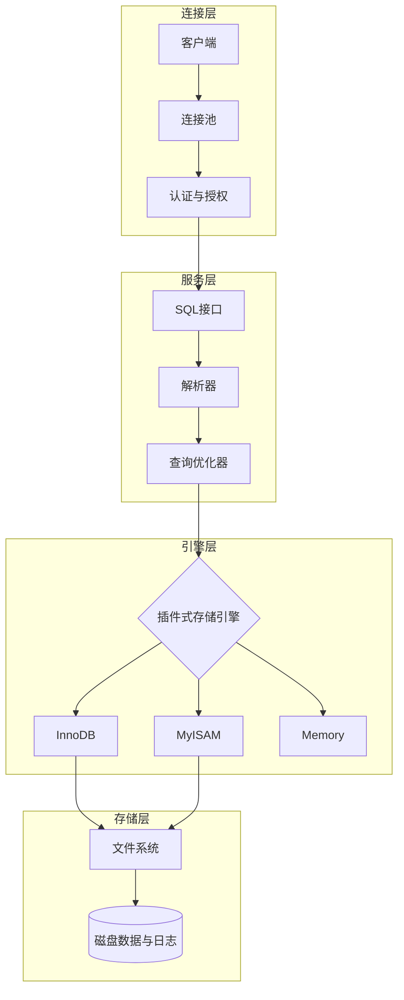
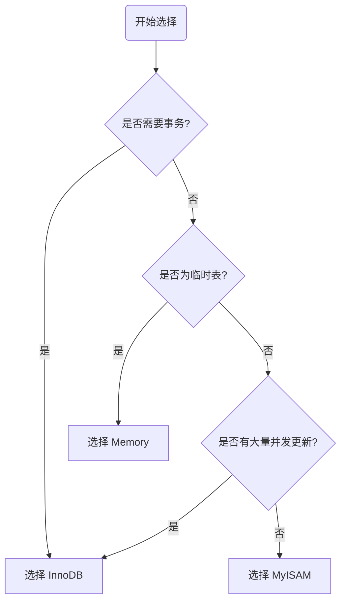
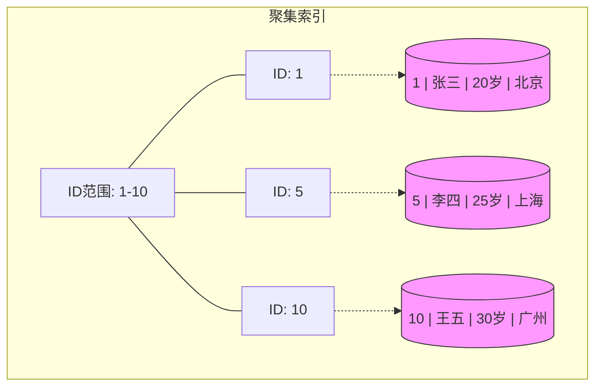
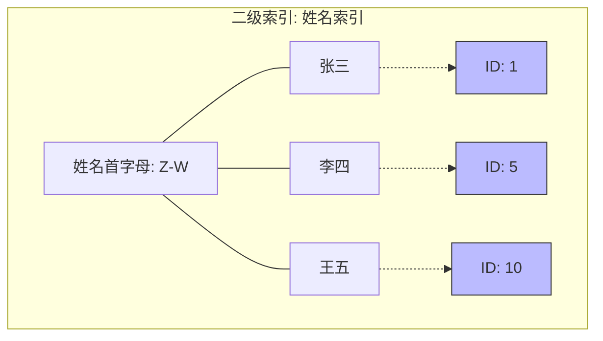

# 数据库家族的大地图

数据库主要分为两大派系，就像超市和杂货铺，各有用处：

| **类别**          | **代表选手**                  | **特点**                     | **比喻**   |
| --------------- | ------------------------- | -------------------------- | -------- |
| 关系型数据库 (SQL)    | MySQL, PostgreSQL, Oracle | 结构严谨，像 Excel 表格，数据之间有逻辑关联。 | 严谨的财务报表  |
| 非关系型数据库 (NoSQL) | MongoDB, Redis            | 格式灵活，速度快，适合存文档、缓存或社交网络。    | 随拿随放的储物盒 |

---

#  MySQL 入门第一课：揭开数据的面纱

### 1. 什么是数据库？

- **数据库 (DB，Database)：** 数据的集合。你可以把它想象成一个“存放数据的仓库”
     - 一堆结构化数据的集合
	- 比如：学生表、成绩表、用户表
	
- **数据(D,  Data)：** 库里存的内容
	- 数字、文字、图片、记录等
	- 是 DB 里的最小单位
    
- **数据库管理系统 (DBMS，Database Management System)：** 管理数据库的软件、工具。比如 MySQL 软件本身，它是那个“仓库管理员”，你不能直接闯进仓库拿东西，必须给管理员发指令。
    - 用来创建、操作、管理 DB
	- 例子：MySQL、Oracle、SQL Server、PostgreSQL
	
- **数据库系统（DBS，Database System）：** 整个一套完整系统= DB（数据） + DBMS（软件） + 应用程序 + 管理员 + 用户是最大的概念，包含前面所有

 
### 2. MySQL 的核心逻辑：表格思维

MySQL 是**关系型**数据库。它的核心逻辑就是：**万物皆表格**。

在 MySQL 里，数据是这样层层嵌套的：

1. **服务器 (Server)**：运行 MySQL 的机器。
    
2. **数据库 (Database)**：一个项目对应一个库（比如“我的商城”）。
    
3. **表 (Table)**：库里有很多表（比如“用户表”、“商品表”）。
    
4. **行 (Row)**：每一行代表一个具体的数据（比如“用户张三”）。
    
5. **列 (Column/Field)**：每一列代表一个属性（比如“年龄”、“性别”）。
    

---

### 3. 必须掌握的“专业术语”

在正式写代码前，先混个脸熟：

- **主键 (Primary Key)**：每张表必须有一个唯一的标识，就像你的**身份证号**，不能重复。
    
- **SQL (Structured Query Language)**：这是你跟“管理员”（MySQL）沟通的**唯一语言**。
    

---

### 4. 第一组 SQL 指令（CRUD）

几乎所有的数据库操作都逃不出这四个字：**增、删、改、查**。

- **C (Create) 增加**：
    
    SQL
    
    ```
    INSERT INTO users (name, age) VALUES ('张三', 25);
    ```
    
- **R (Retrieve) 查询**（最常用！）：
    
    SQL
    
    ```
    SELECT * FROM users WHERE age > 18;
    ```
    
- **U (Update) 修改**：
    
    SQL
    
    ```
    UPDATE users SET age = 26 WHERE name = '张三';
    ```
    
- **D (Delete) 删除**：
    
    SQL
    
    ```
    DELETE FROM users WHERE name = '张三';
    ```
    

> **温馨提示：** 删数据的时候千万别忘了写 `WHERE` 条件，否则你可能会体验到什么叫“从删库到跑路”！😅

---


### 5.连接命令

Bash

```
mysql -u root -p
```


- **`mysql`**：调用 MySQL 客户端程序。
    
- **`-u`**：后面紧跟用户名（User）。`root` 是系统的超级管理员账号。
    
- **`-p`**：代表密码（Password）。
    
    - **注意**：输入回车后，系统会提示 `Enter password:`，此时输入密码是**看不见**的（光标不会动），这是正常的安全保护机制，输完直接回车即可。
        

---


如果你的数据库不在本地电脑上，而是在远程服务器上，你需要告诉客户端去哪里找它：

Bash

```
mysql -h 127.0.0.1 -P 3306 -u root -p
```

- **`-h` (Host)**：数据库所在的 IP 地址（本地通常是 `127.0.0.1` 或 `localhost`）。
    
- **`-P` (Port)**：大写的 P，指定端口号。MySQL 默认端口是 `3306`。
    

---


你可以直接把密码写在命令里（注意 `-p` 和密码之间**不能有空格**）：

Bash

```
mysql -u root -p123456
```

> **安全警告**：极其不建议这样做！因为你的密码会以明文形式留在历史记录里，很容易被别人看到。

### 6. 为什么大家都学 MySQL？

- **免费开源**：不用花钱就能用在你的项目里。
    
- **资料多**：遇到问题，随便一搜就有答案。
    
- **性能稳**：不管是你的个人博客，还是像腾讯、阿里这样的大厂，都在大规模使用。

---
---


# MySQL 字段类型全解 (Cheat Sheet)

### 数值类型
![[MySQL笔记-7.png|697]]

|**类型**|**大小**|**有符号范围 (Signed)**|**无符号范围 (Unsigned)**|**用途建议**|
|---|---|---|---|---|
|**TINYINT**|1 字节|-128 ~ 127|0 ~ 255|小状态值、布尔模拟|
|**INT**|4 字节|-21亿 ~ 21亿|0 ~ 42.9亿|**最常用**，主键 ID|
|**BIGINT**|8 字节|极大范围|0 ~ 极大范围|雪花算法 ID、大数统计|
|**DECIMAL**|依赖定义|极其精确|极其精确|**金钱、财务数据**|
|**FLOAT/DOUBLE**|4/8 字节|很大|很大|科学计算、非精确小数|


### 字符串类型 (String Types)

用于存储文本、段落或二进制数据。

![[MySQL笔记-8.png]]

| **类型**         | **特点**    | **最大长度** | **用途建议**              |
| -------------- | --------- | -------- | --------------------- |
| **CHAR(n)**    | 定长字符串     | 255 字符   | 长度固定的数据（如：邮编、手机号、MD5） |
| **VARCHAR(n)** | **变长字符串** | 65535 字节 | **最常用**，姓名、地址、标题      |
| **TEXT**       | 长文本数据     | 64 KB    | 文章内容、备注、长描述           |
| **LONGTEXT**   | 极大文本      | 4 GB     | 超长文章、日志               |
| **BLOB**       | 二进制数据     | 64 KB    | 图片、文件（通常建议存路径，不存文件本身） |
*char相对于varchar性能略高但浪费磁盘空间，varchar相对于char性能略低但节约磁盘空间*

### 日期和时间类型 (Date and Time Types)

![[MySQL笔记-9.png]]

|**类型**|**格式**|**大小**|**特点**|
|---|---|---|---|
|**DATE**|`YYYY-MM-DD`|3 字节|仅日期（如：生日）|
|**TIME**|`HH:MM:SS`|3 字节|仅时间（如：持续时长）|
|**DATETIME**|`YYYY-MM-DD HH:MM:SS`|8 字节|**最常用**，绝对时间范围广|
|**TIMESTAMP**|`YYYY-MM-DD HH:MM:SS`|4 字节|带时区转换，适合记录修改时间|
|**YEAR**|`YYYY`|1 字节|仅年份|


### 选型 3 大原则 (Tips)

1. **够用就好**：如果年龄不会超过 200 岁，用 `TINYINT UNSIGNED` 就比 `INT` 省空间。
    
2. **尽量避免 NULL**：尽可能给字段设置 `NOT NULL`，并给定默认值。因为 `NULL` 会增加索引开销。
    
3. **金钱用 DECIMAL**：永远不要用 `FLOAT` 或 `DOUBLE` 存钱，因为它们存在舍入误差，`DECIMAL(10, 2)`（总长10位，2位小数）才是专业的。
    


### 实战代码示例 (DDL)


```sql
-- 创建一个学生表，涵盖常用类型
CREATE TABLE students (
    id INT PRIMARY KEY AUTO_INCREMENT,    -- 整数主键，自动增长
    name VARCHAR(50) NOT NULL,            -- 变长字符串，必填
    age TINYINT UNSIGNED,                 -- 无符号小整数
    balance DECIMAL(10, 2) DEFAULT 0.00,  -- 精确小数（存款）
    bio TEXT,                             -- 长文本（简介）
    birthday DATE,                        -- 日期
    created_at TIMESTAMP DEFAULT CURRENT_TIMESTAMP -- 自动生成记录时间
);
```


---
---


# SQL


## 1、SQL通用语法
  1. 可以单行或多行书写，以**分号**结尾
  2. 可以使用空格/缩进增强可读性
  3. SQL语句在windows上不区分大小写，但一般关键字建议使用大写，标识符小写
  4. SQL只认英文标点，中文标点直接报错


---
---


## 2、SQL分类

在 MySQL 的世界里，SQL 语句虽然多，但就像乐高积木一样，根据**功能**被分成了四大类（有时加上事务控制是五类）。

![[MySQL笔记-6.png]]
### 1. DDL（Data Definition Language 数据定义语言）

**关键词：结构 (Structure）     用来定义数据库对象（数据库、表、字段）**

它是用来**定义或修改数据库、表、索引**的结构。想象成你在设计一个 Excel 表格的表头（比如：这一列叫姓名，那一列叫年龄）。

- **CREATE**：创建数据库或表。
    
- **ALTER**：修改现有的表结构（比如增加一列）。
    
- **DROP**：删除整个表或数据库（**危险操作！**）。
    
- **TRUNCATE**：清空表里的所有内容，但保留表结构。


#### DDL--数据库操作

 查询
	查询所有数据库：show databases;
	查询当前数据库：select database();
 创建
	 create database [if not exists] 数据库名 [default charset 字符集]  [collate 排序规则]
	  ==**([...]表示可选参数)**==
	 *字符集不推荐使用utf8，mysql的utf8是阉割版：utfbmb3，最多只支持三个字节，不支持标准utf8的四字节（即utf8mb4），无法存emoji 和生僻字。所以字符集要指定为utf8mb4（默认也是）*
 删除
	 drop database [if exists] 数据库名;
 使用
	 use 数据库名
	 
**database也可以替换成schema，如：create schema db01**

#### DDL--表操作

*(注意要先选定数据库再操作)*

>*查询操作*
  查询当前数据库所有表
	show tables;
  查询表结构
	desc 表名;
  查询指定表的建表语句
	show create table 表名;
     


>*创建操作*
	create table 表名(
		  字段1 字段1类型[comment 字段1注释],
		  字段2 字段2类型[comment 字段2注释],
		  字段3 字段3类型[comment 字段3注释],
		  .....
		  字段n 字段n类型[comment 字段n注释]**这里不要加逗号**
  > )[comment 表注释];


>*修改操作*
  添加字段
	ALTER TABLE 表名 字段名 类型（长度）ADD  [COMMENT 注释]  [约束];
  修改数据类型
	ALTER TABLE 表名 MODIFY 字段名 新数据类型（长度）;
  修改字段名和字段类型
	ALTER TABLE 表名 CHANGE 旧字段名 新字段名 类型（长度）[COMMENT 注释]  [约束];
  删除字段
	 ALTER TABLE 表名 DROP 字段名;
  修改表名
	 ALTER TABLE 表名 RENAME TO 新表名;


  >*删除操作*
  删除表
	DROP TABLE [IF EXISTS] 表名;
  删除指定表，并重新创建该表 **表的数据清空**
	 TRUNCATE TABLE 表名;
  
---

### 2. DML（Data Manipulation Language 数据操作语言）

**关键词：增删改 (Data)   用来对数据库表中的数据增删改**

这是小白最常用的部分，用来对表里的**记录**进行操作。想象成你在 Excel 表格里填入具体的员工信息。

- **INSERT**：插入新数据。
    
- **UPDATE**：修改现有数据。
    
- **DELETE**：删除指定的行。

>*插入操作（必须按表结构顺序写全所有值)*
 指定列插入
	INSERT INTO 表名 (字段1, 字段2, ...) VALUES (值1, 值2, ...);
 全量插入
	INSERT INTO 表名 VALUES (值1, 值2, ...);
 批量插入
	INSERT INTO 表名 (字段1, 字段2...) VALUES (值A, 值B...), (值A, 值B...);
	INSERT INTO 表名  VALUES (值A, 值B...), (值A, 值B...);

>*修改操作*
	UPDATE 表名 SET 字段名1=值1, 字段名2=值2, ....[WHERE 条件];
	 **（若WHERE不存在，表示修改整张表的所有数据）**

>*删除操作*、
	DELETE FROM 表名 [WHERE 条件];
	**（若WHERE不存在，表示删除整张表的所有数据）**
	**（DELETE语句不能删除某一个字段的值，可以使用UPDATE加上NULL）**


---

### 3. DQL（Data Query Language 数据查询语言）

**关键词：看 (Read)   用来查询数据库中表的记录**

虽然它常被归在 DML 里，但因为它太重要了，通常单独拎出来。它是你从数据库里**提取信息**的唯一手段。

- **SELECT**：字段列表
- **FROM**：表名列表
- **WHERE**：条件列表
- **GROUP BY**：分段字段列表
- **HAVING**：分组后条件列表
- **ORDER BY**：排序字段列表
- **LIMIT**：分页参数


>*基本查询*
查询多个字段
	SELECT 字段1，字段2，字段3...FROM 表名;
	SELECT * FROM 表名;
设置别名
	SELECT 字段1[AS 别名1]，字段2[AS 别名2]...FROM 表名;
去除重复记录
	SELECT DISTINCT 字段列表 FROM 表名;


==若定义了别名，就不能再使用原名进行操作==


>*条件查询*
	SELECT 字段列表 FROM 表名 WHERE 条件列表;

 比较运算符

| **运算符**                 | **功能描述**                        | **示例**                  |
| ----------------------- | ------------------------------- | ----------------------- |
| `>`, `>=`, `<`, `<=`    | 大于、大于等于、小于、小于等于                 | `age >= 18`             |
| `=`, `<>` 或 `!=`        | 等于、不等于                          | `name != '张三'`          |
| **BETWEEN ... AND ...** | 在某个范围之内 (含最小值、最大值，不能倒过来)        | `age BETWEEN 15 AND 25` |
| **IN(...)**             | 在指定的集合/列表中，多选一                  | `id IN (1, 2, 3)`       |
| **LIKE 占位符**            | **模糊匹配**：`_` 匹配单个字符，`%` 匹配任意个字符 | `name LIKE '张%'` (姓张的人) |
| **IS NULL**             | 判断字段值是否为空                       | `email IS NULL`         |


逻辑运算符

|**运算符**|**功能描述**|**备选写法**|
|---|---|---|
|**AND**|并且 (所有条件必须同时成立)|`&&`|
|**OR**|或者 (多个条件只要有一个成立即可)|`|
|**NOT**|非，不是|`!`|


>*聚合函数* **(将一列数据作为一个整体，进行纵向计算)**
	SELECT 聚合函数(字段列表) FROM 表名;


常见聚合函数
**注意：所有的聚合函数都会忽略 NULL 值**

|**函数**|**功能**|
|---|---|
|**count**|统计数量（行数）|
|**max**|最大值|
|**min**|最小值|
|**avg**|平均值|
|**sum**|求和|


>*分组查询*
	SELECT 字段列表 FROM 表名 [WHERE 条件] GROUP BY 分组字段名 [HAVING 分组后过滤条件];


 where 与 having 的区别

|**区别点**|**where**|**having**|
|---|---|---|
|**执行时机不同**|**分组之前**进行过滤。不满足条件的不参与分组。|**分组之后**对结果进行过滤。|
|**判断条件不同**|**不能**对聚合函数进行判断。|**可以**对聚合函数进行判断。|

> [!tip] 
> 1. **执行顺序**：`where` > `聚合函数` > `having`。
> 2. **查询字段限制**：分组之后，`SELECT` 后面的字段一般只能是 **分组字段** 和 **聚合函数**。查询其他字段通常没有意义，因为一个组里有很多行，数据库不知道你要显示哪一行。


>*排序查询*
	SELECT 字段列表 FROM 表名 ORDER BY 字段1 排序方式1，字段2 排序方式2;

- ASC: 升序（默认值）
- DESC:降序
**如果是多字段排序，当第一个字段相同时，才会根据第二个字段进行排序**


>*分页查询*
	SELECT 字段列表 FROM 表名 LIMIT 起始索引，查询记录数;

> [!tip] 
> - 起始索引从0开始，起始索引=（查询页码-1）* 每页显示记录数
> - 分页查询是数据库的方言，不同的数据库有不同的实现，MYSQL是LIMIT
> - 如果查询的是第一页数据，起始索引可以省略，直接简写为LIMIT 10
> 


#### 1. 编写顺序（你写代码时的样子）

1. **SELECT**（查什么）
    
2. **FROM**（从哪查）
    
3. **WHERE**（分组前的过滤条件）
    
4. **GROUP BY**（如何分组）
    
5. **HAVING**（分组后的过滤条件）
    
6. **ORDER BY**（怎么排序）
    
7. **LIMIT**（取多少条）


#### 2. 执行顺序（MySQL 运行时的样子）


|**步骤**|**指令**|**逻辑描述**|
|---|---|---|
|**1**|**FROM**|先找到那是哪张表。|
|**2**|**WHERE**|按照条件，把不合格的行剔除掉。|
|**3**|**GROUP BY**|将剩下的数据分成一个个小组。|
|**4**|**HAVING**|对分好组后的结果再进行一次筛选。|
|**5**|**SELECT**|**重点！** 到这一步才决定要把哪些列挑出来。|
|**6**|**ORDER BY**|选出来的结果最后排个序。|
|**7**|**LIMIT**|排序完了，切下前面或中间的几段。|


---


### 4. DCL（Data Control Language 数据控制语言）

**关键词：权限 (Permission)   用来创建数据库用户、控制数据库的访问权限**

这是“管理员”干的活，用来定义谁能看、谁能改。

- **GRANT**：授予用户访问权限。
    
- **REVOKE**：撤销用户的权限。
    


>*管理用户*
   查询用户
	USE mysql;
	SELECT * FROM user;
	**(或者直接找到mysql数据库下的user表查看也可以)**
   创建用户
	CREATE USER '用户名' @ '主机名' IDENTIFIED BY '密码';
   修改用户密码
	ALTER USER '用户名' @ '主机名' IDENTIFIED WITH mysql_native_password BY '新密码'
   删除用户
	DROP USER '用户名' @ '主机名'

> [!tip] 
> - 主机名可以使用%通配，表示在任意主机都允许操作
>   （如创建用户时使用%表示该用户可以在任意一台电脑上访问数据库）
> - 这类sql开发人员操作的比较少，主要是DBA（Database Administrator 数据库管理员使用）


>*权限控制*
   查询权限
	SHOW GRANTS FOR '用户名' @ '主机名';
   授予权限
	GRANT 权限列表 ON 数据库名.表名 TO '用户名' @ '主机名';
   撤销权限
	REVOKE 权限列表 ON 数据库名.表名 FROM '用户名' @ '主机名';

> [!tip] 
> - 多个权限之间，使用逗号分隔
> - 授权时，数据库名和表名可以使用 * 进行通配

---

### 5. TCL（事务控制语言）

**关键词：后悔药 (Transaction)**

专门用于维护数据的**一致性**，常用于银行转账等严谨场景。

- **COMMIT**：确认提交（把修改永久存盘）。
    
- **ROLLBACK**：回滚（发现操作错了，瞬间恢复到修改前）。
    
- **SAVEPOINT**：设置保存点（类似游戏的存档点）。
    

---
---


# 函数

*SELECT 函数（参数）*


## 字符串函数


| **函数**                       | **功能**                                     | **示例**                                     |
| ---------------------------- | ------------------------------------------ | ------------------------------------------ |
| **CONCAT(s1, s2...n)**       | 字符串拼接                                      | `CONCAT('Hello', 'MySQL')` -> `HelloMySQL` |
| **LOWER(str)**               | 全部转小写                                      | `LOWER('Hello')` -> `hello`                |
| **UPPER(str)**               | 全部转大写                                      | `UPPER('Hello')` -> `HELLO`                |
| **LPAD(str，n，pad) **         | 左填充，用字符串pad对str的左边进行填充，达到n个字符长度            | `LPAD('01', 5, '-')` -> `---01`            |
| **RPAD(str，n，pad)**          | 右填充，用字符串pad对str的右边进行填充，达到n个字符长度            | `RPAD('01', 5, '-')` -> `01---`            |
| **TRIM(str)**                | 去除左右空格（不去除中间的）                             | `TRIM(' Hello ')` -> `Hello`               |
| **SUBSTRING(str，start，len)** | 截取字符串，返回字符串str从start位置起的len个长度的字符串（索引从1开始） | `SUBSTRING('Hello', 1, 3)` -> `Hel`        |

## 数值函数

|**函数**|**功能**|**示例**|
|---|---|---|
|**CEIL(x)**|向上取整|`CEIL(1.1)` -> `2`|
|**FLOOR(x)**|向下取整|`FLOOR(1.9)` -> `1`|
|**MOD(x, y)**|取模（求余）|`MOD(7, 4)` -> `3`|
|**RAND()**|获取 0~1 随机数|`RAND()`|
|**ROUND(x, y)**|四舍五入|`ROUND(2.345, 2)` -> `2.35`|
## 日期函数

| **函数**                                | **功能**                      | **示例**                                 |
| ------------------------------------- | --------------------------- | -------------------------------------- |
| **CURDATE()**                         | 返回当前日期                      | `2024-05-20`                           |
| **CURTIME()**                         | 返回当前时间                      | `13:14:00`                             |
| **NOW()**                             | 返回当前日期+时间                   | `2024-05-20 13:14:00`                  |
| **YEAR(date)**                        | 获取指定data的年份                 | `YEAR(NOW())`                          |
| **MONTH(date)**                       | 获取指定data的月份                 | `MONTH(NOW())`                         |
| **DAY(date)**                         | 获取指定data的日期                 | `DAY(NOW())`                           |
| **DATE_ADD(data，INTERVAL expr type)** | 返回一个日期/时间值加上一个时间间隔expr后的时间值 | `DATE_ADD(NOW(), INTERVAL 1 YEAR)`     |
| **DATEDIFF(d1, d2)**                  | 计算两个日期相差天数                  | `DATEDIFF('2024-10-01', '2024-01-01')` |

## 流程函数


| **函数**                                                 | **功能**                                                        | **示例**                           |
| ------------------------------------------------------ | ------------------------------------------------------------- | -------------------------------- |
| **IF(value, t, f)**                                    | 如果 value 为 True，返回 t；否则返回 f                                   | 判断及格：`IF(score>=60, '及格', '挂科')` |
| **IFNULL(v1, v2)**                                     | 如果 v1 不为 NULL，返回 v1；否则返回 v2                                   | 填充空地址：`IFNULL(address, '地址不详')`  |
| **ISNULL(v1)**                                         | 判断 v1是否为 NULL，是则返回 1，否则返回 0                                   | 筛选空值记录                           |
| **COALESCE(v1, v2, ...vn)**                            | 返回参数列表中的第一个非空值                                                | 多级备选方案填充                         |
| **CASE WHEN [v1] THEN [r1] ... ELSE [res] END**        | 如果v1为true，返回res1，...否则返回default默认值。类似于 `if-else`，进行范围或多条件判断   | 划分成绩等级（优/良/中/差）                  |
| **CASE [expr] WHEN [v1] THEN [r1] ... ELSE [res] END** | 如果expr的值等于v1，返回res1，...否则返回default默认值。类似于编程里的 `switch`，进行等值匹配 | 根据代码显示部门名称                       |


---
---


# 约束(Constraints)


## 概述

### 1. 概念

约束是作用于表中字段上的规则，用于限制存储在表中的数据，可以在创建表/修改表时添加约束

### 2. 目的

保证数据库中数据的**正确性**、**有效性**和**完整性**。

### 3. 约束分类详解

| **约束名称** | **描述**                              | **关键字**                          |
| -------- | ----------------------------------- | -------------------------------- |
| **非空约束** | 限制该字段的数据不能为 `null`                  | `NOT NULL`                       |
| **唯一约束** | 保证该字段的所有数据都是唯一、不重复的                 | `UNIQUE`                         |
| **主键约束** | 主键是一行数据的唯一标识，要求**非空且唯一**            | `PRIMARY KEY（自增：AUTO_INCREMENT）` |
| **默认约束** | 保存数据时，如果未指定该字段的值，则采用默认值             | `DEFAULT`                        |
| **检查约束** | 保证字段值满足某一个条件（适用于 MySQL 8.0.16 版本之后） | `CHECK`                          |
| **外键约束** | 让两张表的数据之间建立连接，保证数据的一致性和完整性          | `FOREIGN KEY`                    |

---


## 约束演示
```mysql
CREATE TABLE users (
    id INT PRIMARY KEY AUTO_INCREMENT,   -- 主键，且自动增长
    name VARCHAR(10) NOT NULL UNIQUE,    -- 不准为空，且名字不能重复
    age INT CHECK (age > 0 AND age < 120), -- 检查约束，年龄必须在合理范围内
    status CHAR(1) DEFAULT '1',          -- 默认约束，不传值时默认为 '1'
    gender CHAR(1)                       -- 无约束
);

```


---


## 外键约束(Foreign Key)

### 概念

外键用来让两张表的数据建立连接。

- **父表（主表）**：被引用的表（如：部门表）。
    
- **子表（从表）**：引入外键的表（如：员工表）。

### 语法

*A. 建表时添加*
CREATE TABLE 表名 (
	字段名 数据类型;
	 ...
    CONSTRAINT 外键约束名称 FOREIGN KEY (外键字段名 **要用上面定义好的字段名** ) REFERENCES 主表（主表字段名）
);


*B. 后期添加外键：*
ALTER TABLE 表名 ADD CONSTRAINT 外键约束名称 FOREIGN KEY (外键字段名) REFERENCES 主表 (主表字段名) [ON UPDATE 行为 ON DELETE 行为];


| **行为**          | **说明**                                                                |
| --------------- | --------------------------------------------------------------------- |
| **NO ACTION**   | **默认行为**。在父表中删除/更新记录时，首先检查该记录是否有对应外键，如果有则**不允许**删除/更新。（与 RESTRICT 一致） |
| **RESTRICT**    | 在父表中删除/更新记录时，首先检查该记录是否有对应外键，如果有则**不允许**删除/更新。（与 NO ACTION 一致）         |
| **CASCADE**     | **级联行为**。在父表中删除/更新记录时，首先检查该记录是否有对应外键，如果有，则**同步删除/更新**子表中的记录。          |
| **SET NULL**    | 在父表中删除记录时，首先检查该记录是否有对应外键，如果有，则**设置子表中该外键值为 null**。（要求子表外键列允许取 null）   |
| **SET DEFAULT** | 父表有变更时，子表将外键列设置成一个默认值（**注意：InnoDB 存储引擎不支持此行为**）。                      |


*B. 删除外键：*
ALTER TABLE 表名 DROP FOREIGN KEY 外键约束名称;  **(必须用约束名不是字段名，因为一个字段可以有多个约束)**


# 多表查询

## 单表查询和多表查询

这是数据库学习中最重要的一道分水岭。如果说单表查询是在**一张表里翻账本**，那么多表查询就是**跨表找关联**，将支离破碎的数据拼凑成完整的信息。

---

|**维度**|**单表查询 (Single Table)**|**多表查询 (Multi-Table / Join)**|
|---|---|---|
|**数据源**|只有一个数据来源|两个或多个数据来源|
|**复杂度**|简单，逻辑直接|复杂，需要寻找表与表之间的“连接点”|
|**应用场景**|获取基础信息（如：查某个人的年龄）|获取完整业务逻辑（如：查张三的**部门名称**）|
|**性能**|极快|随着表数量和数据量增加，开销变大|

为了减少数据冗余（相同数据不存两遍），数据库设计遵循**范式**。

- `users` 表只存角色的 ID（数字）。
    
- `roles` 表存角色 ID 对应的真实名称。
    
    要看到“张三 - 管理员”，就必须把两张表连起来。


## 概述

概述：指从多张表中查询数据

笛卡尔积：在数学中指两个集合A集合和B集合的所有组合情况 **(在多表查询时，需要消除无效的笛卡尔积)**
>[!danger]
>如果你查询两张表但不写 `WHERE` 或 `ON` 条件，会发生灾难：
   A 表 10 行，B 表 10 行，结果会产生 $10 \times 10 = 100$ 行。


## 关系

### 1. 一对多(多对一)


- 案例：部门与员工的关系
- 关系：一个部门对应多个员工
- 实现：**在多的一方建立外键，指向少的一方的主键**


### 2.多对多

- 案例：学生与课程的关系
- 关系：一个学生可以选修多门课程，一门课程也可以供多个学生选择
- 实现：**建立第三张中间表，中间表至少包含两个外键，分别关联两方主键**

### 3.一对一

- 案例：用户与用户详情的关系
- 关系：多用于单表拆分，将一张表的基础字段放在一张表中，其他详情字段放在另一张表中，以提升操作效率
- 实现：**在任意一方加入外键，关联另外一方的主键，并且设置外键为唯一的(UNIQUE)**

## 分类

### 1. 连接查询 (Join Queries)

这是最常用的分类，通过两个表之间的关联字段（通常是外键）来合并列。

#### A. 内连接 (Inner Join)


- **隐式内连接**：使用 `WHERE` 指定连接条件。
		SELECT 字段列表 FROM 表1，表2 WHERE 连接条件...;
    
- **显式内连接**：使用 `INNER JOIN ... ON ...`（推荐，语义更清晰）。                  SELECT 字段列表 FROM 表1 [INNER] JOIN 表2 ON 条件...;
    
- 逻辑：只返回两张表中**完全匹配**的记录（取交集）。
    

#### B. 外连接 (Outer Join)

- **左外连接 (Left Join)**：返回左表所有记录，以及右表中符合条件的记录。右表不匹配的显示为 `NULL`。SELECT 字段列表 FROM 表1 LEFT [OUTER] JOIN 表2 ON 条件...;
    
- **右外连接 (Right Join)**：返回右表所有记录，左表不匹配的显示为 `NULL`。SELECT 字段列表 FROM 表1 RIGHT [OUTER] JOIN 表2 ON 条件...;
    

#### C. 自连接 (Self Join)

- 语法：SELECT 字段列表 FROM 表A 别名A JOIN 表A 别名B ON 条件...;**自链接查询必须给表起别名，可以是内链接查询也可以是外链接查询**

- 逻辑：把一张表当成两张甚至多张表来看待。通常用于处理表内部的层级关系（如：员工与领导、菜单与子菜单）。


---

### 2. 联合查询 (Union Queries)

- 语法：SELECT 字段列表 FROM 表A ... UNION [ALL] SELECT 字段列表 FROM 表B ...;**查询的字段列表数必须保持一致**
- 逻辑：将多次查询的结果集合并在一起，形成一个新的结果集（纵向堆叠）。
- 分类：
    
    - `UNION ALL`：直接合并，保留所有重复记录。
        
    - `UNION`：合并后去重。
        

---

### 3. 子查询 /嵌套查询(Subquery)

- 逻辑：在一个查询语句中嵌套另一个查询语句。这是最灵活但也最考验逻辑的部分。
- 语法：SELECT * FROM 表1 WHERE 字段列表1=（SELECT 字段列表2 FROM 表2）

根据**返回结果**的不同，子查询可以分为：

|**分类**|**返回结果特征**|**常用操作符**|
|---|---|---|
|**标量子查询**|返回单个值（一行一列）|`=`, `<>`, `>`, `<`|
|**列子查询**|返回一列（多行一列）|`IN`, `ANY`, `SOME`, `ALL`|
|**行子查询**|返回一行（一列多行）|`=`, `<>`, `IN`|
|**表子查询**|返回一个临时表（多行多列）|`IN` (常用于 FROM 之后)|

|**操作符**|**描述**|
|---|---|
|**IN**|在指定的集合范围之内，多选一|
|**NOT IN**|不在指定的集合范围之内|
|**ANY**|子查询返回列表中，有任意一个满足即可|
|**SOME**|与 ANY 等同，使用 SOME 的地方都可以使用 ANY|
|**ALL**|子查询返回列表的所有值都必须满足|

根据**嵌套位置**的不同，可以分为：

- `WHERE` 之后：作为过滤条件。
    
- `FROM` 之后：作为临时表。
    
- `SELECT` 之后：作为结果字段。
    

---
---


# 事务


在数据库的世界里，**事务 (Transaction)** 是确保数据“绝对安全”的终极手段。

简单来说，事务就是**一组操作的集合**，它把所有的命令看作一个不可分割的整体。这组操作要么**全部成功**，要么**全部失败**（就像没发生过一样）。

---

## 1. 为什么要用事务？（经典案例）

银行转账是最直观的例子：

1. A 账户余额 -1000 元。
    
2. B 账户余额 +1000 元。
    

如果第一步成功了，执行第二步时突然断电或服务器崩溃，A 的钱没了，B 也没收到钱。事务的作用就是：如果第二步失败，第一步的 -1000 元必须“退回来”


---

## 2. 事务的操作流程

MySQL 默认是**自动提交**事务的（执行一条 SQL，就立刻写入磁盘）。要使用事务，我们需要手动控制：

### A. 方案一：手动开启

```sql
-- 1. 开启事务
START TRANSACTION（或直接START）;  -- 或者使用 BEGIN;

-- 2. 执行一组 SQL 语句
UPDATE account SET money = money - 1000 WHERE name = '张三';
UPDATE account SET money = money + 1000 WHERE name = '李四';

-- 3. 提交事务（只有执行了这一步，数据才真正永久改变）
COMMIT;

-- 如果中间出错了，执行回滚（撤销刚才所有操作）
ROLLBACK;
```

### B. 方案二：修改自动提交设置

```sql
SELECT @@autocommit; -- 查看设置（1为自动，0为手动）
SET @@autocommit = 0; -- 设置为手动提交


-- 提交事务（只有执行了这一步，数据才真正永久改变）
COMMIT;

-- 如果中间出错了，执行回滚（撤销刚才所有操作）
ROLLBACK;
```


### 回滚的意义

你可能会想：“既然我不点 `COMMIT` 数据就不变，那出错了我不点 `COMMIT` 不就行了吗？为啥非要多此一举写个 `ROLLBACK`？”

其实，**回滚（ROLLBACK）** 的意义主要在于以下三个维度：

---

#### 1. 释放锁资源（性能关键）

这是最实操的原因。当你开启事务并执行 `UPDATE` 或 `DELETE` 时，MySQL 会给这些数据行加上**行锁**。

- **如果你不回滚也不提交**：这些锁会一直被这个连接占用。
    
- **后果**：其他想要修改这些数据的连接会一直处于“等待”状态，直到超时。这会导致数据库连接池爆满，整个系统“卡死”。
    
- **意义**：`ROLLBACK` 会立刻告诉数据库：“这个操作我不要了，赶紧把锁解开让别人用。”
    

---

#### 2. 清理内存缓存（数据一致性）

当你执行 SQL 时，数据其实已经在数据库的 **Buffer Pool（缓冲池）** 中被修改了。

- **如果不回滚**：虽然磁盘上的原始数据没变，但当前这个连接（Session）后续的查询可能会读到这些“脏数据”。
    
- **意义**：`ROLLBACK` 会清除内存中的这些临时改动，将数据状态彻底恢复到事务开始前的样子，确保内存与磁盘的逻辑统一。
    

---

#### 3. 程序逻辑的“终点站”（代码严谨性）

在 Java 或 Python 编写的后端程序中，事务通常是这样写的：


```java
try {
    // 开启事务
    // 执行 SQL 1
    // 执行 SQL 2 (假设这里报错了)
    connection.commit();
} catch (Exception e) {
    // 如果出错了，必须手动调用 rollback
    connection.rollback(); 
}
```

- **意义**：在程序逻辑里，一个事务必须有一个**明确的终点**（要么成功提交，要么失败回滚）。如果你不写 `rollback()`，这个连接回到连接池时可能还带着未完成的事务状态，会导致下一个用到这个连接的业务逻辑出现不可预知的错误。


---

#### 4. 自动提交 vs 手动提交

你说的“数据不会修改”，其实是因为 MySQL 默认开启了 `autocommit`，而你手动开启事务时暂时关闭了它。

- 如果你**掉线了**或者**客户端崩溃了**：MySQL 的后台进程发现连接断开，会自动帮你执行 `ROLLBACK`。
    
- 但作为开发者，我们不能指望“崩溃自救”，**主动回滚**是保证程序健壮性的基本职业素养。
    

---


> [!Abstract] 为什么要回滚？
> 
> 1. **解锁**：释放行级锁，防止系统死锁和阻塞。
>     
> 2. **归位**：把内存中修改过的“脏页”数据复原。
>     
> 3. **闭环**：给程序一个明确的失败反馈，防止连接池污染。
>     

**所以，`ROLLBACK` 不是给数据看的（数据确实没持久化），而是给“资源”和“逻辑”看的。**


---
---


## 3. 事务的四大特性 (ACID)

事务的四大特性通常被称为 **ACID**，这是数据库管理系统（DBMS）为了保证即使在系统崩溃或并发操作时，数据依然能保持准确而设立的四根支柱。

| **特性**  | **英文**          | **核心目标** | **描述**                                |
| ------- | --------------- | -------- | ------------------------------------- |
| **原子性** | **A**tomicity   | 操作的完整性   | 事务是不可分割的最小单位，要么全成功，要么全失败。             |
| **一致性** | **C**onsistency | 数据的合法性   | 事务完成时，必须使所有数据都保持一致状态。                 |
| **隔离性** | **I**solation   | 并发的安全性   | 数据库系统提供的隔离机制，保证事务在不受外部并发操作影响的独立环境下运行。 |
| **持久性** | **D**urability  | 存储的稳定性   | 事务一旦提交，对数据库中数据的改变就是永久性的。              |


你可以把事务想象成一次“**银行转账**”操作，通过这个例子来理解这四个特性：

---

### 1. 原子性 (Atomicity) —— “要么全部，要么零”

- **概念**：事务被视为一个不可分割的最小单位。事务中的所有操作，要么全部成功执行并永久写入数据库，要么全部失败并回滚到事务开始前的状态。
    
- **场景**：转账时，“A账号扣钱”和“B账号加钱”必须同时成功。如果A扣了钱，系统突然宕机导致B没加钱，原子性会强制让A扣掉的钱“退回来”。
    
- **口诀**：**不准半途而废。**
    

---

### 2. 一致性 (Consistency) —— “守恒定律”

- **概念**：事务完成时，必须使数据库从一个一致性状态变换到另一个一致性状态。这意味着数据必须符合所有的预设规则（如余额不能为负数、外键必须对应等）。
    
- **场景**：转账前后，A和B两人的总金额应该是**守恒**的。如果转账前两人共 2000 元，转账后不管成没成功，两人加起来还必须是 2000 元。
    
- **口诀**：**能量守恒，数据合规。**
    

---

### 3. 隔离性 (Isolation) —— “独立空间”

- **概念**：当多个用户并发访问数据库时，数据库为每一个用户开启的事务，不被其他事务的操作所干扰。多个并发事务之间要相互隔离。
    
- **场景**：你正在给朋友转账 1000 元（事务A），此时公司正好给你发 5000 元工资（事务B）。隔离性保证这两个操作在执行时互不干扰，不会因为同时操作你的余额而算错账。
    
- **口诀**：**互不打扰，各做各的。**
    

---

### 4. 持久性 (Durability) —— “落笔生根”

- **概念**：一旦事务提交（Commit），它对数据库中数据的改变就是永久性的。即使随后系统发生崩溃（如断电、磁盘坏道），只要数据已经写入磁盘，就不会丢失。
    
- **场景**：你看到屏幕提示“转账成功”的那一秒，即便银行的服务器立刻烧了，你的钱也已经转过去了，数据不会因为断电而“反悔”。
    
- **口诀**：**提交即永久，雷打不动。**
    

---


### 深入思考：谁是核心？

在 ACID 中，**一致性 (C)** 是最终目的。而 **原子性 (A)**、**隔离性 (I)** 和 **持久性 (D)** 都是数据库为了达到“一致性”而采取的手段。

- **原子性**靠 `Undo Log`（回滚日志）来实现。
    
- **持久性**靠 `Redo Log`（重做日志）来实现。
    
- **隔离性**靠 `锁机制` 和 `MVCC`（多版本并发控制）来实现。

---
---
## 4. 并发事务问题

当多个事务同时操作同一批数据时，可能会产生以下“灵异事件”：

1. **脏读 (Dirty Read)**：一个事务读到了另一个事务**还没提交**的数据。
    
2. **不可重复读 (Non-Repeatable Read)**：一个事务先后读取同一条记录，但两次读到的**结果不同**（读到了另一个事务提交的数据）。
    
3. **幻读 (Phantom Read)**：一个事务按条件查询，没查到记录，但插入时发现记录已存在（仿佛出现了幻觉）。


### 脏读 (Dirty Read)

关键词：读到了“半成品”

- **场景模拟**：
    
    1. **事务A（公司财务）**：准备发奖金，把你的余额从 5000 改成了 10000（**还没点提交**）。
        
    2. **事务B（你）**：这时你刚好查余额，发现是 10000，乐坏了。
        
    3. **事务A（财务）**：突然发现算错了，赶紧点了 **ROLLBACK（回滚）**。
        
    4. **结果**：你的余额回到了 5000，但你刚才读到的 10000 就是“脏数据”。
        

> **本质**：一个事务读到了另一个事务**回滚前**的临时数据。

---

### 不可重复读 (Non-Repeatable Read)

关键词：前后读得不一样（针对 Update）

- **场景模拟**：
    
    1. **事务A（你）**：打算去买个 8000 的相机。先查余额，发现有 10000，心想够了。
        
    2. **事务B（自动扣费）**：就在你盯着屏幕犹豫的一秒内，房租自动扣款 3000 并**提交成功**。
        
    3. **事务A（你）**：你点击“付款”前，系统又确认了一遍余额，发现只剩 7000 了。
        
    4. **结果**：你很纳闷：“我刚才看还是 10000 呢，怎么一眨眼就变了？”
        

> **本质**：同一事务内，同样的查询语句，第二次读到了别人**已经提交修改**过后的数据。

---

### 幻读 (Phantom Read)

关键词：查询时没有，插入时却报错（针对 Insert）

这个最难理解。它通常发生在解决了“不可重复读”之后。

- **场景模拟**：
    
    1. **事务A（管理员）**：想注册一个账号 `admin`。先查一下：`SELECT * FROM users WHERE name='admin'`。结果：**空（没人注册）**。
        
    2. **事务B（路人甲）**：抢先一步注册了 `admin` 并**提交成功**。
        
    3. **事务A（管理员）**：心想既然没人注册，那我就执行 `INSERT INTO users (name) VALUES ('admin')`。
        
    4. **结果**：数据库报错：“主键重复！”。管理员心想：“刚才查明明没有啊，怎么插不进去？见鬼了？”
        

> **本质**：虽然解决了数据被改的问题，但没解决**新数据插入**的问题。

---

### 未commit的数据为什么会被读到?


你可能会想：“既然数据还没最后确认（Commit），它不应该还‘飘’在内存里吗？数据库为什么要把它给别人看呢？”

其实，“脏读”出现的本质原因在于：**数据库为了追求极致的性能，默认关闭了某些“防撞”保护。**

以下是底层发生的过程：

---

#### 1. 数据的“落笔”过程

在数据库底层，当你执行一条 `UPDATE` 语句时，数据并不是直接修改磁盘文件，而是经历了以下路径：

1. **Buffer Pool（内存缓冲池）**：数据库先在内存中把这行数据改了。
    
2. **Undo Log（回滚日志）**：记录下改之前长啥样，万一你要撤销。
    
3. **Redo Log（重做日志）**：记录下你打算怎么改，防止断电。
    

**重点来了：** 在“读未提交（Read Uncommitted）”这个级别下，数据库允许另一个事务直接去 **Buffer Pool（内存）** 里读取那些已经被改掉、但还没打上“已提交”标记的数据。

---

#### 2. 为什么要设计这种“不准”的级别？

你可能会觉得这设计很“蠢”，但它存在的唯一理由是：**快，快到了极致。**

- **没有锁等待**：在读取数据时，它完全不去看这行数据是不是正在被别人改，也不去管什么版本链。
    
- **零开销**：它不需要维护复杂的“快照”或“视图”，看到什么拿什么。
    
- **适用场景**：在一些对准确性要求极低、但对速度要求极高的场景（比如：实时统计某个大屏上的点赞数，多一个少一个没关系，但不能卡顿）。
    

---

#### 3. 为什么更高隔离级别就不会读到？

为了解决这个问题，数据库引入了 **MVCC（多版本并发控制）** 机制。

当隔离级别提高到“读已提交（Read Committed）”或以上时：

- 如果数据还没提交，数据库会根据 **Undo Log** 里的记录，在内存中瞬间为你“还原”出一个修改前的版本。
    
- 你读到的是那个**旧版本**，而别人改的是**新版本**，互不干扰。
    


---

### 为什么会出现这些情况？

出现这些问题的根本原因，是数据库在性能（并发量）与一致性（数据准不准）之间做权衡。

- 如果我们让所有人排队，一个一个来（**串行化 Serializable**），这些问题全都没有，但数据库会慢得像蜗牛。
    
- 为了快，我们允许大家同时操作，这就产生了上述冲突。
    


---
---


## 5. 事务隔离级别

为了解决上面的并发问题，MySQL 提供了四个隔离级别：

|**隔离级别**|**脏读**|**不可重复读**|**幻读**|**性能**|
|---|---|---|---|---|
|**Read Uncommitted**|✅有|✅有|✅有|最高|
|**Read Committed**|❌无|✅有|✅有|中|
|**Repeatable Read** (MySQL默认)|❌无|❌无|✅有|较好|
|**Serializable** (串行化)|❌无|❌无|❌无|最低|

```sql
-- 查看当前系统的隔离级别
SELECT @@transaction_isolation;

-- 设置当前会话（Session）的隔离级别
SET SESSION TRANSACTION ISOLATION LEVEL READ COMMITTED;

-- 设置全局（Global）隔离级别（影响后续新连接）
SET GLOBAL TRANSACTION ISOLATION LEVEL REPEATABLE READ;
```


### 1. Read Uncommitted (读未提交)

- **原理**：基本不加锁。事务 A 改了内存里的数据，事务 B 马上就能看见，管你提交没提交。
    
- **评价**：基本没人用，太危险。
    

### 2. Read Committed (读已提交)

- **原理**：**每次执行语句时**都会生成一个最新的“快照”（Read View）。
    
- **效果**：解决了脏读。如果事务 A 还没提交，事务 B 查不到它的改动。
    
- **缺点**：同一个事务里，如果你查两次，中间别人提交了，你两次结果会不一样（不可重复读）。
    
- **应用**：Oracle 和 SQL Server 的默认级别。
    

### 3. Repeatable Read (可重复读) —— MySQL 默认

- **原理**：**事务开启时的第一条查询语句**会生成一个“快照”，整个事务期间都用这张旧照片。
    
- **效果**：解决了不可重复读。不管别人怎么改并提交，你看到的永远是事务刚开始时的样子。
    
- **黑科技**：MySQL 在这个级别下通过 **Next-Key Locks（间隙锁）** 很大程度上也解决了幻读问题。
    

### 4. Serializable (串行化)

- **原理**：所有的查询都会隐式加锁。如果有人在改，你就得等着；如果你在读，别人想改也得等着。
    
- **效果**：万无一失，完全排队。
    
- **评价**：除非对账等极度严苛的场景，否则不用，因为它会让并发量直接归零。


---
---


# 存储引擎

## MySQL体系结构




### 1. 连接层 (Connectors & Connection Pool)

- **功能**：负责处理客户端的连接请求。
    
- **核心工作**：
    
    - **连接池**：管理连接，避免频繁创建/销毁连接的开销。
        
    - **身份验证**：校验用户名、密码。
        
    - **权限校验**：检查该用户是否有权限操作某个数据库或表。
        

### 2. 服务层 (SQL Interface & Parser & Optimizer)

这是 MySQL 的“大脑”，所有跨存储引擎的功能都在这里实现。

- **SQL Interface**：接收 SQL 命令，返回查询结果。
    
- **Parser (解析器)**：对 SQL 进行词法、语法分析，生成“解析树”（判断你 SQL 写得对不对）。
    
- **Optimizer (查询优化器)**：**最关键的一步**。它会决定使用哪个索引，或者决定表的连接顺序，选出它认为“代价最低”的执行计划。
    
- **Cache (缓存)**：MySQL 8.0 之前有查询缓存，但因为命中率低且维护成本高，8.0 后被彻底废除。
    

### 3. 引擎层 (Pluggable Storage Engines)

MySQL 的核心特色。

- **特点**：存储引擎是基于表的，而不是基于数据库的。
    
- **常用引擎**：
    
    - **InnoDB**：默认引擎。支持**事务 (ACID)**、行级锁、外键。
        
    - **MyISAM**：读取速度快，但不支持事务，只有表级锁。
        
    - **Memory**：数据存在内存中，速度极快，但断电即失。
        

### 4. 存储层 (File System)

- **功能**：将数据和日志（Redo, Undo, Binary log）存储在文件系统之上，并完成与存储引擎的交互。

---
---


## 存储引擎简介


存储引擎是 MySQL 的核心特性，它决定了数据在计算机内部是如何存储、索引以及更新的。在 MySQL 中，存储引擎是基于**表**的，这意味着你可以在同一个数据库中，为不同的表选择不同的引擎。

### 1. 核心定义

存储引擎就是**表的类型**。它处于体系结构中的“执行层”，负责具体的脏活累活：把数据存入磁盘，或者从磁盘把数据读出来。

---

### 2. 三种常用存储引擎对比

目前最常用的是 **InnoDB**，但在特定场景下，其他引擎也有用武之地。

|**特性**|**InnoDB**|**MyISAM**|**Memory**|
|---|---|---|---|
|**事务安全**|✅ 支持 (ACID)|❌ 不支持|❌ 不支持|
|**存储限制**|64 TB|有 (取决于操作系统)|取决于内存大小|
|**锁机制**|**行级锁** (并发性能高)|**表级锁** (并发性能低)|**表级锁**|
|**外键**|✅ 支持|❌ 不支持|❌ 不支持|
|**崩溃恢复**|✅ 支持 (可靠性强)|❌ 不支持|❌ 数据断电即失|
|**适用场景**|绝大多数业务、高并发|只读数据、小表报表|临时表、极速缓存|

---

### 3. 重点引擎详述

#### **InnoDB (MySQL 5.5 之后的默认引擎)**

它是 MySQL 的“功臣”，最显著的特点是支持**事务、外键**和**行级锁**。

- **DML 操作遵循 ACID 模型**：确保数据绝对安全。
    
- **行级锁**：当你在改第一行数据时，别人可以改第二行，互不干扰，极大提升了并发效率。*注意InnoDB的行锁是针对索引加的锁，不是针对记录加的锁，并且该索引不能失效，否则会从行锁升级为表锁*
    
- **磁盘文件**：每张 InnoDB 表在磁盘上通常对应一个 `.ibd` 文件，存储了表结构、数据和索引。
    

#### **MyISAM (曾经的王者)**

在早期的 Web 开发中非常流行，因为它简单、快。

- **不支持事务**：这意味着它不需要维护复杂的版本链和日志，读性能较好。
    
- **表级锁**：如果你在改表里的一条数据，整张表都会被锁住，别人只能排队等，并发能力差。
    
- **磁盘文件**：每张表对应三个文件：`.sdi` (表结构)、`.MYD` (数据)、`.MYI` (索引)。
    

#### **Memory**

数据只存储在内存中，不落磁盘。

- **特点**：访问速度极快。
    
- **致命伤**：一旦数据库重启或者服务器断电，表里的数据会全部丢失（表结构还会保留）。
    

---

### 4. 如何选择与操作

- **选择建议**：
    
    - 除非你有非常明确的理由（如：极小负载的纯查询表），否则一律使用 **InnoDB**。
        
- **常用命令**：
    

```sql
-- 查询当前数据库支持哪些存储引擎
SHOW ENGINES;

-- 创建表时指定存储引擎
CREATE TABLE my_table (
    id INT PRIMARY KEY
) ENGINE = InnoDB;

-- 修改现有表的存储引擎
ALTER TABLE my_table ENGINE = MyISAM;
```

---
---


## 存储引擎特点


### 1. InnoDB：全能型选手（默认引擎）

InnoDB 是 MySQL 5.5 版本之后的**默认存储引擎**。它是一种兼顾了“高可靠性”和“高性能”的通用存储引擎。

####  三大核心特点

- **事务 (Transaction)**：DML 操作完全遵循 **ACID 模型**。它支持提交（Commit）、回滚（Rollback）和崩溃恢复能力，保证了数据的安全性。
    
- **行级锁 (Row-level Locking)**：锁的粒度细化到了每一行，这使得多个连接可以同时修改同一张表的不同数据，极大地提高了多用户并发访问的性能。
    
- **外键 (Foreign Key)**：支持物理外键约束，强制维护数据的逻辑完整性和参照一致性。
    

####  磁盘文件

- **文件格式**：每张表都会对应一个 `表名.ibd` 文件。
    
- **存储内容**：该文件是一个独占的**表空间**，里面包含了表的结构（元数据）、实际数据和索引。
    
- **关键参数**：`innodb_file_per_table`（控制是每张表一个文件，还是所有表共享一个大文件）。
    

---

#### InnoDB 逻辑存储结构（由大到小）

InnoDB 存储数据并不是乱塞的，而是层层嵌套的盒模型：

1. **TableSpace（表空间）**：最高层级，对应磁盘上的 `.ibd` 文件。
    
2. **Segment（段）**：分为数据段、索引段、回滚段等。
    
3. **Extent（区）**：固定的单元大小，通常为 **1M**。一个区由 **64 个连续的页** 组成。
    
4. **Page（页）**：InnoDB 磁盘管理的**最小单位**，默认大小为 **16K**。为了提高磁盘 IO 效率，数据库每次读写至少是一页。
    
5. **Row（行）**：最终数据存放的地方。每一行除了你定义的字段，还包含：
    
    - `Trx id`：最后一次修改本行的事务 ID。
        
    - `Roll pointer`：回滚指针（指向 Undo Log，用于事务回滚）。
        

---

#### 相关的 SQL 实用命令

##### 查看文件存储配置

```sql
-- 查看是否开启了每张表独立表空间（ON 代表每张表都有自己的 .ibd 文件）
SHOW VARIABLES LIKE 'innodb_file_per_table';

-- 查看数据文件的存放路径
SHOW VARIABLES LIKE 'datadir';
```

##### 查看外键与约束

```sql
-- 查看某张表的建表语句，确认是否有 FOREIGN KEY
SHOW CREATE TABLE 表名;

-- 临时关闭外键约束检查（常用于大数据量导入）
SET foreign_key_checks = 0;
SET foreign_key_checks = 1; -- 恢复
```

##### 监控行锁情况


```sql
-- 查看当前数据库行锁的争用状态
SHOW STATUS LIKE 'innodb_row_lock%';
-- 如果 innodb_row_lock_waits 值很大，说明并发冲突严重
```

##### 查看逻辑页大小

```sql
-- 验证图片中提到的 Page 默认大小是否为 16384 字节 (16K)
SHOW GLOBAL STATUS LIKE 'innodb_page_size';
```


```sql
-- 1. 查看当前 InnoDB 存储引擎的变量配置（如缓存池大小、刷盘策略等）
SHOW VARIABLES LIKE 'innodb%';

-- 2. 查看 InnoDB 逻辑存储结构的段、区、页状态（需要权限）
SELECT * FROM information_schema.INNODB_METRICS WHERE NAME LIKE 'buffer%';

-- 3. 查看当前正在运行的事务（排查死锁或长事务）
SELECT * FROM information_schema.INNODB_TRX;

-- 4. 查看行锁的争用情况
SHOW STATUS LIKE 'innodb_row_lock%';
```


---

### 2. MyISAM：读取专家（非事务型）

在早期的读多写少场景下非常流行，但因为它不支持事务且容易损坏，现在已逐渐退居二线。

#### 核心特点：

- **表级锁 (Table-level Locking)**：只要有一个人在写，整张表就不能读，高并发下是灾难。
    
- **不支持事务**：没有回滚功能，服务器宕机时数据容易损坏。
    
- **空间压缩**：支持静态表、动态表和压缩表。压缩表可以极大节省磁盘空间。

#### 文件组成：

- `.sdi`：表结构定义。
    
- `.MYD`：存储具体数据。
    
- `.MYI`：存储索引信息。

```sql
-- 1. 使用 myisampack 工具压缩 MyISAM 表（在操作系统命令行执行而非 SQL）
-- myisampack [options] file_name

-- 2. 检查并修复损坏的 MyISAM 表（这是 InnoDB 不需要的手动维护工作）
CHECK TABLE 表名;
REPAIR TABLE 表名;

-- 3. 查看 MyISAM 表的索引键缓存命中率
SHOW STATUS LIKE 'key%';
```

---

### 3. Memory：速度之王（内存型）

数据全部存放在内存中，适合作为临时中转站。

#### 核心特点：

- **极速响应**：因为不需要 IO 读写磁盘，速度比 InnoDB 快好几个数量级。
    
- **易失性**：一旦 MySQL 服务重启，表中的**数据会清空**，但**表结构（定义）会保留**。
    
- **Hash 索引**：默认使用 Hash 索引，等值查询极快。

#### 文件组成：

- `xxx.sdi`：仅存储表结构信息。数据本身不落盘。


```sql
-- 1. 创建 Memory 表并手动指定 Hash 索引以提升等值查询速度
CREATE TABLE tmp_table (
    id INT,
    name VARCHAR(20),
    INDEX USING HASH (id)
) ENGINE = Memory;

-- 2. 查看内存表允许占用的最大内存限制
SHOW VARIABLES LIKE 'max_heap_table_size';

-- 3. 修改内存表大小限制（全局生效）
SET GLOBAL max_heap_table_size = 1024 * 1024 * 128; -- 设置为 128MB
```

---

### 存储引擎特性对比总表

|**特点**|**InnoDB**|**MyISAM**|**Memory**|
|---|---|---|---|
|**存储限制**|64TB|有|有|
|**事务安全**|✅ 支持|❌ 不支持|❌ 不支持|
|**锁机制**|**行锁**|表锁|表锁|
|**B+tree 索引**|支持|支持|支持|
|**Hash 索引**|❌ 不支持|❌ 不支持|✅ 支持|
|**外键**|✅ 支持|❌ 不支持|❌ 不支持|
|**批量插入速度**|低|**高**|**高**|


---

### 综合管理命令

如果你想快速筛选出当前数据库里所有**非 InnoDB** 的表，并把它们改过来：


```sql
-- 第一步：找出非 InnoDB 表
SELECT TABLE_NAME, ENGINE 
FROM information_schema.TABLES 
WHERE TABLE_SCHEMA = '你的数据库名' AND ENGINE <> 'InnoDB';

-- 第二步：转换引擎（注意：这会触发全表重构，建议在低峰期操作）
ALTER TABLE 表名 ENGINE = InnoDB;
```

---
---

## 存储引擎选择

选择存储引擎时，最核心的原则是：**根据业务特性（读写比、并发量、数据安全性）来选最合适的，而不是选最强大的。**

在实际开发中，虽然 **InnoDB** 几乎统治了 99% 的场景，但在某些特殊业务下，其他引擎确实有出奇制胜的效果。


### 1. 核心引擎对比与选择

#### InnoDB

- **地位**：MySQL 的默认存储引擎。
    
- **核心优势**：支持**事务**、支持**外键**。
    
- **适用场景**：
    
    - 应用对事务的完整性有比较高的要求。
        
    - 在并发条件下要求数据的一致性。
        
    - 数据操作除了插入和查询之外，还包含大量的**更新**、**删除**操作。
        
- **结论**：绝大多数互联网业务场景的首选。
    

#### MyISAM  *多用NoSQL*

- **核心优势**：访问速度快。
    
- **适用场景**：
    
    - 应用以**读操作**和**插入操作**为主。
        
    - 只有很少的更新和删除操作。
        
    - 对事务的完整性、并发性要求不是很高。
        
- **结论**：适合日志记录、简单的报表系统。
    

#### MEMORY  *多用Redis*

- **核心优势**：所有数据保存在内存中，访问速度极快。
    
- **适用场景**：
    
    - 常用于**临时表**及**缓存**。
        
- **缺陷**：
    
    - 对表的大小有限制，太大的表无法缓存。
        
    - 无法保障数据的安全性（断电即失）。
        
- **结论**：适合存储中间状态数据、频繁读取的配置信息。

---

### 2. 不同场景的实战方案

#### 场景 A：互联网业务（如 B2C 商城、社交应用）

- **特点**：大量并发读写、对数据一致性要求极高。
    
- **推荐**：**InnoDB**。
    
- **原因**：支持事务，且行级锁能保证多用户同时下单不卡顿。
    

#### 场景 B：报表分析或日志归档（如 历史订单查询）

- **特点**：数据一旦写入基本不再修改（只读或追加），并发不高，但数据量极大。
    
- **推荐**：**MyISAM** 或 **Archive**。
    
- **原因**：MyISAM 占用的磁盘空间比 InnoDB 小，且在纯查询场景下，索引读取略快。
    

#### 场景 C：临时中转站（如 计算搜索排名、Session 存储）

- **特点**：速度要快，数据生命周期极短，服务器重启数据丢了也没关系。
    
- **推荐**：**Memory**。
    
- **原因**：完全在内存运行，省去了磁盘 IO 的巨大开销。
    

---

### 3. 决策流程图



---

### 4. 管理与维护 SQL 命令

#### 查看当前表的选择情况


```sql
-- 统计当前数据库下各种引擎的表数量
SELECT ENGINE, COUNT(*) 
FROM information_schema.TABLES 
WHERE TABLE_SCHEMA = '你的数据库名' 
GROUP BY ENGINE;
```

#### 确认字段是否支持索引优化

由于不同引擎支持的索引类型不同，选定引擎后要确认：


```sql
-- 查看表支持的索引类型（例如 Memory 支持 Hash）
SHOW INDEX FROM 你的表名;
```

#### 修改引擎时的性能损耗监控

如果你决定在生产环境切换引擎，务必观察进程，防止长事务锁死表：

```sql
-- 切换引擎
ALTER TABLE large_order_table ENGINE = InnoDB;

-- 实时监控切换进度（查看是否有大量线程处于等待状态）
SHOW PROCESSLIST;
```

---

### 5. 最后的忠告

- **默认原则**：除非你非常确定 MyISAM 或 Memory 能带来不可替代的性能提升，否则 **请无脑选择 InnoDB**。
    
- **混合策略**：在一个复杂的系统中，可以主数据库用 InnoDB，而用于统计排名、热度计算的辅助表用 Memory。
    
---
---


# 索引


## 索引概述

### 定义

索引（Index）是帮助数据库**高效获取数据**的**数据结构**。

- **形象理解**：索引就像是一本书的前言**目录**。
    
- **本质逻辑**：如果没有索引，数据库必须进行“全表扫描”，即从第一行开始一行行往下找，直到找到目标（复杂度 $O(n)$）；有了索引，数据库可以利用高级算法（如 B+树）快速定位，而无需遍历全表（复杂度 $O(\log n)$）。
    

---

### 设计意义

设计的初衷只有一个：**快**。具体体现在以下三个方面：

1. **极速查找**：将海量数据的检索速度从“秒级”提升到“毫秒级”，这是大型系统能支撑高并发的基础。
    
2. **优化排序**：数据库在执行 `ORDER BY`（排序）或 `GROUP BY`（分组）时，如果字段上有索引，由于索引本身是有序的，可以直接利用这种顺序，极大减轻 CPU 的计算压力。
    
3. **加速表连接**：在多表关联查询（Join）时，索引可以帮助数据库快速匹配不同表之间的关联行，避免产生笛卡尔积。

### 优点

- **提高检索效率**：大大降低数据库的 IO 成本（最核心的优点）。
    
- **降低排序成本**：索引结构本身是有序的，通过索引列对数据进行排序（`ORDER BY`）或分组（`GROUP BY`），可以降低 CPU 的消耗。
    

### 缺点

- **占用磁盘空间**：索引本身也是一种文件，存储在磁盘上。
    
- **降低 DML 效率**：每次对表进行 `INSERT`、`UPDATE`、`DELETE` 时，数据库不仅要改数据，还要同步更新索引结构。


---
---

## 索引结构

|**索引结构**|**描述**|**存储引擎支持情况**|
|---|---|---|
|**B+Tree 索引**|最常见的索引类型，基于 B+树实现。|**所有引擎均支持**（最常用）|
|**Hash 索引**|基于哈希表实现，只有精确匹配列的查询才有效。|仅 **Memory** 引擎支持|
|**Full-text 索引**|全文索引，通过倒排索引实现，用于查找关键词。|InnoDB(5.6+)、MyISAM|
|**R-Tree 索引**|空间索引，主要用于地理信息数据。|MyISAM、InnoDB|

---

### 1. B-Tree（多路平衡查找树）

B 树是为磁盘存储设计的一种平衡树。

- **结构特点**：
    
    - 每一个节点都包含 **索引键值** 和 **对应的数据记录**。
        
    - 所有叶子节点都在同一层。
        
- **缺点**：
    
    - 由于非叶子节点也存储数据，导致每个节点能存放的指针变少。
        
    - 如果要存海量数据，树的高度会增加，导致磁盘 IO 次数增多，性能下降。
        

---

### 2. B+Tree（MySQL 默认结构）

B+ 树是 B 树的变体，专门针对数据库场景做了优化。

- **核心改进**：
    
    - **非叶子节点只存索引**：不存实际行数据。这样一个 16KB 的页能存上千个索引，树变得极度“矮胖”（3-4 层即可支撑千万级数据）。
        
    - **叶子节点存储所有数据**：数据按顺序排列，并且叶子节点之间用**双向链表**连接。
        
- **优势**：
    
    - **范围查询极快**：只要定位到起点，顺着链表往后扫即可。
        
    - **查询性能稳定**：任何查询都必须走到叶子节点，IO 次数固定。
        

---

### 3. Hash 索引

哈希索引是基于哈希表实现的，类似 Java 中的 HashMap。

- **结构特点**：
    
    - 对索引列计算哈希值，将其映射到对应的槽位上。
        
- **优点**：
    
    - **等值查询效率极高**：通常一次查找就能定位数据（$O(1)$），速度远超 B+ 树。
        
- **致命缺点**：
    
    - **不支持范围查询**：哈希值是无序的，无法进行 `>`、`<` 或 `BETWEEN` 查询。
        
    - **不支持排序**。
        
    - **存在哈希冲突**：冲突多时效率会大幅下降。
        

---

### 三者对比与总结

| **特性**    | **B-Tree**   | **B+Tree**        | **Hash 索引**    |
| --------- | ------------ | ----------------- | -------------- |
| **查询效率**  | 较稳定（取决于节点深度） | **极稳定**（固定深度）     | **极快**（仅限等值查询） |
| **范围查询**  | 较慢（需多次中序遍历）  | **极快**（双向链表横向扫描）  | ❌ 不支持          |
| **磁盘 IO** | 较高（节点存数据，树深） | **极低**（非叶子节点不存数据） | 较低             |
| **排序支持**  | 支持           | **完美支持**          | ❌ 不支持          |


### 为什么 InnoDB 不用 B树和Hash 索引

这是一个非常经典的技术选型问题。简单来说，InnoDB 选择 B+Tree 而弃用 B-Tree 和 Hash，是因为它需要在**磁盘 IO 效率**、**范围查询能力**以及**排序性能**之间找到一个最佳平衡点。

---

#### 1. 为什么不用 B-Tree？（磁盘 IO 与空间利用率）

B-Tree 和 B+Tree 的核心区别在于：**B-Tree 每个节点都存数据，而 B+Tree 只有叶子节点存数据。**

- **B-Tree 的短板：**
    
    - **树太高，IO 多**：由于非叶子节点也存储整行数据，导致每个页（16KB）能存放的索引指针大大减少。数据量大时，树会变高。在数据库中，**树每多一层，查询就多一次磁盘 IO**，性能会急剧下降。
        
    - **范围查询效率低**：在 B-Tree 中，要进行范围查询（如 $ID > 10$），需要不断地进行中序遍历，在父子节点之间来回跳跃，磁盘寻道成本极高。
        
- **B+Tree 的优势：**
    
    - **更“矮胖”**：非叶子节点只存键值和指针。一个 16KB 的页能存上千个索引，通常 3-4 层就能覆盖千万级数据，**IO 次数极少且固定**。
        
    - **天然支持范围查找**：所有数据都在叶子节点，且有双向链表连接。找范围数据只需要在叶子层“横向平移”即可，效率极高。
        

---

#### 2. 为什么不用 Hash 索引？（功能全面性）

虽然 Hash 索引在“等值查询”（如 `where id = 1`）时有着 $O(1)$ 的惊人速度，但它的缺点在数据库通用场景下是致命的：

- **不支持范围查询**：Hash 索引通过哈希算法将值散列，原本连续的数据（如 $1, 2, 3$）经过哈希后可能分布在天南地北。因此，`>`、`<`、`between` 等操作完全无法使用索引。
    
- **无法利用索引排序**：由于哈希值的无序性，数据库无法利用索引来加速 `ORDER BY` 操作。
    
- **不支持部分匹配**：对于联合索引，如果你只用了左边的字段，Hash 索引无法生效。
    
- **哈希冲突问题**：当大量数据哈希值相同时，查询效率会退化成链表遍历。
    

---

#### 3. 总结对比：InnoDB 的权衡

|**特性**|**B-Tree**|**Hash 索引**|**B+Tree (InnoDB 选择)**|
|---|---|---|---|
|**单行查询**|较快|**极快 ($O(1)$)**|快 ($O(\log n)$)|
|**范围查询**|慢（需要多次遍历）|❌ **不支持**|**极快（双向链表）**|
|**磁盘 IO**|较多（树深）|少|**极少（树矮）**|
|**排序与分组**|支持|❌ 不支持|**完美支持**|

---

#### 知识延伸：InnoDB 真的完全不用 Hash 吗？

虽然 InnoDB **不支持手动创建** Hash 索引，但它内部有一个黑科技叫：**自适应哈希索引 (Adaptive Hash Index)**。

当 InnoDB 发现某些索引页被频繁访问（热点数据）时，它会在内存中自动建立一个哈希索引，把 B+Tree 的查询进一步优化为类似 Hash 的 $O(1)$ 查询。

```sql
-- 查看自适应哈希索引是否开启
SHOW VARIABLES LIKE 'innodb_adaptive_hash_index';
```

---
---

## 索引分类

在 MySQL 中，索引可以从**逻辑功能**和**物理存储**两个维度进行分类。理解这些分类对于优化 SQL 查询（比如避免回表）至关重要。

---

### 1. 逻辑分类（按功能划分）

这是我们最常在建表或修改表结构时提到的分类：

|**索引类型**|**关键字**|**特点**|**目的**|
|---|---|---|---|
|**主键索引**|`PRIMARY`|**唯一且不能为空**。一张表只能有一个。|强制数据完整性。|
|**唯一索引**|`UNIQUE`|字段值必须唯一，但**允许为空**。|防止数据重复。|
|**常规索引**|`INDEX`|无限制，单纯为了加速查询。|提高检索速度。|
|**全文索引**|`FULLTEXT`|用于在大文本中查找关键词。|解决 `LIKE '%xxx%'` 的性能问题。|

---

### 2. 物理分类（按存储方式划分）

在 InnoDB 存储引擎中，根据索引与数据的存放关系，分为两类。这是面试中最常考的知识点：

#### 聚集索引 (Clustered Index)

- **定义**：将数据行与索引结构存放在一起。
    
- **特点**：B+Tree 的叶子节点保存的是**整行完整的数据**。
    
- **规则**：
    
    - 如果有主键，主键索引就是聚集索引。
        
    - 如果没主键，找第一个 `UNIQUE` 索引。
        
    - 如果都没，InnoDB 会自动生成一个隐式的 `rowid`。




#### 二级索引 / 辅助索引 (Secondary Index)

- **定义**：索引结构与数据行分开存放。
    
- **特点**：B+Tree 的叶子节点保存的是对应的**主键值**。
    
- **回表查询**：如果你通过二级索引查到了数据，但查询的字段不在索引里，MySQL 需要拿到主键值去聚集索引里再查一次，这个过程叫**回表**。
    





>[!tip] 回表查询
>简单来说，**回表查询**就是“走两次索引树”。
>1. **第一次**：你在**二级索引**（非主键索引）中找到了对应记录的主键值。
>2. **第二次**：拿到主键值后，回到**聚集索引**（主键索引）中，根据主键查找出这一行完整的记录。
>3. **发生的逻辑：**
>	当你查询的列没有被二级索引完全覆盖（比如你只给 `name` 建了索引，却查 `SELECT *`），由于 `name` 索引树的叶子节点只存了主键 ID，数据库就不得不“回表”去拿剩下的字段。


---

### 3. 字段个数分类

- **单列索引**：一个索引只包含单个列。
    
- **联合索引 (Composite Index)**：一个索引包含多个列（如 `idx_name_age`）。
    
    - **最左前缀法则**：查询时必须从索引的最左列开始，不能跳过中间列，否则索引失效。
        

---

### 4. 核心 SQL 操作命令


```sql
-- 1. 创建联合索引
CREATE INDEX idx_user_pro_age_sta ON tb_user(profession, age, status);

-- 2. 查看索引的物理类型和逻辑类型
-- 在结果中，Non_unique 为 0 代表唯一索引，Key_name 为 PRIMARY 代表主键
SHOW INDEX FROM tb_user;

-- 3. 查看 SQL 执行计划（查看走了哪个索引，是否回表）
EXPLAIN SELECT * FROM tb_user WHERE profession = '软件工程' AND age = 25;
```

---

### 5. 总结：如何避免“回表”？

为了达到极致性能，我们通常追求**覆盖索引（Covering Index）**。

- **含义**：查询的所有字段都在二级索引的叶子节点中（比如只查主键，或查联合索引包含的字段）。
    
- **优势**：直接在二级索引树上拿到结果，不需要回表，效率极高。
    


---
---


## 索引语法


为了让你在操作时更得心应手，我把索引的语法分为**创建、查看、删除**三个维度进行整理。你可以直接将这些 SQL 命令应用到你的练习中。

---

### 1. 创建索引

>[!tip]
>*创建索引就是在建立B+树的过程*

创建索引有三种常见方式。通常我们建议在建表后根据查询需求手动添加。

- **常规索引 / 唯一索引 / 全文索引**
```sql
-- 语法：CREATE [UNIQUE|FULLTEXT] INDEX 索引名 ON 表名(字段名,...);
-- 示例：为 name 字段创建普通索引
CREATE INDEX idx_user_name ON tb_user(name);

-- 示例：为 phone 字段创建唯一索引
CREATE UNIQUE INDEX idx_user_phone ON tb_user(phone);
```


- **联合索引（复合索引）**

> **注意**：字段顺序非常重要，会影响“最左前缀法则”的生效。

```sql
-- 示例：为专业、年龄、状态创建联合索引
CREATE INDEX idx_user_pro_age_sta ON tb_user(profession, age, status);
```

---

### 2. 查看索引

在优化慢查询之前，必须先看清楚现有的索引结构。

```sql
-- 语法：SHOW INDEX FROM 表名;
SHOW INDEX FROM tb_user;

-- 进阶技巧：在 Linux 终端或命令行工具中，结尾加 \G 可以垂直显示，更清晰
SHOW INDEX FROM tb_user\G;
```

---

### 3. 删除索引

如果发现某个索引长期不被使用，或者严重拖慢了写入速度，应及时清理。

```sql
-- 语法一：DROP INDEX 索引名 ON 表名;
DROP INDEX idx_user_name ON tb_user;

-- 语法二：使用 ALTER TABLE 命令删除
ALTER TABLE tb_user DROP INDEX idx_user_phone;
```

---

### 索引管理实用 SQL 指南

除了基础增删改查，这几个操作在实际开发中出镜率极高：

#### 修改索引（变相实现）

MySQL 不支持直接 `ALTER` 一个索引。通常的做法是先删除旧的，再创建新的。

```sql
DROP INDEX idx_old ON my_table;
CREATE INDEX idx_new ON my_table(new_column);
```

#### 查看建表语句中的索引

这是查看主键索引（PRIMARY KEY）定义最快的方法。


```sql
SHOW CREATE TABLE tb_user;
```

#### 生产环境注意事项

在数据量很大的表（如千万级）上创建索引时，会产生大量的磁盘 IO 并导致锁表。

```sql
-- MySQL 5.6+ 支持在线 DDL，可以减少对业务的影响
ALTER TABLE tb_user ADD INDEX idx_test(col), ALGORITHM=INPLACE, LOCK=NONE;
```

---
---


## SQL性能分析

在进行 SQL 优化之前，我们必须先找到“病灶”。SQL 性能分析的核心在于通过各种工具定位低效查询并分析其执行原因。

---
### 1. 查看 SQL 执行频次

了解当前数据库是以查询为主，还是以增删为主，从而决定优化的侧重点。

```sql
-- 查看当前数据库的增删改查次数（全局或当前会话）
SHOW GLOBAL STATUS LIKE 'Com_______'; 
-- 七个下划线代表匹配关键字如 Select, Insert, Update, Delete
```

---

### 2. 慢查询日志 (Slow Query Log)

慢查询日志记录了所有执行时间超过指定参数（`long_query_time`）的 SQL 语句。

- **查看状态**：`SHOW VARIABLES LIKE 'slow_query_log';`
    
- **开启方式**：在配置文件 `my.cnf` 或 `my.ini` 中设置：
    
```Ini, TOML
    slow_query_log=1 # 开启
    long_query_time=2 # 设置阈值为2秒
```
    
- **分析工具**：可以使用 `mysqldumpslow` 对日志进行分类汇总。
    

---

### 3. profile 详情

`profiles` 可以让你清晰地看到在执行 SQL 时，时间具体消耗在了哪个环节（如 Sending data, Sorting 等）。


```sql
-- 查看当前 MySQL 是否支持 profile
SELECT @@have_profiling;

-- 开启 profiling
SET profiling = 1;

-- 查看所有 SQL 的耗时概况
SHOW PROFILES;

-- 查看指定 query_id 的详细耗时
SHOW PROFILE FOR QUERY [query_id];
```

---

### 4. explain 执行计划（最核心）

**EXPLAIN** 命令是 MySQL 为开发者提供的“侦察机”。通过它，你可以看到 MySQL 优化器是如何打算执行你的 SQL 语句的，而不需要真正运行这条 SQL。

```sql
-- 语法：EXPLAIN + SQL语句
EXPLAIN SELECT * FROM user WHERE id = 1;
```


---

#### EXPLAIN 的核心作用

当你对一条查询语句使用 `EXPLAIN` 时，它会告诉你：

- **表的读取顺序**：多表联查时，先查哪张表，后查哪张表。
    
- **索引的使用情况**：SQL 到底有没有走索引？走了哪个索引？
    
- **扫描行数**：为了找到结果，MySQL 预计要翻看多少行数据。
    
- **执行状态**：是否存在效率低下的“文件排序”或“临时表”操作。
    

---

#### EXPLAIN 执行计划各字段含义

执行 `EXPLAIN sql语句 ...` 后会得到一个表格，最关键的字段如下：

##### id (查询序列号)

- **id 相同**：执行顺序从上到下。
    
- **id 不同**：id 值越大，优先级越高，越先被执行（通常出现在子查询中）。
    

##### type (访问类型/连接类型)

这是衡量 SQL 性能最直观的指标。**性能由好到差排序**：

1. **NULL**：不访问任何表（如 `select 1`）。
    
2. **system**：表只有一行记录（系统表）。
    
3. **const**：通过唯一索引或主键一次就找到了。
    
4. **eq_ref**：唯一性索引扫描，一次只能匹配到 1 行数据，主键索引 / 唯一非空索引
    
5. **ref**：非唯一性索引扫描，一次能匹配到 0 或多行数据，普通索引 / 联合索引前缀
    
6. **range**：索引范围扫描（如 `between`、`>` 、`<`）。
    
7. **index**：全索引扫描（把索引树全部翻一遍，通常比 ALL 快一点点）。
    
8. **ALL**：**全表扫描**（最惨的情况，需要从头翻到尾）。
    

##### possible_keys 与 key

- **possible_keys**：显示可能应用在这张表上的索引。
    
- **key**：**实际使用到的索引**。如果为 NULL，说明索引失效或没建索引。
    

##### key_len (索引长度)

- 表示索引中使用的字节数。在不损失精确性的前提下，长度越短越好。
    

##### rows (扫描行数)

- MySQL 认为它执行查询时必须检查的行数。这个值越小越好。
    

##### Extra (额外信息)

这直接反映了查询的质量：

- **Using index**：**使用了覆盖索引**，性能极好（不需要回表）

- **Using index condition**：使用了索引，但需要回表查询

- **Using where**：使用了过滤条件。
   
- **Using filesort**：**警告！** 说明 MySQL 无法利用索引排序，只能在内存或磁盘进行“文件排序”，性能差。

- **Using temporary**：**警告！** 使用了临时表，常见于 `order by` 或 `group by`，性能极差。


---

#### 为什么你要关注它？

作为开发者，通过 EXPLAIN 你可以发现：

1. **索引失效**：比如你建了索引，但因为类型转换或模糊查询导致没用上。
    
2. **回表过多**：通过查看 `Extra` 发现没有 `Using index`，可以考虑通过联合索引优化。
    
3. **关联顺序错误**：发现大表竟然先于小表被扫描，可以通过 `STRAIGHT_JOIN` 强行干预。
    

---

#### 总结：三步看懂 EXPLAIN

1. **看 type**：如果是 `ALL`，说明要加索引了。
    
2. **看 key**：确认是不是走了你预想的那个索引。
    
3. **看 Extra**：看到 `filesort` 或 `temporary`，说明你的 `order by` 或 `group by` 写得有问题，需要优化索引。


---
---

## 索引设计原则


设计索引不是越多越好，因为索引虽然能大幅提升查询（SELECT）效率，但会拖慢增删改（INSERT/UPDATE/DELETE）的速度，并占用额外的磁盘空间。

---

### 1. 字段选择：针对哪些字段建索引？

- **高频搜索字段**：经常出现在 `WHERE` 子句中的字段。
    
- **关联字段**：用于 `JOIN` 连接的字段（外键），或用于 `UNION`、`INTERSECT` 的字段。
    
- **排序/分组字段**：出现在 `ORDER BY`、`GROUP BY`、`DISTINCT` 中的字段。利用索引的有序性可以避免服务器端的排序操作（Filesort）。
    

---

### 2. 区分度原则（关键）

**区分度越高，索引效果越好。**

- **计算公式**：$Selectivity = \frac{count(distinct \ col)}{count(*)}$
    
- **原则**：尽量选择区分度高的列作为索引（如手机号、用户 ID）。对于性别、状态等只有几个取值的列，由于区分度极低，单独建索引往往会导致全表扫描。
    

---

### 3. 联合索引优先原则

- 如果查询中经常涉及多个字段，优先考虑**联合索引**而非多个单列索引。
    
- **顺序安排**：将区分度最高的字段放在最左边，将查询频率最高的字段放在最左边。
    
- **覆盖索引设计**：尽量让联合索引包含 `SELECT` 需要返回的字段，以实现“覆盖索引”，避免回表。
    

---

### 4. 前缀索引原则

- 对于 `VARCHAR(255)` 或 `TEXT` 类型的长字符串字段，不要建立全量索引。
    
- 截取字段的前一部分建立**前缀索引**，平衡索引选择性与空间开销。通常截取前 10 个字符左右就能获得 90% 以上的区分度。
    

---

### 5. 控制索引数量

- 单张表的索引数量建议控制在 **5 个以内**（视业务复杂程度而定）。
    
- **原因**：每个索引都是一棵 B+ 树。每次插入或修改数据，MySQL 都需要同步维护这些树，索引过多会导致写入性能急剧下降。
    

---

### 6. 避免冗余和重复索引

- **冗余索引**：如果已经有了联合索引 `(name, age)`，就没必要再建单列索引 `(name)`，因为最左前缀法则决定了前者已经包含了后者的功能。
    
- **重复索引**：在同一个列上创建了多个同类型的索引。
    

---

### 7. 尽量使用短索引

- 在保证区分度的前提下，尽量缩短索引的长度。
    
- **优势**：索引项越短，每个磁盘页（Page）能存储的索引节点就越多，B+ 树的高度就越低，查询时的磁盘 I/O 也就越少。
    

---

### 8. 利用最左前缀法则与索引下推

- 设计联合索引时，要考虑业务场景，确保最常用的查询条件能匹配到索引的最左侧。
    
- 利用 MySQL 的 **ICP（索引下推）** 特性，在索引遍历阶段就过滤掉不符合条件的记录，减少回表次数。
    

---
---


## 索引使用

### 验证索引效率

验证索引效率最直接的方法，就是通过对比**“有索引”**与**“无索引”**在处理海量数据时的耗时差异。

为了让你在本地环境能真实感受到这种“毫秒级”与“秒级”的差距，建议通过以下步骤进行验证：

---

#### 1. 准备千万级大表

首先需要一张数据量足够的表。你可以编写一个简单的存储过程，向表中插入 100 万到 1000 万条随机数据。


```sql
-- 创建一张简单的测试表
CREATE TABLE tb_test_user (
    id INT PRIMARY KEY AUTO_INCREMENT,
    username VARCHAR(50),
    email VARCHAR(50),
    age INT
) ENGINE=InnoDB;
```

---

#### 2. 无索引状态下的查询

在没有任何辅助索引的情况下，根据非主键字段进行查询。

```sql
-- 确保 username 字段没有索引
-- 执行查询并记录耗时
SELECT * FROM tb_test_user WHERE username = 'user_888888';
```

- **现象**：由于是全表扫描（Type=ALL），你会发现执行时间可能需要 **1-5 秒**（取决于数据量和机器性能）。
    
- **分析**：查看执行计划：
    
    `EXPLAIN SELECT * FROM tb_test_user WHERE username = 'user_888888';`
    
    你会看到 `type` 为 `ALL`，`rows` 几乎等于表的总行数。
    

---

#### 3. 创建索引并验证

现在为该字段建立索引，再次执行相同的 SQL。


```sql
-- 创建索引
CREATE INDEX idx_user_name ON tb_test_user(username);

-- 再次执行查询
SELECT * FROM tb_test_user WHERE username = 'user_888888';
```

- **现象**：执行耗时通常会瞬间降至 **0.00s** 或 **0.01s**。
    
- **原因**：数据库通过 B+Tree 索引树直接定位到了数据页，磁盘 IO 次数从数万次缩减到了 3-4 次。
    

---

#### 4. 使用 EXPLAIN 深度验证

单纯看时间是不够的，还需要观察 MySQL 内部的变化。


```sql
EXPLAIN SELECT * FROM tb_test_user WHERE username = 'user_888888';
```

**对比指标：**

- **type**：从 `ALL` 变为 `ref`（说明成功使用了非唯一性索引）。
    
- **rows**：从数百万行变为 **1 行**（说明精准定位）。
    
- **key**：从 `NULL` 变为 `idx_user_name`。
    

---

#### 5. 进阶验证：覆盖索引 vs 回表

你可以通过以下两个 SQL 对比“覆盖索引”带来的进一步效率提升：


```sql
-- 场景 A：只查 ID（命中覆盖索引，不回表）
EXPLAIN SELECT id FROM tb_test_user WHERE username = 'user_888888';
-- Extra 会显示 Using index

-- 场景 B：查所有字段（需要回表获取其他列）
EXPLAIN SELECT * FROM tb_test_user WHERE username = 'user_888888';
-- Extra 不会显示 Using index
```

---
---

### 最左前缀法则

**最左前缀法则**是联合索引（复合索引）使用过程中最重要的规则。如果违背了这个法则，即使你建了索引，MySQL 也会视而不见，导致索引失效。

---

#### 1. 什么是最左前缀法则？

如果一个索引包含了多个列（联合索引），在查询时必须遵守以下规则：

- **必须从索引的最左列开始**：不能跳过索引中的第一列。
    
- **不能跳过中间列**：如果跳过了中间的某一列，只有该列之前的索引部分会生效。
    

---

#### 2. 实例演示

假设我们为表 `tb_user` 创建了一个联合索引：`idx_user_pro_age_sta(profession, age, status)`。

##### 场景 A：完全匹配（全速前进）


```sql
-- 走索引，且用到了三个字段
EXPLAIN SELECT * FROM tb_user WHERE profession = 'CS' AND age = 20 AND status = '1';

--y也走索引，且用到了三个字段（优化器立功）
EXPLAIN SELECT * FROM tb_user WHERE profession = 'CS' AND status = '1' AND age = 20 ;
```

##### 场景 B：最左丢了（索引失效）


```sql
-- 不走索引！因为丢了最左边的 profession
EXPLAIN SELECT * FROM tb_user WHERE age = 20 AND status = '1';
```

##### 场景 C：中间断了（部分失效）


```sql
-- 走索引，但只用到了 profession。因为中间跳过了 age，导致 status 无法使用索引
EXPLAIN SELECT * FROM tb_user WHERE profession = 'CS' AND status = '1';
```

---

#### 3. 为什么会有这个法则？

这和 **B+Tree** 的存储结构有关。

在联合索引的 B+Tree 中，数据是先按照第一个字段排序，在第一个字段相同的情况下再按第二个字段排序。

- 如果你直接查第二个字段，而没有第一个字段的约束，那么第二个字段在整个索引树中是**无序**的。
    
- 既然无序，B+Tree 就无法进行二分查找，只能选择全表扫描。
    

---

#### 4. 关键点：WHERE 子句的顺序重要吗？

**不重要。**

```sql
-- 虽然 SQL 里 age 在前面，但 MySQL 优化器会自动调整顺序以匹配索引
EXPLAIN SELECT * FROM tb_user WHERE age = 20 AND profession = 'CS'; 
```

- **结论**：只要查询条件里包含最左列，MySQL 优化器会自动帮你优化顺序。


---

#### 5. 范围查询的影响

在联合索引中，如果出现了范围查询（`>`、`<`），那么该字段**右侧**的索引列将失效。

```sql
-- 这里的 age 使用了 > 范围查询，导致后面的 status 索引失效
EXPLAIN SELECT * FROM tb_user WHERE profession = 'CS' AND age > 20 AND status = '1';
```

- **规避方案**：在业务允许的情况下，尽量使用 `>=` 或 `<=`，这样右侧的索引在某些 MySQL 版本中依然可以生效。


---
---


### 最左前缀法则（完善）****


>[!question]
>假设我们为表 `tb_user` 创建了一个联合索引：`idx_user_pro_age_sta(profession, age, status)`
>现在执行 explain select age from tb_user group by age
>为什么**type为index，extra为using index，using temporary**
>
>根据最左前缀法则，这不是失效了才对嘛
>比如之前的EXPLAIN SELECT * FROM tb_user WHERE age = 20 AND status = '1'; 不走索引！因为丢了最左边的 profession


这绝对不矛盾，你抓到了一个非常核心的“逻辑陷阱”。

问题的关键在于：**之前描述的是“查询定位（Search）”的情况；而这次发生的是“索引扫描（Scan）”的情况。**

为了让你彻底理清，我们把“最左前缀法则”放在两个不同的维度来看：

---

#### 1. 维度一：找人 (Index Seek) —— 绝对不能违背

这就是你截图里说的：**“无序就无法进行二分查找”**。

- **场景**：`WHERE age = 20`（没有 `profession`）。
    
- **物理现实**：在 `(profession, age)` 的索引树里，`age=20` 的记录可能散落在“软件工程”页、“土木工程”页、“机械工程”页。
    
- **结果**：B+Tree 的搜索功能失效。它不能从根节点一跳一跳地找到所有 20 岁的人，因为这棵树不是按 `age` 排的。
    
- **最左前缀法则的含义**：如果你想利用索引的**快速定位能力**，必须从最左列开始。
    

---

#### 2. 维度二：扫货 (Index Scan) —— 覆盖索引的“后门”

这就是你上一张 `EXPLAIN` 截图里的情况。

- **场景**：`SELECT age FROM tb_user GROUP BY age`。
    
- **优化器发现**：
    
    1. 虽然我没法“瞬移”到特定的 `age` 记录。
        
    2. 但是，**整棵索引树里确实存着所有的 `age` 数据**。
        
    3. 关键是：这棵索引树（二级索引）比全表（主键索引）**小、薄、瘦**。
        
- **结果**：既然反正要全扫描一遍，我为什么不扫这棵更小的树呢？
    
- **最左前缀法则的含义**：在这里，法则没有“失效”，只是优化器为了省 IO，宁愿**违背最左前缀去全扫描索引树**，也不愿意去全扫描主键表。
    

---

#### 3. 终极总结：最左前缀法则到底是什么？

> 1. **在查找（Where/Join）时**：必须从最左侧开始。跳过左侧，索引无法定位，只能全扫描（虽然可能是全扫描索引，但也叫全扫描）。
>     
> 2. **在排序/分组（Order/Group）时**：只有遵循最左前缀，才能利用索引的**有序性**。如果不遵循，即便用了索引，也得额外加一个 `Using temporary` 或 `Using filesort`。
>     

---

#### 形象比喻：查字典

假设你有一本字典，是先按**拼音**（第一列）排，拼音相同再按**笔画**（第二列）排。

- **最左前缀**：你想找“拼音是 A”的字，翻开 A 那一页就行了（**Index Seek**）。
    
- **违背最左前缀**：你想找“所有笔画是 5 画”的字。
    
    - **情况 A**：字典里只有字（无索引）。你得从第一页翻到最后一页（**Full Table Scan**）。
        
    - **情况 B**：字典后面有个附录，只记了“字-笔画”（覆盖索引）。你虽然还是要从附录的第一页翻到最后一页，但附录比正文薄多了，你翻得更快（**Full Index Scan**）。
        

**结论：** 附录（索引）虽然救了你的命，但你依然是在“翻遍全本”，而不是“瞬间定位”。这就是为什么你看到了 `Using index` 却依然需要 `Using temporary`。


>[!answer]
>之前的question，如果改为explain select age from tb_user **where profession='软件工程' group by age**即可满足最左前缀法则，解决问题，type变成ref，extra变成using index

---
---

### 索引失效情况


即便你建立了索引，如果 SQL 写得不规范，MySQL 优化器会认为“与其走索引，不如全表扫描快”，从而导致**索引失效**。

以下是开发中最常见的索引失效场景：

---

#### 1. 违背最左前缀法则

对于联合索引，如果查询没有从最左列开始，或者跳过了中间列。

- **场景**：联合索引为 `(a, b, c)`，查询条件只有 `WHERE b = 1`。
    
- **后果**：完全不走索引。
    
- **口诀**：带头大哥不能死，中间兄弟不能断。
    

---

#### 2. 范围查询右侧列失效

在联合索引中，出现范围查询（`>`、`<`）字段的**右侧**所有列索引失效。

- **示例**：`WHERE a = 1 AND b > 10 AND c = 1`
    
- **后果**：`a` 和 `b` 走索引，但 `c` 索引失效。
    
- **避坑**：业务允许时，使用 `>=` 或 `<=`，在部分 MySQL 版本中可以规避此问题。
    

---

#### 3. 在索引列上进行运算操作

如果在索引列上执行函数计算、算术运算，索引将失效。

- **错误写法**：`WHERE age + 1 = 20;` 或 `WHERE SUBSTRING(name, 1, 3) = 'abc';`
    
- **后果**：全表扫描。
    
- **原因**：索引树存储的是列的原始值，运算后的值无法在树中快速定位。
    

---

#### 4. 字符串不加引号（隐式类型转换）

如果字符串类型的字段在查询时不加单引号，MySQL 会进行隐式转换。

- **错误写法**：`WHERE phone = 13800138000;`（假设 phone 是 `varchar` 类型）
    
- **后果**：索引失效。
    
- **分析**：这本质上是在索引列上悄悄执行了转换函数。
    

---

#### 5. 模糊查询中 % 开头

`LIKE` 模糊查询时，如果通配符 `%` 出现在开头，索引失效。

- **失效**：`WHERE name LIKE '%tech';`
    
- **有效**：`WHERE name LIKE 'tech%';`
    
- **原因**：B+Tree 是按前缀排序的，后缀模糊无法利用有序性。
    

---

#### 6. OR 连接的条件中存在无索引列

如果 `OR` 前后的字段只要有一个没加索引，那么整个 SQL 都不会走索引。

- **示例**：`WHERE id = 1 OR age = 20;`（假设 id 有索引，age 没索引）
    
- **后果**：为了找到没有索引的 `age`，反正都要全表扫描，MySQL 索性放弃 `id` 的索引。
    

---


#### 7. 数据分布影响


这是索引失效中一个比较“高级”的场景。有时候你的 SQL 语法完全正确，也符合最左前缀法则，但 `EXPLAIN` 出来的结果依然是 `ALL`（全表扫描）。

这通常是因为 MySQL 优化器通过**数据量评估**认为：**走索引还不如全表扫描快**。

---

##### 优化器的“成本计算”逻辑

MySQL 优化器是基于**成本（Cost）**来决定执行计划的。

- **走索引的成本** = 搜索二级索引树的 IO + **回表随机 IO**。
    
- **全表扫描成本** = 顺序读取聚集索引所有数据页的 IO。
    

如果查询条件涵盖了表中**很大一部分数据**（通常是 20%~30% 以上），优化器会认为回表的次数太多，随机 IO 的开销已经超过了直接全表顺序扫描的开销，从而放弃索引。

---

##### 典型场景：区分度低的数据

假设你有一张 100 万行的员工表，字段 `gender`（性别）上有索引。

- **场景 A：查询少数派**


    ```sql
    -- 假设表中只有 10 个人是“未成年”，其他全是“成年”
    SELECT * FROM employees WHERE age_group = '未成年';
    ```
    
    - **结果**：**走索引**。因为回表次数极少，效率远高于全表扫描。


- **场景 B：查询多数派**

    ```sql
    SELECT * FROM employees WHERE age_group = '成年';
    ```
    
    - **结果**：**全表扫描**。因为几乎每一行都要回表，MySQL 认为直接从头扫到尾更划算。
  

---

##### `IS NULL` 与 `IS NOT NULL` 的变数

很多人说 `IS NULL` 会导致索引失效，这其实是不准确的。它依然受数据分布影响：

- 如果字段中 `NULL` 值很少，`WHERE col IS NULL` 会走索引。
    
- 如果字段中几乎全是 `NULL`，`WHERE col IS NULL` 就会变成全表扫描。
    

---

##### 解决办法：如何“诱导”优化器？

如果你确定走索引更快，但优化器“犯糊涂”选了全表扫描，有几种手段：

- **使用覆盖索引**：
    
    只要 `SELECT` 的字段都在索引里，不需要回表，那么无论数据分布如何，MySQL 都会 100% 走索引（`type=index`）。
    
- **强制索引（FORCE INDEX）**：

    ```sql
SELECT * FROM tb_user FORCE INDEX(idx_name) WHERE name LIKE '张%';
    ```

    _注意：除非万不得已，否则不建议在生产代码中使用，因为数据分布是动态变化的。_
    


---
---

### SQL提示


当你在执行计划中发现 MySQL 优化器没有选择你预期的索引时，可以通过 **SQL 提示（SQL Hints）** 强行干预或建议优化器如何使用索引。

这是在海量数据背景下进行 SQL 调优的“终极手段”。

---

#### 1. 常见的 SQL 提示类型

SQL 提示主要分为三种：建议、忽略和强制。

##### USE INDEX（建议使用）

告诉 MySQL 建议使用这个索引，但优化器依然会计算成本，如果它觉得全表扫描更好，它可能还是不听你的。


```sql
SELECT * FROM tb_user USE INDEX(idx_user_name) WHERE name = 'Armin';
```

##### IGNORE INDEX（忽略索引）

明确告诉 MySQL 不要使用某个索引。这通常用于你发现某个索引反而让查询变慢时（比如区分度极低的索引）。


```sql
SELECT * FROM tb_user IGNORE INDEX(idx_user_name) WHERE name = 'Armin';
```

##### FORCE INDEX（强制使用）

这是最强力的指令。哪怕优化器计算出全表扫描更快，它也必须走这个索引。


```sql
SELECT * FROM tb_user FORCE INDEX(idx_user_name) WHERE name = 'Armin';
```

---

#### 2. 为什么需要 SQL 提示？

在大多数情况下，MySQL 的查询优化器非常聪明，但在以下两种场景它会“犯错”：

1. **数据统计信息不准**：MySQL 依靠采样统计来估算成本，如果表的数据变动剧烈，统计信息过旧，优化器会选错索引。
    
2. **数据分布影响**：正如我们之前聊过的，如果查询结果占全表 20%-30%，优化器常会放弃索引转而全表扫描。如果你确定回表 IO 开销可以接受，可以用 `FORCE INDEX`。
    

---

#### 3. 场景演示：多索引竞争

假设一张表在 `name` 上有单列索引，在 `name` 和 `age` 上有联合索引。


```sql
-- 优化器可能会纠结选哪一个，你可以直接指定
SELECT * FROM tb_user FORCE INDEX(idx_user_name_age) WHERE name = 'Armin' AND age = 20;
```

---

#### 4. 落地建议与风险

- **慎用 FORCE INDEX**：代码中写死了索引名，万一以后索引被删了或改名了，SQL 会直接报错。
    
- **优先考虑 ANALYZE TABLE**：如果发现优化器选错索引，先尝试运行 `ANALYZE TABLE 表名;`。这会让 MySQL 重新统计数据分布，通常能让优化器恢复理智，而不需要在代码里写死提示。
    
- **配合 EXPLAIN 使用**：每次加完 Hint 后，必须通过 `EXPLAIN` 观察 `key` 字段，确保提示真的生效了。
    

---
---

### 覆盖索引&回表查询

#### 1. 回表查询 (Back-to-Table)

**定义**：通过二级索引找到主键值后，由于索引里缺少你需要的其他字段，MySQL 必须拿着主键 ID **回到聚集索引（主键索引）**中重新检索整行数据的过程。

##### 执行流程：

1. 在二级索引 B+ 树中查到对应记录，获取 **ID**。
    
2. 拿着 **ID** 去主键索引 B+ 树中定位。
    
3. 从主键索引的叶子节点中读取 **整行数据** 并返回。
    

- **痛点**：多扫描了一棵索引树，增加了磁盘 I/O。如果查询的数据量大，大量的随机 I/O 会导致性能急剧下降。
    

---

#### 2. 覆盖索引 (Covering Index)

**定义**：查询所需的全部字段都在二级索引的叶子节点中，无需再去主键索引中取数据。

##### 执行流程：

1. 在二级索引 B+ 树中查到对应记录。
    
2. 发现该叶子节点已经包含了你 `SELECT` 的所有字段（比如索引列本身或主键 ID）。
    
3. **直接返回结果**，查询结束。
    

- **优点**：
    
    - **效率极高**：只扫一棵树。
        
    - **减少随机 I/O**：二级索引树通常比全表数据小很多，读取更连贯。
        

---

#### 3. 场景实战对比

假设有索引：`idx_user_name_age(name, age)`

##### 情况 A：回表

```sql
SELECT name, age, gender FROM tb_user WHERE name = 'Armin';
```

- **分析**：索引里有 `name`、`age` 和 `id`，但没有 `gender`。
    
- **动作**：必须回表去拿 `gender`。
    
- **EXPLAIN 标志**：Extra 列显示 `Using index condition` 或什么都不显示。
    

##### 情况 B：覆盖索引


```sql
SELECT name, age, id FROM tb_user WHERE name = 'Armin';
```

- **分析**：你要的所有东西（`name`, `age`, `id`）都在二级索引的叶子节点上排好队了。
    
- **动作**：直接取走，不回表。
    
- **EXPLAIN 标志**：Extra 列会显示 **`Using index`**（这是识别覆盖索引的最关键标志）。
    

---

#### 4. 如何优化？

为了尽量触发覆盖索引，我们在写代码时应遵循：

1. **禁忌 `SELECT *`**：只写需要的列。如果你写了 `*`，哪怕只多出一个索引没涵盖的列，也会被迫回表。
    
2. **建立联合索引**：将高频查询的字段（例如：`WHERE` 条件字段 + `SELECT` 返回字段）组合成一个联合索引。
    

---
---


### 前缀索引

当字段类型为字符串（如 `VARCHAR`, `TEXT`）且长度很长时，如果直接建立索引，会让索引树变得非常臃肿，导致磁盘 I/O 增加，降低查询效率。

**前缀索引**就是通过截取字符串的前一部分建立索引，从而在**索引选择性**与**索引空间**之间找到平衡。

---

#### 1. 语法

```sql
CREATE INDEX idx_name ON table_name(column_name(n));
-- n 代表取该列的前几个字符建立索引
```

---

#### 2. 核心指标：索引选择性

前缀索引不是截取越短越好，也不是越长越好。我们需要参考**索引选择性（Selectivity）**。

- **定义**：不重复的索引值（基数）与表记录总数的比值。
    
- **目标**：选择性越接近 1，索引的过滤效果越好。
    

##### 如何计算最合适的长度 `n`？

你可以通过以下 SQL 来观察不同长度下的选择性：

```sql
SELECT 
    COUNT(DISTINCT LEFT(email, 5)) / COUNT(*) AS sel5,
    COUNT(DISTINCT LEFT(email, 8)) / COUNT(*) AS sel8,
    COUNT(DISTINCT LEFT(email, 10)) / COUNT(*) AS sel10
FROM users;
```

选择那个**增加长度后，选择性提升不再明显**的临界点。

---

#### 3. 前缀索引的执行流程

假设你为 `email` 建立了前缀索引 `email(5)`，查询语句为：

`SELECT id, email FROM users WHERE email = 'armin@example.com';`

1. 在二级索引树中查找前缀为 `'armin'` 的记录。
    
2. 找到后，拿到主键 **ID**。
    
3. **必须回表**：回到聚集索引，取出完整的 `email` 字段值。
    
4. 比对完整值：如果完整值确实是 `'armin@example.com'`，则返回；否则丢弃，继续找下一个 `'armin'`。
    

---

#### 4. 前缀索引的优缺点

##### 优点

- **节省空间**：索引文件大大减小。
    
- **插入更快**：因为索引树变小了，维护索引的开销也随之降低。
    

##### 缺点（极其重要）

- **无法使用覆盖索引**：由于前缀索引只存储了部分值，MySQL 无法确定它是否完全匹配，因此**无论如何都会回表**。
    
- **无法用于排序（ORDER BY）或分组（GROUP BY）**：索引树里存的是截断后的值，无法保证原始全量数据的顺序。
    
---
---

### 单列索引&联合索引

在 MySQL 中，选择**单列索引**还是**联合索引**，本质上是在平衡“查询的灵活性”与“索引的精准度”。

---

#### 1. 单列索引 (Single-Column Index)

**定义**：一个索引只包含表中的一个列。

- **特点**：简单、灵活。
    
- **局限性（回表与合并）**：如果你的 `WHERE` 条件里有多个字段，即使每个字段都有单列索引，MySQL 通常也只能选择**其中一个**性能最好的索引（或者是进行 `index merge` 索引合并，但效率通常不如联合索引）。
    

**示例：**

```sql
-- 假设有两个单列索引：idx_name(name) 和 idx_age(age)
SELECT * FROM tb_user WHERE name = 'Armin' AND age = 20;
```

- **过程**：MySQL 可能会先通过 `idx_name` 找出所有叫 Armin 的人，拿到一堆 ID，然后回表去查这些人的年龄是否等于 20。
    

---

#### 2. 联合索引 (Composite Index)

**定义**：一个索引包含两个或多个列，列的顺序非常重要。

- **特点**：**精准打击**。它将多个字段的搜索条件合二为一。
    
- **优势**：
    
    1. **过滤性强**：多个条件同时过滤，返回的记录数更少。
        
    2. **覆盖索引**：更容易实现覆盖索引，避免回表。
        
    3. **空间优化**：一个联合索引文件通常比多个单列索引文件更小。
        

---

#### 3. 核心差异：1 + 1 是否大于 2？

假设场景：`WHERE name = 'A' AND age = 20`

|**维度**|**两个单列索引 (name), (age)**|**一个联合索引 (name, age)**|
|---|---|---|
|**搜索过程**|先按 name 搜，再回表过滤 age|**一次性**在索引树里找齐 name 和 age|
|**回表次数**|可能较多|**极少**（甚至不回表）|
|**磁盘占用**|两个索引树，占用大|一个索引树，占用相对小|
|**遵循规则**|无|**最左前缀法则**（必须从 name 开始查）|

---

#### 4. 为什么要优先考虑联合索引？

在实际开发（如你的 Java 后端开发）中，我们通常优先推荐联合索引，原因如下：

##### A. 索引下推 (Index Condition Pushdown, ICP)

在联合索引中，MySQL 可以在索引遍历过程中，就先判断 `age` 是否符合条件，如果不符合直接跳过，不用回表去判断。

##### B. 规避回表

如果你经常查询 `SELECT id, age FROM tb_user WHERE name = ?`，建立 `(name, age)` 联合索引后，这就是一个完美的**覆盖索引**。

---

#### 5. 什么时候该用哪种？

##### 适合【单列索引】的场景：

- 该字段经常单独出现在 `WHERE` 条件中。
    
- 字段的区分度非常高（如：手机号、用户 ID）。
    

##### 适合【联合索引】的场景：

- 业务中经常有多个字段组合查询（如：`姓` + `名`，`地区` + `状态`）。
    
- 多个字段组合起来后区分度很高，但单个字段区分度一般。
    
- 为了利用**覆盖索引**减少回表。
    

---
---

## 是否走索引到底看什么关键字

这个问题其实问到了 MySQL 优化的灵魂。如果非要用一个“关键字”来回答，那最准确的答案不是 SQL 语法里的某个词，而是执行计划（Explain）里的一个字段：**Cost（成本）**。

但在实际操作层面，决定是否走索引，我们要看以下这三个维度的“关键字”：

---

### 1. 语法维度的关键字：`WHERE`、`JOIN`、`ORDER BY`

这些关键字是索引的**触发点**。

- **`WHERE`**：最核心的关键字。它决定了能否利用 B+ 树的有序性进行**二分查找**。
    
- **`ON` (JOIN)**：决定了多表关联时，驱动表与被驱动表之间是否能通过索引快速匹配，避免笛卡尔积。
    
- **`ORDER BY` / `GROUP BY`**：决定了是否能利用索引的天然排序属性，避免产生昂贵的 **Filesort**（磁盘排序）。
    

---

### 2. 执行计划维度的关键字：`type` 与 `Extra`

当你运行 `EXPLAIN` 时，这两个列的输出关键字直接告诉你索引的命中情况。

#### `type` 列（由好到坏）：

- **`system/const`**：主键或唯一索引等值查询，速度最快。
    
- **`ref`**：非唯一性索引扫描（普通索引）。
    
- **`range`**：范围查询（如 `>`、`<`、`between`、`in`）。
    
- **`index`**：**全索引扫描**。虽然走了索引，但它是把整棵索引树扫了一遍，效率并不高。
    
- **`ALL`**：全表扫描。
    

#### `Extra` 列（关键暗示）：

- **`Using index`**：**最喜欢的关键字**。代表触发了**覆盖索引**，性能极佳。
    
- **`Using index condition`**：触发了**索引下推 (ICP)**。
    
- **`Using filesort` / `Using temporary`**：**最危险的关键字**。说明索引没能帮上排序或分组的忙，需要额外消耗内存或磁盘。
    

---

### 3. 优化器决策维度的关键字：`Cardinality`（基数）

这是藏在 `SHOW INDEX FROM table` 结果里的一个关键字，代表索引中**不重复值的预估数量**。

- 如果 `Cardinality` 太小（比如 `gender` 字段），MySQL 优化器会认为：**“反正是走索引也要回表那么多次，成本（Cost）太高了，我直接全表扫描（ALL）算了。”**
    
- 所以，到底走不走索引，最终看的是 **成本计算（Cost-based Optimizer）**。
    

---

### 4. 总结


1. **能不能走**：看 `WHERE` 之类的语法维度关键字后的条件是否符合最左前缀、是否没在索引列上做运算。
    
2. **想不想走**：看优化器估算的 `Cost`。如果索引过滤掉的数据不多，它就不想走。
    
3. **走得好不好**：看 `Extra` 里有没有 `Using index`（覆盖索引）。
    

**一句话总结：** `WHERE` 给了走索引的机会，但 `Cost`（成本评估）才拥有最终的一票否决权。


---
---

# SQL优化


## 插入数据优化

对于 Java 后端开发人员来说，插入数据（INSERT）的优化是处理海量数据、日志入库或项目 defense（如你的路面检测数据同步）时的核心技能。优化目标通常有两个：**减少磁盘 IO 次数**和**降低 CPU/锁的开销**。

以下是针对 MySQL (InnoDB) 的插入优化策略：

---

### 1. 批量插入（Batch Insert）

这是性价比最高的操作。

- **普通插入**：`INSERT INTO tb VALUES (1, 'A'); INSERT INTO tb VALUES (2, 'B');`
    
    - _问题_：每次执行都要经历连接、解析、写 Binlog、磁盘寻道等过程。
        
- **批量插入**：`INSERT INTO tb VALUES (1, 'A'), (2, 'B'), (3, 'C');`
    
    - _优势_：大大减少了网络 IO 和磁盘寻址次数。
        

> **落地建议**：在 Spring Boot 中使用 MyBatis-Plus 或原生 MyBatis 时，确保开启批量插入模式。单次批量建议在 **500-1000 条**左右，过大（如一次 10 万条）会导致 SQL 解析超时或内存溢出。

---

### 2. 手动提交事务（Manual Transaction）

MySQL 默认是 `autocommit`（自动提交）。每执行一条插入，MySQL 都会立即持久化到磁盘，触发一次频繁的磁盘 IO。

- **优化方法**：
    ```sql
    START TRANSACTION;
    INSERT INTO ...;
    INSERT INTO ...;
    COMMIT;
    ```

- **原理**：将多条插入合并到一个事务中，在最后 `COMMIT` 时统一写入 Redo Log，极大降低了 IOPS。
 

---

### 3. 主键顺序插入

由于 InnoDB 表是**索引组织表**（B+Tree 结构），数据物理上是按照主键顺序存放的。

- **优化方案**：尽量使用**自增 ID** 或具有单调递增属性的分布式 ID（如雪花算法）。
    
- **原理**：
    
    - **顺序插入**：新记录直接追加在 B+Tree 的末尾，效率最高。
        
    - **乱序插入**：会引发 **页分裂（Page Split）**。如果插入一个中间的 ID，MySQL 必须移动已有数据来挪位置，不仅慢，还会产生磁盘碎片。
        

---

### 4. 慎重处理唯一索引

如果你的表里有很多 `UNIQUE INDEX`（唯一索引）：

- **影响**：每插入一行，MySQL 必须去检查索引树看是否有重复。这涉及到随机读取，无法利用 MySQL 的 **Change Buffer** 优化。
    
- **优化**：在大数据量入库（如历史数据导入）时，可以先删除唯一索引，导入完成后再重新建立。
    

---

### 5. 大数据量导入：使用 load data

如果你有几十万甚至上百万条数据（比如从 CSV 导入检测记录），不要写 Java 循环插入，使用 MySQL 的原生工具。

在 MySQL 中，`LOAD DATA` 是效率最高的插入数据方式，其性能通常比传统的 `INSERT` 语句快 **10 到 20 倍**。

它直接绕过了 SQL 解析和复杂的权限校验逻辑，通过文件流直接与存储引擎层交互，非常适合处理路面病害检测这种涉及海量原始数据的场景。

---

#### 基本语法

最常用的语法模板如下：

```sql
LOAD DATA [LOCAL] INFILE '文件路径'
INTO TABLE 表名
FIELDS TERMINATED BY ','       -- 字段分隔符（如 CSV 的逗号）
ENCLOSED BY '"'               -- 字段包裹符（如双引号）
LINES TERMINATED BY '\n'      -- 行分隔符
IGNORE 1 LINES;               -- 忽略首行（通常是表头）
```

---

#### 核心参数详解

##### ① LOCAL 关键字：客户端 vs 服务端

- **不加 LOCAL**：文件必须在 **MySQL 服务器本地**磁盘上，且 MySQL 进程必须有读取权限。
    
- **加上 LOCAL**：文件在 **客户端（你的电脑）**。客户端会把文件内容通过网络传输给服务器，效率略有下降但更灵活。
    
    > **注意**：为了安全，MySQL 默认可能关闭此功能。需要设置 `set global local_infile=1;`。
    

##### ② 字段处理 (FIELDS)

- **TERMINATED BY**：常用 `,` 或 `\t`。
    
- **ENCLOSED BY**：如果你的字段里包含逗号（比如“北京,朝阳”），可以用 `"` 包裹起来，避免被误判为两个字段。
    

##### ③ 数据转换 (SET 语法)

如果文件中的日期格式（如 `2026/04/27`）和数据库（`2026-04-27`）不一致，可以在导入时转换：

```sql
LOAD DATA INFILE 'data.csv'
INTO TABLE orders
(id, @date_var, price)        -- 先存入变量 @date_var
SET order_date = STR_TO_DATE(@date_var, '%Y/%m/%d'); -- 转换后存入字段
```

---

#### 为什么它这么快？

1. **跳过解析**：省去了 MySQL Server 对每一条 `INSERT` 语句的词法、语法解析。
    
2. **批量提交**：它在内部以极大的缓冲区进行批量处理，极大减少了事务提交的频率。
    
3. **索引优化**：它会先将数据写入数据页，在整个导入完成后再统一构建非聚集索引，避免了插入每条记录时都去更新索引树的开销。
    

---

#### 优化建议（进阶）

如果你要导入几百万条数据，还可以更激进一点：

- **暂时关闭外键与唯一性检查**：

    ```sql
    SET foreign_key_checks = 0;
    SET unique_checks = 0;
    -- 执行 LOAD DATA ...
    SET foreign_key_checks = 1;
    SET unique_checks = 1;
    ```

- **手动关闭自动提交**：虽然 `LOAD DATA` 本身是原子操作，但对于特大文件，显式事务控制能进一步保护 Undo Log 的压力。
    
- **文件顺序与主键一致**：如果 CSV 文件里的数据已经按照主键 ID 排序了，导入速度会达到极致（避免了 B+ 树的页分裂）。
    

---

#### 常见报错：Secure-file-priv

执行时如果提示 `The MySQL server is running with the --secure-file-priv option...`，说明 MySQL 限制了文件读取路径。

- **查看限制路径**：`SHOW VARIABLES LIKE 'secure_file_priv';`
    
- **解决办法**：把文件移动到显示的路径下，或者在配置文件 `my.cnf` 中修改该参数。
    

---

### 6. 参数调优（DBA 视角）

如果作为开发你需要配置服务器环境，记住这两个参数：

- **innodb_flush_log_at_trx_commit**：
    
    - 设置为 `2`：每次提交仅写入日志缓存，每秒刷新到磁盘。性能极高，但在系统宕机时可能丢失 1 秒数据。
        
- **bulk_insert_buffer_size**：增大该缓冲区，专门用于加速批量插入。
    

---
---


## 主键优化


在 InnoDB 存储引擎中，表是根据主键顺序组织存放的（即**索引组织表**）。因此，主键的设计直接决定了整张表的存储效率和查询性能。

以下是主键优化的核心原则和底层逻辑：


---

### 前言：页分裂和页合并

在 InnoDB 存储引擎中，数据存储的最小单位是 **页 (Page)**，默认大小为 **16KB**。

页分裂和页合并是 InnoDB 为了维持 B+Tree 索引的平衡和有序性，在进行数据增删时自动执行的物理操作。

---

#### ① 页分裂 (Page Split)

##### 触发时机

当你要向一个已经**写满（或接近填满）** 的数据页中插入一条新记录，且这条记录的主键值位于该页的范围内（即需要插入到页的中间位置）时，就会发生页分裂。

##### 动作分解

1. InnoDB 发现当前页已满，无法容纳新行。
    
2. 开辟一个新页。
    
3. 将原页中约 **50%** 的数据移动到新页中。
    
4. 将新记录插入到合适的位置。
    
5. 更新父节点的指针，将这两页连接起来。
    

##### 负面影响

- **性能损耗**：分裂是一个重 IO 操作，涉及到新页申请和数据迁移。
    
- **空间碎片**：分裂后的页通常只有 50% 的填充率，导致索引树变得臃肿。
    
- **根源**：通常由 **乱序插入**（如使用 UUID 作为主键）引起。
    

---

#### ② 页合并 (Page Merge)

##### 触发时机

当你**删除**一行记录，或者通过 `UPDATE` 缩短了记录长度时，该页的空闲空间会增加。当页的利用率低于 **MERGE_THRESHOLD**（默认为页大小的 **50%**）时，InnoDB 会尝试寻找相邻的页。

##### 动作分解

1. InnoDB 检查当前页与其左右相邻页的填充度。
    
2. 如果发现相邻页有足够空间容纳当前页的数据。
    
3. 将当前页的数据合并到相邻页中。
    
4. 释放当前页的物理空间。
    

##### 负面影响

- 虽然它能回收空间，但频繁的合并和分裂交替（即“抖动”）会消耗 CPU 资源。
    
- 在大规模删除数据后，如果没有发生页合并，会产生大量的磁盘碎片。
    

---

#### ③ 为什么主键自增能解决问题？

在你的 Java 后端开发中，坚持使用**自增 ID** 或**雪花算法**主键，本质上是在规避页分裂：

- **自增主键**：记录始终追加在索引树的最右侧。页满了就直接开辟新页，不需要移动老数据，这就是**“页顺序增长”**。
    
- **非自增主键（如 UUID）**：主键是随机的，新数据会随机撞进任何一个已经满载的页中，强行“插队”，从而引发大规模的页分裂。
    


---

### 1. 数据存放策略：顺序插入

这是主键优化中**最重要**的一点。

- **推荐做法**：使用自增 ID（`AUTO_INCREMENT`）或具有单调递增属性的分布式 ID（如雪花算法）。
    
- **原理**：
    
    - **顺序插入**：新记录会依次添加在 B+ 树叶子节点的末尾。当一个数据页（Page）满了，会自动开辟新页。
        
    - **乱序插入**：如果使用 UUID 或随机字符串做主键，新记录可能需要插入到已经写满的索引页中间。
        
- **后果**：为了挪出空间，系统必须进行**页分裂（Page Split）**。这会导致大量的物理磁盘移动、产生内存碎片，并使索引树变得不紧凑。
    

---

### 2. 长度控制：越短越好

- **原则**：在满足业务需求的前提下，尽量选择占用空间小的类型（如 `INT` 或 `BIGINT`）。
    
- **原因**：
    
    - **二级索引开销**：记住，每一个二级索引的叶子节点都会存储一份主键值。
        
    - 如果主键很长（比如长字符串），会导致所有二级索引都变得臃肿，占用更多磁盘，并降低内存中 Buffer Pool 的命中率。
        

---

### 3. 避免修改主键

- **原则**：主键一旦定义并插入，就不应该再被修改。
    
- **原因**：修改主键值意味着这行记录在 B+ 树中的物理位置必须发生改变。这不仅会移动聚集索引中的行数据，还需要更新所有指向该主键的二级索引条目，开销极其巨大。
    

---

### 4. 关于业务主键（自然主键）与逻辑主键（代理主键）

- **自然主键**：用业务含义的列做主键（如身份证号、手机号）。
    
- **代理主键**：用无意义的自增 ID 做主键。
    
- **优化建议**：**优先使用代理主键**。
    
    - 身份证号太长且不一定是完全顺序的。
        
    - 手机号可能会发生变更。
        
    - 使用自增 ID 能保证主键的“稳定性”和“顺序性”。
        

---
---

## order by优化

在 MySQL 中，`ORDER BY` 的优化目标非常明确：**尽量通过索引直接返回有序数据，避免昂贵的 `FileSort`（文件排序）**。

在 `EXPLAIN` 执行计划中，如果 `Extra` 列出现 **`Using filesort`**，说明性能堪忧；如果显示 **`Using index`**，说明你成功利用了索引排序。

---

### 1. 核心原理：索引的天然有序性

B+ 树索引的叶子节点本身就是按照索引列的大小顺序连接的。

- **索引排序**：MySQL 直接按照索引的顺序读取数据。因为数据已经是排好序的，不需要额外操作。
    
- **文件排序 (FileSort)**：MySQL 将满足条件的数据读入内存（`sort_buffer`），在内存中进行排序。如果数据量太大，还会溢出到磁盘。
    

---

### 2. 必须遵循的原则

#### ① 最左前缀法则

联合索引 `(a, b, c)` 不仅决定了查询（WHERE），也决定了排序。

- **有效排序**：
    
    - `ORDER BY a`
        
    - `ORDER BY a, b`
        
    - `WHERE a = 1 ORDER BY b, c` (因为 `a` 已固定，`b` 和 `c` 在该范围内是有序的)
        
- **无效排序**：
    
    - `ORDER BY b, c` (跳过了 `a`)
        
    - `ORDER BY a, c` (中间断开了 `b`)
        

#### ② 排序方向一致性

在 MySQL 8.0 之前，索引只能是单向递增的。

- **有效**：`ORDER BY a ASC, b ASC` 或 `ORDER BY a DESC, b DESC`
    
- **无效**：`ORDER BY a ASC, b DESC` (混合排序会导致索引失效，除非创建了特定的倒序索引)
    

---

### 3. 常见失效场景

#### ① 范围查询后的排序

如果联合索引是 `(age, salary)`：

- `WHERE age = 20 ORDER BY salary` —— **走索引**。
    
- `WHERE age > 20 ORDER BY salary` —— **不走索引 (FileSort)**。
    
    - **原因**：当 `age` 是一个范围时，对于整个结果集来说，`salary` 并不是全局有序的。
        

#### ② SELECT * 的拖累

如果你 `SELECT *` 但索引里不包含所有字段，优化器会计算成本。

- 如果回表拿完整数据的成本 > 全表扫描后内存排序的成本，优化器会放弃索引排序，转而使用 `FileSort`。
    
- **优化建议**：只查询需要的列，尽量实现**覆盖索引**。
    

---

### 4. FileSort 的内部逻辑与参数调优

如果业务上实在无法避开 `FileSort`，可以通过调整参数来“续命”：

- **sort_buffer_size**：这是 MySQL 为每个线程分配的排序缓冲区。如果排序数据量小于该值，就在内存中完成；否则就会利用磁盘临时文件，速度暴跌。
    
- **max_length_for_sort_data**：
    
    - **单路排序**：一次性取出所有字段进行排序（空间换时间）。
        
    - **双路排序**：只取排序字段和 ID，排完后再回表取其他字段（时间换空间）。
        
    - 建议适当调大该值，让 MySQL 优先选择效率更高的单路排序。
        

---
---


## group by优化

在 MySQL 中，`GROUP BY` 的实现原理与 `ORDER BY` 非常相似，因为**分组的前提往往是排序**。

当你执行 `GROUP BY` 时，MySQL 需要将相同的记录聚在一起。如果数据本身就是按分组字段排好序的，效率就极高；如果不是，MySQL 就得通过临时表或额外的排序来完成。

---

### 1. 核心原理：松散索引扫描 vs 紧凑索引扫描

#### ① 松散索引扫描 (Loose Index Scan) —— 性能巅峰

这是最理想的状态。MySQL 不需要扫描索引树中的所有符合条件的记录，而是直接利用索引的有序性，**跳着读**。

- **表现**：即便表有百万行，分组可能只扫描几十行。
    
- **条件**：通常只涉及单一索引，且查询只包含聚合函数 `MIN()` 或 `MAX()`。
    
- **EXPLAIN 标志**：Extra 显示 `Using index for group-by`。
    

#### ② 紧凑索引扫描 (Tight Index Scan)

如果不能跳着读，但索引依然能覆盖查询，MySQL 会**顺序扫描**整个索引。

- **表现**：虽然扫了全量索引，但避免了回表和额外排序。
    
- **EXPLAIN 标志**：`type: index` 且 Extra 显示 `Using index`。
    

---

### 2. 最左前缀法则在 GROUP BY 中的应用

就像你之前的截图展示的那样，`GROUP BY` 必须严格遵循最左前缀法则才能达到最高效率。

假设有联合索引：`(profession, age, status)`

- **✅ 走索引（高效）：**
   
    ```sql
    -- 严格按顺序
    SELECT profession, age FROM tb_user GROUP BY profession, age;
    -- 前缀固定，后面排序
    SELECT age FROM tb_user WHERE profession = '软件工程' GROUP BY age;
    ```

- **❌ 不走索引/效率低下（产生临时表）：**

    ```sql
    -- 跳过首列（如你之前的例子）
    SELECT age FROM tb_user GROUP BY age; 
    -- 中间断开
    SELECT profession, status FROM tb_user GROUP BY profession, status;
    ```
    

---

### 3. 告别 `Using temporary` 的三个原则

如果你在 `EXPLAIN` 的 Extra 里看到了 **`Using temporary; Using filesort`**，说明分组效率极低。请通过以下方式优化：

#### A. 建立联合索引实现覆盖索引

尽可能让 `GROUP BY` 的字段出现在联合索引中，且满足最左前缀。这样 MySQL 只要扫一遍“瘦”的索引树就能得出结果，不用回表。

#### B. 结合 WHERE 压制分组范围

如果先通过 `WHERE` 过滤掉大部分数据，再进行分组，即使不走索引排序，临时表的大小也会小很多。

#### C. 优化聚合函数

如果你只需要统计总数，`COUNT(ID)` 或 `COUNT(*)` 在覆盖索引下的性能是最好的。

---
---


## limit优化


在 SQL 优化中，`LIMIT` 往往被误认为只是简单地截取数据，但在大数据量场景下，尤其是配合 `OFFSET`（偏移量）使用时，性能会急剧下降。


---

### 1. 深度分页问题（Deep Paging）

这是 `LIMIT` 最常见的性能陷阱。

- **现象**：`LIMIT 1000000, 10` 的执行速度远慢于 `LIMIT 0, 10`。
    
- **原理**：MySQL 并不是直接跳到第 100 万行，而是**扫描前 1,000,010 行**，然后扔掉前面的 100 万行，只返回最后的 10 行。
    
- **代价**：如果查询涉及非覆盖索引，MySQL 需要进行 **1,000,010 次回表**操作，IO 压力巨大。

>[!tip]
>但之所以 MySQL 默认会进行那 **1,000,010 次** 回表，主要受限于其 **内部执行架构** 的逻辑设计：
>### 1. 引擎层与 Server 层的“传声筒”机制
>MySQL 分为 **Server 层** 和 **存储引擎层**（如 InnoDB）。
>- **引擎层只管取行**：当你在非覆盖索引上执行 `SELECT *` 时，引擎层并不知道你后面跟着 `LIMIT`。它接到的命令是“按这个索引顺序，把这一行完整的数据交给我”。
>- **Server 层只管数数**：引擎层每交出一行完整数据，Server 层才会看一眼：“哦，这是第 99 万行，丢掉；这是第 100 万行，丢掉……”。
>- **代价**：由于这种职责分离，导致数据在被“丢弃”之前，已经完成了最耗时的“回表”和“传输”动作。
>### 2. “读取完整数据”的语义先导
>在标准的 SQL 执行流程中，`SELECT *` 要求系统必须获取整行。
>- 如果没有触发“覆盖索引”优化，MySQL 的默认策略是 **“边读边找”**。
>- 对于它来说，读取索引页和回表读取数据页是紧耦合的动作。它没有预判能力，无法提前知道这行记录在 100 万行之后。
>### 3. 为什么不自动优化？
>你可能会问：既然这么傻，MySQL 为什么不自动把 `SELECT *` 改成先查 ID 呢？
>- **成本计算差异**：对于小偏移量（如 `LIMIT 10, 10`），直接回表比先查 ID 再二次关联要快，因为少了子查询的开销。
>- **优化器局限**：MySQL 的优化器在处理 `LIMIT` 时相对“死板”，它难以准确判断偏移量达到多少时才应该切换到延迟关联模式。
>

---

### 2. 优化方案：子查询 / 延迟关联（Late Row Lookups）

这是解决深度分页最有效的方法。

- **思路**：先在索引树上完成分页（只拿主键 ID），不回表。拿到目标 ID 后，再通过主键关联回原表获取其他字段。

- **优化前**：

    ```sql
    SELECT * FROM tb_user ORDER BY id LIMIT 1000000, 10;
    ```

- **优化后**：
```sql
  SELECT * FROM tb_user t, 
  (SELECT id FROM tb_user ORDER BY id LIMIT 1000000, 10) tmp 
  WHERE t.id = tmp.id;
```

*   **收益**：内层子查询利用了**覆盖索引**快速定位 ID，外层只需进行 10 次主键回表。

---

### 3. 优化方案：标签记录法（Seek Method）

如果业务允许（如瀑布流分页），可以利用“上一页最后一条记录的 ID”来避开 `OFFSET`。

*   **思路**：将 `OFFSET` 转换为 `WHERE` 过滤。

*   **SQL 示例**：
```sql
    -- 假设上一页最后一条记录的 ID 是 9527
    SELECT * FROM tb_user WHERE id > 9527 ORDER BY id LIMIT 10;
```

*   **收益**：MySQL 直接通过索引定位到 `id=9527` 的位置，向后读取 10 条即可，耗时与偏移量大小无关。

---
### 4. LIMIT 触发索引的情况

如前所述，`LIMIT` 会影响优化器的决策：

*   **全表扫描 vs 索引扫描**：当一个查询的过滤性很差时，优化器原本倾向于全表扫描。但如果加了 `LIMIT`，优化器可能会发现按索引顺序找够几条数据的成本更低，从而**转而选择走索引**。

*   **注意**：这有时会导致优化器“聪明反被聪明误”，选错索引（尤其是在有多个索引可选时）。

---
---


## count优化

在 MySQL 中，`COUNT` 是最常用的聚合函数之一，但由于存储引擎架构的不同，其执行效率有着天壤之别。

---

### 1. 核心底层差异：MyISAM vs InnoDB

- **MyISAM**：由于其表级锁的特性，它将表的总行数直接存储在磁盘上。执行 `COUNT(*)` 时不需要扫描表，直接返回数值，效率极高。
    
- **InnoDB（你的场景）**：由于支持事务（MVCC 隔离级别），不同事务在同一时间看到的行数可能不同，因此它不能存储一个统一的总行数。执行时，它必须**一行行地读取并计数**。
    

---

### 2. COUNT(字段) vs COUNT(1) vs COUNT( * )

这是最容易产生误区的地方，但在 **InnoDB** 下的性能表现如下：

- **`COUNT(主键 id)`**：InnoDB 引擎会遍历整张表，把每一行的 `id` 取出来返回给服务层，服务层判断 `id` 不可能为 null，直接按行累加。
    
- **`COUNT(1)`**：InnoDB 遍历整张表，但不取值。服务层放一个数字“1”进去，每一行直接累加。通常比 `COUNT(id)` 快一点，因为不涉及字段解析。*其他数字也行，比如count(-1)啥的，只是相当于一个记号作用*
    
- **`COUNT(字段)`**：
    
    - **有 Not Null 约束**：一行行读出字段，判断非空后累加。
        
    - **允许 Null**：读出字段，判断如果不为 null 才累加。效率最慢。
        
- **`COUNT(*)`**：**这是官方推荐的最优写法**。MySQL 做了专门优化，它不会取所有字段，而是会自动选择最瘦（占用空间最小）的二级索引来扫描。如果没有二级索引，才会扫描聚集索引。
    

---

### 3. 为什么 `COUNT(*)` 也会变慢？

当你发现 `COUNT(*)` 变慢时，通常是因为：

1. **数据量过大**：即便扫描的是最瘦的索引，千万级数据的扫描依然耗时。
    
2. **没有二级索引**：被迫扫描笨重的聚集索引（包含所有列数据），IO 压力巨大。
    

---

### 4. 优化实战方案

#### ① 增加二级索引

如果表中没有任何二级索引，MySQL 只能扫主键索引（聚集索引）。手动给一个非空的、区分度一般的字段加索引，可以显著提升 `COUNT(*)` 的速度，因为 MySQL 会选择这棵“瘦树”来数数。

#### ② 业务层计数（近似值）

如果你的业务不需要 100% 准确的实时行数（例如搜索结果页的“约有 1000 个结果”）：

- 使用执行计划：`EXPLAIN SELECT COUNT(*) FROM tb_user;` 里的 `rows` 字段是一个预估值，查询速度极快。
    

#### ③ 缓存计数（Redis）

在插入/删除数据时，在 Redis 中维护一个 `counter`。

- **优点**：查询效率最高。
    
- **缺点**：在高并发下，Redis 与数据库可能存在数据不一致的问题（除非使用分布式锁或双写策略）。
    

---

### 总结笔记

|**查询方式**|**性能排名**|**推荐程度**|**备注**|
|---|---|---|---|
|**`COUNT(*)`**|**1**|⭐⭐⭐⭐⭐|**官方推荐**，引擎自动选择最优索引扫描|
|**`COUNT(1)`**|**2**|⭐⭐⭐⭐|性能与 `COUNT(*)` 极接近|
|**`COUNT(id)`**|**3**|⭐⭐⭐|需提取主键值，稍慢|
|**`COUNT(字段)`**|**4**|⭐⭐|涉及 null 判断，且无法利用覆盖索引优化|

**一句话建议：** 除非你要统计某个特定字段的非空行数，否则永远使用 `COUNT(*)`，并确保表里至少有一个相对较小的二级索引。


---
---


# 视图

在 MySQL 优化和开发的语境下，**视图 (View)** 是一种非常有用的“逻辑工具”。简单来说，视图就是一张**虚拟表**。

---

## 什么是视图？

视图本身并不在数据库中存储数据。它存储的是一段 **SQL 查询语句**。当你查询视图时，数据库实际上是去执行那段预定义的 SQL，并将结果实时展示给你。

- **物理存储**：磁盘上只保存视图的结构定义（`.frm` 文件），不保存数据。
    
- **数据来源**：视图的数据源自于其定义的 **基表 (Base Table)**。基表数据变了，视图查出来的结果也会跟着变。
    

---

## 视图的核心作用

在项目中，我们通常出于以下三个目的使用视图：

1. **简单化**：如果一个查询涉及 5 张表的 `JOIN` 和复杂的 `WHERE` 条件，你可以把它封装成视图。下次只需 `SELECT * FROM view_name`。
    
2. **安全性**：你可以给开发人员或报表系统开放视图权限，而不是基表权限。例如：视图只展示 `tb_user` 的 `username`，而隐藏 `password` 和 `phone`。
    
3. **逻辑一致性**：当基表结构发生微调时（比如字段名改了），你只需要修改视图的 SQL 定义，而不需要修改所有引用该表的应用程序代码。


>[!tip]
>视图并不加速查询！相反，如果你在视图上再套视图，或者视图里包含复杂的聚合函数，性能可能会非常糟糕。因为它本质上还是在执行那段长 SQL。

---

## 视图的基本语法

### ① 创建视图 (`CREATE`)

```sql
CREATE [OR REPLACE] VIEW 视图名称 AS 
SELECT 语句;
```

- `OR REPLACE`：如果视图已存在，则替换它。

### ② 查询视图 (`SELECT`)

视图在使用上和普通表**完全一样**：


```sql
SELECT * FROM 视图名称 WHERE id < 10;
```

### ③ 修改视图结构 (`ALTER`)


```sql
ALTER VIEW 视图名称 AS 
SELECT 语句;
```

### ④ 删除视图 (`DROP`)

```sql
DROP VIEW [IF EXISTS] 视图名称;
```

### ⑤ 查看视图定义


```sql
SHOW CREATE VIEW 视图名称;
```

---
---


## 视图的两个检查选项


在 MySQL 中，当视图是基于 `WITH CHECK OPTION` 创建时，它会对通过该视图进行的 `INSERT` 或 `UPDATE` 操作进行约束检查。这确保了修改后的数据依然符合视图的 `WHERE` 子句定义。

当一个视图是基于另一个视图（嵌套视图）创建时，为了决定检查约束如何向上或向下传递，MySQL 提供了两个关键字：**CASCADED** 和 **LOCAL**。

---

### 1. CASCADED（级联检查）

这是 MySQL 的 **默认选项**。它的逻辑非常严密：如果你在一个嵌套视图上使用了 `CASCADED`，MySQL 不仅会检查当前视图的条件，还会**递归地**检查该视图所依赖的所有底层视图的条件，无论底层视图是否定义了 `CHECK OPTION`。

#### 逻辑拆解

假设存在以下嵌套关系：**视图 A ← 视图 B ← 视图 C (CASCADED)**

- **动作**：向视图 C 插入数据。
    
- **检查流程**：
    
    1. 检查是否符合 **视图 C** 的 `WHERE` 条件。
        
    2. 向上追溯，检查是否符合 **视图 B** 的 `WHERE` 条件（即使 B 没写 Check Option）。
        
    3. 继续向上，检查是否符合 **视图 A** 的 `WHERE` 条件。
        
- **结果**：只有同时满足 A、B、C 三个条件的记录才能操作成功。
    

#### 示例场景

```sql
-- 视图1：查 ID < 20
CREATE VIEW v1 AS SELECT * FROM tb_user WHERE id < 20;

-- 视图2：基于 v1，查 ID > 10，使用 CASCADED
CREATE VIEW v2 AS SELECT * FROM v1 WHERE id > 10 WITH CASCADED CHECK OPTION;

-- 尝试操作：
UPDATE v2 SET id = 5;  -- 失败！虽然满足 v1(5 < 20)，但不满足 v2(5 > 10)。
UPDATE v2 SET id = 25; -- 失败！虽然满足 v2(25 > 10)，但不满足 v1(25 < 20)。
```


#### CASCADED 模式：永不断连

如果当前视图定义为 `WITH CASCADED CHECK OPTION`，它就像一个**强力穿透器**。即便它的直接上位视图（父级）没有定义任何检查选项，它依然会**强行越级**向上检查所有祖先视图的条件。

- **逻辑链条**：视图 A (无约束) ← 视图 B (无约束) ← 视图 C (**CASCADED**)
    
- **检查动作**：当你向 C 插入数据时，MySQL 会检查 C，发现 B 没约束，但因为 C 是级联模式，它会跳过 B 的“空档”继续检查 A 的 `WHERE` 条件。
    
- **结论**：在 `CASCADED` 下，检查链条是**物理闭环**的，中间是否有约束标记并不影响递归的传递。
    

---

### 2. LOCAL（本地检查）

`LOCAL` 选项则相对“自私”或“克制”一些。它在操作时会检查当前视图的条件，但对于其依赖的底层视图，它会**视情况而定**：只有那些显式声明了 `CHECK OPTION` 的底层视图才会被检查。

#### 逻辑拆解

假设存在以下嵌套关系：**视图 A (无约束) ← 视图 B (无约束) ← 视图 C (LOCAL)**

- **动作**：向视图 C 插入数据。
    
- **检查流程**：
    
    1. 检查是否符合 **视图 C** 的 `WHERE` 条件。
        
    2. 向上追溯，发现 **视图 B** 没有定义 `CHECK OPTION`，跳过检查。
        
    3. 继续向上，发现 **视图 A** 没有定义 `CHECK OPTION`，跳过检查。
        
- **结果**：只要满足 C 的条件即可，哪怕不满足 A 和 B。
    

#### 示例场景


```sql
-- 视图1：查 ID < 20（没加 CHECK OPTION）
CREATE VIEW v1 AS SELECT * FROM tb_user WHERE id < 20;

-- 视图2：基于 v1，查 ID > 10，使用 LOCAL
CREATE VIEW v2 AS SELECT * FROM v1 WHERE id > 10 WITH LOCAL CHECK OPTION;

-- 尝试操作：
UPDATE v2 SET id = 25; -- 成功！
```

**为什么成功了？** 因为 `v2` 是 `LOCAL` 检查。它只管自己的 `id > 10`。虽然 `25` 违背了 `v1` 的 `id < 20` 条件，但由于 `v1` 本身没开启 `CHECK OPTION`，`v2` 就不去管它。


#### LOCAL 模式：精准拦截

如果当前视图定义为 `WITH LOCAL CHECK OPTION`，它表现得更像一个**有条件的接力员**。它只在上位视图**明确要求**检查时才会进行检查。

- **逻辑链条**：视图 A (无约束) ← 视图 B (无约束) ← 视图 C (**LOCAL**)
    
- **检查动作**：
    
    1. MySQL 首先检查是否符合 **视图 C** 的条件。
        
    2. 向上看 **视图 B**，发现 B 没有定义 `CHECK OPTION`，于是递归**在此处终止**。
        
    3. 它**不会**再去管视图 A，哪怕 A 也有 `WHERE` 过滤条件。
        
- **结论**：在 `LOCAL` 下，如果上位视图没有声明检查选项，递归确实会“断掉”，不再继续向上追溯。


---

### 3. 深度对比：CASCADED vs LOCAL

|**特性**|**CASCADED (级联)**|**LOCAL (本地)**|
|---|---|---|
|**默认性**|是（如果不写，默认就是它）|否|
|**检查深度**|**强制递归**。检查所有父级视图的条件。|**选择性递归**。只检查带约束的父级。|
|**安全性**|极高。确保数据绝对符合整条继承链。|一般。可能会漏掉底层视图的逻辑过滤。|
|**底层要求**|底层视图即便不写约束也会被检查。|底层视图如果不写约束，就不检查底层。|

---
---

## 视图的更新

视图的更新是一个非常敏感的话题。虽然视图看起来像一张表，但因为它本质上只是一个 SQL 查询，所以对视图的 `UPDATE`、`INSERT` 或 `DELETE` 最终都要转换成对**基表**的操作。

如果 MySQL 无法建立视图行与基表行之间的一一对应关系，更新就会失败。

---

### 1. 视图可更新的根本前提

**视图行与基表行必须存在“一对一”的映射关系。**

如果视图的数据是通过某种方式“加工”或“压缩”出来的，MySQL 就不知道该把你的更新指令发往基表的哪一行，或者哪一列。

---

### 2. 绝对不可更新的情况

如果视图定义中包含以下任何一种结构，该视图就是**不可更新**的：

- **聚合函数或窗口函数**：如 `SUM()`, `MIN()`, `MAX()`, `COUNT()` 等。
    
    - _逻辑_：你更新一个“总和”，数据库不知道该修改哪一行的值来凑这个数。
        
- **DISTINCT**：去重后的数据失去了唯一标识。
    
- **GROUP BY** 和 **HAVING**：分组后的数据是多行合并的结果。
    
- **UNION** 或 **UNION ALL**：来自多个查询的结果集。
    
- **JOIN（部分情况）**：虽然某些简单的连接视图可以更新，但如果更新影响到多个基表，通常会被限制。
    
- **常量视图**：比如 `SELECT 'Admin' as role`。
    
- **子查询**：在 `SELECT` 列表或 `WHERE` 子句中包含引用了基表的子查询。
    

---

### 3. INSERT 的额外约束

即便视图满足 `UPDATE` 的条件，想要进行 `INSERT` 还需要满足：

- **视图必须包含基表中所有没有默认值的非空列**。
    
    - _逻辑_：如果你通过视图插入一行，但视图里没有 `password` 列，而基表的 `password` 又要求必填且没有默认值，这次插入就会因为违反基表约束而失败。
        

---

### 4. 最佳实践建议

> **在生产环境下，尽量保持“只读视图”的习惯。**

1. **解耦为主**：把视图作为数据查询的简化接口，而不是数据写入的入口。
    
2. **明确职责**：如果需要修改数据，直接操作基表或通过存储过程。
    
3. **安全性**：如果必须开放视图写入权限，务必配合 `WITH CASCADED CHECK OPTION`，防止非法数据灌入基表。


---
---


   
# 存储过程


**存储过程 (Stored Procedure)** 是数据库开发中的“大招”。简单来说，它就是**事先经过编译并存储在数据库中的一段 SQL 语句的集合**。

你可以把它理解为数据库层面的“函数”或“脚本”。

---

## 核心概念

在传统的开发模式中，Java 后端每执行一次业务逻辑，可能都要向数据库发送多条 SQL（比如：先查库存，再减库存，最后写订单）。而存储过程将这些逻辑封装在一起，一次调用即可完成。

- **本质**：SQL 语言层面的代码封装与重用。
    
- **位置**：直接运行在数据库服务器端，减少了客户端与服务端的数据传输。
    

---

## 为什么要用存储过程？（优缺点对比）

### ✅ 优点

1. **性能高**：存储过程在创建时就进行了编译，执行时不需要重新解析 SQL。
    
2. **减少网络流量**：原本需要发送 10 条 SQL 的逻辑，现在只需发送一条 `CALL` 指令，极大地降低了网络开销。
    
3. **安全性**：可以屏蔽底层的表结构。只给用户调用存储过程的权限，而不给直接操作基表的权限。
    
4. **业务逻辑复用**：多个应用（Java, Python, 网页）可以共享同一套数据库逻辑，保证数据处理口径一致。
    

### ❌ 缺点

1. **维护成本高**：在 SQL 里写复杂的逻辑，调试和版本控制比 Java 困难得多。
    
2. **可移植性差**：MySQL 的存储过程换到 Oracle 或 PostgreSQL 可能跑不通，语法差异大。
    
3. **服务器压力**：复杂的计算逻辑如果全堆在数据库，会消耗大量 CPU，影响数据库的并发处理能力。
    

---
---


## 基本语法


存储过程的语法非常固定，但在写创建语句时，有一个“特殊操作”（修改分隔符）是初学者最容易踩坑的地方。

以下是针对 MySQL 存储过程基础操作的详细拆解：

---

### 1. 创建 (Create)

在命令行工具中，MySQL 默认以分号 `;` 作为 SQL 语句的结束符。但存储过程内部包含多条 SQL，每条都有分号。为了不让 MySQL 提前结束解析，我们必须临时把结束符改掉。

```sql
-- 1. 临时修改结束符为 $$ (也可以是 //)
DELIMITER $$

CREATE PROCEDURE 存储过程名称([参数列表])
BEGIN
    -- 这里写具体的 SQL 语句
    SELECT * FROM tb_user;
END$$

-- 2. 将结束符改回分号，恢复正常习惯
DELIMITER ;
```

>  在图形化界面（如 Navicat 或 DataGrip）里写存储过程，通常不需要手动写 `DELIMITER`，它们会自动处理。但在黑窗口（CMD/Terminal）里必须写。

---

### 2. 调用 (Call)

存储过程不像普通的 `SELECT` 语句，它需要使用特定的关键字 `CALL`。

```sql
-- 语法：CALL 过程名([实参]);
CALL p1();
```

---

### 3. 查看 (Show / Query)

如果你忘记了存储过程的具体逻辑，或者想确认它是否存在，可以使用以下三种方式：

#### ① 查看创建语句

最常用的方式，直接看源代码：

```sql
SHOW CREATE PROCEDURE p1;
```

#### ② 查看元数据

查看该数据库下有哪些存储过程、创建时间等：

```sql
SHOW PROCEDURE STATUS WHERE db = '你的数据库名';
```

#### ③ 查询系统表

MySQL 的所有存储过程信息都存在 `information_schema` 库中：

```sql
SELECT * FROM information_schema.ROUTINES WHERE ROUTINE_SCHEMA = '你的数据库名';
```

---

### 4. 删除 (Drop)

如果逻辑写错了或者不再需要，直接删除。

```sql
-- 语法：DROP PROCEDURE [IF EXISTS] 过程名;
DROP PROCEDURE IF EXISTS p1;
```

---

### 5. 核心语法小结


|**操作**|**关键字 / 语法**|**注意事项**|
|---|---|---|
|**创建**|`CREATE PROCEDURE`|必须在 `BEGIN ... END` 块中编写逻辑|
|**调用**|`CALL`|即使没有参数，括号 `()` 通常也要带上|
|**查看**|`SHOW CREATE PROCEDURE`|能完整还原当时的 `DELIMITER` 环境|
|**删除**|`DROP PROCEDURE`|不能在存储过程内部删除自己|

---
---


## 系统变量


在 MySQL 存储过程中，**系统变量（System Variables）** 是由 MySQL 服务器维护的变量，用于配置服务器的操作。它们不是你定义的业务数据，而是控制数据库“性格”和“行为”的开关。

系统变量分为两大类：**全局变量 (GLOBAL)** 和 **会话变量 (SESSION)**。

---

### 1. 系统变量的分类

#### ① 全局变量 (GLOBAL)

- **作用域**：针对整个 MySQL 服务器。修改后，对所有新建立的连接生效。
    
- **示例**：最大连接数 (`max_connections`)、自动提交设置 (`autocommit`)。
    

#### ② 会话变量 (SESSION)

- **作用域**：仅针对当前连接（会话）。你在这个窗口改了，不影响别人；你断开重连后，它会恢复成全局默认值。
    
- **示例**：当前会话的事务隔离级别、当前连接的字符集。
    

---

### 2. 查看系统变量

你可以使用 `SHOW` 语句来查看当前服务器的状态。

```sql
-- 查看所有系统变量
SHOW [GLOBAL | SESSION] VARIABLES;

-- 使用 LIKE 模糊匹配查找（最常用）
SHOW VARIABLES LIKE 'auto%';

-- 查看指定的系统变量（使用 select）
SELECT @@[GLOBAL | SESSION].变量名;
```

> **注意**：如果不指定 `GLOBAL` 或 `SESSION`，MySQL 通常默认查询 `SESSION` 级别的变量。

---

### 3. 设置系统变量

你可以根据需要动态调整这些变量。

```sql
-- 方式一：SET 语法
SET [GLOBAL | SESSION] 变量名 = 值;

-- 方式二：双 @ 语法
SET @@[GLOBAL | SESSION].变量名 = 值;
```


如果你在做**路面病害检测数据的大批量导入**，为了提高速度，你可能想临时关闭自动提交：

```sql
SET SESSION autocommit = 0; 
-- 这样你必须手动执行 commit，但在处理成千上万条数据时，性能会显著提升。
```

---

### 4. 关键差异点 

|**特性**|**GLOBAL (全局)**|**SESSION (会话)**|
|---|---|---|
|**影响范围**|整个服务器，所有连接|仅当前连接（窗口）|
|**生存周期**|直到服务器重启|直到连接断开|
|**权限要求**|需要 SUPER 权限|普通权限即可|
|**默认值来源**|配置文件 (my.cnf / my.ini)|初始继承自 GLOBAL|

---

### 5. 常见坑点

1. **重启失效**：通过 `SET GLOBAL` 修改的变量，在 **MySQL 重启后会失效**。如果想永久生效，必须修改服务器的配置文件（`my.cnf` 或 `my.ini`）。
    
2. **新连接才生效**：当你修改了 `GLOBAL` 变量，**当前已经存在的连接是感知不到的**，只有之后新进来的连接才会使用新值。
    
3. **@@ 符号**：在 SQL 语句中，系统变量通常以 `@@` 开头（例如 `@@global.sort_buffer_size`），这和用户自定义变量（单个 `@`）有本质区别。
    
---
---


## 自定义变量


在 MySQL 中，除了由系统维护的变量外，用户可以根据需要定义自己的变量。**用户自定义变量**不需要提前声明，可以直接使用，非常灵活。

根据作用域的不同，自定义变量主要分为：**用户变量**（用一个 `@` 符号）和 **局部变量**（不用 `@` 符号，但必须在 `BEGIN...END` 中声明）。

---

### 1. 用户变量 (User-Defined Variables)

用户变量是**会话级**的。这意味着你在当前连接中定义的变量，在整个连接断开前都是有效的，且不需要指定数据类型。

#### ① 语法：赋值

你可以使用 `SET` 或 `SELECT` 来给变量赋值。

- **使用 SET 赋值**：
    
    ```sql
    SET @my_name = 'Gemini';
    SET @my_age := 18;  -- MySQL中推荐使用 := 以区分比较操作符 =
    ```
    
- **使用 SELECT INTO 赋值**：

    ```sql
    SELECT count(*) INTO @user_count FROM tb_user;
    ```
    

#### ② 语法：使用

```sql
SELECT @my_name, @user_count;
```

> **注意**：用户变量如果没有赋值直接使用，其值为 `NULL`。

---

### 2. 局部变量 (Local Variables)

局部变量的作用域非常局限，只能在存储过程或函数的 **`BEGIN ... END`** 块中使用。它的优点是安全性高，不会污染全局会话环境。

#### ① 语法：声明

必须先声明，后使用，且必须指定数据类型。

```sql
DECLARE 变量名 数据类型 [DEFAULT 默认值];
```

#### ② 语法：赋值

与用户变量类似，但**不需要加 `@` 符号**。

```sql
DECLARE user_count INT DEFAULT 0;
SET user_count = 10;
SELECT count(*) INTO user_count FROM tb_user;
```

---

### 避坑指南

在 SQL 语句中，尽量养成用 **`:=`** 赋值的习惯，因为在 `SELECT` 语句中，单一的 `=` 往往被解释为“等于判断”，而 `:=` 永远代表“赋值”。


---
---


## 参数

在 MySQL 存储过程中，参数是实现外部应用（如 Java）与数据库逻辑交互的桥梁。存储过程支持三种类型的参数模式：`IN`、`OUT` 和 `INOUT`。

---

### 1. 三种参数模式详解

#### ① IN (输入参数)

- **特性**：**默认模式**。调用者将值传递给过程。
    
- **行为**：过程内部可以修改该参数的值，但**修改不会影响到调用者**。
    
- **用途**：给过程提供执行所需的必要数据。
    

#### ② OUT (输出参数)

- **特性**：过程将值传回给调用者。
    
- **行为**：该参数在过程开始时通常为 `NULL`。过程内部给它赋值后，调用者在过程结束后可以获取这个值。
    
- **用途**：用于获取过程的执行结果或状态。
    

#### ③ INOUT (输入输出参数)

- **特性**：既可以作为输入，也可以作为输出。
    
- **行为**：调用者传入一个初始值，过程内部对其进行处理并修改，修改后的值会**同步回馈给调用者**。
    
- **用途**：常用于需要对某个变量进行累加或转换的场景。
    

---

### 2. 代码示例

为了让你看清区别，我们编写一个包含这三种参数的存储过程：

```sql
DELIMITER $$

CREATE PROCEDURE p_test_param(
    IN n1 INT,          -- 只进不出
    OUT n2 INT,         -- 只出不进
    INOUT n3 INT        -- 能进能出
)
BEGIN
    SET n1 = n1 + 10;
    SET n2 = n1 + 100;
    SET n3 = n3 + 1000;
END$$

DELIMITER ;


-- 1. 定义两个会话变量
SET @v2 = 0;
SET @v3 = 5;

-- 2. 调用存储过程
-- 传入固定值 10 给 IN，变量 @v2 给 OUT，变量 @v3 给 INOUT
CALL p_test_param(10, @v2, @v3);

-- 3. 查看变量结果
SELECT @v2, @v3;
```

**执行结果分析：**

- **`@v2` (OUT)**：原本是 `0`，但过程内部逻辑是 `10(n1) + 100 = 110`。结果输出 `110`。
    
- **`@v3` (INOUT)**：原本是 `5`，过程内部逻辑是 `5 + 1000 = 1005`。结果输出 `1005`。
    
- **注意**：即便我们在过程内修改了 `n1`（IN 参数），我们在外部查询不到它的变化，因为它不具备输出属性。
    

---

### 3. 核心总结

|**参数类型**|**外部传入初始值**|**过程内部修改**|**外部能获取修改结果**|**典型场景**|
|---|---|---|---|---|
|**IN**|✅|✅|❌|过滤条件、计算基数|
|**OUT**|❌ (传了也收不到)|✅|✅|返回 ID、统计结果|
|**INOUT**|✅|✅|✅|计数器、字符串拼接|


- 在 `CALL` 调用包含 `OUT` 或 `INOUT` 的存储过程时，必须传入**变量**（如 `@var`），不能传入字面量（如 `10`），否则数据库不知道把结果存到哪里。
    
- 在实际开发中，`IN` 参数最为常用，`OUT` 参数常用于分布式系统中返回操作影响的行数或生成的自增 ID。
    

---
---


## if 


在存储过程中，`IF` 语句是实现**逻辑分支**的核心。它的语法结构与 Java 或 Python 非常相似，但要注意它必须以 `END IF;` 结尾。

---

### 1. IF 判断的基本语法

```sql
IF 条件1 THEN
    -- 当条件1成立时执行的语句
[ELSEIF 条件2 THEN]
    -- 当条件2成立时执行的语句
[ELSE]
    -- 当以上条件都不成立时执行的语句
END IF;
```

#### 关键点：

- **THEN**：条件后面必须跟 `THEN`。
    
- **ELSEIF**：注意连着写，中间没有空格（不是 `ELSE IF`）。
    
- **END IF**：必须显式结束，且带分号。


#### 代码示例

```sql
DELIMITER $$

CREATE PROCEDURE check_score(IN score INT)
BEGIN
    DECLARE result VARCHAR(20);

    IF score >= 60 THEN
        SET result = '及格';
    ELSE
        SET result = '不及格';
    END IF;

    SELECT concat('您的分数是：', score, '，判定结果：', result) AS info;
END$$

DELIMITER ;

-- 测试及格情况
CALL check_score(85);

-- 测试不及格情况
CALL check_score(45);

```


---

### 2. IF 语句 vs IF() 函数

在 MySQL 中，初学者经常把这两者搞混。请做好区分：

|**特性**|**IF 语句 (Stored Procedure)**|**IF() 函数 (SQL Function)**|
|---|---|---|
|**用法**|用于存储过程/触发器的逻辑控制|用于 `SELECT` 语句中的字段处理|
|**结构**|`IF ... THEN ... END IF;`|`IF(expr1, expr2, expr3)`|
|**示例**|上文的等级判定|`SELECT IF(score >= 60, '及格', '不及格')`|

---

### 3. 常见逻辑运算符

在 `IF` 的条件判断中，你经常会用到这些：

- **AND / OR**：多条件组合。
    
- **IS NULL / IS NOT NULL**：判断空值。
    
- **BETWEEN ... AND ...**：区间判断。
    

---

### 存储过程逻辑优化建议

1. **避免嵌套过深**：如果 `IF` 里面嵌套了太多的 `IF`，代码会非常难读。这时候可以考虑使用 **`CASE`** 语句（它更适合多分支等值判断）。
    
2. **变量初始化**：在 `IF` 之前，确保你的判断变量已经通过 `DECLARE` 或 `SELECT...INTO` 赋值，否则 `NULL` 值判断可能会导致非预期的结果。
    


---
---


## case


在存储过程中，`CASE` 语句与 `IF` 类似，都用于流程控制。但 `CASE` 的优势在于处理**多路分支**，尤其是当你有多个等值判断或复杂的区间判断时，它的代码结构比嵌套的 `IF...ELSEIF` 更加清晰。

MySQL 的 `CASE` 语法分为两种：**简单 CASE**（等值语法）和 **搜索 CASE**（表达式语法）。

---

### 1. 简单 CASE (Simple CASE)

这种模式主要用于**单个变量的等值判断**。它会将变量与一系列常量进行比较。

#### 语法结构

```sql
CASE case_value
    WHEN when_value1 THEN statement_list1
    [WHEN when_value2 THEN statement_list2] ...
    [ELSE statement_list]
END CASE;
```

#### 简单例子：根据月份返回季度


```sql
CREATE PROCEDURE get_quarter(IN month_num INT)
BEGIN
    DECLARE result VARCHAR(10);
    CASE month_num
        WHEN 1 THEN SET result = '第一季度';
        WHEN 2 THEN SET result = '第一季度';
        WHEN 3 THEN SET result = '第一季度';
        -- ...此处省略其他月份
        ELSE SET result = '其他';
    END CASE;
    SELECT result;
END;
```

---

### 2. 搜索 CASE (Searched CASE)

这种模式最常用，也最强大。它不局限于等值判断，可以编写任意的**逻辑表达式**（类似于 `IF` 条件）。

#### 语法结构

```sql
CASE
    WHEN search_condition1 THEN statement_list1
    [WHEN search_condition2 THEN statement_list2] ...
    [ELSE statement_list]
END CASE;
```

#### 简单例子：判定分数等级

```sql
CREATE PROCEDURE get_level(IN score INT)
BEGIN
    DECLARE grade VARCHAR(10);
    CASE
        WHEN score >= 90 THEN SET grade = '优秀';
        WHEN score >= 80 THEN SET grade = '良好';
        WHEN score >= 60 THEN SET grade = '及格';
        ELSE SET grade = '不及格';
    END CASE;
    SELECT grade;
END;
```

---

### 3. CASE 语句 vs CASE 函数


|**特性**|**CASE 语句 (本文内容)**|**CASE 函数 (普通 SQL)**|
|---|---|---|
|**应用位置**|只能写在存储过程/触发器的 `BEGIN...END` 中|可以写在普通的 `SELECT` 字段中|
|**结束符**|必须以 **`END CASE;`** 结尾|以 **`END`** 结尾|
|**执行内容**|`THEN` 后面跟的是**执行语句** (如 `SET ...`)|`THEN` 后面跟的是**返回数值**|
|**示例**|`WHEN ... THEN SET v = 1;`|`SELECT (CASE WHEN ... THEN 1 END) FROM ...`|

---

### 4. 使用建议

- **等值匹配**：如果只是判断一个变量等于 A、B 还是 C，用“简单 CASE”，代码最简洁。
    
- **区间/复合判断**：如果涉及 `>`、`<` 或 `AND/OR` 逻辑，必须用“搜索 CASE”。
    
- **防御性编程**：尽量带上 `ELSE` 分支。如果所有的 `WHEN` 条件都不匹配且没有 `ELSE`，MySQL 会抛出一个错误：`Case not found for CASE statement`。
    


---
---


## while、repeat、loop


在 MySQL 存储过程中，循环结构允许你重复执行某段 SQL 逻辑，直到满足特定条件为止。MySQL 提供了三种主要的循环方式：**WHILE**、**REPEAT** 和 **LOOP**。

---

### 1. WHILE 循环（先判断，后执行）

这是最常用的循环。它在每次循环开始前先检查条件，如果条件为真（TRUE）则执行循环体。

**语法结构：**

```sql
WHILE 循环条件 DO
    -- 循环体内容
END WHILE;
```

**简单例子：从 1 累加到 n**

```sql
CREATE PROCEDURE p_while(IN n INT)
BEGIN
    DECLARE total INT DEFAULT 0;
    WHILE n > 0 DO
        SET total = total + n;
        SET n = n - 1;
    END WHILE;
    SELECT total;
END;
```

---

### 2. REPEAT 循环（先执行，后判断）

类似于 Java 中的 `do...while`。它会先执行一次循环体，然后在末尾检查条件。如果条件为真，则**停止循环**。

**注意：** 这里的逻辑是“满足条件就退出”。

**语法结构：**

```sql
REPEAT
    -- 循环体内容
    UNTIL 结束条件
END REPEAT;
```

**简单例子：**

```sql
CREATE PROCEDURE p_repeat(IN n INT)
BEGIN
    DECLARE total INT DEFAULT 0;
    REPEAT
        SET total = total + n;
        SET n = n - 1;
    UNTIL n <= 0
    END REPEAT;
    SELECT total;
END;
```

---

### 3. LOOP 循环（死循环，配合 LEAVE/ITERATE）

`LOOP` 本身不带任何判断条件，如果不加处理，它就是个死循环。你必须配合两个跳转语句来控制它：

- **LEAVE**：等同于 `break`，立即退出循环。
    
- **ITERATE**：等同于 `continue`，跳过本次循环剩余代码，进入下次循环。
    

**语法结构：**

```sql
[标签名]: LOOP
    -- 循环体内容
    IF 退出条件 THEN
        LEAVE [标签名];
    END IF;
END LOOP [标签名];
```

**简单例子：计算 1 到 n 之间的偶数和**

```sql
CREATE PROCEDURE p_loop(IN n INT)
BEGIN
    DECLARE total INT DEFAULT 0;
    sum_loop: LOOP
        IF n <= 0 THEN
            LEAVE sum_loop; -- 退出循环
        END IF;
        
        IF n % 2 != 0 THEN
            SET n = n - 1;
            ITERATE sum_loop; -- 跳过奇数，继续下次循环
        END IF;
        
        SET total = total + n;
        SET n = n - 1;
    END LOOP sum_loop;
    SELECT total;
END;
```

---

### 4. 核心对比

|**循环类型**|**判断时机**|**退出逻辑**|**适用场景**|
|---|---|---|---|
|**WHILE**|循环开始前|条件为 **FALSE** 时退出|最通用的标准循环|
|**REPEAT**|循环结束后|条件为 **TRUE** 时退出|至少需要执行一次的场景|
|**LOOP**|无（手动控制）|使用 **LEAVE** 强制退出|复杂的逻辑控制（含 continue/break）|

---

### 关键细节提醒

1. **标签的使用**：在 `LOOP` 中标签是必须的（为了让 `LEAVE` 知道退出哪个循环），但在 `WHILE` 和 `REPEAT` 中标签是可选的。建议在嵌套循环中始终使用标签。
    
2. **避免死循环**：在编写循环时，务必确保循环变量（如上面例子中的 `n`）在循环体内有修改逻辑，否则会导致数据库进程挂起。
    
3. **性能考虑**：数据库擅长“集合运算”（一次处理一批数据），不擅长“行级循环”。如果能用一条 `UPDATE` 或 `INSERT INTO ... SELECT` 完成的操作，尽量不要使用存储过程里的循环，因为循环的性能通常远低于集合操作。


---
---


## cursor、handler


**游标（Cursor）** 负责“找数据”，而 **条件处理程序（Handler）** 负责“处理突发状况”（比如数据找完了）。

---

### 1. 游标 (Cursor) —— 数据的“指针”

游标的作用是把 `SELECT` 出来的结果集（一张表）变成可以逐行处理的序列。

使用游标必须严格遵循这四个步骤，顺序不能乱：

1. **声明游标 (`DECLARE`)**：定义游标要抓取的 SQL 结果集。
    
2. **打开游标 (`OPEN`)**：执行 SQL 语句，填充数据。
    
3. **获取数据 (`FETCH`)**：将游标当前指向的那一行数据读入变量中。
    
4. **关闭游标 (`CLOSE`)**：释放游标占用的系统资源。
    

> **注意：** 在 `BEGIN...END` 块中，变量声明必须在最前面，游标声明紧随其后，最后才是处理句柄（Handler）的声明。
    

**单纯游标的语法示例：**

```sql
DECLARE my_cursor CURSOR FOR SELECT name FROM users;
OPEN my_cursor;
FETCH my_cursor INTO v_name; -- 只读了一行
CLOSE my_cursor;
```

---

### 2. 条件处理程序 (Handler) —— 逻辑的“保镖”

在执行 SQL 或存储过程时，可能会遇到错误（Error）、警告（Warning）或特定状态（如查无数据）。**Handler** 的作用是：当这些情况发生时，告诉数据库该怎么办。

**语法结构：**

```sql
DECLARE 处理方式 HANDLER FOR 错误类型 具体的处理动作;
```

- **处理方式**：
    
    - `CONTINUE`：发生错误后，不理它，继续执行后面的语句。
        
    - `EXIT`：发生错误后，立刻终止当前的存储过程。
        
- **错误类型**：
    
    - `SQLSTATE '状态码'`：具体的错误代码，如02000。
    
    - `SQLWARNING`：所有以01开头的SQLSTATE代码的简写
    
    - `NOT FOUND`：所有以02开头的SQLSTATE代码的简写，**当游标读完了，或者 SELECT INTO 没查到数据时触发**。
    
    - `SQLEXCEPTION`：所有错误异常的通称。
	

**简单 Handler 示例：**


```sql
-- 如果遇到错误，就将变量 @error_flag 设为 1，然后继续运行
DECLARE CONTINUE HANDLER FOR SQLEXCEPTION SET @error_flag = 1;
```

---

### 3. 综合：用 Handler 控制游标循环

游标最头疼的问题是：**它不知道什么时候读到了最后一行。** 如果你一直 `FETCH`，读完最后一行后再读，MySQL 就会抛出 `NOT FOUND` 错误。

这时候，我们需要一个 **Handler** 守在那里。一旦捕捉到 `NOT FOUND`，就修改一个标志位，让循环停下来。

**综合完整案例：**

```sql
DELIMITER $$

CREATE PROCEDURE p_handle_users()
BEGIN
    -- 1. 定义局部变量
    DECLARE v_name VARCHAR(50);
    DECLARE has_data INT DEFAULT 1; -- 循环标志位，1表示有数据，0表示没数据

    -- 2. 声明游标
    DECLARE user_cursor CURSOR FOR SELECT name FROM users;

    -- 3. 声明条件处理程序 (关键！)
    -- 当游标 FETCH 不到数据时，会触发 NOT FOUND，此时将 has_data 设为 0
    DECLARE CONTINUE HANDLER FOR NOT FOUND SET has_data = 0;

    -- 4. 开启游标
    OPEN user_cursor;

    -- 5. 进入循环
    loop_label: LOOP
        FETCH user_cursor INTO v_name;
        
        -- 检查标志位，如果 Handler 已经把标志位改了，就退出循环
        IF has_data = 0 THEN
            LEAVE loop_label;
        END IF;

        -- 在这里处理业务逻辑，例如：
        SELECT concat('处理中: ', v_name);
        
    END LOOP loop_label;

    -- 6. 关闭游标
    CLOSE user_cursor;
END$$

DELIMITER ;
```

### 核心总结 

- **没有 Handler 的游标**：就像一个盲人走路，如果不告诉他什么时候是悬崖（`NOT FOUND`），他会一直走直到摔倒（报错）。
    
- **合体的逻辑**：游标负责遍历，Handler 负责监控“读完”那个瞬间，并给出停下的信号。
    

---
---


# 存储函数


**存储函数 (Stored Function)** 是 MySQL 中另一种重要的存储对象。它与存储过程非常相似，但有一个本质的区别：**函数必须有返回值**，且通常用于计算并返回一个结果。

---

## 1. 存储函数 vs 存储过程


|**特性**|**存储函数 (Function)**|**存储过程 (Procedure)**|
|---|---|---|
|**返回值**|**必须**有且只有一个返回值|可以无返回值，也可以通过 `OUT` 返回多个|
|**参数类型**|只能是 `IN` 类型 (默认)|支持 `IN`, `OUT`, `INOUT`|
|**调用方式**|`SELECT 函数名()` (写在 SQL 内部)|`CALL 过程名()` (独立调用)|
|**使用限制**|限制较多，通常不能包含结果集返回|限制较少，可以执行复杂的 DML/DDL|

---
---

## 2. 基本语法

### ① 创建语法


```sql
CREATE FUNCTION 函数名([参数名 参数类型]) 
RETURNS 返回值类型 [DETERMINISTIC | NO SQL | READS SQL DATA]
BEGIN
    -- 函数体
    RETURN 结果;
END;
```

### ② 参数特性说明 (必填)

在创建函数时，MySQL 要求你声明该函数的**特征**，以帮助优化器决定如何缓存和执行：

- **DETERMINISTIC**：确定的。相同的输入永远得到相同的输出。
    
- **NO SQL**：函数体内不包含 SQL 语句。
    
- **READS SQL DATA**：函数体内包含查询 SQL，但不包含修改。

---


#### 详解参数特性说明

在创建存储函数时，MySQL 必须知道这个函数会对数据库做什么，以及它的执行结果是否稳定。如果没写，或者写错了，在某些环境下（比如开启了二进制日志 `bin-log`）可能会直接报错无法创建。

---

##### 1. 为什么要有这些特性？（底层逻辑）

核心原因是为了 **主从复制（Replication）** 和 **数据一致性**。

MySQL 会记录你执行的 SQL 语句。如果你的函数在主库执行的结果和从库不一样（比如函数里用了 `NOW()` 或者随机数），那么从库的数据就会和主库对不上。通过这些特性，你等于是在向 MySQL 保证你的函数是安全的。


##### ① DETERMINISTIC（确定的）

- **解释**：如果你输入同一个参数（比如 `5`），那么无论执行多少次，返回的结果**永远一模一样**。
    
- **例子**：`return n * 2;`（这是确定的）。
    
- **反例**：如果函数里用了 `UUID()`、`RAND()` 或 `NOW()`，它就是不确定的。
    

##### ② NO SQL（不涉及 SQL）

- **解释**：你的函数体里纯粹是逻辑运算，完全没有去查表，也没有执行任何 `SELECT`、`UPDATE` 语句。
    
- **例子**：只是做一些字符串拼接、数学计算。
    

##### ③ READS SQL DATA（只读 SQL）

- **解释**：函数里包含了 `SELECT` 查询语句，会从表里读数据，但**绝对不会**去修改数据（不执行 `INSERT`、`UPDATE`、`DELETE`）。
    
- **例子**：根据用户 ID 查询用户的积分。
    


##### 3. 常见报错场景

如果你在尝试创建函数时遇到如下报错：

> `This function has none of DETERMINISTIC, NO SQL, or READS SQL DATA in its declaration...`

这是因为你的服务器开启了二进制日志安全检查。**解决方法**有两种：

1. **主动声明**：在 `RETURNS` 后面加上 `DETERMINISTIC` 或 `READS SQL DATA`（这是最规范的做法）。
    
2. **改系统变量**：执行 `SET GLOBAL log_bin_trust_function_creators = 1;`。这相当于告诉 MySQL：“我相信我的开发人员，他们写的函数没问题，不用检查这些特性了。”
    


##### 4. 总结：该怎么选？

在实际开发中，你只需要根据函数的逻辑“对号入座”即可：

|**函数内部逻辑**|**填哪个特性？**|
|---|---|
|只是算术运算、字符串处理|**DETERMINISTIC** 或 **NO SQL**|
|里面有 `SELECT` 查表|**READS SQL DATA**|
|里面有 `UPDATE` 或 `INSERT`|**MODIFIES SQL DATA**（修改 SQL 数据，较少见）|


---
---


## 3. 简单例子：计算从 1 到 n 的累加和

```sql
DELIMITER $$

CREATE FUNCTION func_sum(n INT) 
RETURNS INT DETERMINISTIC
BEGIN
    DECLARE total INT DEFAULT 0;
    WHILE n > 0 DO
        SET total = total + n;
        SET n = n - 1;
    END WHILE;
    
    RETURN total;
END$$

DELIMITER ;
```

---
---


## 4. 调用、查看与删除

### 调用函数

函数最大的优势是可以直接嵌入到 `SELECT` 或 `WHERE` 子句中，就像使用内置函数（如 `ABS()`, `IFNULL()`）一样：

```sql
SELECT func_sum(100);
```

### 查看与删除

```sql
-- 查看创建语句
SHOW CREATE FUNCTION func_sum;

-- 删除函数
DROP FUNCTION IF EXISTS func_sum;
```

---
---


## 5. 什么时候用存储函数？

1. **复杂计算**：当某个业务逻辑涉及复杂的数学运算，且在多处 `SELECT` 语句中都要用到时。
    
2. **数据转换**：比如将数据库存的逻辑代码（0, 1, 2）转换成易读的文本（离线, 在线, 异常）。
    
3. **简化查询**：如果你发现你的 `SELECT` 语句中嵌套了太长的 `CASE WHEN` 逻辑，可以将其封装成函数，让 SQL 变得更整洁。
    


如果你的函数只是为了返回一个值（比如计算总价、格式化字符串），用 **Function**；如果你的逻辑涉及到多张表的数据增删改查，或者需要返回结果集，请务必使用 **Procedure**。


---
---


# 触发器

**触发器 (Trigger)** 是数据库中的“全自动监控器”。它是一段与表绑定的 SQL 程序，当你在该表上执行特定的 **DML 操作（INSERT、UPDATE、DELETE）** 时，触发器会被自动激活并执行。

简单来说：**“只要你敢动这张表，我就立刻执行预设的动作。”**

---
## 概念


### 1. 什么是触发器？

触发器（Trigger）是数据库中一种**特殊的数据库对象**。它不是由人工手动调用的，而是像一个“埋伏”在表上的监控脚本。

- **绑定对象**：它必须依附于某张具体的**表**。
    
- **触发条件**：当对该表执行 `INSERT`（新增）、`UPDATE`（修改）或 `DELETE`（删除）操作时，触发器会自动执行预设的一组 SQL 语句。
    
- **核心价值**：在数据库端直接保障**数据完整性**、自动记录**日志**以及进行**数据校验**。
    

---

### 2. 两个关键数据别名：OLD 与 NEW

触发器最强大的地方在于它能捕获“变化前”和“变化后”的数据。

|**触发器类型**|**OLD (旧数据)**|**NEW (新数据)**|
|---|---|---|
|**INSERT 型**|无 (NULL)|**即将/已经**新增的数据|
|**UPDATE 型**|修改**之前**的原数据|**即将/已经**修改后的新数据|
|**DELETE 型**|**即将/已经**删除的原数据|无 (NULL)|

> **理解直觉**：你可以把 `OLD` 看作历史快照，把 `NEW` 看作未来的预期结果。

---

### 3. 重要特性限制


- **仅支持行级触发（Row-Level）**：
    
    MySQL 目前的触发器是针对“每一行”生效的。
    
    - _举例_：如果你执行一条 SQL 删除了 100 行数据，那么触发器逻辑会**循环运行 100 次**。
        
- **不支持语句级触发（Statement-Level）**：
    
    它不能设置成“不管删多少行，只运行一次逻辑”。
    

---

### 4. 典型应用场景

- **数据审计**：谁在什么时候删除了哪条关键记录？（记录到日志表）。
    
- **数据一致性**：当学生表里删除一个学生时，自动清理掉他的成绩表记录。
    
- **业务校验**：在插入工资数据前，检查金额是否大于 0，如果不合法则报错拦截。
    

---
---


## 语法


触发器的语法结构非常严谨，它通过定义**时机**、**事件**和**逻辑**来确保操作的自动化。以下是针对 MySQL 触发器的语法介绍及实操案例。

---

### 创建语法


```sql
CREATE TRIGGER 触发器名称
{BEFORE | AFTER} {INSERT | UPDATE | DELETE}
ON 表名 FOR EACH ROW 
BEGIN
    -- 具体的 SQL 逻辑
END;
```

- **BEFORE / AFTER**：触发时机。是在数据变动**前**拦截（常用于校验），还是变动**后**处理（常用于同步）。
    
- **INSERT / UPDATE / DELETE**：触发事件。
    
- **FOR EACH ROW**：行级触发。对于受影响的每一行都会执行一次逻辑。*现在触发器只支持行级不支持语法级*
    

---

### 查看与删除

- **查看所有触发器**：`SHOW TRIGGERS;`
    
- **删除触发器**：`DROP TRIGGER [IF EXISTS] [数据库名.]触发器名;`
    

---


为了清晰展示 `NEW` 和 `OLD` 的用法，我们准备了两个典型场景。

### 案例 A：使用 INSERT 触发器（自动记录日志）

**需求**：当向 `account`（账户表）插入一条新数据时，自动向 `account_log`（日志表）写入一条记录。


```sql
DELIMITER $$

CREATE TRIGGER tr_account_insert
AFTER INSERT ON account FOR EACH ROW
BEGIN
    -- NEW 代表刚插入的那行数据
    INSERT INTO account_log(account_id, operation, op_time) 
    VALUES (NEW.id, 'ADD_ACCOUNT', NOW());
END$$

DELIMITER ;
```

### 案例 B：使用 UPDATE 触发器（数据完整性校验）

**需求**：在更新 `emp`（员工表）的薪资时，确保新薪资不能低于旧薪资。如果低了，则抛出错误阻止更新。


```sql
DELIMITER $$

CREATE TRIGGER tr_emp_salary_check
BEFORE UPDATE ON emp FOR EACH ROW
BEGIN
    -- 逻辑判断：如果新薪资 < 旧薪资
    IF NEW.salary < OLD.salary THEN
        -- 抛出异常，强制终止此次 SQL 操作
        SIGNAL SQLSTATE '45000' 
        SET MESSAGE_TEXT = '薪资调整幅度非法：新薪资不能低于原薪资';
    END IF;
END$$

DELIMITER ;
```

---

### 语法注意事项 

1. **分号问题**：在命令行中创建触发器，必须使用 `DELIMITER` 修改结束符，否则遇到 `BEGIN...END` 内部的分号会直接报错。
    
2. **事务性**：触发器与触发它的 SQL 语句属于同一个事务。如果触发器内部报错，原始的 `INSERT/UPDATE/DELETE` 操作也会执行**回滚**。
    
3. **表的限制**：
    
    - 触发器不能直接修改正在触发它的那张表（容易引发死循环）。
        
    - 不能在触发器中调用 `START TRANSACTION`、`COMMIT` 或 `ROLLBACK`。
        
4. **OLD 与 NEW 的只读性**：
    
    - `OLD` 中的列是只读的，不可修改。
        
    - `NEW` 中的列在 `BEFORE` 触发器中是可以被修改的（例如：在存入数据库前统一格式化字符串）。
        

---

### 总结

- **BEFORE 触发器**：适合做数据校验、默认值填充。
    
- **AFTER 触发器**：适合做级联更新、审计日志记录。
    


---
---


# 锁


## 概念及分类


在数据库中，**锁 (Lock)** 是计算机协调多个进程或线程**并发访问**同一资源的机制。简单来说，它就像共享单车上的锁，或者是图书馆里的“占座”，确保数据在被并发操作时，依然保持一致性和完整性。

以下是锁的分类简述：

---

### 1. 按数据操作类型分类

- **读锁（S锁，共享锁 / Shared Lock）**：针对同一份数据，多个读操作可以同时进行而不会互相影响。你可以读，我也能读。
    
- **写锁（X锁，排他锁 / Exclusive Lock）**：当前操作没完成前，它会阻断其他写锁和读锁。我正在写，谁都别想动。
    

---

### 2. 按数据操作的粒度分类（最常用分类）

- **全局锁**：锁定整个数据库实例。通常用于全库逻辑备份，让整个库处于只读状态。
    
- **表级锁 (Table Lock)**：锁定整张表。开销小，加锁快；但并发度低，发生锁冲突的概率最高（适合以查询为主的表）。
    
- **行级锁 (Row Lock)**：锁定表中的某一行数据。开销大，加锁慢；但并发度最高，锁冲突概率最低（InnoDB 的杀手锏）。
    
- **页级锁**：粒度介于行锁和表锁之间（仅在特定引擎如 BDB 中使用）。
    

---

### 3. 按加锁的态度分类（思想层面）

- **乐观锁 (Optimistic Locking)**：默认数据不会出事。只在提交更新时通过版本号（Version）判断数据是否被改动。适合读多写少的场景。
    
- **悲观锁 (Pessimistic Locking)**：默认数据一定会出事。在处理数据前直接上锁（如 `SELECT ... FOR UPDATE`），确保自己操作期间数据绝对安全。
    

---

### 4. 存储引擎中的特殊锁

- **意向锁 (Intention Lock)**：为了让表锁和行锁共存。当你给一行加锁时，系统会自动给表加个意向锁，告诉别人“这表里有人在动某几行”。
    
- **间隙锁 (Gap Lock)**：锁定一个区间，防止在两个已有记录之间插入新数据。主要用于解决“幻读”问题。
    

---

**核心总结：** 锁的粒度越小（如行锁），性能通常越好，但管理开销也越高。在实际开发中，我们需要在“并发能力”和“系统开销”之间寻找平衡。


---
---


## 全局锁 (Global Lock)

**全局锁**是 MySQL 中颗粒度最大的锁。顾名思义，一旦加上全局锁，整个数据库实例就会进入**只读状态**。

---

### 1. 核心特征

- **影响范围**：整个数据库实例（所有的表、所有的库）。
    
- **限制行为**：
    
    - 所有的 **DML** 语句（增、删、改）会被阻塞。
        
    - 所有的 **DDL** 语句（建表、修改表结构、删表）会被阻塞。
        
    - 更新类事务的提交也会被阻塞。
        
- **允许行为**：仅允许查询（SELECT）操作。
    

---

### 2. 执行语法

在 MySQL 中，加全局锁的标准命令是：

```sql
-- 加锁：使整个库处于只读状态
FLUSH TABLES WITH READ LOCK; (简称 FTWRL)
```

如果你想释放全局锁：

```sql
-- 解锁
UNLOCK TABLES;
```

_注意：如果你断开了执行加锁命令的会话（Session），系统会自动释放全局锁。_

---

### 3. 典型应用场景：全库逻辑备份

全局锁最主要的应用场景是进行**全库的逻辑备份**。

在备份过程中，如果不加锁，数据会持续更新。这会导致备份出来的文件在时间点上不一致。例如：你先备份了“余额表”，然后用户下单扣了钱，你才备份“订单表”。结果备份文件里：余额没减，订单却多了。

**加锁备份的流程：**

1. 执行 `FLUSH TABLES WITH READ LOCK;`
    
2. 导出数据库文件（如使用 `mysqldump`）。
    
3. 执行 `UNLOCK TABLES;` 释放锁。
    

---

### 4. 全局锁备份


#### 为什么要加全局锁备份？

在备份过程中，为了获取一致性的快照（即所有表的数据都停留在同一个时间点），通常需要加全局锁。如果不加锁，备份期间数据的并行修改会导致逻辑错误（如：余额扣减了，但订单记录还没备份进去）。

#### 全局锁备份存在的问题

加全局锁是一个“比较重”的操作，主要存在以下风险：

- **业务停摆**：如果在主库上执行备份，备份期间无法执行任何更新操作，导致业务基本处于停滞状态。
    
- **主从延迟**：如果在从库上执行备份，备份期间从库无法执行主库同步过来的二进制日志（binlog），这会导致严重的主从同步延迟。
    


#### 优雅的替代方案：`--single-transaction`

为了解决全局锁带来的业务中断问题，对于使用 **InnoDB** 存储引擎的数据库，图片中给出了推荐的备份方式：

- **原理**：在备份时加上 `--single-transaction` 参数。
    
- **优点**：它利用了 InnoDB 的多版本并发控制（MVCC），可以在**不加锁**的情况下完成一致性数据备份，从而不影响业务的正常读写。
    
- **示例命令**：
    
    `mysqldump --single-transaction -uroot -p123456 itcast > itcast.sql`
    

---

### 核心结论

- **全局锁**：适用于不支持事务的引擎（如 MyISAM），但代价是业务停机。
    
- **`--single-transaction`**：只要你的表是 InnoDB 引擎，这是最推荐的生产环境备份方案。
    

> 
> - 如果全表都是 **InnoDB**，请使用 `--single-transaction`，避免使用全局锁。
>     
> - 如果有旧的 **MyISAM** 表，则不得不使用 `FTWRL` 全局锁来保证一致性。
>     


---
---


## 表级锁——表锁

表级锁（Table Lock）是 MySQL 中锁定粒度较大的一种锁，它会锁定整张表，限制其他会话对该表的访问。

以下是关于表锁的详细介绍：

---

### 1. 表锁的分类

表锁主要分为两类：

- **表共享读锁 (Read Lock)**：也称为 S 锁。
    
    - **特点**：一旦加了读锁，当前会话和其他会话都可以读取（DQL）该表数据。
        
    - **限制**：当前会话执行写操作（DDL/DML）会报错，而其他会话的写操作会进入等待状态。
        
- **表独占写锁 (Write Lock)**：也称为 X 锁。
    
    - **特点**：当前会话可以对该表执行读（DQL）和写（DDL/DML）操作。
        
    - **限制**：其他会话的所有读写操作都会被阻塞，直到锁被释放。
        

---

### 2. 语法操作

- **加锁**：
    
    `lock tables 表名... read/write;`
    
- **释放锁**：
    
    1. 手动执行命令：`unlock tables;`
        
    2. 被动释放：客户端断开连接，系统会自动释放该会话持有的所有表锁。
        

---

### 3. 读写互斥规则

读锁不阻塞读，但阻塞写；写锁既阻塞读，又阻塞写。**更准确地说是共享锁（读）之间兼容，排他锁（写）与任何锁都互斥。**

|**锁类型**|**当前会话**|**其他会话**|
|---|---|---|
|**读锁 (Read)**|可读、**不能写**|**可读**、写需等待|
|**写锁 (Write)**|可读、可写|**读需等待**、**写需等待**|


>[!tip]
>在表锁（Table Lock）的语境下：
>- **“读”（Shared Read）**：指表共享读锁。你打算读取数据，并要求在读取期间这些数据**不能被任何人修改**。
>- **“写”（Exclusive Write）**：指表独占写锁。你打算修改数据，并要求在修改期间**只有你能操作**这张表，其他人既不能读也不能写。
>
>互斥规则如下：
>- **读-读兼容**：多个会话可以同时对同一张表加“读锁”，大家都可以一起看数据，互不干扰。
>- **读-写互斥**：如果有人加了“读锁”，其他人想加“写锁”来修改数据，必须等待读锁释放；反之亦然。
>- **写-写互斥**：如果有人加了“写锁”，其他任何人都不能再对这张表加任何锁（无论是读还是写），直到当前写锁释放。

---

### 4. 表锁的优缺点

- **优点**：开销小，加锁快，不会出现死锁。
    
- **缺点**：锁定粒度大，发生锁冲突的概率最高，并发性能较差。
    

---
---


## 表级锁——元数据锁


**元数据锁（Metadata Lock，简称 MDL）** 是 MySQL 表级锁的一种。与手动执行的表锁（`LOCK TABLES`）不同，MDL 是由系统**自动加锁**的，不需要显式声明。

---

### 1. 什么是元数据锁 (MDL)？

元数据锁是表级锁的一种，主要用于解决 **DML（数据操作）** 与 **DDL（表结构变更）** 之间的冲突。

- **自动加锁**：MDL 加锁过程由系统自动控制，无需显式使用。当你访问一张表时，它会自动加上。
    
- **核心作用**：维护表元数据的数据一致性。当表上有活动事务（未提交的事务）时，不可以对元数据进行写入操作，从而保证读写的正确性。
    
- **引入版本**：MySQL 从 5.5 版本开始引入 MDL。
    

---

### 2. MDL 锁的分类与兼容性

我们可以将 MDL 锁分为 **共享锁（Shared）** 和 **排他锁（Exclusive）**：

|**对应 SQL 语句**|**锁类型 (MDL)**|**说明 (兼容性)**|
|---|---|---|
|`select` / `select ... lock in share mode`|**SHARED_READ**|与 SHARED_READ、SHARED_WRITE **兼容**；与 EXCLUSIVE **互斥**。|
|`insert` / `update` / `delete` / `select ... for update`|**SHARED_WRITE**|与 SHARED_READ、SHARED_WRITE **兼容**；与 EXCLUSIVE **互斥**。|
|`alter table ...`|**EXCLUSIVE**|**排他锁**，与其他的 MDL 锁都 **互斥**。|


- **当执行 DQL、DML 语句时**（如 `SELECT`、`INSERT`、`UPDATE`、`DELETE`）：系统会自动加 **MDL 读锁（Shared）**。读锁之间是兼容的，因此多个线程可以同时对一张表进行增删改查。
    
- **当执行 DDL 语句时**（如 `ALTER TABLE`、`DROP TABLE`）：系统会自动加 **MDL 写锁（Exclusive）**。写锁具有排他性，会阻塞其他的读锁和写锁。
    


>[!tip]
>在 MDL 的语境下：
>- **“读” (Shared)**：指对数据的增删改查（DQL/DML）。你访问数据时，系统默认你是在“读取”表的定义，所以加共享锁。
>- **“写” (Exclusive)**：指对表结构的修改（DDL）。你在改表定义，所以加排他锁。
>
>互斥规则如下：
>- **读-读兼容**：多个事务可以同时进行 `SELECT` 或 `UPDATE`，互不干扰
>- **读-写互斥**：如果有人在 `SELECT`（持有读锁），你不能 `ALTER TABLE`（申请写锁）；反之亦然。
>- **写-写互斥**：两个线程不能同时修改同一个表的结构。

---

### 3. 详细例子演示：为什么会阻塞？

#### 场景一：正常的并发读写（兼容）

- **客户端 A**：执行 `SELECT * FROM student;`（开启事务未提交）。此时持有 **SHARED_READ** 锁。
    
- **客户端 B**：执行 `UPDATE student SET name = '张三' WHERE id = 1;`。申请 **SHARED_WRITE** 锁。
    
- **结果**：因为 SHARED_READ 与 SHARED_WRITE 兼容，所以 **B 可以正常执行**。
    

#### 场景二：DML 与 DDL 的冲突（互斥）

- **客户端 A**：执行 `SELECT * FROM student;`（开启事务未提交）。此时持有 **SHARED_READ** 锁。
    
- **客户端 B**：执行 `ALTER TABLE student ADD COLUMN age INT;`。申请 **EXCLUSIVE** 锁。
    
- **结果**：因为 EXCLUSIVE 与 SHARED_READ 互斥，**客户端 B 会进入阻塞状态**，直到客户端 A 提交或回滚事务释放了 MDL 锁。
    

---

### 4. 如何查看 MDL 锁？

如果你的数据库出现了卡顿，怀疑是 MDL 锁导致的，可以通过以下 SQL 语句查看当前正在持有的元数据锁：

```sql
SELECT 
    OBJECT_SCHEMA,   -- 数据库名
    OBJECT_NAME,     -- 表名
    INDEX_NAME,      -- 索引名（意向锁通常显示为 NULL）
    LOCK_TYPE,       -- 锁类型（TABLE 代表表级锁）
    LOCK_MODE,       -- 锁模式（IS 或 IX）
    LOCK_DATA        -- 锁定的具体数据（意向锁此列通常为空）
FROM performance_schema.data_locks
WHERE LOCK_TYPE = 'TABLE' AND LOCK_MODE IN ('IS', 'IX');
```

```sql
select object_type, object_schema, object_name, lock_type, lock_duration 
from performance_schema.metadata_locks;
```

---

### 重点提醒

在生产环境中，**长事务**（长时间不提交的事务）是导致 MDL 锁阻塞的罪魁祸首。如果一个查询事务一直没结束，你想去改表结构（`ALTER TABLE`），不仅改表操作会卡住，后续所有的增删改查也都会因为排在 `ALTER` 后面而全部卡死，导致数据库连接池爆满。


---
---


## 表级锁——意向锁


为了解决行锁与表锁共存时的性能问题，InnoDB 引入了**意向锁 (Intention Lock)**。你可以把它理解为一种“提前打招呼”的机制。

---

### 1. 为什么需要意向锁？

想象一下这个场景：

1. **线程 A** 给表中的某一行加了**行锁**（写锁）。
    
2. **线程 B** 此时想给整张表加一个**表锁**（写锁）。
    

在没有意向锁的情况下，线程 B 必须**一行一行地检查**表里是否有任何一行被加了行锁。如果表有 100 万行，这种检查效率极低。

**意向锁的解决方案**：

当线程 A 给某一行加锁时，会先给整张表自动加一个“意向锁”。这样线程 B 只需要看一眼表上的意向锁，就知道能不能加表锁了，不需要去翻每一行。

---

### 2. 意向锁的分类

意向锁也是由系统**自动加锁**的，主要分为两类：

- **意向共享锁 (IS)**：事务打算给某些行加**行级共享锁 (S)**。
    
    - _执行语句_：`SELECT ... LOCK IN SHARE MODE` 触发。
        
- **意向排他锁 (IX)**：事务打算给某些行加**行级排他锁 (X)**。
    
    - _执行语句_：`INSERT`、`UPDATE`、`DELETE`、`SELECT ... FOR UPDATE` 触发。
        

---

### 3. 意向锁的兼容性（核心）

意向锁之间是**互相兼容**的，它们唯一的敌人是**手动添加的表锁**。

|                | **表级共享锁 (S)** | **表级排他锁 (X)** |
| -------------- | ------------- | ------------- |
| **意向共享锁 (IS)** | **兼容**        | 互斥            |
| **意向排他锁 (IX)** | 互斥            | 互斥            |

> **注意**：意向锁**不会与行锁冲突**。意向锁只用来阻塞**表锁**。

>[!tip]
>在意向锁的语境下：
>- **“意向读” (IS)**：意向共享锁。事务打算给数据行加行级共享锁（S锁）前，必须先获得该表的 IS 锁。
>- **“意向写” (IX)**：意向排他锁。事务打算给数据行加行级排他锁（X锁）前，必须先获得该表的 IX 锁。
>
>互斥规则如下（主要针对与表锁的冲突）：
>- **意向锁之间兼容**：多个事务可以同时持有同一张表的 IS 或 IX 锁。意向锁之间不会互相阻塞，因为它们只是为了表达“我正锁着表里的某几行”。
>- **意向锁与表锁互斥**：
> 	 - **意向共享锁 (IS)**：与表级共享锁（S）**兼容**；与表级排他锁（X）**互斥**
> 	 - **意向排他锁 (IX)**：与表级共享锁（S）及表级排他锁（X）均**互斥**。
>- **意义**：有了意向锁，当有人想加表锁时，直接看表上有没有意向锁即可，**无需全表扫描行锁**。

---

### 4. 如何查看意向锁？

```sql
SELECT 
    OBJECT_SCHEMA,   -- 数据库名
    OBJECT_NAME,     -- 表名
    INDEX_NAME,      -- 索引名（意向锁通常显示为 NULL）
    LOCK_TYPE,       -- 锁类型（TABLE 代表表级锁）
    LOCK_MODE,       -- 锁模式（IS 或 IX）
    LOCK_DATA        -- 锁定的具体数据（意向锁此列通常为空）
FROM performance_schema.data_locks
WHERE LOCK_TYPE = 'TABLE' AND LOCK_MODE IN ('IS', 'IX');
```

---

### 总结

意向锁的出现，使得表锁在申请时**不再需要全表扫描行锁**，极大地提高了判断效率。它是 InnoDB 支持多粒度锁定（同时支持行锁和表锁）的核心基石。

---
---


## 表级锁代码示例


我们来详细梳理一下**表级锁**。在 MySQL 中，表级锁主要分为三类：表锁（手动）、元数据锁（MDL，自动）和意向锁（自动）。

---

### 1. 表锁 (Table Lock)

表锁分为读锁（Read Lock）和写锁（Write Lock）。这需要通过手动命令触发。

#### 代码示例：

```sql
-- 客户端 A：开启读锁
LOCK TABLES student READ;
SELECT * FROM student; -- 成功
INSERT INTO student VALUES (11, '小王', 22); -- 报错：当前会话持有读锁，不能写入

-- 客户端 B：尝试写入
INSERT INTO student VALUES (12, '小李', 23); -- 阻塞：必须等待 A 释放读锁

-- 客户端 A：释放锁
UNLOCK TABLES;
```


---

### 2. 元数据锁 (Metadata Lock, MDL)

MDL 是系统自动加上的，目的是防止 DML（增删改查数据）与 DDL（修改表结构）发生冲突。

#### 代码示例：

|**时间线**|**事务 A (Session 1)**|**事务 B (Session 2)**|
|---|---|---|
|T1|`BEGIN;`|-|
|T2|`SELECT * FROM student WHERE id = 1;`<br><br>  <br><br>持有 **MDL 读锁**|-|
|T3|-|`ALTER TABLE student ADD gender CHAR(1);`<br><br>  <br><br>申请 **MDL 写锁**，**阻塞等待**|
|T4|`COMMIT;` -- 释放读锁|Session 2 自动执行 DDL 语句|


---

### 3. 意向锁 (Intention Lock)

意向锁是 InnoDB 自动加的“信号灯”，用来快速判断表里有没有行锁，从而提高加表锁的效率。

#### 代码示例：

|**时间线**|**事务 A (Session 1)**|**事务 B (Session 2)**|
|---|---|---|
|T1|`BEGIN;`|-|
|T2|`UPDATE student SET name='新名' WHERE id=1;`<br><br>  <br><br>自动加 **行级排他锁(X)** 和 **意向排他锁(IX)**|-|
|T3|-|`LOCK TABLES student WRITE;`<br><br>  <br><br>检测到表上有 **IX 锁**，**直接阻塞**，无需全表扫描|
|T4|`COMMIT;`|Session 2 获得表锁|


---

### 表级锁总结对照表

|**锁类型**|**触发 SQL**|**保护对象**|**兼容性**|
|---|---|---|---|
|**表锁 (S/X)**|`LOCK TABLES ... READ/WRITE`|整表数据|读读兼容，读写/写写互斥|
|**MDL (S/X)**|`SELECT` / `UPDATE` / `ALTER`|表结构|只要有未提交事务，DDL 就被阻塞|
|**意向锁 (IS/IX)**|`SELECT...S` / `UPDATE` / `DELETE`|表级标记|意向锁间兼容，与表锁互斥|

**这些表级锁虽然各司其职，但它们经常在幕后相互配合。你在编写 Java 后端接口时，如果遇到长事务导致无法上线（无法执行 DDL），通常就是被元数据锁（MDL）给拦住了。这种排查思路对你未来的实习面试非常有帮助。**


---
---

## 行级锁——行锁


行级锁（Row Level Lock）是 MySQL 中锁定粒度最小的锁，主要由 **InnoDB** 存储引擎实现。而在行级锁的分类中，最基础的就是**行锁**（也称为记录锁，Record Lock）。

---

### 1. 什么是行锁（Record Lock）？

行锁是直接加在 **索引记录** 上的锁。当你对某一行执行增、删、改操作时，InnoDB 会锁定该行，防止其他事务同时修改。

- **自动触发**：在执行 `UPDATE`、`DELETE` 或 `INSERT` 时会自动加锁。
    
- **手动触发**：可以使用 `SELECT ... FOR UPDATE`（加写锁）或 `SELECT ... LOCK IN SHARE MODE`（加读锁）。
    


| **SQL 语句**                      | **行锁类型**    | **说明**                 |
| ------------------------------- | ----------- | ---------------------- |
| `INSERT ...`                    | **排他锁 (X)** | **自动加锁**。              |
| `UPDATE ...`                    | **排他锁 (X)** | **自动加锁**。              |
| `DELETE ...`                    | **排他锁 (X)** | **自动加锁**。              |
| `SELECT (正常)`                   | **不加任何锁**   | 依靠 MVCC（多版本并发控制）实现快照读。 |
| `SELECT ... LOCK IN SHARE MODE` | **共享锁 (S)** | **手动加锁**。需在语句后显式添加。    |
| `SELECT ... FOR UPDATE`         | **排他锁 (X)** | **手动加锁**。需在语句后显式添加。    |

---

### 2. 行锁的分类

行锁主要分为两类，其逻辑与表锁非常相似，但作用范围缩小到了“行”：

- **共享锁 (S锁, Shared Lock)**：
    
    - 允许一个事务去读一行，阻止其他事务获得相同数据集的排他锁。
        
    - 简言之：大家可以一起读，但谁也别想改。
        
- **排他锁 (X锁, Exclusive Lock)**：
    
    - 允许获取排他锁的事务更新数据，阻止其他事务获得相同数据集的共享读锁和排他写锁。
        
    - 简言之：我正在改，别人既不能读，也不能改。
        


>[!tip]
>在行锁（Record Lock）的语境下：
>- **“读” (S锁)**：共享锁。你正在读这一行，允许别人也来读。
>- **“写” (X锁)**：排他锁。你正在改这一行，不允许别人动这一行。
>
>互斥规则如下：
>- **S - S 兼容**：多个事务可以同时持有同一行的共享锁（S锁）。
>- **S - X 互斥**：如果一行已经有了共享锁（有人在读），则不能再加排他锁（有人想改）。
>- **X - X 互斥**：如果一行已经有了排他锁（有人在改），则任何人都不能再加任何锁。


---

### 3. 查看行锁的 SQL 命令

在排查死锁或性能瓶颈时，可以使用以下命令查看行锁状态（MySQL 8.0+）：


```sql
SELECT 
    OBJECT_SCHEMA,   -- 数据库名
    OBJECT_NAME,     -- 表名
    INDEX_NAME,      -- 命中哪个索引（行锁是加在索引上的）
    LOCK_TYPE,       -- 锁类型 (RECORD 表示行级锁)
    LOCK_MODE,       -- 锁模式 (S 或 X)
    LOCK_DATA        -- 锁定的具体主键值 (如: 1)
FROM performance_schema.data_locks 
WHERE LOCK_TYPE = 'RECORD';
```

---

### 核心进阶：行锁是加在索引上的

这是一个非常重要的知识点：**InnoDB 的行锁是通过给索引上的索引项加锁来实现的。**

- 如果你的查询没有命中索引（导致全表扫描），那么行锁会升级为类似于表锁的效果（实际上是锁住了所有的聚簇索引记录）。
    


---
---


## 行级锁——间隙锁、临键锁


在 InnoDB 的 **可重复读 (Repeatable Read)** 隔离级别下，这两个锁是防止“幻读”的核心武器。

---


### 1. 间隙锁 (Gap Lock)

间隙锁只锁定记录之间的空隙，不包含记录本身。

- **唯一目的**：防止其他事务在间隙中插入数据（防止幻读）。
    
- **兼容性**：**间隙锁可以共存**。一个事务持有的间隙锁不会阻止另一个事务在同一间隙内也持有间隙锁。
    

---
### 2. 临键锁 (Next-Key Lock)

临键锁是行锁与间隙锁的组合，它既锁定记录本身，也锁定记录之前的间隙。

- **默认机制**：InnoDB 在搜索和索引扫描时，默认使用 Next-key 锁，以防止其他事务在记录之间的间隙插入新数据。
    
- **锁定范围**：是一个左开右闭的区间，例如 $(5, 10]$。
    

---

### 3. 常见的锁定规则（演示逻辑）

锁在不同场景下会发生“退化”或“优化”：

#### ① 唯一索引 - 等值查询 (记录不存在)

- 当你查询一个不存在的记录时，原本的 Next-key 锁会**优化为间隙锁**。
    
- _例子_：表中只有 id 1 和 5，你执行 `where id = 3`，锁定的范围是 $(1, 5)$。
    

#### ② 普通索引 - 等值查询

- 当向右遍历到最后一个不满足查询条件的记录时，Next-key 锁会**退化为间隙锁**。
    
- _意义_：这是为了确保在非唯一索引的场景下，在该值前后的所有可能插入点都被封死。
    

#### ③ 唯一索引 - 范围查询

- 范围查询会持续访问到**不满足条件的第一个值为止**。
    
- _例子_：`where id >= 10` 会锁定 10 本身以及 10 之后直到无穷大的所有间隙。
    

---

### 总结

- **间隙锁**：防“插队”，锁的是空隙。
    
- **临键锁**：锁“记录 + 空隙”，是默认状态。
    

---
---

## 行级锁代码示例


为了让你更直观地理解这些复杂的行级锁，我们直接进入“实战演练”模式。

以下内容基于 MySQL 的 **InnoDB** 存储引擎，且事务隔离级别为默认的 **可重复读（Repeatable Read）**。

---

### 1. 准备工作：创建测试表

在演示之前，我们需要一张带有索引的表。

```sql
CREATE TABLE `student` (
  `id` int NOT NULL,
  `name` varchar(50) DEFAULT NULL,
  `age` int DEFAULT NULL,
  PRIMARY KEY (`id`),          -- 唯一索引（主键）
  KEY `idx_age` (`age`)        -- 普通索引
) ENGINE=InnoDB;

INSERT INTO student VALUES (1, '阿强', 10), (5, '阿珍', 20), (10, '阿豪', 30);
```

---

### 2. 间隙锁（Gap Lock）演示

间隙锁的主要目的是防止其他事务插入数据（防止幻读）。间隙锁之间是可以共存的。

#### 场景：唯一索引等值查询（记录不存在）

当查询一个不存在的记录时，Next-key 锁会优化为**间隙锁**。

|**时间线**|**事务 A (Session 1)**|**事务 B (Session 2)**|
|---|---|---|
|T1|`BEGIN;`|`BEGIN;`|
|T2|`SELECT * FROM student WHERE id = 3 FOR UPDATE;`<br><br>  <br><br>锁定范围：**(1, 5)** 的间隙|-|
|T3|-|`INSERT INTO student VALUES (2, '小明', 15);`<br><br>  <br><br>**结果：阻塞等待**（被间隙锁拦截）|
|T4|-|`INSERT INTO student VALUES (6, '小红', 25);`<br><br>  <br><br>**结果：成功**（在范围外）|
|T5|`COMMIT;`|Session 2 此时才会执行 T3 的插入|

---

### 3. 临键锁（Next-Key Lock）演示

临键锁是行锁与间隙锁的组合，它是 InnoDB 默认的搜索方式。它锁定的是一个**左开右闭**的区间。

#### 场景：普通索引等值查询

普通索引在等值查询时，会锁定记录本身及其前后的间隙。

|**时间线**|**事务 A (Session 1)**|**事务 B (Session 2)**|
|---|---|---|
|T1|`BEGIN;`|`BEGIN;`|
|T2|`SELECT * FROM student WHERE age = 20 FOR UPDATE;`|-|
|T3|**分析锁定范围：**<br><br>  <br><br>1. `age=20` 记录本身加行锁<br><br>  <br><br>2. 之前的间隙 `(10, 20]`<br><br>  <br><br>3. 之后的间隙直到下一个值 `(20, 30]`<br><br>  <br><br>**总范围：(10, 30]**|-|
|T4|-|`INSERT INTO student VALUES (6, '测试', 25);`<br><br>  <br><br>**结果：阻塞等待**|
|T5|-|`UPDATE student SET name='新名' WHERE id=5;`<br><br>  <br><br>**结果：阻塞等待**（记录本身被锁）|

---

### 4. 行锁（Record Lock）演示

`UPDATE`、`DELETE` 等操作会自动加排他锁（X锁）。

#### 场景：主键等值查询（记录存在）

当唯一索引（主键）命中存在的记录时，Next-Key 锁会优化为单纯的**行锁**。

|**时间线**|**事务 A (Session 1)**|**事务 B (Session 2)**|
|---|---|---|
|T1|`BEGIN;`|`BEGIN;`|
|T2|`UPDATE student SET name = '阿强加强版' WHERE id = 1;`<br><br>  <br><br>锁定：**id=1 这一行**|-|
|T3|-|`INSERT INTO student VALUES (2, '路人', 12);`<br><br>  <br><br>**结果：成功**（间隙未被锁）|
|T4|-|`DELETE FROM student WHERE id = 1;`<br><br>  <br><br>**结果：阻塞等待**（行锁冲突）|

---

### 5. 核心规则总结表


- **唯一索引等值查询**：
    
    - 记录存在：退化为 **行锁**（只锁那一行）。
        
    - 记录不存在：优化为 **间隙锁**（防止别人插入这个位置）。
        
- **普通索引等值查询**：
    
    - 会持续向右扫描，直到找到第一个不符合条件的值，此时 Next-Key 锁退化为 **间隙锁**。
        
- **间隙锁的特性**：
    
    - 间隙锁的唯一目的是防止插入。
        
    - **不互斥**：事务 A 在 (1, 5) 加间隙锁，事务 B 也可以在 (1, 5) 加间隙锁。
        

这些锁的机制虽然复杂，但它们共同构建了数据库的“结界”。在开发中，如果你遇到 `Lock wait timeout exceeded`，通常就是这些看不见的“间隙”在打架。


---
---

# InnoDB引擎


## 逻辑存储结构


InnoDB 的逻辑存储结构呈现一种层层嵌套的层次化结构，从大到小依次为：**表空间 -> 段 -> 区 -> 页 -> 行**。

以下是各层级的详细介绍：

---

### 1. 表空间 (Tablespace)

表空间是 InnoDB 逻辑结构的最高层，对应磁盘上的 `.ibd` 文件。

- **对应关系**：一个 MySQL 实例可以对应多个表空间。
    
- **用途**：主要用于存储表记录、索引等核心数据。
    

### 2. 段 (Segment)

段是表空间的直接下属级，主要用于管理多个**区 (Extent)**。

- **分类**：分为数据段（Leaf node segment）、索引段（Non-leaf node segment）以及回滚段（Rollback segment）等。
    
- **B+树关联**：InnoDB 是索引组织表，数据段即 B+ 树的叶子节点，索引段即 B+ 树的非叶子节点。
    

### 3. 区 (Extent)

区是表空间的单元结构，起到了承上启下的作用。

- **大小**：每个区的大小恒定为 **1M**。
    
- **组成**：在默认页大小为 16K 的情况下，一个区由 **64 个连续的页** 组成。
    

### 4. 页 (Page)

页是 InnoDB 存储引擎**磁盘管理的最小单元**。

- **默认大小**：每个页的大小默认为 **16K**。
    
- **分配机制**：为了保证页的连续性，InnoDB 存储引擎每次会从磁盘申请 4-5 个区。
    

### 5. 行 (Row)

InnoDB 存储引擎的数据是按行进行存放的，这是最底层的逻辑单位。

除了我们定义的列（如 col1, col2）外，每行还包含两个关键的隐藏列：

- **Trx_id**：事务 ID。每次对某条记录进行改动时，都会把对应的事务 id 赋值给此列。
    
- **Roll_pointer**：回滚指针。每次改动记录时，会将旧版本写入 undo 日志，该指针指向修改前的信息，是实现 MVCC 的关键。
    

---

### 总结理解

你可以把这套结构想象成一个**图书馆**：

- **表空间** = 图书馆大楼
    
- **段** = 不同类别的书架区域（如小说区、技术区）
    
- **区** = 书架上的每一层
    
- **页** = 每一本书（磁盘读写的最小单位）
    
- **行** = 书里的每一行文字（真正的数据）
    

这种层级设计主要是为了平衡**空间碎片**与**I/O性能**。通过“区”这个概念，InnoDB 可以一次性申请一片连续的空间，从而减少随机 I/O，提高扫描效率。

---
---


## 架构


![[MySQL笔记.png]]


### 内存结构


InnoDB 的内存结构是其高性能的核心，主要负责缓存磁盘上的数据、索引以及维护各种内部操作状态。根据系统设计，内存结构主要分为以下四大组件：

---
#### 1. 缓冲池 (Buffer Pool)

缓冲池是 InnoDB 内存中最大的一块区域，其主要目的是通过内存缓存来弥补磁盘 I/O 的速度不足。

- **缓存内容**：它不仅缓存了**数据页**，还缓存了**索引页**、插入缓存（Insert Buffer）、自适应哈希索引以及锁信息等。
    
- **工作机制**：当数据库读取数据时，会先检查缓冲池中是否存在。如果命中，则直接读取；如果未命中，则从磁盘读取并加载到缓冲池中。
    
- **预读机制**：为了提高性能，InnoDB 会根据访问模式预先将相邻的页加载到缓冲池中。
    

#### 2. 更改缓冲区 (Change Buffer)

更改缓冲区主要针对**非唯一二级索引**的插入、修改和删除操作进行优化。

- **核心逻辑**：当修改一个非唯一索引页且该页不在缓冲池中时，InnoDB 不会立即去磁盘读取该页，而是将修改操作记录在 Change Buffer 中。
    
- **合并时机**：当后续该索引页因为其他查询被加载进缓冲池，或者系统空闲、关机时，才会将 Change Buffer 中的改动合并到原始页中。
    
- **局限性**：由于唯一索引需要校验唯一性，必须读取磁盘，因此 Change Buffer 不适用于唯一索引。
    

#### 3. 自适应哈希索引 (Adaptive Hash Index)

这是 InnoDB 的一项自动化优化技术，旨在将 B+ 树查询转化为哈希查询。

- **触发条件**：系统会监控对索引页的查询频率。如果发现某些索引页经常被访问，InnoDB 会自动根据 B+ 树索引在内存中建立哈希索引。
    
- **性能优势**：哈希查询的复杂度为 $O(1)$，远快于 B+ 树的 $O(\log n)$，这极大地提升了等值查询的速度。
    

#### 4. 日志缓冲区 (Log Buffer)

日志缓冲区专门用于存储 **Redo Log**（重做日志）数据。

- **作用**：当执行 DML 操作时，产生的重做日志会先写入 Log Buffer，而不是直接写入磁盘文件。
    
- **刷新策略**：日志缓冲区会定期（默认每秒）或在事务提交时刷新到磁盘。通过这种方式，减少了磁盘频繁写入的压力，同时保证了事务的持久性（Crash-safe）。
    
- **配置**：默认大小通常为 16MB，通过参数 `innodb_log_buffer_size` 控制。
    

---

#### 总结：内存与磁盘的协作

InnoDB 的**页 (Page)** 是内存与磁盘交互的最小单位。内存结构的设计理念是：**尽可能地在内存中完成操作，并以最小的 I/O 代价将改动持久化到磁盘**。

---
---


### 磁盘结构


InnoDB 的磁盘结构主要负责数据的持久化存储，确保即使在断电或崩溃后数据依然安全。根据其用途，磁盘结构可以分为表空间、重做日志以及撤销日志。

---

#### 1. 系统表空间 (System Tablespace)

系统表空间是 InnoDB 数据字典、双写缓冲区、写缓冲区以及回滚段的存储区域。

- **文件名**：默认对应磁盘上的 `ibdata1` 文件。
    
- **特性**：它可以包含一个或多个文件，且大小可以自动扩展。
    

#### 2. 独立表空间 (File-Per-Table Tablespace)

这是目前 MySQL 默认的配置方式（`innodb_file_per_table` 开启时）。

- **结构**：每个 InnoDB 表的数据和索引都存储在自己独立的 `.ibd` 文件中。
    
- **优势**：便于空间回收（删除表后直接删除文件）以及跨存储设备移动数据。
    

#### 3. 通用表空间 (General Tablespace)

通用表空间是一种共享表空间，类似于系统表空间，但由用户手动创建。

- **特点**：可以将多个表放在同一个通用表空间内，从而集中管理磁盘文件并节省元数据开销。
    

#### 4. 重做日志 (Redo Log)

Redo Log 是磁盘上的一组文件，用于记录事务对数据的修改操作，保证事务的**持久性**。

- **机制**：当内存中的缓冲池数据被修改时，修改内容会先写入 Log Buffer。 即使内存数据还没来得及同步到磁盘，只要 Redo Log 已经持久化，系统重启后就能通过它恢复数据。
    
- **存储方式**：它是循环写入的，通常对应磁盘上的 `ib_logfile0` 和 `ib_logfile1`。
    

#### 5. 撤销日志 (Undo Tablespace)

Undo Log 记录了数据的逻辑反向操作（如记录插入则记为删除），用于事务的回滚和 MVCC。

- **Roll_pointer**：正如 **image_aec364.jpg** 所示，每一行数据都有一个隐藏的 `Roll_pointer` 指针，指向磁盘 Undo 表空间中的历史版本，从而实现数据的多版本读取。
    

#### 6. 双写缓冲区 (Doublewrite Buffer)

双写缓冲区是位于系统表空间的一个存储区域，用于防止“部分页面写入”导致的损坏。

- **逻辑**：在将页写入磁盘数据文件之前，InnoDB 会先将页写入 Doublewrite Buffer。 如果在写入过程中发生系统崩溃，InnoDB 可以从 Doublewrite Buffer 中找到完好的页进行恢复。
    

---

#### 核心逻辑：逻辑与物理的转换


- **表空间**在逻辑上由段、区、页组成。
    
- **表空间**在物理上则对应磁盘里的 `.ibd` 或 `ibdata1` 文件。
    

这种磁盘结构的设计，配合内存中的**缓冲池 (Buffer Pool)** 和 **日志缓冲区 (Log Buffer)**，共同实现了 InnoDB 的高效运作。 


---
---

### 后台线程


为了让 InnoDB 的内存结构（如 Buffer Pool）与磁盘结构（如 `.ibd` 文件）协调工作，InnoDB 依赖一组**后台线程**。它们的主要任务是将内存中缓存的数据异步刷新到磁盘，并维护系统内部的各种状态。

---


#### 1. Master Thread (主线程)

这是 InnoDB 的核心后台线程，负责调度和管理其他后台线程，并在后台异步执行各种周期性任务。

- **主要任务**：包括异步刷新缓冲池中的脏页到磁盘、合并写缓冲（Change Buffer）、回收（Purge）不再使用的 Undo 页以及检查 Checkpoint。
    
- **工作机制**：它具有最高的调度优先级，会根据系统的负载情况（空闲或繁忙）来调整刷盘和合并的频率。
    

#### 2. IO Thread (I/O 线程)

InnoDB 大量使用了 AIO（Asynchronous IO）来处理磁盘读写请求，而 **IO Thread** 的主要工作就是处理这些 I/O 请求的回调。

- **分类**：
    
    - **Read Thread**：负责读取数据页到 Buffer Pool，默认 4 个。
        
    - **Write Thread**：负责将 Buffer Pool 中的脏页刷新到磁盘，默认 4 个。
        
    - **Insert Buffer Thread**：负责将写缓冲内容刷新到磁盘。
        
    - **Log Thread**：负责将日志缓冲区（Log Buffer）的内容刷新到重做日志文件中。
        

#### 3. Purge Thread (回收线程)

事务提交后，其产生的 `undo log`（撤销日志）可能不再需要（因为没有其他事务再需要这些旧版本数据进行 MVCC 读取）。

- **主要任务**：用于回收已经提交的事务产生的 `undo log` 记录，释放 `undo log` 页。
    
- **性能意义**：通过独立线程进行回收，可以减轻 Master Thread 的负担，显著提升数据库的并发性能。
    

#### 4. Page Cleaner Thread (页清理线程)

这是在较新版本的 MySQL 中从 Master Thread 中拆分出来的独立线程。

- **主要任务**：专门负责将缓冲池中的“脏页”（在内存中被修改但尚未同步到磁盘的页）刷新到磁盘。
    
- **目的**：解决 Master Thread 任务过于繁重导致的系统卡顿（Stall）问题，保证数据库的响应平滑。
    

---

#### 整体协作逻辑

我们可以仿照之前的逻辑理解它们如何让内存与磁盘“对齐”：

1. **用户操作**：你执行了一个 `UPDATE`，数据在内存（Buffer Pool）变绿了（成了脏页）。
    
2. **日志先行**：**Log Thread** 迅速把改动记在磁盘的 Redo Log 里（WAL 机制）。
    
3. **异步同步**：**Page Cleaner Thread** 找准时机，把内存里的脏页真正写回磁盘的 `.ibd` 文件。
    
4. **善后处理**：**Purge Thread** 悄悄把不再需要的历史版本（Undo Log）清理掉。
    

通过这种多线程异步设计，MySQL 能够实现“先回执、后落盘”，这也是它能够支持高并发读写的核心原因。

这些线程的参数调优通常是高级 DBA 关注的重点，比如 `innodb_page_cleaners`。作为一名后端开发，理解这些有助于你识别为什么某些大批量操作会导致磁盘 I/O 突然飙升。

---
---


## 事务原理


MySQL 的事务四大特性（ACID）在 InnoDB 引擎中，主要是依靠 **Redo Log（重做日志）**、**Undo Log（回滚日志）** 以及 **锁与 MVCC 机制** 来共同实现的。

我们可以把它们拆解为以下三个核心底层原理：

![[MySQL笔记-3.png]]


---

### 1. 持久性原理：Redo Log 与 WAL 机制

当事务提交时，如果每次都把数据直接写入磁盘的 `.ibd` 文件（随机 I/O），性能会极差。因此 InnoDB 引入了 **Redo Log（重做日志）**。
其由两部分组成：重做日志缓冲（redo log buffer）和重做日志文件（redo log file），前者在内存中，后者在磁盘中

#### 核心机制：WAL (Write-Ahead Logging)

1. **内存修改**：当执行 `UPDATE` 或 `DELETE` 时，系统会先修改内存 **Buffer Pool** 中的数据页，此时内存中的页变成了“脏页”。
    
2. **日志先行**：在脏页真正刷入磁盘之前，系统会把这次修改的**物理记录**写入到内存的 **Redo Log Buffer**。
    
3. **落盘持久化**：事务提交（commit）时，系统将 Redo Log Buffer 中的内容刷新到磁盘的 `ib_logfile0/1` 中。因为日志是追加写入的（顺序 I/O），速度极快。
    
4. **异常恢复**：如果系统在脏页刷盘前意外宕机，重启后 InnoDB 会读取磁盘中的 Redo Log，把未落盘的数据恢复出来，从而保证了事务的**持久性**。
    

---

### 2. 原子性与一致性原理：Undo Log 与逻辑日志

**Undo Log（回滚日志）** 记录的是事务修改前的信息。它是实现事务原子性（Atomicity）和一致性（Consistency）的基石。

#### 核心机制：逆向逻辑恢复

与 Redo Log 的物理日志不同，Undo Log 是**逻辑日志**。它记录的是反向操作：

- 当你 **INSERT** 一条记录时，Undo Log 会记录一条对应的 **DELETE**。
    
- 当你 **DELETE** 一条记录时，Undo Log 会记录一条对应的 **INSERT**。
    
- 当你 **UPDATE** 一条记录时，Undo Log 会记录一条相反的 **UPDATE**（保存修改前的值）。
    

#### 作用：

1. **回滚（Rollback）**：当事务报错执行 `ROLLBACK`，或者系统崩溃需要撤销未提交的事务时，InnoDB 会执行 Undo Log 中的逆向操作，把数据恢复到事务开始前的状态。
    
2. **MVCC（多版本并发控制）**：Undo Log 产生的历史版本不会在事务提交后立刻被删除，因为它们还会通过行记录中的隐式字段 `Roll_pointer` 连成一条版本链，供其他隔离级别的事务进行快照读（实现**隔离性**）。
    

---

### 3. 隔离性原理：锁机制 与 MVCC

事务的隔离性（Isolation）由锁和 MVCC 共同支撑。

- **排他锁/写锁（X 锁）**：保证了“写-写”操作的隔离，防止多个事务同时修改同一行数据导致数据混乱。
    
- **MVCC（多版本并发控制）**：结合 Undo Log 链条与 Read View（读视图），实现了“读-写”并发。让普通的 `SELECT` 语句（快照读）不需要加锁就能读取到一致性的历史版本，极大地提升了并发性能。
    

---

### 总结

我们可以用一句话来概括 InnoDB 的事务原理：

> **Undo Log 保证了进退有度（原子性与一致性），Redo Log 保证了落子无悔（持久性），而锁与 MVCC 筑起了并发的结界（隔离性）。**


---
---


## MVCC——基本概念


### 1. MVCC 的两大读模式：当前读 vs 快照读

理解 MVCC 的核心前提是分清这两种读取方式：

- **当前读（Current Read）**
    
    - **定义**：读取的是数据的**最新版本**，并且读取时还要保证其他并发事务不能修改当前记录，因此会对读取的记录**加锁**。
        
    - **哪些是当前读？**：
        
        - `SELECT ... LOCK IN SHARE MODE`（共享锁）
            
        - `SELECT ... FOR UPDATE`（排他锁）
            
        - `INSERT` / `UPDATE` / `DELETE`（自动加排他锁）
            
- **快照读（Snapshot Read）**
    
    - **定义**：普通的 `SELECT`（不加锁）就是快照读。它读取的是记录数据的**可见版本**（有可能是历史数据），优点是**非阻塞读**。
        
    - **隔离级别差异**：
        
        - **RC（读已提交）**：**每次**执行 `SELECT`，都会生成一个最新的快照读（Read View）。
            
        - **RR（可重复读）**：开启事务后，**第一个** `SELECT` 语句执行时才会生成快照读，后续一律复用它。
            
        - **Serializable（串行化）**：快照读会**退化为当前读**（全部加锁）。
            

---

### 2. MVCC 的三大核心支柱

MVCC 之所以能做到“读写不冲突”，不需要加锁就能看到历史版本，全靠以下三个底层机制：

1. **记录中的隐藏字段**：
    
    - `trx_id`：最近一次修改本行记录的事务 ID。
        
    - `roll_pointer`：回滚指针，指向这条记录在上一个版本的 Undo Log 位置。
        
2. **Undo Log（回滚日志）**：
    
    - 不同事务对同一行记录修改时，旧版本会以逻辑日志形式存在 Undo Log 中，通过 `roll_pointer` 连成一条**版本链**。
        
3. **Read View（读视图）**：
    
    - 快照读生成的一个“可见性算法判断工具”。它记录了当前系统中有哪些“活跃（未提交）”的事务 ID，用来判断版本链中的哪条记录是对当前事务可见的。
        

---

### 3. 实战案例演练：RC 与 RR 的区别

我们用具体的代码场景，来看看 MVCC 是如何工作的。

#### 准备数据

```sql
CREATE TABLE account (
    id INT PRIMARY KEY,
    name VARCHAR(20),
    balance INT
);
INSERT INTO account VALUES (1, '阿强', 100); -- 假设此时修改它的全局事务 ID = 10
```

#### 并发执行场景

有两个事务（事务 100 和 事务 200）同时运行：

|**时间线**|**事务 100 (假设 trx_id=100)**|**事务 200 (假设 trx_id=200)**|
|---|---|---|
|T1|`BEGIN;`|`BEGIN;`|
|T2|`SELECT balance FROM account WHERE id = 1;`<br><br>  <br><br>**(第一次快照读)**|-|
|T3|-|`UPDATE account SET balance = 200 WHERE id = 1;`|
|T4|-|`COMMIT;` (事务200提交成功)|
|T5|`SELECT balance FROM account WHERE id = 1;`<br><br>  <br><br>**(第二次快照读)**|-|
|T6|`COMMIT;`|-|


#### 结果分析：在不同隔离级别下，T5 查到的余额是多少？

##### 情况 A：如果是 **RC（读已提交）** 级别

- **T2 结果**：`100`。
    
- **T5 结果**：`200`。
    
- **底层原理**：RC 级别是**每次快照读都重新生成 Read View**。在 T5 时，事务 200 已经提交了，不再属于“活跃事务”，所以 T5 生成的 Read View 判定事务 200 的修改对当前可见。
    

##### 情况 B：如果是 **RR（可重复读）** 级别

- **T2 结果**：`100`。
    
- **T5 结果**：`100`。
    
- **底层原理**：RR 级别是**只在第一次快照读（T2时）生成 Read View**。在 T5 执行查询时，它**复用**了 T2 时刻的视图。在 T2 的视觉里，事务 200 还没提交（甚至是未开始的活跃事务），所以根据可见性算法，T5 必须顺着 `roll_pointer` 版本链找到更早的、由事务 10 产生的数据（100），从而实现了“可重复读”。
    

---

### 总结

MVCC 本质上就是一种“兼顾性能与安全”的快照技术。它让你在读数据时，不用去拿沉重的锁（表锁/行锁），而是通过“版本链 + 判定表格（Read View）”去捞取属于你的那个时间片段的历史快照。


---
---


## MVCC——隐藏字段


InnoDB 存储引擎在每行数据的物理记录中，除了我们自己定义的列之外，都会自动添加额外的**隐藏字段**。

为了实现 MVCC（多版本并发控制），最核心的隐藏字段有以下两个（另外包含一个隐藏的主键字段）：

---

### 1. `DB_TRX_ID` (事务 ID)

- **占用空间**：6 字节。
    
- **核心作用**：记录**最近一次**对本行记录进行 `INSERT` 或 `UPDATE` 的**事务 ID**。
    
- **在 MVCC 中的角色**：当一个事务执行“快照读”时，系统会拿到这个字段的值去和当前的 Read View（读视图）进行比对，从而判断这个版本的数据对当前事务是否可见。
    

### 2. `DB_ROLL_PTR` (回滚指针)

- **占用空间**：7 字节。
    
- **核心作用**：指向写在 **Undo Log**（撤销日志）中的**上一个版本**的指针。
    
- **在 MVCC 中的角色**：当一条记录被多次修改时，旧版本的数据并不会被直接覆盖，而是存放在 Undo Log 中。每行记录的 `DB_ROLL_PTR` 会顺着时间线，将这些历史版本串联成一条“版本链”。如果 `DB_TRX_ID` 判定当前版本不可见，事务就会顺着这个指针去 Undo Log 里捞更早的版本。
    

---

### 3. 补充：`DB_ROW_ID` (隐式主键)

- **占用空间**：6 字节。
    
- **核心作用**：行 ID。只有当你的表既没有定义主键，也没有定义非空的唯一索引（Unique Key）时，InnoDB 才会自动生成这个隐藏列，并以此来构建聚集索引（B+ 树）。
    
- **在 MVCC 中的角色**：它不直接参与 MVCC 的可见性判断和版本链构建，只负责在物理上撑起整张表的索引结构。
    

---

### 总结

在 MVCC 的世界里，每一行数据都自带了“谁改的我（`DB_TRX_ID`）”和“我以前长什么样（`DB_ROLL_PTR`）”的属性。有了这两个字段，InnoDB 就能在不加锁的情况下，顺藤摸瓜地帮事务找到它应得的那个历史快照。


---
---


## MVCC——undolog版本链


根据刚刚提到的底层机制，当一条记录被多个并发事务频繁修改时，每次修改产生的旧版本并不会被直接覆盖，而是会被收集到 **Undo Log（回滚日志）** 中。

通过每行记录自带的隐藏字段，这些旧版本数据会串联成一条线，这就是 **Undo Log 版本链**。

以下是它的构建过程和核心逻辑：


![[MySQL笔记-1.png]]


---

### 1. 版本链是如何串联起来的？

版本链的编织主要依赖于我们在上一节提到的两个行级隐藏字段：

- **`DB_TRX_ID`**：记录是谁（哪个事务）修改了这一行。
    
- **`DB_ROLL_PTR`**：回滚指针，存放的是一个地址，指向该记录被修改前的 **Undo Log**。
    

#### 链条演变过程：

1. **初始状态**：假设事务 10 插入了一条记录（余额 = 100），此时这行数据的 `DB_TRX_ID` 为 10，`DB_ROLL_PTR` 为空（NULL）。
    
2. **第一次修改**：事务 100 执行了 `UPDATE` 把余额改成了 200。
    
    - InnoDB 会先把旧数据（余额 = 100，`DB_TRX_ID` = 10）拷贝到一段 Undo Log 空间里。
        
    - 然后修改当前页的物理记录，把余额变成 200，`DB_TRX_ID` 变成 100。
        
    - 同时，将当前记录的 `DB_ROLL_PTR` 指向刚刚那段存放旧数据的 Undo Log。
        
3. **第二次修改**：事务 200 紧接着执行 `UPDATE` 把余额改成了 300。
    
    - 旧数据（余额 = 200，`DB_TRX_ID` = 100，以及它当时的 `DB_ROLL_PTR`）再次被拷入新的 Undo Log。
        
    - 当前记录的余额变为 300，`DB_TRX_ID` 变为 200，`DB_ROLL_PTR` 指向最新的这段 Undo Log。
        

---

### 2. 版本链的特点

- **头部最新，尾部最老**：聚集索引（B+ 树）里存放的永远是**当前最新的物理记录**。顺着 `DB_ROLL_PTR` 往外拉，Undo Log 里的数据顺着时间线越来越老。
    
- **只对改动作记录**：Undo Log 是逻辑日志。如果在 `UPDATE` 时你只改了 `balance` 字段，没有改 `name` 字段，Undo Log 往往只会记录被修改字段的旧值以及必要的主键信息，用来节省空间。
    
- **它是快照读的“原料库”**：当一个并发事务发起“快照读”时，它会拿着自己的 Read View 去对比当前 B+ 树里的最新记录。如果最新记录因为事务未提交而“不可见”，它就会顺着 `DB_ROLL_PTR` 沿着这条版本链一节一节地往后找，直到找到第一个符合可见性规则的旧版本数据。
    

---

### 3. 销毁时机：Purge 线程

Undo Log 并不会在事务 `COMMIT` 时立刻被删掉。

- **为什么不能立马删？**：因为虽然写数据的事务结束了，但可能还有其他“长事务”正在运行，它们的 Read View 还需要看这条版本链上的某一个旧版本。
    
- **什么时候删？**：当系统里所有在运行的事务都不再需要这条版本链中的某一段旧记录时，MySQL 的 **Purge 后台线程** 才会把对应的 Undo Log 空间真正的回收、销毁。
    


**通过这条版本链，InnoDB 成功实现了让一条数据在同一个时间点对不同的事务展现出不同的“幻象”。**


---
---


## MVCC——readview


在 MVCC 机制中，有了 **隐藏字段** 和 **Undo Log 版本链** 作为原料后，真正决定“哪个版本的数据对当前事务可见”的**核心判决器**就是 **Read View（读视图）**。


---

### 1. 什么是 Read View？

Read View 是一个事务在执行**快照读（普通的 `SELECT`）** 时，MVCC 机制帮它创建的一个“快照结构体”。 这个结构体就像是一张 **“快照拍摄瞬间的系统并发状况体检表”** ，它主要用来记录：当前有哪些事务正在运行（还没提交），以便让当前事务知道哪些数据是可以看的，哪些不能看。

---

### 2. Read View 的 4 个核心字段

当一个事务生成 Read View 时，InnoDB 会把当时系统的状态打包进 4 个关键变量中：

- **`m_ids`**：当前系统正在活跃（即已开启但还未提交）的事务 ID 列表。
    
- **`min_trx_id`**：当前活跃事务 ID 列表中的**最小值**（即最老的那一个活跃事务）。
    
- **`max_trx_id`**：系统应当分配给下一个事务的 ID 值，也就是**当前最大事务 ID + 1**（注意：这代表快照拍摄后才诞生的新事务）。
    
- **`creator_trx_id`**：创建这个 Read View 的**当前事务自己的 ID**。
    

---

### 3. 核心：可见性比对算法

当你的事务去读某行记录时，会拿到该记录最新版本中的隐藏字段 **`DB_TRX_ID`**（假设值为 `trx_id`），并顺着以下**判决器流程**与 Read View 的 4 个字段进行比对：


![[MySQL笔记-2.png]]


1. **情况一：`trx_id == creator_trx_id`**
    
    - **结论：【可见】**。代表这个版本的数据就是你当前事务自己修改的，自己看自己改的数据，理所应当。
        
2. **情况二：`trx_id < min_trx_id`**
    
    - **结论：【可见】**。代表生成修改这个版本的事务，在你的快照生成之前就已经**彻底提交**了。
        
3. **情况三：`trx_id >= max_trx_id`**
    
    - **结论：【不可见】**。代表这个版本是在你拍快照之后，由新开的事务生成的。你穿越不到未来，所以绝对不能看。
        
4. **情况四：`min_trx_id <= trx_id < max_trx_id`**
    
    - 这时候需要去 **`m_ids`**（活跃列表）里找一找：
        
        - **如果在 `m_ids` 中**：说明你拍快照的时候，这个事务**虽然开启了但还没提交**呢（是个活跃的‘熊孩子’），所以它改的数据你【不可见】。
            
        - **如果不在 `m_ids` 中**：说明你拍快照的时候，这个事务已经**正常提交**了，它改的数据你【可见】。
            

> **如果判定为【不可见】怎么办？**
> 
> 事务不会报错，它会通过当前记录的隐藏字段 `DB_ROLL_PTR`（回滚指针），顺着 **Undo Log 版本链** 找到上一版本的数据，拿上一个版本的 `DB_TRX_ID` 重新来过这套算法，直到捞出第一个可见的版本为止。

---

### 4. RC 与 RR 级别下 Read View 的生命周期

不同的隔离级别，Read View 的创建时机完全不同，这也决定了它们解决幻读/不可重复读的能力：

- **Read Committed（读已提交）**：
    
    - **每次执行 `SELECT` 语句时，都会重新去拍一张系统快照，生成全新的 Read View**。
        
    - 所以，只要别的事务一提交，你的下一次 `SELECT` 就能刷出最新状态，导致了“不可重复读”。
        
- **Repeatable Read（可重复读）**：
    
    - **只在事务第一次执行 `SELECT` 时生成一张 Read View，整个事务期间一刀不换，后面所有的 `SELECT` 一律复用第一次的 Read View**。
        
    - 这样，即使别的事务提交了上万次，在你的事务眼里系统依然停留在你第一次查询的那个瞬间，从而实现了“可重复读”并从根本上防止了大部分幻读。


---
---


## MVCC基本原理——PR级别


我们直接对照图片里的那个经典并发表格和底部的 **Undo Log 版本链**，把 **RC（Read Committed，读已提交）** 级别下 MVCC 的运算过程一步步推导出来。

![[MySQL笔记-4.png]]


---

### 1. 核心前置数据（版本链状态）

根据图片左下角的结构，当前有一条 `id=30` 的记录，经过**事务 1、2、3、4** 的接力修改后，在磁盘上形成了一条完整的 Undo Log 版本链。

我们把这个版本链从新到老排个序：

- **当前最新记录（在聚簇索引中）**：`age=10`, `name='A3'`, **`DB_TRX_ID=4`**，回滚指针指向 `0x00003`。
    
- **Undo 历史版本 1 (`0x00003`)**：`age=3`, `name='A3'`, **`DB_TRX_ID=3`**，回滚指针指向 `0x00002`。
    
- **Undo 历史版本 2 (`0x00002`)**：`age=3`, `name='A30'`, **`DB_TRX_ID=2`**，回滚指针指向 `0x00001`。
    
- **Undo 历史版本 3 (`0x00001`)**：`age=30`, `name='A30'`, **`DB_TRX_ID=1`**，回滚指针为 `NULL`。
    

---

### 2. 核心规则：RC 的 Read View 特性

> 💡 **RC 级别的死理：每次发起 `SELECT`（快照读），都会在当前瞬间重新拍一张“体检表”（生成全新的 Read View）。**

现在，我们来看事务 5（`creator_trx_id = 5`）发起的两次查询，它是怎么利用右下角的 4 条可见性公式去套版本链的。

---

### 3. 第一次查询（事务 4 尚未提交）

在时间线上，事务 5 第一次执行 `SELECT` 时：

- 事务 2、事务 3 已经提交了。
    
- 事务 4 已经执行了 `UPDATE`（把 age 改成了 10），但**还没有提交**。
    
- 事务 5 自己也是活跃的。
    

#### 1️⃣ 此时生成的 Read View

- `m_ids = {3, 4, 5}` （注意：图片中将已提交的 3 也算入活跃，是因为它是伴随该时间点算力的边界实例。我们直接套用图中的 `m_ids` 判定）。
    
- `min_trx_id = 3`
    
- `max_trx_id = 6`
    
- `creator_trx_id = 5`
    

#### 2️⃣ 可见性算法比对过程

事务 5 拿着这个 Read View，开始从版本链的头部（最新的记录）往下找：

1. **首先看最新记录（`DB_TRX_ID = 4`）**：
    
    - 套用公式 ④：`min_trx_id(3) <= 4 <= max_trx_id(6)`，落在了这个区间。
        
    - 检查发现：`4` **在** `m_ids` 活跃列表里。说明事务 4 还没提交，公式不成立。
        
    - **结论：不可见**。顺着指针 `0x00003` 往下找。
        
2. **看 Undo 历史版本 1（`DB_TRX_ID = 3`）**：
    
    - 套用公式 ④：`min_trx_id(3) <= 3 <= max_trx_id(6)`。
        
    - 检查发现：在图片对应的第一个 Read View 里，`3` **在** `m_ids` 活跃列表里（代表拍摄快照时事务 3 还没彻底完成或未被当做已提交处理）。
        
    - **结论：不可见**。继续顺着指针 `0x00002` 往下找。
        
3. **看 Undo 历史版本 2（`DB_TRX_ID = 2`）**：
    
    - 套用公式 ②：`trx_id(2) < min_trx_id(3)` 成立！
        
    - **结论：【可见】**。说明事务 2 在拍快照前就已经彻底提交了。
        

#### 第一次查询结果

事务 5 最终捞到了由事务 2 修改的那个版本，输出结果为：**`age=3, name='A30'`**。

---

### 4. 第二次查询（事务 4 已经提交）

随后，时间线推移，**事务 3 和事务 4 都提交了**。事务 5 发起了第二次 `SELECT`。

#### 1️⃣ 重新生成的全新 Read View

因为是 RC 级别，所以重新体检，此时活跃事务变少了：

- `m_ids = {4, 5}` （事务 3 已经彻底退出活跃列表；由于时序边界，图示中第二次体检时 4 刚提交，在本次视角的 `m_ids` 中，5 为当前，4 处于待剥离或刚剥离状态。我们按照图上的 `m_ids={4,5}` 来解）。
    
- `min_trx_id = 4`
    
- `max_trx_id = 6`
    
- `creator_trx_id = 5`
    

#### 2️⃣ 可见性算法比对过程

事务 5 再次从版本链头部开始看：

1. **再次看最新记录（`DB_TRX_ID = 4`）**：
    
    - 根据图片的更新走向，在事务 4 提交后、事务 5 第二次查询的瞬间，事务 4 已经不属于未提交的阻塞源。
        
    - 套用公式 ④：`min_trx_id(4) <= 4 <= max_trx_id(6)`。
        
    - 判定点：由于事务 4 已经提交，它已经**不在**真正的未提交活跃判定链中。在第二次查询时，算法判定其已提交（即满足图里写的“如果 `trx_id` 不在 `m_ids` 中，可以访问该版本”）。
        
    - **结论：【可见】**。
        

#### 🎯 第二次查询结果

事务 5 成功读到了最新修改的值，输出结果为：**`age=10, name='A3'`**。

---

### 5. 总结：RC 为什么会发生“不可重复读”？

你看，在这个事务 5 还没有结束的过程中：

- 第一次查出来的 age 是 **3**。
    
- 第二次查出来的 age 是 **10**。
    

这正是因为 **RC 级别每一步都要重新生成 Read View**。一旦外界有别的事务提交了，新生成的 Read View 就会立刻把那些原本“活跃”的事务划归为“已提交”，导致版本链的指针往上挪，直接看完了最新的并发修改。这也正是 RC（读已提交）名字的由来。


---
---


## MVCC基本原理——RR级别


在 **RR（Repeatable Read，可重复读）** 级别下，MVCC 的核心推导逻辑与 RC 有着本质的区别。
我们依然用上面图片中的同一条 **Undo Log 版本链** 和**并发事务时序**来进行对比分析。


![[MySQL笔记-5.png]]

---

### 1. 核心铁律：RR 的 Read View 特性

这是区分 RC 和 RR 的最关键、最核心的原则：

> 💡 **RR 级别的死理：一个事务在开启后，只有在执行【第一次】快照读（`SELECT`）时，才会生成一张 Read View。在整个事务结束之前，后续所有的快照读都会【雷打不动地复用】这第一张 Read View！**

---

### 2. 第一次查询（事务 4 尚未提交）

在时间线上，事务 5 第一次执行 `SELECT` 时（对应图中第一个箭头）：

- 事务 2、事务 3 已经提交。
    
- 事务 4 已经改了数据，但**尚未提交**。
    

#### 1️⃣ 此时生成的 Read View

由于这是事务 5 的第一次查询，InnoDB 现场为它拍摄了一张系统体检表：

- `m_ids = {3, 4, 5}` （根据图中的活跃事务列表）
    
- `min_trx_id = 3`
    
- `max_trx_id = 6`
    
- `creator_trx_id = 5`
    

#### 2️⃣ 可见性算法比对过程

事务 5 拿着这个 Read View，开始从版本链的最新物理记录（头部）往下捞：

1. **检查最新记录（`DB_TRX_ID = 4`）**：
    
    - 属于区间 `min_trx_id(3) <= 4 <= max_trx_id(6)`。
        
    - 检查发现 `4` **在** `m_ids` 活跃列表里，代表拍摄快照时事务 4 还没提交。
        
    - **结论：不可见**。顺着指针 `0x00003` 往下找。
        
2. **检查 Undo 历史版本 1（`DB_TRX_ID = 3`）**：
    
    - 属于区间 `min_trx_id(3) <= 3 <= max_trx_id(6)`。
        
    - 检查发现 `3` **在** `m_ids` 活跃列表里（代表拍摄快照时事务 3 仍未被当作已提交处理）。
        
    - **结论：不可见**。继续顺着指针 `0x00002` 往下找。
        
3. **检查 Undo 历史版本 2（`DB_TRX_ID = 2`）**：
    
    - 此时 `trx_id(2) < min_trx_id(3)`，符合公式 ②（已提交）。
        
    - **结论：【可见】**。
        

#### 🎯 第一次查询结果

事务 5 捞到了由事务 2 修改的版本，输出：**`age=3, name='A30'`**。

---

### 3. 第二次查询（事务 4 已经提交）

随后，时间线推移，**事务 4 彻底提交了**。事务 5 发起了第二次 `SELECT`（对应图中第二个箭头）。

#### 1️⃣ 此时的 Read View 是什么？

- **在 RC 级别下**：会重新拍快照，将已提交的事务 4 从活跃列表中剔除。
    
- **在 RR 级别下**：**拒绝重新体检！直接复用 T2 时刻生成的那张老表！**
    
    因此，此时事务 5 手里拿的依然是：
    
- `m_ids = {3, 4, 5}`
    
- `min_trx_id = 3`
    
- `max_trx_id = 6`
    
- `creator_trx_id = 5`
    

#### 2️⃣ 可见性算法比对过程

即使现实世界中事务 4 已经提交了，但由于事务 5 活在“过去的快照记忆”里，它再次顺着版本链去套公式：

1. **再次检查最新记录（`DB_TRX_ID = 4`）**：
    
    - 拿着老的 Read View 去比对：`4` **依然在**老视图的 `m_ids = {3, 4, 5}` 列表里！
        
    - **在老视图的眼里，事务 4 永远属于“未提交的活跃事务”！**
        
    - **结论：不可见**。只能再次通过指针 `0x00003` 往下找。
        
2. **再次检查 Undo 历史版本 1（`DB_TRX_ID = 3`）**：
    
    - 同理，`3` 依然在老视图的 `m_ids` 里。
        
    - **结论：不可见**。通过指针 `0x00002` 往下找。
        
3. **再次检查 Undo 历史版本 2（`DB_TRX_ID = 2`）**：
    
    - `trx_id(2) < min_trx_id(3)`，依然符合公式 ②（可见）。
        
    - **结论：【可见】**。
        

#### 🎯 第二次查询结果

事务 5 最终再次绕过了已经提交的事务 4，顺着链条拉出来的依然是事务 2 的版本，输出：**`age=3, name='A30'`**。

---

### 4. 总结：RR 级别如何实现“可重复读”？

在整个事务 5 运行期间：

- 第一次查到的结果是：**`age=3, name='A30'`**。
    
- 第二次查到的结果是：**`age=3, name='A30'`**。
    

通过“版本链无视物理覆盖” + “Read View 终身不换”的组合拳，即使外界的事务 4 把天翻过来（把数据改了并提交），事务 5 看到的永远是它第一次睁开眼看到的世界。这就是 InnoDB 在 RR 级别下应对并发修改、实现“可重复读”并解决绝大部分幻读的底层黑科技。


---
---


# Mysql管理


## 系统数据库介绍


在 MySQL 安装完成后，系统会自动创建几个内置的数据库。这些系统数据库是 MySQL 引擎维持正常运转、记录元数据、监控性能以及管理权限的“大本营”。

作为管理或开发人员，了解这些系统数据库的职责至关重要。MySQL（以常见的 5.7 和 8.0+ 为准）默认自带以下四个核心系统数据库：

---

### 1. `mysql` 数据库（核心配置库）

这是 MySQL 最核心的数据库，存储了控制整个 MySQL 服务器运行的各类配置信息、权限控制以及核心元数据。

- **核心功能**：
    
    - **权限管理**：存储了所有的用户账号、密码（加密后）以及他们所拥有的全局、数据库、表、列级别的权限。
        
    - **时区与帮助信息**：存储了数据库的时区表（如 `time_zone`）以及内置的帮助文档。
        
    - **存储程序元数据**：存储触发器、存储过程、定时任务（Event）的定义。
        
- **常用核心表**：
    
    - `mysql.user`：记录用户账号、主机以及全局级别权限（面试及日常运维最常用）。
        
    - `mysql.db`：记录数据库级别的权限。
        
    - `mysql.tables_priv` / `mysql.columns_priv`：记录表级和列级的细粒度权限。
        

---

### 2. `information_schema` 数据库（元数据字典）

它是一个**虚拟的数据库**（通常是基于内存的视图），也被称为**数据字典**。它保存了 MySQL 服务器维护的所有其他数据库的信息。

- **核心功能**：
    
    - 提供了关于数据库实体（如表名、列数据类型、访问权限、索引、分区等）的元数据访问。
        
    - **只读性**：你只能对它进行 `SELECT` 查询，不能进行 `INSERT`、`UPDATE` 或 `DELETE`。
        
- **常用核心表**：
    
    - `SCHEMATA`：提供当前实例中所有数据库的信息。
        
    - `TABLES`：提供关于数据库中各类表（包括视图）的信息，可以查询表的数据量、索引大小等。
        
    - `COLUMNS`：提供表中所有列的信息。
        
    - `STATISTICS`：提供关于表索引的信息。
        
- **实用运维 SQL 示例**（查询某个数据库占用的物理磁盘空间）：

    ```sql
    SELECT 
        table_schema AS '数据库名',
        ROUND(SUM(data_length + index_length) / 1024 / 1024, 2) AS '总大小(MB)'
    FROM information_schema.TABLES
    WHERE table_schema = '你的数据库名';
    ```
    

---

### 3. `performance_schema` 数据库（性能监控库）

这个数据库专门用于在底层收集 MySQL 服务器的运行状态和性能指标。它是一个高度低延迟、基于内存的引擎（PERFORMANCE_SCHEMA 引擎）。

- **核心功能**：
    
    - 监控数据库运行中的事件（Events）。这里的“事件”不是定时任务，而是指**底层的互斥锁等待、磁盘 I/O、SQL 解析、线程状态**等。
        
    - 用于诊断数据库为什么变慢、性能瓶颈在哪里、锁资源被谁占用了。
        
- **常用核心表**：
    
    - `events_statements_current`：当前正在执行的 SQL 语句。
        
    - `events_statements_history`：每个线程最近执行过的 SQL 历史记录。
        
    - `threads`：当前服务内的所有线程状态。
        
    - `data_locks` / `data_lock_waits`（MySQL 8.0+）：查看当前系统中的行级锁及锁等待冲突情况（排查死锁或锁超时极度有用）。
        

---

### 4. `sys` 数据库（简化版视图库）

由于 `performance_schema` 和 `information_schema` 的结构非常复杂，表数量极多，普通开发人员和 DBA 很难直接上手查询。因此，MySQL 5.7 引入了 `sys` 数据库。

- **核心功能**：
    
    - `sys` 库本身**不存储数据**，它的底层全部是由基于 `performance_schema` 和 `information_schema` 构建的视图（Views）和存储过程组成的。
        
    - 它把晦涩难懂的底层监控指标，包装成了通俗易懂的报表。
        
- **常见应用场景（直接查 sys 库的视图）**：
    
    - 查看哪些 SQL 语句消耗了最多的全表扫描？
        
    - 查看哪些索引从来没有被使用过（可以考虑删除）？
        
    - 查看内存主要被哪些组件占用了？
        
- **实用运维 SQL 示例**（查看未使用的冗余索引）：

    ```sql
    SELECT * FROM sys.schema_unused_indexes;
    ```
    

---

### 系统数据库核心职责对比表

|**数据库名**|**角色**|**真实物理文件？**|**核心关注点**|**研发/运维日常场景**|
|---|---|---|---|---|
|**`mysql`**|管家|是|用户、权限、系统控制|创建用户、分配权限、修改密码|
|**`information_schema`**|档案员|否（内存虚拟）|表结构、字段、数据字典|查询某个表有哪些字段、统计表大小|
|**`performance_schema`**|监控探针|否（内存引擎）|底层硬件 I/O、锁等待、线程状态|排查死锁、分析底层的锁互斥性能瓶颈|
|**`sys`**|仪表盘|否（基于视图）|慢 SQL、未使用的索引、内存占用|快速调优，找出谁是慢 SQL、删掉无用索引|

### 管理注意事项

1. **千万不要手动去删改这些库里的数据**（除非是通过特定的 DDL/DCL 语句，比如 `CREATE USER` 或 `GRANT` 自动影响 `mysql` 库）。
    
2. 在做全库备份（如使用 `mysqldump`）时，默认情况下系统数据库是不会被一起导出的，若要备份权限等信息，需要特殊指定参数（如 `--all-databases`）。
    


---
---


## 常用工具


除了我们常用的 `mysql` 核心客户端之外，MySQL 官方还提供了一系列非常实用的命令行工具。

它们在日常开发、自动化批处理脚本、数据恢复以及运维监控中扮演着重要的角色。下面为你详细梳理常用客户端工具的职责与核心用法。

---

### 1. `mysql` 工具（客户端通用工具）

`mysql` 命令行并不单指 MySQL 服务，它是我们最常用的**交互式客户端连接工具**。

- **核心优势**：配合 `-e (execute)` 选项，可以直接在宿主机命令行执行单条或多条 SQL 语句并直接退出，**无需手动交互式连入数据库**。这在编写 Linux Shell 自动化批处理脚本时极其方便。
    
- **基本语法**：
    
    
    
    ```Bash
    mysql [options] [database]
    ```
    
- **常用选项**：
    
    - `-u, --user=name`：指定用户名。
        
    - `-p, --password[=name]`：指定密码。
        
    - `-h, --host=name`：指定服务器 IP 或域名。
        
    - `-P, --port=port`：指定连接端口。
        
    - `-e, --execute=name`：执行 SQL 语句并退出。
        
- **代码示例**：
    
    
    
    ```Bash
    mysql -uroot -p123456 db01 -e "SELECT * FROM stu;"
    ```
    

---

### 2. `mysqladmin`（管理控制程序）

`mysqladmin` 是一个专门用来执行**管理性质操作**的客户端程序。它可以用来检查服务器的配置、当前运行状态，或者快速创建、删除数据库等。

- **核心作用**：无需编写复杂的 SQL 语句，通过封装好的高级命令直接对服务进行控制。
    
- **常见管理命令**：
    
    - `create databasename`：创建一个新数据库。
        
    - `drop databasename`：删除一个数据库及其所有表。
        
    - `ping`：检查 mysql 服务是否还活着（返还 alive 代表正常）。
        
    - `processlist`：显示当前服务器中所有活跃的线程/连接。
        
    - `status`：给出一份非常简短的服务器当前状态状态报表。
        
- **代码示例**：
    
    
    
    ```Bash
    -- 快速删除一个测试数据库
    mysqladmin -uroot -p123456 drop 'test01';
    
    -- 快速检查服务器是否能够连通
    mysqladmin -uroot -p123456 version;
    ```
    

---

### 3. `mysqlbinlog`（二进制日志管理工具）

如 **image_301315.jpg** 所示，MySQL 服务器生成的 **Binlog（二进制日志）** 是以紧凑的**二进制格式**保存在磁盘上的，无法直接用 `cat` 或 `vim` 查看。如果想要排查数据被谁删了或者做数据恢复，必须用到 `mysqlbinlog` 工具。

- **核心作用**：将二进制的 Binlog 文件转换为人类可读的文本格式，或者根据特定的时间、位置截取 SQL 片段。
    
- **常用选项**：
    
    - `-d, --database=name`：指定数据库名称，只列出该库相关的操作。
        
    - `-r, --result-file=name`：将解析出来的文本格式日志直接输出到指定文件。
        
    - `-s, --short-form`：使用简单格式，省略掉一些不重要的元数据信息。
        
    - `--start-datetime / --stop-datetime`：指定日志检索的时间段。
        
    - `--start-position / --stop-position`：指定日志检索的起始与结束位置（Pos 点）。
        
- **基本语法**：
    
    
    
    ```Bash
    mysqlbinlog [options] log-files1 log-files2 ...
    ```
    

---

### 4. `mysqlshow`（对象查找与统计工具）

`mysqlshow` 是一个轻量级的命令行客户端对象查看工具。它的作用是帮你快速定位实例中存在哪些数据库、表、表中的列或者索引。

- **核心优势**：配合 `--count` 选项，它可以非常直观地**统计出整个表有多少行数据、有多少个字段**，在没有可视化工具（如 Navicat）的纯 Linux 环境下极其高效。
    
- **基本语法**：
    
    
    
    ```Bash
    mysqlshow [options] [db_name [table_name [col_name]]]
    ```
    
- **常用选项**：
    
    - `--count`：显示数据库及表的统计信息（如：库里有几张表，表里有几条记录）。
        
    - `-i`：显示指定数据库或者指定表的详细状态信息。
        
- **代码示例**：
    
    
    
    ```Bash
    -- 查询当前实例下每个数据库的表数量及表中记录的总数量
    mysqlshow -uroot -p2143 --count
    
    -- 查询 test 库中每个表的字段数及行数
    mysqlshow -uroot -p2143 test --count
    
    -- 查询 test 库中 book 表的详细字段分布情况
    mysqlshow -uroot -p2143 test book --count
    ```
    

---


### 5. `mysqldump`（数据备份/迁移工具）

`mysqldump` 是 MySQL 官方自带的、最经典且最常用的**逻辑备份客户端工具**。

- **核心作用**：它通过连接 MySQL 实例，将指定的数据库或表结构转化为对应的 `CREATE TABLE` 建表语句，并将表内的数据转化为一连串的 `INSERT INTO` 语句，最终保存为一个普通的 `.sql` 文本文件。
    
- **基本语法**：
    
    - **备份特定表**：`mysqldump [options] db_name [tables]`
        
    - **备份特定数据库**：`mysqldump [options] --database/-B db1 [db2 db3...]`
        
    - **备份全部数据库**：`mysqldump [options] --all-databases/-A`
        
- **输出控制核心选项**：
    
    - `--add-drop-database`：在每个创建数据库语句前加上 `DROP DATABASE` 语句。
        
    - `--add-drop-table`：在每个表创建语句前加上 `DROP TABLE` 语句（默认开启，防止导入时表已存在而报错）。
        
    - `-n, --no-create-db`：只备份数据，不包含创建数据库的语句。
        
    - `-t, --no-create-info`：只备份数据，不包含创建表结构的语句（纯数据备份）。
        
    - `-d, --no-data`：只备份表结构，不包含任何表内数据（纯结构备份）。
        
    - `-T, --tab=name`：自动生成两个文件，一个是建表结构的 `.sql` 文件，另一个是存放纯数据的 `.txt` 文本文件。
        

---

### 6. `mysqlimport` / `source`（数据导入工具）

当使用 `mysqldump` 备份好数据后，我们需要对应的工具把数据重新“灌”回数据库。针对不同的备份格式，MySQL 提供了两种导入手段：

#### 🛠️ 工具 A：`mysqlimport`（文本文件导入工具）

- **核心作用**：它是专门用来配合 `mysqldump -T` 参数使用的。它可以高性能地把 `.txt` 文本文件里的纯数据行，快速高效地导入到指定的数据库表中。
    
- **基本语法**：
    
    
    
    ```Bash
    mysqlimport [options] db_name textfile1 [textfile2...]
    ```
    
- **代码示例**（将 `/tmp/city.txt` 内的数据导入到 `test` 数据库的 `city` 表中）：
    
    
    
    ```Bash
    mysqlimport -uroot -p2143 test /tmp/city.txt
    ```
    

#### 🛠️ 指令 B：`source` 指令（SQL 脚本导入指令）

- **核心作用**：如果你备份出来的是一个包含大量 SQL 语句的 `.sql` 脚本文件，你无法在 Linux 宿主机命令行直接运行它。此时你需要先通过 `mysql` 客户端连入数据库，然后使用内置的 `source` 指令来按顺序执行整个 SQL 脚本。
    
- **基本语法**：
    
    
    
    ```SQL
    source /root/xxxxx.sql
    ```
    

---

### 六大常用工具总结对比：

1. **日常执行与脚本自动化** ➔ `mysql -e`
    
2. **状态检查与一键控制** ➔ `mysqladmin`
    
3. **查资产与行数统计** ➔ `mysqlshow --count`
    
4. **底层物理日志分析** ➔ `mysqlbinlog`
    
5. **逻辑数据备份与打包** ➔ `mysqldump`
    
6. **逻辑数据恢复与还原** ➔ `mysqlimport` 或 `source`
    

|**工具名称**|**定位与核心职责**|**核心关注点 / 常见选项**|**经典应用场景**|
|---|---|---|---|
|**`mysql`**|**交互式客户端与单条命令执行器**|`-e`：无需交互，直接执行 SQL 并退出<br><br>  <br><br>`-u`, `-p`, `-h`, `-P`：基础连接参数|编写自动化运维 Shell 脚本、定时批量处理数据。|
|**`mysqladmin`**|**服务器管理与运维控制程序**|`ping`：服务器状态探测<br><br>  <br><br>`processlist`：查看活跃线程<br><br>  <br><br>`status`：简短状态报表|数据库探活、快速创建/删除测试库、排查连接积压。|
|**`mysqlshow`**|**数据库对象结构查找与统计工具**|`--count`：统计库、表及行数的统计信息<br><br>  <br><br>`-i`：显示数据库或表的详细状态|在纯命令行（无可视化工具）下，快速清点资产、看表结构和数据量。|
|**`mysqlbinlog`**|**二进制日志（Binlog）翻译与分析工具**|`--start/stop-datetime`：时间段过滤<br><br>  <br><br>`--start/stop-position`：Pos 点过滤<br><br>  <br><br>`-d`：指定数据库过滤|数据被误删后的紧急排查、根据时间或位置进行数据恢复。|
|**`mysqldump`**|**逻辑备份与数据迁移神器**|`--all-databases (-A)`：全库备份<br><br>  <br><br>`--no-data (-d)`：只导表结构<br><br>  <br><br>`--no-create-info (-t)`：只导纯数据|生产环境定期导出数据备份、异地机房数据迁移。|
|`mysqlimport`<br><br>  <br><br>/ `source`|**逻辑备份数据的高效导入还原工具**|`mysqlimport`：配合 `mysqldump -T` 导入纯文本行数据<br><br>  <br><br>`source`：在 mysql 内部按顺序执行 `.sql` 脚本|灾备恢复、测试环境初始化（将备份好的数据重新灌回数据库）。|
